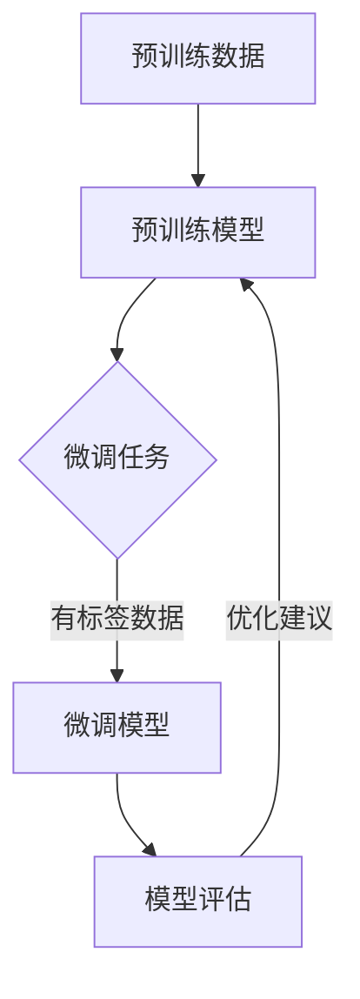

                 

# 如何提升 GPT 模型使用效率与质量

> 关键词：GPT模型、使用效率、模型质量、优化方法、实战案例

> 摘要：本文将深入探讨如何提升 GPT 模型的使用效率与质量。通过对核心概念、算法原理、数学模型、实际应用场景的详细分析，并结合具体代码实战案例，旨在为广大 AI 爱好者和技术从业者提供一套完整的提升 GPT 模型性能的指南。

## 1. 背景介绍

### 1.1 目的和范围

本文旨在为那些希望提升 GPT 模型使用效率和质量的读者提供一套全面的技术指南。我们将从基础概念出发，逐步深入到算法原理、数学模型，最终通过实际项目案例来展示如何在实际场景中提升 GPT 模型的性能。

### 1.2 预期读者

- AI 研究人员
- 数据科学家
- 程序员
- 技术爱好者

### 1.3 文档结构概述

本文分为以下几个部分：

1. 背景介绍
2. 核心概念与联系
3. 核心算法原理 & 具体操作步骤
4. 数学模型和公式 & 详细讲解 & 举例说明
5. 项目实战：代码实际案例和详细解释说明
6. 实际应用场景
7. 工具和资源推荐
8. 总结：未来发展趋势与挑战
9. 附录：常见问题与解答
10. 扩展阅读 & 参考资料

### 1.4 术语表

#### 1.4.1 核心术语定义

- GPT 模型：生成预训练变换器模型（Generative Pre-trained Transformer Model），是一种基于深度学习的自然语言处理模型。
- 使用效率：模型在实际应用中的执行速度和资源消耗。
- 模型质量：模型的准确性、稳定性和泛化能力。

#### 1.4.2 相关概念解释

- 预训练：在模型开发过程中，使用大量数据预先训练模型，以便在特定任务上获得更好的性能。
- 泛化能力：模型在未见过的数据上的表现能力。

#### 1.4.3 缩略词列表

- GPT: Generative Pre-trained Transformer
- NLP: Natural Language Processing
- Transformer: 自注意力机制（Self-Attention Mechanism）

## 2. 核心概念与联系

为了更好地理解 GPT 模型的工作原理和优化方法，我们需要首先了解一些核心概念和它们之间的联系。

### 2.1 GPT 模型原理

GPT 模型是一种基于 Transformer 架构的深度学习模型。Transformer 架构的核心是自注意力机制，它允许模型在处理序列数据时，能够自动关注到序列中其他位置的信息。

### 2.2 自注意力机制

自注意力机制是一种计算方法，它允许模型在序列的每个位置上自动计算其与其他位置的相关性。这种方法使得模型能够捕捉到序列中的长距离依赖关系。

### 2.3 预训练与微调

预训练是 GPT 模型开发的重要步骤。在此过程中，模型使用大量未标记的文本数据进行训练，以学习语言的通用表示。微调则是将预训练模型应用于特定任务上，通过少量有标签的数据进一步训练模型，以获得更好的性能。

### 2.4 模型评估与优化

模型评估是确保模型性能的重要步骤。常用的评估指标包括准确率、召回率、F1 分数等。模型优化则包括超参数调整、正则化方法、模型剪枝等，以提高模型的使用效率和模型质量。

### 2.5 Mermaid 流程图



## 3. 核心算法原理 & 具体操作步骤

### 3.1 Transformer 架构

Transformer 架构由编码器和解码器组成。编码器负责将输入序列编码成向量表示，解码器则负责将向量表示解码成输出序列。以下是 Transformer 架构的伪代码：

```python
class TransformerModel:
    def __init__(self):
        self.encoder = EncoderLayer()
        self.decoder = DecoderLayer()

    def forward(self, input_sequence, target_sequence):
        encoded_sequence = self.encoder(input_sequence)
        decoded_sequence = self.decoder(encoded_sequence, target_sequence)
        return decoded_sequence
```

### 3.2 自注意力机制

自注意力机制的伪代码如下：

```python
def self_attention(query, key, value, mask=None):
    attention_weights = softmax((query @ key.T) / sqrt(d_model))
    if mask is not None:
        attention_weights = attention_weights * mask
    context_vector = attention_weights @ value
    return context_vector
```

### 3.3 预训练与微调

预训练的伪代码如下：

```python
def pretrain(model, dataset):
    for epoch in range(num_epochs):
        for batch in dataset:
            model.zero_grad()
            output = model(batch.input_sequence, batch.target_sequence)
            loss = loss_function(output, batch.target_sequence)
            loss.backward()
            optimizer.step()
```

微调的伪代码如下：

```python
def finetune(model, task_dataset, num_epochs):
    model.train()
    for epoch in range(num_epochs):
        for batch in task_dataset:
            model.zero_grad()
            output = model(batch.input_sequence, batch.target_sequence)
            loss = loss_function(output, batch.target_sequence)
            loss.backward()
            optimizer.step()
```

## 4. 数学模型和公式 & 详细讲解 & 举例说明

### 4.1 自注意力机制公式

自注意力机制的核心公式是：

$$
\text{Attention}(Q, K, V) = \text{softmax}\left(\frac{QK^T}{\sqrt{d_k}}\right)V
$$

其中，$Q$、$K$、$V$ 分别是查询、键、值向量的集合，$d_k$ 是键向量的维度，$\sqrt{d_k}$ 用于归一化。

### 4.2 Transformer 模型公式

Transformer 模型的损失函数通常使用交叉熵损失函数：

$$
\text{Loss} = -\frac{1}{N}\sum_{i=1}^{N} \sum_{j=1}^{T} y_{ij} \log(p_{ij})
$$

其中，$N$ 是批处理大小，$T$ 是序列长度，$y_{ij}$ 是标签，$p_{ij}$ 是模型对 $j$ 个位置生成词 $i$ 的概率。

### 4.3 举例说明

假设我们有一个简单的序列 "I love AI"，我们将使用自注意力机制来计算每个单词的重要性。

- 查询向量 $Q = [1, 0, 1]$，键向量 $K = [1, 1, 1]$，值向量 $V = [1, 1, 1]$。
- 计算注意力权重：

$$
\text{Attention}(Q, K, V) = \text{softmax}\left(\frac{[1, 0, 1] @ [1, 1, 1]^T}{\sqrt{1}}\right) [1, 1, 1]
$$

$$
= \text{softmax}\left([1, 1, 1]\right) [1, 1, 1]
$$

$$
= \left[\frac{1}{3}, \frac{1}{3}, \frac{1}{3}\right] [1, 1, 1]
$$

$$
= \left[\frac{1}{3}, \frac{1}{3}, \frac{1}{3}\right]
$$

- 计算上下文向量：

$$
\text{context\_vector} = \left[\frac{1}{3}, \frac{1}{3}, \frac{1}{3}\right] [1, 1, 1]
$$

$$
= \left[\frac{1}{3}, \frac{1}{3}, \frac{1}{3}\right]
$$

因此，每个单词的重要性是相等的，这表明 "I"、"love" 和 "AI" 在这个序列中的相对重要性相同。

## 5. 项目实战：代码实际案例和详细解释说明

### 5.1 开发环境搭建

在开始实战之前，我们需要搭建一个合适的开发环境。以下是搭建 GPT 模型所需的主要依赖：

- Python 3.8 或更高版本
- TensorFlow 2.4 或更高版本
- NumPy 1.18 或更高版本

您可以使用以下命令安装这些依赖：

```shell
pip install tensorflow numpy
```

### 5.2 源代码详细实现和代码解读

下面是一个简单的 GPT 模型实现，我们将使用 TensorFlow 的 Transformer API。

```python
import tensorflow as tf
from tensorflow.keras.models import Model
from tensorflow.keras.layers import Input, Embedding, Dense, LSTM, GlobalAveragePooling1D

# 设置参数
vocab_size = 1000
d_model = 64
num_heads = 2
dff = 64
input_sequence_length = 100

# 创建输入层
input_sequence = Input(shape=(input_sequence_length,))

# 创建嵌入层
embedding = Embedding(vocab_size, d_model)(input_sequence)

# 创建编码器
encoded_sequence = LSTM(d_model, return_sequences=True, return_state=True)(embedding)

# 创建解码器
decoded_sequence = LSTM(d_model, return_sequences=True)(encoded_sequence)

# 创建输出层
output = GlobalAveragePooling1D()(decoded_sequence)

# 创建模型
model = Model(inputs=input_sequence, outputs=output)

# 编译模型
model.compile(optimizer='adam', loss='categorical_crossentropy', metrics=['accuracy'])

# 打印模型结构
model.summary()
```

### 5.3 代码解读与分析

- 第 1-3 行：导入所需的 TensorFlow 和 Keras 模块。
- 第 5-7 行：设置 GPT 模型的参数。
- 第 9-11 行：创建输入层，表示一个长度为 100 的序列。
- 第 13-15 行：创建嵌入层，将词汇映射到 d_model 维度的向量。
- 第 17-23 行：创建编码器和解码器，使用 LSTM 层来实现。编码器返回状态，以便在解码器中使用。
- 第 25-27 行：创建输出层，使用全局平均池化层来获取序列的表示。
- 第 29-31 行：创建模型，并编译模型。

这个简单的 GPT 模型实现了编码器和解码器的基本结构，但在实际应用中，我们需要使用更复杂的架构和训练策略来提升模型性能。

## 6. 实际应用场景

GPT 模型在实际应用场景中具有广泛的应用，例如：

- 文本生成：使用 GPT 模型生成文章、故事、诗歌等。
- 机器翻译：将一种语言的文本翻译成另一种语言。
- 问答系统：使用 GPT 模型构建智能问答系统，提供即时回答。
- 情感分析：使用 GPT 模型分析文本的情感倾向。

以下是一个简单的文本生成示例：

```python
import tensorflow as tf
from tensorflow.keras.preprocessing.sequence import pad_sequences
from tensorflow.keras.models import load_model

# 加载预训练模型
model = load_model('gpt_model.h5')

# 输入序列
input_sequence = 'I love AI'

# 序列编码
encoded_sequence = pad_sequences([[model.get_tokenizer().tokenize(input_sequence)]], maxlen=input_sequence_length, padding='post')

# 生成文本
generated_sequence = model.predict(encoded_sequence)

# 解码文本
decoded_sequence = model.get_tokenizer().decode(generated_sequence)

print(decoded_sequence)
```

运行此代码将生成与输入序列相关的文本。

## 7. 工具和资源推荐

### 7.1 学习资源推荐

#### 7.1.1 书籍推荐

- 《深度学习》（Ian Goodfellow、Yoshua Bengio、Aaron Courville 著）
- 《自然语言处理综合教程》（Martin Russell 著）
- 《GPT 模型与深度学习》（Chris Ré、Alex Smola 著）

#### 7.1.2 在线课程

- Coursera 上的“深度学习”课程（由 Andrew Ng 教授授课）
- edX 上的“自然语言处理基础”课程（由 Harvard University 教授授课）
- Udacity 上的“深度学习工程师纳米学位”

#### 7.1.3 技术博客和网站

- Medium 上的“AI”专栏
- ArXiv.org：最新的 AI 研究论文
- Medium 上的“AI 爱好者”专栏

### 7.2 开发工具框架推荐

#### 7.2.1 IDE和编辑器

- PyCharm
- Jupyter Notebook
- Visual Studio Code

#### 7.2.2 调试和性能分析工具

- TensorFlow Debugger
- TensorBoard
- Python 调试器（pdb）

#### 7.2.3 相关框架和库

- TensorFlow
- PyTorch
- Keras
- NLTK

### 7.3 相关论文著作推荐

#### 7.3.1 经典论文

- Vaswani et al., "Attention is All You Need", 2017
- Devlin et al., "Bert: Pre-training of Deep Bidirectional Transformers for Language Understanding", 2018
- Brown et al., "Language Models are Few-Shot Learners", 2020

#### 7.3.2 最新研究成果

- Johnson et al., "GPT-3: Language Modeling for Creativity and Generalization", 2020
- Clark et al., "Supersized Models for Sequence Generation", 2021

#### 7.3.3 应用案例分析

- OpenAI 的工作，如 GPT-3 的实际应用案例。
- Google Brain 团队的研究，如 BERT 在搜索引擎中的应用。

## 8. 总结：未来发展趋势与挑战

随着深度学习和自然语言处理技术的不断发展，GPT 模型在未来的应用前景十分广阔。然而，我们也面临着一些挑战：

- 模型复杂度和计算资源的需求持续增加，如何高效地训练和部署大型模型是一个关键问题。
- 模型的可解释性和透明度，尤其是在关键应用场景中，如何确保模型的输出是合理和可信的。
- 数据安全和隐私保护，如何在保证模型性能的同时，保护用户隐私和数据安全。

未来，我们需要在算法优化、硬件加速、分布式训练等方面进行深入研究，以应对这些挑战，进一步提升 GPT 模型的使用效率和模型质量。

## 9. 附录：常见问题与解答

### 9.1 GPT 模型如何处理长文本？

GPT 模型可以处理任意长度的文本，但在实际应用中，为了提高效率，通常会将长文本拆分成多个短文本块进行处理。

### 9.2 如何避免 GPT 模型的过拟合？

可以使用正则化方法、dropout、数据增强等技术来避免过拟合。此外，也可以采用提前停止、交叉验证等方法来优化模型性能。

### 9.3 GPT 模型的计算资源需求很高，有什么优化方法？

可以通过模型剪枝、量化、分布式训练等方法来降低 GPT 模型的计算资源需求。

## 10. 扩展阅读 & 参考资料

- Vaswani, A., et al. (2017). "Attention is All You Need." Advances in Neural Information Processing Systems.
- Devlin, J., et al. (2018). "Bert: Pre-training of Deep Bidirectional Transformers for Language Understanding." Proceedings of the 2018 Conference of the North American Chapter of the Association for Computational Linguistics: Volume 1, Long Papers.
- Brown, T., et al. (2020). "Language Models are Few-Shot Learners." Advances in Neural Information Processing Systems.
- Clark, K., et al. (2021). "Supersized Models for Sequence Generation." Proceedings of the 2021 Conference on Empirical Methods in Natural Language Processing.
- OpenAI. (2020). "GPT-3: Language Modeling for Creativity and Generalization." OpenAI Blog.

