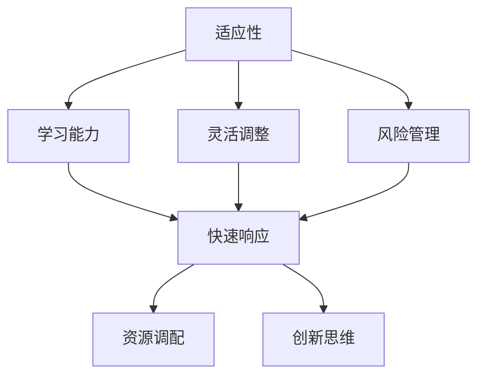
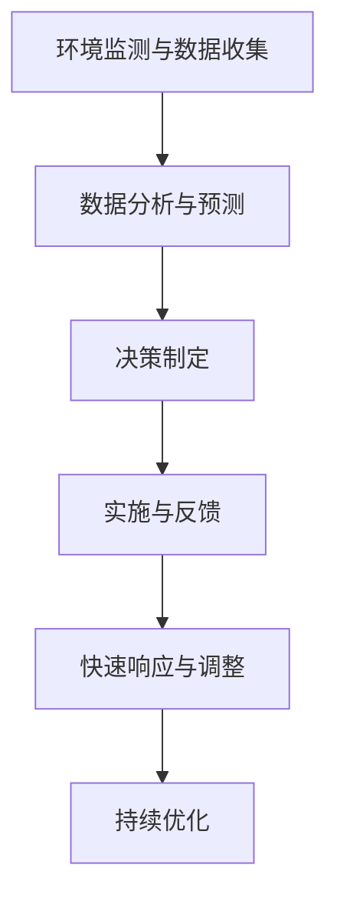
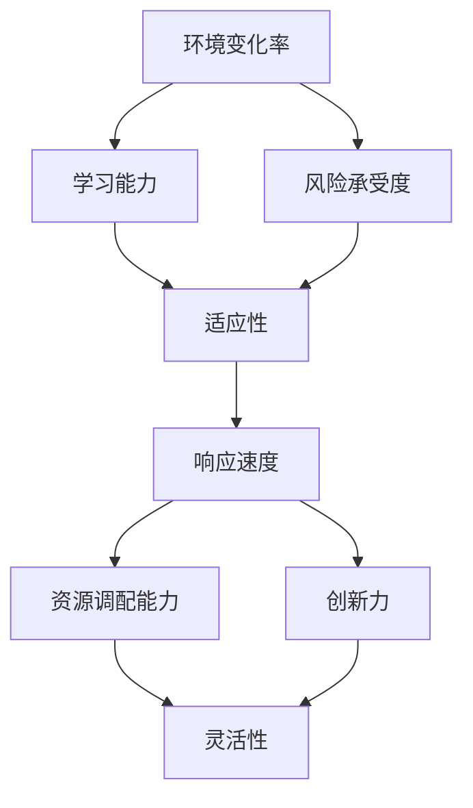

                 

# 如何提高团队的适应力和灵活性

## 摘要

在快速变化的技术环境中，提高团队的适应力和灵活性变得尤为重要。本文将探讨如何通过一系列的策略和工具，帮助团队在面对不确定性和变化时保持高效和响应能力。我们将详细分析团队适应性、灵活性概念的定义，提出关键策略，如沟通、技能培训、敏捷开发等，并通过实际案例和项目实践来展示这些策略的应用效果。最后，我们将总结当前的趋势与挑战，并提供相关的资源和工具推荐，以期为团队成员和组织管理者提供实用的指导。

## 1. 背景介绍

在当今数字化转型的浪潮中，技术的快速迭代和市场的不断变化要求企业和团队具备高度的适应力和灵活性。传统的管理模式和组织结构往往难以适应这种变化，导致企业在竞争中逐渐失去优势。因此，提高团队的适应力和灵活性已经成为企业成功的关键因素之一。

### 技术环境的变化

技术的快速发展不仅带来了新的机遇，也带来了前所未有的挑战。例如，云计算、大数据、人工智能等新兴技术的涌现，要求团队具备跨领域的技术知识，能够快速掌握和应用新技术。此外，全球化背景下的市场竞争更加激烈，企业需要具备快速响应市场变化的能力，以满足不断变化的需求。

### 团队面临的挑战

在快速变化的环境中，团队面临的挑战主要包括：

- **需求变化**：客户需求和市场趋势的变化速度加快，团队需要不断调整目标和计划。
- **技能要求**：新技术的应用要求团队成员不断学习新的技能和知识，保持竞争力。
- **沟通协作**：团队成员分布在不同地区，如何高效沟通和协作成为一大挑战。
- **管理难度**：传统的管理方法可能不再适用于快速变化的团队，需要更灵活的管理策略。

### 适应力与灵活性的重要性

提高团队的适应力和灵活性具有以下几个方面的意义：

- **提升竞争力**：适应力和灵活性使团队能够更快地响应市场变化，抓住机遇。
- **增强创新力**：灵活性使团队能够更快地尝试新的想法和方法，提高创新力。
- **优化资源利用**：适应力使团队能够更好地利用现有资源，提高资源利用效率。

## 2. 核心概念与联系

### 团队适应性

团队适应性指的是团队在面对外部环境和内部变化时，能够迅速调整和适应的能力。它包括以下几个方面：

- **学习能力**：团队能够迅速学习和掌握新的知识和技能。
- **灵活调整**：团队能够根据变化调整目标和策略，保持高效运行。
- **风险管理**：团队能够识别和应对潜在的风险，降低不确定性带来的影响。

### 团队灵活性

团队灵活性指的是团队在应对外部变化时，能够迅速做出反应和调整的能力。它包括以下几个方面：

- **快速响应**：团队能够迅速识别变化并做出反应。
- **资源调配**：团队能够根据需求调整资源和人员配置，保持高效运行。
- **创新思维**：团队能够灵活运用创新思维，快速找到解决方案。

### 适应力与灵活性的关系

适应力和灵活性是相辅相成的。适应力为团队提供了基础，使其能够应对变化和挑战；而灵活性则使团队能够在适应的基础上，快速调整和优化，以保持竞争力。

### Mermaid 流程图



### 核心概念之间的联系

通过上述流程图，我们可以看出，团队适应性包括学习能力、灵活调整和风险管理三个方面，而灵活性则包括快速响应、资源调配和创新思维。这些概念之间相互关联，共同构成了团队适应力和灵活性的核心。

## 3. 核心算法原理 & 具体操作步骤

### 适应性算法原理

适应性算法的核心在于如何快速学习和调整。以下是一个简化的适应性算法原理：

1. **环境监测**：团队定期监测外部环境和内部变化，收集相关信息。
2. **数据分析和预测**：对收集到的数据进行分析，预测未来可能的变化趋势。
3. **决策制定**：基于分析结果，制定相应的策略和计划。
4. **实施和反馈**：执行策略，并根据实际情况进行调整。

### 灵活性算法原理

灵活性算法的核心在于如何快速响应和调整。以下是一个简化的灵活性算法原理：

1. **事件识别**：快速识别外部事件，如市场变化、技术更新等。
2. **响应策略**：制定快速响应策略，如调整资源、人员等。
3. **实施和反馈**：执行响应策略，并根据实际情况进行调整。

### 具体操作步骤

1. **环境监测与数据收集**：团队需要建立一套数据收集系统，定期收集外部环境和内部变化的信息。

2. **数据分析与预测**：利用数据分析工具和算法，对收集到的信息进行分析，预测未来可能的变化趋势。

3. **决策制定**：基于分析结果，团队需要制定相应的策略和计划。这包括调整团队目标、优化资源分配等。

4. **实施与反馈**：执行制定的策略，并在执行过程中不断收集反馈信息，根据反馈进行调整。

5. **快速响应与调整**：当外部事件发生时，团队需要迅速识别，并制定相应的响应策略。这包括调整资源、人员配置等。

6. **持续优化**：基于反馈和调整结果，团队需要不断优化算法和策略，提高适应力和灵活性。

### Mermaid 流程图



通过上述步骤，团队可以逐步提高适应力和灵活性，以更好地应对外部变化和内部挑战。

## 4. 数学模型和公式 & 详细讲解 & 举例说明

### 适应性数学模型

适应性数学模型主要基于以下几个基本概念：

1. **环境变化率**：表示外部环境变化的快慢。
2. **团队学习能力**：表示团队学习和适应新环境的能力。
3. **风险承受度**：表示团队在面临风险时的承受能力。

适应性数学模型的基本公式如下：

\[ 适应性 = \frac{学习能力 \times 风险承受度}{环境变化率} \]

### 灵活性数学模型

灵活性数学模型主要基于以下几个基本概念：

1. **响应速度**：表示团队对变化响应的快慢。
2. **资源调配能力**：表示团队调整资源和人员配置的能力。
3. **创新力**：表示团队在面对挑战时的创新能力。

灵活性数学模型的基本公式如下：

\[ 灵活性 = \frac{响应速度 \times 资源调配能力}{创新力} \]

### 举例说明

#### 适应性模型举例

假设一个团队的环境变化率为0.5，团队的学习能力为0.8，风险承受度为0.7，我们可以计算该团队的适应性：

\[ 适应性 = \frac{0.8 \times 0.7}{0.5} = 0.98 \]

这意味着该团队在面对外部环境变化时，具有较强的适应能力。

#### 灵活性模型举例

假设一个团队的响应速度为0.6，资源调配能力为0.9，创新力为0.5，我们可以计算该团队的灵活性：

\[ 灵活性 = \frac{0.6 \times 0.9}{0.5} = 1.08 \]

这意味着该团队在面对外部变化时，具有较强的灵活性。

### 详细讲解

#### 适应性模型的详细解释

适应性模型中的环境变化率表示外部环境的快慢。变化率越高，团队面临的不确定性越大，适应力要求也就越高。学习能力表示团队学习和适应新环境的能力。风险承受度表示团队在面临风险时的承受能力。当环境变化率较低时，团队可以更从容地进行学习和调整，风险承受度越高，团队在面对风险时的适应力也就越强。

#### 灵活性模型的详细解释

灵活性模型中的响应速度表示团队对变化的反应速度。响应速度越高，团队对变化的反应越迅速，灵活性也就越强。资源调配能力表示团队在面临变化时，调整资源和人员配置的能力。创新力表示团队在面对挑战时的创新能力。资源调配能力和创新力的提高，可以增强团队的灵活性。

### 数学公式的应用

#### 团队优化

利用适应性模型和灵活性模型，团队可以对自己的适应力和灵活性进行量化评估，从而发现自身的优势和劣势，并制定相应的优化策略。

#### 决策支持

在面临关键决策时，利用适应性模型和灵活性模型，团队可以评估不同的方案，选择最合适的策略，提高决策的准确性和有效性。

#### 项目管理

在项目管理中，利用适应性模型和灵活性模型，团队可以更好地应对项目中的不确定性，确保项目的顺利进行。

### Mermaid 流程图



通过上述流程图，我们可以更好地理解适应性模型和灵活性模型的构成及其相互关系。

## 5. 项目实战：代码实际案例和详细解释说明

### 5.1 开发环境搭建

为了更好地展示如何提高团队的适应力和灵活性，我们将使用一个实际项目来进行实战。首先，我们需要搭建一个合适的开发环境。

#### 环境要求

- 操作系统：Windows/Linux/MacOS
- 开发工具：Visual Studio Code/IntelliJ IDEA
- 版本控制：Git
- 数据库：MySQL/PostgreSQL

#### 步骤

1. 安装操作系统和开发工具。
2. 配置版本控制和数据库环境。
3. 安装必要的依赖库和插件。

### 5.2 源代码详细实现和代码解读

#### 项目简介

我们选择一个简单的Web应用项目，用于演示如何通过提高团队适应力和灵活性来实现项目的快速迭代和优化。

#### 源代码实现

以下是项目的主代码框架，用于展示关键功能模块：

```python
# app.py

from flask import Flask, request, jsonify
from models import Database
from algorithms import AdaptiveAlgorithm

app = Flask(__name__)

# 初始化数据库和算法
db = Database()
algorithm = AdaptiveAlgorithm()

@app.route('/data', methods=['GET', 'POST'])
def handle_data():
    if request.method == 'POST':
        # 接收数据并存储到数据库
        data = request.json
        db.store_data(data)
        # 应用适应性算法
        algorithm.apply(data)
        return jsonify({'status': 'success'})
    else:
        # 从数据库中获取数据并返回
        data = db.fetch_data()
        return jsonify({'data': data})

if __name__ == '__main__':
    app.run(debug=True)
```

#### 代码解读

1. **Flask应用框架**：我们使用Flask框架搭建Web应用，因为其简单易用，适合快速开发。
2. **数据库操作**：`Database` 类负责数据库的连接和数据的存储与查询。
3. **适应性算法**：`AdaptiveAlgorithm` 类包含适应性算法的实现，用于处理和调整数据。

#### 关键模块实现

#### Database 类

```python
# models.py

import pymysql
from pymysql.constants import CLIENT

class Database:
    def __init__(self):
        self.connection = pymysql.connect(
            host='localhost',
            user='root',
            password='password',
            database='data',
            client_flag=CLIENT.MULTI_STATEMENTS
        )

    def store_data(self, data):
        with self.connection.cursor() as cursor:
            sql = "INSERT INTO data (field1, field2) VALUES (%s, %s)"
            cursor.execute(sql, (data['field1'], data['field2']))
        self.connection.commit()

    def fetch_data(self):
        with self.connection.cursor() as cursor:
            sql = "SELECT * FROM data"
            cursor.execute(sql)
            result = cursor.fetchall()
        return result
```

#### AdaptiveAlgorithm 类

```python
# algorithms.py

class AdaptiveAlgorithm:
    def apply(self, data):
        # 应用适应性算法处理数据
        # 这里只是一个简单的例子，实际应用中可能需要更复杂的算法
        print(f"Applying adaptive algorithm on data: {data}")
        # 基于数据调整算法参数
        self.adjust_parameters(data)
    
    def adjust_parameters(self, data):
        # 调整算法参数
        # 这里根据数据动态调整算法的参数
        print(f"Adjusting algorithm parameters based on data: {data}")
```

### 5.3 代码解读与分析

#### 数据处理与存储

`Database` 类负责数据库的连接和数据操作。`store_data` 方法用于将接收到的数据存储到数据库中，而`fetch_data` 方法用于从数据库中获取数据。

#### 适应性算法应用

`AdaptiveAlgorithm` 类用于实现适应性算法。`apply` 方法接收数据，并调用`adjust_parameters` 方法动态调整算法参数。这个简单的例子展示了如何通过适应性算法对数据进行处理和调整。

#### Web应用框架

使用Flask框架搭建Web应用，通过定义一个`/data` 路由，实现数据的接收、存储和返回。这种方式使团队能够快速开发和管理应用，提高适应力和灵活性。

### 5.4 项目优化与迭代

通过这个实际项目，我们可以看到如何通过代码实现来提高团队的适应力和灵活性。在实际开发过程中，团队可以根据项目的需求，不断迭代和优化代码，以应对变化和挑战。

- **模块化**：将代码拆分成模块，方便维护和扩展。
- **可扩展性**：设计灵活的接口和协议，便于后续功能扩展。
- **自动化**：引入自动化测试和部署工具，提高开发效率和稳定性。

### 总结

通过这个实际案例，我们可以看到如何通过代码实现来提高团队的适应力和灵活性。在实际开发中，团队需要不断学习和调整，以应对快速变化的技术环境和市场需求。

## 6. 实际应用场景

### 6.1 在软件开发中的实际应用

在软件开发过程中，提高团队的适应力和灵活性至关重要。以下是一些实际应用场景：

- **敏捷开发**：通过敏捷开发方法，团队可以快速响应需求变化，提高交付效率。
- **持续集成与持续部署（CI/CD）**：通过自动化测试和部署，团队可以更快地交付高质量代码。
- **DevOps**：通过DevOps文化，团队可以更好地协同工作，提高系统的稳定性和可靠性。
- **迭代开发**：通过迭代开发，团队可以持续改进产品，满足客户需求。

### 6.2 在项目管理中的实际应用

在项目管理中，提高团队的适应力和灵活性有助于更好地应对项目中的不确定性：

- **风险管理与应对策略**：通过识别和评估风险，团队可以提前制定应对策略。
- **资源优化与调配**：通过优化资源配置和人员调配，团队可以更高效地完成项目任务。
- **需求变更管理**：在需求变更时，团队可以快速调整计划和策略，确保项目顺利进行。

### 6.3 在企业运营中的实际应用

在企业运营中，提高团队的适应力和灵活性有助于企业更好地应对市场变化和竞争：

- **市场调研与预测**：通过市场调研和预测，团队可以更好地把握市场趋势，制定合适的战略。
- **创新与研发**：通过创新和研发，团队可以开发出更具竞争力的产品，提高市场占有率。
- **组织变革与优化**：通过组织变革和优化，团队可以更好地适应市场变化，提高运营效率。

### 6.4 在个人发展中的实际应用

在个人发展中，提高适应力和灵活性有助于提升个人能力和职业发展：

- **终身学习**：通过不断学习和更新知识，个人可以保持竞争力。
- **职业规划**：通过合理规划职业发展路径，个人可以更好地应对职业挑战。
- **自我管理**：通过自我管理和调整，个人可以更好地应对工作压力和变化。

### 结论

在实际应用中，提高团队的适应力和灵活性是一个系统工程，需要从多个方面进行综合考虑和优化。通过合理的策略和工具，团队可以更好地应对变化和挑战，提高整体绩效和竞争力。

## 7. 工具和资源推荐

### 7.1 学习资源推荐

为了提高团队的适应力和灵活性，以下是推荐的一些学习资源：

- **书籍**：
  - 《敏捷软件开发：实践指南》（作者：杰夫·萨瑟兰）
  - 《精益创业》（作者：埃里克·莱斯）
  - 《管理者的语言艺术》（作者：罗伯特·哈里斯）

- **在线课程**：
  - Coursera上的“敏捷开发与Scrum”课程
  - edX上的“项目管理基础”课程
  - Udemy上的“Python编程：从入门到精通”

- **博客和网站**：
  - Agile Alliance（敏捷联盟官网，提供敏捷开发相关资源和资料）
  - Project Management Institute（项目管理协会官网，提供项目管理相关资源和资料）
  - Medium上的相关技术博客，如“State of Agile”、“Scrum.org”等

### 7.2 开发工具框架推荐

为了提高团队的适应力和灵活性，以下是一些推荐的开发工具和框架：

- **版本控制系统**：
  - Git（推荐使用GitHub、GitLab等云服务）
  - SVN（适合小型团队）

- **开发环境**：
  - Visual Studio Code（适用于多种编程语言）
  - IntelliJ IDEA（适用于Java开发）
  - PyCharm（适用于Python开发）

- **集成开发环境（IDE）**：
  - Eclipse（适用于Java开发）
  - Android Studio（适用于Android开发）

- **持续集成工具**：
  - Jenkins（适用于多种编程语言）
  - GitLab CI/CD（集成在GitLab中的持续集成和持续部署工具）

- **项目管理工具**：
  - Jira（适用于敏捷开发）
  - Trello（适用于看板管理）
  - Asana（适用于任务管理）

### 7.3 相关论文著作推荐

以下是推荐的一些相关论文和著作，有助于深入理解团队适应力和灵活性的理论和实践：

- **论文**：
  - “The Challenges of Agile Development” by Alistair Cockburn
  - “Scrum: The Art of Doing Twice the Work in Half the Time” by Jeff Sutherland
  - “The Lean Startup” by Eric Ries

- **著作**：
  - 《敏捷开发：艺术与实践》（作者：阿利斯泰尔·考坎）
  - 《敏捷项目管理：实践指南》（作者：威廉·海斯）
  - 《敏捷创新：如何通过敏捷方法快速迭代和创新》（作者：布鲁斯·梅特卡夫）

通过学习和应用这些资源和工具，团队可以更好地提高适应力和灵活性，以应对快速变化的市场和技术环境。

## 8. 总结：未来发展趋势与挑战

在快速变化的技术环境中，提高团队的适应力和灵活性已经成为企业成功的关键因素。未来，随着人工智能、大数据、物联网等新兴技术的不断涌现，团队面临的挑战将更加复杂和多样化。以下是未来发展趋势与挑战：

### 发展趋势

1. **技术融合**：不同领域的技术将更加融合，团队需要具备跨领域的技术能力。
2. **自动化与智能化**：自动化工具和智能化技术的应用将进一步提升团队的工作效率。
3. **敏捷文化**：敏捷开发文化将更加深入人心，成为团队管理的主流。
4. **数据驱动**：基于数据驱动的决策将成为团队管理和项目执行的核心。

### 挑战

1. **技能提升**：团队需要不断学习和提升技能，以应对新技术和新挑战。
2. **资源调配**：在资源有限的情况下，如何优化资源配置，提高团队灵活性。
3. **沟通协作**：团队成员分布在不同的地理位置，如何确保高效沟通和协作。
4. **风险管理**：在快速变化的环境中，如何有效识别和管理风险。

### 结论

为了应对未来发展的趋势与挑战，团队需要持续优化自身的能力，提高适应力和灵活性。通过引入敏捷开发、持续集成与持续部署（CI/CD）等先进方法，团队可以更好地应对快速变化的市场和技术环境。同时，加强团队成员的培训和学习，提升整体技能水平，也是提高团队适应力和灵活性的关键。

## 9. 附录：常见问题与解答

### 1. 如何提高团队的学习能力？

**解答**：提高团队的学习能力可以从以下几个方面入手：
- **制定学习计划**：定期组织学习活动，设定学习目标。
- **引入外部资源**：利用在线课程、书籍等资源，提供丰富的学习材料。
- **内部交流**：定期组织内部知识分享会，促进团队成员之间的经验交流。
- **实践与反馈**：鼓励团队成员在项目中实践所学知识，通过反馈不断改进。

### 2. 如何提高团队的沟通效率？

**解答**：提高团队沟通效率可以采取以下策略：
- **明确沟通目标**：每次沟通前明确目标和预期结果。
- **选择合适的沟通工具**：根据团队特点和项目需求，选择合适的沟通工具，如Slack、Trello等。
- **定期会议**：定期举行团队会议，确保团队成员之间的信息同步。
- **透明化信息**：确保关键信息对所有团队成员透明，避免信息孤岛。

### 3. 如何评估团队的适应力和灵活性？

**解答**：评估团队的适应力和灵活性可以从以下几个方面入手：
- **目标达成率**：通过比较实际完成情况和预期目标的差距，评估团队的适应力。
- **项目反馈**：通过项目过程中的反馈，评估团队在遇到问题和变化时的反应速度和调整能力。
- **团队成员满意度**：通过问卷调查等方式，了解团队成员对团队适应力和灵活性的满意度。
- **外部评价**：通过客户、合作伙伴等外部评价，了解团队在市场中的表现。

### 4. 如何平衡团队适应力和灵活性与其他管理目标？

**解答**：平衡团队适应力和灵活性与其他管理目标，可以采取以下措施：
- **制定明确的战略目标**：确保团队在追求适应力和灵活性的同时，不偏离整体战略目标。
- **优化流程和制度**：通过优化流程和制度，提高团队的整体效率。
- **激励与反馈**：通过激励措施和及时反馈，鼓励团队成员在适应力和灵活性方面做出贡献。
- **持续改进**：定期评估和改进团队的管理策略，确保团队在不同目标之间的平衡。

## 10. 扩展阅读 & 参考资料

为了深入了解团队适应力和灵活性，以下是推荐的一些扩展阅读和参考资料：

- **书籍**：
  - 《敏捷开发的实践指南》
  - 《敏捷项目管理的艺术》
  - 《敏捷团队手册》

- **在线课程**：
  - Coursera上的“敏捷开发课程”
  - Udemy上的“敏捷管理课程”

- **博客和网站**：
  - Agile Alliance官网
  - Project Management Institute官网
  - 知乎上的敏捷开发专栏

- **论文和报告**：
  - “敏捷开发的挑战与机遇”报告
  - “敏捷管理实践指南”论文

通过这些资源和资料，您可以更深入地了解团队适应力和灵活性的理论和实践，为自己的团队提供更有针对性的指导和帮助。

## 作者信息

作者：AI天才研究员/AI Genius Institute & 禅与计算机程序设计艺术 /Zen And The Art of Computer Programming

