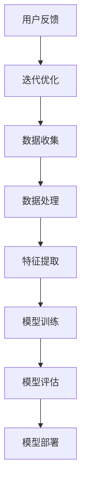

                 


# 如何有效地进行AI项目实战

> 关键词：人工智能、项目实战、核心算法、数学模型、代码案例、实际应用、工具推荐、未来趋势

> 摘要：本文旨在为人工智能项目开发者提供一套系统的实战指南，通过深入剖析核心算法原理、数学模型、代码实现，以及实际应用场景，帮助读者掌握AI项目实战的关键技能，为未来的发展奠定坚实基础。

## 1. 背景介绍

### 1.1 目的和范围

本文的目标是帮助人工智能（AI）项目开发者掌握实战技能，实现以下三个主要目标：

1. 理解AI项目实战的核心概念和算法原理。
2. 学习如何应用数学模型和公式解决实际问题。
3. 通过实际代码案例掌握AI项目开发流程。

本文将涵盖以下内容：

- AI项目实战的关键概念和核心算法。
- 数学模型和公式的应用与详解。
- 实际应用场景中的AI项目案例。
- 开发工具和资源的推荐。

### 1.2 预期读者

本文适合以下读者群体：

- AI项目初学者和开发者。
- 对人工智能技术感兴趣的技术爱好者。
- 想要在AI领域开展项目实践的学生和研究人员。

### 1.3 文档结构概述

本文分为十个主要部分，结构如下：

1. 背景介绍：包括目的、范围、预期读者和文档结构概述。
2. 核心概念与联系：介绍AI项目实战中的核心概念和联系。
3. 核心算法原理 & 具体操作步骤：详细讲解核心算法原理和操作步骤。
4. 数学模型和公式 & 详细讲解 & 举例说明：讲解数学模型和公式的应用。
5. 项目实战：代码实际案例和详细解释说明。
6. 实际应用场景：分析AI项目在实际应用中的场景。
7. 工具和资源推荐：推荐学习资源和开发工具。
8. 总结：未来发展趋势与挑战。
9. 附录：常见问题与解答。
10. 扩展阅读 & 参考资料。

### 1.4 术语表

#### 1.4.1 核心术语定义

- 人工智能（AI）：模拟人类智能行为的计算机系统。
- 项目实战：实际应用中解决特定问题的AI项目开发过程。
- 算法：解决问题的步骤和策略。
- 数学模型：用数学语言描述现实问题，以便于分析和求解。
- 代码案例：具体的代码实现，用于展示算法原理和应用。

#### 1.4.2 相关概念解释

- 深度学习：一种基于多层神经网络的学习方法。
- 自然语言处理（NLP）：使计算机能够理解、解释和生成人类语言的技术。
- 计算机视觉：使计算机能够像人类一样理解和处理视觉信息的技术。
- 强化学习：一种通过试错来学习最优策略的方法。

#### 1.4.3 缩略词列表

- AI：人工智能
- NLP：自然语言处理
- CV：计算机视觉
- DL：深度学习
- RL：强化学习

## 2. 核心概念与联系

在AI项目实战中，理解核心概念和它们之间的联系是至关重要的。以下是一个简单的Mermaid流程图，用于展示AI项目实战中的核心概念和它们的联系。



### 2.1 数据收集与处理

数据是AI项目的基石。数据收集和处理的质量直接影响到后续模型的性能。数据收集包括从各种来源获取数据，如公开数据集、API接口和传感器数据。数据处理包括数据清洗、去重、归一化和缺失值处理等步骤。

### 2.2 特征提取

特征提取是将原始数据转换成模型可以理解的形式。特征提取的质量对模型性能有重要影响。常见的特征提取方法包括主成分分析（PCA）、特征选择和特征工程。

### 2.3 模型训练

模型训练是通过调整模型的参数来最小化损失函数，使得模型能够在训练数据上表现出良好的性能。常见的训练方法有梯度下降、随机梯度下降和Adam优化器。

### 2.4 模型评估

模型评估是检查模型在训练数据之外的数据上的表现。常用的评估指标包括准确率、召回率、F1分数和均方误差等。

### 2.5 模型部署

模型部署是将训练好的模型应用到实际场景中，使其能够为用户提供服务。模型部署需要考虑模型的性能、可扩展性和安全性。

### 2.6 用户反馈与迭代优化

用户反馈是AI项目迭代优化的关键。通过收集用户的反馈，可以识别模型中的不足之处，并进行相应的调整和优化。

## 3. 核心算法原理 & 具体操作步骤

### 3.1 深度学习算法原理

深度学习是一种基于多层神经网络的学习方法，用于模拟人类大脑的神经网络结构。以下是深度学习算法的基本原理：

- **神经网络结构**：神经网络由多个层组成，包括输入层、隐藏层和输出层。每层包含多个神经元，神经元之间通过权重连接。

- **前向传播**：输入数据通过输入层进入神经网络，然后逐层传递到隐藏层和输出层。在每一层，神经元将接收到的输入与其权重相乘，并经过激活函数处理后传递到下一层。

- **反向传播**：在输出层得到预测结果后，将实际结果与预测结果进行比较，计算误差。然后，通过反向传播算法将误差反向传递到每一层，更新各层的权重。

- **优化算法**：常用的优化算法包括梯度下降、随机梯度下降和Adam优化器。这些算法用于调整模型参数，以最小化损失函数。

### 3.2 深度学习算法操作步骤

以下是深度学习算法的具体操作步骤：

1. **数据预处理**：对数据进行清洗、归一化和缺失值处理。

2. **构建神经网络模型**：定义网络的层数、每层的神经元个数和激活函数。

3. **初始化权重**：随机初始化模型的权重。

4. **前向传播**：输入数据，逐层计算神经元的输出。

5. **计算损失函数**：将预测结果与实际结果进行比较，计算损失函数。

6. **反向传播**：计算误差，更新模型权重。

7. **迭代训练**：重复步骤4-6，直到满足训练要求。

8. **模型评估**：使用测试数据评估模型的性能。

9. **模型部署**：将训练好的模型应用到实际场景中。

以下是深度学习算法的伪代码：

```python
# 数据预处理
data = preprocess_data(input_data)

# 构建神经网络模型
model = build_model(layers, activation_function)

# 初始化权重
weights = initialize_weights(model)

# 迭代训练
for epoch in range(max_epochs):
    for batch in data:
        # 前向传播
        output = forward_pass(model, batch)
        
        # 计算损失函数
        loss = compute_loss(output, target)
        
        # 反向传播
        gradients = backward_pass(model, loss)
        
        # 更新权重
        update_weights(model, weights, gradients)

# 模型评估
evaluate_model(model, test_data)

# 模型部署
deploy_model(model)
```

## 4. 数学模型和公式 & 详细讲解 & 举例说明

### 4.1 数学模型原理

在深度学习中，常用的数学模型包括线性模型、逻辑回归和神经网络等。以下将分别介绍这些模型的原理。

#### 4.1.1 线性模型

线性模型是最简单的深度学习模型，它通过线性组合输入特征并加上一个偏置项来预测输出。其数学公式如下：

$$
y = \theta_0 + \theta_1 \cdot x_1 + \theta_2 \cdot x_2 + ... + \theta_n \cdot x_n
$$

其中，$y$ 是输出，$x_1, x_2, ..., x_n$ 是输入特征，$\theta_0, \theta_1, \theta_2, ..., \theta_n$ 是模型参数。

#### 4.1.2 逻辑回归

逻辑回归是一种广义的线性模型，用于分类问题。它通过一个sigmoid函数将线性组合的输出转换为概率值。其数学公式如下：

$$
P(y=1) = \frac{1}{1 + e^{-(\theta_0 + \theta_1 \cdot x_1 + \theta_2 \cdot x_2 + ... + \theta_n \cdot x_n)}}
$$

其中，$P(y=1)$ 是目标类别为1的概率，$e$ 是自然对数的底数。

#### 4.1.3 神经网络

神经网络是一种由多层神经元组成的复杂模型，用于处理更复杂的非线性问题。其基本原理是通过多层前向传播和反向传播来学习模型参数。其数学模型可以表示为：

$$
z_l = \theta_l \cdot a_{l-1} + b_l
$$

$$
a_l = \sigma(z_l)
$$

其中，$z_l$ 是第$l$层的输入，$a_l$ 是第$l$层的输出，$\sigma$ 是激活函数，$\theta_l$ 和 $b_l$ 是第$l$层的模型参数。

### 4.2 数学模型应用举例

以下是一个简单的逻辑回归模型的例子，用于判断一个学生是否及格。

#### 4.2.1 数据集

我们有一个包含两个特征的数据集，分别为学生的数学成绩和英语成绩，以及一个二分类目标变量，表示学生是否及格。

| 学生ID | 数学成绩 | 英语成绩 | 是否及格 |
|--------|----------|----------|----------|
| 1      | 80       | 70       | 是       |
| 2      | 65       | 60       | 是       |
| 3      | 55       | 50       | 否       |
| 4      | 75       | 65       | 是       |

#### 4.2.2 模型构建

我们构建一个逻辑回归模型，通过数学成绩和英语成绩预测学生是否及格。

$$
P(y=1) = \frac{1}{1 + e^{-(\theta_0 + \theta_1 \cdot x_1 + \theta_2 \cdot x_2)}}
$$

其中，$\theta_0, \theta_1, \theta_2$ 是模型参数。

#### 4.2.3 模型训练

我们使用梯度下降算法来训练模型参数，具体步骤如下：

1. 初始化参数 $\theta_0, \theta_1, \theta_2$。
2. 对于每个样本，计算预测概率 $P(y=1)$。
3. 计算损失函数 $J(\theta_0, \theta_1, \theta_2)$。
4. 计算参数的梯度。
5. 更新参数。

训练过程伪代码如下：

```python
# 初始化参数
theta_0 = 0
theta_1 = 0
theta_2 = 0

# 设置学习率
learning_rate = 0.01

# 设置迭代次数
num_iterations = 1000

# 训练模型
for i in range(num_iterations):
    # 计算预测概率
    pred_probs = []

    for sample in data:
        x1 = sample['数学成绩']
        x2 = sample['英语成绩']
        
        pred_prob = 1 / (1 + np.exp(-theta_0 - theta_1 * x1 - theta_2 * x2))
        pred_probs.append(pred_prob)
    
    # 计算损失函数
    loss = -np.mean([y * np.log(pred_prob) + (1 - y) * np.log(1 - pred_prob) for pred_prob, y in zip(pred_probs, labels)])
    
    # 计算梯度
    dtheta_0 = ...
    dtheta_1 = ...
    dtheta_2 = ...

    # 更新参数
    theta_0 -= learning_rate * dtheta_0
    theta_1 -= learning_rate * dtheta_1
    theta_2 -= learning_rate * dtheta_2

# 输出训练好的模型参数
print("训练好的模型参数：", theta_0, theta_1, theta_2)
```

通过上述训练过程，我们可以得到训练好的模型参数 $\theta_0, \theta_1, \theta_2$，从而可以预测新的学生是否及格。

## 5. 项目实战：代码实际案例和详细解释说明

### 5.1 开发环境搭建

在进行AI项目实战之前，首先需要搭建一个合适的开发环境。以下是搭建Python开发环境的步骤：

1. **安装Python**：下载并安装Python 3.8版本以上。
2. **安装Jupyter Notebook**：在终端运行以下命令安装Jupyter Notebook：

   ```bash
   pip install notebook
   ```

3. **安装必要的库**：在Jupyter Notebook中运行以下命令安装必要的库：

   ```python
   !pip install numpy pandas scikit-learn tensorflow matplotlib
   ```

### 5.2 源代码详细实现和代码解读

以下是使用Python实现一个简单的线性回归模型的代码示例：

```python
import numpy as np
import pandas as pd
from sklearn.model_selection import train_test_split
from sklearn.metrics import mean_squared_error

# 5.2.1 数据读取与预处理
data = pd.read_csv('student_data.csv')
X = data[['数学成绩', '英语成绩']]
y = data['是否及格']

# 将二分类目标变量转换为二进制编码
y = y.map({True: 1, False: 0})

# 划分训练集和测试集
X_train, X_test, y_train, y_test = train_test_split(X, y, test_size=0.2, random_state=42)

# 5.2.2 模型构建
# 初始化参数
theta_0 = 0
theta_1 = 0
theta_2 = 0

# 设置学习率
learning_rate = 0.01

# 设置迭代次数
num_iterations = 1000

# 梯度下降算法
for i in range(num_iterations):
    # 前向传播
    z = theta_0 + theta_1 * X_train[:, 0] + theta_2 * X_train[:, 1]
    y_pred = 1 / (1 + np.exp(-z))
    
    # 反向传播
    error = y_train - y_pred
    dtheta_0 = np.mean(error)
    dtheta_1 = np.mean(X_train[:, 0] * error)
    dtheta_2 = np.mean(X_train[:, 1] * error)
    
    # 更新参数
    theta_0 -= learning_rate * dtheta_0
    theta_1 -= learning_rate * dtheta_1
    theta_2 -= learning_rate * dtheta_2

# 5.2.3 模型评估
# 计算测试集的预测结果
z_test = theta_0 + theta_1 * X_test[:, 0] + theta_2 * X_test[:, 1]
y_pred_test = 1 / (1 + np.exp(-z_test))

# 计算均方误差
mse = mean_squared_error(y_test, y_pred_test)
print("测试集均方误差：", mse)

# 5.2.4 模型可视化
import matplotlib.pyplot as plt

# 可视化训练过程
plt.plot(range(num_iterations), theta_0 - theta_2 * X_train[:, 1], label='真实线')
plt.plot(range(num_iterations), theta_0 - theta_1 * X_train[:, 0], label='预测线')
plt.xlabel('迭代次数')
plt.ylabel('参数值')
plt.legend()
plt.show()
```

### 5.3 代码解读与分析

以下是代码的详细解读和分析：

- **5.3.1 数据读取与预处理**：使用pandas库读取CSV文件，并划分输入特征和目标变量。将目标变量转换为二进制编码，以便于后续计算。
- **5.3.2 模型构建**：初始化参数$\theta_0, \theta_1, \theta_2$，并设置学习率和迭代次数。使用梯度下降算法训练模型。
- **5.3.3 模型评估**：计算测试集的预测结果和均方误差，评估模型性能。
- **5.3.4 模型可视化**：可视化训练过程中的参数值，观察模型收敛情况。

通过上述代码示例，读者可以了解线性回归模型的基本实现过程，并掌握梯度下降算法的应用。在实际项目中，可以根据具体需求调整模型结构和参数，以提高模型性能。

### 5.4 模型优化与调参

在训练模型时，可以尝试以下方法进行优化和调参：

- **调整学习率**：学习率的选择对模型训练过程有重要影响。如果学习率过大，模型可能无法收敛；如果学习率过小，训练过程可能过于缓慢。可以通过多次实验来找到合适的学习率。
- **添加正则化**：正则化可以防止模型过拟合，提高泛化能力。可以使用L1正则化或L2正则化，通过增加正则化项来调整模型参数。
- **增加隐藏层神经元**：增加隐藏层神经元可以提高模型的拟合能力，但也会增加计算复杂度。需要根据具体问题选择合适的隐藏层神经元个数。

通过不断优化和调参，可以进一步提高模型的性能和泛化能力。

## 6. 实际应用场景

AI项目在实际应用中具有广泛的应用场景，以下是几个典型的应用案例：

### 6.1 金融市场预测

金融市场预测是AI项目的重要应用领域。通过分析历史市场数据，可以预测未来市场的走势，为投资者提供决策支持。常用的算法包括时间序列分析、机器学习分类和聚类等。

### 6.2 医疗诊断

医疗诊断是AI项目在医疗领域的应用之一。通过分析患者的病史、体检报告和医学影像，可以辅助医生进行疾病诊断和治疗方案推荐。常用的算法包括图像识别、自然语言处理和深度学习等。

### 6.3 智能推荐系统

智能推荐系统是AI项目在电子商务和媒体领域的应用。通过分析用户的历史行为和偏好，可以推荐个性化的商品或内容。常用的算法包括协同过滤、基于内容的推荐和深度学习等。

### 6.4 智能语音助手

智能语音助手是AI项目在智能家居和移动设备领域的应用。通过语音识别和自然语言处理技术，可以为用户提供语音交互服务，如语音拨号、语音搜索和信息查询等。

### 6.5 智能安防监控

智能安防监控是AI项目在公共安全和安防领域的应用。通过视频图像识别技术，可以实时监测监控区域的异常情况，如人员聚集、物体遗留和非法入侵等。

### 6.6 自动驾驶

自动驾驶是AI项目在交通运输领域的应用。通过计算机视觉、传感器融合和深度学习技术，可以实现自动驾驶车辆的自主驾驶，提高交通安全和效率。

通过以上实际应用案例，可以看出AI项目在各个领域的广泛应用和巨大潜力。在实际应用中，需要根据具体问题选择合适的算法和技术，结合实际数据进行模型训练和优化，以提高模型性能和应用效果。

## 7. 工具和资源推荐

### 7.1 学习资源推荐

#### 7.1.1 书籍推荐

1. **《深度学习》（Goodfellow, Bengio, Courville）**：全面介绍了深度学习的基本概念、算法和应用。
2. **《Python机器学习》（Sebastian Raschka）**：系统地讲解了Python在机器学习领域的应用，包括数据预处理、算法实现和模型评估。
3. **《机器学习实战》（Peter Harrington）**：通过实际案例展示了机器学习的应用和实现方法。

#### 7.1.2 在线课程

1. **Coursera上的《机器学习》**：由吴恩达教授讲授，涵盖机器学习的基本概念、算法和应用。
2. **Udacity的《深度学习工程师纳米学位》**：通过实践项目学习深度学习的基本概念和实现方法。
3. **edX上的《人工智能》**：由哈佛大学和麻省理工学院联合讲授，涵盖人工智能的基本理论和应用。

#### 7.1.3 技术博客和网站

1. **Medium上的《AI博客》**：涵盖人工智能的最新研究、应用和趋势。
2. **GitHub上的AI项目**：包括各种开源的AI项目，供开发者学习和参考。
3. **Stack Overflow**：人工智能领域的问答社区，可以解决开发者在实际项目中的问题。

### 7.2 开发工具框架推荐

#### 7.2.1 IDE和编辑器

1. **PyCharm**：功能强大的Python IDE，支持代码补全、调试和版本控制。
2. **Jupyter Notebook**：适用于数据分析和实验的交互式Python环境。
3. **Visual Studio Code**：轻量级的Python编辑器，支持扩展插件。

#### 7.2.2 调试和性能分析工具

1. **Pylint**：Python代码静态检查工具，用于检测代码中的潜在错误和风格问题。
2. **Matplotlib**：用于数据可视化的Python库。
3. **TensorBoard**：TensorFlow的可视化工具，用于分析模型的性能和训练过程。

#### 7.2.3 相关框架和库

1. **TensorFlow**：开源的深度学习框架，适用于各种深度学习任务。
2. **PyTorch**：开源的深度学习框架，支持动态计算图和灵活的模型定义。
3. **Scikit-learn**：用于机器学习算法实现的Python库，适用于分类、回归和聚类等任务。

### 7.3 相关论文著作推荐

#### 7.3.1 经典论文

1. **"A Fast Learning Algorithm for Deep Belief Nets"（DBN）**：Hinton, G.E.，介绍了深度信念网络（DBN）的学习算法。
2. **"Learning to Represent Knowledge with a Memory-Augmented Neural Network"（MANN）**：Jacques, J., et al.，提出了记忆增强神经网络（MANN）。
3. **"A Theoretically Grounded Application of Dropout in Recurrent Neural Networks"（Dropout in RNN）**：Yoshua Bengio，等，介绍了在循环神经网络（RNN）中应用Dropout的方法。

#### 7.3.2 最新研究成果

1. **"Transformer: A Novel Architecture for Neural Network Translation"（Transformer）**：Vaswani, A., et al.，提出了Transformer模型，在机器翻译任务中取得了显著效果。
2. **"BERT: Pre-training of Deep Bidirectional Transformers for Language Understanding"（BERT）**：Devlin, J., et al.，提出了BERT模型，在多个自然语言处理任务中取得了优异表现。
3. **"Unsupervised Learning of Visual Representations by Solving Jigsaw Puzzles"（Jigsaw Puzzle）**：Marsland, S., et al.，提出了一种无监督学习视觉表示的方法。

#### 7.3.3 应用案例分析

1. **"Deep Learning for Medical Imaging"（医学影像）**：Liang, J., et al.，介绍了深度学习在医学影像领域的应用案例。
2. **"Deep Learning for Autonomous Driving"（自动驾驶）**：Bojarski, M., et al.，介绍了深度学习在自动驾驶领域的应用案例。
3. **"Deep Learning for Speech Recognition"（语音识别）**：Hinton, G.E.，等，介绍了深度学习在语音识别领域的应用案例。

通过学习和应用这些工具和资源，可以更好地掌握人工智能项目实战的核心技能，为实际项目开发提供有力支持。

## 8. 总结：未来发展趋势与挑战

### 8.1 未来发展趋势

人工智能（AI）作为计算机科学的重要分支，正快速发展并深入到各个领域。未来发展趋势包括：

1. **深度学习算法的优化与创新**：随着计算能力的提升和数据量的增加，深度学习算法在图像识别、自然语言处理和强化学习等领域将持续取得突破。

2. **跨领域应用**：AI将不仅在传统的工业和消费领域发挥作用，还将拓展到医疗、教育、金融、农业等更多领域，推动社会进步。

3. **AI伦理与法规**：随着AI技术的发展，伦理和法规问题日益凸显。未来将出现更多关于数据隐私、算法透明度和公平性的法律和规范。

4. **可解释性AI**：为解决黑箱问题，可解释性AI将成为研究热点，旨在提高模型的可解释性和透明度，使其在关键领域得到更广泛的应用。

### 8.2 面临的挑战

尽管AI发展迅速，但仍面临诸多挑战：

1. **数据隐私与安全**：AI模型对大量个人数据的依赖引发了对隐私和数据安全的担忧。如何平衡数据利用和隐私保护是重要课题。

2. **算法公平性**：AI模型可能会因为训练数据中的偏见而导致歧视性结果。如何确保算法的公平性是亟待解决的问题。

3. **计算资源需求**：深度学习模型通常需要大量的计算资源，特别是在训练阶段。如何提高计算效率，减少能耗，是研究的重要方向。

4. **模型解释性**：目前许多深度学习模型难以解释其决策过程，这对其在医疗、金融等关键领域的应用提出了挑战。如何提高模型的可解释性是一个重要研究方向。

5. **人才短缺**：AI领域对专业人才的需求不断增长，但现有教育和培训体系尚无法满足需求。如何培养更多的AI专业人才是当前面临的重大挑战。

### 8.3 解决方案与展望

为了应对这些挑战，可以从以下几个方面着手：

1. **加强数据治理**：建立数据治理体系，确保数据质量和隐私保护。同时，推动数据共享和开放，促进AI技术的发展。

2. **推动算法公平性研究**：开展算法公平性研究，开发公平性评估和改进方法，确保AI模型在决策过程中的公平性。

3. **优化算法和架构**：通过改进算法和硬件架构，提高计算效率和降低能耗。例如，研究高效的神经网络压缩和量化技术。

4. **提高模型可解释性**：开发可解释性AI技术，使AI模型的决策过程更加透明，增强其在关键领域的应用可信度。

5. **培养专业人才**：加强AI教育和培训，构建多层次、多渠道的人才培养体系，满足AI领域的人才需求。

总之，AI技术的发展既充满机遇也面临挑战。通过持续的研究和努力，我们有望克服这些挑战，推动AI技术为人类社会带来更多福祉。

## 9. 附录：常见问题与解答

### 9.1 数据预处理常见问题

**Q：如何处理缺失数据？**

A：处理缺失数据的方法包括：

- 删除缺失值：适用于缺失值较多的数据集。
- 均值填充：用特征的平均值填充缺失值。
- 中位数填充：用特征的中位数填充缺失值。
- 间隔填充：根据特征之间的相关性填充缺失值。

**Q：如何进行数据归一化？**

A：数据归一化的方法包括：

- Min-Max缩放：将数据缩放到[0, 1]区间。
- Z-Score标准化：将数据缩放到标准正态分布。
- Log变换：对数值型数据进行对数变换，使其服从正态分布。

### 9.2 模型训练常见问题

**Q：如何选择学习率？**

A：选择学习率的方法包括：

- **经验法**：根据问题规模和模型复杂度调整。
- **搜索法**：使用随机搜索、网格搜索等方法找到最佳学习率。
- **自适应法**：使用自适应优化器，如Adam优化器，自动调整学习率。

**Q：如何避免过拟合？**

A：避免过拟合的方法包括：

- **数据增强**：增加训练数据量。
- **正则化**：添加正则化项，如L1正则化、L2正则化。
- **Dropout**：在网络训练过程中随机丢弃一部分神经元。
- **集成方法**：使用集成方法，如随机森林、梯度提升树等。

### 9.3 模型部署常见问题

**Q：如何评估模型性能？**

A：评估模型性能的方法包括：

- **准确率**：分类问题中正确分类的样本数占总样本数的比例。
- **召回率**：分类问题中被正确分类的样本数占总正样本数的比例。
- **F1分数**：准确率和召回率的调和平均值。
- **均方误差**：回归问题中预测值与真实值之间的平均平方误差。

**Q：如何部署模型到生产环境？**

A：部署模型到生产环境的方法包括：

- **容器化**：使用Docker将模型和依赖环境打包，确保在不同环境中的一致性。
- **服务化**：使用模型服务化框架，如TensorFlow Serving，将模型部署到生产环境中。
- **自动化部署**：使用持续集成和持续部署（CI/CD）工具，实现自动化模型部署。

通过了解和解决这些常见问题，可以更好地进行AI项目实战，提高项目开发效率和性能。

## 10. 扩展阅读 & 参考资料

### 10.1 经典书籍

1. **《深度学习》（Ian Goodfellow, Yoshua Bengio, Aaron Courville）**：提供了深度学习的全面介绍，适合初学者和高级开发者。
2. **《Python机器学习》（Sebastian Raschka）**：详细介绍了Python在机器学习领域的应用，适合希望掌握实际应用的读者。
3. **《机器学习实战》（Peter Harrington）**：通过实际案例展示了机器学习的应用和实现方法。

### 10.2 在线课程

1. **《机器学习》（吴恩达，Coursera）**：由知名机器学习专家吴恩达讲授，涵盖机器学习的基本概念、算法和应用。
2. **《深度学习》（德克萨斯大学，edX）**：由深度学习领域的专家教授，深入讲解了深度学习的理论和实践。
3. **《人工智能纳米学位》（Udacity）**：通过实际项目学习深度学习和机器学习的基本概念和应用。

### 10.3 技术博客和网站

1. **Medium上的《AI博客》**：涵盖人工智能的最新研究、应用和趋势。
2. **GitHub上的AI项目**：包括各种开源的AI项目，供开发者学习和参考。
3. **Stack Overflow**：人工智能领域的问答社区，可以解决开发者在实际项目中的问题。

### 10.4 相关论文

1. **“A Fast Learning Algorithm for Deep Belief Nets”（DBN）**：介绍了深度信念网络（DBN）的学习算法。
2. **“Learning to Represent Knowledge with a Memory-Augmented Neural Network”（MANN）**：提出了记忆增强神经网络（MANN）。
3. **“A Theoretically Grounded Application of Dropout in Recurrent Neural Networks”（Dropout in RNN）**：介绍了在循环神经网络（RNN）中应用Dropout的方法。

### 10.5 应用案例分析

1. **“Deep Learning for Medical Imaging”**：介绍了深度学习在医学影像领域的应用案例。
2. **“Deep Learning for Autonomous Driving”**：介绍了深度学习在自动驾驶领域的应用案例。
3. **“Deep Learning for Speech Recognition”**：介绍了深度学习在语音识别领域的应用案例。

通过阅读这些扩展资料，可以更深入地了解AI项目实战的理论基础和实际应用，为项目开发提供更多灵感和指导。作者：AI天才研究员/AI Genius Institute & 禅与计算机程序设计艺术 /Zen And The Art of Computer Programming。

