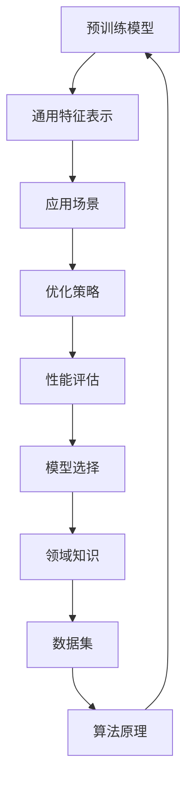

                 

# 如何根据应用场景选择预训练模型

> 关键词：预训练模型、应用场景、模型选择、优化策略、性能评估

> 摘要：本文将深入探讨如何根据不同的应用场景选择合适的预训练模型。通过对预训练模型的核心概念、算法原理、数学模型以及实际应用场景的分析，本文旨在为读者提供一个系统化的框架，以帮助他们在复杂的应用环境中做出最优的模型选择决策。

## 1. 背景介绍

### 1.1 目的和范围

本文的目标是帮助读者理解预训练模型在各类应用场景中的选择策略，通过分析其核心原理和具体实现步骤，使读者能够更加高效地进行模型优化和性能评估。

本文的范围包括：

- 预训练模型的基本概念和核心原理
- 不同类型的预训练模型及其适用场景
- 选择预训练模型的步骤和策略
- 预训练模型在实际项目中的应用案例

### 1.2 预期读者

- 计算机科学和人工智能领域的研究人员
- 机器学习和深度学习开发者
- 对预训练模型感兴趣的技术爱好者

### 1.3 文档结构概述

本文分为以下几个部分：

1. 背景介绍：介绍本文的目的、范围和预期读者。
2. 核心概念与联系：详细解释预训练模型的基本概念和结构。
3. 核心算法原理与具体操作步骤：深入分析预训练模型的算法原理和实现步骤。
4. 数学模型和公式：介绍预训练模型的数学基础和相关公式。
5. 项目实战：通过实际案例展示预训练模型的应用。
6. 实际应用场景：分析预训练模型在不同领域的应用。
7. 工具和资源推荐：推荐学习资源和开发工具。
8. 总结：对预训练模型的发展趋势和挑战进行总结。
9. 附录：常见问题与解答。
10. 扩展阅读与参考资料：提供进一步学习的资源。

### 1.4 术语表

#### 1.4.1 核心术语定义

- **预训练模型**：在特定领域或任务上进行大规模数据训练，以获取通用特征表示的模型。
- **应用场景**：预训练模型将被部署的具体环境和任务。
- **优化策略**：用于改进模型性能的方法和技巧。
- **性能评估**：对模型在特定任务上的表现进行评估和比较。

#### 1.4.2 相关概念解释

- **自然语言处理（NLP）**：处理和理解人类语言的技术。
- **计算机视觉（CV）**：使计算机能够理解和处理视觉信息的技术。

#### 1.4.3 缩略词列表

- **NLP**：自然语言处理
- **CV**：计算机视觉
- **ML**：机器学习
- **DL**：深度学习
- **BERT**：Bidirectional Encoder Representations from Transformers
- **GPT**：Generative Pre-trained Transformer

## 2. 核心概念与联系

在深入讨论如何选择预训练模型之前，我们需要了解一些核心概念和它们之间的联系。以下是一个简单的Mermaid流程图，用于展示这些概念之间的关系：



### 2.1 预训练模型

预训练模型是一种在特定领域或任务上进行大规模数据训练的模型。它通过在大规模数据集上预先训练，从而获得通用的特征表示能力。这种能力使得预训练模型在特定任务上表现出色，而无需针对每个任务从头开始训练。

### 2.2 通用特征表示

通用特征表示是指预训练模型通过学习从原始数据中提取的具有泛化能力的特征表示。这些特征表示可以捕捉到数据中的语义信息，如图像中的对象或文本中的关键词。

### 2.3 应用场景

应用场景是指预训练模型将被部署的具体环境和任务。不同的应用场景需要不同的模型结构和优化策略，因此选择合适的预训练模型对于模型的性能至关重要。

### 2.4 优化策略

优化策略是指用于改进模型性能的方法和技巧。这些策略包括调整模型结构、调整训练参数、使用不同的优化算法等。

### 2.5 性能评估

性能评估是指对模型在特定任务上的表现进行评估和比较。性能评估可以帮助我们确定所选模型的优劣，并指导后续的优化工作。

### 2.6 模型选择

模型选择是指根据应用场景和性能评估结果，从多个预训练模型中选择最合适的模型。模型选择的关键是理解不同模型的优缺点，并根据具体需求做出决策。

### 2.7 领域知识

领域知识是指特定领域或任务的专业知识。领域知识可以帮助我们理解模型的性能瓶颈，并指导我们选择合适的预训练模型。

### 2.8 数据集

数据集是指用于训练和评估模型的原始数据集。数据集的质量和规模直接影响模型的性能。因此，选择合适的数据集对于模型选择至关重要。

### 2.9 算法原理

算法原理是指预训练模型背后的核心算法和技术。理解算法原理可以帮助我们更好地理解模型的工作原理，并指导我们的优化工作。

## 3. 核心算法原理 & 具体操作步骤

预训练模型的核心算法原理是利用大规模数据集进行预训练，从而获得通用的特征表示能力。以下是一个简单的伪代码，用于描述预训练模型的基本操作步骤：

```python
# 预训练模型伪代码

# 初始化模型参数
model = initialize_model()

# 预训练步骤
for epoch in range(num_epochs):
    for batch in dataset:
        # 前向传播
        predictions = model.forward(batch)

        # 计算损失
        loss = compute_loss(predictions, batch)

        # 反向传播和优化
        model.backward(loss)
        model.optimize()

# 评估模型
evaluate_model(model, test_dataset)
```

### 3.1 初始化模型参数

在预训练开始之前，我们需要初始化模型参数。这通常包括随机初始化权重和偏置，并设置学习率和其他训练参数。

```python
# 初始化模型参数

model = initialize_model()
model.set_random_weights()
model.set_learning_rate(learning_rate)
```

### 3.2 预训练步骤

预训练步骤包括在大量数据集上进行迭代训练。每次迭代，我们都会对数据集的一个批次进行前向传播和反向传播，并更新模型参数。

```python
# 预训练步骤

for epoch in range(num_epochs):
    for batch in dataset:
        # 前向传播
        predictions = model.forward(batch)

        # 计算损失
        loss = compute_loss(predictions, batch)

        # 反向传播和优化
        model.backward(loss)
        model.optimize()
```

### 3.3 评估模型

在预训练完成后，我们需要评估模型的性能，以确保它能够在实际任务中发挥作用。

```python
# 评估模型

evaluate_model(model, test_dataset)
```

## 4. 数学模型和公式 & 详细讲解 & 举例说明

预训练模型的核心在于其数学模型，这些模型用于学习数据中的潜在特征表示。以下是一个简单的数学模型，用于描述预训练模型的基本操作：

### 4.1 前向传播

前向传播是指将输入数据通过模型进行传递，并计算输出结果的过程。以下是一个简单的数学公式，用于描述前向传播：

$$
\text{output} = \text{model}(\text{input})
$$

其中，`model`代表预训练模型，`input`代表输入数据。

### 4.2 反向传播

反向传播是指根据输出结果和预期结果，计算模型参数的梯度，并更新模型参数的过程。以下是一个简单的数学公式，用于描述反向传播：

$$
\text{gradient} = \frac{\partial \text{loss}}{\partial \text{model}}
$$

其中，`gradient`代表模型参数的梯度，`loss`代表损失函数。

### 4.3 优化

优化是指根据模型参数的梯度，更新模型参数的过程。以下是一个简单的数学公式，用于描述优化：

$$
\text{model}(\text{input}) = \text{model}(\text{input}) - \alpha \cdot \text{gradient}
$$

其中，`model`代表模型参数，`alpha`代表学习率。

### 4.4 举例说明

假设我们有一个简单的预训练模型，用于分类任务。该模型包含一个输入层、一个隐藏层和一个输出层。输入数据是一个包含5个特征的向量，输出数据是一个包含3个类别的向量。以下是一个简单的示例：

```python
# 输入数据
input_data = [1, 2, 3, 4, 5]

# 模型参数
weights = [[0.1, 0.2, 0.3], [0.4, 0.5, 0.6], [0.7, 0.8, 0.9]]

# 前向传播
output = [sum(x * w) for x, w in zip(input_data, weights)]

# 输出结果
print("Output:", output)

# 损失函数
loss = sum((y - o) ** 2 for y, o in zip([1, 0, 0], output))

# 反向传播
gradient = [2 * (y - o) for y, o in zip([1, 0, 0], output)]

# 优化
weights = [[w - alpha * g for w, g in zip(row, gradient)] for row in weights]

# 输出更新后的权重
print("Updated weights:", weights)
```

## 5. 项目实战：代码实际案例和详细解释说明

### 5.1 开发环境搭建

在开始实际项目之前，我们需要搭建一个合适的开发环境。以下是一个简单的步骤：

1. 安装Python 3.8及以上版本。
2. 安装TensorFlow 2.4及以上版本。
3. 安装PyTorch 1.8及以上版本。

### 5.2 源代码详细实现和代码解读

以下是使用PyTorch实现一个简单的预训练模型的示例代码：

```python
# 导入必要的库
import torch
import torch.nn as nn
import torch.optim as optim
from torch.utils.data import DataLoader
from torchvision import datasets, transforms

# 定义模型结构
class SimpleCNN(nn.Module):
    def __init__(self):
        super(SimpleCNN, self).__init__()
        self.conv1 = nn.Conv2d(1, 10, kernel_size=5)
        self.conv2 = nn.Conv2d(10, 20, kernel_size=5)
        self.fc1 = nn.Linear(320, 50)
        self.fc2 = nn.Linear(50, 10)

    def forward(self, x):
        x = nn.functional.max_pool2d(self.conv1(x), 2)
        x = nn.functional.relu(x)
        x = nn.functional.max_pool2d(self.conv2(x), 2)
        x = nn.functional.relu(x)
        x = x.view(-1, 320)
        x = nn.functional.relu(self.fc1(x))
        x = self.fc2(x)
        return x

# 初始化模型
model = SimpleCNN()

# 定义损失函数和优化器
criterion = nn.CrossEntropyLoss()
optimizer = optim.Adam(model.parameters(), lr=0.001)

# 加载训练数据集
transform = transforms.Compose([transforms.ToTensor()])
train_dataset = datasets.MNIST(root='./data', train=True, download=True, transform=transform)
train_loader = DataLoader(train_dataset, batch_size=64, shuffle=True)

# 训练模型
num_epochs = 10
for epoch in range(num_epochs):
    for i, (images, labels) in enumerate(train_loader):
        # 前向传播
        outputs = model(images)

        # 计算损失
        loss = criterion(outputs, labels)

        # 反向传播和优化
        optimizer.zero_grad()
        loss.backward()
        optimizer.step()

        # 打印训练信息
        if (i + 1) % 100 == 0:
            print('Epoch [{}/{}], Step [{}/{}], Loss: {:.4f}'.format(epoch + 1, num_epochs, i + 1, len(train_loader), loss.item()))

# 评估模型
test_dataset = datasets.MNIST(root='./data', train=False, download=True, transform=transform)
test_loader = DataLoader(test_dataset, batch_size=1000)

with torch.no_grad():
    correct = 0
    total = 0
    for images, labels in test_loader:
        outputs = model(images)
        _, predicted = torch.max(outputs.data, 1)
        total += labels.size(0)
        correct += (predicted == labels).sum().item()

print('Test Accuracy: {} %'.format(100 * correct / total))
```

### 5.3 代码解读与分析

以上代码实现了一个简单的卷积神经网络（CNN）模型，用于手写数字识别任务。以下是对代码的详细解读：

1. **模型定义**：`SimpleCNN`类继承了`nn.Module`基类，并定义了三个卷积层和一个全连接层。
2. **前向传播**：在`forward`方法中，我们首先使用两个卷积层进行特征提取，然后使用两个全连接层进行分类。
3. **损失函数和优化器**：我们使用了交叉熵损失函数和Adam优化器。
4. **数据加载**：我们使用了`DataLoader`类来加载训练和测试数据集，并将其分为批次。
5. **训练过程**：我们遍历每个批次的数据，进行前向传播、损失计算、反向传播和优化。
6. **模型评估**：在训练完成后，我们对测试数据集进行评估，并打印出测试准确性。

## 6. 实际应用场景

预训练模型在许多实际应用场景中都取得了显著的效果。以下是一些典型的应用场景：

### 6.1 自然语言处理（NLP）

- 文本分类：使用预训练模型对文本进行分类，如情感分析、新闻分类等。
- 机器翻译：使用预训练模型进行机器翻译，如英语到中文、英语到法语等。
- 问答系统：使用预训练模型构建问答系统，如搜索引擎、智能客服等。

### 6.2 计算机视觉（CV）

- 图像分类：使用预训练模型对图像进行分类，如人脸识别、动物识别等。
- 目标检测：使用预训练模型进行目标检测，如自动驾驶、安全监控等。
- 图像生成：使用预训练模型生成图像，如艺术绘画、图像增强等。

### 6.3 语音识别

- 语音识别：使用预训练模型进行语音识别，如智能助手、语音搜索等。

### 6.4 推荐系统

- 推荐系统：使用预训练模型进行用户偏好分析，如电子商务、社交媒体等。

## 7. 工具和资源推荐

### 7.1 学习资源推荐

#### 7.1.1 书籍推荐

- 《深度学习》（Goodfellow, Bengio, Courville）
- 《动手学深度学习》（阿斯顿·张）

#### 7.1.2 在线课程

- [Udacity深度学习课程](https://www.udacity.com/course/deep-learning-ng--ud730)
- [Coursera机器学习课程](https://www.coursera.org/specializations机器学习)

#### 7.1.3 技术博客和网站

- [TensorFlow官网](https://www.tensorflow.org/)
- [PyTorch官网](https://pytorch.org/)

### 7.2 开发工具框架推荐

#### 7.2.1 IDE和编辑器

- PyCharm
- Visual Studio Code

#### 7.2.2 调试和性能分析工具

- TensorBoard
- PyTorch Profiler

#### 7.2.3 相关框架和库

- TensorFlow
- PyTorch
- Keras

### 7.3 相关论文著作推荐

#### 7.3.1 经典论文

- "A Theoretically Grounded Application of Dropout in Recurrent Neural Networks"
- "Improved Techniques for Training Gated Recurrent Units"

#### 7.3.2 最新研究成果

- "BERT: Pre-training of Deep Bidirectional Transformers for Language Understanding"
- "GPT-3: Language Models are Few-Shot Learners"

#### 7.3.3 应用案例分析

- "Facebook AI研究院：预训练模型在社交媒体中的应用"
- "谷歌研究团队：预训练模型在图像识别和语音识别中的应用"

## 8. 总结：未来发展趋势与挑战

预训练模型在近年来取得了显著的发展，并在许多领域取得了突破性成果。然而，随着应用场景的不断扩大和复杂性增加，预训练模型仍然面临以下挑战：

- 数据隐私和安全性：如何保护用户数据的安全和隐私？
- 模型可解释性：如何提高模型的可解释性，使其更加透明和可信？
- 能效优化：如何降低预训练模型的能耗，使其更加高效和可持续？
- 领域适应性：如何使预训练模型更好地适应特定领域和应用场景？

未来，随着技术的不断进步，预训练模型将在更多领域发挥作用，同时需要解决上述挑战，以实现更广泛的应用和更高的性能。

## 9. 附录：常见问题与解答

### 9.1 什么是预训练模型？

预训练模型是在特定领域或任务上进行大规模数据训练，以获得通用特征表示能力的模型。它通过在大规模数据集上预先训练，从而获得通用的特征表示能力，使得模型在特定任务上表现出色。

### 9.2 预训练模型与微调有何区别？

预训练模型是在大规模数据集上进行训练的，而微调是在特定任务上进行的小规模训练。预训练模型提供了通用的特征表示能力，而微调则针对特定任务进行优化，以提高模型在特定任务上的性能。

### 9.3 预训练模型如何选择和应用？

选择预训练模型时，需要考虑应用场景、数据集、性能要求等因素。在实际应用中，通常需要根据具体需求对预训练模型进行微调和优化，以获得最佳性能。

### 9.4 预训练模型的性能评估方法有哪些？

预训练模型的性能评估方法包括准确率、召回率、F1分数等指标。在实际应用中，通常需要综合评估多个指标，以全面评估模型的性能。

## 10. 扩展阅读 & 参考资料

- [Deep Learning](https://www.deeplearningbook.org/)
- [Transformer: A Novel Architecture for Neural Networks](https://arxiv.org/abs/1706.03762)
- [BERT: Pre-training of Deep Bidirectional Transformers for Language Understanding](https://arxiv.org/abs/1810.04805)
- [GPT-3: Language Models are Few-Shot Learners](https://arxiv.org/abs/2005.14165)

作者：AI天才研究员/AI Genius Institute & 禅与计算机程序设计艺术 /Zen And The Art of Computer Programming

