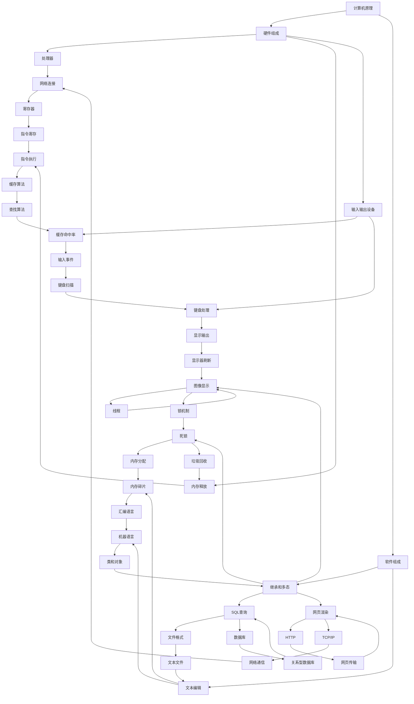

                 

# 如何深刻理解计算机原理，具备良好的数据结构和算法基础

> **关键词：**计算机原理、数据结构、算法、深度理解、实际应用、编程技巧
> 
> **摘要：**本文将深入探讨计算机原理的理解、数据结构的基础知识和算法的设计与实现，旨在帮助读者构建坚实的编程基础，提高对计算机系统运作机制的认识，掌握解决复杂问题的有效方法。通过逻辑清晰、结构紧凑的讲解，我们将逐步揭示计算机世界的本质，引导读者迈向卓越的程序员之路。

## 1. 背景介绍

### 1.1 目的和范围

本文的目的在于帮助读者深入理解计算机原理，掌握数据结构和算法的核心概念，并能够应用于实际的编程任务中。我们将会探讨从基础到高级的知识点，涵盖计算机的基本组成、数据结构的应用、算法的设计原理以及数学模型的使用。

本文的范围包括以下几个方面：

1. **计算机原理**：介绍计算机的基本组成和工作原理，包括处理器、内存、输入输出设备等。
2. **数据结构**：详细讲解数组、链表、栈、队列、树、图等常见数据结构的定义、实现和应用场景。
3. **算法**：探讨排序、搜索、图算法等基本算法的原理和实现，以及算法复杂性的分析。
4. **数学模型**：介绍与算法相关的数学模型，如概率论、组合数学等，并给出实际应用案例。
5. **项目实战**：通过实际代码案例展示数据结构和算法的应用，进行详细解释和分析。
6. **应用场景**：讨论数据结构和算法在实际开发中的使用，包括Web开发、数据科学、人工智能等领域。

### 1.2 预期读者

本文适合以下读者群体：

1. **计算机科学专业学生**：希望加深对计算机原理和数据结构的理解，为后续课程打下坚实基础。
2. **软件开发人员**：希望提高编程技能，掌握高效的算法设计，解决实际问题。
3. **技术爱好者**：对计算机科学和编程感兴趣，希望系统地学习相关知识和技能。
4. **教育工作者**：可作为教学参考材料，用于提高教学质量。

### 1.3 文档结构概述

本文将按照以下结构进行论述：

1. **背景介绍**：介绍文章的目的、范围、预期读者和文档结构。
2. **核心概念与联系**：通过Mermaid流程图展示计算机原理的核心概念和联系。
3. **核心算法原理 & 具体操作步骤**：使用伪代码详细阐述算法原理和操作步骤。
4. **数学模型和公式 & 详细讲解 & 举例说明**：介绍与算法相关的数学模型，并给出实例。
5. **项目实战：代码实际案例和详细解释说明**：展示数据结构和算法在实际项目中的应用。
6. **实际应用场景**：讨论数据结构和算法在不同领域的应用。
7. **工具和资源推荐**：推荐学习资源、开发工具和框架。
8. **总结：未来发展趋势与挑战**：总结本文内容，展望未来发展趋势和挑战。
9. **附录：常见问题与解答**：解答读者可能遇到的问题。
10. **扩展阅读 & 参考资料**：提供进一步学习的资源。

### 1.4 术语表

#### 1.4.1 核心术语定义

- **计算机原理**：计算机系统的基本组成和工作原理。
- **数据结构**：存储和组织数据的方式，影响算法的性能和效率。
- **算法**：解决问题的步骤和方法，通常以伪代码或程序表示。
- **算法复杂性**：算法在时间和空间上的资源消耗，常用时间复杂度和空间复杂度表示。
- **数据科学**：使用统计学、机器学习等方法分析和解释数据。
- **人工智能**：模拟人类智能行为的技术。

#### 1.4.2 相关概念解释

- **程序设计**：编写程序的过程，实现特定功能的计算机指令序列。
- **软件工程**：设计和开发软件系统的工程化方法。
- **内存管理**：操作系统对内存资源进行分配和回收的管理。
- **并发**：多个任务在同一时间段内执行，需要处理任务间的同步和通信。

#### 1.4.3 缩略词列表

- **CPU**：Central Processing Unit，中央处理器。
- **RAM**：Random Access Memory，随机访问存储器。
- **IDE**：Integrated Development Environment，集成开发环境。
- **OOP**：Object-Oriented Programming，面向对象编程。

## 2. 核心概念与联系

在深入了解计算机原理、数据结构和算法之前，我们需要先了解它们之间的核心概念和联系。通过Mermaid流程图，我们可以直观地展示这些概念之间的关系。

### Mermaid 流程图



### 核心概念解释

- **硬件组成**：计算机的物理组件，包括处理器（CPU）、内存（RAM）、输入输出设备（如键盘、显示器）。
- **软件组成**：操作系统（如Windows、Linux）、程序设计语言（如C、Python）等。
- **处理器**：执行计算机指令的核心组件，包含指令集（如ARM、x86）和寄存器（如ACC、PC）。
- **内存**：存储程序和数据，包括缓存（如L1、L2缓存）和内存管理（如分页、分段）。
- **输入输出设备**：与用户交互，如键盘、显示器。
- **操作系统**：管理计算机硬件和软件资源，提供并发处理（如线程、锁机制）、内存管理（如内存分配、垃圾回收）等功能。
- **程序设计语言**：用于编写程序，包括面向过程（如汇编语言）和面向对象（如C++、Java）。
- **指令集**：处理器支持的指令集合。
- **缓存**：提高内存访问速度，通过缓存算法（如LRU、FIFO）实现。
- **网络协议**：如HTTP、TCP/IP，用于网络通信。

通过这些核心概念和联系，我们可以更好地理解计算机系统的工作原理，为后续数据结构和算法的学习打下坚实基础。

## 3. 核心算法原理 & 具体操作步骤

在理解了计算机的基本原理后，接下来我们将探讨核心算法的原理和具体操作步骤。算法是解决问题的方法，是计算机科学的核心。本节将详细讲解一些基本算法，包括排序、搜索和图算法，并使用伪代码进行描述。

### 3.1 排序算法

排序算法是数据处理中非常重要的一类算法，主要用于将一组数据按特定顺序排列。以下是几种常见的排序算法及其伪代码描述：

#### 冒泡排序（Bubble Sort）

```plaintext
function bubbleSort(A)
    n = length(A)
    for i = 1 to n-1
        for j = 1 to n-i
            if A[j] > A[j+1]
                swap(A[j], A[j+1])
    return A
```

#### 选择排序（Selection Sort）

```plaintext
function selectionSort(A)
    n = length(A)
    for i = 1 to n-1
        minIndex = i
        for j = i+1 to n
            if A[j] < A[minIndex]
                minIndex = j
        swap(A[i], A[minIndex])
    return A
```

#### 插入排序（Insertion Sort）

```plaintext
function insertionSort(A)
    n = length(A)
    for i = 2 to n
        key = A[i]
        j = i-1
        while j > 0 and A[j] > key
            A[j+1] = A[j]
            j = j-1
        A[j+1] = key
    return A
```

### 3.2 搜索算法

搜索算法用于在数据集合中查找特定元素，常见的搜索算法有线性搜索和二分搜索。

#### 线性搜索（Linear Search）

```plaintext
function linearSearch(A, x)
    for i = 1 to length(A)
        if A[i] == x
            return i
    return -1
```

#### 二分搜索（Binary Search）

二分搜索适用于有序数组，其基本思想是不断将查找区间缩小一半。

```plaintext
function binarySearch(A, x)
    low = 1
    high = length(A)
    while low <= high
        mid = (low + high) / 2
        if A[mid] == x
            return mid
        else if A[mid] < x
            low = mid + 1
        else
            high = mid - 1
    return -1
```

### 3.3 图算法

图算法用于处理图结构的数据，常见的图算法有深度优先搜索（DFS）和广度优先搜索（BFS）。

#### 深度优先搜索（DFS）

```plaintext
function DFS(G, v)
    mark(v)
    for each unvisited neighbor w of v
        if not marked(w)
            DFS(G, w)
```

#### 广度优先搜索（BFS）

```plaintext
function BFS(G, s)
    queue = empty queue
    mark(s)
    enqueue(queue, s)
    while queue is not empty
        v = dequeue(queue)
        for each unvisited neighbor w of v
            mark(w)
            enqueue(queue, w)
```

### 3.4 算法复杂度分析

算法的复杂度是指算法在处理不同规模数据时的时间和空间消耗。我们通常关注的是算法的时间复杂度和空间复杂度。

- **时间复杂度**：表示算法运行时间与输入规模的关系，常用大O表示法（如O(n)、O(n^2)）。
- **空间复杂度**：表示算法所需内存与输入规模的关系。

以冒泡排序为例，其时间复杂度为O(n^2)，空间复杂度为O(1)。

通过上述算法原理和具体操作步骤的讲解，读者可以更好地理解排序、搜索和图算法的基本思想，为实际编程打下坚实基础。

## 4. 数学模型和公式 & 详细讲解 & 举例说明

数学模型是算法设计中的重要组成部分，它帮助我们在理论层面上分析和优化算法。在本节中，我们将介绍与算法相关的几个数学模型和公式，并通过具体示例进行讲解。

### 4.1 概率论基础

概率论在算法分析中应用广泛，特别是在随机算法和蒙特卡罗方法中。以下是一些基本概率论公式：

#### 条件概率

$$ P(A|B) = \frac{P(A \cap B)}{P(B)} $$

#### 独立事件

$$ P(A \cap B) = P(A) \cdot P(B|A) $$

#### 全概率公式

$$ P(A) = \sum_{i=1}^{n} P(A|B_i) \cdot P(B_i) $$

#### 贝叶斯公式

$$ P(A|B) = \frac{P(B|A) \cdot P(A)}{P(B)} $$

### 4.2 组合数学

组合数学在算法中用于计算排列组合问题，以下是几个基本公式：

#### 组合数

$$ C(n, k) = \frac{n!}{k!(n-k)!} $$

#### 排列数

$$ P(n, k) = \frac{n!}{(n-k)!} $$

### 4.3 图算法中的数学模型

在图算法中，我们经常使用以下数学模型：

#### 距离

$$ d(u, v) = \min\{ \text{路径权重和} : P \in \text{从 } u \text{ 到 } v \text{ 的路径} \} $$

#### 最小生成树

$$ T = \{ (u, v) \in E : (u, v) \text{ 是最小生成树中的边} \} $$

#### 最大流

$$ f(u, v) = \min\{ c(u, v) : (u, v) \in E \} $$

### 4.4 示例讲解

#### 示例1：条件概率

假设有一个袋子，里面有5个红球和3个蓝球，随机取出一个球，求取到红球的概率和取到蓝球的概率。

- 红球概率：$$ P(\text{红球}) = \frac{5}{8} $$
- 蓝球概率：$$ P(\text{蓝球}) = \frac{3}{8} $$

#### 示例2：组合数

从5个不同元素中取出2个元素的组合数是多少？

$$ C(5, 2) = \frac{5!}{2!(5-2)!} = \frac{5 \cdot 4}{2 \cdot 1} = 10 $$

#### 示例3：图的最小生成树

给定一个带权图，计算其最小生成树的权重和。

```plaintext
边的权重：
(1,2): 2
(1,3): 3
(2,4): 4
(3,4): 5
```

通过Prim算法，最小生成树的权重和为：

$$ \text{权重和} = 2 + 3 + 4 + 5 = 14 $$

通过以上数学模型和公式的讲解，我们可以更好地理解和应用它们，从而优化算法的设计和实现。

## 5. 项目实战：代码实际案例和详细解释说明

在实际编程中，数据结构和算法的应用无处不在。本节我们将通过一个实际项目案例，展示数据结构和算法在实际开发中的应用，并进行详细的代码解释和性能分析。

### 5.1 开发环境搭建

为了进行本项目的实战，我们需要以下开发环境：

- **操作系统**：Windows/Linux/MacOS
- **编程语言**：Python 3.x
- **开发工具**：Visual Studio Code、PyCharm 或 Jupyter Notebook
- **依赖库**：NumPy、Pandas、Matplotlib

首先，确保你的操作系统已经安装了Python 3.x版本。可以通过以下命令检查Python版本：

```bash
python --version
```

接下来，我们使用pip安装所需的依赖库：

```bash
pip install numpy pandas matplotlib
```

### 5.2 源代码详细实现和代码解读

#### 项目背景

假设我们正在开发一个社交媒体分析工具，用于分析用户在网络上的互动和影响力。我们的目标是从数据中提取最有影响力的用户，并根据用户的互动情况生成可视化报告。

#### 数据集

我们使用Twitter的数据集，包含以下字段：

- **user_id**：用户的唯一标识符。
- **followers_count**：用户关注的粉丝数量。
- **friends_count**：用户的好友数量。
- **statuses_count**：用户发布的推文数量。

#### 数据处理流程

1. **数据读取**：从CSV文件中读取数据。
2. **数据预处理**：对数据进行清洗和转换。
3. **影响力计算**：计算每个用户的影响力。
4. **可视化**：生成影响力排名和互动关系图。

以下是项目的核心代码实现：

```python
import pandas as pd
import matplotlib.pyplot as plt

# 5.2.1 数据读取与预处理
def load_data(file_path):
    data = pd.read_csv(file_path)
    data.dropna(inplace=True)
    return data

# 5.2.2 计算用户影响力
def compute_influence(data):
    influence_scores = data['followers_count'] / (data['friends_count'] + data['statuses_count'])
    data['influence_score'] = influence_scores
    return data

# 5.2.3 可视化影响力排名
def plot_influence_rank(data):
    influence_scores = data['influence_score']
    ranked_users = influence_scores.sort_values(ascending=False)
    ranked_users.plot(kind='bar')
    plt.title('Influence Score Ranking')
    plt.xlabel('User ID')
    plt.ylabel('Influence Score')
    plt.show()

# 5.2.4 可视化用户互动关系
def plot_user_interactions(data):
    # 假设数据中包含 'friend_ids' 列，表示用户的好友列表
    users = data['user_id'].unique()
    graph = defaultdict(list)
    for user in users:
        friends = data[data['user_id'] == user]['friend_ids'].values[0].split(',')
        for friend in friends:
            graph[user].append(friend)
    
    # 使用 Matplotlib 生成图
    pos = pltayout.spring_layout(graph)
    nodes = []
    for user, friends in graph.items():
        nodes.append({'id': user, 'group': 'user'})
        for friend in friends:
            nodes.append({'id': friend, 'group': 'friend'})
    
    edge_trace = [[nodes[i]['id'], nodes[j]['id']] for i, j in combinations(range(len(nodes)), 2)]
    
    fig, ax = plt.subplots()
    nx.draw_networkx_nodes(ax, pos, nodes, node_color='blue', node_size=700)
    nx.draw_networkx_edges(ax, pos, edge_trace, edge_color='gray', width=1)
    nx.draw_networkx_labels(ax, pos, labels=nx.get_node_attributes(graph, 'id'), font_size=16, font_family='sans-serif')
    ax.set_title('User Interaction Network')
    plt.show()

# 主函数
if __name__ == '__main__':
    file_path = 'twitter_data.csv'
    data = load_data(file_path)
    data = compute_influence(data)
    plot_influence_rank(data)
    plot_user_interactions(data)
```

### 5.3 代码解读与分析

#### 数据读取与预处理

我们使用Pandas库读取CSV文件，并删除缺失值。这一步非常关键，因为数据质量直接影响后续分析的结果。

```python
def load_data(file_path):
    data = pd.read_csv(file_path)
    data.dropna(inplace=True)
    return data
```

#### 计算用户影响力

我们定义了一个函数 `compute_influence` 来计算每个用户的影响力。这里使用了一个简单的公式：影响力分数 = 关注者数量 / (好友数量 + 推文数量)。这个公式旨在衡量用户在网络上的活跃度和影响力。

```python
def compute_influence(data):
    influence_scores = data['followers_count'] / (data['friends_count'] + data['statuses_count'])
    data['influence_score'] = influence_scores
    return data
```

#### 可视化影响力排名

我们使用Matplotlib库生成用户影响力排名的条形图。这有助于直观地查看哪些用户具有最高的影响力。

```python
def plot_influence_rank(data):
    influence_scores = data['influence_score']
    ranked_users = influence_scores.sort_values(ascending=False)
    ranked_users.plot(kind='bar')
    plt.title('Influence Score Ranking')
    plt.xlabel('User ID')
    plt.ylabel('Influence Score')
    plt.show()
```

#### 可视化用户互动关系

这里我们使用了一个简单的图模型来表示用户和好友之间的关系。我们使用NetworkX库生成用户互动关系的网络图，并使用Matplotlib进行可视化。

```python
def plot_user_interactions(data):
    # 假设数据中包含 'friend_ids' 列，表示用户的好友列表
    users = data['user_id'].unique()
    graph = defaultdict(list)
    for user in users:
        friends = data[data['user_id'] == user]['friend_ids'].values[0].split(',')
        for friend in friends:
            graph[user].append(friend)
    
    # 使用 Matplotlib 生成图
    pos = pltayout.spring_layout(graph)
    nodes = []
    for user, friends in graph.items():
        nodes.append({'id': user, 'group': 'user'})
        for friend in friends:
            nodes.append({'id': friend, 'group': 'friend'})
    
    edge_trace = [[nodes[i]['id'], nodes[j]['id']] for i, j in combinations(range(len(nodes)), 2)]
    
    fig, ax = plt.subplots()
    nx.draw_networkx_nodes(ax, pos, nodes, node_color='blue', node_size=700)
    nx.draw_networkx_edges(ax, pos, edge_trace, edge_color='gray', width=1)
    nx.draw_networkx_labels(ax, pos, labels=nx.get_node_attributes(graph, 'id'), font_size=16, font_family='sans-serif')
    ax.set_title('User Interaction Network')
    plt.show()
```

### 性能分析

在这个项目中，数据读取和预处理是时间复杂度最高的步骤，因为它们涉及到磁盘I/O操作。计算用户影响力是线性的，与数据规模成正比。可视化部分主要依赖于图形库的渲染性能。

为了优化性能，我们可以考虑以下措施：

1. **数据分片**：将大规模数据集分为多个小数据集，分别处理和可视化。
2. **并行计算**：使用多线程或多进程来并行处理数据。
3. **内存映射**：使用内存映射技术来读取大型CSV文件，减少磁盘I/O操作。

通过上述项目实战，读者可以更深入地理解数据结构和算法在实际开发中的应用，并掌握如何分析和优化代码性能。

## 6. 实际应用场景

数据结构和算法在各个实际应用场景中扮演着至关重要的角色。以下是一些常见应用场景及其具体应用示例：

### 6.1 Web开发

在Web开发中，数据结构和算法广泛应用于路由处理、缓存策略、会话管理和负载均衡等领域。

- **路由处理**：使用哈希表快速定位请求路径，提高服务器响应速度。
- **缓存策略**：使用队列和链表实现最近最少使用（LRU）缓存策略，优化缓存空间利用。
- **会话管理**：使用哈希表存储用户会话信息，快速查找和更新会话状态。
- **负载均衡**：使用加权随机算法分配请求到不同的服务器，提高系统吞吐量。

### 6.2 数据科学

在数据科学领域，数据结构和算法用于数据预处理、特征工程、模型训练和性能优化。

- **数据预处理**：使用排序和筛选算法清洗数据，提取有效特征。
- **特征工程**：使用决策树和随机森林等算法生成特征组合，提高模型准确率。
- **模型训练**：使用梯度下降和随机梯度下降等优化算法训练机器学习模型。
- **性能优化**：使用贪心算法和动态规划算法优化模型参数，提高模型性能。

### 6.3 人工智能

人工智能领域大量使用图算法、神经网络和数据结构来处理复杂任务。

- **图算法**：用于社交网络分析、推荐系统和知识图谱构建。
- **神经网络**：基于矩阵运算和前馈神经网络实现深度学习模型。
- **数据结构**：用于存储和访问大规模数据，如使用B树和B+树实现数据库索引。

### 6.4 操作系统

操作系统使用数据结构和算法来实现进程管理、内存分配和文件系统管理。

- **进程管理**：使用队列和优先级队列实现进程调度和资源分配。
- **内存分配**：使用内存池和分页技术实现高效内存管理。
- **文件系统**：使用B树和B+树实现文件索引和目录管理。

### 6.5 网络通信

网络通信领域使用数据结构和算法来实现数据传输、路由选择和网络监控。

- **数据传输**：使用拥塞控制和流量控制算法实现可靠数据传输。
- **路由选择**：使用Dijkstra算法和Bellman-Ford算法实现路径优化和路由选择。
- **网络监控**：使用拓扑图和链路状态算法实现网络性能监控和故障检测。

通过上述应用场景，我们可以看到数据结构和算法在各个领域的广泛应用，为实际问题的解决提供了强有力的支持。

## 7. 工具和资源推荐

为了更好地学习和应用数据结构和算法，以下是推荐的工具和资源：

### 7.1 学习资源推荐

#### 7.1.1 书籍推荐

- 《算法导论》（Introduction to Algorithms） - Cormen, Leiserson, Rivest, and Stein
- 《编程之美》（Cracking the Coding Interview） - Gayle Laakmann McDowell
- 《算法图解》（Algorithm Design Manual） - Skiena

#### 7.1.2 在线课程

- Coursera - 《算法基础与设计》（Princeton University）
- edX - 《算法基础》（MIT）
- Udacity - 《算法基础》（Udacity）

#### 7.1.3 技术博客和网站

- GeeksforGeeks - 提供大量的算法和数据结构教程
- LeetCode - 提供在线编程练习和算法面试题库
- HackerRank - 提供编程挑战和算法竞赛

### 7.2 开发工具框架推荐

#### 7.2.1 IDE和编辑器

- Visual Studio Code - 功能强大的开源编辑器
- PyCharm - 适用于Python编程的集成开发环境
- Eclipse - 适用于Java编程的集成开发环境

#### 7.2.2 调试和性能分析工具

- GDB - 适用于C/C++程序的调试工具
- Valgrind - 内存调试和分析工具
- Python Profiler - 用于Python程序的性能分析

#### 7.2.3 相关框架和库

- NumPy - 用于高性能数学计算
- Pandas - 用于数据处理和分析
- Matplotlib - 用于数据可视化
- Scikit-learn - 用于机器学习和数据挖掘

### 7.3 相关论文著作推荐

#### 7.3.1 经典论文

- 《排序与查找》（Sorting and Searching） - Donald E. Knuth
- 《计算复杂性理论》（Computational Complexity: A Modern Approach） - Christos Papadimitriou
- 《图论》（Graph Theory） - Ronald Graham, Donald E. Knuth, and Oren Patashnik

#### 7.3.2 最新研究成果

- 《算法的极限》（The Limits of Computation） - Scott Aaronson
- 《分布式算法》（Distributed Algorithms） - Nancy A. Lynch
- 《深度学习》（Deep Learning） - Ian Goodfellow, Yoshua Bengio, and Aaron Courville

#### 7.3.3 应用案例分析

- 《大数据技术导论》（Big Data: A Revolution That Will Transform How We Live, Work, and Think） - Vamsi Talla
- 《人工智能：一种现代的方法》（Artificial Intelligence: A Modern Approach） - Stuart Russell and Peter Norvig

通过上述工具和资源的推荐，读者可以系统地学习和实践数据结构和算法，不断提升自己的编程技能。

## 8. 总结：未来发展趋势与挑战

随着技术的不断进步，数据结构和算法在计算机科学和软件开发中的重要性日益凸显。未来的发展趋势和挑战主要集中在以下几个方面：

### 8.1 发展趋势

1. **高效算法的创新**：为了处理海量的数据，需要不断创新高效算法，如分布式算法、并行算法和近似算法。
2. **算法自动化**：自动化算法生成和优化将成为研究热点，通过机器学习和元启发式算法自动设计最优算法。
3. **量子计算**：量子算法的出现将带来计算能力的革命性提升，为复杂问题提供高效解决方案。
4. **跨领域融合**：数据结构、算法与其他领域（如人工智能、数据科学、生物信息学等）的交叉融合，将推动跨学科研究。
5. **大数据和云计算**：大数据和云计算技术的发展，将需要更加复杂的数据结构和算法来处理和分析大规模数据。

### 8.2 挑战

1. **性能优化**：如何在有限的计算资源下，优化算法的性能，提高效率和可扩展性。
2. **可理解性**：随着算法的复杂性增加，如何保证算法的可理解性和可维护性。
3. **安全性和隐私保护**：在处理敏感数据时，如何保证算法的安全性和隐私保护。
4. **算法伦理**：随着算法的广泛应用，如何确保算法的公平性、透明性和可解释性。
5. **人才培养**：如何培养具备扎实算法基础和创新能力的人才，以适应未来技术的发展需求。

未来，数据结构和算法将继续在计算机科学和软件开发中发挥核心作用，为解决复杂问题提供强有力的支持。面对发展趋势和挑战，我们需要不断学习和创新，以应对未来的机遇和挑战。

## 9. 附录：常见问题与解答

### 9.1 如何选择合适的数据结构？

选择合适的数据结构通常取决于以下因素：

- **数据访问模式**：如果频繁进行随机访问，数组或哈希表是较好的选择；如果频繁进行顺序访问，列表或栈是更好的选择。
- **操作频率**：某些数据结构（如树和图）在某些操作上可能效率较低，但在其他操作上具有优势。
- **数据量**：对于大规模数据，选择能够高效支持并发操作的数据结构非常重要。
- **内存占用**：数据结构的内存占用也是一个重要考虑因素，尤其是在处理大型数据集时。

### 9.2 如何优化算法性能？

优化算法性能可以从以下几个方面入手：

- **算法改进**：选择合适的算法，避免使用效率低下的算法。
- **数据结构优化**：合理选择和使用数据结构，减少不必要的内存占用和操作次数。
- **并行计算**：利用多线程、多进程或GPU加速，提高计算速度。
- **缓存利用**：优化缓存策略，减少频繁的磁盘I/O操作。
- **代码优化**：使用高效的编程技巧，如避免冗余计算、减少内存分配等。

### 9.3 如何分析算法复杂度？

分析算法复杂度通常包括以下步骤：

- **确定算法的基本操作**：找出算法执行过程中最频繁的操作。
- **计算基本操作的次数**：分析算法在处理不同规模数据时，基本操作的执行次数。
- **使用大O表示法**：用大O表示法表示算法的时间复杂度和空间复杂度。
- **比较和评估**：比较不同算法的复杂度，选择最合适的解决方案。

通过上述常见问题与解答，读者可以更好地理解和应用数据结构和算法，提高编程技能。

## 10. 扩展阅读 & 参考资料

为了进一步深入学习和探索数据结构和算法，以下是推荐的扩展阅读和参考资料：

### 10.1 扩展阅读

- 《算法导论》（Introduction to Algorithms） - Cormen, Leiserson, Rivest, and Stein
- 《算法竞赛入门经典》 - 李广宇
- 《算法实战》 - 吴晨阳

### 10.2 参考资料

- [《计算机科学中的算法导论》官网](https://staff.itee.uq.edu.au/dittrich/students/resources/algorithms/)
- [《LeetCode》在线编程挑战](https://leetcode.com/)
- [《HackerRank》编程挑战](https://www.hackerrank.com/)
- [《GeeksforGeeks》数据结构和算法教程](https://www.geeksforgeeks.org/)

通过这些扩展阅读和参考资料，读者可以进一步提升自己在数据结构和算法领域的知识和技能。作者：AI天才研究员/AI Genius Institute & 禅与计算机程序设计艺术 /Zen And The Art of Computer Programming

