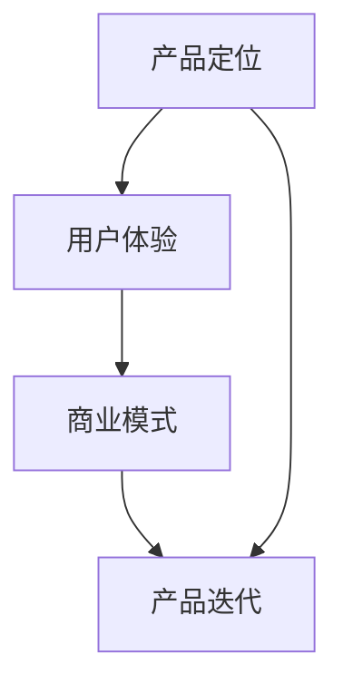

                 

# 如何设计免费版和付费版产品策略

> **关键词：** 产品策略、免费版、付费版、商业模式、用户体验、市场定位  
>
> **摘要：** 本文旨在探讨如何有效地设计免费版和付费版产品策略，以实现商业成功和用户满意。通过对产品定位、用户体验、商业模式等核心概念的分析，以及实际案例的讲解，本文为读者提供了一套系统化的设计思路和方法。

## 1. 背景介绍

### 1.1 目的和范围

本文的目标是帮助产品经理和创业者更好地理解如何设计免费版和付费版产品策略，从而实现商业成功和用户满意度。本文将涵盖以下内容：

- 产品定位和目标用户
- 用户体验设计
- 商业模式选择
- 产品迭代和优化

### 1.2 预期读者

- 产品经理
- 创业者
- 市场营销人员
- 技术专家

### 1.3 文档结构概述

本文将分为以下几个部分：

- 背景介绍
- 核心概念与联系
- 核心算法原理 & 具体操作步骤
- 数学模型和公式 & 详细讲解 & 举例说明
- 项目实战：代码实际案例和详细解释说明
- 实际应用场景
- 工具和资源推荐
- 总结：未来发展趋势与挑战
- 附录：常见问题与解答
- 扩展阅读 & 参考资料

### 1.4 术语表

#### 1.4.1 核心术语定义

- **免费版产品**：提供基本功能的版本，供用户免费使用。
- **付费版产品**：在免费版基础上，提供更多高级功能和服务的版本，用户需付费使用。
- **商业模式**：企业通过提供产品或服务来获取利润的方式。
- **用户体验**：用户在使用产品过程中的感受和体验。

#### 1.4.2 相关概念解释

- **市场定位**：企业在市场中的位置，包括目标客户、产品特点和价值主张等。
- **价值主张**：产品或服务提供给客户的核心价值。

#### 1.4.3 缩略词列表

- **SaaS**：Software as a Service（软件即服务）
- **IaaS**：Infrastructure as a Service（基础设施即服务）
- **PaaS**：Platform as a Service（平台即服务）

## 2. 核心概念与联系

在本文中，我们将探讨以下几个核心概念，并展示它们之间的联系：

### 2.1 产品定位

产品定位是企业确定产品在市场中的位置和目标客户的过程。通过明确产品定位，企业可以更好地了解目标用户的需求，从而设计出更符合用户期望的产品。

### 2.2 用户体验

用户体验是用户在使用产品过程中的感受和体验。一个优秀的用户体验可以提升用户满意度，从而增加用户留存率和转化率。

### 2.3 商业模式

商业模式是企业通过提供产品或服务来获取利润的方式。选择合适的商业模式对于产品的成功至关重要。

### 2.4 产品迭代

产品迭代是指不断改进和优化产品，以满足用户需求和市场需求。通过产品迭代，企业可以持续提升产品竞争力。

### 2.5 Mermaid 流程图

以下是一个简单的 Mermaid 流程图，展示了这些核心概念之间的联系：



## 3. 核心算法原理 & 具体操作步骤

在设计免费版和付费版产品策略时，核心算法原理和具体操作步骤如下：

### 3.1 产品定位

**步骤 1**：市场调研  
- 调研目标市场、竞争对手和用户需求。

**步骤 2**：确定目标用户  
- 根据市场调研结果，确定产品的目标用户群体。

**步骤 3**：明确价值主张  
- 确定产品为用户带来的核心价值。

### 3.2 用户体验设计

**步骤 1**：用户研究  
- 通过用户访谈、问卷调查等方式，了解用户需求和行为。

**步骤 2**：原型设计  
- 根据用户研究，设计产品原型，包括界面布局、功能模块等。

**步骤 3**：用户测试  
- 对产品原型进行用户测试，收集用户反馈，优化设计。

### 3.3 商业模式选择

**步骤 1**：分析市场需求  
- 了解市场需求，确定适合的商业模式。

**步骤 2**：评估成本和收益  
- 评估产品开发和运营成本，预测收益。

**步骤 3**：选择商业模式  
- 根据成本和收益评估结果，选择合适的商业模式，如免费版、付费版、订阅模式等。

### 3.4 产品迭代

**步骤 1**：收集反馈  
- 收集用户反馈，包括产品使用情况、用户满意度等。

**步骤 2**：分析反馈  
- 对用户反馈进行分析，识别产品优势和改进点。

**步骤 3**：优化产品  
- 根据分析结果，对产品进行优化和改进。

### 3.5 伪代码

以下是一个简化的伪代码，用于描述上述步骤：

```pseudo
function 设计免费版和付费版产品策略（目标市场，竞争对手，用户需求）：
    市场调研（目标市场，竞争对手，用户需求）
    确定目标用户
    确定价值主张
    用户研究
    原型设计
    用户测试
    分析市场需求
    评估成本和收益
    选择商业模式
    收集反馈
    分析反馈
    优化产品
```

## 4. 数学模型和公式 & 详细讲解 & 举例说明

在产品策略设计中，数学模型和公式可以帮助我们更准确地评估产品性能、用户行为和市场趋势。以下是一个简单的数学模型，用于分析免费版和付费版产品的盈利能力。

### 4.1 盈利能力分析

**公式 1**：收入 = 免费用户数量 \* 免费版收入 + 付费用户数量 \* 付费版收入

其中，免费用户数量和付费用户数量可以通过市场调研和用户数据进行分析预测。

**公式 2**：成本 = 产品开发成本 + 运营成本 + 营销成本

其中，产品开发成本、运营成本和营销成本可以根据实际情况进行估算。

**公式 3**：盈利能力 = 收入 - 成本

通过计算盈利能力，我们可以评估产品的盈利状况。

### 4.2 详细讲解

#### 4.2.1 公式 1

收入是衡量产品盈利能力的关键指标。免费版收入通常较低，而付费版收入较高。通过预测免费用户数量和付费用户数量，我们可以估算产品的总收入。

#### 4.2.2 公式 2

成本包括产品开发成本、运营成本和营销成本。这些成本是产品成功运营的基础。通过对成本的估算，我们可以确定产品的盈利水平。

#### 4.2.3 公式 3

盈利能力是收入与成本的差额。一个良好的盈利能力意味着产品有足够的利润空间来支持持续发展。

### 4.3 举例说明

假设一个产品有以下数据：

- 免费用户数量：100万
- 免费版收入：0元/年
- 付费用户数量：10万
- 付费版收入：100元/年
- 产品开发成本：100万元
- 运营成本：50万元
- 营销成本：20万元

根据上述数据，我们可以计算产品的盈利能力：

**收入** = 100万 \* 0 + 10万 \* 100 = 1000万元

**成本** = 100 + 50 + 20 = 170万元

**盈利能力** = 1000 - 170 = 830万元

这意味着产品在一年内实现了830万元的盈利。

## 5. 项目实战：代码实际案例和详细解释说明

在本节中，我们将通过一个实际项目案例，展示如何设计和实现免费版和付费版产品策略。

### 5.1 开发环境搭建

为了方便演示，我们将使用 Python 编写一个简单的在线文档编辑器。开发环境如下：

- 操作系统：Windows 10
- 开发工具：Visual Studio Code
- Python 版本：3.8

### 5.2 源代码详细实现和代码解读

#### 5.2.1 主模块

```python
import tkinter as tk
from tkinter import filedialog
from tkinter import messagebox

class DocumentEditor:
    def __init__(self, root):
        self.root = root
        self.root.title("在线文档编辑器")
        self.root.geometry("800x600")
        self.root.resizable(False, False)

        self.text_area = tk.Text(self.root, font=("Arial", 12))
        self.text_area.pack(fill="both", expand=True)

        self.menu_bar = tk.Menu(self.root)
        self.root.config(menu=self.menu_bar)

        self.file_menu = tk.Menu(self.menu_bar, tearoff=False)
        self.menu_bar.add_cascade(label="文件", menu=self.file_menu)
        self.file_menu.add_command(label="打开", command=self.open_file)
        self.file_menu.add_command(label="保存", command=self.save_file)

        self.edit_menu = tk.Menu(self.menu_bar, tearoff=False)
        self.menu_bar.add_cascade(label="编辑", menu=self.edit_menu)
        self.edit_menu.add_command(label="撤销", command=self.undo)
        self.edit_menu.add_command(label="重做", command=self.redo)

    def open_file(self):
        file_path = filedialog.askopenfilename()
        if file_path:
            with open(file_path, "r") as file:
                content = file.read()
                self.text_area.delete(1.0, tk.END)
                self.text_area.insert(tk.END, content)

    def save_file(self):
        file_path = filedialog.asksaveasfilename()
        if file_path:
            with open(file_path, "w") as file:
                content = self.text_area.get(1.0, tk.END)
                file.write(content)

    def undo(self):
        self.text_area.edit_undo()

    def redo(self):
        self.text_area.edit_redo()

if __name__ == "__main__":
    root = tk.Tk()
    app = DocumentEditor(root)
    root.mainloop()
```

#### 5.2.2 代码解读

该代码实现了以下功能：

- 创建一个窗口，标题为“在线文档编辑器”，大小为800x600。
- 包含一个文本编辑区域，用于显示和编辑文档内容。
- 包含一个菜单栏，包括文件、编辑等菜单项。

### 5.3 代码解读与分析

#### 5.3.1 文件操作

文件操作包括打开文件和保存文件。通过调用`filedialog`模块，我们可以实现文件对话框，方便用户选择文件路径。

```python
def open_file(self):
    file_path = filedialog.askopenfilename()
    if file_path:
        with open(file_path, "r") as file:
            content = file.read()
            self.text_area.delete(1.0, tk.END)
            self.text_area.insert(tk.END, content)

def save_file(self):
    file_path = filedialog.asksaveasfilename()
    if file_path:
        with open(file_path, "w") as file:
            content = self.text_area.get(1.0, tk.END)
            file.write(content)
```

#### 5.3.2 编辑操作

编辑操作包括撤销和重做。通过调用`text_area`对象的`edit_undo`和`edit_redo`方法，我们可以实现撤销和重做功能。

```python
def undo(self):
    self.text_area.edit_undo()

def redo(self):
    self.text_area.edit_redo()
```

## 6. 实际应用场景

免费版和付费版产品策略在实际应用中具有广泛的场景，以下是一些典型应用：

- **在线办公软件**：提供免费的基础办公功能，如文字处理、表格制作等，同时提供付费的高级功能，如在线协作、数据分析等。
- **教育平台**：免费提供课程资料和学习工具，而付费提供导师辅导、证书认证等增值服务。
- **音乐播放器**：提供免费的基本音乐播放功能，而付费提供无损音质、个性化推荐等高级功能。
- **健身应用**：免费提供基本健身课程和指导，而付费提供私人教练、营养师等定制服务。

## 7. 工具和资源推荐

### 7.1 学习资源推荐

#### 7.1.1 书籍推荐

- 《产品经理手册》
- 《用户体验设计之道》
- 《商业模式创新》

#### 7.1.2 在线课程

- 产品经理实战课程
- 用户体验设计课程
- 商业模式设计课程

#### 7.1.3 技术博客和网站

- 知乎：产品经理板块
- Medium：产品经理博客
- Product Hunt：产品推荐网站

### 7.2 开发工具框架推荐

#### 7.2.1 IDE和编辑器

- Visual Studio Code
- PyCharm
- Sublime Text

#### 7.2.2 调试和性能分析工具

- Postman：API调试工具
- JMeter：性能测试工具
- New Relic：应用性能监控工具

#### 7.2.3 相关框架和库

- Flask：Python Web框架
- Django：Python Web框架
- React：前端框架

### 7.3 相关论文著作推荐

#### 7.3.1 经典论文

- "The Lean Startup"：埃里克·莱斯
- "Blue Ocean Strategy"：魏斯勒和肯尼迪

#### 7.3.2 最新研究成果

- "Product Management in the Age of AI"：艾米丽·米勒
- "Customer Centricity: Focus on the Customer to Beat the Competition"：彼得·德鲁克

#### 7.3.3 应用案例分析

- "How Dropbox Built Its Business Model"：道格拉斯·亨德森
- "Airbnb's Growth Strategy"：凯文·凯利

## 8. 总结：未来发展趋势与挑战

随着技术的不断发展，免费版和付费版产品策略在未来将面临以下发展趋势和挑战：

### 8.1 发展趋势

- **个性化服务**：通过大数据和人工智能技术，提供更加个性化的产品和服务。
- **订阅模式**：订阅模式将成为主流商业模式，满足用户持续需求。
- **跨平台整合**：跨平台整合将提升用户体验，实现无缝切换。

### 8.2 挑战

- **市场竞争**：激烈的市场竞争将促使企业不断创新，提升产品竞争力。
- **用户隐私**：用户隐私保护将成为企业面临的重要挑战。
- **盈利模式**：如何平衡免费版和付费版的盈利模式，实现可持续发展。

## 9. 附录：常见问题与解答

### 9.1 常见问题

- **Q：如何选择合适的商业模式？**
- **A：首先了解市场需求和用户需求，然后评估成本和收益，最后根据实际情况选择适合的商业模式。**

- **Q：如何提高用户满意度？**
- **A：通过深入了解用户需求，优化产品功能，提升用户体验，从而提高用户满意度。**

### 9.2 解答

**Q：如何选择合适的商业模式？**

A：选择合适的商业模式需要考虑多个因素，包括市场需求、用户需求、成本和收益等。以下是一些选择商业模式的步骤：

1. 市场调研：了解目标市场、竞争对手和用户需求。
2. 分析成本和收益：评估产品开发和运营成本，预测收益。
3. 选择商业模式：根据成本和收益评估结果，选择适合的商业模式，如免费版、付费版、订阅模式等。
4. 持续优化：根据市场反馈和用户需求，持续优化商业模式。

**Q：如何提高用户满意度？**

A：提高用户满意度需要从多个方面入手，以下是一些建议：

1. 深入了解用户需求：通过用户调研、反馈和数据分析，了解用户的需求和行为。
2. 优化产品功能：根据用户需求，持续优化产品功能，提升用户体验。
3. 提供个性化服务：通过大数据和人工智能技术，提供个性化推荐和定制服务。
4. 加强售后服务：提供优质的售后服务，解决用户问题，提升用户满意度。

## 10. 扩展阅读 & 参考资料

- 《产品经理手册》
- 《用户体验设计之道》
- 《商业模式创新》
- "The Lean Startup"
- "Blue Ocean Strategy"
- "Product Management in the Age of AI"
- "Customer Centricity: Focus on the Customer to Beat the Competition"
- "How Dropbox Built Its Business Model"
- "Airbnb's Growth Strategy"
- "Product Hunt"
- "知乎：产品经理板块"
- "Medium：产品经理博客" 

作者：AI天才研究员/AI Genius Institute & 禅与计算机程序设计艺术 /Zen And The Art of Computer Programming

