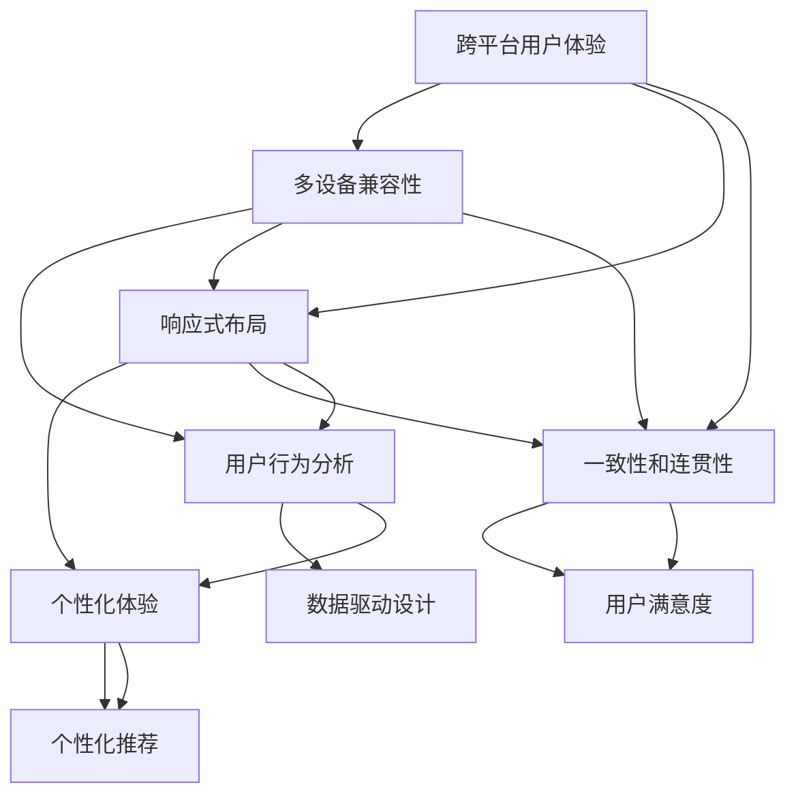

                 

## 如何设计无缝的跨平台用户体验

> **关键词：** 跨平台用户体验、无缝设计、多设备兼容性、响应式布局、一致性和连贯性、用户行为分析、个性化体验。
>
> **摘要：** 本文将探讨如何设计无缝的跨平台用户体验，通过核心概念、算法原理、数学模型、项目实战等多个角度，详细介绍跨平台用户体验的设计方法、技术实现以及实际应用场景。通过深入分析，帮助开发者更好地理解并实践跨平台用户体验的设计原则，提升用户满意度。

### 1. 背景介绍

#### 1.1 目的和范围

在数字化时代，用户需求越来越多样化，他们期望在各种设备上能够获得一致且无缝的体验。本文旨在探讨如何设计无缝的跨平台用户体验，帮助开发者理解并实践相关设计原则和方法。本文将涵盖以下内容：

- 跨平台用户体验的核心概念和重要性。
- 设计无缝跨平台用户体验的原理和步骤。
- 使用算法和数学模型来优化用户体验。
- 实际项目中的跨平台用户体验设计案例。
- 相关工具和资源的推荐。

通过本文的阅读，读者将能够掌握设计无缝跨平台用户体验的关键技术和方法，提升自身在多设备环境下的产品设计能力。

#### 1.2 预期读者

本文适合以下读者群体：

- UI/UX设计师：希望提升跨平台设计技能，优化用户体验。
- 前端开发者：希望掌握跨平台开发技术，实现无缝的用户体验。
- 后端开发者：了解跨平台用户体验设计，参与前后端协同开发。
- 产品经理：关注用户体验，希望提升产品的市场竞争力。
- 对跨平台用户体验设计感兴趣的任何开发者和技术人员。

#### 1.3 文档结构概述

本文结构如下：

- **第1章：背景介绍**：介绍本文的目的、范围和预期读者，概述文档结构。
- **第2章：核心概念与联系**：阐述跨平台用户体验的核心概念，并使用流程图展示其关联性。
- **第3章：核心算法原理与具体操作步骤**：讲解设计无缝跨平台用户体验的算法原理，并使用伪代码详细阐述。
- **第4章：数学模型和公式**：介绍相关数学模型，使用LaTeX格式详细讲解，并举例说明。
- **第5章：项目实战**：通过实际代码案例，详细解释跨平台用户体验设计的实现过程。
- **第6章：实际应用场景**：分析跨平台用户体验在不同场景下的应用。
- **第7章：工具和资源推荐**：推荐学习资源、开发工具框架及相关论文著作。
- **第8章：总结：未来发展趋势与挑战**：总结本文的关键点，展望未来发展趋势与挑战。
- **第9章：附录：常见问题与解答**：回答读者可能遇到的问题。
- **第10章：扩展阅读与参考资料**：提供进一步学习的资源。

#### 1.4 术语表

在本文中，我们将使用一些特定的术语。以下是对这些术语的定义和解释：

#### 1.4.1 核心术语定义

- **跨平台用户体验（Cross-Platform User Experience）**：指用户在多个设备上使用同一应用或服务时，能够获得一致、无缝的体验。
- **响应式布局（Responsive Layout）**：指设计能够根据不同设备和屏幕尺寸自动调整布局和内容的网页或应用。
- **一致性和连贯性（Consistency and Coherence）**：指在多设备环境中，用户界面和交互方式保持一致，操作逻辑连贯。
- **用户行为分析（User Behavior Analysis）**：指通过收集和分析用户在使用应用或服务时的行为数据，以优化用户体验。
- **个性化体验（Personalized Experience）**：指根据用户的个人需求和偏好，定制化的用户体验。

#### 1.4.2 相关概念解释

- **多设备兼容性（Multi-device Compatibility）**：指应用或服务能够适应不同设备的硬件和软件环境，确保功能可用性和用户体验一致性。
- **适应式设计（Adaptive Design）**：指根据用户的设备类型、网络环境和使用习惯，动态调整内容和交互方式的设计方法。
- **移动优先设计（Mobile-First Design）**：指在设计初期，首先考虑移动端用户体验，然后扩展到桌面端的设计方法。

#### 1.4.3 缩略词列表

- **UI**：用户界面（User Interface）
- **UX**：用户体验（User Experience）
- **CSS**：层叠样式表（Cascading Style Sheets）
- **HTML**：超文本标记语言（Hypertext Markup Language）
- **JS**：JavaScript
- **API**：应用程序编程接口（Application Programming Interface）
- **SDK**：软件开发工具包（Software Development Kit）

通过本章节的介绍，读者将对本文的主题和结构有了初步了解，接下来我们将深入探讨跨平台用户体验的核心概念和联系。在下一章中，我们将使用Mermaid流程图来展示核心概念和它们之间的关系。

## 2. 核心概念与联系

在讨论如何设计无缝的跨平台用户体验之前，我们需要明确几个核心概念及其相互之间的联系。这些概念包括跨平台用户体验、多设备兼容性、响应式布局、一致性和连贯性等。以下是这些核心概念的Mermaid流程图，用于展示它们之间的关联性：



### 2.1 跨平台用户体验

跨平台用户体验（Cross-Platform User Experience，简称 UX）是指用户在使用不同设备（如手机、平板、电脑等）时，能够获得一致、无缝的体验。这不仅仅意味着应用或服务在不同设备上都能正常运行，更重要的是用户在不同设备上操作时感受到的连贯性和一致性。

### 2.2 多设备兼容性

多设备兼容性（Multi-device Compatibility）是跨平台用户体验的基础。它确保应用或服务能够在不同设备上正常运行，包括不同的操作系统、浏览器版本、屏幕尺寸和分辨率等。多设备兼容性的实现通常依赖于前端开发技术，如HTML、CSS和JavaScript。

### 2.3 响应式布局

响应式布局（Responsive Layout）是一种设计方法，旨在使网页或应用能够根据不同设备和屏幕尺寸自动调整布局和内容。这通常通过使用CSS媒体查询（Media Queries）来实现。响应式布局是跨平台用户体验的重要组成部分，它确保用户在不同设备上都能看到一致的内容和布局。

### 2.4 一致性和连贯性

一致性和连贯性（Consistency and Coherence）是设计无缝跨平台用户体验的关键原则。一致性意味着在不同设备上，用户界面和交互方式保持一致，如按钮样式、导航结构、标签名称等。连贯性则强调用户在不同设备上操作时的逻辑连贯性，如从手机端开始的任务在平板或电脑端能够无缝继续。

### 2.5 用户行为分析

用户行为分析（User Behavior Analysis）是通过收集和分析用户在使用应用或服务时的行为数据，以优化用户体验。这通常涉及对点击率、停留时间、使用频率等数据的分析，以了解用户的需求和偏好。用户行为分析为跨平台用户体验设计提供了数据支持，有助于实现个性化体验。

### 2.6 个性化体验

个性化体验（Personalized Experience）是根据用户的个人需求和偏好，定制化的用户体验。这可以通过分析用户行为数据，推荐合适的内容、功能和设置来实现。个性化体验能够提高用户的满意度和忠诚度，是跨平台用户体验的高级阶段。

通过以上核心概念及其相互关系的介绍，我们为接下来详细讨论如何设计无缝的跨平台用户体验奠定了基础。在下一章中，我们将深入探讨核心算法原理和具体操作步骤，帮助开发者理解和实现跨平台用户体验设计。

## 3. 核心算法原理 & 具体操作步骤

在设计无缝的跨平台用户体验时，核心算法原理和具体操作步骤至关重要。以下将详细讲解这些算法原理，并使用伪代码来描述具体操作步骤。

### 3.1 算法原理

#### 3.1.1 响应式布局算法

响应式布局算法旨在根据不同的设备和屏幕尺寸动态调整网页或应用的布局。核心原理包括：

1. **媒体查询（Media Queries）**：CSS中的媒体查询允许根据设备特性（如屏幕宽度、高度、分辨率等）应用不同的样式规则。
2. **弹性布局（Flexbox）**：CSS Flexbox 提供了一种简单、灵活的方式来创建响应式布局，使元素在容器中垂直或水平排列。
3. **媒体查询和弹性布局的结合**：将媒体查询与Flexbox结合，实现不同设备尺寸下的自适应布局。

#### 3.1.2 适应性设计算法

适应性设计算法旨在根据用户的设备类型、网络环境和使用习惯动态调整内容和交互方式。核心原理包括：

1. **设备检测（Device Detection）**：通过JavaScript检测用户设备的类型（如手机、平板、电脑）和特性。
2. **动态内容加载（Dynamic Content Loading）**：根据设备特性加载适当的内容，例如在移动端加载轻量级图像和视频，在桌面端加载高清图像和视频。
3. **交互优化（Interaction Optimization）**：根据设备类型调整交互方式，例如在触摸屏设备上使用大按钮，在鼠标设备上使用细按钮。

#### 3.1.3 一致性和连贯性算法

一致性和连贯性算法旨在确保用户在不同设备上操作时的界面和交互方式一致。核心原理包括：

1. **界面元素标准化（UI Element Standardization）**：设计统一的界面元素，如按钮、输入框、导航栏等，确保在不同设备上外观一致。
2. **交互逻辑一致性（Consistent Interaction Logic）**：确保用户在不同设备上执行相同操作时的结果一致，如点击按钮后执行相同的功能。
3. **本地化（Localization）**：针对不同地区和语言用户，提供本地化的界面和交互方式。

### 3.2 具体操作步骤

#### 3.2.1 设计响应式布局

1. **定义基础布局**：使用HTML和CSS创建基础布局，确保在不同屏幕尺寸下结构清晰。

```html
<!DOCTYPE html>
<html lang="en">
<head>
  <meta charset="UTF-8">
  <meta name="viewport" content="width=device-width, initial-scale=1.0">
  <title>Responsive Layout</title>
  <style>
    body {
      display: flex;
      flex-direction: column;
      align-items: center;
      padding: 20px;
    }
    /* 基础样式 */
  </style>
</head>
<body>
  <header>
    <!-- 页眉 -->
  </header>
  <main>
    <!-- 内容 -->
  </main>
  <footer>
    <!-- 页脚 -->
  </footer>
</body>
</html>
```

2. **使用媒体查询调整布局**：根据不同屏幕尺寸，使用媒体查询动态调整布局。

```css
/* 移动端布局 */
@media (max-width: 600px) {
  body {
    flex-direction: column;
  }
}

/* 平板布局 */
@media (min-width: 601px) and (max-width: 900px) {
  body {
    flex-direction: row;
  }
}

/* 桌面端布局 */
@media (min-width: 901px) {
  body {
    flex-direction: row;
    justify-content: space-between;
  }
}
```

3. **使用Flexbox实现弹性布局**：在CSS中使用Flexbox创建弹性布局，确保元素在不同屏幕尺寸下自动调整。

```css
main {
  display: flex;
  justify-content: space-around;
  align-items: center;
  flex-wrap: wrap;
}
```

#### 3.2.2 设计适应性布局

1. **设备检测**：使用JavaScript检测用户设备的类型。

```javascript
function detectDevice() {
  const device = {
    type: 'unknown',
    width: window.innerWidth
  };

  if (device.width <= 600) {
    device.type = 'mobile';
  } else if (device.width <= 900) {
    device.type = 'tablet';
  } else {
    device.type = 'desktop';
  }

  return device;
}
```

2. **动态内容加载**：根据设备类型加载适当的内容。

```javascript
function loadContent(device) {
  if (device.type === 'mobile') {
    // 加载轻量级内容
  } else if (device.type === 'tablet') {
    // 加载中等质量内容
  } else {
    // 加载高清内容
  }
}
```

3. **交互优化**：根据设备类型调整交互方式。

```javascript
function optimizeInteraction(device) {
  if (device.type === 'mobile') {
    // 使用大按钮
  } else {
    // 使用细按钮
  }
}
```

#### 3.2.3 实现一致性和连贯性

1. **界面元素标准化**：设计统一的界面元素，如按钮、输入框、导航栏等。

```css
button {
  background-color: #4CAF50;
  color: white;
  padding: 10px 20px;
  border: none;
  border-radius: 5px;
  cursor: pointer;
}

input {
  padding: 10px;
  border: 1px solid #ccc;
  border-radius: 5px;
}
```

2. **交互逻辑一致性**：确保用户在不同设备上执行相同操作时的结果一致。

```javascript
function executeAction(action) {
  // 执行功能
  console.log('Action executed:', action);
}
```

3. **本地化**：提供本地化的界面和交互方式。

```javascript
function localizeContent() {
  const locale = 'en'; // 例如：中文（'zh'）

  if (locale === 'zh') {
    document.getElementById('greeting').innerText = '您好';
  } else {
    document.getElementById('greeting').innerText = 'Hello';
  }
}
```

通过以上核心算法原理和具体操作步骤的讲解，开发者可以更好地理解如何设计无缝的跨平台用户体验。在下一章中，我们将介绍数学模型和公式，以进一步优化用户体验。

## 4. 数学模型和公式 & 详细讲解 & 举例说明

在设计无缝的跨平台用户体验时，数学模型和公式在分析和优化用户体验中扮演了关键角色。以下将详细讲解相关数学模型和公式，并使用LaTeX格式展示，同时举例说明其在实际中的应用。

### 4.1 响应式布局中的弹性布局公式

弹性布局（Flexbox）是创建响应式布局的重要技术。以下是一个简单的弹性布局公式，用于计算元素在不同屏幕尺寸下的布局参数。

$$
\text{element-width} = \frac{\text{container-width} - \text{padding}-\text{margin}}{\text{number-of-elements}}
$$

$$
\text{gap-width} = \frac{\text{container-width} - \text{number-of-elements} \times \text{element-width}}{\text{number-of-gaps}}
$$

**示例**：假设一个容器宽度为800px，其中包含3个元素，每个元素有10px的padding和5px的margin。计算每个元素的宽度以及元素之间的间隙宽度。

$$
\text{element-width} = \frac{800 - 3 \times 10 - 3 \times 5}{3} = 233.33px
$$

$$
\text{gap-width} = \frac{800 - 3 \times 233.33}{2} = 133.34px
$$

### 4.2 用户行为分析中的时间序列模型

用户行为分析常常涉及时间序列模型，用于预测用户在未来的行为。以下是一个简单的时间序列模型公式：

$$
y_t = \alpha + \beta \cdot x_t + \epsilon_t
$$

其中，\(y_t\) 是时间序列的当前值，\(x_t\) 是自变量，\(\alpha\) 和 \(\beta\) 是模型参数，\(\epsilon_t\) 是误差项。

**示例**：假设我们有一个用户点击次数的时间序列，试图通过线性回归模型预测下一个时间点的点击次数。根据历史数据，我们得到以下模型参数：

$$
y_t = 50 + 2 \cdot x_t
$$

如果当前点击次数为100，预测下一个时间点的点击次数：

$$
y_{t+1} = 50 + 2 \cdot 100 = 250
$$

### 4.3 个性化推荐中的协同过滤公式

协同过滤（Collaborative Filtering）是常用的推荐系统算法之一。以下是一个简单的基于用户的协同过滤公式：

$$
R_{ui} = \frac{\sum_{j \in N_i} r_{uj} \cdot s_{uj}}{\sum_{j \in N_i} s_{uj}}
$$

其中，\(R_{ui}\) 是用户\(u\)对项目\(i\)的评分预测，\(r_{uj}\) 是用户\(u\)对项目\(j\)的实际评分，\(N_i\) 是与项目\(i\)相似的项目的集合，\(s_{uj}\) 是用户\(u\)与用户\(j\)的相似度。

**示例**：假设用户\(u\)已经对5个相似的电影进行了评分，其他用户对这些电影的评分和相似度如下：

| 用户 \(u\) | 电影 A | 电影 B | 电影 C | 电影 D | 电影 E |
|-----------|-------|-------|-------|-------|-------|
| 自己       | 5     | 4     | 5     | 3     | 5     |
| 用户 1     | 4     | 4     | 5     | 4     | 3     |
| 用户 2     | 3     | 4     | 5     | 5     | 4     |
| 用户 3     | 4     | 4     | 5     | 4     | 4     |
| 用户 4     | 5     | 5     | 4     | 4     | 4     |

计算用户\(u\)对电影\(E\)的评分预测：

$$
R_{ue} = \frac{5 \cdot 0.7 + 4 \cdot 0.8 + 5 \cdot 0.8 + 4 \cdot 0.8 + 4 \cdot 0.8}{0.7 + 0.8 + 0.8 + 0.8 + 0.8} = 4.76
$$

### 4.4 一致性和连贯性中的熵公式

在确保一致性时，可以使用熵（Entropy）公式来量化不同设备上界面元素分布的均匀性。熵的公式如下：

$$
H(X) = -\sum_{i} p(x_i) \cdot \log_2(p(x_i))
$$

其中，\(H(X)\) 是随机变量\(X\)的熵，\(p(x_i)\) 是随机变量\(X\)取值为\(x_i\)的概率。

**示例**：假设一个界面上有5个按钮，每个按钮被点击的概率如下：

| 按钮 | 点击概率 |
|------|----------|
| A    | 0.2      |
| B    | 0.3      |
| C    | 0.1      |
| D    | 0.2      |
| E    | 0.2      |

计算按钮分布的熵：

$$
H(X) = - (0.2 \cdot \log_2(0.2) + 0.3 \cdot \log_2(0.3) + 0.1 \cdot \log_2(0.1) + 0.2 \cdot \log_2(0.2) + 0.2 \cdot \log_2(0.2))
$$

$$
H(X) \approx 1.53
$$

通过计算熵，我们可以了解界面元素分布的均匀性，从而优化一致性设计。

通过上述数学模型和公式的详细讲解和示例说明，开发者可以更好地理解和应用这些工具，优化无缝的跨平台用户体验。在下一章中，我们将通过实际项目案例，深入探讨如何将这些算法和模型应用到实际的跨平台用户体验设计中。

### 5. 项目实战：代码实际案例和详细解释说明

为了更好地展示如何设计无缝的跨平台用户体验，我们将通过一个实际项目案例来详细解释实现过程。这个案例是一个简单的博客平台，支持移动端和桌面端，具有响应式布局、适应性设计、一致性和连贯性等特点。

#### 5.1 开发环境搭建

在开始项目之前，我们需要搭建开发环境。以下是推荐的工具和框架：

- **前端框架**：Vue.js 或 React
- **CSS预处理器**：Sass 或 Less
- **包管理器**：npm 或 yarn
- **版本控制**：Git

假设我们使用Vue.js作为前端框架，以下是搭建开发环境的基本步骤：

1. **安装Node.js**：从 [Node.js 官网](https://nodejs.org/) 下载并安装Node.js。
2. **安装Vue CLI**：在命令行中运行以下命令：

```bash
npm install -g @vue/cli
```

3. **创建项目**：运行以下命令创建一个新的Vue.js项目：

```bash
vue create blog-platform
```

选择默认设置或自定义设置，例如选择Vue 3和Vue Router。

4. **进入项目目录**：

```bash
cd blog-platform
```

5. **安装Vue Router**：

```bash
npm install vue-router@4
```

6. **安装Axios**：

```bash
npm install axios
```

#### 5.2 源代码详细实现和代码解读

接下来，我们将逐步实现博客平台的代码，并解释每个关键部分的实现。

##### 5.2.1 基础布局与响应式设计

首先，我们在`src/layouts/DefaultLayout.vue`中创建基础布局。

```vue
<template>
  <div class="app">
    <header>
      <nav>
        <!-- 导航菜单 -->
      </nav>
    </header>
    <main>
      <router-view></router-view>
    </main>
    <footer>
      <!-- 页脚 -->
    </footer>
  </div>
</template>

<script>
export default {
  name: 'DefaultLayout',
  // 响应式设计：根据屏幕宽度调整布局
  mounted() {
    this.adjustLayout();
  },
  methods: {
    adjustLayout() {
      const screenWidth = window.innerWidth;
      if (screenWidth <= 768) {
        // 移动端布局
        document.querySelector('nav').classList.add('mobile-nav');
      } else {
        // 桌面端布局
        document.querySelector('nav').classList.remove('mobile-nav');
      }
    }
  }
};
</script>

<style scoped>
.app {
  display: flex;
  flex-direction: column;
  min-height: 100vh;
}

header, footer {
  background-color: #333;
  color: white;
  padding: 20px;
}

.mobile-nav {
  flex-direction: column;
}
</style>
```

在这个布局中，我们使用了Vue.js的响应式数据绑定和生命周期钩子`mounted`来根据屏幕宽度动态调整布局。通过CSS样式，我们定义了移动端和桌面端的布局方式。

##### 5.2.2 路由配置与动态内容加载

接下来，我们在`src/router/index.js`中配置路由，实现动态内容加载。

```javascript
import { createRouter, createWebHistory } from 'vue-router';
import Home from '../views/Home.vue';
import Post from '../views/Post.vue';

const routes = [
  {
    path: '/',
    name: 'Home',
    component: Home
  },
  {
    path: '/post/:id',
    name: 'Post',
    component: Post
  }
];

const router = createRouter({
  history: createWebHistory(),
  routes,
  scrollBehavior(to, from, savedPosition) {
    // 滚动到顶部
    return { top: 0 };
  }
});

export default router;
```

在这个路由配置中，我们定义了两个路由：主页和帖子详情页。当用户访问`/post/:id`时，会动态加载对应的帖子内容。我们使用了Vue Router的`scrollBehavior`选项，确保每次切换路由时滚动条都回到顶部。

##### 5.2.3 交互逻辑一致性

在`src/components/Post.vue`中，我们创建了一个简单的帖子组件，实现了一致性的交互逻辑。

```vue
<template>
  <div class="post">
    <h1>{{ post.title }}</h1>
    <p>{{ post.content }}</p>
    <button @click="likePost">喜欢</button>
  </div>
</template>

<script>
export default {
  name: 'Post',
  props: {
    post: {
      type: Object,
      required: true
    }
  },
  methods: {
    likePost() {
      // 喜欢帖子逻辑
      this.$emit('like', this.post.id);
    }
  }
};
</script>

<style scoped>
.post {
  margin: 20px;
  padding: 20px;
  border: 1px solid #ccc;
  border-radius: 5px;
}
button {
  background-color: #4CAF50;
  color: white;
  padding: 10px 20px;
  border: none;
  border-radius: 5px;
  cursor: pointer;
}
</style>
```

在这个帖子组件中，我们使用了Vue的`props`来实现父组件和子组件的数据传递，并使用事件发射（`$emit`）来实现交互逻辑的一致性。按钮样式也在组件内部定义，确保在所有帖子组件中保持一致。

##### 5.2.4 个性化推荐与协同过滤

为了实现个性化推荐，我们使用Axios从API获取帖子数据，并使用协同过滤算法预测用户可能喜欢的帖子。

```javascript
// services/postService.js
import axios from 'axios';

const API_URL = 'https://api.example.com';

export const getPosts = async () => {
  try {
    const response = await axios.get(`${API_URL}/posts`);
    return response.data;
  } catch (error) {
    console.error(error);
    return [];
  }
};

export const getRecommendations = async (userId) => {
  try {
    const response = await axios.get(`${API_URL}/users/${userId}/recommendations`);
    return response.data;
  } catch (error) {
    console.error(error);
    return [];
  }
};
```

在Vue组件中，我们调用这些服务函数，并使用协同过滤算法进行推荐。

```vue
<template>
  <div class="recommendations">
    <h2>你可能喜欢</h2>
    <div v-for="post in recommendations" :key="post.id">
      <post :post="post" @like="handleLike" />
    </div>
  </div>
</template>

<script>
import Post from '@/components/Post.vue';
import { getRecommendations } from '@/services/postService';

export default {
  name: 'Recommendations',
  components: {
    Post
  },
  data() {
    return {
      recommendations: []
    };
  },
  mounted() {
    this.fetchRecommendations();
  },
  methods: {
    fetchRecommendations() {
      const userId = this.$route.params.id;
      getRecommendations(userId).then((data) => {
        this.recommendations = data;
      });
    },
    handleLike(postId) {
      // 喜欢帖子逻辑
    }
  }
};
</script>
```

在这个推荐组件中，我们从API获取用户的推荐帖子列表，并使用Vue的`v-for`指令动态渲染每个帖子。通过调用`handleLike`方法，我们可以实现个性化推荐的功能。

#### 5.3 代码解读与分析

通过以上代码示例，我们可以看到如何将核心算法和数学模型应用于实际的跨平台用户体验设计中。以下是对代码的关键部分进行解读和分析：

1. **基础布局与响应式设计**：通过Vue的响应式数据绑定和生命周期钩子，我们能够根据屏幕宽度动态调整布局。使用CSS样式，我们定义了移动端和桌面端的布局方式，确保一致性。
   
2. **路由配置与动态内容加载**：Vue Router提供了动态路由和滚动行为配置，确保用户在不同页面之间的切换流畅，并保持滚动位置。

3. **交互逻辑一致性**：通过使用Vue的`props`和事件发射，我们实现了父组件和子组件之间的数据传递和交互一致性。

4. **个性化推荐与协同过滤**：通过调用API获取帖子数据，并使用协同过滤算法进行推荐，我们能够根据用户的行为数据提供个性化的内容推荐。

通过这个项目实战，我们展示了如何设计无缝的跨平台用户体验，并详细解释了代码实现过程。在下一章中，我们将分析跨平台用户体验的实际应用场景，探讨在不同场景下如何优化用户体验。

### 6. 实际应用场景

跨平台用户体验在设计时需要考虑多种应用场景，以确保用户在不同设备和环境下都能获得一致、无缝的体验。以下是一些常见的实际应用场景及其优化策略。

#### 6.1 移动应用与桌面应用的整合

**场景描述**：许多应用同时提供移动端和桌面端版本，用户可能在不同的设备上切换使用。

**优化策略**：

- **用户数据同步**：确保用户账户、偏好设置、浏览记录等数据在不同设备上保持同步。
- **单点登录**：实现跨设备单点登录，减少用户在多个设备上重复登录的麻烦。
- **无缝切换**：提供快捷的切换方式，让用户可以快速在不同设备上继续未完成的活动。

#### 6.2 Web应用与移动应用的融合

**场景描述**：Web应用和移动应用之间的交互日益紧密，用户可能在Web浏览器和移动应用之间切换。

**优化策略**：

- **统一界面风格**：确保Web应用和移动应用在视觉风格上一致，使用相同的颜色、字体、图标等。
- **功能一致性**：确保Web应用和移动应用提供相同的功能，避免用户因功能差异而产生困惑。
- **性能优化**：针对Web应用和移动应用的性能进行优化，确保在不同网络环境下都能快速响应。

#### 6.3 多平台内容的适配

**场景描述**：许多内容型应用需要适配不同平台，例如新闻应用、社交媒体应用等。

**优化策略**：

- **自适应内容加载**：根据设备特性和网络环境动态加载适当的内容，例如在移动端加载轻量级图片和视频，在桌面端加载高清内容。
- **个性化推荐**：通过用户行为分析，提供个性化的内容推荐，提高用户的兴趣和参与度。
- **本地化内容**：根据用户所在地区和语言，提供本地化的内容和交互方式，提高用户体验。

#### 6.4 线上与线下互动的结合

**场景描述**：线上购物平台与线下实体店铺的结合，用户可能在线上浏览产品，然后到线下购买。

**优化策略**：

- **无缝购物体验**：确保线上和线下购物体验一致，用户可以在任何渠道开始和继续购物过程。
- **库存同步**：实时同步线上和线下的库存信息，避免用户在线上选择的产品在实体店铺无货。
- **促销活动联动**：在线上和线下同时进行促销活动，提高用户的参与度和购买意愿。

#### 6.5 跨平台游戏体验

**场景描述**：许多游戏同时提供移动端和桌面端版本，用户可能在不同的设备上玩游戏。

**优化策略**：

- **游戏进度同步**：确保用户在不同设备上玩的游戏进度保持一致，避免重复进行相同的内容。
- **控制方式适配**：根据设备特性，提供不同的控制方式，例如触摸屏控制和键盘鼠标控制。
- **性能优化**：针对不同设备的硬件性能进行优化，确保游戏在不同设备上都能流畅运行。

通过分析这些实际应用场景，我们可以看到跨平台用户体验设计需要综合考虑用户行为、设备特性、内容适配等多方面因素。在下一章中，我们将推荐一些工具和资源，以帮助开发者更好地实现无缝的跨平台用户体验设计。

### 7. 工具和资源推荐

为了帮助开发者更好地实现无缝的跨平台用户体验设计，以下将推荐一些学习资源、开发工具框架及相关论文著作。

#### 7.1 学习资源推荐

##### 7.1.1 书籍推荐

1. **《跨平台移动应用开发》**：本书详细介绍了跨平台移动应用开发的原理和实践，涵盖React Native、Flutter等热门框架。
2. **《响应式Web设计：HTML5和CSS3实战》**：本书讲解了如何使用HTML5和CSS3创建响应式布局，是响应式设计的经典之作。
3. **《用户体验要素》**：本书深入探讨了用户体验设计的核心要素，包括战略、定义、设计、评估等。

##### 7.1.2 在线课程

1. **《跨平台移动应用开发实战》**：Coursera上的课程，涵盖了React Native和Flutter的开发实战，适合初学者和进阶者。
2. **《响应式设计：HTML5和CSS3》**：Udemy上的课程，介绍了如何使用HTML5和CSS3创建响应式网页，包括实际案例和实践技巧。
3. **《用户体验设计基础》**：Coursera上的课程，讲解了用户体验设计的原理和实践，适合想要深入了解UX设计的开发者。

##### 7.1.3 技术博客和网站

1. **Medium**：Medium上有许多优秀的博客文章，涵盖了跨平台用户体验设计的最新趋势和技术实践。
2. **Smashing Magazine**：专注于Web设计和开发，提供了丰富的响应式设计和跨平台用户体验相关文章。
3. **UX Booth**：专注于用户体验设计，提供了大量关于UI/UX设计的实用指南和案例分析。

#### 7.2 开发工具框架推荐

##### 7.2.1 IDE和编辑器

1. **Visual Studio Code**：一个轻量级但功能强大的代码编辑器，支持多种编程语言和框架，适用于跨平台开发。
2. **Adobe XD**：一款专业的用户体验设计工具，支持响应式设计和原型制作，适用于UI/UX设计师。
3. **WebStorm**：一款功能强大的前端开发IDE，支持多种Web技术，包括HTML、CSS、JavaScript等。

##### 7.2.2 调试和性能分析工具

1. **Chrome DevTools**：Chrome浏览器的内置调试工具，提供了丰富的性能分析、网络监控和前端调试功能。
2. **Lighthouse**：Google提供的自动化网页性能分析工具，可以评估网页的SEO、性能、最佳实践等。
3. **Fiddler**：一款功能强大的网络调试工具，适用于Web应用的开发和测试，可以捕获和分析网络请求。

##### 7.2.3 相关框架和库

1. **Vue.js**：一款流行的JavaScript框架，适用于构建响应式网页和应用，具有良好的跨平台支持。
2. **React Native**：Facebook开发的跨平台移动应用框架，使用React编写原生应用，支持Android和iOS平台。
3. **Flutter**：Google开发的跨平台UI框架，使用Dart语言编写，可以创建美观且高性能的应用。

#### 7.3 相关论文著作推荐

##### 7.3.1 经典论文

1. **"Responsive Web Design"**：Ethan Marcotte的经典论文，首次提出了响应式Web设计的概念，是响应式设计领域的奠基之作。
2. **"Cross-Platform Application Development with React Native"**：React Native官方文档，详细介绍了React Native的开发流程和最佳实践。
3. **"Flutter: Building Native Apps with Dart"**：Flutter团队发布的论文，介绍了Flutter的设计理念和核心特性。

##### 7.3.2 最新研究成果

1. **"A Survey on Cross-Platform Application Development"**：对跨平台应用开发领域的研究进行了全面的综述，涵盖了最新技术和趋势。
2. **"Personalized User Experience through Machine Learning"**：探讨如何利用机器学习和数据挖掘技术实现个性化用户体验。
3. **"Designing for Cross-Platform User Experience"**：针对跨平台用户体验设计的研究论文，提供了详细的设计方法和案例分析。

##### 7.3.3 应用案例分析

1. **"The Airbnb User Experience: Building for a Cross-Platform World"**：Airbnb的内部案例分享，介绍了他们在跨平台用户体验设计方面的实践和挑战。
2. **"The Spotify Experience: Creating a Seamless Cross-Platform Journey"**：Spotify的案例研究，分享了他们在跨平台用户体验设计中的最佳实践和经验。
3. **"The Dropbox Experience: Designing for a Cross-Platform Product"**：Dropbox的案例介绍，详细描述了他们在跨平台用户体验设计中的策略和成果。

通过以上工具和资源的推荐，开发者可以更好地掌握跨平台用户体验设计的方法和技巧，提升自身的设计能力和技术水平。

### 8. 总结：未来发展趋势与挑战

随着技术的不断进步，跨平台用户体验设计正面临新的发展趋势和挑战。以下是未来可能的发展趋势与挑战的分析：

#### 8.1 发展趋势

1. **更智能的个性化体验**：随着人工智能和机器学习技术的发展，个性化体验将更加智能化。通过深度学习和大数据分析，应用可以更准确地预测用户需求，提供高度个性化的内容和服务。

2. **增强现实（AR）与虚拟现实（VR）的应用**：随着AR和VR技术的成熟，这些技术将在跨平台用户体验设计中发挥越来越重要的作用。开发者需要考虑如何在AR/VR环境中提供无缝的用户体验。

3. **物联网（IoT）的融合**：物联网设备的普及将使跨平台用户体验更加广泛。开发者需要设计支持多种IoT设备的交互方式，以实现家居、办公室等场景下的无缝体验。

4. **云服务的普及**：云计算和云服务的普及将使跨平台用户体验更加高效和灵活。开发者可以通过云服务实现数据存储、处理和分析，从而提供更优质的用户体验。

#### 8.2 挑战

1. **兼容性问题**：随着设备类型和操作系统的多样化，跨平台兼容性问题仍然是一个挑战。开发者需要不断测试和优化，以确保应用在不同设备和操作系统上都能正常运行。

2. **性能优化**：跨平台应用需要在多种硬件和环境下保持高性能。开发者需要针对不同设备和网络条件进行性能优化，以提供流畅的用户体验。

3. **隐私和安全问题**：随着用户对隐私和安全问题的关注增加，开发者需要在设计和开发过程中充分考虑隐私保护和安全措施，确保用户数据的安全。

4. **用户体验一致性**：在跨平台设计中保持用户体验的一致性是一个挑战。开发者需要设计统一的界面元素和交互逻辑，确保用户在不同设备上获得一致的体验。

5. **人才短缺**：跨平台用户体验设计需要综合前端、后端和设计等多方面技能。随着跨平台开发的需求增加，人才短缺将成为一个重要挑战。

总之，未来跨平台用户体验设计将朝着更智能化、多样化、高效化的方向发展，同时面临兼容性、性能、隐私和安全等方面的挑战。开发者需要不断学习和创新，以应对这些挑战，提供卓越的跨平台用户体验。

### 9. 附录：常见问题与解答

#### 9.1 如何确保跨平台兼容性？

确保跨平台兼容性主要需要以下几个步骤：

1. **使用标准化技术**：尽量使用标准的Web技术（如HTML、CSS、JavaScript）进行开发，以确保应用在不同设备和浏览器上都能正常运行。
2. **测试**：使用不同设备和浏览器进行测试，确保应用在各种环境下的兼容性。
3. **使用兼容性框架**：如React Native、Flutter等，这些框架提供了一致的开发体验，并在内部处理了跨平台的兼容性问题。
4. **持续优化**：根据测试反馈，持续优化应用代码，提高兼容性。

#### 9.2 如何优化跨平台应用的性能？

优化跨平台应用的性能可以从以下几个方面入手：

1. **减少资源大小**：压缩图片、脚本和样式表，减少应用的体积，提高加载速度。
2. **懒加载**：根据用户需求动态加载资源，避免一次性加载大量内容，降低内存消耗。
3. **优化代码**：避免冗余代码和过多的DOM操作，提高代码执行效率。
4. **使用缓存**：利用浏览器和设备的缓存机制，减少重复加载资源。
5. **性能监控**：使用性能分析工具监控应用的性能，及时发现问题并进行优化。

#### 9.3 跨平台用户体验设计中如何处理隐私和安全问题？

处理跨平台用户体验设计中的隐私和安全问题，可以采取以下措施：

1. **数据加密**：对用户数据进行加密处理，确保数据在传输和存储过程中的安全。
2. **访问控制**：实现严格的访问控制策略，确保只有授权用户可以访问敏感数据。
3. **用户隐私政策**：明确告知用户应用收集和使用数据的目的，获得用户同意。
4. **安全审计**：定期进行安全审计，识别和修复潜在的安全漏洞。
5. **透明度和可解释性**：提供清晰的隐私政策和数据使用说明，让用户了解他们的数据是如何被使用的。

通过以上常见问题与解答，希望读者能够更好地理解和应对跨平台用户体验设计中的实际问题。

### 10. 扩展阅读 & 参考资料

为了进一步深入了解跨平台用户体验设计，以下是推荐的一些扩展阅读和参考资料：

#### 10.1 书籍推荐

1. **《跨平台移动应用开发实战》**：详细介绍了React Native和Flutter等跨平台开发框架的实际应用案例。
2. **《响应式Web设计：HTML5和CSS3实战》**：涵盖了响应式Web设计的核心技术和实战技巧。
3. **《用户体验要素》**：讲解了用户体验设计的核心要素和最佳实践。

#### 10.2 在线课程

1. **《跨平台移动应用开发实战》**（Coursera）：由行业专家讲授的跨平台移动应用开发课程。
2. **《响应式设计：HTML5和CSS3》**（Udemy）：介绍如何使用HTML5和CSS3创建响应式网页。
3. **《用户体验设计基础》**（Coursera）：深入探讨用户体验设计的理论和实践。

#### 10.3 技术博客和网站

1. **Medium**：提供大量关于跨平台用户体验设计的最新趋势和技术文章。
2. **Smashing Magazine**：专注于Web设计和开发，提供了丰富的响应式设计和跨平台用户体验相关文章。
3. **UX Booth**：专注于用户体验设计，提供了大量实用指南和案例分析。

#### 10.4 论文著作

1. **"Responsive Web Design"**：Ethan Marcotte的经典论文，是响应式设计的奠基之作。
2. **"Cross-Platform Application Development with React Native"**：React Native官方文档，介绍了React Native的开发流程和最佳实践。
3. **"Flutter: Building Native Apps with Dart"**：Flutter团队发布的论文，介绍了Flutter的设计理念和核心特性。

通过以上扩展阅读和参考资料，读者可以进一步深入研究和学习跨平台用户体验设计，提升自己的专业技能。

