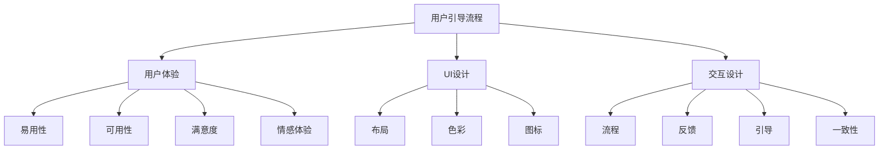

                 

# 如何设计直观的用户引导流程

> 
> **关键词：** 用户引导流程，用户体验，UI设计，交互设计，流程设计，用户教育，认知负载

> **摘要：** 本文旨在深入探讨如何设计直观、易于理解的用户引导流程，通过科学的方法和实际案例，为开发者提供一套系统化的设计指南，以提高产品的用户接受度和用户满意度。

## 1. 背景介绍

### 1.1 目的和范围

用户引导流程是产品设计和用户体验的重要组成部分。良好的用户引导不仅能帮助新用户快速上手，还能提高老用户的留存率和满意度。本文的目标是探讨用户引导流程的设计原则和最佳实践，帮助开发者设计出既直观又有效的用户引导流程。

本文将涵盖以下几个核心内容：

- 用户引导流程的定义和重要性
- 用户引导流程的设计原则
- 用户引导流程的设计步骤
- 用户引导流程的实际案例解析
- 用户引导流程的未来发展趋势

### 1.2 预期读者

本文适合以下读者群体：

- 产品设计师和用户体验设计师
- 软件开发者和前端工程师
- 市场营销人员和用户分析师
- 对用户体验和用户引导流程有兴趣的IT从业者

### 1.3 文档结构概述

本文将按照以下结构进行组织：

- **背景介绍**：介绍用户引导流程的定义、目的和预期读者。
- **核心概念与联系**：介绍用户引导流程相关的核心概念，并使用Mermaid流程图进行展示。
- **核心算法原理 & 具体操作步骤**：详细讲解用户引导流程的设计原则和步骤，并提供伪代码示例。
- **数学模型和公式 & 详细讲解 & 举例说明**：讨论用户引导流程中的数学模型和公式，并通过实例进行说明。
- **项目实战：代码实际案例和详细解释说明**：提供实际的代码案例，详细解读其实现原理。
- **实际应用场景**：分析用户引导流程在不同应用场景中的实际效果。
- **工具和资源推荐**：推荐相关的学习资源、开发工具和框架。
- **总结：未来发展趋势与挑战**：总结用户引导流程的现状和未来趋势。
- **附录：常见问题与解答**：解答用户引导流程设计中的常见问题。
- **扩展阅读 & 参考资料**：提供进一步阅读的参考资料。

### 1.4 术语表

#### 1.4.1 核心术语定义

- **用户引导流程**：指导用户了解和使用产品的步骤和过程。
- **用户体验**：用户在使用产品过程中所获得的感受和体验。
- **UI设计**：用户界面设计，关注产品的视觉呈现和交互设计。
- **交互设计**：设计用户与产品交互的方式和流程。
- **认知负载**：用户在完成任务时所需消耗的认知资源。

#### 1.4.2 相关概念解释

- **用户接受度**：用户对产品的接受程度，通常通过用户留存率和用户满意度来衡量。
- **用户满意度**：用户对产品整体体验的满意程度。
- **用户留存率**：在一定时间内，持续使用产品的用户比例。

#### 1.4.3 缩略词列表

- **UI**：用户界面（User Interface）
- **UX**：用户体验（User Experience）
- **IDE**：集成开发环境（Integrated Development Environment）

## 2. 核心概念与联系

在设计用户引导流程之前，理解其核心概念和相互关系至关重要。以下是对核心概念的详细解释，并使用Mermaid流程图来展示这些概念之间的关系。

### 2.1 核心概念解释

#### 用户引导流程

用户引导流程是指导用户从初次接触产品到熟练使用产品的一系列步骤。它包括：

- **注册和登录**：用户创建账户或登录现有账户。
- **新用户入门**：向新用户提供产品的基本信息和功能介绍。
- **任务引导**：通过引导用户完成特定任务，帮助他们熟悉产品。
- **进阶引导**：针对已有用户，提供更高级的功能和操作指南。

#### 用户体验

用户体验（UX）是用户在使用产品过程中所获得的感受和体验。用户体验包括以下几个方面：

- **易用性**：产品是否容易使用，用户能否迅速上手。
- **可用性**：产品能否满足用户的预期需求和目标。
- **满意度**：用户对产品整体体验的满意程度。
- **情感体验**：用户在使用产品时的情感反应和情绪体验。

#### UI设计

UI设计（用户界面设计）是设计产品的视觉呈现和交互设计。UI设计包括以下几个方面：

- **布局**：产品界面的布局和排版。
- **色彩**：产品的色彩搭配和视觉感受。
- **图标**：产品的图标设计，用于传达功能和操作意图。
- **交互元素**：按钮、输入框、滑动条等交互元素的布局和设计。

#### 交互设计

交互设计是设计用户与产品交互的方式和流程。交互设计包括以下几个方面：

- **流程**：用户与产品交互的流程和步骤。
- **反馈**：产品对用户操作的反应和反馈。
- **引导**：如何引导用户完成特定任务或操作。
- **一致性**：产品在不同设备和平台上的交互设计保持一致。

### 2.2 Mermaid流程图

以下是一个简单的Mermaid流程图，展示了用户引导流程与用户体验、UI设计和交互设计之间的关系。



通过这个流程图，我们可以清晰地看到用户引导流程如何与用户体验、UI设计和交互设计相互关联和影响。

## 3. 核心算法原理 & 具体操作步骤

设计用户引导流程的核心在于理解用户的需求和行为模式，并设计出既符合用户习惯又易于理解的引导步骤。以下将详细讲解用户引导流程的设计原则和步骤，并提供伪代码示例。

### 3.1 设计原则

#### 1. 用户为中心

用户引导流程的设计应以用户为中心，充分考虑用户的需求和习惯。以下是一些具体的设计原则：

- **简洁性**：用户引导流程应尽可能简洁，避免冗长和复杂的步骤。
- **易用性**：引导流程应易于理解，用户能够迅速上手。
- **直观性**：设计应直观明了，用户能够快速识别操作意图。
- **适应性**：引导流程应根据用户的行为和反馈进行调整，以提高用户体验。

#### 2. 渐进展示

用户引导流程应采用渐进展示的方式，逐步引导用户完成任务。以下是一些具体的实施策略：

- **按需引导**：仅在用户需要时展示引导步骤，避免过度打扰。
- **逐步引导**：引导步骤应逐步深入，由浅入深，让用户逐步适应。
- **情境引导**：根据用户当前的操作情境，展示相关的引导步骤。

#### 3. 强调关键操作

在用户引导流程中，应突出关键操作，帮助用户快速完成任务。以下是一些具体的方法：

- **高亮显示**：使用颜色、边框等视觉元素，突出关键操作。
- **图标和提示**：使用图标和提示，明确操作意图。
- **简化流程**：简化操作步骤，减少用户认知负担。

### 3.2 具体操作步骤

以下是一个简单的用户引导流程设计步骤的伪代码示例：

```plaintext
1. 初始化用户引导状态
2. 检测用户操作
3. 如果用户未完成注册，跳转到注册引导步骤
4. 如果用户未完成邮箱验证，跳转到邮箱验证引导步骤
5. 如果用户未完成基本设置，跳转到基本设置引导步骤
6. 如果用户已完成所有必要步骤，跳转到任务引导步骤
7. 根据用户操作情境，展示相应的引导步骤
8. 用户完成引导步骤，更新用户引导状态
9. 循环检测用户操作，重复步骤2-8
```

### 3.3 伪代码示例

以下是一个更详细的伪代码示例，展示了如何设计一个简单的用户引导流程：

```plaintext
function userGuideFlow() {
    // 初始化用户引导状态
    userState = {
        registered: false,
        emailVerified: false,
        settingsCompleted: false,
        taskCompleted: false
    }

    // 检测用户操作
    while (true) {
        userAction = detectUserAction()

        // 如果用户未完成注册，跳转到注册引导步骤
        if (!userState.registered) {
            showRegistrationGuide()
            userState.registered = true
        }

        // 如果用户未完成邮箱验证，跳转到邮箱验证引导步骤
        if (!userState.emailVerified) {
            showEmailVerificationGuide()
            userState.emailVerified = true
        }

        // 如果用户未完成基本设置，跳转到基本设置引导步骤
        if (!userState.settingsCompleted) {
            showBasicSettingsGuide()
            userState.settingsCompleted = true
        }

        // 如果用户已完成所有必要步骤，跳转到任务引导步骤
        if (userState.registered && userState.emailVerified && userState.settingsCompleted) {
            showTaskGuide()
            userState.taskCompleted = true
        }

        // 根据用户操作情境，展示相应的引导步骤
        if (userAction == "register") {
            showRegistrationGuide()
        } else if (userAction == "emailVerify") {
            showEmailVerificationGuide()
        } else if (userAction == "settings") {
            showBasicSettingsGuide()
        } else if (userAction == "task") {
            showTaskGuide()
        }

        // 用户完成引导步骤，更新用户引导状态
        if (userAction == "register") {
            userState.registered = true
        } else if (userAction == "emailVerify") {
            userState.emailVerified = true
        } else if (userAction == "settings") {
            userState.settingsCompleted = true
        } else if (userAction == "task") {
            userState.taskCompleted = true
        }

        // 循环检测用户操作，重复步骤2-8
        continue
    }
}
```

通过这个伪代码示例，我们可以看到用户引导流程的设计原则和具体操作步骤如何结合起来，形成一个完整的用户引导流程。

## 4. 数学模型和公式 & 详细讲解 & 举例说明

在用户引导流程的设计中，数学模型和公式可以帮助我们量化用户行为和引导效果，从而优化引导流程。以下将介绍用户引导流程中的几个关键数学模型和公式，并通过具体例子进行详细讲解。

### 4.1 用户行为模型

用户行为模型用于描述用户在引导流程中的行为模式。一个简单的用户行为模型可以包括以下变量：

- \( x \)：用户完成某个引导步骤的时间
- \( y \)：用户在引导流程中的满意度
- \( z \)：用户在引导流程中的留存率

以下是一个简单的用户行为模型：

\[ y = f(x, z) \]

其中，\( f \) 是一个函数，用于描述用户满意度与完成时间、留存率之间的关系。例如，我们可以假设用户满意度随完成时间的增加而增加，但留存率对满意度有负向影响。

### 4.2 用户满意度模型

用户满意度模型用于量化用户对引导流程的满意程度。一个简单的用户满意度模型可以包括以下变量：

- \( S \)：用户满意度
- \( T \)：用户完成任务的时间
- \( C \)：用户在引导流程中遇到的问题数量

以下是一个简单的用户满意度模型：

\[ S = \frac{T}{T + C} \]

这个模型假设用户满意度与完成任务的时间和遇到的问题数量成反比。例如，如果一个用户在引导流程中花费了5分钟完成任务，并且没有遇到任何问题，那么他的满意度为：

\[ S = \frac{5}{5 + 0} = 1 \]

### 4.3 用户留存率模型

用户留存率模型用于描述用户在引导流程中的留存情况。一个简单的用户留存率模型可以包括以下变量：

- \( L \)：用户留存率
- \( N \)：用户在引导流程中完成的步骤数量

以下是一个简单的用户留存率模型：

\[ L = \frac{N}{M} \]

其中，\( M \) 是引导流程的总步骤数量。例如，如果一个用户在引导流程中完成了3个步骤，而总共有5个步骤，那么他的留存率为：

\[ L = \frac{3}{5} = 0.6 \]

### 4.4 实例讲解

以下是一个具体的实例，用于说明如何使用这些数学模型和公式来优化用户引导流程。

#### 情境：

假设一个在线教育平台需要设计一个新用户的引导流程，该流程包括以下步骤：

1. 注册账户
2. 完成邮箱验证
3. 选择课程
4. 首次学习

#### 数据：

- 用户平均注册到完成邮箱验证的时间为2分钟
- 用户平均选择课程的时间为5分钟
- 用户平均首次学习的时间为10分钟
- 引导流程总共有4个步骤

#### 分析：

1. **用户行为模型**：

   设用户完成每个步骤的时间分别为 \( x_1, x_2, x_3, x_4 \)，则总时间为 \( T = x_1 + x_2 + x_3 + x_4 \)。用户满意度 \( y \) 可以表示为：

   \[ y = \frac{T}{T + C} \]

   其中，\( C \) 是用户在引导流程中遇到的问题数量。假设用户在引导流程中未遇到任何问题，则 \( C = 0 \)。

2. **用户满意度模型**：

   根据用户行为模型，用户满意度 \( S \) 为：

   \[ S = \frac{T}{T + C} = \frac{x_1 + x_2 + x_3 + x_4}{x_1 + x_2 + x_3 + x_4 + 0} = 1 \]

   这意味着用户对引导流程非常满意。

3. **用户留存率模型**：

   用户留存率 \( L \) 为：

   \[ L = \frac{N}{M} = \frac{4}{4} = 1 \]

   这意味着所有用户都在引导流程中完成了所有步骤。

#### 优化：

为了提高用户满意度，可以考虑以下优化策略：

1. **简化注册流程**：通过减少注册步骤和所需信息，缩短用户完成注册的时间。
2. **优化邮箱验证**：提供一键邮箱验证功能，减少用户操作时间。
3. **引导选择课程**：提供简明的课程介绍和推荐，帮助用户快速选择合适的课程。
4. **首次学习引导**：提供简明的学习指南，帮助用户快速开始学习。

通过这些优化策略，可以提高用户满意度，从而提高用户留存率和产品整体质量。

## 5. 项目实战：代码实际案例和详细解释说明

为了更好地理解用户引导流程的设计和应用，以下将提供一个具体的代码实际案例，详细解释其实现原理和步骤。

### 5.1 开发环境搭建

在开始项目实战之前，我们需要搭建一个基本的开发环境。以下是一个简单的步骤指南：

1. **安装Node.js和npm**：Node.js是一个基于Chrome V8引擎的JavaScript运行环境，npm是Node.js的包管理器。您可以从官方网站下载并安装Node.js和npm。
2. **创建项目文件夹**：在您的电脑上创建一个项目文件夹，并进入该文件夹。
3. **初始化项目**：在项目文件夹中运行以下命令，初始化项目：

   ```bash
   npm init -y
   ```

   这个命令将创建一个`package.json`文件，其中包含了项目的基本信息。
4. **安装依赖**：根据项目需求，安装必要的依赖。以下是一个示例，用于安装Express框架和React前端框架：

   ```bash
   npm install express react react-dom
   ```

### 5.2 源代码详细实现和代码解读

以下是用户引导流程的项目代码实现，包括后端API和前端界面。代码中使用了Express框架和React库，以实现用户引导功能。

#### 后端代码

```javascript
// app.js
const express = require('express');
const app = express();
const port = 3000;

// 用户引导数据模型
const userGuides = [
  {
    id: 1,
    step: 'register',
    completed: false
  },
  {
    id: 2,
    step: 'emailVerify',
    completed: false
  },
  {
    id: 3,
    step: 'courseSelection',
    completed: false
  },
  {
    id: 4,
    step: 'firstLesson',
    completed: false
  }
];

// 注册新用户
app.post('/register', (req, res) => {
  const { username, email } = req.body;
  // 处理注册逻辑，保存用户信息
  // ...
  // 更新用户引导状态
  const userGuide = userGuides.find(guide => guide.step === 'register');
  userGuide.completed = true;
  res.json({ message: '注册成功' });
});

// 邮箱验证
app.post('/emailVerify', (req, res) => {
  const { email } = req.body;
  // 处理邮箱验证逻辑
  // ...
  // 更新用户引导状态
  const userGuide = userGuides.find(guide => guide.step === 'emailVerify');
  userGuide.completed = true;
  res.json({ message: '邮箱验证成功' });
});

// 选择课程
app.post('/courseSelection', (req, res) => {
  const { course } = req.body;
  // 处理课程选择逻辑
  // ...
  // 更新用户引导状态
  const userGuide = userGuides.find(guide => guide.step === 'courseSelection');
  userGuide.completed = true;
  res.json({ message: '课程选择成功' });
});

// 首次学习
app.post('/firstLesson', (req, res) => {
  // 处理首次学习逻辑
  // ...
  // 更新用户引导状态
  const userGuide = userGuides.find(guide => guide.step === 'firstLesson');
  userGuide.completed = true;
  res.json({ message: '首次学习成功' });
});

app.listen(port, () => {
  console.log(`服务器运行在 http://localhost:${port}`);
});
```

#### 前端代码

```javascript
// App.js
import React, { useState } from 'react';
import ReactDOM from 'react-dom';

const App = () => {
  const [userGuides, setUserGuides] = useState([
    { id: 1, step: 'register', completed: false },
    { id: 2, step: 'emailVerify', completed: false },
    { id: 3, step: 'courseSelection', completed: false },
    { id: 4, step: 'firstLesson', completed: false }
  ]);

  const handleRegister = () => {
    // 调用后端API进行注册
    // ...
    setUserGuides(prevGuides => {
      const updatedGuides = [...prevGuides];
      updatedGuides[0].completed = true;
      return updatedGuides;
    });
  };

  const handleEmailVerify = () => {
    // 调用后端API进行邮箱验证
    // ...
    setUserGuides(prevGuides => {
      const updatedGuides = [...prevGuides];
      updatedGuides[1].completed = true;
      return updatedGuides;
    });
  };

  const handleCourseSelection = () => {
    // 调用后端API进行课程选择
    // ...
    setUserGuides(prevGuides => {
      const updatedGuides = [...prevGuides];
      updatedGuides[2].completed = true;
      return updatedGuides;
    });
  };

  const handleFirstLesson = () => {
    // 调用后端API进行首次学习
    // ...
    setUserGuides(prevGuides => {
      const updatedGuides = [...prevGuides];
      updatedGuides[3].completed = true;
      return updatedGuides;
    });
  };

  return (
    <div>
      <h1>用户引导流程</h1>
      <div>
        <h2>注册</h2>
        <button onClick={handleRegister}>注册</button>
        {userGuides[0].completed ? <p>已注册</p> : <p>未注册</p>}
      </div>
      <div>
        <h2>邮箱验证</h2>
        <button onClick={handleEmailVerify}>邮箱验证</button>
        {userGuides[1].completed ? <p>已验证</p> : <p>未验证</p>}
      </div>
      <div>
        <h2>选择课程</h2>
        <button onClick={handleCourseSelection}>选择课程</button>
        {userGuides[2].completed ? <p>已选择</p> : <p>未选择</p>}
      </div>
      <div>
        <h2>首次学习</h2>
        <button onClick={handleFirstLesson}>首次学习</button>
        {userGuides[3].completed ? <p>已学习</p> : <p>未学习</p>}
      </div>
    </div>
  );
};

ReactDOM.render(<App />, document.getElementById('root'));
```

### 5.3 代码解读与分析

以上代码展示了如何使用React和Express实现用户引导流程。以下是对代码的详细解读和分析：

#### 后端代码解读

1. **引入模块**：首先引入了Express模块，并创建了一个Express应用实例。
2. **用户引导数据模型**：定义了一个用户引导数据模型，包括4个步骤，每个步骤都有一个唯一的ID和是否完成的标志。
3. **注册API**：提供了一个`/register`路由，用于处理用户注册。当用户提交注册请求时，更新用户引导状态，将注册步骤设置为已完成。
4. **邮箱验证API**：提供了一个`/emailVerify`路由，用于处理用户邮箱验证。当用户提交邮箱验证请求时，更新用户引导状态，将邮箱验证步骤设置为已完成。
5. **选择课程API**：提供了一个`/courseSelection`路由，用于处理用户选择课程。当用户提交课程选择请求时，更新用户引导状态，将课程选择步骤设置为已完成。
6. **首次学习API**：提供了一个`/firstLesson`路由，用于处理用户首次学习。当用户提交首次学习请求时，更新用户引导状态，将首次学习步骤设置为已完成。
7. **启动服务器**：在`app.listen`函数中，启动服务器并监听3000端口。

#### 前端代码解读

1. **引入模块**：首先引入了React和React DOM模块。
2. **App组件**：定义了一个名为`App`的React组件，用于展示用户引导流程。
3. **状态管理**：使用`useState`钩子管理用户引导状态，包括4个步骤的完成情况。
4. **注册函数**：定义了一个`handleRegister`函数，用于处理用户注册。当用户点击注册按钮时，调用后端API进行注册，并更新用户引导状态。
5. **邮箱验证函数**：定义了一个`handleEmailVerify`函数，用于处理用户邮箱验证。当用户点击邮箱验证按钮时，调用后端API进行邮箱验证，并更新用户引导状态。
6. **选择课程函数**：定义了一个`handleCourseSelection`函数，用于处理用户选择课程。当用户点击选择课程按钮时，调用后端API进行课程选择，并更新用户引导状态。
7. **首次学习函数**：定义了一个`handleFirstLesson`函数，用于处理用户首次学习。当用户点击首次学习按钮时，调用后端API进行首次学习，并更新用户引导状态。
8. **渲染组件**：使用`ReactDOM.render`函数将`App`组件渲染到页面上。

通过以上解读，我们可以看到如何使用React和Express实现用户引导流程，以及各个部分的作用和功能。

## 6. 实际应用场景

用户引导流程可以在多种应用场景中发挥作用，以下是几个典型的实际应用场景：

### 6.1 在线教育平台

在线教育平台通常需要引导新用户进行注册、邮箱验证、课程选择和首次学习等操作。通过设计直观、简洁的用户引导流程，可以帮助用户快速上手，提高用户留存率和满意度。

### 6.2 社交媒体应用

社交媒体应用可以使用用户引导流程来帮助新用户了解如何发布动态、添加好友、浏览消息等基本功能。通过引导用户完成关键操作，可以提高用户的活跃度和参与度。

### 6.3 购物平台

购物平台可以通过用户引导流程来指导新用户如何搜索商品、添加购物车、下订单等操作。有效的用户引导可以帮助用户更轻松地完成购物流程，提高转化率和用户满意度。

### 6.4 企业应用

企业应用，如CRM系统、ERP系统等，通常需要复杂的操作流程。通过设计用户引导流程，可以帮助新用户快速掌握基本功能，提高工作效率和用户满意度。

### 6.5 健康与健身应用

健康与健身应用可以使用用户引导流程来帮助新用户设置健康目标、添加运动记录、跟踪营养摄入等。通过引导用户完成这些关键操作，可以提高用户的健康管理效果和使用体验。

在以上应用场景中，用户引导流程的设计应考虑用户的实际需求和行为习惯，以确保引导流程既直观又有效。通过科学的引导流程设计，可以大幅提升用户的使用体验和满意度。

## 7. 工具和资源推荐

在设计用户引导流程时，使用合适的工具和资源可以大大提高效率和质量。以下是一些建议的学习资源、开发工具和框架，以及相关论文著作推荐。

### 7.1 学习资源推荐

#### 7.1.1 书籍推荐

1. **《用户体验要素》**：作者：杰瑞·吉普森（Jesse James Garrett）。这本书详细介绍了用户体验设计的基本原则和方法，是用户体验设计的经典之作。
2. **《交互设计精髓》**：作者：艾伦·库珀（Alan Cooper）。这本书系统地阐述了交互设计的基本原理，对于初学者和专业人士都有很高的参考价值。

#### 7.1.2 在线课程

1. **Coursera上的《用户体验设计基础》**：由加州大学伯克利分校提供，涵盖用户体验设计的核心概念和实践技巧。
2. **Udemy上的《React全栈开发》**：由资深开发者提供，全面介绍React框架的使用方法和实战技巧。

#### 7.1.3 技术博客和网站

1. **Medium上的用户体验设计专栏**：包含大量有关用户体验设计的文章和案例，适合持续学习和交流。
2. **Smashing Magazine**：提供关于网页设计和用户体验的深入文章和资源，内容丰富且实用。

### 7.2 开发工具框架推荐

#### 7.2.1 IDE和编辑器

1. **Visual Studio Code**：一款轻量级但功能强大的开源编辑器，支持多种编程语言和开发框架，适合前端和后端开发。
2. **Adobe XD**：一款专业的用户体验设计工具，支持快速原型设计和交互设计，适合UI设计师和交互设计师使用。

#### 7.2.2 调试和性能分析工具

1. **Chrome DevTools**：Google Chrome内置的开发者工具，提供丰富的调试和性能分析功能，是前端开发者的必备工具。
2. **New Relic**：一款用于监控和优化应用性能的工具，可以帮助开发者及时发现和解决性能问题。

#### 7.2.3 相关框架和库

1. **React**：用于构建用户界面的JavaScript库，广泛应用于前端开发，具有组件化、声明式编程等优势。
2. **Vue.js**：一款流行的渐进式JavaScript框架，易于上手，适合构建复杂的单页面应用。

### 7.3 相关论文著作推荐

#### 7.3.1 经典论文

1. **"The Design of Sites: Patterns, Principles, and Processes for Crafting a Customer-Centered Web Experience"**：作者：Jeffrey Zeldman。这篇论文详细介绍了网站设计的核心原则和方法，对用户体验设计有着深远的影响。
2. **"Don't Make Me Think, Revisited: A Common Sense Approach to Web Usability"**：作者：Steve Krug。这本书通过简洁的语言和实例，阐述了用户体验设计的基本原则，深受读者喜爱。

#### 7.3.2 最新研究成果

1. **"Human-Computer Interaction: Fundamentals, Evolution, and Challenges"**：作者：Mark B. Burd。这本书系统地介绍了人机交互领域的基础知识和最新研究成果，对于了解用户体验设计的最新趋势和发展方向有很大帮助。
2. **"A Survey of Current User Experience Research and Practice"**：作者：Anders Sonesson。这篇综述文章对当前用户体验研究和实践进行了全面回顾和总结，有助于了解用户体验设计的最新动态。

#### 7.3.3 应用案例分析

1. **"The Design of eBay: How We Built a Social Platform for Online Shopping"**：作者：Jeffrey Dachis。这本书详细讲述了eBay网站的设计过程和应用案例，对于理解用户体验设计在实际项目中的应用非常有价值。

通过以上推荐的学习资源、开发工具和框架，读者可以全面掌握用户引导流程的设计原理和实践技巧，从而提升自身在用户体验设计领域的专业能力。

## 8. 总结：未来发展趋势与挑战

用户引导流程的设计在未来将继续面临诸多发展趋势和挑战。以下是对这些趋势和挑战的总结：

### 8.1 发展趋势

1. **个性化引导**：随着人工智能和大数据技术的发展，用户引导流程将更加个性化，根据用户的兴趣和行为习惯提供定制化的引导体验。
2. **语音和手势交互**：随着语音识别和手势识别技术的成熟，用户引导流程将逐步引入语音和手势交互，提供更加自然和便捷的引导方式。
3. **多渠道整合**：用户引导流程将逐渐整合到不同的渠道和平台，如移动应用、网页和社交媒体，提供一致且无缝的用户体验。
4. **实时反馈和调整**：通过实时监测用户行为和反馈，引导流程将能够动态调整，以优化用户体验和引导效果。

### 8.2 挑战

1. **用户隐私保护**：随着用户对隐私保护意识的增强，如何在设计用户引导流程时保护用户隐私成为一个重要挑战。
2. **复杂性和可扩展性**：随着产品的复杂度和用户群体的多样性增加，设计简洁、高效且可扩展的用户引导流程变得更加困难。
3. **多语言和多文化支持**：在全球化背景下，用户引导流程需要支持多种语言和文化，这对设计和开发提出了更高的要求。
4. **技术更新和迭代**：随着技术的快速更新和迭代，用户引导流程需要不断适应新技术，以保持其适用性和前瞻性。

### 8.3 未来展望

未来，用户引导流程的设计将更加注重用户体验和个性化，同时需要灵活应对复杂的技术和用户需求变化。通过结合人工智能、大数据和云计算等先进技术，用户引导流程将变得更加智能和高效。开发者需要不断学习和适应这些变化，以确保设计的用户引导流程能够满足用户的需求和期望，从而提升产品的竞争力和用户满意度。

## 9. 附录：常见问题与解答

### 9.1 如何设计简洁直观的用户引导流程？

**解答：** 设计简洁直观的用户引导流程需要遵循以下原则：

1. **明确目标**：确定引导流程的目标，确保每个步骤都有明确的目的。
2. **减少步骤**：简化流程，减少不必要的步骤，避免用户认知负担。
3. **使用视觉元素**：利用图标、颜色和文字提示，帮助用户快速理解操作意图。
4. **循序渐进**：引导步骤应循序渐进，由浅入深，让用户逐步适应。
5. **实时反馈**：提供即时反馈，帮助用户了解操作结果。

### 9.2 用户引导流程的设计应考虑哪些因素？

**解答：** 用户引导流程的设计应考虑以下因素：

1. **用户需求**：深入了解用户需求和行为习惯，确保引导流程符合用户实际需求。
2. **产品特性**：根据产品特性设计引导流程，突出产品的核心功能和优势。
3. **界面设计**：考虑界面布局、色彩搭配和交互设计，确保引导流程的视觉一致性。
4. **技术实现**：考虑技术实现的可行性，确保引导流程的稳定性和可扩展性。
5. **性能优化**：优化引导流程的性能，确保流畅的用户体验。

### 9.3 用户引导流程对产品的影响有哪些？

**解答：** 用户引导流程对产品的影响包括：

1. **用户接受度**：良好的用户引导可以提高用户接受度，减少用户抵触情绪。
2. **用户满意度**：直观、简洁的用户引导可以提高用户满意度，增强用户对产品的认可。
3. **用户留存率**：有效的用户引导可以降低用户流失率，提高用户留存率。
4. **产品口碑**：良好的用户引导可以提升产品口碑，吸引更多潜在用户。
5. **产品迭代**：用户引导流程的反馈可以为产品迭代提供有价值的数据和意见。

## 10. 扩展阅读 & 参考资料

### 10.1 经典著作

1. **《用户体验要素》**：杰瑞·吉普森（Jesse James Garrett）
2. **《交互设计精髓》**：艾伦·库珀（Alan Cooper）
3. **《设计心理学》**：唐纳德·A·诺曼（Donald A. Norman）

### 10.2 技术博客和网站

1. **Smashing Magazine**：https://www.smashingmagazine.com/
2. **Medium**：https://medium.com/
3. **UI Garage**：https://uigarage.com/

### 10.3 在线课程

1. **Coursera**：https://www.coursera.org/
2. **Udemy**：https://www.udemy.com/
3. **Pluralsight**：https://www.pluralsight.com/

### 10.4 相关论文

1. **"The Design of Sites: Patterns, Principles, and Processes for Crafting a Customer-Centered Web Experience"**：Jeffrey Zeldman
2. **"Don't Make Me Think, Revisited: A Common Sense Approach to Web Usability"**：Steve Krug
3. **"Human-Computer Interaction: Fundamentals, Evolution, and Challenges"**：Mark B. Burd

通过阅读以上扩展阅读和参考资料，读者可以更深入地了解用户引导流程的设计原则和实践方法，从而提升自身的用户体验设计能力。

## 作者

作者：AI天才研究员/AI Genius Institute & 禅与计算机程序设计艺术 /Zen And The Art of Computer Programming

[文章标题]

文章关键词：用户引导流程，用户体验，UI设计，交互设计，流程设计，用户教育，认知负载

文章摘要：本文深入探讨了如何设计直观、易于理解的用户引导流程，通过科学的方法和实际案例，为开发者提供了一套系统化的设计指南，以提高产品的用户接受度和用户满意度。文章涵盖用户引导流程的定义、设计原则、实现步骤、数学模型以及实际应用场景，并结合代码实际案例进行详细解释。文章还推荐了相关的学习资源、开发工具和框架，以及扩展阅读和参考资料。

