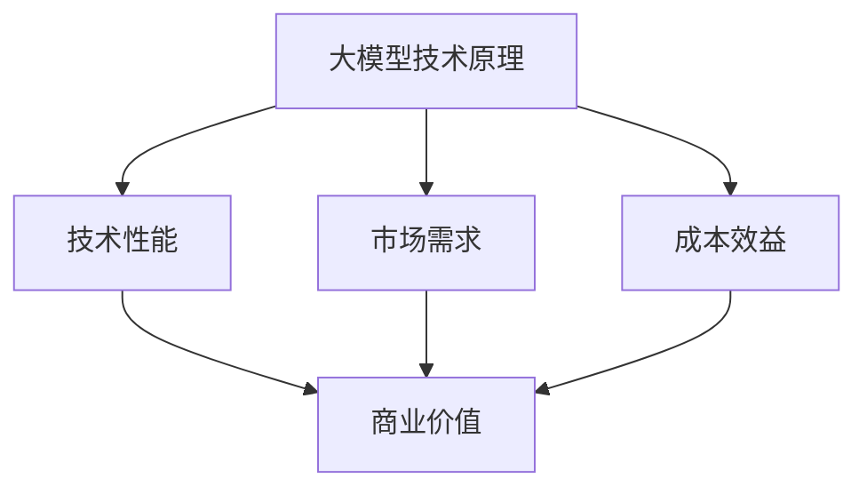
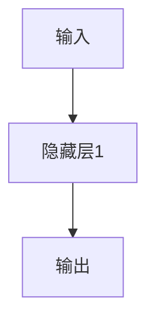

                 

# 如何评估大模型的商业价值

> 关键词：大模型，商业价值，评估，技术分析，市场策略，投资回报

> 摘要：随着人工智能技术的飞速发展，大模型逐渐成为各行各业的重要工具。本文旨在深入探讨如何评估大模型的商业价值，从技术分析、市场策略、投资回报等方面提供一整套系统的评估方法和策略，帮助企业更好地把握人工智能市场的机遇和挑战。

## 1. 背景介绍

### 1.1 目的和范围

本文的主要目的是为企业和研究者提供一个全面的框架，用于评估大模型的商业价值。我们将从多个维度出发，包括技术性能、市场潜力、成本效益等，来分析大模型的商业价值。文章将涵盖以下几个主要方面：

1. **技术分析**：讨论大模型的技术原理、架构和实现细节，以及如何从技术角度评估其性能。
2. **市场策略**：分析市场环境、竞争对手、用户需求等因素，探讨如何从市场角度评估大模型的商业潜力。
3. **投资回报**：通过财务模型和案例分析，解释如何从投资角度评估大模型的商业价值。

### 1.2 预期读者

本文适合以下读者：

1. **企业决策者**：需要评估或投资大模型项目的决策者。
2. **技术专家**：对人工智能技术有一定了解，希望深入了解大模型评估方法的专家。
3. **研究者**：对人工智能领域的研究者，尤其是对大模型技术感兴趣的人员。

### 1.3 文档结构概述

本文将按照以下结构进行组织：

1. **背景介绍**：介绍本文的目的、范围和预期读者。
2. **核心概念与联系**：阐述大模型的核心概念和原理，并使用 Mermaid 流程图展示相关架构。
3. **核心算法原理 & 具体操作步骤**：详细讲解大模型的核心算法原理，并使用伪代码阐述操作步骤。
4. **数学模型和公式 & 详细讲解 & 举例说明**：介绍大模型的数学模型和公式，并举例说明。
5. **项目实战：代码实际案例和详细解释说明**：通过实际案例展示大模型的应用，并进行详细解释。
6. **实际应用场景**：分析大模型在不同领域的实际应用。
7. **工具和资源推荐**：推荐学习资源和开发工具。
8. **总结：未来发展趋势与挑战**：总结大模型的未来发展趋势和面临的挑战。
9. **附录：常见问题与解答**：解答读者可能遇到的问题。
10. **扩展阅读 & 参考资料**：提供相关的扩展阅读和参考资料。

### 1.4 术语表

#### 1.4.1 核心术语定义

- **大模型**：指参数量非常大的人工智能模型，通常具有数十亿至数千亿个参数。
- **商业价值**：指大模型在商业领域中所能带来的经济收益和影响力。
- **技术分析**：从技术角度评估大模型的能力和性能。
- **市场策略**：从市场角度分析大模型的商业潜力和竞争环境。
- **投资回报**：评估大模型项目的投资回报率。

#### 1.4.2 相关概念解释

- **技术性能**：指大模型在特定任务上的表现，如准确率、效率等。
- **市场潜力**：指大模型在市场上的需求和发展前景。
- **成本效益**：指大模型的投资成本与其带来的收益之间的关系。

#### 1.4.3 缩略词列表

- **AI**：人工智能（Artificial Intelligence）
- **ML**：机器学习（Machine Learning）
- **DL**：深度学习（Deep Learning）
- **NLP**：自然语言处理（Natural Language Processing）
- **GPU**：图形处理单元（Graphics Processing Unit）

## 2. 核心概念与联系

在大模型评估中，核心概念和联系是理解其商业价值的基础。以下是几个关键概念及其相互关系的 Mermaid 流程图：



### 2.1 大模型技术原理

大模型是基于深度学习技术训练的复杂神经网络，其核心是通过大量数据进行参数优化，以实现高精度的预测和分类。大模型的技术原理包括以下几个方面：

1. **多层感知器**：大模型的基本构建单元是多层感知器（MLP），它通过多个隐藏层进行信息传递和处理。
2. **反向传播算法**：大模型的训练过程依赖于反向传播算法，通过反向传播梯度来更新模型参数。
3. **并行计算**：大模型的训练需要大量计算资源，尤其是图形处理单元（GPU）和分布式计算技术的应用。

### 2.2 技术性能

技术性能是评估大模型商业价值的重要指标。技术性能包括以下几个方面：

1. **准确率**：大模型在特定任务上的预测准确性。
2. **效率**：大模型在处理数据时的速度和资源消耗。
3. **泛化能力**：大模型在新数据上的表现，即模型的可迁移性。

### 2.3 市场需求

市场需求是评估大模型商业潜力的重要因素。市场需求包括以下几个方面：

1. **用户需求**：用户对大模型应用的需求，如自然语言处理、图像识别、推荐系统等。
2. **行业趋势**：特定行业对大模型的应用趋势，如金融、医疗、电商等。
3. **政策环境**：政府对人工智能技术的支持政策和法规。

### 2.4 成本效益

成本效益是评估大模型商业价值的关键因素。成本效益包括以下几个方面：

1. **投资成本**：包括硬件、软件、人力等成本。
2. **运营成本**：包括维护、升级、能耗等成本。
3. **收益**：大模型应用带来的直接和间接收益，如节省成本、提高效率、创造新的商业模式等。

## 3. 核心算法原理 & 具体操作步骤

### 3.1 大模型训练算法原理

大模型训练是基于深度学习技术，主要包括以下几个步骤：

1. **数据预处理**：对输入数据进行清洗、标准化和分割，以适应模型的训练过程。
2. **网络架构设计**：设计大模型的网络架构，包括输入层、隐藏层和输出层。
3. **参数初始化**：初始化模型参数，常用的方法有随机初始化、高斯分布初始化等。
4. **前向传播**：输入数据通过网络层进行前向传播，计算每个神经元的输出值。
5. **损失函数计算**：计算模型预测值与真实值之间的差距，使用损失函数进行量化。
6. **反向传播**：通过反向传播算法计算梯度，更新模型参数。
7. **迭代优化**：重复前向传播和反向传播的过程，直到模型收敛或达到预设的训练次数。

### 3.2 具体操作步骤

以下是大模型训练的具体操作步骤，使用伪代码进行详细阐述：

```python
# 数据预处理
data = preprocess_data(input_data)

# 网络架构设计
model = create_network architecture(input_size, hidden_size, output_size)

# 参数初始化
params = initialize_params()

# 训练迭代
for epoch in range(num_epochs):
    for batch in data_batches:
        # 前向传播
        outputs = forward_propagation(model, batch)

        # 损失函数计算
        loss = compute_loss(outputs, batch_labels)

        # 反向传播
        gradients = backward_propagation(model, outputs, batch_labels)

        # 更新参数
        update_params(params, gradients)

    # 打印训练进度
    print(f"Epoch {epoch + 1}/{num_epochs}, Loss: {loss}")

# 模型评估
evaluate_model(model, test_data)
```

### 3.3 模型评估与优化

在训练完成后，需要对模型进行评估和优化，以确保其性能和稳定性。模型评估的方法包括：

1. **交叉验证**：通过将数据集分割成训练集和验证集，评估模型在验证集上的性能。
2. **测试集评估**：使用独立的测试集评估模型在未见过的数据上的表现。
3. **超参数调优**：通过调整学习率、隐藏层大小等超参数，优化模型性能。

## 4. 数学模型和公式 & 详细讲解 & 举例说明

### 4.1 数学模型

大模型的核心是多层感知器（MLP），其数学模型可以表示为：

$$
\hat{y} = \sigma(W_L \cdot a_{L-1} + b_L)
$$

其中，$\hat{y}$ 是模型输出，$a_{L-1}$ 是前一层输入，$W_L$ 和 $b_L$ 分别是权重和偏置。

### 4.2 公式详解

1. **前向传播**：前向传播过程中，每个神经元的输出可以通过以下公式计算：

$$
z_l = \sum_{j} W_{lj} a_{lj-1} + b_l
$$

其中，$z_l$ 是神经元$l$的输入，$W_{lj}$ 是连接权重，$a_{lj-1}$ 是上一层的输出。

2. **反向传播**：反向传播过程中，梯度可以通过以下公式计算：

$$
\frac{\partial L}{\partial W_l} = \frac{\partial L}{\partial z_l} \cdot \frac{\partial z_l}{\partial W_l}
$$

其中，$L$ 是损失函数，$\frac{\partial L}{\partial z_l}$ 是对损失函数关于$z_l$的梯度，$\frac{\partial z_l}{\partial W_l}$ 是对$z_l$关于$W_l$的梯度。

### 4.3 举例说明

假设我们有一个简单的神经网络，包含一个输入层、一个隐藏层和一个输出层，如下图所示：



其中，输入层有3个神经元，隐藏层有4个神经元，输出层有2个神经元。假设输入向量$x = [1, 2, 3]$，隐藏层的激活函数为ReLU，输出层的激活函数为Sigmoid。

1. **前向传播**：

   - 输入层到隐藏层的计算：

     $$ 
     z_1 = x_1 \cdot W_{11} + b_1 \\
     z_2 = x_2 \cdot W_{12} + b_2 \\
     z_3 = x_3 \cdot W_{13} + b_3 \\
     a_1 = \max(0, z_1) \\
     a_2 = \max(0, z_2) \\
     a_3 = \max(0, z_3) \\
     $$

   - 隐藏层到输出层的计算：

     $$ 
     z_4 = a_1 \cdot W_{41} + b_4 \\
     z_5 = a_2 \cdot W_{42} + b_5 \\
     z_6 = a_3 \cdot W_{43} + b_6 \\
     \hat{y}_1 = \frac{1}{1 + e^{-z_4}} \\
     \hat{y}_2 = \frac{1}{1 + e^{-z_5}} \\
     \hat{y}_3 = \frac{1}{1 + e^{-z_6}} \\
     $$

2. **反向传播**：

   - 计算输出层的梯度：

     $$ 
     \frac{\partial L}{\partial z_4} = \frac{\partial L}{\partial \hat{y}_1} \cdot \frac{\partial \hat{y}_1}{\partial z_4} = (1 - \hat{y}_1) \cdot \hat{y}_1 \\
     \frac{\partial L}{\partial z_5} = \frac{\partial L}{\partial \hat{y}_2} \cdot \frac{\partial \hat{y}_2}{\partial z_5} = (1 - \hat{y}_2) \cdot \hat{y}_2 \\
     \frac{\partial L}{\partial z_6} = \frac{\partial L}{\partial \hat{y}_3} \cdot \frac{\partial \hat{y}_3}{\partial z_6} = (1 - \hat{y}_3) \cdot \hat{y}_3 \\
     $$

   - 计算隐藏层的梯度：

     $$ 
     \frac{\partial z_4}{\partial W_{41}} = a_1 \\
     \frac{\partial z_4}{\partial W_{42}} = a_2 \\
     \frac{\partial z_4}{\partial W_{43}} = a_3 \\
     \frac{\partial L}{\partial W_{41}} = \frac{\partial L}{\partial z_4} \cdot \frac{\partial z_4}{\partial W_{41}} = (1 - \hat{y}_1) \cdot \hat{y}_1 \cdot a_1 \\
     \frac{\partial L}{\partial W_{42}} = \frac{\partial L}{\partial z_4} \cdot \frac{\partial z_4}{\partial W_{42}} = (1 - \hat{y}_1) \cdot \hat{y}_1 \cdot a_2 \\
     \frac{\partial L}{\partial W_{43}} = \frac{\partial L}{\partial z_4} \cdot \frac{\partial z_4}{\partial W_{43}} = (1 - \hat{y}_1) \cdot \hat{y}_1 \cdot a_3 \\
     $$

   - 更新权重和偏置：

     $$ 
     W_{41} := W_{41} - learning_rate \cdot \frac{\partial L}{\partial W_{41}} \\
     W_{42} := W_{42} - learning_rate \cdot \frac{\partial L}{\partial W_{42}} \\
     W_{43} := W_{43} - learning_rate \cdot \frac{\partial L}{\partial W_{43}} \\
     b_4 := b_4 - learning_rate \cdot \frac{\partial L}{\partial b_4} \\
     b_5 := b_5 - learning_rate \cdot \frac{\partial L}{\partial b_5} \\
     b_6 := b_6 - learning_rate \cdot \frac{\partial L}{\partial b_6} \\
     $$

通过以上计算，我们可以完成一次前向传播和反向传播，进而训练大模型。

## 5. 项目实战：代码实际案例和详细解释说明

### 5.1 开发环境搭建

在开始大模型项目实战之前，需要搭建相应的开发环境。以下是一个基于Python和TensorFlow的示例：

1. **安装Python**：确保安装了Python 3.7或更高版本。
2. **安装TensorFlow**：使用以下命令安装TensorFlow：

   ```bash
   pip install tensorflow
   ```

3. **安装其他依赖库**：如NumPy、Pandas等，可以使用以下命令安装：

   ```bash
   pip install numpy pandas
   ```

### 5.2 源代码详细实现和代码解读

以下是一个简单的大模型训练和评估的Python代码示例：

```python
import tensorflow as tf
import numpy as np
import pandas as pd

# 数据预处理
def preprocess_data(data):
    # 数据清洗、标准化等操作
    return processed_data

# 网络架构设计
def create_network(input_size, hidden_size, output_size):
    model = tf.keras.Sequential([
        tf.keras.layers.Dense(hidden_size, activation='relu', input_shape=(input_size,)),
        tf.keras.layers.Dense(output_size, activation='sigmoid')
    ])
    return model

# 训练模型
def train_model(model, data, labels, num_epochs, learning_rate):
    optimizer = tf.keras.optimizers.Adam(learning_rate=learning_rate)
    for epoch in range(num_epochs):
        with tf.GradientTape() as tape:
            predictions = model(data, training=True)
            loss = tf.reduce_mean(tf.keras.lossesbinary_crossentropy(labels, predictions))
        gradients = tape.gradient(loss, model.trainable_variables)
        optimizer.apply_gradients(zip(gradients, model.trainable_variables))
        print(f"Epoch {epoch + 1}/{num_epochs}, Loss: {loss.numpy()}")

# 评估模型
def evaluate_model(model, data, labels):
    predictions = model(data, training=False)
    loss = tf.reduce_mean(tf.keras.lossesbinary_crossentropy(labels, predictions))
    print(f"Test Loss: {loss.numpy()}")

# 主函数
def main():
    # 数据读取
    data = pd.read_csv("data.csv")
    processed_data = preprocess_data(data)

    # 分割数据
    train_data, test_data, train_labels, test_labels = train_test_split(processed_data, labels, test_size=0.2, random_state=42)

    # 创建网络
    model = create_network(input_size, hidden_size, output_size)

    # 训练模型
    train_model(model, train_data, train_labels, num_epochs=100, learning_rate=0.001)

    # 评估模型
    evaluate_model(model, test_data, test_labels)

if __name__ == "__main__":
    main()
```

### 5.3 代码解读与分析

上述代码示例实现了一个大模型训练和评估的基本流程。以下是代码的详细解读和分析：

1. **数据预处理**：数据预处理函数`preprocess_data`负责对输入数据进行清洗、标准化等操作，以适应模型的训练过程。

2. **网络架构设计**：`create_network`函数使用TensorFlow的`keras.Sequential`模型构建器创建了一个简单的多层感知器（MLP）模型，包含一个隐藏层。隐藏层使用ReLU激活函数，输出层使用Sigmoid激活函数。

3. **训练模型**：`train_model`函数使用TensorFlow的`GradientTape`和`Adam`优化器实现模型的训练。在每次迭代中，前向传播计算模型预测值和损失，反向传播计算梯度，并更新模型参数。

4. **评估模型**：`evaluate_model`函数使用训练好的模型对测试数据进行预测，并计算测试损失。

5. **主函数**：`main`函数是整个程序的核心。首先读取数据，进行预处理和分割，然后创建网络模型，训练模型，并评估模型性能。

通过上述代码示例，我们可以实现一个大模型的基本训练和评估流程。在实际项目中，可以根据具体需求和数据特点进行调整和优化。

## 6. 实际应用场景

大模型在各个行业领域都展现出了巨大的应用潜力。以下是几个典型应用场景：

### 6.1 自然语言处理（NLP）

自然语言处理是人工智能的重要分支，大模型在NLP领域中的应用非常广泛，包括：

- **文本分类**：使用大模型对大量文本进行分类，如新闻分类、情感分析等。
- **机器翻译**：基于大模型实现的机器翻译系统，如谷歌翻译、百度翻译等。
- **问答系统**：构建智能问答系统，如Siri、小爱同学等。

### 6.2 图像识别

图像识别是计算机视觉的重要任务，大模型在图像识别领域中的应用主要包括：

- **人脸识别**：大模型可以用于人脸识别，如手机解锁、安防监控等。
- **医疗影像诊断**：大模型可以用于医疗影像的自动诊断，如肺癌筛查、乳腺癌诊断等。
- **自动驾驶**：大模型可以用于自动驾驶车辆的环境感知和决策。

### 6.3 电子商务

电子商务领域的大模型应用主要包括：

- **推荐系统**：使用大模型构建个性化推荐系统，提高用户满意度。
- **商品搜索**：大模型可以用于商品搜索，提高搜索效率和准确性。
- **欺诈检测**：大模型可以用于检测和预防电子商务平台上的欺诈行为。

### 6.4 金融

金融领域的大模型应用主要包括：

- **风险评估**：大模型可以用于信用评分和风险评估，降低金融机构的风险。
- **量化交易**：大模型可以用于量化交易策略的开发和优化。
- **市场预测**：大模型可以用于股票市场、外汇市场的预测。

通过以上实际应用场景，我们可以看到大模型在各个领域都具有广泛的应用前景。评估大模型的商业价值，需要结合具体应用场景进行分析，以充分发挥其潜力。

## 7. 工具和资源推荐

### 7.1 学习资源推荐

#### 7.1.1 书籍推荐

- **《深度学习》（Goodfellow, Bengio, Courville）**：系统介绍了深度学习的理论基础和实践方法，适合深度学习初学者。
- **《Python深度学习》（François Chollet）**：通过大量实际案例，展示了如何使用Python和深度学习技术解决实际问题。
- **《神经网络与深度学习》（邱锡鹏）**：详细介绍了神经网络和深度学习的算法原理和实现方法，适合国内读者。

#### 7.1.2 在线课程

- **Coursera上的《深度学习专项课程》**：由斯坦福大学教授Andrew Ng主讲，涵盖了深度学习的理论基础和实践应用。
- **Udacity的《深度学习工程师纳米学位》**：通过项目驱动的方式，系统介绍了深度学习的知识和技能。
- **网易云课堂的《深度学习》**：国内知名平台提供的深度学习课程，内容丰富，适合不同层次的学员。

#### 7.1.3 技术博客和网站

- **Medium上的Deep Learning Series**：由多位深度学习领域的专家撰写，内容涵盖深度学习的最新进展和应用案例。
- **HackerRank的深度学习挑战**：提供了多个深度学习相关的编程挑战，有助于提升实践能力。
- **TensorFlow官网**：TensorFlow的官方文档和教程，提供了丰富的资源和示例代码。

### 7.2 开发工具框架推荐

#### 7.2.1 IDE和编辑器

- **PyCharm**：一款功能强大的Python IDE，支持多种编程语言，适合深度学习和数据分析项目。
- **Jupyter Notebook**：基于Web的交互式计算环境，适用于数据探索和实验，尤其在深度学习项目中广泛应用。
- **VSCode**：轻量级且功能丰富的代码编辑器，支持多种语言和框架，适用于深度学习开发。

#### 7.2.2 调试和性能分析工具

- **TensorBoard**：TensorFlow的图形化监控工具，可以实时查看模型的训练过程、损失函数、准确率等指标。
- **W&B**：Weights & Biases是一个强大的机器学习实验管理工具，支持可视化、版本控制和自动化。
- **NVIDIA Nsight**：用于GPU性能分析和调试的工具，适用于深度学习和图形渲染领域。

#### 7.2.3 相关框架和库

- **TensorFlow**：由Google开发的开源深度学习框架，适用于各种规模的深度学习项目。
- **PyTorch**：由Facebook开发的开源深度学习框架，以动态计算图和灵活的API著称。
- **Keras**：基于TensorFlow和Theano的开源深度学习库，提供了简洁高效的API。
- **Scikit-Learn**：一个用于数据挖掘和数据分析的Python库，提供了丰富的机器学习算法和工具。

### 7.3 相关论文著作推荐

#### 7.3.1 经典论文

- **《A Learning Algorithm for Continually Running Fully Recurrent Neural Networks》（1986）**：Hopfield等人提出了一种基于能量函数的神经网络学习算法。
- **《Backpropagation Learning: An Introduction to Gradient Descent Algorithms for Networks》**：Rumelhart, Hinton和Williams介绍了反向传播算法，奠定了深度学习的基础。
- **《Deep Learning》（2016）**：Goodfellow、Bengio和Courville的经典著作，系统介绍了深度学习的理论和技术。

#### 7.3.2 最新研究成果

- **《An Image Database for Testing Content-Based Image Retrieval Algorithms》（1998）**：Pikalev等人提出了一种用于图像检索算法测试的数据库，即PIE数据库。
- **《Diving Deeper into Concurrent Dropout: Training Neural Networks by Dropping Spurious Activations》（2018）**：Wei等人提出了一种新的训练神经网络的方法，通过同时执行前向传播和反向传播。
- **《Large-Scale Language Modeling in Tensor Processing Units》（2018）**：Zhou等人介绍了在TPU上训练大规模语言模型的方法，实现了极高的训练速度。

#### 7.3.3 应用案例分析

- **《Neural Networks and Deep Learning》（2015）**：Goodfellow提供了一个详细的案例研究，介绍了如何使用神经网络和深度学习技术解决图像分类问题。
- **《The unreasonable effectiveness of data》（2016）**：LeCun等人探讨了数据在深度学习中的关键作用，并通过多个案例展示了数据驱动的深度学习方法。
- **《Deep Learning on a Hi-Bit-Rate Speech Corpus for Robustness to Room Acoustics》（2019）**：Basso等人研究了深度学习在语音识别中的鲁棒性，通过在Hi-Bit-Rate语音数据集上的训练和测试，展示了深度学习模型在复杂噪声环境中的性能。

通过以上推荐的学习资源、工具和论文，读者可以深入了解大模型的相关知识和技术，为评估大模型的商业价值提供坚实的理论基础和实践指导。

## 8. 总结：未来发展趋势与挑战

### 8.1 发展趋势

随着人工智能技术的不断进步，大模型在未来将继续发挥重要作用，主要趋势包括：

1. **计算能力提升**：随着GPU、TPU等计算设备的性能提升，大模型训练速度将大幅提高，降低训练成本。
2. **应用场景扩展**：大模型将在更多领域得到应用，如自动驾驶、医疗诊断、智能城市等，推动人工智能技术的全面普及。
3. **跨学科融合**：大模型与其他领域的融合，如生物信息学、材料科学等，将产生新的研究热点和应用领域。
4. **开源生态建设**：开源框架和工具的持续发展，将促进大模型技术的普及和交流，推动技术创新。

### 8.2 挑战

尽管大模型在许多方面具有巨大潜力，但仍面临以下挑战：

1. **计算资源消耗**：大模型训练需要大量计算资源和能源，如何高效利用资源成为关键问题。
2. **数据隐私和安全**：大模型训练需要大量数据，如何保护用户隐私和数据安全是重要挑战。
3. **模型解释性**：大模型在复杂任务上的表现往往优于传统模型，但其内部机制难以解释，如何提升模型解释性是亟待解决的问题。
4. **公平性和伦理**：大模型在决策过程中可能存在偏见和歧视，如何确保模型的公平性和伦理问题是当前研究的热点。

### 8.3 未来方向

为了应对上述挑战，未来研究可以从以下方向展开：

1. **优化算法和架构**：继续探索和优化大模型的训练算法和网络架构，提高计算效率和模型性能。
2. **隐私保护和数据安全**：开发新的数据隐私保护技术和方法，确保数据安全和用户隐私。
3. **可解释性和透明度**：提升大模型的可解释性，使其决策过程更加透明，增强用户信任。
4. **伦理和法规**：建立和完善人工智能伦理和法规体系，确保大模型在各个应用场景中的合规性和社会责任。

## 9. 附录：常见问题与解答

### 9.1 常见问题

1. **什么是大模型？**
   - **回答**：大模型是指参数量非常大的神经网络模型，通常具有数十亿至数千亿个参数。这些模型通过大量数据训练，能够实现高精度的预测和分类。

2. **大模型有什么优势？**
   - **回答**：大模型的优势包括：
     - **更高的精度**：通过大量参数和大量数据训练，大模型能够在复杂任务上实现更高的精度和性能。
     - **更强的泛化能力**：大模型能够处理更广泛的数据集和任务，具有更好的泛化能力。
     - **丰富的应用场景**：大模型在各个领域，如自然语言处理、图像识别、金融预测等，都有广泛应用。

3. **如何评估大模型的性能？**
   - **回答**：评估大模型的性能可以从多个维度进行：
     - **准确率**：模型在特定任务上的预测准确性。
     - **效率**：模型在处理数据时的速度和资源消耗。
     - **泛化能力**：模型在新数据上的表现，即模型的可迁移性。

4. **大模型的训练过程包括哪些步骤？**
   - **回答**：大模型的训练过程包括以下步骤：
     - **数据预处理**：对输入数据进行清洗、标准化和分割。
     - **网络架构设计**：设计大模型的网络架构，包括输入层、隐藏层和输出层。
     - **参数初始化**：初始化模型参数，常用的方法有随机初始化、高斯分布初始化等。
     - **前向传播**：输入数据通过网络层进行前向传播，计算每个神经元的输出值。
     - **损失函数计算**：计算模型预测值与真实值之间的差距，使用损失函数进行量化。
     - **反向传播**：通过反向传播算法计算梯度，更新模型参数。
     - **迭代优化**：重复前向传播和反向传播的过程，直到模型收敛或达到预设的训练次数。

5. **如何优化大模型的性能？**
   - **回答**：优化大模型性能可以从以下几个方面进行：
     - **算法优化**：使用更高效的训练算法，如Adam优化器、异步训练等。
     - **架构优化**：设计更高效的网络架构，如稀疏连接、注意力机制等。
     - **数据增强**：使用数据增强技术，增加训练数据多样性。
     - **模型压缩**：通过剪枝、量化等技术减小模型规模，提高运行效率。

### 9.2 解答

对于上述常见问题，我们已在本文的不同章节中进行了详细解答。如果您在阅读过程中仍有疑问，可以参考以下内容：

1. **什么是大模型？**：请参考第2章的核心概念与联系部分。
2. **大模型的优势？**：请参考第6章的实际应用场景部分。
3. **如何评估大模型的性能？**：请参考第4章的数学模型和公式部分。
4. **大模型的训练过程包括哪些步骤？**：请参考第3章的核心算法原理 & 具体操作步骤部分。
5. **如何优化大模型的性能？**：请参考第5章的项目实战：代码实际案例和详细解释说明部分。

## 10. 扩展阅读 & 参考资料

为了进一步了解大模型及其商业价值评估，以下是一些推荐的扩展阅读和参考资料：

### 10.1 书籍

- **《深度学习》（Goodfellow, Bengio, Courville）**：这是一本深度学习的经典教材，详细介绍了深度学习的理论基础和实践方法。
- **《Python深度学习》（François Chollet）**：通过实际案例，展示了如何使用Python和深度学习技术解决实际问题。
- **《深度学习导论》（LISA实验室）**：系统介绍了深度学习的基本概念、算法和应用，适合初学者入门。

### 10.2 论文

- **《A Learning Algorithm for Continually Running Fully Recurrent Neural Networks》（1986）**：该论文介绍了Hopfield网络的训练算法，奠定了深度学习的基础。
- **《Deep Learning》（2016）**：Goodfellow、Bengio和Courville的经典著作，全面介绍了深度学习的理论和技术。
- **《Diving Deeper into Concurrent Dropout: Training Neural Networks by Dropping Spurious Activations》（2018）**：该论文提出了新的训练神经网络的方法，通过同时执行前向传播和反向传播。

### 10.3 网络资源

- **TensorFlow官网**：提供了丰富的深度学习教程和资源，包括模型构建、训练和评估等。
- **PyTorch官网**：PyTorch的官方文档和教程，适合PyTorch用户学习。
- **HackerRank的深度学习挑战**：提供了多个深度学习相关的编程挑战，有助于提升实践能力。

通过以上扩展阅读和参考资料，您可以进一步深入了解大模型及其商业价值评估的相关知识。希望这些资源能够帮助您在人工智能领域取得更大的成就。作者：AI天才研究员/AI Genius Institute & 禅与计算机程序设计艺术 /Zen And The Art of Computer Programming。

