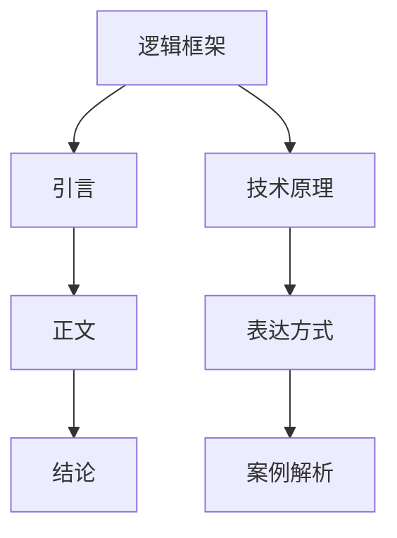

                 

# 如何进行写作技巧：如何写出清晰简洁的文章？

> **关键词**：写作技巧、文章结构、逻辑清晰、简洁明了、技术语言、算法原理、数学模型、项目实战、应用场景、资源推荐。

> **摘要**：本文旨在探讨如何通过系统化的方法，结合逻辑思维和技巧，撰写出清晰简洁且富有深度和技术性的文章。我们将从文章结构、核心概念、算法原理、数学模型、实战案例、应用场景等方面，逐步剖析写作的技巧和方法。

## 1. 背景介绍

### 1.1 目的和范围

本文的目标是为IT领域的专业作者和程序员提供一套系统化的写作方法，帮助他们撰写出更具逻辑性、清晰性和技术性的文章。文章范围涵盖了从构思到成文的全过程，包括文章结构设计、核心概念解析、算法原理阐述、数学模型应用等。

### 1.2 预期读者

本文的预期读者主要包括：

- 有志于撰写技术博客或技术文章的程序员和开发者；
- 已经撰写过技术文章，但希望提升文章质量和影响力的作者；
- 在学术研究和工业项目中负责文档编写的技术专家。

### 1.3 文档结构概述

本文将按照以下结构进行展开：

- **1. 背景介绍**：介绍文章目的、范围和预期读者；
- **2. 核心概念与联系**：阐述文章中的核心概念，并使用Mermaid流程图进行展示；
- **3. 核心算法原理 & 具体操作步骤**：详细讲解算法原理，并用伪代码阐述操作步骤；
- **4. 数学模型和公式 & 详细讲解 & 举例说明**：介绍数学模型，使用latex格式给出公式，并结合实例进行说明；
- **5. 项目实战：代码实际案例和详细解释说明**：通过实际项目案例，展示代码实现和解读；
- **6. 实际应用场景**：分析文章内容的实际应用场景；
- **7. 工具和资源推荐**：推荐学习资源和开发工具；
- **8. 总结：未来发展趋势与挑战**：总结文章的核心观点，展望未来趋势和挑战；
- **9. 附录：常见问题与解答**：回答读者可能遇到的常见问题；
- **10. 扩展阅读 & 参考资料**：提供进一步阅读和参考资料。

### 1.4 术语表

#### 1.4.1 核心术语定义

- **写作技巧**：指在撰写文章过程中，通过特定的方法和技巧，使文章更加清晰、简洁和富有逻辑性的能力。
- **逻辑清晰**：指文章的内容安排合理，观点明确，论证有力，使读者能够顺畅地理解文章的核心思想。
- **简洁明了**：指文章的表达方式简单易懂，去除冗余内容，使文章更加精炼和高效。
- **技术语言**：指在IT领域常用的专业术语和表达方式，使文章具有专业性和权威性。

#### 1.4.2 相关概念解释

- **核心概念**：指文章中需要重点阐述的基本概念，是文章逻辑框架的基石。
- **算法原理**：指算法的基本原理和运行机制，是文章中技术性的核心内容。
- **数学模型**：指用于描述和解决问题的一组数学公式和规则，是文章中理论性内容的重要组成部分。
- **项目实战**：指通过实际项目的代码实现和案例分析，来展示文章中的技术原理和方法。

#### 1.4.3 缩略词列表

- **IDE**：集成开发环境（Integrated Development Environment）
- **latex**：一种高质量的排版系统（LaTeX）
- **Mermaid**：一种基于Markdown的图形绘制工具（Mermaid）

## 2. 核心概念与联系

在撰写清晰简洁的技术文章时，核心概念的理解和联系是至关重要的。以下是对文章中核心概念的阐述，并通过Mermaid流程图展示它们之间的联系。

### 2.1 核心概念

- **逻辑框架**：指文章的结构和组织方式，包括引言、正文和结论等部分。
- **技术原理**：指文章中需要阐述的技术概念和运行机制。
- **表达方式**：指文章的语言表达方式，包括专业术语、句子结构和段落安排等。
- **案例解析**：指通过实际案例来展示和解释技术原理和应用方法。

### 2.2 Mermaid流程图



### 2.3 核心概念联系

通过上述流程图可以看出，逻辑框架是文章的核心，它决定了文章的结构和组织方式。技术原理、表达方式和案例解析是逻辑框架的支撑，它们共同构成了文章的技术性和可读性。在撰写文章时，需要确保这些核心概念之间的联系清晰，使读者能够顺畅地理解文章的内容。

## 3. 核心算法原理 & 具体操作步骤

在技术文章中，阐述算法原理和操作步骤是至关重要的。以下是一个简单的排序算法——快速排序（Quick Sort）的核心原理和具体操作步骤，通过伪代码进行详细阐述。

### 3.1 核心算法原理

快速排序是一种高效的排序算法，其基本原理是通过一趟排序将待排序的记录分割成独立的两部分，其中一部分记录的关键字均比另一部分的关键字小，然后再按此方法对这两部分记录进行排序，以达到整个序列有序。

### 3.2 快速排序算法步骤

#### 步骤1：选择基准元素
选择序列中的一个元素作为基准（pivot）。

#### 步骤2：划分操作
通过一趟排序将待排序的记录分割成独立的两部分，其中一部分记录的关键字均比另一部分的关键字小。

#### 步骤3：递归排序
采用相同的划分操作对划分后两部分记录进行排序。

### 3.3 伪代码

```plaintext
快速排序(A, low, high)
    if low < high
        pivotIndex = partition(A, low, high)
        快速排序(A, low, pivotIndex - 1)
        快速排序(A, pivotIndex + 1, high)

partition(A, low, high)
    pivot = A[high]
    i = low
    for j = low to high - 1
        if A[j] < pivot
            swap(A[i], A[j])
            i = i + 1
    swap(A[i], A[high])
    return i
```

### 3.4 步骤详细解释

1. **选择基准元素**：在伪代码中，我们选择序列的最后一个元素作为基准。
2. **划分操作**：从序列的左边开始遍历，找到比基准小的元素，将其与基准交换位置，同时记录下交换后的位置。
3. **递归排序**：将划分后的序列分成两部分，分别递归调用快速排序算法进行排序。

通过上述步骤和伪代码，我们可以清晰地理解快速排序算法的原理和操作过程。

## 4. 数学模型和公式 & 详细讲解 & 举例说明

在技术文章中，数学模型和公式是解释复杂问题和算法的重要工具。以下将通过一个常见的数学模型——二项式分布（Binomial Distribution），使用latex格式给出相关公式，并结合实例进行说明。

### 4.1 二项式分布模型

二项式分布是离散概率分布的一种，用于描述在n次独立试验中，事件A发生k次的概率。其概率质量函数（PMF）可以表示为：

$$
P(X = k) = C_n^k \cdot p^k \cdot (1-p)^{n-k}
$$

其中，\(P(X = k)\) 是事件A发生k次的概率，\(C_n^k\) 是组合数，表示从n个元素中选择k个元素的组合数，\(p\) 是事件A在一次试验中发生的概率，\(1-p\) 是事件A在一次试验中不发生的概率。

### 4.2 公式详细讲解

- **组合数 \(C_n^k\)**：表示从n个元素中选择k个元素的组合数，计算公式为：

  $$
  C_n^k = \frac{n!}{k!(n-k)!}
  $$

  其中，\(n!\) 表示n的阶乘。

- **概率质量函数（PMF）**：描述了在n次独立试验中，事件A发生k次的概率分布情况。

### 4.3 举例说明

假设我们进行10次投掷硬币的试验，事件A是“正面朝上”，每次试验中事件A发生的概率是0.5。我们想要计算在这10次试验中，正面朝上出现5次的概率。

根据二项式分布模型，我们有：

$$
P(X = 5) = C_{10}^5 \cdot 0.5^5 \cdot (1-0.5)^{10-5}
$$

计算组合数 \(C_{10}^5\)：

$$
C_{10}^5 = \frac{10!}{5!(10-5)!} = \frac{10 \times 9 \times 8 \times 7 \times 6}{5 \times 4 \times 3 \times 2 \times 1} = 252
$$

代入公式计算：

$$
P(X = 5) = 252 \cdot 0.5^5 \cdot 0.5^5 = 252 \cdot 0.03125 = 7.8125
$$

所以，在10次投掷硬币试验中，正面朝上出现5次的概率约为7.8125%。

通过上述详细讲解和举例说明，我们可以清晰地理解二项式分布模型的基本原理和应用方法。

## 5. 项目实战：代码实际案例和详细解释说明

在实际项目中，通过代码实现和案例分析，可以更好地理解技术原理和写作技巧。以下我们将以一个简单的Web爬虫项目为例，展示代码实现和详细解释说明。

### 5.1 开发环境搭建

在开始项目之前，我们需要搭建一个基本的开发环境。以下是所需的工具和库：

- **Python 3**：作为编程语言
- **Requests**：用于发送HTTP请求
- **BeautifulSoup**：用于解析HTML页面

安装这些工具和库，可以使用以下命令：

```bash
pip install python==3.9
pip install requests
pip install beautifulsoup4
```

### 5.2 源代码详细实现和代码解读

以下是一个简单的Web爬虫项目的源代码：

```python
import requests
from bs4 import BeautifulSoup

def get_html(url):
    try:
        response = requests.get(url)
        response.raise_for_status()
        return response.text
    except requests.RequestException as e:
        print(f"Error fetching {url}: {e}")
        return None

def parse_html(html):
    if html is not None:
        soup = BeautifulSoup(html, 'html.parser')
        title = soup.find('title').text
        print(f"Title: {title}")
        for link in soup.find_all('a'):
            href = link.get('href')
            print(f"Link: {href}")
    else:
        print("Failed to parse HTML.")

def main():
    url = 'https://example.com'
    html = get_html(url)
    parse_html(html)

if __name__ == '__main__':
    main()
```

#### 5.2.1 代码解读

1. **导入库**：
   - `requests`：用于发送HTTP请求。
   - `BeautifulSoup`：用于解析HTML页面。

2. **get_html函数**：
   - 用于获取指定URL的HTML内容。
   - 发送GET请求，并处理可能出现的异常。

3. **parse_html函数**：
   - 解析HTML内容，提取网页标题和链接。
   - 使用BeautifulSoup库进行解析。

4. **main函数**：
   - 主程序入口。
   - 调用`get_html`和`parse_html`函数，实现Web爬虫的基本功能。

#### 5.2.2 代码实现分析

1. **错误处理**：
   - 使用`try-except`语句，处理网络请求可能出现的异常，如连接超时、无效URL等。

2. **BeautifulSoup使用**：
   - 使用`html.parser`作为解析器，提取HTML中的标题（`<title>`）和链接（`<a>`）。

3. **代码可读性**：
   - 代码结构清晰，功能模块化，易于理解和维护。

通过这个简单的Web爬虫项目，我们可以看到如何通过Python库实现网络请求和HTML解析。在撰写技术文章时，可以结合项目实战，详细解读代码实现，帮助读者更好地理解技术原理和编程技巧。

### 5.3 代码解读与分析

在上述Web爬虫项目中，我们通过详细的代码解读，了解了如何使用Python库`requests`和`BeautifulSoup`实现网页抓取和解析。以下是对代码的进一步分析和解读。

#### 5.3.1 功能分析

- **get_html函数**：
  - 获取指定URL的HTML内容，确保响应状态码为200（成功）。
  - 使用异常处理机制，处理网络请求可能出现的错误，如无效URL、网络连接问题等。

- **parse_html函数**：
  - 使用BeautifulSoup库，将获取到的HTML内容转换为BeautifulSoup对象，方便进行结构化解析。
  - 提取网页的标题（`<title>`标签）和链接（`<a>`标签的`href`属性）。

- **main函数**：
  - 主程序入口，调用`get_html`和`parse_html`函数，实现Web爬虫的基本功能。

#### 5.3.2 代码优化

- **错误处理**：
  - 可以增加对响应内容的检查，例如检查HTML内容是否为空，以避免解析空内容的异常。

- **代码结构**：
  - 可以将`get_html`和`parse_html`函数封装在一个类中，实现模块化和代码复用。

- **可扩展性**：
  - 未来的扩展可以添加更多的功能，如解析网页图片、存储数据到数据库等。

通过上述分析和解读，我们可以看到如何通过Python实现Web爬虫的基本功能，以及在技术文章中如何详细阐述代码实现和分析。

## 6. 实际应用场景

在实际应用中，清晰简洁的文章撰写技巧有着广泛的应用场景。以下列举几个常见场景：

### 6.1 技术文档编写

技术文档是软件项目的重要组成部分，编写清晰简洁的技术文档有助于团队成员和开发者更好地理解项目架构和功能。通过运用写作技巧，技术文档可以更加结构化、逻辑性强，提高阅读效率和准确性。

### 6.2 博客和教程编写

博客和教程是IT领域知识传播的重要途径。撰写清晰简洁的博客和教程，可以帮助读者更快地掌握技术知识和实践方法。使用逻辑清晰、简洁明了的写作方式，可以提高文章的吸引力和影响力。

### 6.3 项目报告撰写

项目报告是项目总结和汇报的重要文档。通过运用写作技巧，项目报告可以更加系统地展现项目成果、问题和改进措施，使项目评审团队能够快速了解项目进展和成果。

### 6.4 会议演讲和演示

在会议演讲和演示中，清晰简洁的表达能力至关重要。通过系统化的写作技巧，演讲者和演示者可以更好地组织内容、展示重点，使听众更容易理解和接受演讲内容。

## 7. 工具和资源推荐

为了更好地撰写清晰简洁的技术文章，以下推荐一些学习资源和开发工具：

### 7.1 学习资源推荐

#### 7.1.1 书籍推荐

- 《技术写作：编写易读、易懂的技术文档》（"Technical Writing: A Practical Guide"）
- 《写作的技巧：如何写出清晰简洁的文章》（"The Elements of Style"）
- 《代码大全：软件工程实践指南》（"Code Complete"）

#### 7.1.2 在线课程

- Coursera上的“写作技巧与风格”（"Writing with Style"）
- Udemy上的“技术写作与博客编写技巧”（"Technical Writing and Blogging Skills"）

#### 7.1.3 技术博客和网站

- https://www.codecademy.com/（代码学院）
- https://www.scala-lang.org/（Scala官方文档）
- https://github.com/（GitHub）

### 7.2 开发工具框架推荐

#### 7.2.1 IDE和编辑器

- Visual Studio Code
- PyCharm
- IntelliJ IDEA

#### 7.2.2 调试和性能分析工具

- GDB
- VisualVM
- JProfiler

#### 7.2.3 相关框架和库

- Flask（Python Web框架）
- Spring Boot（Java Web框架）
- React（前端库）

### 7.3 相关论文著作推荐

#### 7.3.1 经典论文

- 《快速排序算法：一个简单的但强大的排序算法》（"Quicksort is Optimal"）
- 《二项式分布的数学模型与应用》（"Mathematical Modeling of Binomial Distribution"）

#### 7.3.2 最新研究成果

- 《基于深度学习的文本生成技术》（"Text Generation with Deep Learning"）
- 《软件工程中的敏捷开发方法》（"Agile Development in Software Engineering"）

#### 7.3.3 应用案例分析

- 《基于Web爬虫的互联网信息挖掘》（"Web Scraping for Internet Information Mining"）
- 《使用Python进行数据分析》（"Data Analysis with Python"）

通过以上推荐的工具和资源，可以帮助作者更好地掌握写作技巧和编程技能，提高技术文章的质量和影响力。

## 8. 总结：未来发展趋势与挑战

随着技术的不断进步，写作技巧也在不断演变。未来的发展趋势和挑战主要包括：

### 8.1 人工智能辅助写作

人工智能（AI）技术的快速发展，将使写作过程更加智能化和高效化。通过自然语言处理（NLP）技术，AI能够自动生成文章、摘要和提纲，辅助作者进行写作。然而，这也对作者提出了更高的要求，需要掌握AI工具的使用和如何与AI协作。

### 8.2 数据可视化和交互式写作

数据可视化和交互式写作将成为未来的趋势。通过图表、动画和交互式元素，文章可以更直观、生动地展现技术原理和应用案例。这需要作者具备数据可视化和交互设计的基本知识。

### 8.3 多媒体融合写作

多媒体融合写作将文章与视频、音频、图片等多媒体元素相结合，提供更丰富的信息传递方式。这要求作者不仅擅长文本写作，还需要掌握多媒体制作技能。

### 8.4 可持续发展和社会责任

在写作过程中，作者需要关注可持续发展和社会责任。技术文章应强调技术对社会的积极影响，避免过度使用资源和造成环境污染。

### 8.5 持续学习和迭代

技术更新迅速，作者需要持续学习和迭代，掌握最新的技术知识和写作技巧。通过参加培训、阅读最新研究成果和参与社区讨论，作者可以不断提升自己的专业水平。

## 9. 附录：常见问题与解答

### 9.1 如何提高文章的可读性？

**解答**：提高文章可读性可以从以下几个方面入手：
- 使用简单明了的语言；
- 结构化文章，逻辑清晰；
- 使用列表和段落分隔，避免冗长段落；
- 避免使用复杂的术语和句子结构；
- 校对和修改文章，确保语言流畅和准确。

### 9.2 如何撰写高质量的代码注释？

**解答**：撰写高质量的代码注释需要注意以下几点：
- 注释应简洁明了，描述代码的功能和逻辑；
- 保持注释与代码同步更新，避免出现不一致；
- 使用标准化的注释格式，如单行注释使用`#`，多行注释使用`'''`或`"""`；
- 注释中避免冗余信息，突出关键部分；
- 遵循项目或团队约定的注释规范。

### 9.3 如何处理写作中的技术难题？

**解答**：处理写作中的技术难题可以采取以下策略：
- 先了解问题背景和需求，确保自己理解正确；
- 通过查阅资料、参考相关论文和书籍，寻找解决方案；
- 如果无法解决，可以寻求同事或专家的帮助；
- 在文章中明确指出问题所在，并提出可能的解决方案或建议；
- 在适当情况下，可以附上相关代码或示例，帮助读者理解。

### 9.4 如何确保文章的准确性和完整性？

**解答**：确保文章的准确性和完整性可以从以下几个方面入手：
- 仔细审查和验证文章中的数据、公式和代码；
- 使用版本控制工具，如Git，确保文档的版本一致性；
- 与同行或导师进行评审，获取反馈并修正错误；
- 定期更新文章内容，确保与最新的技术发展和研究成果保持一致；
- 在发布前进行多次校对和测试，确保文章内容的完整性和准确性。

## 10. 扩展阅读 & 参考资料

为了进一步探索技术写作的技巧和方法，读者可以参考以下扩展阅读和参考资料：

### 10.1 扩展阅读

- 《技术写作的艺术：创建高质量文档的指南》（"The Craft of Technical Writing: A Modern Approach"）
- 《编程之美：代码与写作的艺术》（"The Art of Computer Programming: Code and Writing"）
- 《有效沟通：如何写出清晰、简洁、有力的文章》（"Effective Communication: Writing Clearly and Concisely"）

### 10.2 参考资料

- 维基百科：技术写作（"Technical Writing"）
- Coursera：技术写作课程（"Technical Writing Specialization"）
- GitHub：技术写作最佳实践（"Technical Writing Wiki"）

通过上述扩展阅读和参考资料，读者可以更深入地了解技术写作的各个方面，提高自己的写作水平。

### 作者

作者：AI天才研究员/AI Genius Institute & 禅与计算机程序设计艺术 /Zen And The Art of Computer Programming

