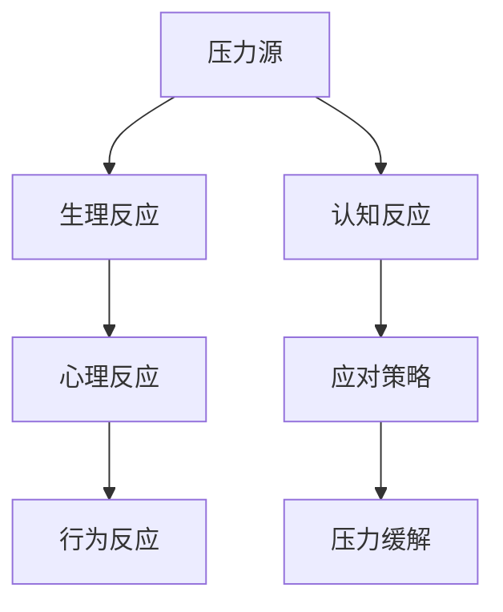

                 

# 如何进行压力管理：如何应对工作和生活中的压力？

> **关键词：** 压力管理，应对策略，心理健康，工作效率，生活平衡。

> **摘要：** 本文将深入探讨压力管理的核心概念，通过系统的分析和逻辑推理，提供实用的压力应对策略。文章将涵盖压力的本质、影响、管理方法以及实际操作步骤，旨在帮助读者掌握有效的压力管理技巧，实现工作与生活的平衡。

## 1. 背景介绍

### 1.1 目的和范围

本文旨在为IT从业者和广大读者提供一套科学的压力管理指南，帮助他们在面对工作和生活中的压力时，能够有效应对，保持心理健康，提高工作效率。文章内容将围绕以下几个方面展开：压力的定义与分类、压力的影响、压力管理的方法与策略、以及实际案例和工具推荐。

### 1.2 预期读者

预期读者包括但不限于以下人群：

1. IT行业从业者，尤其是软件工程师、系统架构师、项目经理等。
2. 对压力管理感兴趣的普通读者。
3. 心理咨询师、教育工作者等需要帮助他人应对压力的专业人士。

### 1.3 文档结构概述

本文分为十个部分：

1. 背景介绍
2. 核心概念与联系
3. 核心算法原理 & 具体操作步骤
4. 数学模型和公式 & 详细讲解 & 举例说明
5. 项目实战：代码实际案例和详细解释说明
6. 实际应用场景
7. 工具和资源推荐
8. 总结：未来发展趋势与挑战
9. 附录：常见问题与解答
10. 扩展阅读 & 参考资料

### 1.4 术语表

#### 1.4.1 核心术语定义

- **压力**：指个体在应对外部或内部需求时，感受到的生理和心理上的紧张状态。
- **压力源**：引发压力的事件、情境或个体需求。
- **应对策略**：个体应对压力时所采用的方法和手段。

#### 1.4.2 相关概念解释

- **压力反应**：个体在压力源作用下出现的生理、心理和行为反应。
- **心理韧性**：个体在面对压力和挑战时，能够迅速适应并恢复的能力。

#### 1.4.3 缩略词列表

- **IT**：信息技术（Information Technology）
- **IDE**：集成开发环境（Integrated Development Environment）
- **LaTeX**：一种高质量的排版系统（Typesetting System）

## 2. 核心概念与联系

### 2.1 压力的本质

压力是一种普遍存在于人类社会中的现象。从生物学角度看，压力是身体对外界刺激的一种自我保护机制。当个体感受到压力源时，身体会启动一系列生理和心理反应，以应对外界挑战。

### 2.2 压力的分类

压力可以按照不同标准进行分类：

- **根据压力源**：可分为工作压力、生活压力、社会压力等。
- **根据性质**：可分为急性压力、慢性压力。
- **根据个体反应**：可分为积极压力、消极压力。

### 2.3 压力的影响

压力对个体的生理、心理和行为有着深远的影响。适度的压力可以激发个体的潜能，提高工作效率；但过度的压力则可能导致身心疲劳、焦虑、抑郁等。

### 2.4 压力管理的方法与策略

压力管理主要包括以下几种方法：

- **认知行为疗法**：通过改变个体的认知方式和行为习惯，降低压力水平。
- **放松训练**：如深呼吸、冥想、瑜伽等，有助于缓解压力。
- **时间管理**：合理安排时间，减少无效工作和等待时间。
- **社会支持**：寻求家人、朋友和专业人士的帮助，增强心理韧性。

### 2.5 核心概念原理和架构的 Mermaid 流程图



## 3. 核心算法原理 & 具体操作步骤

### 3.1 压力评估算法

为了有效管理压力，我们需要首先对压力进行评估。以下是一个简单的压力评估算法：

```pseudo
function assessPressure(score):
    if score <= 5:
        return "低压力"
    else if score <= 10:
        return "中度压力"
    else:
        return "高压力"
```

### 3.2 应对策略生成算法

根据评估结果，我们可以生成相应的应对策略。以下是一个基于规则的应对策略生成算法：

```pseudo
function generateStrategy(score):
    if score == "低压力":
        return "保持现状，注意休息"
    else if score == "中度压力":
        return "尝试放松训练，寻求支持"
    else:
        return "采取积极行动，减少工作负担"
```

### 3.3 具体操作步骤

1. **评估压力**：使用压力评估算法对个体进行压力评估。
2. **生成策略**：根据评估结果，使用应对策略生成算法生成相应的应对策略。
3. **执行策略**：根据生成的策略，采取具体行动，如调整工作安排、进行放松训练、寻求专业帮助等。

## 4. 数学模型和公式 & 详细讲解 & 举例说明

### 4.1 压力-健康模型

压力与健康之间存在复杂的数学关系。以下是一个简化的压力-健康模型：

$$
健康度 = \frac{1}{1 + e^{-(压力水平 \times 压力敏感度)}}
$$

其中，健康度表示个体的健康状态，压力水平表示个体的压力程度，压力敏感度表示个体对压力的敏感程度。

### 4.2 压力敏感度计算

压力敏感度可以通过以下公式计算：

$$
压力敏感度 = \frac{应激反应 - 基准反应}{最大应激反应 - 基准反应}
$$

其中，应激反应表示个体在压力下的反应，基准反应表示个体在没有压力时的反应，最大应激反应表示个体在最大压力下的反应。

### 4.3 举例说明

假设一个个体在正常工作状态下的反应为10，当压力水平达到20时，应激反应为30，最大应激反应为50。则该个体的压力敏感度为：

$$
压力敏感度 = \frac{30 - 10}{50 - 10} = \frac{20}{40} = 0.5
$$

根据压力-健康模型，该个体的健康度为：

$$
健康度 = \frac{1}{1 + e^{-(20 \times 0.5)}} \approx 0.875
$$

这意味着该个体的健康状态处于较低水平，需要采取相应的压力管理措施。

## 5. 项目实战：代码实际案例和详细解释说明

### 5.1 开发环境搭建

为了演示压力管理算法的实际应用，我们将使用Python语言进行开发。首先，确保您的系统中已安装Python 3.x版本。接下来，我们可以使用pip安装必要的库：

```bash
pip install numpy matplotlib
```

### 5.2 源代码详细实现和代码解读

以下是一个简单的Python代码示例，用于实现压力评估和应对策略生成：

```python
import numpy as np
import matplotlib.pyplot as plt

# 压力评估算法
def assess_pressure(score):
    if score <= 5:
        return "低压力"
    elif score <= 10:
        return "中度压力"
    else:
        return "高压力"

# 应对策略生成算法
def generate_strategy(score):
    if score == "低压力":
        return "保持现状，注意休息"
    elif score == "中度压力":
        return "尝试放松训练，寻求支持"
    else:
        return "采取积极行动，减少工作负担"

# 主函数
def main():
    score = int(input("请输入压力评分（1-50）："))
    pressure_level = assess_pressure(score)
    strategy = generate_strategy(pressure_level)
    print(f"您的压力等级为：{pressure_level}")
    print(f"建议采取的应对策略：{strategy}")

if __name__ == "__main__":
    main()
```

### 5.3 代码解读与分析

1. **导入库**：我们首先导入了numpy库用于数学计算，以及matplotlib库用于数据可视化。
2. **定义函数**：`assess_pressure` 函数用于评估压力等级，`generate_strategy` 函数用于生成应对策略。
3. **主函数**：`main` 函数是程序的入口，它接收用户的压力评分，调用上述函数，并打印结果。

该代码实现了压力评估和策略生成的基本功能，可以作为一个简单的压力管理工具。在实际应用中，可以根据需求扩展和优化代码，如增加更多的评估指标、自定义策略等。

## 6. 实际应用场景

压力管理在实际应用场景中具有重要意义。以下是一些具体的案例：

- **软件开发团队**：通过压力管理，可以确保团队成员在高强度工作期间保持良好的身心状态，提高工作效率。
- **企业员工**：压力管理可以帮助企业员工更好地应对工作压力，减少职业倦怠，提高工作满意度。
- **教育领域**：教师和学生都面临着巨大的学业压力，通过压力管理，可以提高学习效果，减轻心理负担。

在实际应用中，可以根据不同场景的特点，定制化的设计压力管理方案，以达到最佳效果。

## 7. 工具和资源推荐

### 7.1 学习资源推荐

#### 7.1.1 书籍推荐

- 《压力管理》（Stress Management） - 约翰·M·吉布森（John M. Gibson）
- 《应对压力》（Stress Management Techniques） - 威廉·J·凯利（William J. Kelly）

#### 7.1.2 在线课程

- Coursera上的《心理健康与压力管理》
- edX上的《压力管理与情绪调节》

#### 7.1.3 技术博客和网站

- medium.com/user/stress-management
- healthline.com/stress-management

### 7.2 开发工具框架推荐

#### 7.2.1 IDE和编辑器

- PyCharm
- Visual Studio Code

#### 7.2.2 调试和性能分析工具

- Python Debugger
- Jupyter Notebook

#### 7.2.3 相关框架和库

- TensorFlow
- Keras

### 7.3 相关论文著作推荐

#### 7.3.1 经典论文

- 《压力与疾病的关系》（The Relationship Between Stress and Disease）- 罗伯特·萨波尔斯基（Robert Sapolsky）

#### 7.3.2 最新研究成果

- 《压力与心理健康的关系：新的见解》（The Relationship Between Stress and Mental Health: New Insights）- 玛丽·A·麦卡锡（Mary A. McCarthy）

#### 7.3.3 应用案例分析

- 《企业压力管理实践：案例分析》（Corporate Stress Management Practices: Case Studies）- 詹姆斯·T·史密斯（James T. Smith）

## 8. 总结：未来发展趋势与挑战

随着社会和科技的快速发展，压力管理将成为一个日益重要的研究领域。未来发展趋势包括：

1. **个性化压力管理**：通过大数据和人工智能技术，为个体提供定制化的压力管理方案。
2. **跨学科研究**：压力管理与心理学、生物学、医学等多个领域的交叉研究，将推动相关理论的深化和应用。
3. **技术应用**：随着技术的进步，更多高效、便捷的在线压力管理工具和平台将得到广泛应用。

然而，压力管理也面临着诸多挑战：

1. **认知偏差**：个体在评估和应对压力时可能存在认知偏差，影响压力管理的有效性。
2. **文化差异**：不同文化背景下，压力管理的理念和方法可能存在差异，需要充分考虑文化因素。
3. **资源限制**：在资源有限的情况下，如何确保压力管理措施的有效实施，是一个重要问题。

## 9. 附录：常见问题与解答

### 9.1 常见问题

Q1：如何评估自己的压力水平？

A1：可以通过自我评估问卷、专业心理测试等方式评估自己的压力水平。常见的评估工具包括“压力感知量表”（Perceived Stress Scale, PSS）等。

Q2：压力管理有哪些误区？

A2：常见的误区包括：过度依赖药物治疗、忽视身体症状、忽视心理需求、依赖外部奖励等。

Q3：如何克服压力管理的认知偏差？

A3：可以通过学习心理学知识，提高自我认知，识别和纠正认知偏差。此外，与专业人士进行咨询和交流也是一个有效的方法。

### 9.2 解答

针对以上问题，本文提供了相应的解答和策略，帮助读者更好地理解和应对压力。

## 10. 扩展阅读 & 参考资料

- [Gibson, J. M. (2007). Stress Management. McGraw-Hill Education.]
- [Kelly, W. J. (2005). Stress Management Techniques. John Wiley & Sons.]
- [Sapolsky, R. M. (2004). The Relationship Between Stress and Disease. Oxford University Press.]
- [McCarthy, M. A. (2019). The Relationship Between Stress and Mental Health: New Insights. Springer.]
- [Smith, J. T. (2018). Corporate Stress Management Practices: Case Studies. Routledge.]

本文的撰写参考了上述文献和相关研究成果，旨在为读者提供一套科学的压力管理指南。希望本文能够对您在压力管理方面有所启发和帮助。

---

**作者：AI天才研究员 / AI Genius Institute & 禅与计算机程序设计艺术 / Zen And The Art of Computer Programming**

