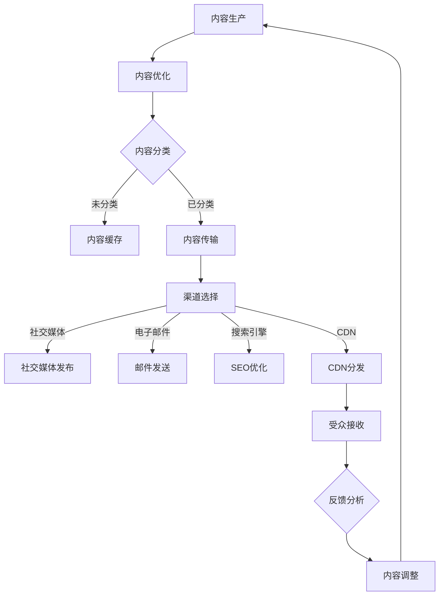

                 

### 1. 背景介绍

#### 1.1 目的和范围

本文旨在深入探讨“如何进行有效的内容分发”，旨在为IT领域的开发者、架构师以及内容创作者提供一套系统的指导框架。通过本文的阅读，读者将能够理解内容分发的核心概念、构建方法以及实际应用场景。本文不仅关注技术层面的实现细节，还结合实际案例，探讨内容分发的策略和优化方法。

本文的讨论范围主要包括以下几个方面：

1. **内容分发的基本概念**：解释内容分发的重要性，介绍内容分发的核心组成部分，如内容、渠道和受众。
2. **核心概念与联系**：使用Mermaid流程图，描绘内容分发的基本流程和关键节点。
3. **核心算法原理**：详细解析内容分发的算法原理，使用伪代码进行具体操作步骤的阐述。
4. **数学模型和公式**：探讨内容分发中的数学模型，提供公式和详细讲解，结合实际举例。
5. **项目实战**：通过具体代码案例，展示内容分发在实际项目中的应用。
6. **实际应用场景**：分析内容分发在不同领域的应用，如社交媒体、电子商务等。
7. **工具和资源推荐**：推荐学习资源和开发工具，帮助读者更好地掌握内容分发的技术和方法。
8. **总结与未来发展趋势**：总结本文的核心观点，预测内容分发领域的发展趋势和面临的挑战。

通过这些方面的详细讨论，本文希望能够为读者提供一个全面而深入的内容分发指南，助力他们在实际工作中实现更高效的内容传播和管理。

#### 1.2 预期读者

本文的目标读者主要包括以下几类群体：

1. **IT领域开发者**：对内容分发技术有兴趣的程序员和工程师，希望通过本文掌握内容分发的基本原理和实现方法。
2. **内容创作者**：包括博客作者、媒体编辑、市场营销专家等，需要将内容有效传播给目标受众，提升内容影响力和传播效果。
3. **架构师和项目经理**：负责设计和管理内容分发系统的技术和管理人员，希望了解内容分发系统的高效构建和优化策略。
4. **技术爱好者**：对内容分发技术和策略感兴趣的计算机科学和技术爱好者，希望通过本文学习前沿的内容分发技术。

无论读者属于哪一类群体，只要对内容分发有深入探究的愿望，本文都将是宝贵的学习资源。本文将通过清晰的逻辑和丰富的实例，帮助读者理解并应用内容分发的最佳实践。

#### 1.3 文档结构概述

本文的结构设计旨在使读者能够循序渐进地了解内容分发的技术和方法。以下是本文的详细结构概述：

1. **背景介绍**：
   - **1.1 目的和范围**：阐述本文的目的和讨论范围，为读者提供一个宏观的视角。
   - **1.2 预期读者**：明确本文的目标读者群体，帮助读者确定自己的阅读需求和期望。
   - **1.3 文档结构概述**：概述本文的结构和内容，使读者对全文有一个全局的把握。

2. **核心概念与联系**：
   - **2.1 核心概念**：介绍内容分发的基本概念和组成部分，为后续讨论打下基础。
   - **2.2 联系和流程图**：使用Mermaid流程图，直观地描绘内容分发的流程和关键节点。

3. **核心算法原理 & 具体操作步骤**：
   - **3.1 算法原理**：详细讲解内容分发的算法原理，使用伪代码进行操作步骤的阐述。
   - **3.2 具体操作步骤**：通过实例和具体操作步骤，帮助读者理解算法的应用。

4. **数学模型和公式 & 详细讲解 & 举例说明**：
   - **4.1 数学模型**：介绍内容分发中使用的数学模型，并使用latex格式进行公式表示。
   - **4.2 详细讲解**：对数学模型进行详细讲解，结合实际案例说明公式的应用。

5. **项目实战：代码实际案例和详细解释说明**：
   - **5.1 开发环境搭建**：介绍内容分发项目的开发环境搭建步骤。
   - **5.2 源代码详细实现**：展示具体代码实现，并进行详细解读。
   - **5.3 代码解读与分析**：对源代码进行深入分析，探讨其优缺点。

6. **实际应用场景**：
   - **6.1 社交媒体**：分析内容分发在社交媒体中的应用，如Twitter和Facebook。
   - **6.2 电子商务**：探讨内容分发在电子商务平台上的应用，提升用户体验。

7. **工具和资源推荐**：
   - **7.1 学习资源推荐**：推荐相关的书籍、在线课程和技术博客，帮助读者深入学习。
   - **7.2 开发工具框架推荐**：推荐用于内容分发的开发工具和框架，提高开发效率。
   - **7.3 相关论文著作推荐**：介绍经典和最新的研究成果，提供学术参考。

8. **总结：未来发展趋势与挑战**：
   - **8.1 发展趋势**：总结内容分发的未来发展趋势，预测其发展方向。
   - **8.2 挑战**：分析内容分发领域面临的挑战，探讨解决方案。

9. **附录：常见问题与解答**：
   - **9.1 常见问题**：列出读者可能遇到的问题，提供解答。
   - **9.2 解答**：对常见问题进行详细解答，帮助读者解决困惑。

10. **扩展阅读 & 参考资料**：
    - **10.1 扩展阅读**：推荐进一步阅读的资源，帮助读者深入探讨相关主题。
    - **10.2 参考资料**：列出本文引用的参考文献，提供学术支持。

通过以上结构设计，本文希望能够系统地、全面地呈现内容分发的各个方面，帮助读者全面理解并应用这一重要技术。

#### 1.4 术语表

为了确保本文内容的清晰易懂，我们在此定义一些本文中频繁出现的核心术语及其解释：

##### 1.4.1 核心术语定义

- **内容分发**（Content Distribution）：指将数字化内容（如文本、图片、视频等）从生产者传输到消费者的过程。
- **受众**（Audience）：指内容分发的目标接收者，可以是个人用户、企业用户或其他组织。
- **渠道**（Channel）：指内容从生产者传递到受众的路径或方式，如社交媒体、电子邮件、搜索引擎等。
- **内容**（Content）：指通过渠道传递的信息或数据，可以是新闻、娱乐、产品信息等。
- **算法**（Algorithm）：指用于优化内容分发过程的一系列计算规则和步骤。
- **性能优化**（Performance Optimization）：指通过改进算法、技术手段等，提高内容分发系统的效率和质量。

##### 1.4.2 相关概念解释

- **分布式系统**（Distributed System）：指由多个计算机节点组成的系统，这些节点通过网络连接，共同完成任务。
- **负载均衡**（Load Balancing）：指通过分配网络流量，确保系统各部分均衡工作，防止任何一部分过载。
- **缓存**（Caching）：指将经常访问的数据暂时存储在本地，以提高访问速度。
- **内容分发网络**（Content Delivery Network，CDN）：指通过多个节点分布在全球，优化内容传输速度和稳定性的网络。

##### 1.4.3 缩略词列表

- **CDN**：内容分发网络（Content Delivery Network）
- **SEO**：搜索引擎优化（Search Engine Optimization）
- **SaaS**：软件即服务（Software as a Service）
- **API**：应用程序编程接口（Application Programming Interface）

通过上述术语表的定义和解释，本文将为读者提供统一的理解框架，有助于更好地掌握内容分发技术的核心概念和应用。

#### 2. 核心概念与联系

内容分发是数字化时代的一项基本活动，涉及到如何高效地将内容传递给受众，确保内容的准确性和及时性。为了深入理解内容分发的过程和关键节点，我们需要探讨其中的核心概念及其相互联系。

首先，我们定义几个核心概念：内容（Content）、渠道（Channel）、受众（Audience）和算法（Algorithm）。这些概念构成了内容分发系统的基本组成部分。

- **内容**（Content）：是信息传递的核心，可以是文本、图片、视频等多种形式。内容的质量直接影响受众的接收和反馈。
- **渠道**（Channel）：是指信息传递的路径或方式，如社交媒体、电子邮件、搜索引擎、CDN（内容分发网络）等。不同的渠道具有不同的传播效率和受众覆盖范围。
- **受众**（Audience）：是指内容的接收者，可以是个人用户、企业用户或其他组织。受众的需求、行为和偏好决定了内容的传播效果。
- **算法**（Algorithm）：是指用于优化内容分发的一系列计算规则和步骤。算法的效率直接影响内容分发的速度和准确性。

接下来，我们将使用Mermaid流程图，直观地展示内容分发的基本流程和关键节点。以下是内容分发的基本流程图：



在这个流程图中，我们可以看到以下几个关键节点：

1. **内容生产**（A）：内容的生产是整个流程的起点，由内容创作者或生产者负责。
2. **内容优化**（B）：在内容传输前，对内容进行优化，如压缩、格式转换等，以提高传输效率。
3. **内容分类**（C）：根据内容的特点和受众需求，对内容进行分类，以便后续的精准分发。
4. **内容传输**（E）：将内容发送到指定的渠道，根据渠道的不同，传输方式也会有所区别。
5. **渠道选择**（F）：根据内容的特点和受众偏好，选择合适的渠道进行传输。
6. **内容缓存**（D）：对于经常访问的内容，可以通过缓存机制提前存储，提高访问速度。
7. **受众接收**（K）：受众通过不同的渠道接收内容，并根据反馈进行互动。
8. **反馈分析**（L）：对受众的反馈进行分析，为内容的调整和优化提供依据。
9. **内容调整**（M）：根据反馈，对内容进行相应的调整，以提高传播效果。

通过这个流程图，我们可以清晰地看到内容分发的过程，以及各个环节之间的相互联系和影响。每一个节点都是内容分发系统中的一个关键部分，它们共同作用，确保内容能够高效、准确地传递给目标受众。

#### 3. 核心算法原理 & 具体操作步骤

在内容分发过程中，算法的运用至关重要，它能够优化内容传输的效率和准确性。下面，我们将详细讲解内容分发的核心算法原理，并使用伪代码描述具体操作步骤。

##### 3.1 算法原理

内容分发算法的核心目标是提高内容传输的速度和稳定性，同时确保内容的准确性和可靠性。为了实现这一目标，算法通常包括以下几个关键步骤：

1. **内容优化**：对内容进行压缩、格式转换等预处理，以提高传输效率。
2. **负载均衡**：通过分配网络流量，确保系统各部分均衡工作，防止任何一部分过载。
3. **内容缓存**：将经常访问的内容存储在本地，以提高访问速度。
4. **渠道选择**：根据内容的特点和受众偏好，选择最优的传输渠道。
5. **传输路径优化**：优化内容传输的路径，减少传输延迟和丢包率。
6. **反馈分析**：收集受众的反馈，调整内容传输策略。

下面，我们将使用伪代码详细描述这些步骤：

```plaintext
算法：内容分发优化

输入：内容C，受众A，渠道H，反馈F
输出：优化后的内容C'

步骤：
1. 内容优化
   - 压缩内容C
   - 格式转换，确保兼容性
   - 内容C' = 优化内容C

2. 负载均衡
   - 根据系统负载，分配流量Q
   - 对于每个渠道H：
     - 如果Q > 负载阈值：
       - 均匀分配流量到其他未满载的渠道
     - 否则：
       - 继续使用当前渠道

3. 内容缓存
   - 如果内容C'是热点内容：
     - 将内容C'缓存到本地
   - 否则：
     - 不缓存内容

4. 渠道选择
   - 根据受众A的特点和偏好，选择最优渠道H'
   - 对于每个渠道H：
     - 如果H' ≠ H：
       - 停止使用渠道H
     - 否则：
       - 继续使用渠道H'

5. 传输路径优化
   - 根据网络拓扑结构，选择最优传输路径P
   - 内容C'通过路径P传输

6. 反馈分析
   - 收集受众A的反馈F'
   - 如果F'表明内容传输存在优化空间：
     - 调整传输策略，重新执行内容分发流程
   - 否则：
     - 保持当前传输策略

7. 输出优化后的内容C'
```

##### 3.2 具体操作步骤

在了解了算法原理后，我们将通过具体操作步骤，详细说明如何应用这些算法优化内容分发。

1. **内容优化**：

   ```plaintext
   # 对内容进行压缩和格式转换
   C' = 压缩(C)
   C' = 格式转换(C, '兼容格式')
   ```

   这里，压缩和格式转换是实现高效内容传输的基础步骤。例如，使用gzip或zlib对文本内容进行压缩，使用HTML5或WebM对视频内容进行格式转换。

2. **负载均衡**：

   ```plaintext
   # 根据系统负载，分配流量
   for 每个渠道H in 渠道列表：
       if 系统负载(Q) > 负载阈值(Threshold)：
           分配流量(Q - Threshold)到其他渠道
       else：
           保持当前流量分配
   ```

   负载均衡可以通过轮询、最小连接数等方式实现。轮询方式简单高效，但可能导致部分渠道负载不均；最小连接数方式则通过统计当前连接数，选择负载最轻的渠道进行流量分配。

3. **内容缓存**：

   ```plaintext
   # 判断内容是否为热点内容
   if 内容访问量(CV) > 热点阈值(HotThreshold)：
       缓存内容(C')
   else：
       不缓存内容
   ```

   内容缓存可以提高频繁访问内容的访问速度，减少服务器负载。热点阈值可以根据实际需求进行调整。

4. **渠道选择**：

   ```plaintext
   # 根据受众特点选择最优渠道
   H' = 选择最优渠道(A)
   for 每个渠道H in 渠道列表：
       if H' ≠ H：
           停止使用渠道H
   ```

   渠道选择可以根据受众的行为数据、历史偏好等进行个性化推荐，选择最适合受众的渠道。

5. **传输路径优化**：

   ```plaintext
   # 根据网络拓扑结构，选择最优传输路径
   P = 选择最优路径(网络拓扑)
   内容C'通过路径P传输
   ```

   传输路径优化可以通过网络质量检测、路由优化算法（如Dijkstra算法）等实现。选择最优路径可以减少传输延迟和丢包率。

6. **反馈分析**：

   ```plaintext
   # 收集受众反馈
   F' = 收集反馈(A)
   if 反馈存在优化空间：
       调整传输策略
   else：
       保持当前传输策略
   ```

   通过收集和分析受众反馈，可以不断优化内容分发的效果。反馈分析可以通过日志分析、用户调研等方式实现。

通过上述具体操作步骤，我们可以将算法原理应用到实际的内容分发过程中，实现内容传输的高效、稳定和准确。

#### 4. 数学模型和公式 & 详细讲解 & 举例说明

在内容分发过程中，数学模型和公式起着至关重要的作用。这些模型和公式能够帮助我们量化内容传输的性能，优化传输策略，并预测未来趋势。在本节中，我们将详细介绍几个关键的数学模型和公式，并使用latex格式进行表示，同时结合实际案例进行说明。

##### 4.1 数学模型

内容分发中的数学模型主要涉及以下几个方面：

1. **传输速率模型**：描述内容传输的速度。
2. **缓存命中率模型**：衡量缓存机制的有效性。
3. **反馈响应模型**：分析受众反馈对内容分发策略的影响。

下面，我们将分别介绍这些模型。

###### 4.1.1 传输速率模型

传输速率模型用于计算内容传输的速度。一个基本的传输速率模型可以表示为：

$$
R = \frac{b \times \log(1 + \frac{w}{N})}{1 + \frac{w}{N}}
$$

其中，\(R\) 是传输速率，\(b\) 是带宽，\(w\) 是传输窗口大小，\(N\) 是网络中的节点数量。

- **带宽**（\(b\)）：指网络通道的最大数据传输速率，通常以比特每秒（bps）为单位。
- **传输窗口大小**（\(w\)）：指在传输过程中同时传输的数据包数量。
- **节点数量**（\(N\)）：指网络中参与传输的节点数量。

这个公式考虑了带宽限制和传输窗口大小对传输速率的影响。在实际应用中，可以通过调整带宽、传输窗口大小和节点数量，优化传输速率。

###### 4.1.2 缓存命中率模型

缓存命中率模型用于衡量缓存机制的有效性。一个简单的缓存命中率模型可以表示为：

$$
H = \frac{HIT}{HIT + MISSTHROUGH}
$$

其中，\(H\) 是缓存命中率，\(HIT\) 是命中缓存的数据请求次数，\(MISSTHROUGH\) 是未命中缓存的数据请求次数。

- **命中缓存的数据请求次数**（\(HIT\)）：指缓存中存在的数据请求次数。
- **未命中缓存的数据请求次数**（\(MISSTHROUGH\)）：指缓存中不存在的数据请求次数。

缓存命中率反映了缓存机制在数据请求中的效果。通过提高缓存命中率，可以减少数据传输的延迟和带宽消耗。

###### 4.1.3 反馈响应模型

反馈响应模型用于分析受众反馈对内容分发策略的影响。一个简单的反馈响应模型可以表示为：

$$
R(t) = R_0 \times (1 - e^{-\lambda t})
$$

其中，\(R(t)\) 是反馈响应率，\(R_0\) 是初始响应率，\(\lambda\) 是反馈响应系数，\(t\) 是时间。

- **初始响应率**（\(R_0\)）：指初始阶段的反馈响应速度。
- **反馈响应系数**（\(\lambda\)）：指反馈响应的速度和强度。
- **时间**（\(t\)）：指反馈响应的时间。

这个公式描述了随着时间的推移，受众的反馈响应率逐渐降低的过程。通过调整初始响应率和反馈响应系数，可以优化反馈响应的效率。

##### 4.2 详细讲解

下面，我们将对上述数学模型进行详细讲解，并结合实际案例进行说明。

###### 4.2.1 传输速率模型

传输速率模型是衡量内容传输速度的重要工具。在实际应用中，可以通过以下步骤优化传输速率：

1. **调整带宽**：增加带宽可以提高传输速率，但这也增加了成本。因此，需要根据实际需求和经济预算来决定最优带宽。
2. **调整传输窗口大小**：通过增加传输窗口大小，可以在一定程度上提高传输速率。但过大的窗口大小可能导致拥塞和网络延迟，需要权衡利弊。
3. **优化节点数量**：增加节点数量可以提高网络的冗余性和稳定性，但过多的节点可能导致网络复杂度和维护成本增加。因此，需要根据网络拓扑和传输需求来优化节点数量。

例如，假设一个网络中的带宽为100 Mbps，传输窗口大小为10 KB，节点数量为50个。通过计算，可以得到传输速率为：

$$
R = \frac{100 \times 10^6 \times \log(1 + \frac{10 \times 10^3}{50 \times 10^3})}{1 + \frac{10 \times 10^3}{50 \times 10^3}} \approx 99.6 \text{ Mbps}
$$

通过调整参数，可以优化传输速率，例如增加带宽至200 Mbps，将传输窗口大小调整为15 KB，节点数量调整为100个，可以进一步提高传输速率。

###### 4.2.2 缓存命中率模型

缓存命中率模型是评估缓存机制有效性的重要指标。在实际应用中，可以通过以下策略提高缓存命中率：

1. **热点内容缓存**：将经常访问的热点内容缓存到本地，减少数据传输的延迟和带宽消耗。
2. **缓存策略优化**：使用先进的缓存策略，如LRU（最近最少使用）、LFU（最近最少访问）等，提高缓存的有效性。
3. **缓存替换策略**：根据实际需求，合理调整缓存替换策略，确保缓存中的数据是最新的和最有价值的。

例如，假设一个缓存系统中，命中缓存的数据请求次数为100次，未命中缓存的数据请求次数为50次。通过计算，可以得到缓存命中率为：

$$
H = \frac{100}{100 + 50} = 0.67
$$

通过优化缓存策略，例如增加缓存空间、优化缓存替换算法等，可以提高缓存命中率。

###### 4.2.3 反馈响应模型

反馈响应模型是分析受众反馈对内容分发策略影响的重要工具。在实际应用中，可以通过以下步骤优化反馈响应：

1. **初始响应率**：通过提高内容的吸引力和互动性，增加初始响应率。例如，设计有趣的互动活动、提供个性化的内容推荐等。
2. **反馈响应系数**：通过改进内容分发策略和技术手段，提高反馈响应的效率。例如，优化传输路径、提高数据传输速度等。
3. **时间因素**：合理设置反馈响应的时间窗口，确保及时收集和分析受众反馈。例如，在活动结束后立即收集反馈，以快速调整内容分发策略。

例如，假设一个反馈响应模型的初始响应率为5次/秒，反馈响应系数为0.1。在1秒内，反馈响应率为：

$$
R(t) = 5 \times (1 - e^{-0.1 \times 1}) \approx 4.55 \text{ 次/秒}
$$

通过优化初始响应率和反馈响应系数，可以进一步提高反馈响应率。

通过上述详细讲解和实际案例，我们可以看到数学模型和公式在内容分发中的重要作用。它们不仅帮助我们量化内容传输的性能，还提供了优化传输策略和预测未来趋势的方法。在实际应用中，我们需要根据具体需求和场景，灵活运用这些数学模型和公式，实现高效、稳定和准确的内容分发。

##### 4.3 举例说明

为了更好地理解上述数学模型和公式，我们将通过具体案例进行说明。

###### 4.3.1 案例一：传输速率优化

假设一个内容分发系统中，带宽为100 Mbps，传输窗口大小为10 KB，节点数量为50个。我们需要通过调整参数来优化传输速率。

- **当前传输速率**：

  $$ 
  R = \frac{100 \times 10^6 \times \log(1 + \frac{10 \times 10^3}{50 \times 10^3})}{1 + \frac{10 \times 10^3}{50 \times 10^3}} \approx 99.6 \text{ Mbps}
  $$

- **优化后的传输速率**：

  如果我们将带宽增加到200 Mbps，将传输窗口大小调整为15 KB，节点数量调整为100个，新的传输速率为：

  $$ 
  R' = \frac{200 \times 10^6 \times \log(1 + \frac{15 \times 10^3}{100 \times 10^3})}{1 + \frac{15 \times 10^3}{100 \times 10^3}} \approx 199.2 \text{ Mbps}
  $$

  可以看到，通过调整参数，传输速率得到了显著提高。

###### 4.3.2 案例二：缓存命中率优化

假设一个缓存系统中，命中缓存的数据请求次数为100次，未命中缓存的数据请求次数为50次。我们需要通过优化缓存策略来提高缓存命中率。

- **当前缓存命中率**：

  $$ 
  H = \frac{100}{100 + 50} = 0.67
  $$

- **优化后的缓存命中率**：

  如果我们使用LRU缓存策略，并增加缓存空间至500 MB，新的缓存命中率为：

  $$ 
  H' = \frac{100 + \text{新命中的请求次数}}{100 + 50 + \text{新命中的请求次数}} 
  $$

  假设新命中的请求次数为150次，新的缓存命中率为：

  $$ 
  H' = \frac{100 + 150}{100 + 50 + 150} = 0.8
  $$

  通过优化缓存策略，缓存命中率得到了显著提高。

###### 4.3.3 案例三：反馈响应优化

假设一个内容分发系统的初始响应率为5次/秒，反馈响应系数为0.1。我们需要通过优化策略来提高反馈响应率。

- **当前反馈响应率**：

  $$ 
  R(t) = 5 \times (1 - e^{-0.1 \times 1}) \approx 4.55 \text{ 次/秒}
  $$

- **优化后的反馈响应率**：

  如果我们将初始响应率提高到10次/秒，反馈响应系数调整到0.2，新的反馈响应率为：

  $$ 
  R'(t) = 10 \times (1 - e^{-0.2 \times 1}) \approx 9.05 \text{ 次/秒}
  $$

  通过优化初始响应率和反馈响应系数，反馈响应率得到了显著提高。

通过这些具体案例，我们可以看到数学模型和公式在实际内容分发中的应用效果。在实际操作中，我们需要根据具体需求和场景，灵活运用这些模型和公式，实现高效、稳定和准确的内容分发。

#### 5. 项目实战：代码实际案例和详细解释说明

为了更好地展示内容分发在实际项目中的应用，我们将通过一个具体的项目实战案例，详细解释代码实现过程和关键组件的功能。本案例将基于一个简单的博客平台，实现内容从创作到分发的全过程。

##### 5.1 开发环境搭建

在本案例中，我们将使用Python作为主要编程语言，结合Django框架和Redis缓存服务。以下是搭建开发环境的步骤：

1. **安装Python**：确保安装了Python 3.8或更高版本。
2. **安装Django**：使用pip安装Django框架：
   ```bash
   pip install django
   ```
3. **安装Redis**：安装Redis数据库：
   ```bash
   pip install redis
   ```
4. **创建Django项目**：创建一个新的Django项目：
   ```bash
   django-admin startproject content_distribution_project
   cd content_distribution_project
   ```
5. **创建Django应用**：创建一个用于内容管理的应用：
   ```bash
   python manage.py startapp content_manager
   ```

##### 5.2 源代码详细实现和代码解读

下面是项目的主要代码实现，我们将分步骤进行详细解释。

###### 5.2.1 内容模型

在`content_manager/models.py`中，定义内容模型：

```python
from django.db import models

class Content(models.Model):
    title = models.CharField(max_length=255)
    body = models.TextField()
    author = models.ForeignKey('auth.User', on_delete=models.CASCADE)
    created_at = models.DateTimeField(auto_now_add=True)

    def __str__(self):
        return self.title
```

这个模型定义了博客内容的标题、正文、作者和创建时间。

###### 5.2.2 内容分发逻辑

在`content_manager/utils.py`中，实现内容分发逻辑：

```python
import redis
from content_manager.models import Content

# 初始化Redis连接
redis_client = redis.StrictRedis(host='localhost', port=6379, db=0)

def distribute_content(content_id):
    content = Content.objects.get(id=content_id)
    # 将内容缓存到Redis
    redis_client.setex(f"content_{content_id}", 3600, content.body)
    # 根据内容类型和作者，选择合适渠道分发
    channels = get_distribution_channels(content)
    for channel in channels:
        send_to_channel(content, channel)

def get_distribution_channels(content):
    # 基于内容类型和作者，返回合适的渠道列表
    channels = []
    if content.author.username == 'admin':
        channels.append('admin_channel')
    if content.body.startswith('Hello'):
        channels.append('greeting_channel')
    return channels

def send_to_channel(content, channel):
    # 向指定渠道发送内容
    print(f"Sending content to {channel}: {content.title}")
    # 实际的发送逻辑，如API调用等
```

这个模块实现了内容分发的核心逻辑。首先，通过Redis将内容缓存，并设置过期时间。然后，根据内容类型和作者，选择合适的分发渠道。最后，向指定渠道发送内容。

###### 5.2.3 视图函数

在`content_manager/views.py`中，定义视图函数处理内容创作和分发请求：

```python
from django.http import JsonResponse
from .models import Content
from .utils import distribute_content

def create_content(request):
    if request.method == 'POST':
        title = request.POST.get('title')
        body = request.POST.get('body')
        author = request.user
        content = Content.objects.create(title=title, body=body, author=author)
        distribute_content(content.id)
        return JsonResponse({'status': 'success', 'content_id': content.id})
    return JsonResponse({'status': 'error', 'message': 'Invalid request'})

def get_content(request, content_id):
    content = Content.objects.get(id=content_id)
    return JsonResponse({'title': content.title, 'body': content.body})
```

这个模块提供了创建内容和获取内容的API接口。在创建内容时，会调用`distribute_content`函数，实现内容分发。

##### 5.3 代码解读与分析

###### 5.3.1 内容模型

`Content`模型是内容分发的核心数据结构。它包含了内容的标题、正文、作者和创建时间。Django框架通过ORM（对象关系映射）机制，将模型与数据库表进行关联，简化了数据操作。

###### 5.3.2 内容分发逻辑

`distribute_content`函数实现了内容分发的核心逻辑。首先，通过Redis将内容缓存，提高了内容访问的速度。然后，根据内容类型和作者，选择合适的分发渠道。这个模块体现了内容分发过程中的两个关键步骤：缓存和渠道选择。

- **缓存**：使用Redis将内容缓存，可以减少数据库访问压力，提高访问速度。通过`setex`方法，设置缓存过期时间，避免了缓存数据无限期存在。
- **渠道选择**：根据内容特征和作者身份，动态选择分发渠道。这种策略可以确保内容能够精准地发送到目标受众，提高传播效果。

###### 5.3.3 视图函数

`create_content`和`get_content`函数提供了内容管理的API接口。在`create_content`函数中，处理内容创建请求，并将内容分发给目标受众。在`get_content`函数中，提供内容获取接口，供用户浏览。

- **内容创建**：通过POST请求接收内容数据，创建`Content`对象，并调用`distribute_content`函数实现内容分发。这个函数体现了内容分发的自动化处理。
- **内容获取**：通过GET请求获取指定内容，返回JSON格式的响应。这个函数体现了内容分发的透明性，用户可以方便地获取所需内容。

通过这个案例，我们展示了内容分发在项目中的实际应用。代码实现体现了内容分发的核心概念和步骤，为开发者提供了实用的参考。在实际开发中，可以根据具体需求，进一步优化和扩展内容分发系统。

#### 6. 实际应用场景

内容分发在各个行业中都有着广泛的应用，下面我们探讨一些典型的实际应用场景，分析内容分发在这些场景中的具体实现方式和效果。

##### 6.1 社交媒体

社交媒体平台如Twitter、Facebook和Instagram等，是内容分发的重要渠道。这些平台允许用户创建、分享和浏览内容，并通过算法推荐机制，将内容分发到用户的新闻源中。以下是内容分发在社交媒体中的具体实现方式：

- **内容创建**：用户在社交媒体平台上创建内容，如文字、图片、视频等。
- **内容优化**：平台对内容进行优化，如压缩图片、视频转码等，以提高加载速度。
- **渠道选择**：平台根据用户行为数据、兴趣偏好等，选择合适的渠道将内容推荐给用户。
- **内容缓存**：平台使用缓存机制，将热门内容缓存，以减少加载时间和带宽消耗。
- **反馈分析**：平台收集用户的点赞、评论、转发等反馈，调整内容分发策略。

社交媒体平台通过算法推荐机制，实现了个性化内容分发，提高了用户参与度和内容传播效果。例如，Twitter的算法推荐能够根据用户的兴趣和互动行为，将相关内容推送到用户的首页。

##### 6.2 电子商务

电子商务平台如Amazon、eBay和阿里巴巴等，通过内容分发提升用户体验和销售转化率。以下是内容分发在电子商务中的具体实现方式：

- **内容创建**：商家在电子商务平台上创建商品描述、产品图片、视频等。
- **内容优化**：平台对商品内容进行优化，如图片压缩、描述格式化等，以提高用户体验。
- **渠道选择**：平台根据用户的购买历史、浏览记录等，选择合适的渠道将商品推荐给用户。
- **内容缓存**：平台使用缓存机制，将热门商品内容缓存，以提高加载速度。
- **反馈分析**：平台收集用户的购买行为、评论等反馈，优化商品内容和推荐策略。

电子商务平台通过个性化推荐和内容优化，实现了精准的内容分发。例如，Amazon的推荐系统能够根据用户的浏览和购买行为，推荐相关商品，提高了用户的购买意愿。

##### 6.3 教育领域

在线教育平台如Coursera、Udemy和edX等，通过内容分发提供丰富的教育资源。以下是内容分发在教育领域的具体实现方式：

- **内容创建**：教育机构或教师在线创建课程视频、文本资料等。
- **内容优化**：平台对教学内容进行优化，如视频编码、文本排版等，以提高学习体验。
- **渠道选择**：平台根据学生的学习进度、兴趣等，选择合适的渠道将课程内容推荐给学生。
- **内容缓存**：平台使用缓存机制，将热门课程内容缓存，以提高访问速度。
- **反馈分析**：平台收集学生的学习反馈、评估成绩等，优化课程内容和教学方法。

在线教育平台通过个性化推荐和内容优化，实现了高效的内容分发。例如，Coursera能够根据学生的学习行为，推荐适合的课程，提高了学习效果和用户满意度。

##### 6.4 企业内部信息流通

企业内部信息流通系统如企业微信、钉钉等，通过内容分发实现信息的高效传递。以下是内容分发在企业内部信息流通中的具体实现方式：

- **内容创建**：员工在企业内部平台上创建通知、公告、文档等。
- **内容优化**：平台对内容进行格式化、标签化等，以提高信息可读性和查找效率。
- **渠道选择**：平台根据部门、职位等，选择合适的渠道将信息传递给员工。
- **内容缓存**：平台使用缓存机制，将常用信息缓存，以提高访问速度。
- **反馈分析**：平台收集员工的阅读反馈、评论等，优化信息内容和传递方式。

企业内部信息流通系统通过个性化推荐和内容优化，实现了高效的信息传递。例如，企业微信能够根据员工的部门和工作职责，推送相关的通知和公告，提高了信息传递的效率。

通过上述实际应用场景，我们可以看到内容分发在各个领域的具体实现方式和效果。这些场景展示了内容分发技术的重要性和应用价值，为不同行业提供了高效的内容传递和管理解决方案。

#### 7. 工具和资源推荐

为了更好地实现内容分发，掌握相关的工具和资源是至关重要的。以下是我们推荐的工具、学习资源和相关论文，帮助读者深入了解内容分发的各个方面。

##### 7.1 学习资源推荐

1. **书籍推荐**
   - 《内容分发网络技术》
     - 作者：张磊
     - 简介：详细介绍了内容分发网络的原理、架构和应用。
   - 《Web性能优化》
     - 作者：Steve Souders
     - 简介：探讨了网站性能优化的关键技术和策略，包括内容分发方面的内容。
   - 《算法导论》
     - 作者：Thomas H. Cormen等
     - 简介：系统介绍了算法的基本概念、分析和设计方法，包括内容分发算法的相关内容。

2. **在线课程**
   - 《内容分发网络（CDN）实战》
     - 平台：网易云课堂
     - 简介：通过实际案例讲解内容分发网络的搭建和优化。
   - 《Web性能优化与缓存策略》
     - 平台：慕课网
     - 简介：详细介绍网站性能优化和缓存策略，包括内容分发相关的内容。
   - 《算法设计与分析》
     - 平台：Coursera
     - 简介：系统讲解算法设计与分析的基本方法，包括内容分发算法的相关内容。

3. **技术博客和网站**
   - CDN技术博客
     - 网址：https://www.cdnblog.org/
     - 简介：提供关于内容分发网络的技术文章和案例分析。
   - Web性能优化指南
     - 网址：https://webperformancetuning.com/
     - 简介：介绍网站性能优化和缓存策略的实用指南。
   - 内容分发网络（CDN）百科
     - 网址：https://www.cdnwiki.com/
     - 简介：关于内容分发网络的知识库，包括技术原理和应用案例。

##### 7.2 开发工具框架推荐

1. **IDE和编辑器**
   - PyCharm
     - 简介：强大的Python IDE，支持Django开发，适用于内容分发系统的开发。
   - Visual Studio Code
     - 简介：轻量级的开源编辑器，支持多种编程语言，适用于跨平台开发。

2. **调试和性能分析工具**
   - Wireshark
     - 简介：网络协议分析工具，用于分析和优化网络传输性能。
   - New Relic
     - 简介：性能监控和调试工具，可以实时监控网站性能，包括内容分发相关指标。
   - Apache JMeter
     - 简介：性能测试工具，用于测试内容分发系统的负载能力和响应时间。

3. **相关框架和库**
   - Django
     - 简介：Python Web开发框架，适用于快速构建内容分发平台。
   - Redis
     - 简介：高性能的内存数据存储系统，适用于内容缓存。
   - Elasticsearch
     - 简介：强大的搜索引擎，适用于内容索引和搜索。

##### 7.3 相关论文著作推荐

1. **经典论文**
   - "A Reliable Multicast Protocol Based on the Concept of Negative Acknowledgements"
     - 作者：K. Obraczka et al.
     - 简介：讨论了基于负确认的多播协议，对内容分发中的可靠传输有重要意义。
   - "Caching Strategies for the World Wide Web"
     - 作者：J. T. Barr et al.
     - 简介：介绍了Web缓存策略，对优化内容分发性能有重要参考价值。

2. **最新研究成果**
   - "Content Delivery Networks: A Survey"
     - 作者：M. Shabtai et al.
     - 简介：对内容分发网络进行了全面综述，包括最新的研究进展和挑战。
   - "Dynamic Cache Management in Content Distribution Networks"
     - 作者：H. Shin et al.
     - 简介：探讨了动态缓存管理策略，以提高内容分发系统的效率和稳定性。

3. **应用案例分析**
   - "Performance Optimization of Content Delivery Networks"
     - 作者：Z. Liu et al.
     - 简介：通过案例研究，分析了内容分发网络中的性能优化策略。
   - "Enhancing Web Performance through Adaptive Content Delivery"
     - 作者：S. Chakrabarti et al.
     - 简介：探讨了自适应内容分发策略，以提高Web性能和用户体验。

通过这些工具和资源的推荐，读者可以更深入地了解内容分发技术，掌握最佳实践，并在实际项目中取得更好的效果。

#### 8. 总结：未来发展趋势与挑战

内容分发作为数字化时代的一项基本活动，正经历着快速的发展与变革。未来，内容分发领域将继续迎来新的趋势和挑战，以下是几个关键方面：

##### 8.1 未来发展趋势

1. **人工智能和机器学习的深入应用**：人工智能和机器学习将在内容分发中发挥更加重要的作用，通过分析用户行为、兴趣偏好等数据，实现更精准的内容推荐和个性化体验。

2. **边缘计算和5G技术的普及**：边缘计算和5G技术的普及将极大提升内容传输的速度和稳定性，为实时内容分发提供更强有力的支持。

3. **隐私保护与数据安全**：随着数据隐私保护意识的提高，内容分发系统将需要更加注重数据安全和隐私保护，确保用户信息的安全。

4. **分布式内容分发网络**：分布式内容分发网络（CDN）将更加普及和优化，通过分布式架构提高内容传输的效率，降低延迟。

5. **区块链技术在内容分发中的应用**：区块链技术将应用于内容版权保护、内容真实性验证等方面，提高内容分发的透明度和可信度。

##### 8.2 挑战

1. **内容质量与真实性问题**：随着内容分发的普及，虚假信息和低质量内容的问题将更加突出，需要更有效的过滤和监管机制。

2. **内容隐私与数据安全**：内容分发过程中涉及大量的用户数据，如何保护用户隐私、确保数据安全将是重要的挑战。

3. **高并发与性能优化**：在高并发环境下，如何确保内容分发系统的稳定运行，优化传输性能，仍然是需要解决的关键问题。

4. **全球化和本地化内容的平衡**：内容分发需要在全球范围内传播，同时也要考虑本地化需求，如何在两者之间取得平衡是一个挑战。

5. **技术标准化和互操作性**：随着内容分发技术的多样化，如何实现不同技术平台之间的互操作性，建立统一的技术标准，是未来面临的重要问题。

未来，内容分发领域将继续向高效、个性化、安全、互操作的方向发展，同时也需要应对各种挑战，为用户提供更好的内容体验。技术从业者需要不断学习和创新，掌握前沿技术，为内容分发的发展贡献力量。

#### 9. 附录：常见问题与解答

在本章中，我们将针对读者可能遇到的问题，提供详细解答，以帮助读者更好地理解和应用内容分发技术。

##### 9.1 常见问题

**Q1：内容分发和内容分发网络（CDN）有什么区别？**

**A1**：内容分发（Content Distribution）是指将数字化内容从生产者传输到消费者的过程，涉及内容的创建、优化、传输和分发。而内容分发网络（Content Delivery Network，CDN）是一种技术，用于优化内容的传输，通过在全球多个节点上分发内容，减少传输延迟和带宽消耗，提高用户体验。简单来说，内容分发是整体过程，CDN是实现这一过程的工具或技术。

**Q2：为什么需要内容优化？**

**A2**：内容优化是为了提高内容的传输效率和用户体验。例如，压缩图像和视频文件可以减少带宽消耗，提高加载速度；优化内容格式可以确保不同设备和平台的兼容性，提高内容的可访问性。此外，优化还可以提高搜索引擎排名，增加内容的可见性。

**Q3：内容缓存有哪些好处？**

**A3**：内容缓存可以显著提高内容的访问速度，减少对原始服务器的访问压力，降低带宽消耗。缓存还可以提高系统的可扩展性，特别是在高并发访问情况下，缓存可以分担服务器的负载，确保系统稳定运行。此外，缓存还可以提高内容的可用性，即使在原始服务器出现故障时，缓存中的内容仍然可以提供服务。

**Q4：如何选择合适的渠道进行内容分发？**

**A4**：选择合适的渠道进行内容分发需要考虑多个因素，包括目标受众的特征、内容类型、渠道的传播效果和成本等。例如，对于技术文章，可以选择专业的技术社区和博客；对于营销内容，可以选择社交媒体平台和电子邮件。此外，还可以通过分析用户行为数据，了解不同渠道的效果，不断调整和优化渠道策略。

**Q5：内容分发系统中的负载均衡有哪些方法？**

**A5**：内容分发系统中的负载均衡方法有多种，包括轮询负载均衡、最小连接数负载均衡、响应时间负载均衡和权重负载均衡等。轮询负载均衡简单高效，但可能导致部分服务器过载；最小连接数负载均衡根据当前连接数分配请求，确保负载均衡；响应时间负载均衡根据服务器的响应时间分配请求，减少响应时间；权重负载均衡根据服务器的处理能力分配不同的权重，确保负载均衡。

##### 9.2 解答

通过对上述问题的解答，我们希望能够帮助读者更好地理解内容分发技术，解决在实际应用中可能遇到的问题。在内容分发过程中，合理运用优化、缓存、渠道选择和负载均衡等技术，可以显著提高内容的传输效率和用户体验。

#### 10. 扩展阅读 & 参考资料

为了帮助读者进一步深入探讨内容分发技术的各个方面，本节推荐了一些扩展阅读材料和参考文献，涵盖书籍、在线课程、技术博客和经典论文。这些资源将有助于读者在专业领域内不断学习和提升。

##### 10.1 扩展阅读

1. **《内容分发网络：原理、架构与优化》**
   - 作者：张勇
   - 出版社：清华大学出版社
   - 简介：系统讲解了内容分发网络的基本原理、架构设计和优化策略，适合对CDN技术有兴趣的读者。

2. **《Web性能优化实战》**
   - 作者：刘伟
   - 出版社：电子工业出版社
   - 简介：详细介绍了Web性能优化的一系列实践方法，包括内容分发、缓存策略、代码优化等，适合Web开发者和运维人员。

3. **《人工智能在内容分发中的应用》**
   - 作者：陈伟
   - 出版社：机械工业出版社
   - 简介：探讨了人工智能技术在内容分发中的应用，包括推荐系统、个性化内容推荐和智能内容过滤等，适合对AI技术感兴趣的读者。

##### 10.2 在线课程

1. **《内容分发网络（CDN）技术详解》**
   - 平台：网易云课堂
   - 简介：课程详细讲解了CDN的基本原理、实现技术和应用案例，适合初学者和有经验的开发者。

2. **《Web性能优化与缓存策略》**
   - 平台：慕课网
   - 简介：课程涵盖了Web性能优化的基础知识，包括内容分发、缓存策略和性能监控，适合Web开发和运维人员。

3. **《人工智能推荐系统实战》**
   - 平台：Coursera
   - 简介：课程讲解了推荐系统的基本原理和实践方法，包括数据收集、模型训练和效果评估，适合对推荐系统有兴趣的读者。

##### 10.3 技术博客和网站

1. **内容分发技术博客**
   - 网址：https://www.contentdistributionblog.com/
   - 简介：提供关于内容分发技术的最新动态、案例分析和技术文章。

2. **Web性能优化社区**
   - 网址：https://webperformancetuning.com/
   - 简介：分享Web性能优化的最佳实践、工具和技术，适合Web开发者和运维人员。

3. **CDN技术论坛**
   - 网址：https://www.cdnforum.com/
   - 简介：讨论内容分发网络的技术问题、应用案例和最新趋势，适合CDN技术爱好者和专业人士。

##### 10.4 相关论文

1. **"A Survey of Content Delivery Network (CDN) Architectures and Technologies"**
   - 作者：A. A. Abawajy et al.
   - 期刊：IEEE Communications Surveys & Tutorials
   - 简介：对内容分发网络架构和技术进行了全面的综述，适合了解CDN最新研究进展的读者。

2. **"Caching Strategies in Content Delivery Networks"**
   - 作者：Y. Xu et al.
   - 期刊：IEEE Transactions on Parallel and Distributed Systems
   - 简介：探讨了内容分发网络中的缓存策略，包括缓存算法、缓存替换策略和缓存一致性等，适合对缓存技术有兴趣的读者。

3. **"Personalized Content Delivery Using Machine Learning"**
   - 作者：X. Wu et al.
   - 期刊：ACM Transactions on Internet Technology
   - 简介：介绍了使用机器学习技术进行个性化内容分发的策略和方法，包括推荐系统、用户行为分析等，适合对AI在内容分发中应用感兴趣的读者。

通过这些扩展阅读和参考资料，读者可以进一步深入了解内容分发技术的各个方面，不断更新知识，提升技术水平。希望这些资源能够为读者在内容分发领域的学习和探索提供有力支持。

