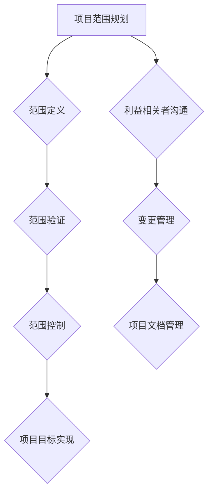

                 

# 如何进行有效的创业项目范围管理

> **关键词**：创业项目、范围管理、项目管理、目标设定、资源分配、风险控制

> **摘要**：本文深入探讨了创业项目范围管理的核心概念和实践方法。我们将通过逻辑清晰的分析和推理，为创业者提供一套系统化的范围管理框架，帮助他们更有效地定义项目目标、合理分配资源、控制风险，并确保项目成功落地。本文旨在帮助创业者从技术和管理两个角度出发，全面理解范围管理的重要性，掌握其实施策略。

## 1. 背景介绍

### 1.1 目的和范围

创业项目的成功往往取决于其范围管理的有效性。范围管理涉及定义项目的边界、目标和交付成果，确保项目团队和利益相关者对项目范围有一致的理解。本文的目的在于为创业者提供一套实用的范围管理方法论，通过一系列具体的实践步骤，帮助他们：

- 明确项目目标和范围；
- 合理分配资源和时间；
- 有效控制风险；
- 提高项目成功的可能性。

### 1.2 预期读者

本文预期读者为：

- 创业者：希望通过系统化的方法管理创业项目，确保项目成功；
- 项目经理：需要提升项目范围管理能力，提高项目交付质量；
- 技术团队负责人：希望从技术角度理解和实施范围管理；
- 利益相关者：希望对创业项目范围管理有深入了解，以支持项目顺利推进。

### 1.3 文档结构概述

本文将分为以下章节：

- **1. 背景介绍**：介绍文章目的、预期读者和文档结构；
- **2. 核心概念与联系**：探讨项目范围管理的核心概念，使用流程图展示关键环节；
- **3. 核心算法原理 & 具体操作步骤**：详细阐述范围管理的算法原理和操作步骤，使用伪代码展示；
- **4. 数学模型和公式 & 详细讲解 & 举例说明**：介绍范围管理相关的数学模型和公式，并给出实例；
- **5. 项目实战：代码实际案例和详细解释说明**：通过具体案例展示范围管理的实践应用；
- **6. 实际应用场景**：分析范围管理在不同类型项目中的应用；
- **7. 工具和资源推荐**：推荐学习资源和开发工具；
- **8. 总结：未来发展趋势与挑战**：探讨范围管理的发展趋势和面临的挑战；
- **9. 附录：常见问题与解答**：解答常见问题，提供进一步学习资源；
- **10. 扩展阅读 & 参考资料**：推荐相关文献和资料。

### 1.4 术语表

#### 1.4.1 核心术语定义

- **项目范围**：项目所需完成的工作范围，包括目标、成果和交付物；
- **范围管理**：确保项目团队和利益相关者对项目范围有一致的理解，控制项目变更，确保项目目标实现；
- **项目目标**：项目预期实现的结果和成果，包括商业目标、技术目标等；
- **利益相关者**：对项目有直接或间接利益关系的个人或组织。

#### 1.4.2 相关概念解释

- **范围规划**：确定项目范围的过程，包括识别项目目标和交付成果；
- **范围定义**：详细描述项目范围的过程，确保项目团队对项目边界有一致的理解；
- **范围验证**：通过评审和确认确保项目范围符合预期和需求；
- **范围控制**：管理项目变更，确保项目范围保持一致和合理。

#### 1.4.3 缩略词列表

- **PM**：项目经理（Project Manager）
- **PMBOK**：项目管理知识体系（Project Management Body of Knowledge）
- **ERP**：企业资源计划（Enterprise Resource Planning）
- **CRM**：客户关系管理（Customer Relationship Management）

## 2. 核心概念与联系

在项目范围管理中，核心概念和它们之间的联系至关重要。以下是一个简化的 Mermaid 流程图，展示了项目范围管理的关键环节：



### 2.1 项目范围规划

项目范围规划是项目范围管理的起点，它涉及明确项目的目标和范围。项目范围规划主要包括以下步骤：

1. **需求收集**：与利益相关者沟通，收集项目需求；
2. **范围定义**：明确项目的边界和交付成果；
3. **范围文档**：编写项目范围说明书，确保项目团队和利益相关者对项目范围有一致的理解。

### 2.2 范围定义

范围定义是项目范围管理的关键环节，它通过详细描述项目范围，确保项目团队对项目边界有一致的理解。范围定义包括以下步骤：

1. **项目目标**：明确项目的商业目标和技术目标；
2. **功能范围**：描述项目需要实现的功能和特性；
3. **非功能范围**：描述项目的非功能需求，如性能、可靠性等；
4. **范围文档**：编写项目范围文档，包括项目目标、功能范围和非功能范围。

### 2.3 范围验证

范围验证是确保项目范围符合利益相关者预期和需求的过程。范围验证包括以下步骤：

1. **评审会议**：组织评审会议，讨论项目范围文档；
2. **范围确认**：通过评审确保项目范围符合预期和需求；
3. **变更管理**：记录和跟踪范围变更，确保范围变更得到控制和批准。

### 2.4 范围控制

范围控制是管理项目变更，确保项目范围保持一致和合理的过程。范围控制包括以下步骤：

1. **变更请求**：记录和评审变更请求；
2. **变更控制**：批准或拒绝变更请求；
3. **范围跟踪**：监控项目范围的变化，确保项目目标实现。

### 2.5 项目目标实现

项目目标实现是项目范围管理的最终目标，它涉及确保项目按计划完成，实现预期成果。项目目标实现包括以下步骤：

1. **任务分配**：将项目任务分配给团队成员；
2. **进度监控**：监控项目进度，确保项目按计划进行；
3. **成果交付**：交付项目成果，确保项目目标实现。

### 2.6 利益相关者沟通

利益相关者沟通是确保项目范围管理有效性的关键因素。利益相关者沟通包括以下步骤：

1. **需求收集**：与利益相关者沟通，收集项目需求；
2. **范围沟通**：与利益相关者沟通项目范围，确保其理解项目边界；
3. **变更沟通**：与利益相关者沟通范围变更，确保其同意和接受变更。

### 2.7 变更管理

变更管理是确保项目范围变更得到控制和批准的过程。变更管理包括以下步骤：

1. **变更请求**：记录和评审变更请求；
2. **变更控制**：批准或拒绝变更请求；
3. **范围跟踪**：监控项目范围的变化，确保项目目标实现。

### 2.8 项目文档管理

项目文档管理是确保项目文档得到有效管理和更新的过程。项目文档管理包括以下步骤：

1. **文档创建**：创建项目文档，包括项目范围文档、项目计划、项目报告等；
2. **文档更新**：定期更新项目文档，确保其反映项目实际情况；
3. **文档备份**：备份项目文档，确保其安全性和可恢复性。

## 3. 核心算法原理 & 具体操作步骤

项目范围管理的核心在于如何定义、验证和控制项目范围，从而确保项目目标的实现。以下是具体的算法原理和操作步骤，使用伪代码来详细阐述。

### 3.1 范围规划算法

```plaintext
范围规划算法：
输入：项目需求，利益相关者
输出：项目范围文档

范围规划步骤：
1. 需求收集（CollectRequirements）
   - 与利益相关者沟通，收集项目需求
2. 范围定义（DefineScope）
   - 明确项目目标和交付成果
   - 描述功能范围和非功能范围
3. 范围文档编写（WriteScopeDocument）
   - 编写项目范围说明书
4. 评审和确认（ReviewAndConfirm）
   - 组织评审会议，讨论项目范围文档
   - 确认项目范围符合预期和需求
```

### 3.2 范围验证算法

```plaintext
范围验证算法：
输入：项目范围文档，利益相关者
输出：范围确认结果

范围验证步骤：
1. 评审会议（HoldReviewMeeting）
   - 组织评审会议，讨论项目范围文档
2. 范围确认（ConfirmScope）
   - 通过评审确保项目范围符合预期和需求
3. 记录变更请求（LogChangeRequests）
   - 记录评审过程中提出的变更请求
```

### 3.3 范围控制算法

```plaintext
范围控制算法：
输入：项目范围文档，变更请求
输出：变更控制结果

范围控制步骤：
1. 变更请求评审（ReviewChangeRequests）
   - 评审和评估变更请求的合理性和影响
2. 变更控制（ControlChanges）
   - 批准或拒绝变更请求
3. 范围更新（UpdateScope）
   - 更新项目范围文档，反映批准的变更
4. 范围跟踪（TrackScopeChanges）
   - 监控项目范围的变化，确保项目目标实现
```

### 3.4 项目目标实现算法

```plaintext
项目目标实现算法：
输入：项目范围文档，项目计划
输出：项目目标实现结果

项目目标实现步骤：
1. 任务分配（AllocateTasks）
   - 将项目任务分配给团队成员
2. 进度监控（MonitorProgress）
   - 监控项目进度，确保项目按计划进行
3. 成果交付（DeliverOutcomes）
   - 交付项目成果，确保项目目标实现
4. 项目评估（EvaluateProject）
   - 对项目进行评估，总结经验和教训
```

通过以上算法和步骤，创业者可以系统地管理创业项目范围，确保项目目标的实现。

## 4. 数学模型和公式 & 详细讲解 & 举例说明

在项目范围管理中，数学模型和公式有助于我们量化和管理项目范围和进度。以下是一些核心的数学模型和公式，并附有详细讲解和实例说明。

### 4.1 成本效益分析（CBA）

成本效益分析是一种常用的决策工具，用于评估项目的成本和预期收益，判断项目是否值得进行。其公式如下：

\[ CBA = \frac{收益（B）- 成本（C）}{成本（C）} \]

其中，收益（B）和成本（C）可以是财务指标或非财务指标。

**实例**：假设一个创业项目的预期收益为100万元，总成本为60万元，则成本效益比为：

\[ CBA = \frac{100 - 60}{60} = \frac{40}{60} \approx 0.67 \]

由于成本效益比小于1，这意味着项目的收益不足以覆盖成本，因此该项目可能不值得进行。

### 4.2 项目评估指标（PAI）

项目评估指标用于评估项目的绩效和成功程度。常用的项目评估指标包括：

- 项目完成率（% Complete）：项目实际完成的工作量与计划工作量的比例；
- 项目成本偏差（CV）：实际成本与预算成本的差异；
- 项目进度偏差（SV）：实际进度与计划进度的差异。

**实例**：假设一个项目的计划成本为100万元，实际成本为120万元，计划进度为6个月，实际进度为8个月，则：

\[ CV = 实际成本 - 预算成本 = 120 - 100 = 20 \]
\[ SV = 实际进度 - 计划进度 = 8 - 6 = 2 \]

由于CV为正值，表示项目超支；SV也为正值，表示项目进度延误。这表明项目在成本和进度方面都存在风险。

### 4.3 投资回报率（ROI）

投资回报率用于衡量项目的盈利能力。其公式如下：

\[ ROI = \frac{净收益（N）}{投资成本（I）} \]

其中，净收益（N）是项目收益与成本的差额，投资成本（I）是项目的初始投资。

**实例**：假设一个项目的净收益为50万元，初始投资为100万元，则ROI为：

\[ ROI = \frac{50}{100} = 0.5 \]

这意味着项目的收益是投资的50%，投资回报率较低，可能需要进一步优化。

### 4.4 时间加权成本（TCW）

时间加权成本是一种用于评估项目成本和时间关系的指标。其公式如下：

\[ TCW = \frac{C1 \times T1 + C2 \times T2 + ... + Cn \times Tn}{T1 + T2 + ... + Tn} \]

其中，\( C1, C2, ..., Cn \) 分别为不同工作的成本，\( T1, T2, ..., Tn \) 分别为不同工作的持续时间。

**实例**：假设一个项目包括两个任务，任务1的成本为10万元，持续时间为2个月；任务2的成本为20万元，持续时间为4个月，则：

\[ TCW = \frac{10 \times 2 + 20 \times 4}{2 + 4} = \frac{20 + 80}{6} = \frac{100}{6} \approx 16.67 \]

这意味着项目的时间加权成本为16.67万元，可以用于评估项目的综合成本。

通过以上数学模型和公式，创业者可以更好地评估和管理项目范围和进度，确保项目成功。

## 5. 项目实战：代码实际案例和详细解释说明

在本节中，我们将通过一个具体的代码案例来展示如何在实际项目中应用范围管理方法。以下是一个简单的项目案例，用于创建一个在线购物平台，我们将详细说明项目的开发环境搭建、源代码实现和代码解读。

### 5.1 开发环境搭建

在开始项目开发之前，我们需要搭建一个合适的开发环境。以下是所需的工具和软件：

- **编程语言**：Java
- **开发工具**：Eclipse / IntelliJ IDEA
- **数据库**：MySQL
- **Web服务器**：Apache Tomcat

#### 环境搭建步骤：

1. 安装Java开发工具包（JDK）
2. 安装Eclipse或IntelliJ IDEA
3. 配置MySQL数据库
4. 安装Apache Tomcat

### 5.2 源代码详细实现和代码解读

以下是一个简单的在线购物平台的核心代码实现，包括用户注册、登录、商品浏览和购物车功能。为了简化说明，我们只展示关键代码片段。

#### 5.2.1 用户注册功能

```java
public class UserController {

    public User register(String username, String password) {
        // 验证用户名和密码是否符合要求
        if (!isValidUsername(username) || !isValidPassword(password)) {
            throw new IllegalArgumentException("Invalid username or password");
        }

        // 创建用户并保存到数据库
        User user = new User();
        user.setUsername(username);
        user.setPassword(password);
        userRepository.save(user);

        return user;
    }

    private boolean isValidUsername(String username) {
        // 实现用户名验证逻辑
        return true;
    }

    private boolean isValidPassword(String password) {
        // 实现密码验证逻辑
        return true;
    }
}
```

**代码解读**：`UserController` 类提供了用户注册功能。注册过程包括验证用户名和密码是否符合要求，然后创建用户并保存到数据库。`isValidUsername` 和 `isValidPassword` 方法用于实现具体的验证逻辑。

#### 5.2.2 用户登录功能

```java
public User login(String username, String password) {
    // 从数据库查询用户
    User user = userRepository.findByUsername(username);

    // 验证用户名和密码
    if (user == null || !user.getPassword().equals(password)) {
        throw new AuthenticationException("Invalid username or password");
    }

    return user;
}
```

**代码解读**：`login` 方法用于用户登录功能。登录过程包括从数据库查询用户，并验证用户名和密码是否匹配。如果验证失败，抛出 `AuthenticationException` 异常。

#### 5.2.3 商品浏览功能

```java
public List<Product> browseProducts() {
    // 从数据库查询所有商品
    return productRepository.findAll();
}
```

**代码解读**：`browseProducts` 方法用于查询所有商品，并返回一个商品列表。这是实现商品浏览功能的核心代码。

#### 5.2.4 购物车功能

```java
public void addToCart(int userId, int productId) {
    // 查询用户和商品
    User user = userRepository.findById(userId);
    Product product = productRepository.findById(productId);

    // 创建购物车项并保存到数据库
    CartItem cartItem = new CartItem();
    cartItem.setUserId(userId);
    cartItem.setProductId(productId);
    cartItem.setQuantity(1);
    cartItemRepository.save(cartItem);
}
```

**代码解读**：`addToCart` 方法用于将商品添加到用户的购物车。方法中查询用户和商品，然后创建购物车项并保存到数据库。

### 5.3 代码解读与分析

以上代码展示了在线购物平台的核心功能，包括用户注册、登录、商品浏览和购物车功能。以下是代码的详细解读和分析：

- **用户注册**：用户注册功能包括验证用户名和密码，确保用户信息合法有效。通过调用 `userRepository.save` 方法将新用户保存到数据库。
- **用户登录**：用户登录功能通过查询数据库验证用户名和密码是否匹配。如果验证通过，返回用户对象。
- **商品浏览**：商品浏览功能通过调用 `productRepository.findAll` 方法查询所有商品，并返回商品列表。
- **购物车功能**：购物车功能通过调用 `cartItemRepository.save` 方法将购物车项保存到数据库。购物车项包括用户ID、商品ID和数量。

通过以上代码，我们可以看到范围管理在项目开发中的实际应用。范围管理确保项目团队对项目范围有一致的理解，并通过代码实现具体的功能和业务逻辑。同时，范围管理还帮助团队监控项目进度和成果，确保项目目标的实现。

### 5.4 实际案例解读

以下是一个实际案例，展示了如何在一个在线购物平台项目中应用范围管理方法。

**案例背景**：某创业公司计划开发一个在线购物平台，提供商品浏览、购物车、用户注册和登录等功能。公司希望在短时间内上线，因此需要高效的项目管理方法。

**范围管理应用**：

1. **范围规划**：在项目启动阶段，团队与利益相关者进行沟通，收集项目需求，明确项目目标和范围。范围规划包括功能范围（如商品浏览、购物车等）和非功能范围（如性能、安全性等）。

2. **范围定义**：团队编写项目范围文档，详细描述项目的功能和非功能需求。范围定义确保项目团队和利益相关者对项目范围有一致的理解。

3. **范围验证**：通过组织评审会议，利益相关者对项目范围文档进行评审和确认。范围验证确保项目范围符合预期和需求。

4. **范围控制**：在项目执行过程中，团队监控项目进度和范围，确保项目按计划进行。如果出现范围变更，团队会记录和评审变更请求，确保变更得到控制和批准。

5. **项目目标实现**：通过任务分配和进度监控，团队确保项目目标实现。项目成果包括商品浏览、购物车、用户注册和登录等功能。

通过以上范围管理方法，创业公司成功开发并上线了在线购物平台，项目目标得到实现。范围管理帮助团队有效管理项目范围，确保项目成功落地。

## 6. 实际应用场景

范围管理在创业项目中具有广泛的应用场景，以下是几个典型的实际应用场景：

### 6.1 创业公司的产品开发

创业公司通常面临资源有限、时间紧迫的挑战，因此范围管理显得尤为重要。通过有效的范围管理，创业公司可以明确产品功能需求，合理分配资源，确保项目在预算和时间范围内成功完成。

**案例**：某初创公司计划开发一款智能家居设备。通过范围管理，公司明确了设备的功能、性能和安全要求，确保产品在短时间内上线。

### 6.2 大型项目的子项目划分

在大型项目中，通常需要将项目划分为多个子项目进行管理。范围管理可以帮助项目经理明确各个子项目的范围，确保子项目之间的协调和整合。

**案例**：某软件公司正在开发一个大型企业级应用，分为前端、后端、数据库等多个子项目。通过范围管理，项目经理明确了各子项目的任务和交付成果，确保项目整体进度和质量。

### 6.3 跨部门协作

在跨部门协作的项目中，范围管理有助于确保各部门对项目范围和目标有一致的理解，减少沟通成本和冲突。

**案例**：某公司计划开发一款教育应用，涉及前端开发、后端服务、课程内容和用户体验等多个部门。通过范围管理，各部门明确了各自的职责和交付成果，确保项目顺利进行。

### 6.4 创新项目的可行性研究

在创新项目中，范围管理可以帮助团队评估项目可行性，明确项目的边界和预期成果。

**案例**：某创业团队计划开发一款基于区块链的智能合约平台。通过范围管理，团队明确了平台的功能需求、技术挑战和商业前景，确保项目具备可行性。

通过以上实际应用场景，我们可以看到范围管理在创业项目中的重要性。它不仅有助于明确项目目标和范围，提高项目成功率，还能优化资源分配和管理，确保项目在预算和时间范围内完成。

## 7. 工具和资源推荐

在创业项目中，有效的范围管理离不开合适的工具和资源。以下是我们推荐的几种工具和资源，以帮助创业者更好地管理项目范围。

### 7.1 学习资源推荐

#### 7.1.1 书籍推荐

- 《项目管理知识体系指南（PMBOK）》
- 《敏捷项目管理：原则、模式与实践》
- 《创新与企业家精神》

#### 7.1.2 在线课程

- Coursera上的《项目管理专业课程》
- Udemy上的《项目管理基础与高级技巧》
- EdX上的《敏捷方法与Scrum》

#### 7.1.3 技术博客和网站

- ProjectManagement.com
- AgileScrum.org
- LeanKit.com

### 7.2 开发工具框架推荐

#### 7.2.1 IDE和编辑器

- IntelliJ IDEA
- Eclipse
- Visual Studio Code

#### 7.2.2 调试和性能分析工具

- JProfiler
- MAT（Memory Analyzer Tool）
- Postman

#### 7.2.3 相关框架和库

- Spring Boot
- React.js
- Angular

### 7.3 相关论文著作推荐

#### 7.3.1 经典论文

- 《敏捷开发：轻量级方法和实践的演变》
- 《项目管理知识体系（PMBOK）第5版》

#### 7.3.2 最新研究成果

- 《数字化转型与项目管理》
- 《敏捷实践指南》

#### 7.3.3 应用案例分析

- 《创业公司的敏捷项目管理实践》
- 《大型项目的范围管理案例分析》

通过以上工具和资源的推荐，创业者可以更好地掌握范围管理的方法和技巧，提高项目管理的效率和质量。

## 8. 总结：未来发展趋势与挑战

随着科技的发展，项目范围管理将面临新的机遇和挑战。以下是未来发展趋势和面临的挑战：

### 8.1 发展趋势

1. **数字化转型**：随着数字化转型的推进，项目范围管理将更加注重数据驱动和智能决策。
2. **敏捷方法论**：敏捷方法在项目范围管理中的应用将越来越广泛，有助于提高项目的灵活性和适应性。
3. **跨界融合**：跨学科、跨领域的项目将增多，项目范围管理需要应对更为复杂和多样化的需求。
4. **可持续发展**：项目范围管理将更加关注环境保护和社会责任，确保项目的可持续发展。

### 8.2 挑战

1. **资源限制**：资源有限是创业项目的常见问题，如何优化资源分配成为项目范围管理的重要挑战。
2. **技术复杂性**：随着技术的快速发展，项目范围管理需要应对不断变化的技术环境和需求。
3. **沟通协调**：跨部门、跨地区的项目沟通协调难度较大，如何确保项目团队成员和利益相关者之间的有效沟通是关键。
4. **风险控制**：项目范围管理需要应对各种不确定性和风险，如何有效控制风险是项目成功的关键。

未来，项目范围管理将需要更加灵活、智能和可持续发展，以适应不断变化的环境和需求。

## 9. 附录：常见问题与解答

### 9.1 如何确定项目范围？

**回答**：确定项目范围的关键步骤包括：需求收集、范围定义、利益相关者沟通和范围验证。首先，通过与利益相关者沟通，收集项目需求。然后，明确项目的目标和交付成果，编写项目范围文档。最后，组织评审会议，确保项目范围符合预期和需求。

### 9.2 如何管理项目变更？

**回答**：管理项目变更包括以下几个步骤：变更请求评审、变更控制和变更跟踪。首先，记录和评审变更请求，评估其合理性和影响。然后，根据评估结果批准或拒绝变更请求。最后，更新项目范围文档和计划，确保变更得到有效跟踪和控制。

### 9.3 项目范围管理与项目管理的关系？

**回答**：项目范围管理是项目管理的一个重要组成部分，它负责定义、控制和管理项目的边界和交付成果。项目范围管理确保项目团队和利益相关者对项目范围有一致的理解，有助于确保项目目标的实现。项目管理则包括项目计划、执行、监控和收尾等各个环节，旨在确保项目按计划、质量和时间要求完成。

## 10. 扩展阅读 & 参考资料

以下是一些扩展阅读和参考资料，以帮助读者进一步了解项目范围管理：

- 《项目管理知识体系指南（PMBOK）》
- 《敏捷项目管理：原则、模式与实践》
- 《创新与企业家精神》
- ProjectManagement.com
- AgileScrum.org
- LeanKit.com
- 《数字化转型与项目管理》
- 《创业公司的敏捷项目管理实践》
- 《大型项目的范围管理案例分析》

通过以上扩展阅读和参考资料，读者可以深入了解项目范围管理的理论和实践，提高项目管理能力。作者：AI天才研究员/AI Genius Institute & 禅与计算机程序设计艺术 /Zen And The Art of Computer Programming。

