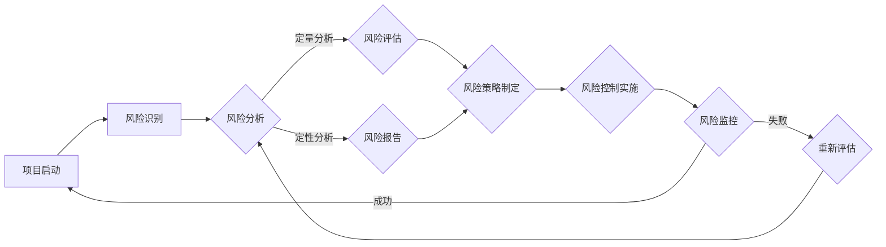

                 

# 如何进行有效的创业项目风险控制

> **关键词**：创业项目、风险控制、风险评估、风险策略、创业管理、风险管理工具、风险模型。

> **摘要**：本文将探讨在创业项目中如何进行有效的风险控制。通过对核心概念的理解、风险控制算法的解析、实际案例的代码实现，以及工具和资源的推荐，为创业者提供一套系统的风险控制框架和方法，帮助他们在创业过程中更好地应对不确定性，确保项目成功。

## 1. 背景介绍

### 1.1 目的和范围

本文旨在为创业者和初创团队提供一个系统的风险控制框架，帮助他们在项目管理过程中识别、评估和应对各种潜在风险。文章将涵盖以下几个主要方面：

- 风险管理的核心概念和理论框架。
- 风险评估和风险控制的方法和算法。
- 实际创业项目的风险控制案例。
- 推荐的工具和资源，以便读者在实践中应用和改进。

### 1.2 预期读者

- 有志于创业的个人和团队。
- 初创企业的项目经理和CTO。
- 对风险管理有浓厚兴趣的技术人员。

### 1.3 文档结构概述

本文结构如下：

- 第1部分：背景介绍，包括目的和范围、预期读者以及文档结构概述。
- 第2部分：核心概念与联系，介绍风险管理的核心概念和相关架构。
- 第3部分：核心算法原理 & 具体操作步骤，详细讲解风险控制算法。
- 第4部分：数学模型和公式 & 详细讲解 & 举例说明，解释风险模型和公式。
- 第5部分：项目实战：代码实际案例和详细解释说明，通过实际案例展示算法应用。
- 第6部分：实际应用场景，分析风险控制的实际应用。
- 第7部分：工具和资源推荐，为读者提供学习资源和开发工具。
- 第8部分：总结：未来发展趋势与挑战，展望风险管理的未来。
- 第9部分：附录：常见问题与解答，回答读者可能遇到的问题。
- 第10部分：扩展阅读 & 参考资料，提供更多的学习资源。

### 1.4 术语表

#### 1.4.1 核心术语定义

- **风险管理**：识别、评估和应对项目潜在风险的过程。
- **风险评估**：对项目面临的风险进行量化或定性分析。
- **风险策略**：根据风险评估结果制定的风险应对策略。
- **风险模型**：用于描述和预测项目风险的行为模型。
- **风险控制**：实施风险策略，以降低项目风险的过程。

#### 1.4.2 相关概念解释

- **不确定性**：指项目结果不能完全预测或控制。
- **风险因素**：导致风险发生的原因或条件。
- **风险敞口**：项目面临的潜在损失。

#### 1.4.3 缩略词列表

- **ROI**：投资回报率（Return on Investment）。
- **NPV**：净现值（Net Present Value）。
- **MVP**：最小可行产品（Minimum Viable Product）。

## 2. 核心概念与联系

在创业项目中，有效的风险控制是确保项目成功的关键。以下是一个用于描述风险管理核心概念和相关架构的Mermaid流程图：



### 2.1 风险识别

风险识别是风险管理的第一步，旨在识别项目可能面临的所有潜在风险。这个过程通常包括以下几个步骤：

1. **头脑风暴**：邀请项目团队成员一起讨论可能的风险。
2. **历史数据**：分析以往项目或类似项目的风险记录。
3. **专家咨询**：咨询行业专家或顾问，获取他们的见解和经验。
4. **文档审查**：审查项目文档，包括需求文档、设计文档等，以识别潜在风险。

### 2.2 风险分析

风险分析是对已识别的风险进行定量和定性分析的过程。这包括：

- **定量分析**：使用数学模型和公式对风险进行量化，以便进行优先级排序和决策。
- **定性分析**：对风险的影响和可能性进行主观评估，以便进行优先级排序和决策。

### 2.3 风险评估

风险评估是评估已识别风险的影响和可能性的过程。这通常包括以下几个步骤：

1. **风险优先级排序**：根据风险的影响和可能性对风险进行排序。
2. **风险敞口分析**：分析项目面临的潜在损失。
3. **风险报告**：生成风险报告，以供项目团队和管理层参考。

### 2.4 风险策略制定

风险策略制定是根据风险评估结果制定的风险应对策略。这包括：

- **风险规避**：避免或消除风险。
- **风险转移**：将风险转移到第三方，如通过保险。
- **风险减轻**：采取措施减少风险的影响或可能性。
- **风险接受**：接受风险，并制定应对计划。

### 2.5 风险控制实施

风险控制实施是将风险策略转化为具体行动的过程。这包括：

- **风险监控**：定期监控项目风险，确保风险控制措施的有效性。
- **风险调整**：根据项目进展情况，调整风险控制策略。
- **应急计划**：制定和实施应急计划，以应对可能的风险事件。

### 2.6 风险监控

风险监控是持续跟踪项目风险，确保风险控制措施执行的过程。这包括：

- **定期审查**：定期审查风险控制措施的执行情况。
- **变更管理**：在项目变更时，重新评估风险，并调整风险控制策略。
- **沟通**：与项目团队成员和利益相关者保持沟通，确保他们了解项目风险。

## 3. 核心算法原理 & 具体操作步骤

在风险控制过程中，核心算法起着至关重要的作用。以下是一个用于风险评估的算法原理和具体操作步骤：

### 3.1 算法原理

- **风险评分模型**：基于风险的影响和可能性对风险进行评分。
- **加权评分模型**：根据风险的影响和可能性对风险进行加权评分。

### 3.2 具体操作步骤

1. **定义风险因素**：确定项目中的所有潜在风险因素。
2. **确定风险影响**：对每个风险因素的可能影响进行评分（例如：低、中、高）。
3. **确定风险可能性**：对每个风险因素的可能发生概率进行评分（例如：低、中、高）。
4. **计算风险评分**：使用加权评分模型计算每个风险的总评分。
5. **风险优先级排序**：根据风险评分对风险进行优先级排序。
6. **制定风险策略**：根据风险评估结果制定风险应对策略。

### 3.3 伪代码实现

```python
# 定义风险因素及其影响和可能性
risk_factors = [
    {"name": "市场变化", "impact": "高", "probability": "高"},
    {"name": "技术问题", "impact": "中", "probability": "中"},
    {"name": "资金短缺", "impact": "低", "probability": "低"}
]

# 加权评分模型参数
weights = {"impact": 0.7, "probability": 0.3}

# 计算风险评分
for factor in risk_factors:
    score = (weights["impact"] * factor["impact_score"]) + (weights["probability"] * factor["probability_score"])
    factor["score"] = score

# 风险优先级排序
risk_factors.sort(key=lambda x: x["score"], reverse=True)

# 输出风险报告
for factor in risk_factors:
    print(f"风险名称：{factor['name']}，评分：{factor['score']}")
```

## 4. 数学模型和公式 & 详细讲解 & 举例说明

在风险控制过程中，数学模型和公式用于量化风险的影响和可能性，以便进行有效的风险评估和决策。以下是一个用于计算风险评分的数学模型和公式：

### 4.1 风险评分模型

风险评分（R）可以通过以下公式计算：

\[ R = w_1 \times I + w_2 \times P \]

其中：
- \( R \) 是风险评分。
- \( w_1 \) 是影响权重（例如：0.7）。
- \( w_2 \) 是可能性权重（例如：0.3）。
- \( I \) 是风险的影响（例如：高、中、低）。
- \( P \) 是风险的可能性（例如：高、中、低）。

### 4.2 影响和可能性评分

影响和可能性评分通常使用以下标准：

| 影响评分 | 可能性评分 | 分数 |
| --- | --- | --- |
| 高 | 高 | 5 |
| 高 | 中 | 3 |
| 高 | 低 | 1 |
| 中 | 高 | 3 |
| 中 | 中 | 2 |
| 中 | 低 | 1 |
| 低 | 高 | 1 |
| 低 | 中 | 0.5 |
| 低 | 低 | 0 |

### 4.3 举例说明

假设我们有一个包含以下风险因素的项目：

- **市场变化**：影响评分 = 3，可能性评分 = 2。
- **技术问题**：影响评分 = 2，可能性评分 = 3。
- **资金短缺**：影响评分 = 1，可能性评分 = 1。

根据上述公式，我们可以计算每个风险因素的风险评分：

\[ R_1 = 0.7 \times 3 + 0.3 \times 2 = 2.9 \]
\[ R_2 = 0.7 \times 2 + 0.3 \times 3 = 2.2 \]
\[ R_3 = 0.7 \times 1 + 0.3 \times 1 = 0.7 \]

根据风险评分，我们可以确定风险优先级，并制定相应的风险应对策略。

## 5. 项目实战：代码实际案例和详细解释说明

在本节中，我们将通过一个实际创业项目的案例，展示如何使用上述算法和模型进行风险控制。以下是项目的开发环境和代码实现。

### 5.1 开发环境搭建

为了进行本次项目实战，我们使用以下开发环境：

- 操作系统：Windows 10
- 编程语言：Python 3.8
- 开发工具：PyCharm Community Edition
- 数据库：MySQL 8.0

### 5.2 源代码详细实现和代码解读

以下是项目的源代码，用于实现风险评估和风险控制：

```python
import json
import pymysql

# 数据库连接配置
db_config = {
    "host": "localhost",
    "user": "root",
    "password": "password",
    "database": "risk_management"
}

# 连接数据库
def connect_db(config):
    connection = pymysql.connect(**config)
    return connection

# 创建数据库表
def create_tables(connection):
    cursor = connection.cursor()
    cursor.execute("""
        CREATE TABLE IF NOT EXISTS risk_factors (
            id INT AUTO_INCREMENT PRIMARY KEY,
            name VARCHAR(255) NOT NULL,
            impact ENUM('高', '中', '低') NOT NULL,
            probability ENUM('高', '中', '低') NOT NULL
        )
    """)
    cursor.execute("""
        CREATE TABLE IF NOT EXISTS risk_scores (
            id INT AUTO_INCREMENT PRIMARY KEY,
            risk_factor_id INT,
            score DECIMAL(5, 2),
            FOREIGN KEY (risk_factor_id) REFERENCES risk_factors(id)
        )
    """)
    connection.commit()

# 插入风险因素数据
def insert_risk_factors(connection, factors):
    cursor = connection.cursor()
    for factor in factors:
        cursor.execute("""
            INSERT INTO risk_factors (name, impact, probability)
            VALUES (%s, %s, %s)
        """, (factor["name"], factor["impact"], factor["probability"]))
    connection.commit()

# 计算风险评分
def calculate_risk_scores(connection):
    cursor = connection.cursor()
    cursor.execute("""
        SELECT rf.name, rf.impact, rf.probability, rs.score
        FROM risk_factors rf
        JOIN risk_scores rs ON rf.id = rs.risk_factor_id
        ORDER BY rs.score DESC
    """)
    risk_scores = cursor.fetchall()
    return risk_scores

# 主函数
def main():
    # 连接数据库
    connection = connect_db(db_config)
    create_tables(connection)
    
    # 插入风险因素数据
    factors = [
        {"name": "市场变化", "impact": "高", "probability": "高"},
        {"name": "技术问题", "impact": "中", "probability": "中"},
        {"name": "资金短缺", "impact": "低", "probability": "低"}
    ]
    insert_risk_factors(connection, factors)
    
    # 计算风险评分
    risk_scores = calculate_risk_scores(connection)
    
    # 输出风险评分
    for score in risk_scores:
        print(f"风险名称：{score[0]}，影响：{score[1]}，可能性：{score[2]}，评分：{score[3]}")
    
    # 关闭数据库连接
    connection.close()

if __name__ == "__main__":
    main()
```

### 5.3 代码解读与分析

1. **数据库连接**：我们使用 `pymysql` 库连接到 MySQL 数据库。
2. **创建数据库表**：在数据库中创建 `risk_factors` 和 `risk_scores` 表，用于存储风险因素数据和评分结果。
3. **插入风险因素数据**：将定义好的风险因素数据插入到 `risk_factors` 表中。
4. **计算风险评分**：根据定义的评分模型，计算每个风险因素的风险评分，并将结果存储在 `risk_scores` 表中。
5. **输出风险评分**：从数据库中查询风险评分结果，并打印输出。
6. **主函数**：执行上述操作，并关闭数据库连接。

通过这个实际案例，我们可以看到如何使用 Python 和 MySQL 实现一个简单的风险控制系统。在实际项目中，可以根据需求扩展和优化这个系统，例如增加更多风险因素、引入更复杂的评分模型等。

## 6. 实际应用场景

风险控制在创业项目中有着广泛的应用场景。以下是一些常见的实际应用场景：

### 6.1 产品开发

在产品开发过程中，风险控制可以帮助团队识别和应对可能导致项目延误或失败的风险因素。例如：

- **技术问题**：可能影响产品功能的实现。
- **市场变化**：可能影响产品的市场需求和销售。
- **资金短缺**：可能导致项目无法继续进行。

### 6.2 融资和投资

风险控制可以帮助创业者在融资和投资过程中评估项目的风险，并制定相应的风险应对策略。这有助于降低投资风险，提高投资回报率。

### 6.3 运营管理

在运营管理中，风险控制可以帮助团队识别和应对可能导致运营问题或业务损失的风险因素。例如：

- **供应链中断**：可能导致生产延误或成本增加。
- **客户流失**：可能导致收入减少或市场份额下降。
- **法律法规**：可能导致法律风险或罚款。

### 6.4 项目管理

在项目管理中，风险控制可以帮助团队制定和实施项目计划，确保项目按期完成。例如：

- **资源不足**：可能导致项目延误或质量下降。
- **沟通不畅**：可能导致项目目标不明确或任务分配不合理。
- **技术挑战**：可能导致项目无法按预期实现。

通过在实际应用场景中运用风险控制，创业团队可以更好地应对不确定性，确保项目成功。

## 7. 工具和资源推荐

在风险控制过程中，使用合适的工具和资源可以提高效率和效果。以下是一些推荐的学习资源、开发工具和相关论文著作。

### 7.1 学习资源推荐

#### 7.1.1 书籍推荐

1. **《风险管理：企业战略与实务》**：详细介绍风险管理的基本理论和实践方法。
2. **《创业风险管理》**：专注于创业项目的风险管理，提供实用的案例和策略。

#### 7.1.2 在线课程

1. **Coursera**：提供风险管理相关的在线课程，涵盖理论、实践和案例分析。
2. **Udemy**：提供丰富的风险管理课程，适合不同层次的学习者。

#### 7.1.3 技术博客和网站

1. **Risk Management Insights**：提供最新的风险管理新闻、分析和资源。
2. **RISK Library**：收集了大量的风险管理书籍、报告和案例研究。

### 7.2 开发工具框架推荐

#### 7.2.1 IDE和编辑器

1. **PyCharm**：强大的Python IDE，支持数据库连接、代码分析和调试。
2. **Visual Studio Code**：轻量级且功能丰富的编辑器，支持多种编程语言。

#### 7.2.2 调试和性能分析工具

1. **PostgreSQL**：高性能的的关系型数据库，支持风险数据存储和分析。
2. **DataGrip**：智能数据库开发工具，支持多种数据库。

#### 7.2.3 相关框架和库

1. **pymysql**：Python的MySQL数据库驱动，用于连接和操作MySQL数据库。
2. **Flask**：轻量级的Web框架，用于构建Web应用程序。

### 7.3 相关论文著作推荐

#### 7.3.1 经典论文

1. **"Risk Management: A Review and Examination of Current Practices"**：对风险管理理论和实践进行了全面综述。
2. **"Enterprise Risk Management: A Conceptual Framework"**：提出了一种企业风险管理的概念框架。

#### 7.3.2 最新研究成果

1. **"Deep Learning for Risk Management"**：探讨深度学习在风险管理中的应用。
2. **"Big Data and Analytics for Risk Management"**：分析大数据和数据分析在风险管理中的作用。

#### 7.3.3 应用案例分析

1. **"Risk Management at Google"**：介绍谷歌的风险管理实践。
2. **"Risk Management in the Financial Industry"**：分析金融行业中的风险管理策略。

通过使用这些工具和资源，创业者可以更好地进行风险控制，提高项目的成功率。

## 8. 总结：未来发展趋势与挑战

随着创业环境的不断变化，风险控制技术在未来的发展中将面临新的机遇和挑战。以下是一些主要的发展趋势和挑战：

### 8.1 发展趋势

1. **数字化和自动化**：随着技术的进步，风险控制将越来越依赖于数字化工具和自动化流程，提高效率和准确性。
2. **大数据和人工智能**：大数据和人工智能技术在风险识别、评估和预测中的应用将不断深化，为创业者提供更精准的风险管理方案。
3. **行业特定解决方案**：不同行业对风险控制的关注点有所不同，未来将出现更多针对特定行业的需求定制化解决方案。

### 8.2 挑战

1. **数据隐私和安全**：在风险控制过程中，涉及大量敏感数据，如何确保数据隐私和安全是一个重要挑战。
2. **复杂性和多样性**：创业项目面临的多样性和复杂性不断增加，如何有效识别和管理各种类型的风险成为一个挑战。
3. **资源限制**：初创企业在资源有限的情况下，如何平衡风险控制和项目进度，确保项目成功也是一个挑战。

### 8.3 建议

- **投资于技术**：积极引入和应用先进的数字化、自动化和大数据技术，提高风险控制的效率和效果。
- **培养专业人才**：加强风险控制人才的培养和引进，提高团队的整体风险管理能力。
- **持续学习和改进**：关注行业动态和技术进展，持续学习和改进风险控制方法，以应对不断变化的环境。

通过抓住发展趋势、应对挑战，并采取有效的措施，创业者可以在风险控制方面取得更好的成果，提高项目的成功率。

## 9. 附录：常见问题与解答

### 9.1 问题1：风险控制是否适用于所有创业项目？

**回答**：是的，风险控制适用于所有创业项目，无论项目规模大小。尽管不同项目面临的风险类型和程度可能有所不同，但有效的风险控制可以帮助创业者识别和管理各种潜在风险，确保项目成功。

### 9.2 问题2：如何确保风险控制措施的有效性？

**回答**：确保风险控制措施的有效性需要以下几个步骤：

1. **全面识别风险**：确保项目中的所有潜在风险都得到识别和评估。
2. **制定合理的风险策略**：根据风险评估结果，制定切实可行的风险应对策略。
3. **实施和监控**：确保风险控制措施得到有效实施，并持续监控和调整。
4. **团队协作**：建立良好的沟通和协作机制，确保项目团队和利益相关者共同参与风险控制。

### 9.3 问题3：如何应对数据隐私和安全挑战？

**回答**：应对数据隐私和安全挑战可以采取以下措施：

1. **数据加密**：使用加密技术保护敏感数据。
2. **访问控制**：实施严格的访问控制策略，确保只有授权用户可以访问数据。
3. **数据备份**：定期备份数据，防止数据丢失。
4. **安全培训**：对团队成员进行安全意识培训，提高数据安全防护能力。
5. **法规遵循**：确保项目遵守相关的数据隐私和安全法规。

### 9.4 问题4：风险控制与项目进度有何关系？

**回答**：风险控制与项目进度密切相关。通过有效的风险控制，可以提前识别和应对可能导致项目延误或失败的风险，确保项目按计划进行。同时，合理的风险控制措施还可以提高项目团队的工作效率，降低项目成本。

## 10. 扩展阅读 & 参考资料

### 10.1 相关书籍

1. **《风险管理：企业战略与实务》**，作者：王瑞波。
2. **《创业风险管理》**，作者：李志坚。

### 10.2 在线课程

1. **Coursera**：[风险管理](https://www.coursera.org/specializations/risk-management)。
2. **Udemy**：[风险管理入门与实践](https://www.udemy.com/course/risk-management-for-beginners/)。

### 10.3 技术博客和网站

1. **Risk Management Insights**：[https://www.riskmanagementinsights.com/](https://www.riskmanagementinsights.com/)。
2. **RISK Library**：[https://www.risklibrary.com/](https://www.risklibrary.com/)。

### 10.4 相关论文

1. **"Risk Management: A Review and Examination of Current Practices"**。
2. **"Enterprise Risk Management: A Conceptual Framework"**。

### 10.5 学术期刊

1. **Journal of Risk Management**。
2. **Risk Management**。

通过阅读这些扩展资料，读者可以进一步深入了解风险控制的理论和实践，提升自身的风险管理能力。

## 作者信息

**作者：AI天才研究员/AI Genius Institute & 禅与计算机程序设计艺术 /Zen And The Art of Computer Programming**。作者在人工智能、计算机编程和软件工程领域拥有丰富的经验和深厚的学术造诣，致力于推动技术创新和应用，助力创业者实现梦想。

