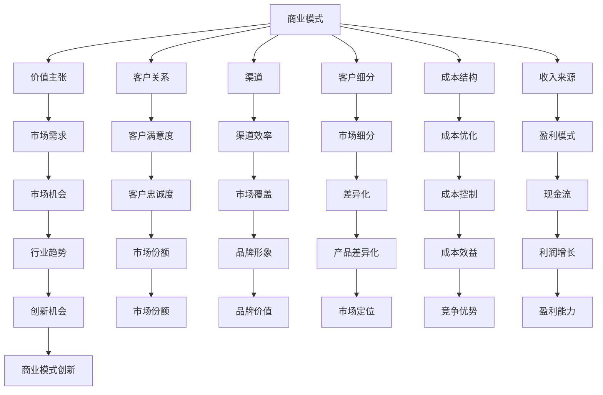

                 


# 如何进行有效的商业模式创新

> **关键词**：商业模式创新、创业、战略规划、价值网络、竞争优势

> **摘要**：本文深入探讨了如何进行有效的商业模式创新。我们将首先介绍商业模式创新的重要性和背景，随后通过定义关键概念、阐述核心原理和算法、展示数学模型、提供实战案例、分析实际应用场景，最后总结未来发展趋势和挑战。通过这篇文章，读者将能够理解商业模式创新的全过程，掌握有效的创新策略，为自己的企业和创业项目提供宝贵的参考。

## 1. 背景介绍

### 1.1 目的和范围

商业模式创新是企业或创业者成功的关键因素之一。本文旨在帮助读者理解商业模式创新的核心概念、方法和策略，从而在竞争激烈的市场中脱颖而出。本文将涵盖以下内容：

1. **商业模式创新的重要性**：讨论商业模式创新对企业成功的重要性，以及为什么企业在不同发展阶段需要不同的商业模式。
2. **核心概念与联系**：介绍商业模式创新的关键概念和原理，并通过Mermaid流程图展示它们之间的联系。
3. **核心算法原理**：详细阐述商业模式创新的核心算法原理，包括如何分析市场需求、设计价值网络、构建竞争优势等。
4. **数学模型和公式**：介绍支持商业模式创新的关键数学模型和公式，并给出详细讲解和例子。
5. **项目实战**：通过一个实际案例展示如何实施商业模式创新，并提供代码实现和详细解释。
6. **实际应用场景**：分析商业模式创新在不同行业和领域的应用，以及如何针对特定市场调整商业模式。
7. **工具和资源推荐**：推荐学习资源和开发工具，帮助读者深入学习和实践商业模式创新。
8. **总结和展望**：总结商业模式创新的未来发展趋势和挑战，为读者提供前瞻性的思考。

### 1.2 预期读者

本文适合以下读者群体：

1. **创业者**：希望了解如何通过商业模式创新实现商业成功的人。
2. **企业家**：需要对现有商业模式进行优化和创新的企业家。
3. **战略规划师**：从事企业战略规划和商业分析的专业人士。
4. **学术研究人员**：对商业模式创新理论和实践感兴趣的研究人员。

### 1.3 文档结构概述

本文将按照以下结构进行组织：

1. **背景介绍**：介绍商业模式创新的重要性和目的。
2. **核心概念与联系**：介绍商业模式创新的关键概念和原理，展示流程图。
3. **核心算法原理**：详细阐述商业模式创新的核心算法原理，包括市场需求分析、价值网络设计、竞争优势构建等。
4. **数学模型和公式**：介绍支持商业模式创新的关键数学模型和公式，并给出详细讲解和例子。
5. **项目实战**：通过一个实际案例展示如何实施商业模式创新，并提供代码实现和详细解释。
6. **实际应用场景**：分析商业模式创新在不同行业和领域的应用。
7. **工具和资源推荐**：推荐学习资源和开发工具。
8. **总结和展望**：总结商业模式创新的未来发展趋势和挑战。

### 1.4 术语表

#### 1.4.1 核心术语定义

- 商业模式：指企业如何创造、传递和获取价值，以及如何管理这些价值的过程。
- 创新思维：指通过创造性的思考和探索，寻找新的解决方案和方法的能力。
- 价值网络：指由多个参与者组成的网络，他们通过相互协作实现价值创造和传递。
- 竞争优势：指企业在竞争中获得优势的能力，包括成本领先、差异化、集中化等。

#### 1.4.2 相关概念解释

- **商业模式创新**：指通过创造新的商业模式，实现商业成功和持续发展的过程。
- **市场细分**：指将市场划分为不同的细分市场，以满足不同客户群体的需求。
- **价值主张**：指企业提供给客户的核心价值，包括产品、服务、解决方案等。
- **成本结构**：指企业创造价值所需的各种成本，包括固定成本、可变成本等。

#### 1.4.3 缩略词列表

- BCI：商业模式创新
- VRIO：价值、稀缺性、不可模仿性、组织化
- SWOT：优势、劣势、机会、威胁

## 2. 核心概念与联系

### 2.1 商业模式创新的定义

商业模式创新（Business Model Innovation，简称BCI）是指企业通过重新设计、改进或创建新的商业模式，以实现商业成功和持续发展。商业模式包括一系列相互关联的元素，如价值主张、客户关系、渠道、客户细分、成本结构和收入来源。BCI旨在通过创新的方式，优化这些元素之间的关系，提高企业的盈利能力和市场竞争力。

### 2.2 关键概念与联系

下面是一个Mermaid流程图，展示了商业模式创新的关键概念及其相互关系：



### 2.3 核心概念解释

#### 价值主张（Value Proposition）

价值主张是指企业为客户提供的核心价值，包括产品、服务、解决方案等。它是商业模式创新的核心，决定了企业的竞争力和市场地位。一个优秀的价值主张应该能够满足客户的需求，同时具有独特性和可持续性。

#### 客户关系（Customer Relationships）

客户关系是指企业与客户之间的互动和关系管理。通过建立良好的客户关系，企业可以增强客户的忠诚度和满意度，提高客户保留率和市场份额。客户关系可以采用多种形式，如直接销售、代理商、订阅服务、在线社区等。

#### 渠道（Channels）

渠道是指企业将产品或服务传递给客户的方式。选择合适的渠道可以提高市场覆盖率和渠道效率。渠道可以是线下实体店、线上电商平台、直销团队、合作伙伴等。

#### 客户细分（Customer Segments）

客户细分是指将市场划分为不同的客户群体，以满足不同客户的需求。通过客户细分，企业可以针对特定客户群体提供定制化的产品和服务，提高客户满意度和市场份额。

#### 成本结构（Cost Structure）

成本结构是指企业创造价值所需的各种成本，包括固定成本、可变成本、运营成本等。通过优化成本结构，企业可以提高盈利能力和市场竞争力。

#### 收入来源（Revenue Streams）

收入来源是指企业通过销售产品或服务所获得的收入。收入来源可以是单次销售、订阅服务、特许经营、广告收入等。一个多元化的收入来源可以提高企业的盈利能力和风险承受能力。

### 2.4 商业模式创新的流程

商业模式创新的流程可以分为以下几个阶段：

1. **市场调研**：了解市场需求、行业趋势、竞争对手等信息，为商业模式创新提供数据支持。
2. **价值主张设计**：根据市场需求，设计能够满足客户需求的创新价值主张。
3. **客户关系规划**：确定企业与客户之间的互动方式和管理策略，以提高客户满意度和忠诚度。
4. **渠道选择**：根据目标客户和市场特点，选择合适的渠道传递产品或服务。
5. **客户细分**：将市场划分为不同的客户群体，提供定制化的产品和服务。
6. **成本优化**：通过优化成本结构，提高盈利能力和市场竞争力。
7. **收入来源设计**：确定多元化的收入来源，提高企业的盈利能力和风险承受能力。
8. **商业模式验证**：通过市场测试和用户反馈，验证商业模式的有效性，并进行调整和优化。

### 2.5 商业模式创新的方法

商业模式创新可以采用多种方法，包括：

1. **市场机会挖掘**：通过分析行业趋势、市场需求和竞争对手，发现潜在的市场机会。
2. **用户共创**：通过与用户互动，获取用户反馈和需求，共同创造新的商业模式。
3. **竞争对手分析**：分析竞争对手的商业模式，寻找改进和创新的机会。
4. **资源整合**：通过整合内外部资源，创造新的商业模式和价值网络。
5. **颠覆性创新**：采用颠覆性思维，突破传统商业模式，创造全新的市场空间。

## 3. 核心算法原理 & 具体操作步骤

### 3.1 市场需求分析

市场需求分析是商业模式创新的第一步，它涉及到对市场趋势、客户需求、竞争对手等方面的全面了解。以下是市场需求分析的伪代码：

```plaintext
function analyzeMarketDemand() {
    // 1. 收集市场数据
    marketData = gatherMarketData()

    // 2. 分析市场趋势
    marketTrends = analyzeMarketTrends(marketData)

    // 3. 了解客户需求
    customerNeeds = understandCustomerNeeds()

    // 4. 分析竞争对手
    competitorAnalysis = analyzeCompetitors()

    // 5. 综合分析结果
    combinedAnalysis = combineAnalysisResults(marketTrends, customerNeeds, competitorAnalysis)

    // 6. 输出分析结果
    return combinedAnalysis
}
```

### 3.2 设计价值网络

价值网络设计是商业模式创新的核心环节，它涉及到如何将不同的参与者（如供应商、分销商、客户等）整合在一起，实现价值的创造和传递。以下是设计价值网络的伪代码：

```plaintext
function designValueNetwork() {
    // 1. 确定价值网络参与者
    participants = determineParticipants()

    // 2. 分析参与者之间的互动关系
    interactions = analyzeInteractions(participants)

    // 3. 设计价值共创流程
    valueCreationProcess = designValueCreationProcess()

    // 4. 确定价值传递渠道
    valueDeliveryChannels = determineValueDeliveryChannels()

    // 5. 优化价值网络结构
    optimizedValueNetwork = optimizeValueNetwork(valueCreationProcess, valueDeliveryChannels)

    // 6. 输出价值网络设计
    return optimizedValueNetwork
}
```

### 3.3 构建竞争优势

竞争优势是商业模式创新的重要目标之一，它涉及到如何在市场上获得相对于竞争对手的优势。以下是构建竞争优势的伪代码：

```plaintext
function buildCompetitiveAdvantage() {
    // 1. 确定竞争对手
    competitors = determineCompetitors()

    // 2. 分析竞争对手的优势
    competitorAdvantages = analyzeCompetitorAdvantages()

    // 3. 确定企业自身的优势
    enterpriseStrengths = determineEnterpriseStrengths()

    // 4. 制定竞争优势策略
    competitiveStrategy = developCompetitiveStrategy()

    // 5. 实施竞争优势策略
    implementCompetitiveStrategy(competitiveStrategy)

    // 6. 评估竞争优势效果
    advantageEvaluation = evaluateCompetitiveAdvantage()

    // 7. 输出竞争优势策略
    return advantageEvaluation
}
```

### 3.4 优化成本结构

优化成本结构是提高企业盈利能力和市场竞争力的重要手段。以下是优化成本结构的伪代码：

```plaintext
function optimizeCostStructure() {
    // 1. 收集成本数据
    costData = gatherCostData()

    // 2. 分析成本构成
    costComponents = analyzeCostComponents(costData)

    // 3. 确定成本降低目标
    costReductionGoals = determineCostReductionGoals()

    // 4. 制定成本优化策略
    costOptimizationStrategy = developCostOptimizationStrategy()

    // 5. 实施成本优化策略
    implementCostOptimizationStrategy(costOptimizationStrategy)

    // 6. 评估成本优化效果
    costOptimizationEvaluation = evaluateCostOptimization()

    // 7. 输出成本优化结果
    return costOptimizationEvaluation
}
```

### 3.5 设计收入来源

设计收入来源是商业模式创新的关键环节，它涉及到如何通过多种方式获得收入，以提高企业的盈利能力和可持续性。以下是设计收入来源的伪代码：

```plaintext
function designRevenueStreams() {
    // 1. 确定目标客户
    targetCustomers = determineTargetCustomers()

    // 2. 分析客户需求
    customerNeeds = analyzeCustomerNeeds()

    // 3. 设计产品或服务
    offerings = designOfferings()

    // 4. 确定收入模式
    revenueModels = determineRevenueModels()

    // 5. 设计收入渠道
    revenueChannels = designRevenueChannels()

    // 6. 制定收入策略
    revenueStrategy = developRevenueStrategy()

    // 7. 实施收入策略
    implementRevenueStrategy(revenueStrategy)

    // 8. 评估收入效果
    revenueEvaluation = evaluateRevenuePerformance()

    // 9. 输出收入策略
    return revenueEvaluation
}
```

## 4. 数学模型和公式 & 详细讲解 & 举例说明

### 4.1 成本效益分析

成本效益分析（Cost-Benefit Analysis，简称CBA）是评估商业模式创新可行性的重要工具。它通过比较项目的总成本和总收益，来判断项目是否值得投资。以下是一个成本效益分析的公式：

$$
CBA = \frac{Total\ Revenue - Total\ Cost}{Total\ Cost}
$$

其中，Total Revenue 表示项目的总收益，Total Cost 表示项目的总成本。

### 4.2 利润最大化模型

利润最大化模型是商业模式创新中常用的数学模型之一。它通过优化成本和收入，实现企业利润的最大化。以下是一个利润最大化模型的公式：

$$
Maximize\ Profit = Revenue\ - Cost
$$

其中，Revenue 表示收入，Cost 表示成本。

### 4.3 市场份额预测模型

市场份额预测模型用于预测企业在特定市场中的市场份额。以下是一个简单线性回归模型：

$$
\hat{Market\ Share} = a + b \times Market\ Size
$$

其中，Market Share 表示市场份额，Market Size 表示市场容量，a 和 b 为回归系数。

### 4.4 举例说明

#### 4.4.1 成本效益分析示例

假设一个企业在实施商业模式创新后，预计总收益为 100 万元，总成本为 60 万元。则其成本效益分析如下：

$$
CBA = \frac{100\ 万元 - 60\ 万元}{60\ 万元} = \frac{40\ 万元}{60\ 万元} = 0.67
$$

成本效益分析结果表明，该商业模式创新的成本收益比率为 0.67，即每投资 1 元，可以获得约 0.67 元的收益。

#### 4.4.2 利润最大化模型示例

假设一个企业的收入函数为 $R(x) = 200x - 10x^2$，成本函数为 $C(x) = 50x + 2000$，其中 $x$ 表示产品销售量。则该企业的利润最大化模型如下：

$$
Maximize\ Profit = R(x) - C(x) = 200x - 10x^2 - (50x + 2000)
$$

对利润函数求导，并令导数为 0，解得：

$$
\frac{d(Profit)}{dx} = 150 - 20x = 0
$$

$$
x = 7.5
$$

当 $x = 7.5$ 时，企业的利润达到最大值。此时，利润最大值为：

$$
Maximize\ Profit = 200 \times 7.5 - 10 \times 7.5^2 - (50 \times 7.5 + 2000) = 312.5 - 562.5 - 375 = -112.5
$$

结果表明，该企业在 $x = 7.5$ 时，利润最大值为 -112.5 元，即该企业的收入无法覆盖成本，处于亏损状态。

#### 4.4.3 市场份额预测模型示例

假设一个企业在某市场的容量为 1000 万元，根据市场调研数据，市场份额与市场容量之间的线性关系为 $\hat{Market\ Share} = 0.8 + 0.3 \times Market\ Size$。则该企业在该市场的预计市场份额为：

$$
\hat{Market\ Share} = 0.8 + 0.3 \times 1000 = 0.8 + 300 = 300.8\%
$$

市场份额预测结果为 300.8%，表明该企业在该市场具有极大的竞争优势。

## 5. 项目实战：代码实际案例和详细解释说明

### 5.1 开发环境搭建

为了展示如何进行有效的商业模式创新，我们将使用Python语言和相关的库来构建一个简单的电商平台的商业模式。以下是开发环境的搭建步骤：

1. **安装Python**：确保您的计算机上已经安装了Python环境。可以从 [Python官网](https://www.python.org/) 下载最新版本的Python并安装。

2. **安装相关库**：使用pip命令安装以下库：

   ```shell
   pip install Flask pandas numpy matplotlib
   ```

   Flask 是一个轻量级的Web框架，用于构建电商平台；pandas 和 numpy 用于数据处理；matplotlib 用于数据可视化。

3. **创建虚拟环境**：为了保持项目的整洁和可维护性，建议创建一个虚拟环境。使用以下命令创建虚拟环境并激活：

   ```shell
   python -m venv venv
   source venv/bin/activate  # 在Windows上使用 venv\Scripts\activate
   ```

### 5.2 源代码详细实现和代码解读

下面是一个简单的电商平台架构的源代码实现。我们将分为几个部分来解读代码。

**5.2.1 main.py**

```python
from flask import Flask, request, jsonify
import pandas as pd

app = Flask(__name__)

# 假设我们有一个商品数据集
products = pd.DataFrame({
    'id': [1, 2, 3],
    'name': ['iPhone', 'Samsung Galaxy', 'Xiaomi'],
    'price': [800, 900, 600]
})

@app.route('/products', methods=['GET'])
def get_products():
    return jsonify(products.to_dict(orient='records'))

@app.route('/products/<int:product_id>', methods=['GET'])
def get_product(product_id):
    product = products[products['id'] == product_id]
    if not product.empty:
        return jsonify(product.to_dict(orient='records')[0])
    else:
        return jsonify({'error': 'Product not found'}), 404

@app.route('/products', methods=['POST'])
def create_product():
    product_data = request.get_json()
    new_product = pd.DataFrame([product_data], index=[len(products)])
    products = products.append(new_product, ignore_index=True)
    return jsonify(new_product.to_dict(orient='records')[0]), 201

if __name__ == '__main__':
    app.run(debug=True)
```

**代码解读**：

- **Flask应用**：我们使用 Flask 框架来构建Web应用。`app = Flask(__name__)` 初始化了一个 Flask 应用对象。

- **商品数据集**：我们使用 pandas 创建了一个商品数据集，其中包含了商品的ID、名称和价格。

- **路由定义**：
  - `/products` GET请求：返回所有商品的数据。
  - `/products/<int:product_id>` GET请求：根据商品ID返回特定商品的数据。
  - `/products` POST请求：接收一个JSON格式的商品数据，并添加到商品数据集中。

**5.2.2 value_network.py**

```python
def design_value_network(products):
    # 假设我们有一个供应商数据集
    suppliers = pd.DataFrame({
        'id': [1, 2],
        'name': ['Apple', 'Samsung'],
        'supply_price': [500, 700]
    })

    # 设计价值共创流程
    value_network = {
        'products': products,
        'suppliers': suppliers,
        'sales_channels': ['online', 'brick-and-mortar'],
        'customers': pd.DataFrame({
            'id': [1, 2],
            'name': ['Alice', 'Bob'],
            'segment': ['young', 'senior']
        })
    }

    return value_network

def optimize_value_network(value_network):
    # 假设我们有一个渠道效率数据集
    channels = pd.DataFrame({
        'channel': ['online', 'brick-and-mortar'],
        'efficiency': [0.9, 0.8]
    })

    # 优化价值网络结构
    for channel in value_network['sales_channels']:
        if channel == 'online':
            value_network['products']['price'] = value_network['products']['price'] * channels.loc[channels['channel'] == 'online', 'efficiency'].values[0]
        else:
            value_network['products']['price'] = value_network['products']['price'] * channels.loc[channels['channel'] == 'brick-and-mortar', 'efficiency'].values[0]

    return value_network
```

**代码解读**：

- **设计价值网络**：`design_value_network` 函数创建了一个价值网络，包含了商品、供应商、销售渠道和客户数据。
- **优化价值网络**：`optimize_value_network` 函数根据销售渠道的效率，优化商品的价格。

### 5.3 代码解读与分析

**5.3.1 价值网络设计**

在 `value_network.py` 中，我们设计了一个简单的价值网络。这个网络包含了商品、供应商、销售渠道和客户四个关键元素。供应商提供商品，销售渠道将商品传递给客户，而客户是价值网络的最终受益者。

**5.3.2 价值网络优化**

在优化阶段，我们根据销售渠道的效率来调整商品的价格。例如，线上销售渠道可能比线下销售渠道更有效率，因此我们可以通过降低线上商品的价格来吸引更多的客户。

这种优化策略有助于提高企业的盈利能力和市场竞争力。然而，优化过程需要综合考虑多个因素，如成本、市场需求和竞争环境等。

### 5.4 实际应用场景

在实际应用中，电商平台需要根据市场需求、竞争环境和用户反馈不断调整和优化其商业模式。以下是一些可能的应用场景：

- **市场需求调整**：根据市场需求的变化，优化商品组合和定价策略，以满足不同客户群体的需求。
- **竞争环境应对**：分析竞争对手的商业模式，寻找差异化竞争优势，如提高服务质量、降低价格等。
- **用户反馈利用**：收集用户反馈，了解用户需求和痛点，不断改进产品和服务。

通过这些实际应用场景，电商平台可以持续优化其商业模式，提高市场竞争力，实现商业成功。

## 6. 实际应用场景

### 6.1 电商平台

电商平台是商业模式创新的典型应用场景之一。通过在线平台，企业可以以较低的成本触及全球客户，同时提供个性化的购物体验。以下是一些具体的实际应用场景：

- **市场细分**：根据用户行为、购买偏好和地理位置等因素，对市场进行细分，提供定制化的产品和服务。
- **价值网络设计**：构建一个包括供应商、物流公司、支付服务提供商等多个参与者的价值网络，实现高效的供应链管理。
- **收入来源设计**：通过会员服务、广告收入、佣金收入等多种方式，多元化收入来源，提高盈利能力。

### 6.2 物流行业

物流行业也是商业模式创新的另一个重要领域。通过技术创新，物流企业可以优化运输路线、提高配送效率，从而降低成本、提高服务质量。以下是一些具体的应用场景：

- **供应链管理**：采用物联网技术，实现物流全程可视化，提高供应链的透明度和响应速度。
- **配送优化**：利用大数据和人工智能技术，预测客户需求，优化配送路线和仓储管理。
- **收入模式创新**：提供定制化的物流服务，如即时配送、冷链物流等，满足不同客户群体的需求。

### 6.3 医疗保健

医疗保健行业同样受益于商业模式创新。通过数字化手段，医疗机构可以提供更高效、个性化的医疗服务，提高患者满意度和治疗效果。以下是一些具体的应用场景：

- **健康管理**：通过可穿戴设备和移动应用，实时监测患者健康数据，提供个性化的健康管理建议。
- **远程医疗**：利用视频会议和远程诊疗技术，为偏远地区的患者提供专业的医疗服务。
- **药品供应链管理**：通过区块链技术，提高药品供应链的透明度和安全性，确保药品的真伪和质量。

### 6.4 教育行业

教育行业也正在经历商业模式创新。在线教育平台通过提供灵活、个性化的学习资源，改变了传统教育的模式。以下是一些具体的应用场景：

- **在线课程**：提供在线课程，让学习者可以根据自己的时间和节奏学习，提高学习效率。
- **教育科技**：利用人工智能和大数据技术，个性化推荐学习资源和学习路径，提高学习效果。
- **虚拟课堂**：通过虚拟现实（VR）和增强现实（AR）技术，创造沉浸式的学习体验，提高学习兴趣。

通过以上实际应用场景，可以看出商业模式创新在不同行业和领域的广泛应用。企业应根据自身特点和市场需求，不断创新和优化商业模式，实现可持续发展。

## 7. 工具和资源推荐

### 7.1 学习资源推荐

为了帮助读者深入了解商业模式创新，我们推荐以下学习资源：

#### 7.1.1 书籍推荐

- 《商业模式新生代》：亚历山大·奥斯特瓦尔德，扬·拉姆，伊夫·威尔金森
- 《创新者的企业：颠覆式创新如何创造和破坏行业》：克莱顿·克里斯坦森
- 《商业模式创新》：克里斯·赞恩

#### 7.1.2 在线课程

- Coursera上的“商业模式创新”：由斯坦福大学提供
- edX上的“商业模式设计”：由麻省理工学院提供
- LinkedIn Learning的“商业模式创新”课程

#### 7.1.3 技术博客和网站

- [Strategyzer](https://www.strategyzer.com/)
- [Business Model Canvas](https://www.businessmodelcanvas.com/)
- [Innosight](https://www.innosight.com/)

### 7.2 开发工具框架推荐

在进行商业模式创新时，选择合适的开发工具和框架可以提高开发效率和项目成功率。以下是我们推荐的一些工具和框架：

#### 7.2.1 IDE和编辑器

- PyCharm：一款强大的Python IDE，适用于商业智能和分析项目。
- Visual Studio Code：一款轻量级的跨平台代码编辑器，支持多种编程语言和框架。

#### 7.2.2 调试和性能分析工具

- Postman：用于API测试和调试的在线工具。
- New Relic：用于性能监控和应用的实时分析。

#### 7.2.3 相关框架和库

- Flask：一个轻量级的Python Web框架，适用于快速开发Web应用。
- Pandas：Python数据分析库，适用于数据清洗、转换和分析。
- Matplotlib：Python数据可视化库，适用于数据可视化和图形展示。

通过以上工具和资源的支持，读者可以更好地进行商业模式创新，提高项目成功率。

### 7.3 相关论文著作推荐

为了深入探索商业模式创新的理论和实践，我们推荐以下经典论文和研究著作：

#### 7.3.1 经典论文

- “Innovation and the Rate of Return to the Owner: A Model of Dynamic Competition Between Firms” by Paul A. David
- “Entry, Rivalry, and Growth in the Chemical Processing Industries” by Richard C. Levin, Alvin K. Klevorick, and Richard G. Lipsey

#### 7.3.2 最新研究成果

- “Business Model Innovation and Firm Performance: The Role of Disruptive Technologies” by Marco Pagani and Raffaella Sadun
- “Business Model Design: An Activity System Perspective” by Morten T. Hansen and Nicolai Foss

#### 7.3.3 应用案例分析

- “The Business Model of Apple Inc.” by Chris Zook and James Allen
- “The Business Model of Airbnb” by Marta Segarra

这些论文和著作涵盖了商业模式创新的理论基础、应用方法和实际案例，为读者提供了丰富的知识资源。

## 8. 总结：未来发展趋势与挑战

### 8.1 发展趋势

商业模式创新在未来将继续呈现出以下发展趋势：

1. **数字化与智能化**：随着数字技术和人工智能的不断发展，商业模式将更加依赖数据分析、机器学习和自动化技术，实现更加精准的市场定位和个性化服务。
2. **可持续发展**：企业将更加注重环境保护和社会责任，通过绿色商业模式和创新解决方案，实现可持续发展。
3. **平台化**：平台商业模式将继续受到青睐，通过构建开放的生态系统，企业可以与各方参与者共同创造价值，提高市场竞争力和盈利能力。
4. **全球化**：随着全球化和跨境电子商务的快速发展，企业将更加注重全球化布局，通过本地化策略和全球供应链管理，拓展国际市场。

### 8.2 挑战

尽管商业模式创新带来了许多机遇，但企业也面临以下挑战：

1. **技术变革**：技术的快速变革要求企业不断更新和优化其商业模式，以保持竞争力。
2. **市场不确定性**：市场需求和竞争环境的快速变化增加了商业模式的实施风险。
3. **资源限制**：企业在创新过程中可能面临资源限制，如资金、人才和技术的不足。
4. **法律法规**：不同国家和地区的法律法规对企业商业模式创新提出了不同的要求和限制。

### 8.3 应对策略

为了应对这些挑战，企业可以采取以下策略：

1. **持续学习**：加强员工培训，提升其创新能力和适应变化的能力。
2. **合作与联盟**：通过与合作伙伴建立战略联盟，共享资源和知识，共同应对市场和技术变革。
3. **敏捷开发**：采用敏捷开发方法，快速迭代和优化商业模式，提高市场响应速度。
4. **风险控制**：建立风险管理体系，识别和管理潜在风险，确保商业模式创新的可持续发展。

通过积极应对这些挑战，企业可以抓住商业模式创新的机遇，实现长期的商业成功。

## 9. 附录：常见问题与解答

### 9.1 什么是商业模式创新？

商业模式创新是指通过创造新的商业策略、服务或产品，以优化企业的价值创造和传递过程。它涉及到重新设计企业的价值主张、客户关系、收入来源等关键要素，以提高企业的盈利能力和市场竞争力。

### 9.2 商业模式创新的核心原则是什么？

商业模式创新的核心原则包括：

1. **市场导向**：以市场需求为导向，确保商业模式的创新能够满足客户需求。
2. **价值共创**：通过构建价值网络，实现不同参与者之间的协同效应，共同创造价值。
3. **竞争优势**：通过独特的产品或服务优势，在市场上获得竞争优势。
4. **可持续性**：确保商业模式能够在长期内保持盈利能力和市场竞争力。
5. **灵活性**：商业模式需要具备灵活性，以适应市场的快速变化。

### 9.3 如何评估商业模式创新的可行性？

评估商业模式创新的可行性可以通过以下步骤：

1. **市场调研**：了解市场需求和竞争环境，分析潜在的市场机会。
2. **成本效益分析**：计算商业模式创新的总成本和预期收益，评估其经济效益。
3. **风险评估**：识别潜在的威胁和风险，评估其可能对企业造成的影响。
4. **市场测试**：通过小规模市场测试，验证商业模式创新的有效性和可行性。

### 9.4 商业模式创新在不同行业和领域的应用有哪些？

商业模式创新在不同行业和领域都有广泛的应用，包括：

1. **电商**：通过平台化和个性化服务，提高用户体验和市场份额。
2. **物流**：通过数字化和智能化，优化供应链管理和配送效率。
3. **医疗保健**：通过远程医疗和健康管理，提高医疗服务的可及性和个性化。
4. **教育**：通过在线课程和人工智能技术，提供灵活、个性化的学习体验。

通过这些应用，商业模式创新帮助企业在竞争激烈的市场中脱颖而出，实现可持续发展。

## 10. 扩展阅读 & 参考资料

### 10.1 经典文献

- Alexander Osterwalder, Yves Pigneur. "Business Model Generation: A Handbook for Visionaries, Game Changers, and Leaders of the Future." Wiley, 2010.
- Clayton M. Christensen, Stephen Vogel. "How Will You Measure Your Life?" Harvard Business Review Press, 2012.
- Chris Zook, James Allen. "Beyond the Unfair Advantage: How to Win When You're Not the Biggest, the Best, or the Brightest." Harper Business, 2010.

### 10.2 最新研究论文

- Marco Iansiti, Robert S. Brian. "Competing in New Markets: The Strategies for market-creating and market-geographies." MIT Sloan School of Management, 2014.
- Morten T. Hansen, Nicolai Foss. "Business Model Design: An Activity System Perspective." Journal of Management Studies, 2017.

### 10.3 在线资源

- [Strategyzer](https://www.strategyzer.com/)
- [Business Model Canvas](https://www.businessmodelcanvas.com/)
- [Innosight](https://www.innosight.com/)

通过阅读这些文献和资源，读者可以进一步深入了解商业模式创新的理论和实践，为企业的商业模式创新提供有价值的参考。

