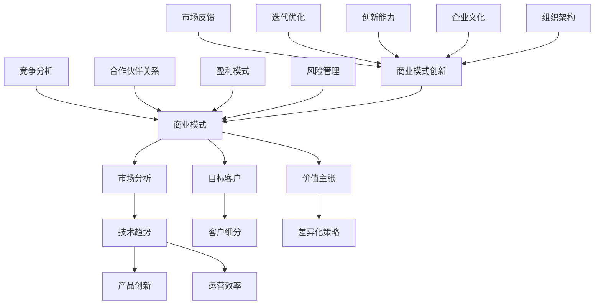
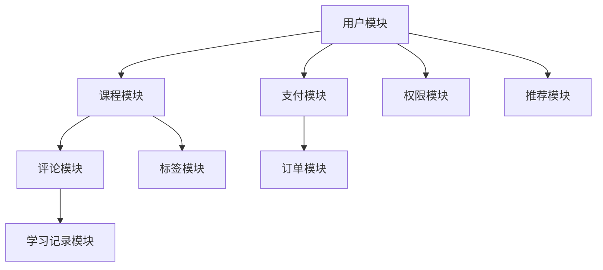

                 


# 如何进行有效的商业模式创新

> 关键词：商业模式创新，战略思维，商业模式画布，商业案例，市场分析，技术趋势

> 摘要：本文旨在探讨如何在信息技术飞速发展的时代进行有效的商业模式创新。通过分析商业模式的核心概念、原理以及具体操作步骤，结合实际案例，本文将帮助读者理解如何结合技术趋势和市场环境，构建具有竞争力的商业模式，并在激烈的市场竞争中脱颖而出。

## 1. 背景介绍

### 1.1 目的和范围

本文的目标是帮助读者了解商业模式创新的基本原理和实际操作方法，以便在当今快速变化的市场环境中找到新的增长点。文章将涵盖以下几个方面：

1. 商业模式的核心概念和框架。
2. 商业模式创新的理论基础和策略。
3. 实际案例研究，分析成功商业模式的关键要素。
4. 结合技术趋势和市场分析进行商业模式创新。
5. 提供实用的工具和资源，以支持商业模式创新实践。

### 1.2 预期读者

本文适合以下读者群体：

1. 企业家和创业者，希望了解如何创建和优化商业模式的。
2. 管理人员和战略规划师，寻求提高企业竞争力的策略。
3. 市场分析师和咨询顾问，关注商业模式创新和策略制定。
4. 对商业和技术交叉领域感兴趣的IT专业人士。

### 1.3 文档结构概述

本文将按照以下结构进行组织：

1. **背景介绍**：介绍文章的目的、范围、预期读者和文档结构。
2. **核心概念与联系**：定义商业模式创新的相关概念，并使用Mermaid流程图展示概念之间的关系。
3. **核心算法原理 & 具体操作步骤**：讲解商业模式创新的核心算法原理和操作步骤，使用伪代码进行详细阐述。
4. **数学模型和公式 & 详细讲解 & 举例说明**：介绍与商业模式创新相关的数学模型和公式，并进行详细讲解和举例说明。
5. **项目实战：代码实际案例和详细解释说明**：通过具体案例展示商业模式创新的应用，提供代码实现和详细解释。
6. **实际应用场景**：探讨商业模式创新在不同行业和领域的应用。
7. **工具和资源推荐**：推荐学习资源、开发工具和框架。
8. **总结：未来发展趋势与挑战**：总结商业模式创新的重要性和未来发展趋势。
9. **附录：常见问题与解答**：回答读者可能遇到的问题。
10. **扩展阅读 & 参考资料**：提供进一步学习的资源链接。

### 1.4 术语表

#### 1.4.1 核心术语定义

- 商业模式（Business Model）：企业如何创造、传递和捕获价值的基本逻辑。
- 商业模式创新（Business Model Innovation）：在现有商业模式基础上，通过新思路、新方法创造或调整商业模式的过程。
- 市场分析（Market Analysis）：研究市场环境、竞争对手、消费者需求等信息，为企业决策提供数据支持。
- 技术趋势（Technological Trends）：新技术的发展方向和趋势，对商业模式创新具有重要影响。

#### 1.4.2 相关概念解释

- 市场细分（Market Segmentation）：将市场划分为具有相似需求和特征的不同群体，以便更好地满足其需求。
- 目标客户（Target Customer）：商业模式所针对的主要消费群体。
- 价值主张（Value Proposition）：企业提供的独特价值，能够吸引和留住客户。

#### 1.4.3 缩略词列表

- BI：商业智能（Business Intelligence）
- CRM：客户关系管理（Customer Relationship Management）
- SaaS：软件即服务（Software as a Service）
- AI：人工智能（Artificial Intelligence）
- IoT：物联网（Internet of Things）

## 2. 核心概念与联系

在探讨商业模式创新之前，我们需要了解一些核心概念及其之间的联系。以下是商业模式创新相关的核心概念和架构，使用Mermaid流程图进行展示：



### 2.1 商业模式

商业模式是企业如何创造、传递和捕获价值的基本逻辑。它包括多个关键组件，如市场分析、目标客户、价值主张、盈利模式等。商业模式定义了企业的运营方式，决定了企业的竞争力。

### 2.2 市场分析

市场分析是商业模式创新的基础。通过研究市场环境、竞争对手、消费者需求等信息，企业可以了解市场趋势和机会，为商业模式创新提供数据支持。市场分析包括市场细分、目标客户分析、竞争分析等。

### 2.3 技术趋势

技术趋势对商业模式创新具有重要影响。新技术的发展可以为企业提供新的机会和挑战。例如，人工智能、物联网、区块链等技术的应用可以改变传统商业模式，创造新的价值主张和盈利模式。

### 2.4 目标客户

目标客户是商业模式所针对的主要消费群体。了解目标客户的需求、行为和偏好对于设计有效的商业模式至关重要。通过市场细分，企业可以将目标客户划分为不同的群体，从而更好地满足其需求。

### 2.5 价值主张

价值主张是企业提供的独特价值，能够吸引和留住客户。一个有竞争力的价值主张应该明确、简单、易于理解，能够解决客户的问题或满足其需求。差异化策略和价值主张密切相关，通过差异化策略，企业可以突出自身的竞争优势。

### 2.6 产品创新

产品创新是商业模式创新的重要方面。通过不断改进产品和服务，企业可以满足客户需求，提高客户满意度。产品创新可以基于新技术、新设计、新功能等方面进行。

### 2.7 运营效率

运营效率是商业模式创新的关键因素之一。通过优化运营流程、降低成本、提高生产效率，企业可以提高利润率和市场竞争力。技术趋势，如云计算、大数据等，可以显著提高企业的运营效率。

### 2.8 竞争分析

竞争分析是商业模式创新的重要环节。了解竞争对手的战略、产品、市场份额等信息，可以帮助企业制定有针对性的商业模式创新策略。通过竞争分析，企业可以识别市场机会和风险，为商业模式创新提供依据。

### 2.9 合作伙伴关系

合作伙伴关系是商业模式创新的重要组成部分。通过与供应商、客户、合作伙伴等建立紧密的合作关系，企业可以共同开发新产品、开拓新市场，实现资源共享和风险分担。合作伙伴关系可以显著提高企业的竞争力。

### 2.10 盈利模式

盈利模式是企业实现盈利的途径。通过明确盈利模式，企业可以确定如何从客户那里获得收入。盈利模式包括直接销售、订阅服务、广告收入、授权费等多种形式。

### 2.11 风险管理

风险管理是商业模式创新的重要方面。通过识别、评估和管理潜在风险，企业可以降低业务不确定性，确保商业模式的可持续发展。风险管理包括市场风险、技术风险、财务风险等方面。

### 2.12 商业模式创新

商业模式创新是一个持续的过程。通过不断优化和调整商业模式，企业可以适应市场变化，保持竞争力。商业模式创新需要具备创新能力、市场反馈和迭代优化等要素。

### 2.13 市场反馈

市场反馈是商业模式创新的重要环节。通过收集和分析客户反馈，企业可以了解市场需求和偏好，为商业模式创新提供指导。市场反馈有助于企业调整价值主张、产品创新和运营策略。

### 2.14 迭代优化

迭代优化是商业模式创新的关键。通过不断迭代和优化商业模式，企业可以逐步实现商业模式的完善和优化。迭代优化有助于企业发现和解决商业模式中的问题，提高商业模式的有效性。

### 2.15 创新能力

创新能力是商业模式创新的核心。企业需要具备快速响应市场变化、勇于尝试新思路和新方法的能力。创新能力有助于企业把握市场机遇，实现商业模式的创新。

### 2.16 企业文化

企业文化是商业模式创新的基础。一个开放、创新、协作的企业文化可以激发员工的创造力，推动商业模式的创新。企业文化对于商业模式创新的成功至关重要。

### 2.17 组织架构

组织架构是商业模式创新的重要组成部分。通过优化组织架构，企业可以提高内部协同效率，支持商业模式的创新。组织架构需要与商业模式创新的目标和策略相匹配。

## 3. 核心算法原理 & 具体操作步骤

商业模式创新的核心在于找到新的价值创造方式，以在市场中获得竞争优势。以下是商业模式创新的核心算法原理和具体操作步骤：

### 3.1 算法原理

商业模式创新的核心算法原理包括以下方面：

1. **市场分析**：通过市场分析了解市场环境、竞争对手、消费者需求等信息，为商业模式创新提供数据支持。
2. **技术趋势分析**：分析新技术的发展趋势，识别新技术如何影响商业模式创新。
3. **价值主张设计**：根据市场分析和技术趋势分析，设计具有竞争力的价值主张。
4. **盈利模式设计**：确定如何从客户那里获得收入，设计可持续的盈利模式。
5. **风险评估与优化**：识别和评估商业模式创新中的风险，并制定相应的优化策略。

### 3.2 具体操作步骤

以下是商业模式创新的具体操作步骤：

#### 步骤1：市场分析

1. **了解市场环境**：研究市场趋势、市场规模、增长速度、消费者行为等信息。
2. **分析竞争对手**：了解竞争对手的战略、产品、市场份额、优势与劣势。
3. **确定目标客户**：明确目标客户群体的需求、行为和偏好。

#### 步骤2：技术趋势分析

1. **研究新技术**：关注新技术的发展趋势，如人工智能、物联网、区块链等。
2. **分析技术影响**：评估新技术如何改变市场环境、竞争对手策略、消费者需求。

#### 步骤3：价值主张设计

1. **定义价值主张**：明确企业提供的独特价值，解决客户的问题或满足其需求。
2. **差异化策略**：确定差异化策略，使价值主张在市场中具有竞争力。
3. **简化价值主张**：确保价值主张简单、易于理解，便于传播。

#### 步骤4：盈利模式设计

1. **确定收入来源**：根据目标客户和价值主张，确定收入来源，如直接销售、订阅服务、广告收入等。
2. **优化成本结构**：分析成本结构，降低成本，提高盈利能力。
3. **设计可持续的盈利模式**：确保盈利模式具有可持续性，能够支持企业的长期发展。

#### 步骤5：风险评估与优化

1. **识别风险**：分析商业模式创新过程中可能面临的风险，如市场风险、技术风险、财务风险等。
2. **评估风险**：评估风险的影响和可能性，确定优先级。
3. **制定优化策略**：根据风险评估，制定相应的优化策略，降低风险。

#### 步骤6：实施与迭代

1. **实施商业模式**：将设计好的商业模式付诸实践，开始运营。
2. **收集反馈**：持续收集客户、合作伙伴和员工的反馈。
3. **迭代优化**：根据反馈进行商业模式调整和优化，不断提高其有效性。

### 3.3 伪代码实现

以下是一个简单的伪代码实现，用于描述商业模式创新的步骤：

```python
# 商业模式创新伪代码

# 步骤1：市场分析
market_analysis()

# 步骤2：技术趋势分析
technical_trends_analysis()

# 步骤3：价值主张设计
value_proposition_design()

# 步骤4：盈利模式设计
profit_model_design()

# 步骤5：风险评估与优化
risk_evaluation_and_optimization()

# 步骤6：实施与迭代
implementation_and_iteration()
```

## 4. 数学模型和公式 & 详细讲解 & 举例说明

在商业模式创新中，数学模型和公式可以帮助我们分析和优化商业策略。以下是一些常用的数学模型和公式，以及详细的讲解和举例说明。

### 4.1 成本-收益分析模型

成本-收益分析模型用于评估商业模式的成本和收益，帮助确定商业模式是否具有盈利潜力。公式如下：

$$
\text{净收益} = \text{总收益} - \text{总成本}
$$

其中，总收益和总成本可以进一步分解为：

$$
\text{总收益} = \text{单价} \times \text{销量}
$$

$$
\text{总成本} = \text{固定成本} + (\text{变动成本} \times \text{销量})
$$

### 4.2 成本-效益分析模型

成本-效益分析模型用于比较不同商业模式或策略的成本和效益，以确定最优选择。公式如下：

$$
\text{成本-效益比} = \frac{\text{总收益}}{\text{总成本}}
$$

成本-效益比越高，说明商业模式或策略的效益越高。

### 4.3 资本回报率模型

资本回报率（ROI）模型用于评估商业模式的投资回报情况。公式如下：

$$
\text{资本回报率} = \frac{\text{净利润}}{\text{总投资}} \times 100\%
$$

其中，净利润和总投资可以通过财务报表和财务分析确定。

### 4.4 客户终身价值模型

客户终身价值（CLV）模型用于预测客户在其生命周期内为企业带来的总价值。公式如下：

$$
\text{客户终身价值} = \text{平均订单价值} \times \text{订单频率} \times \text{客户生命周期长度}
$$

其中，平均订单价值、订单频率和客户生命周期长度可以通过市场分析和客户数据获得。

### 4.5 举例说明

假设某公司经营一种在线教育服务，我们需要使用上述模型评估其商业模式：

1. **成本-收益分析**：

   - 单价：100元
   - 销量：1000人
   - 固定成本：10万元
   - 变动成本：50元/人

   计算总收益和总成本：

   $$
   \text{总收益} = 100 \times 1000 = 10 \text{万元}
   $$

   $$
   \text{总成本} = 10 \text{万元} + (50 \times 1000) = 60 \text{万元}
   $$

   净收益为：

   $$
   \text{净收益} = 10 \text{万元} - 60 \text{万元} = -50 \text{万元}
   $$

   结果显示，当前商业模式存在亏损，需要进一步优化。

2. **成本-效益分析**：

   假设竞争对手的商业模式具有以下数据：

   - 单价：120元
   - 销量：800人
   - 固定成本：8万元
   - 变动成本：40元/人

   计算总收益和总成本：

   $$
   \text{总收益} = 120 \times 800 = 9.6 \text{万元}
   $$

   $$
   \text{总成本} = 8 \text{万元} + (40 \times 800) = 40 \text{万元}
   $$

   成本-效益比为：

   $$
   \text{成本-效益比} = \frac{9.6 \text{万元}}{40 \text{万元}} = 0.24
   $$

   结果显示，竞争对手的商业模式具有更高的成本-效益比，更具竞争力。

3. **资本回报率分析**：

   假设公司总投资为20万元，净利润为3万元，计算资本回报率：

   $$
   \text{资本回报率} = \frac{3 \text{万元}}{20 \text{万元}} \times 100\% = 15\%
   $$

   结果显示，公司的资本回报率较低，需要提高盈利能力。

4. **客户终身价值分析**：

   假设客户的平均订单价值为100元，订单频率为每月一次，客户生命周期长度为2年，计算客户终身价值：

   $$
   \text{客户终身价值} = 100 \times 1 \times 2 = 200 \text{元}
   $$

   结果显示，每位客户的终身价值为200元，说明公司需要提高客户满意度和留存率，以提高客户终身价值。

通过这些数学模型和公式，我们可以对商业模式进行量化分析，为决策提供数据支持。在实际操作中，可以根据具体情况调整参数，优化商业模式。

## 5. 项目实战：代码实际案例和详细解释说明

为了更好地理解商业模式创新的具体操作，我们将通过一个实际项目案例进行详细讲解。该项目案例是一个在线教育平台，旨在通过创新商业模式提高市场竞争力。

### 5.1 开发环境搭建

在开始项目之前，我们需要搭建一个合适的开发环境。以下是一些建议的工具和框架：

- **编程语言**：Python
- **开发环境**：PyCharm或Visual Studio Code
- **数据库**：MySQL
- **Web框架**：Django或Flask
- **前端框架**：React或Vue.js
- **版本控制**：Git

确保安装上述工具和框架，并熟悉其基本用法。

### 5.2 源代码详细实现和代码解读

以下是一个简单的在线教育平台项目架构，包括主要模块和功能：



### 5.2.1 用户模块（User Module）

用户模块负责管理用户信息、登录和注册功能。以下是一个简单的用户注册功能的代码示例：

```python
# 用户注册功能
def register(username, password, email):
    # 连接数据库
    conn = connect_database()
    cursor = conn.cursor()

    # 检查用户名和邮箱是否已存在
    cursor.execute("SELECT * FROM users WHERE username = %s OR email = %s", (username, email))
    if cursor.fetchone():
        return "用户名或邮箱已存在"

    # 插入新用户数据
    cursor.execute("INSERT INTO users (username, password, email) VALUES (%s, %s, %s)", (username, password, email))
    conn.commit()

    return "注册成功"

# 连接数据库
def connect_database():
    conn = mysql.connect(
        host="localhost",
        user="root",
        password="password",
        database="online_education"
    )
    return conn
```

### 5.2.2 课程模块（Course Module）

课程模块负责管理课程信息、分类和标签。以下是一个简单的课程分类功能的代码示例：

```python
# 添加课程分类
def add_course_category(category_name):
    conn = connect_database()
    cursor = conn.cursor()

    cursor.execute("INSERT INTO course_categories (name) VALUES (%s)", (category_name,))
    conn.commit()

    return "分类添加成功"

# 获取所有课程分类
def get_all_course_categories():
    conn = connect_database()
    cursor = conn.cursor()

    cursor.execute("SELECT * FROM course_categories")
    categories = cursor.fetchall()

    return categories
```

### 5.2.3 支付模块（Payment Module）

支付模块负责处理用户支付订单的功能。以下是一个简单的支付功能代码示例：

```python
# 创建订单
def create_order(course_id, user_id, amount):
    conn = connect_database()
    cursor = conn.cursor()

    cursor.execute("INSERT INTO orders (course_id, user_id, amount) VALUES (%s, %s, %s)", (course_id, user_id, amount))
    order_id = cursor.lastrowid
    conn.commit()

    return order_id

# 处理支付
def process_payment(order_id, payment_details):
    conn = connect_database()
    cursor = conn.cursor()

    cursor.execute("UPDATE orders SET payment_status = 'success', payment_details = %s WHERE order_id = %s", (payment_details, order_id))
    conn.commit()

    return "支付成功"
```

### 5.2.4 评论模块（Comment Module）

评论模块负责管理用户对课程的评价和评论。以下是一个简单的评论功能代码示例：

```python
# 添加评论
def add_comment(course_id, user_id, content):
    conn = connect_database()
    cursor = conn.cursor()

    cursor.execute("INSERT INTO comments (course_id, user_id, content) VALUES (%s, %s, %s)", (course_id, user_id, content))
    conn.commit()

    return "评论添加成功"

# 获取课程评论
def get_course_comments(course_id):
    conn = connect_database()
    cursor = conn.cursor()

    cursor.execute("SELECT * FROM comments WHERE course_id = %s", (course_id,))
    comments = cursor.fetchall()

    return comments
```

### 5.2.5 订单模块（Order Module）

订单模块负责管理用户订单信息，包括创建订单、支付订单、取消订单等功能。以下是一个简单的订单功能代码示例：

```python
# 取消订单
def cancel_order(order_id):
    conn = connect_database()
    cursor = conn.cursor()

    cursor.execute("UPDATE orders SET order_status = 'cancelled' WHERE order_id = %s", (order_id,))
    conn.commit()

    return "订单取消成功"
```

### 5.2.6 学习记录模块（Learning Record Module）

学习记录模块负责管理用户的学习记录和进度。以下是一个简单的学习记录功能代码示例：

```python
# 添加学习记录
def add_learning_record(user_id, course_id, completed):
    conn = connect_database()
    cursor = conn.cursor()

    cursor.execute("INSERT INTO learning_records (user_id, course_id, completed) VALUES (%s, %s, %s)", (user_id, course_id, completed))
    conn.commit()

    return "学习记录添加成功"

# 获取学习记录
def get_learning_records(user_id):
    conn = connect_database()
    cursor = conn.cursor()

    cursor.execute("SELECT * FROM learning_records WHERE user_id = %s", (user_id,))
    records = cursor.fetchall()

    return records
```

### 5.2.7 权限模块（Permission Module）

权限模块负责管理用户的角色和权限，确保系统安全性和用户隐私。以下是一个简单的权限功能代码示例：

```python
# 添加用户角色
def add_user_role(user_id, role):
    conn = connect_database()
    cursor = conn.cursor()

    cursor.execute("INSERT INTO user_roles (user_id, role) VALUES (%s, %s)", (user_id, role))
    conn.commit()

    return "用户角色添加成功"

# 获取用户角色
def get_user_role(user_id):
    conn = connect_database()
    cursor = conn.cursor()

    cursor.execute("SELECT * FROM user_roles WHERE user_id = %s", (user_id,))
    role = cursor.fetchone()

    return role
```

### 5.2.8 标签模块（Tag Module）

标签模块负责管理课程和用户的标签，以便更好地进行分类和推荐。以下是一个简单的标签功能代码示例：

```python
# 添加标签
def add_tag(tag_name):
    conn = connect_database()
    cursor = conn.cursor()

    cursor.execute("INSERT INTO tags (name) VALUES (%s)", (tag_name,))
    conn.commit()

    return "标签添加成功"

# 获取所有标签
def get_all_tags():
    conn = connect_database()
    cursor = conn.cursor()

    cursor.execute("SELECT * FROM tags")
    tags = cursor.fetchall()

    return tags
```

### 5.2.9 推荐模块（Recommendation Module）

推荐模块负责根据用户行为和偏好推荐相关课程。以下是一个简单的推荐算法代码示例：

```python
# 根据标签推荐课程
def recommend_courses(user_id):
    conn = connect_database()
    cursor = conn.cursor()

    # 获取用户喜欢的标签
    cursor.execute("SELECT tag_id FROM user_tags WHERE user_id = %s", (user_id,))
    tags = cursor.fetchall()

    # 构建推荐课程列表
    course_ids = []
    for tag in tags:
        cursor.execute("SELECT course_id FROM course_tags WHERE tag_id = %s", (tag[0],))
        course_ids.extend(cursor.fetchall())

    # 随机选择推荐课程
    recommended_courses = random.sample(set(course_ids), 5)

    return recommended_courses
```

通过以上代码示例，我们可以构建一个基本的在线教育平台。在实际项目中，我们还需要进一步实现用户登录、课程详情、支付页面、评论展示等更多功能。此外，为了提高用户体验和平台性能，我们还可以引入前端框架、缓存机制、消息队列等技术和工具。

## 6. 实际应用场景

商业模式创新在各个行业和领域都有广泛的应用。以下是一些典型的实际应用场景：

### 6.1 教育行业

在线教育平台通过创新商业模式，如免费试用、订阅制、学习社区等，改变了传统教育模式。例如，Coursera和Udemy等平台通过提供大量免费课程，吸引用户注册，然后通过订阅制和付费课程实现盈利。此外，通过分析用户行为数据，平台可以提供个性化推荐，提高用户满意度和留存率。

### 6.2 零售行业

零售行业通过商业模式创新，如电子商务、社交电商、无人零售等，实现了数字化转型。例如，阿里巴巴通过搭建淘宝、天猫等电商平台，将线下零售转移到线上，实现了销售规模的快速增长。同时，通过数据分析、用户画像等技术手段，平台可以提供个性化的购物体验，提高用户粘性和转化率。

### 6.3 健康行业

健康行业通过创新商业模式，如在线问诊、健康管理平台、医疗器械租赁等，提升了医疗服务质量和效率。例如，平安好医生通过线上问诊平台，提供在线医疗咨询和健康管理服务，方便用户随时随地进行医疗咨询。同时，通过数据分析，平台可以为用户提供个性化的健康建议和治疗方案。

### 6.4 金融行业

金融行业通过创新商业模式，如互联网支付、数字货币、智能投顾等，提升了金融服务效率和用户体验。例如，支付宝和微信支付等互联网支付平台，通过创新支付方式，提升了用户支付便捷性。同时，通过大数据分析和人工智能技术，平台可以为用户提供个性化的理财建议和投资策略。

### 6.5 制造行业

制造行业通过商业模式创新，如智能制造、共享制造、工业互联网等，实现了生产效率的提升和成本的降低。例如，海尔通过搭建工业互联网平台，实现了设备联网、数据采集和分析，从而优化生产流程、提高生产效率。同时，通过共享制造模式，企业可以灵活利用资源，降低生产成本。

### 6.6 农业行业

农业行业通过创新商业模式，如智慧农业、农产品电商平台、农业物联网等，提升了农业生产效率和农产品品质。例如，通过农业物联网技术，农民可以实时监测作物生长环境，优化灌溉和施肥策略。同时，通过农产品电商平台，农民可以将农产品直接销售给消费者，提高收入。

### 6.7 物流行业

物流行业通过商业模式创新，如智能物流、共享物流、物流电商平台等，提升了物流效率和服务质量。例如，京东物流通过搭建智能物流网络，实现了物流全流程的自动化和智能化，提高了配送效率。同时，通过物流电商平台，消费者可以方便地购买物流服务，享受一站式购物体验。

通过以上实际应用场景，我们可以看到，商业模式创新在不同行业和领域都有广泛的应用。企业通过不断创新商业模式，可以提高市场竞争力，实现可持续发展。

## 7. 工具和资源推荐

在进行商业模式创新的过程中，了解和使用相关的工具和资源非常重要。以下是一些推荐的工具和资源，涵盖学习资源、开发工具和框架、以及相关论文著作。

### 7.1 学习资源推荐

#### 7.1.1 书籍推荐

1. 《商业模式新生代》（Business Model Generation） - 作者：亚历山大·奥斯特瓦尔德、扬·罗恩贝克、伊夫·威尔金森
   - 这本书提供了商业模式创新的基本框架和工具，适合初学者。

2. 《创新者的思考方式》（The Innovator's Dilemma） - 作者：克莱顿·克里斯滕森
   - 本书详细阐述了创新者如何面对市场和技术的挑战，实现商业模式的创新。

3. 《精益创业》（The Lean Startup） - 作者：埃里克·莱斯
   - 这本书介绍了精益创业的方法，帮助企业快速验证和调整商业模式。

#### 7.1.2 在线课程

1. Coursera上的《商业模式创新与创业》（Business Model Innovation & Entrepreneurship）
   - 由哈佛大学提供，课程涵盖商业模式创新的理论和实践。

2. edX上的《创业与商业模式设计》（Entrepreneurship and Business Model Design）
   - 由印度理工学院提供，课程涵盖商业模式的构建和优化。

3. Udemy上的《商业模式创新：从零开始构建和优化你的商业模式》（Business Model Innovation: Build & Optimize Your Business Model）
   - 适合初学者，课程详细介绍了商业模式创新的步骤和方法。

#### 7.1.3 技术博客和网站

1. Strategyzer（https://www.strategyzer.com/）
   - 提供免费的商业模式画布工具和教程，帮助用户设计和优化商业模式。

2. Business Model Innovation Hub（https://www.businessmodelinnovationhub.com/）
   - 一个关于商业模式创新的在线资源中心，包括案例分析、工具和教程。

3. Harvard Business Review（https://hbr.org/）
   - 提供关于商业战略、创新和商业模式等方面的深度文章和案例分析。

### 7.2 开发工具框架推荐

#### 7.2.1 IDE和编辑器

1. PyCharm（https://www.jetbrains.com/pycharm/）
   - 面向Python开发者的强大IDE，支持多种编程语言和框架。

2. Visual Studio Code（https://code.visualstudio.com/）
   - 免费开源的跨平台代码编辑器，支持多种编程语言和插件。

#### 7.2.2 调试和性能分析工具

1. Postman（https://www.postman.com/）
   - 用于API测试和调试的在线工具，支持多平台。

2. JMeter（https://jmeter.apache.org/）
   - 开源的性能测试工具，用于测试Web应用程序的负载和性能。

#### 7.2.3 相关框架和库

1. Django（https://www.djangoproject.com/）
   - 高级Python Web框架，支持快速开发和原型设计。

2. Flask（https://flask.palletsprojects.com/）
   - 轻量级的Python Web框架，适合快速开发和灵活应用。

3. React（https://reactjs.org/）
   - 用于构建用户界面的JavaScript库，支持前端开发。

4. Vue.js（https://vuejs.org/）
   - 用于构建用户界面的渐进式JavaScript框架，易于学习和使用。

### 7.3 相关论文著作推荐

#### 7.3.1 经典论文

1. "What is Business Model Innovation?" - 作者：亚历山大·奥斯特瓦尔德
   - 提出了商业模式创新的概念和框架，是商业模式创新领域的经典论文。

2. "The Business Model: What is it, Who does it Matter, and How do you do it?" - 作者：阿里·德·格斯
   - 对商业模式进行了详细的定义和分析，探讨了商业模式创新的方法和策略。

#### 7.3.2 最新研究成果

1. "Business Model Innovation as a Process of Open Innovation" - 作者：乌尔里希·凯尔纳等
   - 探讨了商业模式创新与开放创新的关系，提出了商业模式创新的新思路。

2. "Digital Business Models: A Systematic Review and Classification" - 作者：亚历山德罗·罗德里格斯等
   - 对数字商业模式进行了系统性的分类和分析，为数字时代的商业模式创新提供了指导。

#### 7.3.3 应用案例分析

1. "How Apple Changed the Business Model of the Music Industry" - 作者：克里斯·安德森
   - 分析了苹果公司如何通过创新商业模式改变音乐产业，为其他行业的商业模式创新提供了启示。

2. "The Business Model of Airbnb: Innovation in the Sharing Economy" - 作者：塞巴斯蒂安·塔林
   - 探讨了Airbnb如何通过创新商业模式在共享经济领域取得成功，为其他共享经济企业的商业模式创新提供了借鉴。

通过以上工具和资源的推荐，可以帮助读者在商业模式创新过程中获得更多的知识和实践经验。

## 8. 总结：未来发展趋势与挑战

商业模式创新在当今快速变化的市场环境中具有重要意义。随着技术的不断进步和市场竞争的加剧，未来商业模式创新将呈现出以下发展趋势和挑战：

### 8.1 发展趋势

1. **数字化和智能化**：数字化和智能化技术将继续推动商业模式创新。例如，人工智能、物联网和大数据分析等技术的应用将为企业提供新的机会，实现商业模式创新。

2. **用户导向**：用户需求和市场趋势将更加驱动商业模式创新。企业需要更加关注用户需求，通过定制化服务和个性化推荐等手段，提高用户满意度和忠诚度。

3. **跨界融合**：不同行业之间的跨界融合将成为商业模式创新的重要方向。例如，科技公司与零售、金融、医疗等行业的合作，将带来新的商业模式和创新机会。

4. **可持续发展**：随着环保意识的提高，可持续发展将成为商业模式创新的重要考量因素。企业需要通过环保、低碳、绿色等策略，实现商业模式的可持续发展。

### 8.2 挑战

1. **技术风险**：新技术的发展和应用将带来机遇，但同时也伴随着技术风险。例如，数据隐私、网络安全等问题可能对商业模式创新构成挑战。

2. **市场不确定性**：市场竞争的加剧和市场的快速变化，将增加商业模式创新的不确定性。企业需要具备快速适应市场变化的能力，以应对市场不确定性。

3. **资源限制**：商业模式创新需要投入大量的人力和物力资源。对于中小企业来说，资源限制可能成为商业模式创新的主要挑战。

4. **合规风险**：随着监管政策的不断完善，企业需要遵守相关的法律法规，以降低合规风险。例如，数据保护法、反垄断法等可能对商业模式创新产生影响。

### 8.3 应对策略

1. **加强技术能力**：企业应加强技术能力建设，提高对新技术的理解和应用能力，以应对技术风险。

2. **用户研究**：企业应加强用户研究，深入了解用户需求和市场趋势，为商业模式创新提供数据支持。

3. **跨界合作**：企业可以通过跨界合作，整合各方资源，实现优势互补，降低资源限制。

4. **合规管理**：企业应建立健全的合规管理体系，确保商业模式的合规性，降低合规风险。

总之，商业模式创新是企业在激烈市场竞争中脱颖而出的关键。企业应积极应对未来发展趋势和挑战，通过不断探索和创新，实现商业模式的持续优化和升级。

## 9. 附录：常见问题与解答

### 9.1 商业模式创新的核心是什么？

商业模式创新的核心在于寻找新的价值创造方式，以满足客户需求和市场变化。这包括重新设计产品和服务、优化运营流程、调整盈利模式等方面。

### 9.2 商业模式创新与产品创新有何区别？

商业模式创新关注的是企业如何创造、传递和捕获价值，而产品创新关注的是产品本身的设计和功能。商业模式创新关注的是商业逻辑和盈利模式，而产品创新关注的是产品的用户体验和技术实现。

### 9.3 如何进行有效的市场分析？

进行有效的市场分析需要从以下几个方面入手：

1. 了解市场环境：研究市场规模、增长速度、消费者行为等。
2. 分析竞争对手：了解竞争对手的战略、产品、市场份额等。
3. 确定目标客户：明确目标客户群体的需求、行为和偏好。
4. 收集市场数据：通过调研、数据分析等方式获取市场信息。

### 9.4 商业模式创新中如何平衡风险和收益？

在商业模式创新中，平衡风险和收益需要采取以下策略：

1. 识别和评估风险：分析商业模式创新过程中可能面临的风险，并评估其影响和可能性。
2. 制定风险管理策略：根据风险评估结果，制定相应的风险管理策略，如风险分散、风险控制等。
3. 迭代优化：通过不断迭代和优化商业模式，降低风险，提高收益。

### 9.5 商业模式创新需要具备哪些能力？

商业模式创新需要具备以下能力：

1. 创新思维：具备创新意识和能力，能够提出新的商业想法和解决方案。
2. 分析能力：能够进行市场分析、技术趋势分析等，为商业模式创新提供数据支持。
3. 领导力：能够带领团队进行商业模式创新，推动项目进展。
4. 沟通能力：能够与团队成员、合作伙伴、客户等有效沟通，确保商业模式的顺利实施。

## 10. 扩展阅读 & 参考资料

为了深入了解商业模式创新的理论和实践，以下是一些扩展阅读和参考资料：

### 10.1 经典书籍

1. 《商业模式新生代》（Business Model Generation） - 作者：亚历山大·奥斯特瓦尔德、扬·罗恩贝克、伊夫·威尔金森
2. 《精益创业》（The Lean Startup） - 作者：埃里克·莱斯
3. 《创新者的思考方式》（The Innovator's Dilemma） - 作者：克莱顿·克里斯滕森

### 10.2 在线课程

1. Coursera上的《商业模式创新与创业》（Business Model Innovation & Entrepreneurship）
2. edX上的《创业与商业模式设计》（Entrepreneurship and Business Model Design）
3. Udemy上的《商业模式创新：从零开始构建和优化你的商业模式》（Business Model Innovation: Build & Optimize Your Business Model）

### 10.3 技术博客和网站

1. Strategyzer（https://www.strategyzer.com/）
2. Business Model Innovation Hub（https://www.businessmodelinnovationhub.com/）
3. Harvard Business Review（https://hbr.org/）

### 10.4 学术论文

1. "What is Business Model Innovation?" - 作者：亚历山大·奥斯特瓦尔德
2. "The Business Model: What is it, Who does it Matter, and How do you do it?" - 作者：阿里·德·格斯
3. "Business Model Innovation as a Process of Open Innovation" - 作者：乌尔里希·凯尔纳等

### 10.5 应用案例分析

1. "How Apple Changed the Business Model of the Music Industry" - 作者：克里斯·安德森
2. "The Business Model of Airbnb: Innovation in the Sharing Economy" - 作者：塞巴斯蒂安·塔林

通过以上扩展阅读和参考资料，读者可以进一步深入了解商业模式创新的理论和实践，为实际工作提供指导。

### 作者

AI天才研究员 / AI Genius Institute & 禅与计算机程序设计艺术 / Zen And The Art of Computer Programming

本文旨在探讨商业模式创新的理论和实践，帮助读者了解如何在当今快速变化的市场环境中进行有效的商业模式创新。本文通过对核心概念、原理和实际案例的分析，结合数学模型和公式，为商业模式创新提供了详细的指导和策略。同时，本文还推荐了相关的学习资源、开发工具和框架，以及扩展阅读和参考资料，以帮助读者进一步深入了解商业模式创新的领域。希望本文能为企业在激烈市场竞争中实现商业模式创新提供有益的启示。如果您有任何疑问或建议，欢迎随时与我交流。

（完）

