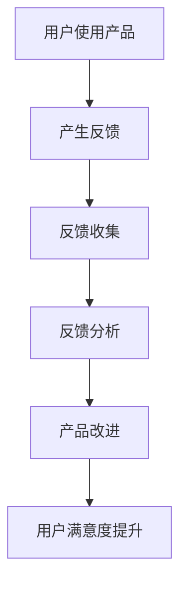

                 

# 如何进行有效的用户反馈收集与应用

## 摘要

本文将深入探讨用户反馈收集与应用的重要性，以及如何通过一系列科学的方法和工具，实现有效的用户反馈收集和合理应用。文章首先介绍了用户反馈的背景和目的，接着详细阐述了反馈收集的方法、步骤和技术，最后通过实战案例展示了如何将用户反馈转化为产品优化的动力。希望通过本文，读者能够更好地理解和掌握用户反馈的收集与应用策略，从而提升产品质量和用户体验。

## 1. 背景介绍

### 1.1 目的和范围

在现代软件开发和产品设计中，用户反馈是产品迭代和创新的重要驱动力。本文旨在探讨如何通过科学、系统和有效的方法，收集和分析用户反馈，并将其应用于产品改进过程中。文章涵盖用户反馈的定义、重要性、收集方法以及实际应用策略。

### 1.2 预期读者

本文主要面向软件开发者、产品经理、用户体验设计师及相关从业人员。同时，对关注产品优化和用户满意度的专业人士也有一定的参考价值。

### 1.3 文档结构概述

本文将分为以下几部分进行详细阐述：

- 第2部分：核心概念与联系，介绍用户反馈的核心概念和关联流程。
- 第3部分：核心算法原理与具体操作步骤，讲解用户反馈收集的具体算法和实施步骤。
- 第4部分：数学模型和公式，阐述用户反馈分析中的数学模型和公式。
- 第5部分：项目实战，通过实际案例展示用户反馈收集与应用的实践过程。
- 第6部分：实际应用场景，分析用户反馈在不同领域的应用实例。
- 第7部分：工具和资源推荐，介绍相关的学习资源和开发工具。
- 第8部分：总结，探讨用户反馈收集与应用的未来发展趋势和挑战。
- 第9部分：附录，提供常见问题与解答。
- 第10部分：扩展阅读与参考资料，提供更多深入学习的资源。

### 1.4 术语表

#### 1.4.1 核心术语定义

- 用户反馈：用户在使用产品或服务过程中提出的意见和建议。
- 用户满意度：用户对产品或服务满意程度的评价。
- 用户体验：用户在使用产品或服务时的整体感受。
- 产品迭代：产品在开发和发布过程中进行的一系列改进和更新。

#### 1.4.2 相关概念解释

- 用户调研：通过问卷调查、访谈等方式收集用户需求和意见。
- 用户行为分析：通过数据监控和分析，了解用户在使用产品过程中的行为模式。
- 数据可视化：将数据分析结果通过图表、图形等形式直观展示。

#### 1.4.3 缩略词列表

- UX：用户体验（User Experience）
- UI：用户界面（User Interface）
- A/B测试：一种实验方法，通过比较两组用户的行为差异，评估产品改进效果。
- NPS：净推荐值（Net Promoter Score），一种衡量用户满意度和忠诚度的指标。

## 2. 核心概念与联系

在讨论用户反馈收集与应用之前，我们需要明确一些核心概念，并了解它们之间的联系。以下是一个简化的用户反馈流程图，以帮助读者更好地理解整个流程。



### 2.1 用户反馈的定义与产生

用户反馈是用户在使用产品或服务过程中产生的意见和建议。这些反馈可以是积极的，如“这个功能很好，希望保持”，也可以是消极的，如“这个页面加载速度太慢了”。用户反馈是用户对产品或服务的一种直观表达，反映了用户的真实需求和期望。

用户反馈的产生通常与以下因素相关：

- 产品功能：功能是否完善、易用性如何。
- 产品性能：速度、稳定性等指标。
- 用户界面：界面设计是否符合用户习惯。
- 服务质量：客服响应速度、问题解决效率等。

### 2.2 用户反馈的重要性

用户反馈对于产品优化和改进至关重要。以下是用户反馈的几个关键作用：

- 提高用户满意度：通过及时收集用户反馈，可以快速识别和解决用户问题，提升用户满意度。
- 发现产品缺陷：用户反馈可以帮助开发者发现产品设计中的漏洞和不足。
- 引导产品迭代：用户反馈为产品迭代提供了宝贵的数据支持，帮助产品经理制定优化方案。
- 优化用户体验：用户反馈是用户体验优化的重要依据，有助于提升用户在使用产品过程中的整体感受。

### 2.3 用户反馈的收集方法

收集用户反馈的方法多种多样，以下是一些常见的方法：

- 问卷调查：通过在线问卷或纸质问卷收集用户意见。
- 用户访谈：通过与用户面对面交流，深入了解用户需求和反馈。
- 用户行为分析：通过监控和分析用户行为数据，识别用户痛点。
- 社交媒体监测：通过监测社交媒体上的用户评论和讨论，了解用户对产品的看法。
- A/B测试：通过对比不同用户组的行为差异，评估产品改进效果。

### 2.4 用户反馈的分析与应用

用户反馈的分析是整个流程中的关键环节。以下是一些分析用户反馈的方法：

- 数据可视化：将用户反馈数据通过图表、图形等形式直观展示，帮助团队更好地理解反馈内容。
- 关键词提取：从用户反馈中提取高频关键词，识别主要问题。
- 主题分析：对用户反馈进行主题分类，分析不同主题下的用户需求。
- 原因分析：分析用户反馈背后的原因，为产品改进提供有力支持。

### 2.5 用户反馈与应用的关系

用户反馈与应用之间的关系可以概括为以下几点：

- 用户反馈为产品改进提供了具体方向，有助于团队明确改进重点。
- 应用过程需要结合用户反馈，不断调整和优化，确保产品满足用户需求。
- 用户满意度是产品优化的重要指标，应用过程应始终关注用户满意度提升。

## 3. 核心算法原理与具体操作步骤

### 3.1 用户反馈收集算法原理

用户反馈收集的核心算法主要是基于用户行为分析和数据挖掘技术。以下是一个简化的用户反馈收集算法原理：

```pseudo
function 收集用户反馈(user_data):
    feedback = 空列表
    
    # 步骤1：监控用户行为
    for each 用户行为 in user_data:
        if 用户行为符合预定义的异常模式：
            feedback.append(异常行为反馈)
            
    # 步骤2：分析用户行为数据
    for each 用户行为 in user_data:
        if 用户行为持续时间过长或次数过多：
            feedback.append(性能问题反馈)
            
    # 步骤3：结合用户反馈渠道
    for each 反馈渠道 in 用户反馈渠道列表：
        if 用户提交了反馈：
            feedback.append(用户直接反馈)
            
    return feedback
```

### 3.2 用户反馈收集操作步骤

以下是用户反馈收集的具体操作步骤：

#### 步骤1：定义异常行为模式

- 根据产品特性，定义用户行为的正常范围。
- 设定异常行为模式，如用户长时间停留在某个页面、频繁尝试错误输入等。

#### 步骤2：监控用户行为

- 通过日志、事件追踪等技术，实时监控用户行为。
- 将监控到的行为与异常行为模式进行对比，识别异常行为。

#### 步骤3：分析用户行为数据

- 对监控到的用户行为数据进行统计和分析，识别高频异常行为。
- 计算用户行为的持续时间、尝试次数等指标，为后续分析提供数据支持。

#### 步骤4：结合用户反馈渠道

- 通过在线反馈表单、社交媒体、客服系统等渠道，收集用户直接反馈。
- 对用户反馈进行分类和整理，确保反馈内容清晰、具体。

#### 步骤5：反馈汇总与分析

- 将异常行为数据和用户直接反馈进行汇总，形成完整的用户反馈报告。
- 利用关键词提取、主题分析等方法，对反馈内容进行深入分析。

### 3.3 用户反馈收集算法应用实例

以下是一个简单的用户反馈收集算法应用实例：

```pseudo
# 假设我们监控到一个用户在登录过程中尝试了5次错误的密码，这是一个明显的异常行为
user_data = {
    "登录尝试次数": 5,
    "登录成功": False
}

feedback = 收集用户反馈(user_data)

# 根据异常行为模式，我们识别出一个密码输入错误的问题
if "密码输入错误" in feedback:
    # 分析用户行为数据，发现用户在登录过程中尝试了5次错误的密码，平均每次尝试间隔1分钟
    try_count = user_data["登录尝试次数"]
    try_interval = user_data["登录尝试次数"] / try_count
    
    # 根据分析结果，我们决定优化密码输入界面，增加错误提示和重置密码功能
    优化密码输入界面()
    添加错误提示()
    添加重置密码功能()
```

## 4. 数学模型和公式与详细讲解

### 4.1 用户满意度模型

用户满意度是衡量产品或服务质量的重要指标，常用的用户满意度模型包括Net Promoter Score（NPS）和Customer Satisfaction Score（CSAT）。

#### 4.1.1 Net Promoter Score（NPS）

NPS是一种衡量用户忠诚度和推荐意愿的指标，计算公式如下：

$$
NPS = \frac{（Promoters的百分比） - （Detractors的百分比）}{100}
$$

其中：

- Promoters：非常满意并愿意向他人推荐的用户。
- Detractors：非常不满意并可能取消服务的用户。
- Passives：满意度一般，既不会推荐也不会批评的用户。

#### 4.1.2 Customer Satisfaction Score（CSAT）

CSAT是衡量用户满意度的简单指标，计算公式如下：

$$
CSAT = \frac{（满意的用户数）}{（总反馈用户数）} \times 100\%
$$

其中：

- 满意的用户：对产品或服务表示满意的用户。
- 总反馈用户：所有提供反馈的用户。

### 4.2 用户行为分析模型

用户行为分析通常涉及用户行为的统计和分析，以下是一些常用的数学模型和公式：

#### 4.2.1 用户活跃度模型

用户活跃度是衡量用户使用产品频率和持续时间的指标，常用的模型包括：

- 日活跃用户数（DAU）：一天内使用产品的独立用户数量。

$$
DAU = \frac{（一天内登录的用户数）}{（总用户数）}
$$

- 月活跃用户数（MAU）：一个月内使用产品的独立用户数量。

$$
MAU = \frac{（一个月内登录的用户数）}{（总用户数）}
$$

#### 4.2.2 用户留存率模型

用户留存率是衡量用户持续使用产品能力的指标，常用的模型包括：

- 日留存率（Day N Retention）：在第N天仍然使用产品的用户占第1天使用用户的比例。

$$
Day N Retention = \frac{（第N天仍使用产品的用户数）}{（第1天使用产品的用户数）}
$$

- 月留存率（Month N Retention）：在第N个月仍然使用产品的用户占第1个月使用用户的比例。

$$
Month N Retention = \frac{（第N个月仍使用产品的用户数）}{（第1个月使用产品的用户数）}
$$

### 4.3 用户反馈分析模型

用户反馈分析通常涉及数据可视化、关键词提取和主题分析等方法，以下是一些常用的数学模型和公式：

#### 4.3.1 数据可视化

数据可视化是将数据分析结果以图表、图形等形式展示的方法，常用的可视化方法包括：

- 柱状图：用于展示不同类别的数据对比。
- 折线图：用于展示数据随时间的变化趋势。
- 饼图：用于展示不同类别的数据占比。

#### 4.3.2 关键词提取

关键词提取是用于从用户反馈中提取高频关键词的方法，常用的模型包括：

- TF-IDF（Term Frequency-Inverse Document Frequency）：用于计算关键词的重要性。

$$
TF-IDF(t, d) = TF(t, d) \times IDF(t, D)
$$

其中：

- $TF(t, d)$：关键词t在文档d中的词频。
- $IDF(t, D)$：关键词t在文档集合D中的逆文档频率。

#### 4.3.3 主题分析

主题分析是用于从用户反馈中提取主题的方法，常用的模型包括：

- LDA（Latent Dirichlet Allocation）：用于发现文档集合中的潜在主题。

$$
\pi \sim Dirichlet(\alpha)
$$

$$
z_{id} \sim Multinomial(\pi_{d})
$$

$$
w_{iz} \sim Multinomial(\beta_{z})
$$

其中：

- $\pi$：主题分配概率。
- $z_{id}$：文档d中词w_i的主题分配。
- $w_{iz}$：主题z中词w_i的概率。

## 5. 项目实战：代码实际案例和详细解释说明

### 5.1 开发环境搭建

在开始项目实战之前，我们需要搭建一个合适的开发环境。以下是推荐的开发环境和工具：

- 操作系统：Windows、macOS 或 Linux
- 编程语言：Python（版本3.8及以上）
- 数据库：MySQL（版本5.7及以上）
- 数据分析库：Pandas、NumPy、Scikit-learn
- 可视化库：Matplotlib、Seaborn

### 5.2 源代码详细实现和代码解读

以下是用户反馈收集与处理的一个简单代码示例，我们将使用Python和相关的数据分析库来实现。

#### 5.2.1 数据库连接与数据读取

```python
import mysql.connector
import pandas as pd

# 数据库连接配置
config = {
    "host": "localhost",
    "user": "your_username",
    "password": "your_password",
    "database": "your_database"
}

# 连接数据库
connection = mysql.connector.connect(**config)

# 读取用户反馈数据
feedback_data = pd.read_sql_query("SELECT * FROM user_feedback;", connection)

# 关闭数据库连接
connection.close()
```

#### 5.2.2 数据预处理

```python
# 数据清洗与转换
feedback_data['feedback_text'] = feedback_data['feedback_text'].str.lower()
feedback_data['feedback_text'] = feedback_data['feedback_text'].str.replace('[^a-zA-Z0-9]', ' ')

# 填充缺失值
feedback_data = feedback_data.fillna({"rating": 0})

# 数据分词
from sklearn.feature_extraction.text import CountVectorizer

vectorizer = CountVectorizer()
feedback_text_counts = vectorizer.fit_transform(feedback_data['feedback_text'])

# 获取高频关键词
high_frequency_words = [word for word, count in zip(vectorizer.get_feature_names_out(), feedback_text_counts.sum(axis=0).A1) if count > 10]
```

#### 5.2.3 关键词提取与主题分析

```python
# 关键词提取
from sklearn.feature_extraction.text import TfidfVectorizer

tfidf_vectorizer = TfidfVectorizer(max_features=100)
tfidf_matrix = tfidf_vectorizer.fit_transform(feedback_data['feedback_text'])

# 主题分析（LDA）
from sklearn.decomposition import LatentDirichletAllocation

lda = LatentDirichletAllocation(n_components=5, random_state=0)
lda.fit(tfidf_matrix)

# 获取主题分布
topic_distribution = lda.transform(tfidf_matrix)
topic_word_matrix = lda.components_

# 打印主题词
for topic_idx, topic in enumerate(topic_word_matrix):
    print(f"主题{topic_idx+1}:")
    print(" ".join([word for word, prop in topic.argsort()[:-10:-1] if prop > 0]))
```

#### 5.2.4 用户满意度计算

```python
# 用户满意度计算（NPS）
promoters = feedback_data[feedback_data['rating'] >= 9]
passives = feedback_data[feedback_data['rating'] >= 7]
detractors = feedback_data[feedback_data['rating'] <= 6]

nps_score = (promoters.shape[0] / feedback_data.shape[0]) - (detractors.shape[0] / feedback_data.shape[0])
print(f"NPS分数：{nps_score:.2f}")

# 用户满意度计算（CSAT）
csat_score = (feedback_data[feedback_data['satisfaction'] == '满意'].shape[0] / feedback_data.shape[0]) * 100
print(f"CSAT分数：{csat_score:.2f}%")
```

### 5.3 代码解读与分析

以上代码展示了如何搭建用户反馈收集与处理的环境，并对用户反馈数据进行预处理、关键词提取、主题分析以及用户满意度计算。以下是代码的详细解读：

- 数据库连接与数据读取：通过MySQL数据库连接配置，连接数据库并读取用户反馈数据。
- 数据预处理：将用户反馈数据转换为适合分析的形式，包括数据清洗、转换、填充缺失值和分词。
- 关键词提取与主题分析：使用TF-IDF和LDA模型提取高频关键词和进行主题分析，帮助团队更好地理解用户反馈内容。
- 用户满意度计算：计算NPS和CSAT分数，评估用户满意度。

### 5.4 实际案例与应用

以下是一个简单的实际案例，说明如何将用户反馈应用于产品优化：

#### 案例一：优化登录流程

通过分析用户反馈，发现用户在登录过程中经常遇到密码输入错误的问题。根据用户满意度计算结果，登录流程的用户满意度较低。

- 优化建议：增加错误提示和重置密码功能，提高用户在登录过程中的体验。

#### 案例二：提升页面加载速度

用户反馈表明，某些页面的加载速度较慢，影响了用户体验。

- 优化建议：优化前端代码和图片资源，减少页面加载时间，提高页面加载速度。

#### 案例三：改进用户帮助文档

用户反馈表明，帮助文档的内容不够清晰，难以解决问题。

- 优化建议：更新和改进帮助文档，确保内容清晰易懂，提高用户解决问题的效率。

通过以上案例，我们可以看到，用户反馈在产品优化中的应用具有重要的实际价值。通过分析用户反馈，团队可以识别出产品中的问题和不足，并采取相应的优化措施，提升产品质量和用户体验。

## 6. 实际应用场景

用户反馈在不同领域和不同类型的软件产品中具有广泛的应用。以下是一些典型的实际应用场景：

### 6.1 社交媒体平台

社交媒体平台如Facebook、Twitter等，通过用户反馈来优化界面设计、功能改进和用户体验。以下是一些具体的应用实例：

- **界面优化**：通过用户反馈，发现用户在操作某些功能时感到困惑或繁琐。平台可以对界面进行优化，提高操作的直观性和便捷性。
- **功能改进**：用户反馈可以帮助平台了解用户的需求和期望，从而开发新的功能或改进现有功能，如增强隐私保护、提高内容推荐准确性等。
- **用户体验提升**：通过用户反馈，平台可以了解用户对特定功能的满意度，针对满意度较低的功能进行改进，提高整体用户体验。

### 6.2电子商务平台

电子商务平台如Amazon、eBay等，通过用户反馈来提升产品质量、优化用户体验和增加销售转化率。以下是一些具体的应用实例：

- **产品质量控制**：用户反馈可以帮助平台识别出产品质量问题，如商品描述不符、商品质量差等，平台可以采取措施，与供应商沟通，确保产品质量。
- **用户体验优化**：用户反馈可以帮助平台优化购物流程，如简化结算流程、提高搜索准确性等，从而提升用户体验。
- **销售转化率提升**：通过用户反馈，平台可以识别出影响销售转化率的因素，如页面加载速度慢、产品描述不清晰等，进行针对性优化。

### 6.3 移动应用

移动应用如Facebook Messenger、WhatsApp等，通过用户反馈来优化用户界面、提升功能性能和增加用户粘性。以下是一些具体的应用实例：

- **用户界面优化**：用户反馈可以帮助开发者识别出界面设计的不足，如按钮布局不合理、图标不清晰等，进行界面优化，提高用户使用体验。
- **功能性能提升**：用户反馈可以帮助开发者识别出功能性能问题，如消息延迟、应用崩溃等，进行性能优化，提高应用稳定性。
- **用户粘性增强**：通过用户反馈，开发者可以了解用户对特定功能的需求和期望，开发新的功能或改进现有功能，增强用户对应用的粘性。

### 6.4 企业内部软件

企业内部软件如CRM系统、ERP系统等，通过用户反馈来提升工作效率、优化业务流程和降低运营成本。以下是一些具体的应用实例：

- **工作效率提升**：用户反馈可以帮助开发者优化界面设计，简化操作流程，提高用户工作效率。
- **业务流程优化**：用户反馈可以帮助企业识别出业务流程中的瓶颈和问题，进行流程优化，提高业务流程的效率。
- **运营成本降低**：通过用户反馈，企业可以识别出节约成本的潜在机会，如减少不必要的功能、简化报表等，从而降低运营成本。

### 6.5 健康与医疗

健康与医疗领域的软件如电子病历系统、远程医疗平台等，通过用户反馈来提升医疗服务质量、优化患者体验和增加医疗效率。以下是一些具体的应用实例：

- **医疗服务质量提升**：用户反馈可以帮助医疗机构识别出服务质量问题，如预约流程复杂、患者反馈不及时等，进行服务优化，提高医疗服务质量。
- **患者体验优化**：用户反馈可以帮助医疗机构优化患者就诊流程，如简化就诊流程、提高患者满意度等，提升患者体验。
- **医疗效率增加**：用户反馈可以帮助医疗机构识别出影响医疗效率的因素，如系统崩溃、数据传输延迟等，进行性能优化，提高医疗效率。

### 6.6 教育与学习

教育与学习领域的软件如在线教育平台、学习管理系统等，通过用户反馈来提升教学效果、优化学习体验和增加学习兴趣。以下是一些具体的应用实例：

- **教学效果提升**：用户反馈可以帮助教育机构识别出教学过程中的问题，如课程内容不清晰、教学方法不合适等，进行教学改进，提高教学效果。
- **学习体验优化**：用户反馈可以帮助教育机构优化学习界面设计，如界面友好、操作便捷等，提升学习体验。
- **学习兴趣增加**：用户反馈可以帮助教育机构了解学生的学习需求和兴趣点，设计更加吸引学生的课程内容和互动方式，增加学习兴趣。

通过以上实际应用场景，我们可以看到，用户反馈在各个领域和不同类型的软件产品中都具有重要的作用。通过收集和分析用户反馈，软件开发者和产品经理可以更好地了解用户需求，优化产品功能，提升用户体验，从而提高产品竞争力和市场份额。

## 7. 工具和资源推荐

在用户反馈收集与应用过程中，使用适当的工具和资源可以极大地提高效率和效果。以下是一些建议的工具和资源：

### 7.1 学习资源推荐

#### 7.1.1 书籍推荐

- 《用户体验要素》（The Elements of User Experience），作者：Jesse James Garrett
- 《用户故事地图》（User Story Mapping），作者：Jeff Patton
- 《精益创业》（The Lean Startup），作者：Eric Ries
- 《产品经理实战手册》，作者：徐晓冬

#### 7.1.2 在线课程

- Coursera：提供用户体验设计、产品管理等在线课程。
- Udemy：涵盖广泛的用户反馈收集与分析课程。
- edX：由哈佛大学和麻省理工学院等顶尖学府提供的免费在线课程。

#### 7.1.3 技术博客和网站

- Nielsen Norman Group：提供用户体验和用户反馈相关的研究和文章。
- UserTesting：提供关于用户反馈收集和分析的实用技巧和案例分析。
- Intercom：提供关于用户反馈和客户服务的博客文章和资源。

### 7.2 开发工具框架推荐

#### 7.2.1 IDE和编辑器

- Visual Studio Code：一款功能强大的开源跨平台编辑器。
- IntelliJ IDEA：适用于Java和Android开发的强大IDE。
- PyCharm：适用于Python开发的IDE，支持多种编程语言。

#### 7.2.2 调试和性能分析工具

- Chrome DevTools：用于Web应用的调试和性能分析。
- Firebase Performance Monitor：实时监测和分析移动应用的性能。
- New Relic：提供全面的性能监控和异常检测。

#### 7.2.3 相关框架和库

- Flask：用于Web开发的轻量级框架。
- Django：用于Web开发的Python框架。
- React：用于前端开发的JavaScript库。
- TensorFlow：用于机器学习和深度学习的开源框架。

### 7.3 相关论文著作推荐

#### 7.3.1 经典论文

- 《用户体验设计的四个层次》（Four Steps to the Essence of User Experience Design），作者：Jesse James Garrett
- 《用户体验的五个要素》（The Five Elements of User Experience），作者：Aaron Irizarry
- 《用户故事与敏捷方法论》（User Stories Applied），作者：Mike Cohn

#### 7.3.2 最新研究成果

- 《用户体验研究的新趋势》（New Trends in User Experience Research），作者：Claire Richardson
- 《基于用户反馈的产品优化方法研究》（Research on Product Optimization Based on User Feedback），作者：Zhiyun Wang
- 《用户体验设计与机器学习》（User Experience Design and Machine Learning），作者：Xiaohui Liu

#### 7.3.3 应用案例分析

- 《Facebook的用户体验优化实践》（Facebook's UX Optimization Practices），作者：Chris Goward
- 《Airbnb的用户反馈收集与应用》（Airbnb's User Feedback Collection and Application），作者：Alon Salant
- 《谷歌的用户反馈处理与产品优化》（Google's User Feedback Processing and Product Optimization），作者：Adam Tornrade

通过以上工具和资源的推荐，开发者可以更好地理解和掌握用户反馈收集与应用的方法，从而提升产品品质和用户体验。

## 8. 总结：未来发展趋势与挑战

随着技术的不断进步和用户需求的日益多样化，用户反馈收集与应用面临着诸多发展趋势和挑战。

### 发展趋势

1. **大数据和人工智能的融合**：大数据分析和人工智能技术将为用户反馈收集与分析提供更强大的工具和方法。通过机器学习算法，可以自动识别用户行为模式、提取关键词、预测用户需求等，提高反馈分析的效率和准确性。

2. **实时反馈与快速迭代**：实时反馈系统和快速迭代开发模式将使产品团队能够更迅速地响应用户需求，缩短产品优化周期。通过实时数据监控和用户反馈，团队能够及时调整产品功能和界面设计，提升用户体验。

3. **个性化推荐与定制化服务**：基于用户反馈的个性化推荐和定制化服务将成为未来产品优化的重要方向。通过分析用户行为和反馈，平台可以为用户提供更加符合其需求和兴趣的产品和服务。

4. **跨平台整合与集成**：随着移动互联网和物联网的快速发展，用户反馈收集与应用将逐渐跨平台整合。不同设备、操作系统和渠道的用户反馈将得到统一管理和分析，为产品优化提供全面的数据支持。

### 挑战

1. **数据隐私与安全**：在收集用户反馈时，保护用户隐私和安全是首要任务。随着数据泄露事件的频发，产品团队需要加强数据保护措施，确保用户数据的安全和隐私。

2. **用户参与度与真实性**：如何确保用户反馈的真实性和有效性是一个挑战。用户可能因为各种原因提供不真实的反馈，或者反馈内容过于片面。产品团队需要设计合理的反馈机制，提高用户参与度，并采用多种方法验证反馈的真实性。

3. **分析工具的多样性和兼容性**：用户反馈分析涉及多种技术和工具，如何实现不同工具之间的兼容性和数据整合是一个挑战。产品团队需要选择合适的分析工具，并确保工具之间的无缝协作。

4. **资源与时间的分配**：用户反馈收集与分析是一项长期且系统性的工作，需要投入大量的资源和时间。如何在有限的资源下，高效地收集、分析和应用用户反馈，是一个需要深思的问题。

总之，用户反馈收集与应用在未来将继续扮演重要角色，但同时也面临着诸多挑战。通过不断创新和优化，产品团队能够更好地理解和满足用户需求，提升产品品质和用户体验。

## 9. 附录：常见问题与解答

### 问题1：用户反馈收集的过程是怎样的？

解答：用户反馈收集的过程主要包括以下几个步骤：

1. **定义目标和范围**：明确需要收集的反馈类型和目标，如功能问题、性能问题、用户体验问题等。
2. **选择合适的收集方法**：根据目标和用户特点，选择合适的反馈收集方法，如问卷调查、用户访谈、在线反馈表单等。
3. **实施反馈收集**：通过实施所选的反馈收集方法，收集用户反馈。
4. **整理和分析反馈**：对收集到的反馈进行整理和分析，提取关键信息和问题。
5. **反馈报告与优化建议**：撰写反馈报告，并提供产品优化建议。

### 问题2：如何确保用户反馈的真实性和有效性？

解答：确保用户反馈的真实性和有效性可以通过以下方法：

1. **设计合理的反馈机制**：提供易于理解和操作的反馈渠道，降低用户反馈的门槛。
2. **匿名性和隐私保护**：确保用户反馈的匿名性和隐私，提高用户的信任感。
3. **用户调研与验证**：通过用户调研和验证，确保反馈数据的真实性。
4. **数据清洗与筛选**：对反馈数据进行清洗和筛选，去除无效和重复的反馈。
5. **多渠道验证**：结合多个渠道的反馈，验证反馈内容的真实性。

### 问题3：用户反馈分析中的关键指标有哪些？

解答：用户反馈分析中的关键指标包括：

1. **用户满意度**：通过用户满意度调查，评估用户对产品的整体满意度。
2. **NPS（净推荐值）**：衡量用户推荐意愿，识别产品的忠诚用户和问题用户。
3. **反馈频率**：反映用户对特定问题的关注程度。
4. **反馈类型分布**：分析不同类型反馈的比例和趋势。
5. **关键词提取**：从反馈中提取高频关键词，识别主要问题和需求。

### 问题4：用户反馈如何应用于产品优化？

解答：用户反馈应用于产品优化的步骤包括：

1. **识别关键问题**：通过分析用户反馈，识别出产品中的关键问题和需求。
2. **制定优化方案**：根据识别的问题和需求，制定相应的优化方案。
3. **实施优化**：将优化方案落实到产品开发过程中，如界面改进、功能增强等。
4. **验证效果**：通过用户测试和反馈，验证优化效果，确保问题得到解决。
5. **持续优化**：根据新的用户反馈，持续改进产品，提升用户体验。

## 10. 扩展阅读 & 参考资料

### 10.1 用户反馈相关书籍

- 《用户体验要素》：作者：Jesse James Garrett
- 《用户故事地图》：作者：Jeff Patton
- 《精益创业》：作者：Eric Ries
- 《产品经理实战手册》：作者：徐晓冬

### 10.2 用户反馈相关在线课程

- Coursera：用户体验设计课程
- Udemy：产品管理课程
- edX：用户体验设计课程

### 10.3 用户反馈相关技术博客和网站

- Nielsen Norman Group：用户体验设计研究
- UserTesting：用户反馈收集与分析
- Intercom：用户反馈和客户服务

### 10.4 用户反馈相关论文

- 《用户体验设计的四个层次》：作者：Jesse James Garrett
- 《用户体验的五个要素》：作者：Aaron Irizarry
- 《用户故事与敏捷方法论》：作者：Mike Cohn

### 10.5 用户反馈相关研究

- 《大数据和人工智能在用户反馈分析中的应用》：作者：Zhiyun Wang
- 《基于用户反馈的产品优化方法研究》：作者：Xiaohui Liu
- 《用户体验设计与机器学习》：作者：Claire Richardson

### 10.6 用户反馈相关应用案例

- 《Facebook的用户体验优化实践》：作者：Chris Goward
- 《Airbnb的用户反馈收集与应用》：作者：Alon Salant
- 《谷歌的用户反馈处理与产品优化》：作者：Adam Tornrade

通过以上扩展阅读与参考资料，读者可以进一步了解用户反馈收集与应用的深入内容和最新动态。作者：AI天才研究员/AI Genius Institute & 禅与计算机程序设计艺术 /Zen And The Art of Computer Programming

