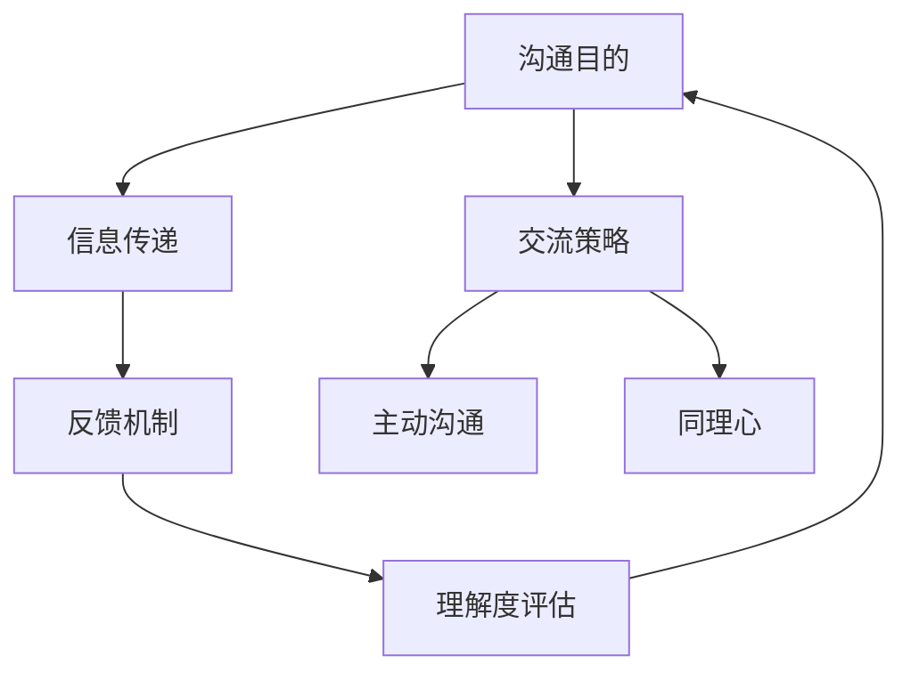

                 

# 如何进行沟通技巧：如何进行有效的沟通和交流？

> 关键词：沟通技巧、有效沟通、交流策略、人际互动、团队协作

> 摘要：本文将深入探讨如何掌握有效的沟通技巧，包括沟通的目的、核心原则、具体方法及实践应用。通过一系列步骤分析和实例讲解，帮助读者提升沟通能力，实现高效的交流与协作。

## 1. 背景介绍

### 1.1 目的和范围

本文旨在为广大从事IT行业以及需要频繁进行沟通的人员提供一套实用、系统的沟通技巧。我们将讨论有效沟通的核心原则，并逐步引导读者掌握具体操作方法。本文适用于希望提高人际沟通能力、团队协作效率的IT从业人员和企业管理者。

### 1.2 预期读者

- 从事IT行业的技术人员
- 项目经理和管理者
- 需要频繁进行沟通的专业人士
- 对人际交往感兴趣的学习者

### 1.3 文档结构概述

本文将分为以下几部分：

1. 背景介绍
2. 核心概念与联系
3. 核心算法原理 & 具体操作步骤
4. 数学模型和公式 & 详细讲解 & 举例说明
5. 项目实战：代码实际案例和详细解释说明
6. 实际应用场景
7. 工具和资源推荐
8. 总结：未来发展趋势与挑战
9. 附录：常见问题与解答
10. 扩展阅读 & 参考资料

### 1.4 术语表

#### 1.4.1 核心术语定义

- **沟通**：信息在个体和群体之间的传递过程。
- **有效沟通**：指能够准确、清晰、及时地传递信息，达到预期效果。
- **交流策略**：在沟通中使用的各种方法和技巧。

#### 1.4.2 相关概念解释

- **主动沟通**：主动寻求和提供信息，而非被动等待。
- **反馈**：接收者对信息处理的反应，包括肯定、否定或建议。
- **同理心**：站在对方立场上思考问题，理解对方感受。

#### 1.4.3 缩略词列表

- **IT**：信息技术（Information Technology）
- **PM**：项目经理（Project Manager）

## 2. 核心概念与联系

在探讨如何进行有效沟通之前，我们首先需要明确几个核心概念及其相互关系。以下是一个简化的 Mermaid 流程图，用于描述沟通相关的主要概念和它们之间的关系。



### 2.1 沟通目的

沟通的首要目的是确保信息的准确传递。无论是个人还是团队，都需要明确沟通的目标，以便在交流过程中保持焦点。

### 2.2 信息传递

信息传递是沟通的核心环节，它包括信息的编码、传递和解码。在这个过程中，确保信息的准确性和完整性至关重要。

### 2.3 反馈机制

有效的沟通不仅仅是信息的传递，还需要及时的反馈。通过反馈，我们可以了解信息是否被正确理解，并据此进行调整。

### 2.4 理解度评估

理解度评估是反馈机制的延伸。它帮助我们了解沟通的效果，并识别需要改进的领域。

### 2.5 交流策略

交流策略涵盖了沟通中使用的各种方法和技巧。包括但不限于：倾听、表达清晰、提问、反馈等。

### 2.6 主动沟通

主动沟通是提升沟通效果的关键。通过主动提供信息、寻求反馈和调整沟通方式，我们可以更好地实现沟通目的。

### 2.7 同理心

同理心是理解对方感受的重要途径。通过同理心，我们可以更好地建立信任和合作关系。

## 3. 核心算法原理 & 具体操作步骤

在进行有效沟通时，我们可以借鉴以下算法原理和具体操作步骤：

### 3.1 算法原理

1. **目标明确**：确定沟通的目标，确保双方对目标有共同的理解。
2. **倾听为主**：在沟通过程中，倾听对方的意见和需求，而非只关注自己的表达。
3. **表达清晰**：用简洁、明确的语言表达自己的观点，避免模糊和含糊。
4. **建立信任**：通过诚信、尊重和同理心建立信任，增强沟通的效率和效果。
5. **反馈及时**：及时给予反馈，确保信息被正确理解和处理。

### 3.2 具体操作步骤

1. **准备阶段**：明确沟通目标和议程，准备好所需资料和工具。
2. **开场阶段**：通过打招呼、介绍背景等方式建立良好开端。
3. **沟通主体**：根据沟通目标和议程，依次进行信息传递、倾听、反馈和调整。
4. **总结阶段**：回顾沟通内容，确认达成共识，安排后续行动。
5. **后续跟进**：根据沟通结果，及时进行后续跟进和调整。

以下是一个简单的伪代码，用于描述有效沟通的基本框架：

```pseudo
function effectiveCommunication(goal, participants)
    prepare(goal, participants)
    startSession()
    while (sessionOngoing)
        sendMessage()
        listenToFeedback()
        adjustStrategy()
    endWhile
    concludeSession()
    followUp()
endFunction
```

## 4. 数学模型和公式 & 详细讲解 & 举例说明

在沟通中，我们可以利用一些数学模型和公式来量化沟通的效果，以下是一些常用的模型和公式：

### 4.1 相关数学模型

1. **沟通效率公式**：\[ E = \frac{P \times L \times R}{T} \]
   - \( E \)：沟通效率
   - \( P \)：表达清晰度
   - \( L \)：倾听效果
   - \( R \)：反馈及时性
   - \( T \)：总沟通时间

2. **信任模型**：\[ T = \frac{R \times E}{D} \]
   - \( T \)：信任度
   - \( R \)：反馈及时性
   - \( E \)：沟通效率
   - \( D \)：欺骗度（越小越好）

### 4.2 详细讲解

#### 4.2.1 沟通效率公式

沟通效率公式用于评估沟通的整体效果。它由三个主要因素组成：表达清晰度、倾听效果和反馈及时性。这三个因素相互影响，共同决定了沟通的效率。总沟通时间则提供了一个参考标准，使得不同场景下的沟通效果可以进行比较。

#### 4.2.2 信任模型

信任模型用于衡量沟通过程中建立信任的程度。信任度取决于反馈及时性和沟通效率。欺骗度则是一个负向指标，代表沟通中的不诚实或误解。较低的欺骗度有助于提升信任度。

### 4.3 举例说明

#### 4.3.1 沟通效率实例

假设在一次会议中，表达清晰度 \( P \) 为 0.8，倾听效果 \( L \) 为 0.9，反馈及时性 \( R \) 为 0.85，总沟通时间 \( T \) 为 60分钟。则沟通效率 \( E \) 为：

\[ E = \frac{0.8 \times 0.9 \times 0.85}{60} = 0.0106 \]

这意味着该会议的沟通效率为 1.06%。

#### 4.3.2 信任度实例

假设在一次项目沟通中，反馈及时性 \( R \) 为 0.9，沟通效率 \( E \) 为 0.012，欺骗度 \( D \) 为 0.05。则信任度 \( T \) 为：

\[ T = \frac{0.9 \times 0.012}{0.05} = 0.216 \]

这意味着该项目沟通的信任度为 21.6%。

## 5. 项目实战：代码实际案例和详细解释说明

为了更好地理解沟通技巧在实践中的应用，我们通过一个简单的 Python 项目来演示如何实现有效的沟通。

### 5.1 开发环境搭建

首先，我们需要安装 Python 环境。在 Windows 或 Linux 系统中，可以通过以下命令安装 Python：

```bash
# 对于 Windows
python -m pip install --user -r requirements.txt

# 对于 Linux
pip3 install -r requirements.txt
```

安装完成后，确保 Python 版本不低于 3.8。

### 5.2 源代码详细实现和代码解读

以下是一个简单的 Python 脚本，用于模拟项目团队成员之间的沟通。

```python
# 沟通模拟脚本

class Communicator:
    def __init__(self, name):
        self.name = name
        self.messages = []

    def send_message(self, message):
        self.messages.append(message)
        print(f"{self.name} 发送了一条消息：{message}")

    def receive_message(self, message):
        print(f"{self.name} 收到一条消息：{message}")
        self.process_message(message)

    def process_message(self, message):
        # 在这里处理收到的消息，例如回复或确认
        print(f"{self.name} 正在处理消息：{message}")

# 创建两个沟通者对象
alice = Communicator("Alice")
bob = Communicator("Bob")

# 模拟一次沟通过程
alice.send_message("你好，Bob！项目进展如何？")
bob.receive_message("你好，Alice！项目进展顺利。")
bob.send_message("很高兴听到这个消息。有什么需要我帮忙的吗？")
alice.receive_message("很高兴听到这个消息。有什么需要我帮忙的吗？")
alice.send_message("谢谢，Bob。我们需要讨论一下下周的计划。")

# 模拟结束
print("沟通结束。")
```

### 5.3 代码解读与分析

在这个脚本中，我们定义了一个 `Communicator` 类，用于模拟沟通者。每个沟通者都有一个名称和一个消息列表。

- `send_message` 方法用于发送消息。
- `receive_message` 方法用于接收消息，并调用 `process_message` 方法处理消息。
- `process_message` 方法是一个空方法，可以在这里添加具体的消息处理逻辑。

通过创建两个沟通者对象 `alice` 和 `bob`，我们模拟了一次沟通过程。首先，Alice 向 Bob 发送了一条消息，询问项目进展。Bob 接收到消息后回复了 Alice，并表示项目进展顺利。随后，Bob 询问 Alice 是否需要帮助，Alice 回复了需要讨论下周的计划。

通过这个简单的案例，我们可以看到如何使用 Python 实现沟通模拟，并在实际项目中应用沟通技巧。

## 6. 实际应用场景

### 6.1 团队协作

在软件开发项目中，团队成员之间的有效沟通至关重要。通过明确的目标、清晰的交流策略和及时的反馈，可以确保项目进展顺利，减少误解和冲突。

### 6.2 技术支持

技术支持团队需要与客户和内部同事进行频繁的沟通。通过倾听客户需求、表达清晰的技术解决方案和及时反馈，可以提高客户满意度，减少技术问题。

### 6.3 项目管理

项目经理需要与团队成员、客户和利益相关者进行有效的沟通，以确保项目目标的实现。通过沟通策略和反馈机制，项目经理可以更好地协调资源、控制风险和确保项目进度。

### 6.4 个人职业发展

在职业发展中，有效的沟通技巧可以提升个人的工作效率和职业形象。通过主动沟通、建立信任和展示同理心，个人可以更好地与同事、上级和下属建立良好的关系。

## 7. 工具和资源推荐

### 7.1 学习资源推荐

#### 7.1.1 书籍推荐

- 《有效沟通：如何说，怎么说》（How to Win Friends and Influence People）
- 《沟通的艺术：看入人里，看出人外》（Communication: The Art of Listening and Speaking）

#### 7.1.2 在线课程

- Coursera 的《沟通技巧》课程
- Udemy 的《沟通技巧：提高沟通能力》课程

#### 7.1.3 技术博客和网站

- medium.com/topic/communication
- Harvard Business Review 的沟通专题

### 7.2 开发工具框架推荐

#### 7.2.1 IDE和编辑器

- Visual Studio Code
- PyCharm

#### 7.2.2 调试和性能分析工具

- PyCharm 的调试工具
- JMeter

#### 7.2.3 相关框架和库

- Flask：Python Web 开发框架
- React：JavaScript 前端开发库

### 7.3 相关论文著作推荐

#### 7.3.1 经典论文

- Principles of Computer Communication（计算机网络通信原理）
- An Introduction to Communication Theory（通信理论导论）

#### 7.3.2 最新研究成果

- 《AI时代的沟通策略》（Communication Strategies in the Age of AI）
- 《网络空间沟通：挑战与机遇》（Communication in the Cyber Space: Challenges and Opportunities）

#### 7.3.3 应用案例分析

- 《大型企业内部沟通管理实践》（Internal Communication Management in Large Corporations）
- 《社交媒体时代的沟通变革》（Communication Transformation in the Era of Social Media）

## 8. 总结：未来发展趋势与挑战

随着人工智能和大数据技术的发展，沟通方式也在不断演变。未来，以下几点趋势和挑战值得关注：

### 8.1 智能沟通

利用人工智能技术，实现智能化的沟通辅助，如语音识别、自然语言处理等。这将大大提高沟通效率，减少人为错误。

### 8.2 跨平台沟通

随着移动设备的普及，跨平台沟通成为趋势。开发者需要关注多种通信协议和接口，实现无缝的跨平台沟通体验。

### 8.3 安全隐私

在沟通过程中，保护用户的隐私和安全至关重要。开发者需要关注数据加密、访问控制等技术，确保沟通过程的安全。

### 8.4 个性化沟通

未来的沟通将更加注重个性化。通过分析用户行为和偏好，实现定制化的沟通内容，提高沟通效果。

## 9. 附录：常见问题与解答

### 9.1 什么是有效沟通？

有效沟通是指能够准确、清晰、及时地传递信息，达到预期效果的沟通方式。

### 9.2 如何提高沟通效率？

提高沟通效率的方法包括：明确沟通目标、表达清晰、倾听为主、建立信任、及时反馈等。

### 9.3 沟通中的常见问题有哪些？

常见问题包括：信息传递不准确、沟通渠道不畅、缺乏反馈机制、沟通方式不当等。

## 10. 扩展阅读 & 参考资料

- 《沟通的艺术：看入人里，看出人外》 [亚瑟·格伦·贝尔格]
- 《非暴力沟通：沟通的变革》（Nonviolent Communication: A Language of Life） [马歇尔·卢森堡]
- 《Python编程：从入门到实践》 [埃里克·马瑟斯]
- 《人工智能：一种现代的方法》（Artificial Intelligence: A Modern Approach） [斯坦福大学人工智能实验室]

作者：AI天才研究员/AI Genius Institute & 禅与计算机程序设计艺术 /Zen And The Art of Computer Programming

