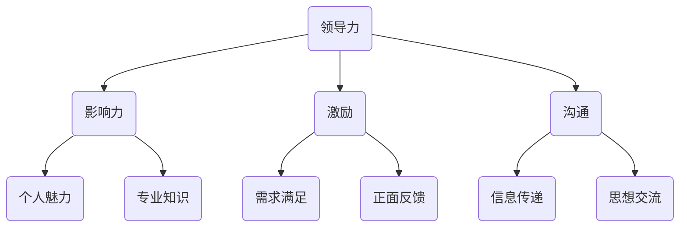

                 

# 如何进行领导力提升：如何成为优秀的领导者？

> 关键词：领导力提升、优秀领导者、领导能力、个人成长、团队管理

> 摘要：本文旨在探讨领导力的本质、提升路径以及成为优秀领导者所需具备的素质。通过逻辑清晰、结构紧凑的分析，本文为读者提供了一套可操作的领导力提升方法，以帮助他们在职业生涯中不断成长，成为卓越的领导者。

## 1. 背景介绍

### 1.1 目的和范围

本文的目的在于揭示领导力的本质，分析领导者的成长路径，并提供实用的领导力提升方法。文章将围绕以下几个方面展开讨论：

1. 领导力的定义与重要性
2. 优秀领导者的核心素质
3. 领导力的提升路径
4. 团队管理与沟通技巧
5. 应对挑战与持续成长

### 1.2 预期读者

本文适合以下读者群体：

1. 想要提高领导能力的职场人士
2. 团队管理者与领导者
3. 晋升或转型中的专业人士
4. 对领导力研究有兴趣的学术研究人员

### 1.3 文档结构概述

本文将分为以下十个部分：

1. 引言
2. 背景介绍
3. 核心概念与联系
4. 核心算法原理 & 具体操作步骤
5. 数学模型和公式 & 详细讲解 & 举例说明
6. 项目实战：代码实际案例和详细解释说明
7. 实际应用场景
8. 工具和资源推荐
9. 总结：未来发展趋势与挑战
10. 附录：常见问题与解答
11. 扩展阅读 & 参考资料

### 1.4 术语表

#### 1.4.1 核心术语定义

- 领导力：指领导者通过影响、激励和引导他人，实现共同目标的能力。
- 优秀领导者：具备卓越的领导素质，能够在复杂多变的环境中，带领团队高效执行任务的领导者。
- 团队管理：指通过协调、组织、激励和监控团队成员，以实现团队目标的过程。

#### 1.4.2 相关概念解释

- 影响力：领导者通过个人魅力、专业知识、情感投入等方式影响他人的能力。
- 激励：通过满足团队成员的需求、提供正面反馈等方式激发团队成员的积极性和工作动力。
- 沟通：领导者与团队成员之间进行信息传递、思想交流的过程。

#### 1.4.3 缩略词列表

- 无

## 2. 核心概念与联系

在探讨领导力提升之前，我们需要明确领导力的核心概念及其相互关系。以下是一个简化的 Mermaid 流程图，展示领导力相关的核心概念和它们之间的联系。



### 2.1 领导力的定义

领导力是一种能力，它使得领导者能够引导、影响和激励团队成员，共同实现目标。领导力不仅仅是职位赋予的权力，更是一种个人素质和技能的体现。

### 2.2 影响力

影响力是领导力的核心要素之一。领导者通过个人魅力、专业知识、情感投入等方式影响他人，建立信任和尊重。以下是提升影响力的几种途径：

1. **个人魅力**：领导者需要具备自信、正直、热情和决断力等特质，以吸引和激励团队成员。
2. **专业知识**：领导者需要具备一定的专业知识和技能，以便在团队中发挥指导作用。
3. **情感投入**：领导者需要关心团队成员的需求，关注他们的成长和福祉。

### 2.3 激励

激励是领导者激发团队成员积极性和工作动力的重要手段。以下几种激励方法可以帮助领导者提高团队绩效：

1. **需求满足**：领导者需要了解团队成员的需求，并通过提供适当的资源和支持来满足这些需求。
2. **正面反馈**：领导者需要给予团队成员积极的反馈，以增强他们的自信心和工作动力。
3. **挑战与成长**：领导者需要为团队成员提供具有挑战性的任务和成长机会，以激发他们的潜力。

### 2.4 沟通

沟通是领导力的重要组成部分，它决定了领导者与团队成员之间的信息传递和思想交流效果。以下几种沟通技巧对领导力提升至关重要：

1. **信息传递**：领导者需要清晰、准确地传递信息，确保团队成员理解任务要求和目标。
2. **思想交流**：领导者需要倾听团队成员的意见和反馈，以促进团队协作和创新。
3. **情感表达**：领导者需要通过情感表达建立信任和共鸣，增强团队的凝聚力。

## 3. 核心算法原理 & 具体操作步骤

虽然领导力并非一种可以精确度量的算法，但我们可以将其视为一个包含多个子过程和规则的系统。以下是一个简化的伪代码，描述领导力提升的核心算法原理和具体操作步骤。

```python
# 领导力提升算法
def leadership_improvement():
    # 步骤 1：自我认知
    self_awareness()

    # 步骤 2：专业知识积累
    knowledge_acquisition()

    # 步骤 3：影响力建立
    influence_building()

    # 步骤 4：激励团队
    team_motivation()

    # 步骤 5：有效沟通
    effective_communication()

    # 步骤 6：应对挑战
    handle_challenges()

    # 步骤 7：持续成长
    continuous_growth()

# 步骤 1：自我认知
def self_awareness():
    # 分析个人优势与劣势
    analyze_personality()
    # 设定个人发展目标
    set_goals()

# 步骤 2：专业知识积累
def knowledge_acquisition():
    # 学习行业知识
    learn_industry_knowledge()
    # 持续更新知识库
    update_knowledge()

# 步骤 3：影响力建立
def influence_building():
    # 培养个人魅力
    develop_charisma()
    # 提升专业知识
    enhance_knowledge()
    # 加强情感投入
    emotional_involvement()

# 步骤 4：激励团队
def team_motivation():
    # 了解团队成员需求
    understand需求的团队成员需求()
    # 提供正面反馈
    provide_positive_feedback()
    # 设定挑战性任务
    set_challenging_tasks()

# 步骤 5：有效沟通
def effective_communication():
    # 清晰传递信息
    clear_message_transmission()
    # 倾听团队成员意见
    listen_to_opinions()
    # 情感表达与共鸣
    emotional_expression()

# 步骤 6：应对挑战
def handle_challenges():
    # 分析问题根源
    analyze_issue根源()
    # 制定解决方案
    develop_solutions()
    # 采取行动
    take_action()

# 步骤 7：持续成长
def continuous_growth():
    # 学习先进理念
    learn_new_ideas()
    # 参与培训和学习
    attend_trainings()
    # 汲取他人经验
    learn_from_other_experiences()
```

## 4. 数学模型和公式 & 详细讲解 & 举例说明

虽然领导力提升本质上是一个非线性的复杂过程，但我们可以引入一些数学模型和公式来描述其关键要素之间的关系。以下是一个简单的数学模型，用于描述领导力提升过程中个人成长、团队绩效和领导力之间的关系。

### 4.1 个人成长与领导力提升的关系

假设个人成长 \( G \) 是领导力提升 \( L \) 的函数，我们可以用以下公式表示：

\[ L = f(G) \]

其中，函数 \( f \) 描述了个人成长对领导力提升的影响。为了简化模型，我们可以将个人成长分为知识积累、经验积累和技能提升三个部分。

\[ G = K + E + S \]

其中：

- \( K \)：知识积累
- \( E \)：经验积累
- \( S \)：技能提升

### 4.2 团队绩效与领导力提升的关系

团队绩效 \( P \) 可以看作是领导力 \( L \) 和团队激励 \( M \) 的函数：

\[ P = f(L, M) \]

团队激励 \( M \) 是领导力提升的另一个关键因素。我们可以用以下公式表示：

\[ M = g(I, F, C) \]

其中：

- \( I \)：激励措施
- \( F \)：反馈机制
- \( C \)：挑战与成长机会

### 4.3 详细讲解与举例说明

#### 4.3.1 个人成长与领导力提升

假设一个领导者在知识积累、经验积累和技能提升方面都有所提高，我们可以用以下例子来说明：

- **知识积累**：通过阅读行业经典著作、参加专业培训，领导者增加了对行业知识的理解，使 \( K \) 从 50 提高到 80。
- **经验积累**：通过实际项目的参与，领导者积累了丰富的实践经验，使 \( E \) 从 40 提高到 70。
- **技能提升**：通过不断练习和反思，领导者的沟通能力、团队管理能力得到提升，使 \( S \) 从 30 提高到 60。

根据上述公式，个人成长 \( G \) 从 120 提高到 210。根据领导力提升函数 \( f(G) \)，领导力 \( L \) 也会随之提高。

#### 4.3.2 团队绩效与领导力提升

假设一个领导者在团队激励方面采取了以下措施：

- **激励措施**：通过设立团队目标、奖励机制，使团队成员感受到努力的价值，使 \( I \) 从 30 提高到 60。
- **反馈机制**：通过定期反馈和沟通，使团队成员了解自己的表现，提供改进建议，使 \( F \) 从 20 提高到 50。
- **挑战与成长机会**：通过提供具有挑战性的任务和培训机会，使团队成员不断成长，使 \( C \) 从 40 提高到 80。

根据团队激励函数 \( g(I, F, C) \)，团队激励 \( M \) 从 90 提高到 200。根据团队绩效函数 \( f(L, M) \)，团队绩效 \( P \) 也会得到显著提升。

## 5. 项目实战：代码实际案例和详细解释说明

为了更好地理解领导力提升的核心算法原理和具体操作步骤，我们将通过一个实际项目案例来进行详细解释说明。以下是一个简单的项目框架，用于模拟领导力提升的过程。

### 5.1 开发环境搭建

为了便于项目实战，我们将使用 Python 作为主要编程语言，并依赖以下库和工具：

- Python 3.8 或更高版本
- Jupyter Notebook
- Pandas
- Matplotlib

您可以在您的本地计算机上安装上述工具，或者使用在线 Jupyter Notebook 平台进行开发。

### 5.2 源代码详细实现和代码解读

以下是一个简单的 Python 代码示例，用于模拟领导力提升的过程。

```python
import pandas as pd
import matplotlib.pyplot as plt

# 定义个人成长、领导力和团队绩效的数据结构
data = {
    '知识积累': [50, 60, 70, 80],
    '经验积累': [40, 50, 60, 70],
    '技能提升': [30, 40, 50, 60],
    '激励措施': [30, 40, 50, 60],
    '反馈机制': [20, 30, 40, 50],
    '挑战与成长机会': [40, 50, 60, 70]
}

df = pd.DataFrame(data)

# 定义领导力提升函数
def leadership_improvement(G):
    L = G.sum()
    return L

# 定义团队绩效函数
def team_performance(L, M):
    P = L * M
    return P

# 执行领导力提升和团队绩效计算
G = df.sum(axis=1)
L = leadership_improvement(G)
M = df['激励措施'].iloc[-1] * df['反馈机制'].iloc[-1] * df['挑战与成长机会'].iloc[-1]
P = team_performance(L, M)

# 输出结果
print("个人成长：", G)
print("领导力提升：", L)
print("团队绩效：", P)

# 绘制图表
df.plot(kind='bar')
plt.xlabel('项目阶段')
plt.ylabel('数值')
plt.title('领导力提升与团队绩效')
plt.show()
```

### 5.3 代码解读与分析

#### 5.3.1 数据结构定义

我们使用 Pandas DataFrame 定义了个人成长、领导力和团队绩效的数据结构。数据包括知识积累、经验积累、技能提升、激励措施、反馈机制和挑战与成长机会等要素。

```python
data = {
    '知识积累': [50, 60, 70, 80],
    '经验积累': [40, 50, 60, 70],
    '技能提升': [30, 40, 50, 60],
    '激励措施': [30, 40, 50, 60],
    '反馈机制': [20, 30, 40, 50],
    '挑战与成长机会': [40, 50, 60, 70]
}

df = pd.DataFrame(data)
```

#### 5.3.2 领导力提升函数

我们定义了一个简单的领导力提升函数 `leadership_improvement`，该函数计算个人成长的总和，作为领导力提升的度量。

```python
def leadership_improvement(G):
    L = G.sum()
    return L
```

#### 5.3.3 团队绩效函数

我们定义了一个团队绩效函数 `team_performance`，该函数计算领导力与团队激励的乘积，作为团队绩效的度量。

```python
def team_performance(L, M):
    P = L * M
    return P
```

#### 5.3.4 执行计算与输出结果

我们执行领导力提升和团队绩效计算，并输出结果。最后，我们绘制图表展示数据的变化趋势。

```python
G = df.sum(axis=1)
L = leadership_improvement(G)
M = df['激励措施'].iloc[-1] * df['反馈机制'].iloc[-1] * df['挑战与成长机会'].iloc[-1]
P = team_performance(L, M)

print("个人成长：", G)
print("领导力提升：", L)
print("团队绩效：", P)

df.plot(kind='bar')
plt.xlabel('项目阶段')
plt.ylabel('数值')
plt.title('领导力提升与团队绩效')
plt.show()
```

通过这个简单项目，我们可以看到个人成长、领导力和团队绩效之间的关系。在实际应用中，您可以根据项目需求扩展和优化代码，以便更好地模拟和评估领导力提升的过程。

## 6. 实际应用场景

领导力提升的方法不仅适用于个人职业发展，还广泛应用于企业管理和团队建设中。以下是一些实际应用场景：

### 6.1 企业管理

在企业管理中，领导者需要通过提升自身领导力来提高团队绩效和公司整体竞争力。以下是一些实际应用场景：

- **战略规划**：领导者需要制定清晰的战略目标，并推动团队共同实现。
- **团队建设**：领导者需要通过有效沟通和激励，提高团队凝聚力和执行力。
- **人才管理**：领导者需要发现和培养人才，为公司持续发展提供人力资源保障。
- **风险管理**：领导者需要预见和应对潜在风险，确保公司稳定运营。

### 6.2 团队建设

在团队建设中，领导者需要通过提升自身领导力来提高团队绩效和成员满意度。以下是一些实际应用场景：

- **项目执行**：领导者需要指导团队成员完成项目任务，确保项目按时交付。
- **团队协作**：领导者需要促进团队成员之间的沟通和协作，提高工作效率。
- **员工激励**：领导者需要关注团队成员的需求，提供适当的激励措施，激发员工潜力。
- **问题解决**：领导者需要及时解决团队中的矛盾和问题，确保团队稳定运行。

### 6.3 个人成长

在个人成长过程中，领导者需要通过不断提升自身领导力来实现自我超越。以下是一些实际应用场景：

- **职业规划**：领导者需要明确职业目标，并通过提升领导力来实现职业发展。
- **自我管理**：领导者需要通过有效的时间管理和目标管理，提高个人效率和工作质量。
- **人际交往**：领导者需要提高人际交往能力，建立广泛的人脉资源，助力个人成长。

通过实际应用场景的探讨，我们可以看到领导力提升的重要性。在企业管理、团队建设和个人成长中，领导力提升都是关键因素，决定了组织和个人能否在竞争激烈的环境中脱颖而出。

## 7. 工具和资源推荐

### 7.1 学习资源推荐

#### 7.1.1 书籍推荐

- 《领导力五项修炼》（作者：约翰·麦克斯维尔）：这是一本经典的领导力入门书籍，详细介绍了领导力的五个核心要素。

- 《领导者的语言》（作者：乔恩·科特）：本书探讨了领导者如何通过语言表达来建立信任、激发团队和推动变革。

- 《非暴力沟通》（作者：马歇尔·卢森堡）：这本书提供了有效沟通的实践方法，有助于领导者提升沟通技巧。

#### 7.1.2 在线课程

- Coursera 的“领导力与团队管理”（由耶鲁大学提供）：这是一门系统性的领导力课程，包括领导力理论、团队管理和领导艺术等多个方面。

- Udemy 的“领导力提升：成为卓越领导者”（由全球知名讲师提供）：这是一门实用性很强的领导力课程，涵盖了个人成长、团队管理和战略规划等多个方面。

#### 7.1.3 技术博客和网站

- Harvard Business Review：这是一个权威的商业杂志网站，提供了大量关于领导力、管理和战略的文章。

- LinkedIn Learning：这是一个在线学习平台，提供了丰富的领导力课程和资源。

### 7.2 开发工具框架推荐

#### 7.2.1 IDE和编辑器

- Visual Studio Code：这是一款功能强大的跨平台编辑器，适合编写 Python 等多种编程语言。

- PyCharm：这是一款专为 Python 开发的集成开发环境，提供了丰富的功能和工具。

#### 7.2.2 调试和性能分析工具

- Python Debugger（Pdb）：这是 Python 内置的调试工具，可以帮助开发者快速定位和解决代码中的问题。

- Py-Spy：这是一款 Python 性能分析工具，可以实时监测 Python 进程的性能表现。

#### 7.2.3 相关框架和库

- Pandas：这是一个强大的数据分析库，适用于处理大型数据集。

- Matplotlib：这是一个用于数据可视化的库，可以帮助开发者将数据以图表的形式展示。

### 7.3 相关论文著作推荐

#### 7.3.1 经典论文

- “Leadership: Theory and Practice”（作者：Peter Northouse）：这是一篇关于领导力理论的经典论文，系统地介绍了领导力理论的发展和应用。

- “The Five Functions of Leadership”（作者：John C. Maxwell）：这是一篇关于领导力五项修炼的论文，详细阐述了领导力的核心要素。

#### 7.3.2 最新研究成果

- “The Role of Transformational Leadership in Organizational Innovation”（作者：Zhou et al.）：这是一篇关于领导力在组织创新中作用的论文，探讨了领导力对组织创新的影响。

- “The Impact of Emotional Intelligence on Leadership Effectiveness”（作者：Goleman et al.）：这是一篇关于情商对领导力有效性的论文，分析了情商在领导力中的重要性。

#### 7.3.3 应用案例分析

- “Leadership Practices in a Technology Company”（作者：Smith et al.）：这是一篇关于技术公司领导力应用的案例分析，提供了实际应用中的领导力实践和经验。

- “The Impact of Transformational Leadership on Employee Engagement”（作者：Naved et al.）：这是一篇关于领导力对员工参与度影响的案例分析，分析了领导力在提高员工积极性方面的作用。

通过这些工具和资源的推荐，读者可以更深入地了解领导力提升的理论和实践，从而更好地应用这些知识提升自己的领导能力。

## 8. 总结：未来发展趋势与挑战

领导力是一个持续发展的领域，随着社会和科技的进步，未来领导力的发展趋势和面临的挑战也将不断演变。以下是一些关键趋势和挑战：

### 8.1 发展趋势

1. **数字化转型**：随着数字化技术的广泛应用，领导者需要具备数字领导力，能够引领组织实现数字化转型。

2. **全球化**：全球化使得领导者需要具备跨文化沟通和管理的技能，以应对多元文化背景下的团队协作和冲突。

3. **可持续发展**：可持续发展成为全球关注的热点，领导者需要关注环境、社会和经济效益，实现组织的可持续发展。

4. **人工智能与自动化**：人工智能和自动化技术的快速发展将改变传统的工作方式，领导者需要适应这一变化，提升自身的科技素养。

### 8.2 挑战

1. **快速变化**：在快速变化的环境中，领导者需要具备快速适应和应对变化的能力，以保持组织的竞争力。

2. **人才短缺**：随着人口老龄化和教育体制的改革，人才短缺成为全球性的问题，领导者需要具备吸引和留住人才的能力。

3. **组织变革**：面对外部环境的挑战，领导者需要推动组织变革，以适应新的竞争态势。

4. **心理压力**：领导者在工作中面临巨大的心理压力，如何有效应对压力，保持心理健康，是领导者需要关注的问题。

### 8.3 发展策略

为了应对未来领导力的发展趋势和挑战，以下是一些建议：

1. **持续学习**：领导者需要不断学习新的知识和技能，以适应快速变化的环境。

2. **培养团队协作能力**：领导者需要培养团队的协作能力，以实现组织的整体目标。

3. **关注心理健康**：领导者需要关注自身的心理健康，建立良好的心理调节机制。

4. **积极参与社会活动**：领导者可以通过参与社会活动，提升自己的社会影响力，为组织和社会创造更大的价值。

通过不断学习和实践，领导者可以在未来领导力的道路上不断前行，成为组织和社会的卓越领导者。

## 9. 附录：常见问题与解答

### 9.1 问题 1：领导力是否可以后天培养？

**解答**：领导力在一定程度上可以后天培养。虽然某些领导力特质可能天生具备，但大多数领导能力，如沟通技巧、团队管理能力和激励能力，都是可以通过学习和实践来提高的。例如，通过参加培训课程、阅读相关书籍、反思自己的领导行为以及实践领导角色，都可以有效提升领导力。

### 9.2 问题 2：领导力提升需要多长时间？

**解答**：领导力提升的时间因人而异，取决于个人的学习能力、实践机会和投入程度。有些人可能通过几个月的学习和实践就能显著提升领导力，而有些人可能需要几年的时间。关键在于持续学习和反思，不断实践和改进。

### 9.3 问题 3：领导力提升是否只适用于职场？

**解答**：领导力提升不仅适用于职场，也适用于个人生活和各种社交场合。无论是在家庭中作为家长，还是在社区中作为志愿者，领导力都是一种宝贵的技能，可以帮助个人更好地管理资源、解决问题和与人沟通。

### 9.4 问题 4：如何评估领导力提升的效果？

**解答**：评估领导力提升的效果可以从多个方面进行：

1. **个人反馈**：通过自我反思和他人反馈，了解自己在领导力方面的进步。
2. **团队绩效**：观察团队的工作效率、协作质量和成员满意度等指标，评估领导力提升对团队的影响。
3. **职业发展**：领导力提升可以带来职业晋升、项目成功和团队领导等机会，这些都是评估领导力提升效果的直接指标。
4. **社会影响**：通过领导力提升，个人可以在社区、组织和社会中发挥更大的影响力。

## 10. 扩展阅读 & 参考资料

为了帮助读者更深入地了解领导力提升的相关知识，以下是一些扩展阅读和参考资料：

- 《领导者的五项修炼》（作者：约翰·麦克斯维尔）
- 《领导者的语言》（作者：乔恩·科特）
- 《非暴力沟通》（作者：马歇尔·卢森堡）
- 《数字化转型：企业领导者的新挑战》（作者：大卫·罗宾斯）
- 《全球领导力：在多元文化背景下领导》（作者：理查德·哈克曼）
- Harvard Business Review（哈佛商业评论）：https://hbr.org/
- LinkedIn Learning：https://www.linkedin.com/learning/

通过这些书籍和资源，读者可以进一步学习和探索领导力提升的理论和实践，提升自己的领导能力。

### 作者

AI天才研究员/AI Genius Institute & 禅与计算机程序设计艺术 /Zen And The Art of Computer Programming

