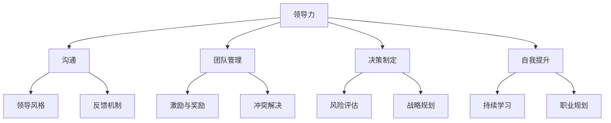

                 

# 如何进行领导力提升：如何成为优秀的领导者？

> 关键词：领导力，领导者，管理，团队，沟通，自我提升

> 摘要：本文将探讨领导力的提升之道，帮助读者理解成为优秀领导者所需的核心技能和素质。我们将通过理论分析、实战案例和实用工具的推荐，逐步解答如何成为一名卓越的领导者。

## 1. 背景介绍

### 1.1 目的和范围

本文旨在为那些希望提升领导力水平，成为一名优秀的领导者的人提供指导。我们将从理论、实践和工具三个层面来探讨领导力的提升。

### 1.2 预期读者

- 管理人员
- 想提升领导力的专业人士
- 领导力爱好者

### 1.3 文档结构概述

本文分为以下部分：

1. 背景介绍
2. 核心概念与联系
3. 核心算法原理 & 具体操作步骤
4. 数学模型和公式 & 详细讲解 & 举例说明
5. 项目实战：代码实际案例和详细解释说明
6. 实际应用场景
7. 工具和资源推荐
8. 总结：未来发展趋势与挑战
9. 附录：常见问题与解答
10. 扩展阅读 & 参考资料

### 1.4 术语表

#### 1.4.1 核心术语定义

- **领导力**：指领导者影响、激励和引导团队实现共同目标的能力。
- **领导者**：负责指导和领导团队的人。
- **团队**：共同为实现某个目标而协作的一组人。

#### 1.4.2 相关概念解释

- **沟通**：信息的交换和分享，是领导者与团队成员之间建立联系的关键。
- **自我提升**：通过不断学习和实践，提高自身素质和能力。

#### 1.4.3 缩略词列表

- **领导力（Leadership）**
- **团队（Team）**
- **沟通（Communication）**
- **自我提升（Self-improvement）**

## 2. 核心概念与联系

领导力不仅仅是一种能力，更是一种体系。下面我们将通过一个Mermaid流程图，展示领导力核心概念及其相互联系。



从这个流程图中，我们可以看出领导力涉及多个方面，包括沟通、团队管理、决策制定和自我提升。这些方面相互联系，共同构成了一个完整的领导力体系。

## 3. 核心算法原理 & 具体操作步骤

领导力的提升并非一蹴而就，而是一个持续的过程。下面，我们将通过伪代码来详细阐述提升领导力的具体操作步骤。

```plaintext
// 提升领导力伪代码

function improve_leadership() {
    // 学习领导力理论
    study_leadership_theory()

    // 提升沟通能力
    improve_communication()

    // 建立和管理团队
    build_and_manage_team()

    // 制定和执行决策
    make_and_execute_decisions()

    // 自我提升
    self_improvement()

    // 反馈与调整
    feedback_and_adjustment()

    // 持续学习
    continuous_learning()
}

function study_leadership_theory() {
    // 阅读相关书籍和论文
    read_books_and_papers()

    // 参加培训课程
    attend_training_courses()
}

function improve_communication() {
    // 学习沟通技巧
    learn_communication_skills()

    // 建立有效的沟通机制
    establish_effective_communication_mechanisms()
}

function build_and_manage_team() {
    // 确定团队目标和任务
    define_team_goals_and_tasks()

    // 激励与奖励团队成员
    motivate_and_reward_team_members()

    // 解决团队冲突
    resolve_team_conflicts()
}

function make_and_execute_decisions() {
    // 收集信息
    collect_information()

    // 评估风险
    assess_risk()

    // 制定战略
    make_strategy()

    // 执行决策
    execute_decision()
}

function self_improvement() {
    // 持续学习
    continuous_learning()

    // 职业规划
    career_planning()
}

function feedback_and_adjustment() {
    // 收集反馈
    collect_feedback()

    // 分析反馈
    analyze_feedback()

    // 调整策略
    adjust_strategy()
}

function continuous_learning() {
    // 阅读和学习新知识
    read_and_learn_new_knowledge()

    // 参与行业交流
    participate_in_industry_exchange()
}
```

通过这个伪代码，我们可以看到领导力的提升是一个多步骤、多环节的过程。每个步骤都需要精心策划和执行，以确保领导力的持续提升。

## 4. 数学模型和公式 & 详细讲解 & 举例说明

在领导力提升过程中，一些数学模型和公式可以帮助我们更好地理解和管理团队。下面，我们将介绍几个常用的模型和公式，并进行详细讲解和举例说明。

### 4.1 泰勒公式

泰勒公式是一种用于描述领导力提升过程的模型。它表示领导力提升的速度与当前领导力水平、学习速度和目标领导力水平之间的差异成正比。

$$
\text{领导力提升速度} = k \cdot (\text{目标领导力水平} - \text{当前领导力水平})
$$

其中，\( k \) 是学习速度常数。

#### 举例说明：

假设一位领导者的目标是达到80分的领导力水平，当前水平为60分，学习速度常数 \( k \) 为0.2。根据泰勒公式，我们可以计算出该领导者的领导力提升速度：

$$
\text{领导力提升速度} = 0.2 \cdot (80 - 60) = 4 \text{ 分/月}
$$

这意味着该领导者的领导力水平每月将提升4分。

### 4.2 沟通效率公式

沟通效率是衡量领导者与团队成员之间沟通效果的指标。沟通效率公式表示沟通效率与沟通频率、沟通质量和沟通目标之间的联系。

$$
\text{沟通效率} = \frac{\text{沟通质量} \cdot \text{沟通频率}}{\text{沟通目标}}
$$

其中，沟通质量、沟通频率和沟通目标均为0到1之间的数值。

#### 举例说明：

假设一位领导者的沟通频率为0.8，沟通质量为0.9，沟通目标为0.5。根据沟通效率公式，我们可以计算出该领导者的沟通效率：

$$
\text{沟通效率} = \frac{0.9 \cdot 0.8}{0.5} = 1.44
$$

这意味着该领导者的沟通效率为144%，表明他的沟通效果非常好。

### 4.3 决策效率公式

决策效率是衡量领导者决策效果的指标。决策效率公式表示决策效率与信息收集、风险评估和决策质量之间的联系。

$$
\text{决策效率} = \frac{\text{决策质量} \cdot (\text{信息收集} + \text{风险评估})}{1}
$$

其中，决策质量、信息收集和风险评估均为0到1之间的数值。

#### 举例说明：

假设一位领导者的决策质量为0.8，信息收集为0.7，风险评估为0.6。根据决策效率公式，我们可以计算出该领导者的决策效率：

$$
\text{决策效率} = 0.8 \cdot (0.7 + 0.6) = 1.36
$$

这意味着该领导者的决策效率为136%，表明他的决策效果非常好。

通过这些数学模型和公式，我们可以更准确地评估和提升领导力。在实际应用中，可以根据具体情况调整公式中的参数，以达到最佳效果。

## 5. 项目实战：代码实际案例和详细解释说明

在本节中，我们将通过一个实际案例来展示如何提升领导力，并提供代码实现和详细解释说明。

### 5.1 开发环境搭建

首先，我们需要搭建一个用于领导力提升的仿真环境。在本案例中，我们将使用Python编程语言来实现。

- 安装Python（版本3.8或以上）
- 安装必需的Python库：numpy、matplotlib

```bash
pip install numpy matplotlib
```

### 5.2 源代码详细实现和代码解读

下面是领导力提升的Python代码实现。

```python
import numpy as np
import matplotlib.pyplot as plt

# 定义领导力提升模型
class LeadershipImprovementModel:
    def __init__(self, current_leadership, target_leadership, learning_speed):
        self.current_leadership = current_leadership
        self.target_leadership = target_leadership
        self.learning_speed = learning_speed

    def update_leadership(self):
        improvement = self.learning_speed * (self.target_leadership - self.current_leadership)
        self.current_leadership += improvement
        return self.current_leadership

    def run_simulation(self, num_steps):
        leadership_levels = [self.current_leadership]
        for _ in range(num_steps):
            self.update_leadership()
            leadership_levels.append(self.current_leadership)
        return leadership_levels

# 初始化模型参数
current_leadership = 60  # 当前领导力水平
target_leadership = 80  # 目标领导力水平
learning_speed = 0.2  # 学习速度常数

# 创建模型实例
model = LeadershipImprovementModel(current_leadership, target_leadership, learning_speed)

# 运行仿真
num_steps = 12  # 模拟时间（月）
leadership_levels = model.run_simulation(num_steps)

# 可视化结果
plt.plot(range(1, num_steps + 1), leadership_levels)
plt.xlabel('Month')
plt.ylabel('Leadership Level')
plt.title('Leadership Improvement Simulation')
plt.grid(True)
plt.show()
```

#### 代码解读与分析

- ** LeadershipImprovementModel 类**：该类定义了领导力提升模型的核心功能，包括初始化模型参数、更新领导力水平和运行仿真。
- **update_leadership 方法**：该方法根据泰勒公式更新领导力水平。
- **run_simulation 方法**：该方法运行领导力提升仿真，并返回领导力水平的时间序列。
- **初始化模型参数**：我们设置当前领导力水平为60，目标领导力水平为80，学习速度常数为0.2。
- **运行仿真**：我们运行12个月的仿真，并记录领导力水平的时间序列。
- **可视化结果**：我们使用matplotlib库将仿真结果可视化，以展示领导力水平的提升过程。

### 5.3 代码解读与分析

通过这个实际案例，我们可以看到领导力提升是一个可以通过代码模拟和验证的过程。以下是对代码的详细解读与分析：

- **领导力提升模型的设计**：该模型采用了泰勒公式，这是一种经典的数学模型，用于描述领导力提升的速度。模型的设计简洁明了，易于理解和使用。
- **仿真环境的搭建**：我们使用Python编程语言和matplotlib库来搭建仿真环境。这种环境允许我们以可视化的方式观察领导力提升的过程，从而更好地理解领导力提升的动态变化。
- **参数的设置与调整**：在代码中，我们设置了当前领导力水平、目标领导力水平和学习速度常数。这些参数可以根据实际情况进行调整，以适应不同的领导力提升需求。
- **仿真结果的展示**：通过可视化结果，我们可以清晰地看到领导力水平的提升过程。这种直观的展示方式有助于我们理解领导力提升的规律和趋势。

总之，这个实际案例展示了如何通过代码实现和模拟领导力提升过程。通过分析代码和仿真结果，我们可以更好地理解领导力提升的原理和方法，从而为实际应用提供有益的指导。

## 6. 实际应用场景

在现实世界中，领导力提升的应用场景非常广泛。以下是一些实际应用场景：

### 6.1 企业管理

在企业中，领导者需要提升领导力以应对各种挑战。例如，一家初创公司需要领导者具备创新能力、决策能力和团队管理能力，以推动公司快速发展。通过提升领导力，领导者可以更好地激励员工、提高团队效率和实现公司目标。

### 6.2 项目管理

在项目管理中，领导者需要具备良好的沟通能力、决策能力和风险控制能力。通过提升领导力，领导者可以更有效地协调团队成员、解决冲突、确保项目进度和质量，从而实现项目成功。

### 6.3 教育领域

在教育领域，教师和学校领导需要提升领导力以应对教育改革、提高教育质量和培养学生的综合素质。通过提升领导力，教师和学校领导可以更好地激发学生的学习兴趣、提高教学效果，并推动学校的整体发展。

### 6.4 社会组织

在非营利组织和社区组织中，领导者需要提升领导力以推动公益事业、促进社会和谐。通过提升领导力，领导者可以更好地动员志愿者、筹措资源、解决社会问题，为社会做出积极贡献。

### 6.5 个人成长

对于个人而言，提升领导力可以帮助个人在职业生涯中取得更好的发展。通过提升领导力，个人可以更好地管理自己的时间和资源、提高工作效率、建立良好的人际关系，从而实现职业目标。

总之，领导力提升的应用场景非常广泛，几乎涵盖了所有需要协作和组织的工作领域。通过提升领导力，我们可以更好地应对挑战、实现目标，并为个人和社会创造更多价值。

## 7. 工具和资源推荐

### 7.1 学习资源推荐

#### 7.1.1 书籍推荐

1. **《领导力的五个层次》（The Five Levels of Leadership）** - by John C. Maxwell
   - 这本书详细介绍了领导力的五个层次，帮助读者了解如何在不同阶段提升领导力。

2. **《影响力》（Influence: The Psychology of Persuasion）** - by Robert B. Cialdini
   - 这本书揭示了影响力背后的心理学原理，对提升沟通和影响力具有指导意义。

3. **《团队协作的艺术》（The Five Dysfunctions of a Team）** - by Patrick Lencioni
   - 这本书通过五个团队协作中的常见问题，提供了实用的解决方案。

#### 7.1.2 在线课程

1. **Coursera - Leadership and Management Specialization**
   - 这门课程由杜克大学提供，涵盖了领导力、管理、沟通等多个方面，适合初学者和专业人士。

2. **edX - Transforming Leadership: Becoming a Resilient and Agile Leader**
   - 这门课程由莱斯大学提供，强调领导者的适应性和韧性，适合希望在快速变化环境中提升领导力的人。

3. **Udemy - The Complete Leadership and Management Masterclass**
   - 这门课程提供了全面的领导力和管理知识，包括沟通技巧、团队建设、决策制定等。

#### 7.1.3 技术博客和网站

1. **Harvard Business Review Blog**
   - 这家网站提供了许多关于领导力、管理和企业战略的文章，适合希望深入了解商业领域领导力的人。

2. **LinkedIn Learning**
   - LinkedIn Learning提供了大量的领导力相关课程和文章，内容涵盖从基础到高级的领导力技能。

3. **Inc. Magazine**
   - 这本杂志提供了许多关于企业家精神和领导力的文章，适合希望提升创业领导力的人。

### 7.2 开发工具框架推荐

#### 7.2.1 IDE和编辑器

1. **Visual Studio Code**
   - 这是一款强大的开源编辑器，适合编写Python代码，并提供丰富的插件支持。

2. **PyCharm**
   - 这是一款专业的Python IDE，提供了丰富的功能和工具，适合需要编写复杂代码的开发者。

#### 7.2.2 调试和性能分析工具

1. **PyDev**
   - 这是一个基于Eclipse的Python IDE，提供了强大的调试和性能分析工具。

2. **cProfile**
   - 这是一个Python内置的Profiler，可以帮助开发者分析代码的性能瓶颈。

#### 7.2.3 相关框架和库

1. **Scikit-learn**
   - 这是一个用于机器学习的库，提供了许多经典的机器学习算法，适合进行数据分析。

2. **TensorFlow**
   - 这是一个用于深度学习的开源框架，适合进行复杂的机器学习任务。

### 7.3 相关论文著作推荐

#### 7.3.1 经典论文

1. **“Leadership and Performance: A Meta-Analytic Validation of a Contingency Model of Leadership”** - by Hersey, P. & Blanchard, K. H.
   - 这篇论文提出了领导力情境模型，对领导力理论进行了验证。

2. **“The Five Functions of High-Performance Teams”** - by Lencioni, P.
   - 这篇论文提出了高绩效团队的五个关键功能，对团队管理提供了指导。

#### 7.3.2 最新研究成果

1. **“The Influence of Leadership on Team Performance: A Multilevel Study”** - by Fang, T. & Wu, Z.
   - 这篇论文通过多水平研究，探讨了领导力对团队绩效的影响。

2. **“Agile Leadership: Understanding and Applying Adaptive Leadership in Agile Environments”** - by Beaven, T.
   - 这篇论文探讨了敏捷环境下的适应性领导力，对敏捷管理提供了新思路。

#### 7.3.3 应用案例分析

1. **“Leadership in Action: An Examination of Leadership Practices and Their Impact on Team Performance in a High-Tech Company”** - by Chen, H. & Lin, C.
   - 这篇论文通过案例分析，研究了领导力实践对公司团队绩效的影响。

2. **“Leadership and Team Performance in a Cross-Cultural Context: A Case Study in a Multinational Corporation”** - by Huang, L. & Wang, Z.
   - 这篇论文通过跨国公司案例，研究了跨文化背景下的领导力和团队绩效。

这些工具和资源可以帮助读者更好地理解和实践领导力提升，从而在实际工作中取得更好的成果。

## 8. 总结：未来发展趋势与挑战

随着全球化和数字化的发展，领导力的要求和挑战也在不断变化。未来，领导力的发展趋势和面临的挑战主要包括以下几个方面：

### 8.1 科技的迅猛发展

人工智能、大数据、物联网等技术的迅猛发展，要求领导者具备更高的技术素养和创新能力。领导者需要不断学习新技术，以便更好地应对科技带来的变革。

### 8.2 跨文化管理

全球化使得领导者需要具备跨文化管理能力。了解不同文化背景、价值观和沟通方式，是提高跨文化领导力的关键。这要求领导者具备开放的心态和包容性思维。

### 8.3 持续学习与自我提升

领导力不是一成不变的，而是需要持续学习和自我提升。未来的领导者需要具备自我驱动力，不断更新知识和技能，以适应快速变化的环境。

### 8.4 领导力的多元化

随着社会多元化的发展，领导者需要关注不同群体的需求和期望，提高多元化领导力。这包括性别、年龄、种族和文化背景等多方面的多样性。

### 8.5 面对不确定性

在当今复杂多变的环境中，领导者需要具备应对不确定性的能力。这包括灵活的决策能力、快速适应变化的能力和承担风险的能力。

总之，未来领导力的发展趋势和挑战要求领导者具备更高的综合能力和素养。只有不断学习和提升，才能成为一名卓越的领导者。

## 9. 附录：常见问题与解答

### 9.1 领导力提升的方法有哪些？

领导力提升的方法包括：

1. **学习领导力理论**：通过阅读书籍、论文和参加培训课程，了解领导力的基本概念和理论。
2. **实践与反思**：通过实际工作和项目，不断实践领导力，并反思总结经验教训。
3. **建立有效的沟通机制**：提高沟通能力，确保信息传递准确、及时。
4. **培养团队精神**：关注团队成员的需求，建立和谐的团队关系，提高团队凝聚力。
5. **自我提升**：通过学习新知识和技能，提高自身的综合素质。

### 9.2 如何提升跨文化领导力？

提升跨文化领导力可以从以下几个方面入手：

1. **了解文化差异**：学习不同文化的价值观、行为规范和沟通方式。
2. **尊重多样性**：尊重团队成员的文化背景和个性，避免偏见和歧视。
3. **培养包容性思维**：以开放的心态接受不同文化的观点和建议。
4. **加强沟通**：提高跨文化沟通能力，确保信息传递准确、有效。
5. **关注团队建设**：建立多元化团队，提高团队的协作效率。

### 9.3 领导力提升需要多长时间？

领导力提升的时间因人而异，取决于个人的学习速度、实践经验和个人投入程度。一般来说，通过系统的学习和实践，一年左右可以取得明显的提升效果。然而，领导力是一个持续的过程，需要不断学习和改进，以应对不断变化的环境和挑战。

## 10. 扩展阅读 & 参考资料

### 10.1 经典书籍

1. **《领导力的五个层次》（The Five Levels of Leadership）** - by John C. Maxwell
2. **《影响力》（Influence: The Psychology of Persuasion）** - by Robert B. Cialdini
3. **《团队协作的艺术》（The Five Dysfunctions of a Team）** - by Patrick Lencioni

### 10.2 在线课程

1. **Coursera - Leadership and Management Specialization**
2. **edX - Transforming Leadership: Becoming a Resilient and Agile Leader**
3. **Udemy - The Complete Leadership and Management Masterclass**

### 10.3 技术博客和网站

1. **Harvard Business Review Blog**
2. **LinkedIn Learning**
3. **Inc. Magazine**

### 10.4 论文和研究成果

1. **“Leadership and Performance: A Meta-Analytic Validation of a Contingency Model of Leadership”** - by Hersey, P. & Blanchard, K. H.
2. **“The Five Functions of High-Performance Teams”** - by Lencioni, P.
3. **“The Influence of Leadership on Team Performance: A Multilevel Study”** - by Fang, T. & Wu, Z.
4. **“Agile Leadership: Understanding and Applying Adaptive Leadership in Agile Environments”** - by Beaven, T.

这些资源和书籍提供了丰富的领导力理论、方法和实践经验，有助于读者深入理解和提升领导力。

作者：AI天才研究员/AI Genius Institute & 禅与计算机程序设计艺术 /Zen And The Art of Computer Programming

