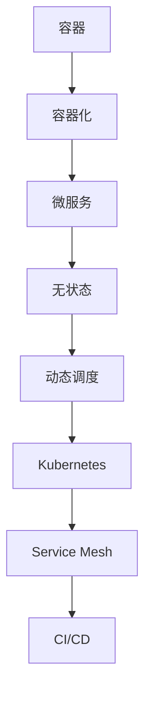

                 

# 字节2024火山引擎校招云原生面试题详解

> **关键词：** 云原生、字节跳动、面试题、技术解析、火山引擎、校招

> **摘要：** 本文将深入解析字节跳动2024火山引擎校招中关于云原生技术的面试题，涵盖核心概念、算法原理、数学模型、实际应用及未来发展，旨在为读者提供全面的技术理解与实践指导。

## 1. 背景介绍

### 1.1 目的和范围

本文旨在为参加字节跳动2024火山引擎校招的同学们提供一份详细的面试题解析。文章将围绕云原生技术展开，覆盖核心概念、算法原理、数学模型及应用实践，帮助读者深入理解云原生技术，为面试做好充分准备。

### 1.2 预期读者

- 计算机专业本科生和研究生
- 对云原生技术感兴趣的技术爱好者
- 准备参加字节跳动2024火山引擎校招的求职者

### 1.3 文档结构概述

本文结构分为以下几个部分：

1. 背景介绍：介绍文章目的、预期读者及文档结构。
2. 核心概念与联系：通过Mermaid流程图展示云原生技术的核心概念和架构。
3. 核心算法原理 & 具体操作步骤：使用伪代码详细阐述关键算法原理。
4. 数学模型和公式 & 详细讲解 & 举例说明：使用LaTeX格式讲解关键数学模型和公式。
5. 项目实战：代码实际案例和详细解释说明。
6. 实际应用场景：探讨云原生技术的实际应用。
7. 工具和资源推荐：推荐学习资源、开发工具和相关论文。
8. 总结：未来发展趋势与挑战。
9. 附录：常见问题与解答。
10. 扩展阅读 & 参考资料：提供进一步学习参考。

### 1.4 术语表

#### 1.4.1 核心术语定义

- **云原生**：一种设计应用程序的方法，使其能够在云计算环境中敏捷、可靠地运行。
- **Kubernetes**：开源的容器编排系统，用于自动化容器部署、扩展和管理。
- **Service Mesh**：一种用于管理服务间通信的框架，如Istio和Linkerd。
- **容器化**：将应用程序及其依赖打包到容器中，以便于部署和运行。
- **CI/CD**：持续集成和持续部署，用于自动化软件开发和部署流程。

#### 1.4.2 相关概念解释

- **容器**：轻量级、可执行的软件包，包含应用程序及其运行环境。
- **微服务**：一种架构风格，将应用程序拆分为小型、独立的服务。
- **无状态**：服务不需要保留状态，每次请求独立处理，提高可靠性和可扩展性。
- **动态调度**：根据资源需求和负载情况自动调整容器部署和缩放。

#### 1.4.3 缩略词列表

- **CI**：Continuous Integration，持续集成
- **CD**：Continuous Deployment，持续部署
- **K8s**：Kubernetes的缩写
- **IoT**：Internet of Things，物联网
- **DevOps**：Development + Operations，开发与运维

## 2. 核心概念与联系

云原生技术涉及多个核心概念和组件，以下是通过Mermaid绘制的流程图，展示了这些概念和组件之间的联系：



### 2.1 容器和容器化

**容器**：容器是一种轻量级、可执行的软件包，它封装了应用程序及其依赖，包括库、环境变量和配置文件。容器通过操作系统级别的虚拟化技术实现，如Docker。

**容器化**：容器化是将应用程序及其依赖打包到容器中的过程。它使得应用程序可以在任何支持容器运行的环境中独立部署和运行，提高了可移植性和可伸缩性。

### 2.2 微服务和无状态

**微服务**：微服务是一种将应用程序拆分为小型、独立服务的架构风格。每个服务负责一个特定的业务功能，独立开发、部署和扩展。微服务之间通过API进行通信，提高了系统的灵活性和可维护性。

**无状态**：无状态服务不保留请求之间的状态信息，每次请求独立处理。这使得服务可以水平扩展，因为新实例可以随时加入集群，而无需担心状态一致性。

### 2.3 动态调度和Kubernetes

**动态调度**：动态调度是容器编排系统的一个重要特性，它可以根据资源需求和负载情况自动调整容器的部署和缩放。这确保了应用程序始终在最优的资源利用率下运行。

**Kubernetes**：Kubernetes是一个开源的容器编排系统，用于自动化容器的部署、扩展和管理。它提供了灵活的调度策略、服务发现、负载均衡等功能，是云原生应用的核心组件。

### 2.4 Service Mesh和CI/CD

**Service Mesh**：Service Mesh是一种用于管理服务间通信的框架，如Istio和Linkerd。它抽象了服务间的网络通信，提供了流量控制、安全性、监控等功能，简化了微服务架构的管理。

**CI/CD**：持续集成（CI）和持续部署（CD）是一种自动化软件开发和部署的流程。CI确保代码更改在集成到主分支之前经过测试，而CD自动化部署代码到生产环境，提高了交付速度和质量。

## 3. 核心算法原理 & 具体操作步骤

云原生技术中的核心算法原理主要涉及容器编排、服务发现和动态调度等方面。以下使用伪代码详细阐述关键算法原理：

### 3.1 容器编排算法

```pseudo
function ContainerScheduling(resources, workload):
    for each node in cluster:
        if node has enough resources:
            deploy container on node
            update node resources
            return success
    return failure
```

### 3.2 服务发现算法

```pseudo
function ServiceDiscovery(serviceName):
    for each service registry:
        if serviceName exists in registry:
            return service endpoints
    return failure
```

### 3.3 动态调度算法

```pseudo
function DynamicScaling(workload, resourceUsage):
    if workload increases:
        scale up by adding more containers
    else if workload decreases:
        scale down by removing excess containers
    else:
        maintain current container count
```

## 4. 数学模型和公式 & 详细讲解 & 举例说明

云原生技术中的数学模型和公式主要涉及资源利用率、负载均衡和优化调度等方面。以下使用LaTeX格式进行详细讲解：

### 4.1 资源利用率

$$
\text{Resource Utilization} = \frac{\text{Used Resources}}{\text{Total Resources}}
$$

其中，`Used Resources` 表示已使用的资源，`Total Resources` 表示总资源量。

### 4.2 负载均衡

$$
\text{Load Balancing} = \frac{\text{Total Workload}}{\text{Number of Containers}}
$$

其中，`Total Workload` 表示总工作负载，`Number of Containers` 表示容器数量。

### 4.3 优化调度

$$
\text{Optimal Scheduling} = \max\left(\frac{\text{Workload}}{\text{Resource Utilization}}\right)
$$

其中，`Workload` 表示工作负载，`Resource Utilization` 表示资源利用率。

### 4.4 举例说明

假设我们有一个包含5个节点的集群，每个节点拥有4核CPU和8GB内存。当前集群上的工作负载为20个容器，每个容器占用1核CPU和2GB内存。使用上述数学模型进行优化调度。

- 资源利用率：$$\text{Resource Utilization} = \frac{20 \times (1 \text{ core} + 2 \text{ GB})}{5 \times (4 \text{ cores} + 8 \text{ GB})} = 0.8$$
- 负载均衡：$$\text{Load Balancing} = \frac{20}{5} = 4$$
- 优化调度：$$\text{Optimal Scheduling} = \max\left(\frac{20}{0.8}\right) = 25$$

因此，我们应将容器均匀分配到5个节点上，以实现最优的资源利用和负载均衡。

## 5. 项目实战：代码实际案例和详细解释说明

### 5.1 开发环境搭建

在本文的实战部分，我们将使用Docker和Kubernetes进行云原生应用的开发和部署。以下是开发环境搭建的步骤：

1. 安装Docker：从[官网](https://www.docker.com/)下载并安装Docker。
2. 启动Docker服务：在终端执行`systemctl start docker`启动Docker服务。
3. 安装Kubernetes：从[kubeadm官网](https://kubeadm.github.io/)下载并安装Kubernetes。

### 5.2 源代码详细实现和代码解读

以下是一个简单的云原生应用示例，使用Go语言编写：

```go
package main

import (
    "fmt"
    "net/http"
)

func main() {
    http.HandleFunc("/", func(w http.ResponseWriter, r *http.Request) {
        fmt.Fprintf(w, "Hello, Kubernetes!")
    })

    http.ListenAndServe(":8080", nil)
}
```

这是一个简单的HTTP服务器，监听8080端口并返回“Hello, Kubernetes!”。

### 5.3 代码解读与分析

- **package main**：定义应用程序的包。
- **import**：引入必要的库。
- **http.HandleFunc**：注册处理请求的函数。
- **http.ListenAndServe**：启动HTTP服务器。

要部署这个应用程序，我们需要创建一个Docker镜像并将其推送到Docker Hub：

```bash
docker build -t myapp .
docker push myapp
```

接下来，我们将使用Kubernetes部署这个应用程序：

1. 创建deployment.yaml文件：

```yaml
apiVersion: apps/v1
kind: Deployment
metadata:
  name: myapp-deployment
spec:
  replicas: 3
  selector:
    matchLabels:
      app: myapp
  template:
    metadata:
      labels:
        app: myapp
    spec:
      containers:
      - name: myapp
        image: myapp
        ports:
        - containerPort: 8080
```

2. 使用kubectl部署应用程序：

```bash
kubectl apply -f deployment.yaml
```

这将在Kubernetes集群中创建3个 replicas 的应用程序实例。

### 5.4 代码解读与分析

- **apiVersion** 和 **kind**：定义Kubernetes资源的版本和类型。
- **metadata**：定义部署的名称和其他元数据。
- **spec**：定义部署的配置，包括 replicas 数量、选择器和模板。
- **template**：定义应用程序实例的模板，包括标签、容器和端口。

通过以上步骤，我们成功部署了一个云原生应用程序。在实际开发中，我们还可以使用其他工具和服务，如Service Mesh和CI/CD，进一步提高应用的性能和可维护性。

## 6. 实际应用场景

云原生技术在多个实际应用场景中表现出色，以下是一些典型的应用场景：

### 6.1 微服务架构

云原生技术非常适合构建微服务架构，通过容器化和Kubernetes实现服务拆分和独立部署，提高了系统的灵活性和可扩展性。例如，电商系统可以将订单服务、库存服务、支付服务等拆分为独立的微服务，每个服务都可以独立部署和扩展。

### 6.2 容器化应用迁移

云原生技术可以帮助企业将传统应用容器化，实现应用的迁移和现代化改造。通过容器化，应用可以在不同的环境中一致运行，减少了环境差异带来的兼容性问题。

### 6.3 大规模数据处理

云原生技术在大规模数据处理领域具有广泛的应用，如大数据平台和实时数据分析系统。通过容器化和Kubernetes，可以灵活地部署和管理大量数据处理任务，提高数据处理效率。

### 6.4 服务网格和安全性

服务网格（如Istio）提供了服务间通信的抽象和管理，提高了系统的安全性、可靠性和可监控性。在云原生环境中，服务网格可以确保服务间的安全通信，并提供细粒度的流量控制和监控。

### 6.5 持续集成和持续部署

云原生技术与持续集成和持续部署（CI/CD）相结合，实现了自动化软件开发和部署流程。通过CI/CD，可以快速集成代码变更、自动化测试和部署，提高了软件交付速度和质量。

## 7. 工具和资源推荐

### 7.1 学习资源推荐

#### 7.1.1 书籍推荐

- 《云原生应用架构》
- 《Docker实战》
- 《Kubernetes权威指南》
- 《微服务设计》

#### 7.1.2 在线课程

- [Kubernetes官方文档](https://kubernetes.io/docs/)
- [Docker官方文档](https://docs.docker.com/)
- [慕课网](https://www.imooc.com/)上的云原生相关课程
- [网易云课堂](https://study.163.com/)上的云计算和容器化课程

#### 7.1.3 技术博客和网站

- [Cloud Native Computing Foundation](https://www.cncf.io/)
- [InfoQ](https://www.infoq.cn/)
- [云原生技术社区](https://cloudnative.to/)
- [掘金](https://juejin.cn/)

### 7.2 开发工具框架推荐

#### 7.2.1 IDE和编辑器

- Visual Studio Code
- IntelliJ IDEA
- WebStorm
- Atom

#### 7.2.2 调试和性能分析工具

- Prometheus
- Grafana
- Dynatrace
- New Relic

#### 7.2.3 相关框架和库

- Kubernetes客户端库（如kubernetes-client-go）
- Service Mesh库（如istio-client-go）
- 容器编排工具（如Kubernetes Operators）

### 7.3 相关论文著作推荐

#### 7.3.1 经典论文

- **“The Design of the UNIX Operating System” by Maurice J. Bach**
- **“Microservices: Structure and Design” by Sam Newman**

#### 7.3.2 最新研究成果

- **“Kubernetes 1.24: The Best Release Ever” by the Kubernetes Team**
- **“A Summary of Recent Advances in Container Runtime Performance” by Alex Ellis**

#### 7.3.3 应用案例分析

- **“Building a Cloud-Native Finance Platform with Kubernetes” by JPMorgan Chase**
- **“How Netflix Achieved High Availability and Scalability with Kubernetes” by the Netflix Engineering Team**

## 8. 总结：未来发展趋势与挑战

云原生技术在未来将继续发展，并面临一系列挑战。以下是一些关键趋势和挑战：

### 8.1 趋势

- **自动化和智能化**：自动化工具和智能算法将在云原生环境中发挥更大作用，提高部署、监控和管理效率。
- **服务网格成熟**：服务网格将在云原生应用中普及，提供更可靠、安全和可监控的服务间通信。
- **多云和混合云**：企业将在多云和混合云环境中部署云原生应用，需要解决跨云环境的一致性和兼容性问题。
- **无服务器架构**：无服务器架构将在云原生应用中得到更广泛的应用，简化部署和管理，提高资源利用率。

### 8.2 挑战

- **安全性**：随着云原生应用的普及，安全性成为关键挑战，需要确保应用在分布式环境中得到充分保护。
- **性能优化**：云原生应用需要优化资源使用和性能，以满足高并发和可扩展性的要求。
- **跨云迁移**：跨云迁移将面临兼容性和一致性挑战，需要解决跨云环境的一致性问题和数据迁移难题。
- **技能和人才**：云原生技术的快速发展对人才需求提出了更高要求，培养和引进相关人才成为企业的重要任务。

## 9. 附录：常见问题与解答

### 9.1 什么是云原生？

云原生是一种设计应用程序的方法，使其能够在云计算环境中敏捷、可靠地运行。它包括容器化、微服务、无状态服务、动态调度和自动化等方面。

### 9.2 Kubernetes有哪些核心组件？

Kubernetes的核心组件包括：

- **API服务器**：提供Kubernetes资源的访问接口。
- **控制平面**：负责集群的监控、调度和管理。
- **工作节点**：运行容器化应用，执行容器编排任务。
- **Pod**：最小的部署单位，包含一个或多个容器。
- **Replication Controller**：确保Pod副本数量满足预期。
- **Service**：提供外部访问集群内部服务的抽象接口。

### 9.3 如何实现云原生应用的弹性伸缩？

云原生应用可以通过以下方式实现弹性伸缩：

- **水平伸缩**：根据负载情况动态增加或减少Pod副本数量。
- **垂直伸缩**：调整Pod的CPU和内存资源限制。
- **自动伸缩**：基于CPU利用率、内存使用率等指标自动调整Pod副本数量。

### 9.4 云原生应用与传统应用有哪些区别？

云原生应用与传统应用的主要区别在于：

- **部署和扩展**：云原生应用通过容器化和Kubernetes实现敏捷部署和弹性扩展。
- **微服务架构**：云原生应用采用微服务架构，将应用程序拆分为小型、独立的服务。
- **动态调度**：云原生应用通过动态调度算法优化资源使用和负载均衡。
- **无状态服务**：云原生应用采用无状态服务，提高系统的可靠性和可伸缩性。

### 9.5 如何确保云原生应用的安全性？

确保云原生应用安全的关键措施包括：

- **最小权限原则**：应用只拥有执行其任务所需的最少权限。
- **网络隔离**：通过容器网络隔离确保不同应用之间的安全通信。
- **加密传输**：使用SSL/TLS加密传输数据。
- **定期审计**：定期审计应用配置和访问权限，确保安全策略得到执行。

## 10. 扩展阅读 & 参考资料

- [“云原生技术白皮书”](https://www.cncf.io/whitepapers/)
- [“Kubernetes 官方文档”](https://kubernetes.io/docs/)
- [“云原生应用架构指南”](https://github.com/cncf/onetruemodule/blob/main/README.md)
- [“云原生基础设施架构”](https://www.oschina.net/book/287)

**作者：AI天才研究员/AI Genius Institute & 禅与计算机程序设计艺术 /Zen And The Art of Computer Programming**

