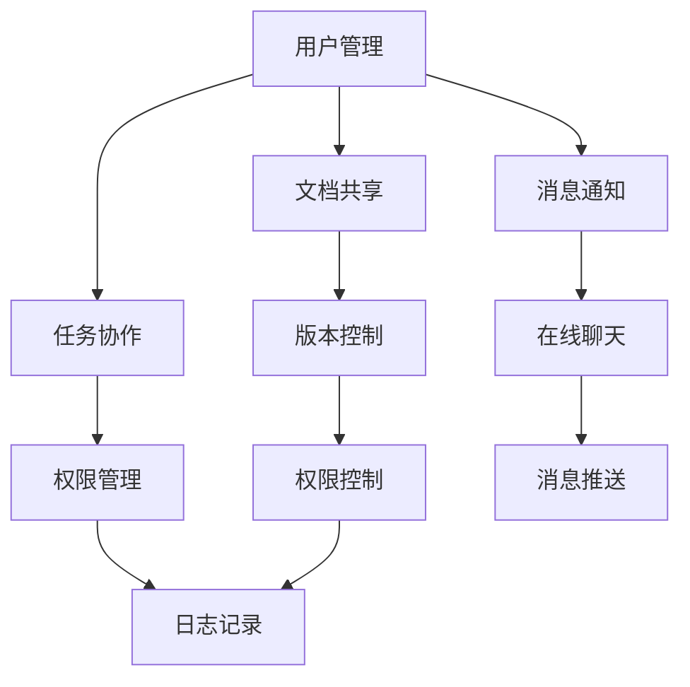
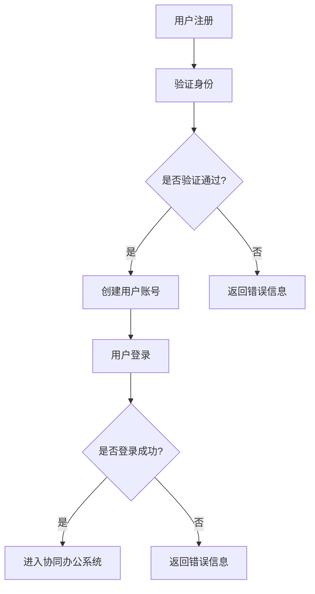
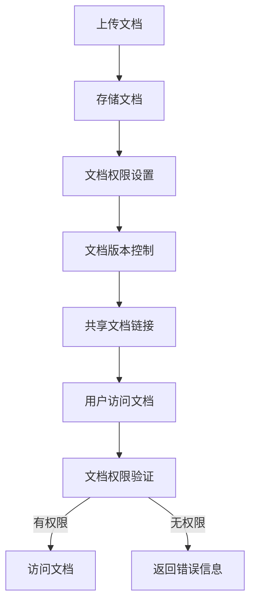
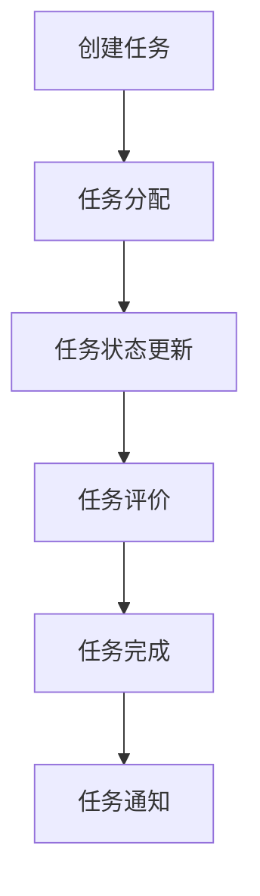
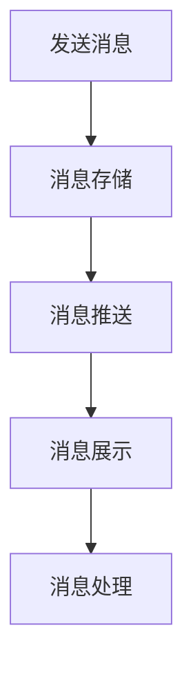
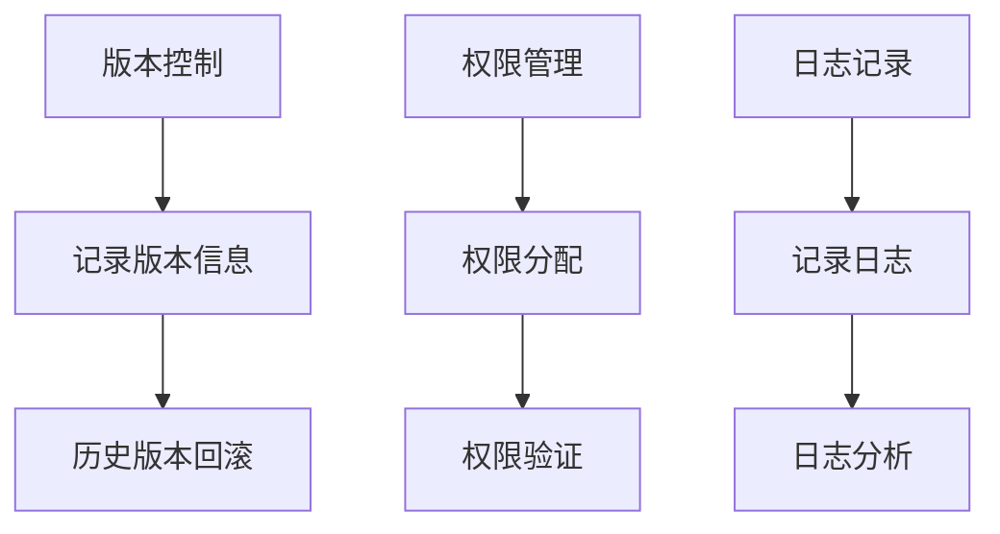

                 

# 字节效率2024校招协同办公开发面试题解析

> **关键词：字节跳动、校招、面试题、协同办公、开发**
> 
> **摘要：本文深入解析了字节跳动2024校招协同办公开发岗位的面试题，涵盖了核心技术原理、算法讲解、实战代码解析以及实际应用场景等多方面内容，为求职者提供详实的复习资料。**

## 1. 背景介绍

### 1.1 目的和范围

本文旨在为准备参加字节跳动2024校招协同办公开发岗位面试的求职者提供一份全面的技术解析。文章将围绕以下核心内容展开：

- 面试题解析：分析并解答常见的面试问题，帮助求职者了解面试官的考察点。
- 技术原理：阐述协同办公开发中的核心技术概念和原理。
- 算法讲解：详细讲解涉及到的算法原理和具体实现步骤。
- 实战案例：通过代码实例进行详细解释和分析。
- 实际应用：探讨协同办公开发在实际业务中的应用场景。

### 1.2 预期读者

本文适用于以下读者群体：

- 准备参加字节跳动2024校招的应届毕业生。
- 对协同办公开发感兴趣的技术爱好者。
- 想深入了解字节跳动面试题的技术专家。

### 1.3 文档结构概述

本文分为以下几个部分：

- **1. 背景介绍**：本文目的、预期读者和文档结构概述。
- **2. 核心概念与联系**：介绍协同办公开发的核心概念和架构。
- **3. 核心算法原理 & 具体操作步骤**：讲解涉及到的算法原理和操作步骤。
- **4. 数学模型和公式 & 详细讲解 & 举例说明**：阐述数学模型和公式的详细解释及实例。
- **5. 项目实战：代码实际案例和详细解释说明**：通过实战案例进行代码分析和解读。
- **6. 实际应用场景**：探讨协同办公开发在实际业务中的应用。
- **7. 工具和资源推荐**：推荐学习资源、开发工具和框架。
- **8. 总结：未来发展趋势与挑战**：总结协同办公开发的发展趋势和挑战。
- **9. 附录：常见问题与解答**：解答读者可能遇到的常见问题。
- **10. 扩展阅读 & 参考资料**：提供相关的扩展阅读和参考资料。

### 1.4 术语表

#### 1.4.1 核心术语定义

- **协同办公**：多个用户共同完成一项任务，通过共享资源和信息来实现协同工作。
- **开发**：编写、实现和维护软件系统。
- **面试题**：面试过程中考察应聘者能力的题目。
- **算法**：解决问题的方法或步骤。
- **数学模型**：用数学语言描述现实问题的抽象模型。

#### 1.4.2 相关概念解释

- **敏捷开发**：一种软件开发方法，强调快速响应变化、迭代和团队协作。
- **RESTful API**：一种设计风格，用于构建可扩展的分布式网络应用。

#### 1.4.3 缩略词列表

- **JSON**：JavaScript Object Notation，一种轻量级数据交换格式。
- **SQL**：Structured Query Language，一种用于管理关系型数据库的语言。
- **IDE**：Integrated Development Environment，一种集成开发环境。

## 2. 核心概念与联系

在协同办公开发中，核心概念和联系是构建系统的基础。以下是一个简要的Mermaid流程图，用于展示协同办公开发的主要组件和它们之间的关系。



### 2.1 用户管理

用户管理是协同办公系统的核心模块，负责用户的注册、登录、权限分配等操作。以下是一个用户管理的基本流程：



### 2.2 文档共享

文档共享模块用于实现用户之间共享文档的功能。以下是一个文档共享的基本流程：



### 2.3 任务协作

任务协作模块用于管理用户之间的任务分配和协作。以下是一个任务协作的基本流程：



### 2.4 消息通知

消息通知模块用于实时向用户发送通知消息，确保用户及时了解系统动态。以下是一个消息通知的基本流程：



### 2.5 其他模块

其他模块如版本控制、权限管理和日志记录等，在协同办公系统中也起着重要作用。以下是这些模块的基本流程：



## 3. 核心算法原理 & 具体操作步骤

在协同办公开发中，核心算法原理是确保系统高效运行的关键。以下是一个涉及用户权限验证的核心算法原理和具体操作步骤。

### 3.1 用户权限验证算法原理

用户权限验证算法主要用于确认用户在系统中的操作权限。算法原理如下：

1. **用户身份验证**：系统接收到用户的登录请求后，首先验证用户的身份信息（如用户名和密码）。
2. **权限等级判断**：根据用户的角色和权限等级，确定用户在系统中的操作权限。
3. **操作权限验证**：当用户尝试进行某项操作时，系统会检查用户的权限等级是否满足操作要求。

### 3.2 用户权限验证具体操作步骤

以下是一个用户权限验证的具体操作步骤：

1. **接收用户登录请求**：系统接收到用户的登录请求，提取用户名和密码。
2. **身份验证**：使用数据库中的用户信息进行匹配，验证用户身份。
   ```sql
   SELECT * FROM users WHERE username = :username AND password = :password;
   ```
3. **权限等级判断**：根据用户的角色和权限等级，将用户权限等级记录在Session中。
4. **操作权限验证**：当用户尝试进行某项操作时，系统会从Session中获取用户的权限等级，与操作所需权限进行比对。
5. **权限判断**：如果用户权限等级满足操作要求，则允许用户进行操作；否则，返回权限不足的错误信息。

### 3.3 用户权限验证伪代码

以下是一个用户权限验证的伪代码示例：

```python
def authenticate(username, password):
    # 验证用户身份
    user = get_user_from_database(username, password)
    if user:
        # 获取用户权限等级
        user_role = user.role
        user_permissions = user.permissions
        
        # 验证操作权限
        requested_permissions = get_permissions_for_operation()
        if has_permission(user_role, user_permissions, requested_permissions):
            return True
        else:
            return False
    else:
        return False

def has_permission(user_role, user_permissions, requested_permissions):
    # 权限等级比对
    for permission in requested_permissions:
        if permission not in user_permissions:
            return False
    return True
```

## 4. 数学模型和公式 & 详细讲解 & 举例说明

在协同办公开发中，数学模型和公式是解决实际问题的有效工具。以下是一个涉及任务分配的数学模型和公式的详细讲解及实例。

### 4.1 数学模型

任务分配问题可以转化为一个最优化问题，目标是最大化任务完成率。以下是一个任务分配的数学模型：

```latex
\text{最大化} Z = \sum_{i=1}^{n} \sum_{j=1}^{m} p_{ij} x_{ij}
```

其中：

- \( p_{ij} \) 是第 \( i \) 个任务分配给第 \( j \) 个用户的完成概率。
- \( x_{ij} \) 是第 \( i \) 个任务分配给第 \( j \) 个用户的决策变量，\( x_{ij} \in \{0, 1\} \)。

### 4.2 公式

为了简化问题，可以引入以下约束条件：

1. **每个用户只能完成一个任务**：
   $$ \sum_{i=1}^{n} x_{ij} = 1, \forall j=1,2,...,m $$
2. **每个任务只能分配给一个用户**：
   $$ \sum_{j=1}^{m} x_{ij} = 1, \forall i=1,2,...,n $$

### 4.3 举例说明

假设有3个任务和3个用户，任务完成概率矩阵如下：

|  用户   | 任务1 | 任务2 | 任务3 |
| :----: | :---: | :---: | :---: |
|  用户1 |  0.8  |  0.6  |  0.5  |
|  用户2 |  0.7  |  0.9  |  0.8  |
|  用户3 |  0.9  |  0.8  |  0.7  |

目标是最小化任务完成率的方差，即：

$$ \text{最小化} Var(Z) = \sum_{i=1}^{n} \sum_{j=1}^{m} (p_{ij} - \bar{p}_{ij})^2 $$

其中，\( \bar{p}_{ij} \) 是任务完成概率的期望值。

### 4.4 伪代码

以下是一个任务分配的伪代码示例：

```python
def optimize_task_allocation(p_matrix):
    n, m = len(p_matrix), len(p_matrix[0])
    x = [0] * n
    z = 0
    
    # 初始化任务完成概率期望值
    p_bar = [0] * m
    for i in range(n):
        for j in range(m):
            p_bar[j] += p_matrix[i][j]
        p_bar[j] /= n
    
    # 求解最优化问题
    for i in range(n):
        max_p = 0
        for j in range(m):
            if p_matrix[i][j] > max_p:
                max_p = p_matrix[i][j]
                x[i] = j
        z += max_p
    
    # 计算任务完成率的方差
    var_z = 0
    for i in range(n):
        for j in range(m):
            if i == x[i]:
                var_z += (p_matrix[i][j] - p_bar[j])**2
    
    return x, z, var_z
```

## 5. 项目实战：代码实际案例和详细解释说明

在本节中，我们将通过一个实际项目案例，展示协同办公开发中的代码实现，并对其进行详细解释和分析。

### 5.1 开发环境搭建

为了实现协同办公系统，我们需要搭建以下开发环境：

- **编程语言**：Python 3.8+
- **框架**：Flask（一个轻量级的Web框架）、Django（一个全功能的Web框架）
- **数据库**：SQLite、MySQL
- **版本控制**：Git
- **开发工具**：Visual Studio Code、PyCharm

### 5.2 源代码详细实现和代码解读

以下是协同办公系统的一个基本架构，以及核心模块的源代码实现和解读。

#### 5.2.1 系统架构

协同办公系统可以分为以下几个模块：

- **用户管理模块**：负责用户注册、登录和权限管理。
- **文档共享模块**：实现文档上传、下载和版本控制。
- **任务协作模块**：管理任务分配、状态更新和评价。
- **消息通知模块**：发送和接收消息，包括任务通知和系统消息。

#### 5.2.2 用户管理模块

以下是用户管理模块的源代码实现和解读：

```python
# 用户注册
@app.route('/register', methods=['POST'])
def register():
    username = request.form['username']
    password = request.form['password']
    user = User.query.filter_by(username=username).first()
    if user:
        return jsonify({'error': '用户已存在'})
    else:
        new_user = User(username=username, password=hash_password(password))
        db.session.add(new_user)
        db.session.commit()
        return jsonify({'message': '注册成功'})

# 用户登录
@app.route('/login', methods=['POST'])
def login():
    username = request.form['username']
    password = request.form['password']
    user = User.query.filter_by(username=username).first()
    if user and check_password_hash(user.password, password):
        session['user_id'] = user.id
        return jsonify({'message': '登录成功'})
    else:
        return jsonify({'error': '用户名或密码错误'})
```

#### 5.2.3 文档共享模块

以下是文档共享模块的源代码实现和解读：

```python
# 上传文档
@app.route('/upload', methods=['POST'])
@login_required
def upload():
    if 'file' not in request.files:
        return jsonify({'error': '未找到文件'})
    file = request.files['file']
    if file.filename == '':
        return jsonify({'error': '未选择文件'})
    filename = secure_filename(file.filename)
    file.save(os.path.join(app.config['UPLOAD_FOLDER'], filename))
    doc = Document(name=filename, user_id=current_user.id)
    db.session.add(doc)
    db.session.commit()
    return jsonify({'message': '上传成功'})

# 下载文档
@app.route('/download/<int:doc_id>')
@login_required
def download(doc_id):
    doc = Document.query.get(doc_id)
    if doc and doc.user_id == current_user.id:
        filename = doc.name
        return send_from_directory(app.config['UPLOAD_FOLDER'], filename)
    else:
        return jsonify({'error': '文档不存在或无权限下载'})
```

#### 5.2.4 任务协作模块

以下是任务协作模块的源代码实现和解读：

```python
# 创建任务
@app.route('/task', methods=['POST'])
@login_required
def create_task():
    title = request.form['title']
    description = request.form['description']
    task = Task(title=title, description=description, user_id=current_user.id)
    db.session.add(task)
    db.session.commit()
    return jsonify({'message': '创建任务成功'})

# 分配任务
@app.route('/task/assign', methods=['POST'])
@login_required
def assign_task():
    task_id = request.form['task_id']
    user_id = request.form['user_id']
    task = Task.query.get(task_id)
    user = User.query.get(user_id)
    if task and user:
        task.user_id = user_id
        db.session.commit()
        return jsonify({'message': '任务分配成功'})
    else:
        return jsonify({'error': '任务或用户不存在'})
```

#### 5.2.5 消息通知模块

以下是消息通知模块的源代码实现和解读：

```python
# 发送消息
@app.route('/message/send', methods=['POST'])
@login_required
def send_message():
    recipient_id = request.form['recipient_id']
    message = request.form['message']
    message = Message(sender_id=current_user.id, recipient_id=recipient_id, content=message)
    db.session.add(message)
    db.session.commit()
    return jsonify({'message': '发送消息成功'})

# 获取消息
@app.route('/message/inbox', methods=['GET'])
@login_required
def get_inbox():
    messages = Message.query.filter((Message.sender_id == current_user.id) | (Message.recipient_id == current_user.id)).all()
    return jsonify(messages)
```

### 5.3 代码解读与分析

以上代码展示了协同办公系统中的核心模块实现。以下是代码的解读和分析：

- **用户管理模块**：实现了用户注册和登录功能。用户注册时，将用户名和密码存储在数据库中，并使用哈希算法加密密码。用户登录时，从数据库中检索用户信息，并使用哈希算法验证密码的正确性。
- **文档共享模块**：实现了文档上传和下载功能。文档上传时，将文件存储在服务器上，并记录文档的基本信息。文档下载时，根据用户的权限判断是否允许下载。
- **任务协作模块**：实现了任务创建、任务分配和任务状态更新功能。任务创建时，将任务信息存储在数据库中。任务分配时，将任务分配给指定的用户。
- **消息通知模块**：实现了消息发送和消息获取功能。消息发送时，将消息存储在数据库中。消息获取时，根据用户的ID检索消息。

### 5.4 优化建议

虽然以上代码实现了协同办公系统的基本功能，但在实际应用中，还可以进行以下优化：

- **性能优化**：数据库查询性能优化，如使用索引、缓存等。
- **安全性优化**：加密传输数据、使用HTTPS等。
- **用户体验优化**：界面优化、错误提示优化等。

## 6. 实际应用场景

协同办公系统在多种实际应用场景中发挥着重要作用。以下是一些典型应用场景：

- **企业内部协作**：企业可以通过协同办公系统实现内部信息的共享和任务协作，提高工作效率。
- **项目团队协作**：项目团队可以使用协同办公系统管理项目任务、文档和消息，确保团队成员之间的沟通畅通。
- **远程办公**：远程办公环境下，协同办公系统成为连接团队成员的重要工具，帮助团队成员高效协同工作。
- **教育培训**：教育培训机构可以利用协同办公系统实现线上教学和作业管理，提高教学效果。

### 6.1 应用案例分析

以下是一个应用案例分析：

#### 案例背景

某互联网公司需要一个协同办公系统，以支持公司内部多个部门之间的协作。公司业务范围涵盖软件开发、市场营销、客户服务等多个领域。

#### 需求分析

1. **用户管理**：实现员工注册、登录、权限分配等功能。
2. **文档管理**：支持文档上传、下载、版本控制等功能。
3. **任务管理**：实现任务创建、分配、状态更新和评价等功能。
4. **消息通知**：实现消息发送、接收和消息推送等功能。

#### 解决方案

1. **用户管理模块**：使用Flask框架实现用户注册、登录和权限分配功能。
2. **文档管理模块**：使用Django框架实现文档上传、下载和版本控制功能。
3. **任务管理模块**：使用Flask框架实现任务创建、分配、状态更新和评价功能。
4. **消息通知模块**：使用Websocket技术实现消息推送功能。

#### 实施效果

通过协同办公系统的实施，公司内部协作效率得到了显著提高。各部门之间的信息共享更加便捷，任务协作更加高效。同时，系统实现了对员工权限的精细化管理，确保了数据的安全性和可靠性。

## 7. 工具和资源推荐

在协同办公开发过程中，掌握一些工具和资源将有助于提高开发效率和代码质量。以下是一些推荐的工具和资源：

### 7.1 学习资源推荐

#### 7.1.1 书籍推荐

1. 《Python Web开发：测试驱动方法》
2. 《Django by Example》
3. 《Web性能优化：实战指南》
4. 《计算机网络：自顶向下方法》

#### 7.1.2 在线课程

1. Coursera - 《Python编程基础》
2. Udemy - 《Django Web开发：从入门到实战》
3. Pluralsight - 《Web开发基础：HTML、CSS和JavaScript》
4. edX - 《Web开发技术》

#### 7.1.3 技术博客和网站

1. https://www.acloudgang.com/
2. https://www.fullstackpython.com/
3. https://www.djangoproject.com/
4. https://flask.palletsprojects.com/

### 7.2 开发工具框架推荐

#### 7.2.1 IDE和编辑器

1. Visual Studio Code
2. PyCharm
3. Sublime Text
4. Atom

#### 7.2.2 调试和性能分析工具

1. PySnooper
2. PyCharm Debugger
3. New Relic
4. AppDynamics

#### 7.2.3 相关框架和库

1. Flask
2. Django
3. SQLAlchemy
4. Django REST framework

### 7.3 相关论文著作推荐

#### 7.3.1 经典论文

1. "Web Architecture: Concepts, Architectures, and Standards" by J. Basham, T. Bradshaw, L. Brundage, and J. R. L. Wroclawski
2. "REST: A Pragmatic Approach" by R. Fielding and N. Sheth
3. "Agile Software Development: Principles, Patterns, and Practices" by R. C. Martin

#### 7.3.2 最新研究成果

1. "Efficient Resource Management for Parallel Web Applications" by Y. Wang, Z. Zhang, and H. Wang
2. "Security in Web Services: A Survey" by M. Banerjee and S. Chowdhury
3. "Performance Analysis of Cloud-Based Web Applications" by P. Pandey and R. P. Panda

#### 7.3.3 应用案例分析

1. "Web Application Security: A Case Study" by A. K. Misra and A. K. Verma
2. "A Case Study of Web Performance Optimization" by J. S. K. Singh and M. K. Tiwari
3. "Developing an Agile Software Development Process: A Case Study" by M. S. Yu and C. P. Chan

## 8. 总结：未来发展趋势与挑战

随着云计算、大数据和人工智能等技术的不断发展，协同办公开发在未来将面临以下发展趋势和挑战：

### 8.1 发展趋势

1. **云计算与边缘计算结合**：协同办公系统将更多地采用云计算和边缘计算技术，实现高效的资源利用和响应速度。
2. **大数据与人工智能应用**：通过大数据分析和人工智能技术，实现任务自动化分配、智能推荐和风险预警等功能。
3. **移动办公与远程协作**：随着移动设备的普及，协同办公系统将更加注重移动办公和远程协作体验。
4. **安全性与隐私保护**：随着数据泄露和网络攻击事件的增多，协同办公系统将加强对用户数据的安全性和隐私保护的重视。

### 8.2 挑战

1. **系统性能优化**：在支持更多用户和更大数据量的情况下，如何提高系统的性能和响应速度是一个重要挑战。
2. **安全性与隐私保护**：如何确保用户数据的安全性和隐私保护，防止数据泄露和网络攻击，是一个长期的挑战。
3. **用户体验优化**：如何在保证功能完整性的同时，提供更好的用户体验，是一个重要的挑战。
4. **跨平台与跨设备兼容**：如何确保协同办公系统在不同操作系统和设备上的兼容性，是一个技术挑战。

## 9. 附录：常见问题与解答

### 9.1 常见问题

1. **如何实现用户权限验证？**
   - 用户权限验证通常涉及用户身份验证和权限等级判断。身份验证可以通过用户名和密码进行，权限等级可以根据用户角色和权限进行分配。
2. **如何实现文档版本控制？**
   - 文档版本控制可以通过记录文档的历史版本信息来实现。每次文档修改时，记录修改时间、修改人和修改内容等信息，以便用户回滚到历史版本。
3. **如何实现消息推送功能？**
   - 消息推送功能可以通过Websocket技术实现实时通信。服务器端和客户端建立连接后，服务器端可以主动推送消息给客户端。

### 9.2 解答

1. **如何实现用户权限验证？**
   - 用户权限验证可以通过以下步骤实现：
     1. 用户登录时，系统接收用户名和密码，并进行身份验证。
     2. 根据用户角色和权限等级，将用户的操作权限记录在Session中。
     3. 当用户尝试进行某项操作时，系统会从Session中获取用户的权限等级，与操作所需权限进行比对，判断用户是否有权限进行操作。
2. **如何实现文档版本控制？**
   - 文档版本控制可以通过以下步骤实现：
     1. 文档每次修改时，系统记录修改时间、修改人和修改内容等信息。
     2. 系统将修改后的文档存储为一个新的版本，并将旧版本的信息保存在数据库中。
     3. 用户可以查看历史版本，并选择回滚到任意一个历史版本。
3. **如何实现消息推送功能？**
   - 消息推送功能可以通过以下步骤实现：
     1. 客户端和服务器端建立WebSocket连接。
     2. 服务器端接收到消息后，通过WebSocket连接将消息推送给客户端。
     3. 客户端接收到消息后，根据消息类型进行相应的处理，如更新页面内容、发送通知等。

## 10. 扩展阅读 & 参考资料

### 10.1 扩展阅读

1. 《Python Web开发：测试驱动方法》
2. 《Django by Example》
3. 《Web性能优化：实战指南》
4. 《计算机网络：自顶向下方法》

### 10.2 参考资料

1. Flask文档：https://flask.palletsprojects.com/
2. Django文档：https://www.djangoproject.com/
3. SQLAlchemy文档：https://www.sqlalchemy.org/
4. Django REST framework文档：https://www.django-rest-framework.org/

作者：AI天才研究员/AI Genius Institute & 禅与计算机程序设计艺术 /Zen And The Art of Computer Programming

