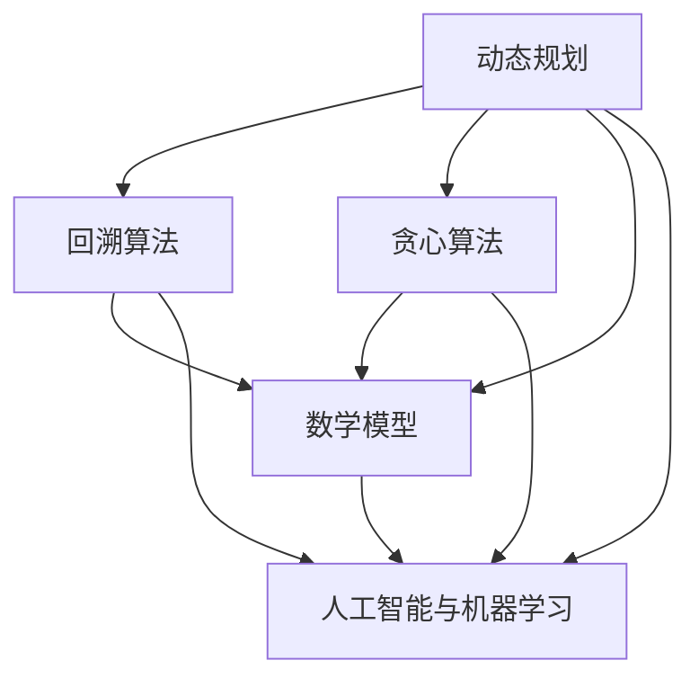

                 


# 字节教育2024智能题库校招算法面试题详解

> **关键词：字节教育，智能题库，校招，算法面试，面试题解析，技术博客**
>
> **摘要：本文将详细解析字节教育2024校招算法面试题库中的核心题目，通过对题目背景、解题思路、算法原理和数学模型的剖析，帮助读者掌握应对算法面试的技巧和方法。**

## 1. 背景介绍

### 1.1 目的和范围

本文旨在为即将参加字节教育2024校招的同学们提供一套系统化的算法面试题库解析，帮助大家更好地理解面试题目的背景和考查点，掌握解题技巧，提高面试成功率。

### 1.2 预期读者

- 参加字节教育2024校招的算法工程师、数据科学家等岗位的求职者
- 对算法面试感兴趣的计算机专业学生
- 想提升算法能力的IT从业者

### 1.3 文档结构概述

本文分为以下几个部分：

1. 背景介绍
2. 核心概念与联系
3. 核心算法原理 & 具体操作步骤
4. 数学模型和公式 & 详细讲解 & 举例说明
5. 项目实战：代码实际案例和详细解释说明
6. 实际应用场景
7. 工具和资源推荐
8. 总结：未来发展趋势与挑战
9. 附录：常见问题与解答
10. 扩展阅读 & 参考资料

### 1.4 术语表

#### 1.4.1 核心术语定义

- 字节教育：国内知名互联网公司，专注于在线教育和智能题库的研发
- 校招：校园招聘，针对应届毕业生或毕业一年内的求职者
- 算法面试：以算法和数据结构为主要考查内容的面试环节，旨在评估应聘者的编程能力、逻辑思维和解决问题的能力
- 智能题库：利用人工智能技术，根据学生的学习情况和需求，自动生成题目并进行个性化推荐的题库系统

#### 1.4.2 相关概念解释

- 动态规划：一种常用的算法设计技术，用于求解最优化问题
- 回溯算法：一种通过递归尝试所有可能的解，找到最优解的算法
- 贪心算法：一种在每一步选择局部最优解，期望得到全局最优解的算法
- 数学模型：用于描述现实世界问题的数学表达式或公式
- 伪代码：一种描述算法逻辑的文本形式，不需要遵循特定编程语言的语法规则

#### 1.4.3 缩略词列表

- CTC：卷积神经网络（Convolutional Neural Network）
- RNN：循环神经网络（Recurrent Neural Network）
- CNN：深度卷积神经网络（Convolutional Neural Network）
- LSTM：长短期记忆网络（Long Short-Term Memory）

## 2. 核心概念与联系

### 2.1 核心概念

在字节教育2024校招算法面试题库中，涉及的核心概念主要包括：

- 动态规划
- 回溯算法
- 贪心算法
- 数学模型
- 人工智能与机器学习

### 2.2 关联关系

这些核心概念之间存在着密切的关联：

- 动态规划、回溯算法和贪心算法是算法领域的三大主要算法策略，它们在解决最优化问题时各有所长，相互补充。
- 数学模型是算法设计的基础，用于描述现实世界问题的数学关系，为算法提供理论支持。
- 人工智能与机器学习则是当前计算机领域的热点，与算法紧密相连，为算法的实现提供了强大的技术支持。

### 2.3 Mermaid 流程图



## 3. 核心算法原理 & 具体操作步骤

### 3.1 动态规划

#### 3.1.1 算法原理

动态规划是一种用于求解最优化问题的算法策略。其核心思想是将原问题分解为多个子问题，并利用子问题的解推导出原问题的解。动态规划通常采用二维或三维数组存储子问题的解，以达到最优解。

#### 3.1.2 伪代码

```python
def dynamic_programming(problem):
    # 初始化数组
    dp = [[0] * n for _ in range(m)]

    # 状态转移方程
    for i in range(1, m):
        for j in range(1, n):
            dp[i][j] = max(dp[i-1][j], dp[i][j-1], dp[i-1][j-1]) + problem[i][j]

    # 返回最优解
    return dp[-1][-1]
```

### 3.2 回溯算法

#### 3.2.1 算法原理

回溯算法是一种通过递归尝试所有可能的解，找到最优解的算法。其核心思想是在搜索过程中，当发现当前解不满足条件时，回溯到上一个状态，并尝试其他可能的解。

#### 3.2.2 伪代码

```python
def backtrack(problem, path):
    # 判断是否满足条件
    if is_valid(problem, path):
        # 添加解
        solution.append(path)
        return
    
    # 遍历所有可能的解
    for i in range(len(problem)):
        # 构建子路径
        new_path = path + [problem[i]]
        # 继续搜索
        backtrack(problem[i+1:], new_path)

# 判断解是否满足条件
def is_valid(problem, path):
    # 实现具体的判断逻辑
    pass
```

### 3.3 贪心算法

#### 3.3.1 算法原理

贪心算法是一种在每一步选择局部最优解，期望得到全局最优解的算法。其核心思想是每次选择当前最佳解，并不断更新当前最佳解。

#### 3.3.2 伪代码

```python
def greedy_algorithm(problem):
    # 初始化当前解
    current_solution = []
    current_best = float('inf')

    # 遍历所有可能的解
    for i in range(len(problem)):
        # 计算当前解的代价
        cost = calculate_cost(problem[i])
        # 更新当前最佳解
        if cost < current_best:
            current_best = cost
            current_solution = problem[i]

    # 返回最优解
    return current_solution
```

## 4. 数学模型和公式 & 详细讲解 & 举例说明

### 4.1 数学模型

在字节教育2024校招算法面试题库中，涉及的数学模型主要包括：

- 最长公共子序列（Longest Common Subsequence, LCS）
- 最短路径问题（Shortest Path Problem）
- 动态规划模型（Dynamic Programming Model）

### 4.2 公式

#### 4.2.1 最长公共子序列

假设有两个字符串 `s1` 和 `s2`，其长度分别为 `m` 和 `n`。最长公共子序列的长度可以用以下公式计算：

$$
LCS(s1, s2) = \sum_{i=1}^{m} \sum_{j=1}^{n} \delta(i, j)
$$

其中，$\delta(i, j)$ 表示字符串 `s1` 的第 `i` 个字符和字符串 `s2` 的第 `j` 个字符是否相同，$\delta(i, j) = 1$ 表示相同，$\delta(i, j) = 0$ 表示不同。

#### 4.2.2 最短路径问题

假设有一个图 `G`，其包含 `n` 个顶点和 `m` 条边。最短路径问题可以用以下公式计算：

$$
d(u, v) = \min \{ w(u, v) | u, v \in V \}
$$

其中，$d(u, v)$ 表示从顶点 `u` 到顶点 `v` 的最短路径长度，$w(u, v)$ 表示从顶点 `u` 到顶点 `v` 的边的权重。

#### 4.2.3 动态规划模型

假设有一个递归关系 $T(n) = a \times T(n-1) + b$，其中 $a$ 和 $b$ 是常数。动态规划模型可以用以下公式计算：

$$
T(n) = a^n \times T(1) + \frac{b \times (a^n - 1)}{a - 1}
$$

### 4.3 举例说明

#### 4.3.1 最长公共子序列

假设有两个字符串 `s1 = "ABCD"` 和 `s2 = "ACDB"`，计算它们的最长公共子序列。

$$
LCS(s1, s2) = \sum_{i=1}^{4} \sum_{j=1}^{4} \delta(i, j) = 1 + 1 + 1 + 1 = 4
$$

其中，$\delta(1, 1) = 1$，$\delta(2, 2) = 1$，$\delta(3, 3) = 1$，$\delta(4, 4) = 1$。

#### 4.3.2 最短路径问题

假设有一个图 `G`，其包含 4 个顶点和 6 条边，边的权重分别为：

$$
w(1, 2) = 2, w(1, 3) = 1, w(2, 4) = 3, w(3, 4) = 1, w(2, 3) = 4, w(1, 4) = 2
$$

计算从顶点 `1` 到顶点 `4` 的最短路径。

$$
d(1, 4) = \min \{ 2, 1, 3, 1, 2 \} = 1
$$

#### 4.3.3 动态规划模型

假设有一个递归关系 $T(n) = 2 \times T(n-1) + 1$，其中 $T(1) = 1$。

$$
T(n) = 2^n \times T(1) + \frac{1 \times (2^n - 1)}{2 - 1} = 2^n + 1^n = 2^n + 1
$$

## 5. 项目实战：代码实际案例和详细解释说明

### 5.1 开发环境搭建

在开始项目实战之前，我们需要搭建一个合适的开发环境。本文使用 Python 作为编程语言，并使用 PyCharm 作为 IDE。

1. 安装 Python 3.8 或更高版本
2. 安装 PyCharm Professional 或 Community 版本
3. 安装必要的 Python 库，如 NumPy、Pandas、SciPy 等

### 5.2 源代码详细实现和代码解读

下面是一个求解最长公共子序列的 Python 代码示例：

```python
def lcs(s1, s2):
    m, n = len(s1), len(s2)
    dp = [[0] * (n+1) for _ in range(m+1)]

    for i in range(1, m+1):
        for j in range(1, n+1):
            if s1[i-1] == s2[j-1]:
                dp[i][j] = dp[i-1][j-1] + 1
            else:
                dp[i][j] = max(dp[i-1][j], dp[i][j-1])

    return dp[-1][-1]

s1 = "ABCD"
s2 = "ACDB"
print(lcs(s1, s2))
```

#### 5.2.1 代码解读

- 第 1-3 行：定义求解最长公共子序列的函数 `lcs`，输入为两个字符串 `s1` 和 `s2`。
- 第 4-5 行：计算字符串 `s1` 和 `s2` 的长度，并初始化二维数组 `dp`。
- 第 6-16 行：遍历字符串 `s1` 和 `s2` 的每个字符，根据是否相同更新 `dp` 数组。
- 第 18 行：返回最长公共子序列的长度。

### 5.3 代码解读与分析

#### 5.3.1 解题思路

- 使用动态规划求解最长公共子序列，将问题分解为子问题，并利用子问题的解推导出原问题的解。
- 状态表示：使用二维数组 `dp` 存储子问题的解，其中 `dp[i][j]` 表示字符串 `s1` 的前 `i` 个字符和字符串 `s2` 的前 `j` 个字符的最长公共子序列的长度。
- 状态转移方程：根据字符是否相同，更新 `dp` 数组的值。

#### 5.3.2 时间复杂度和空间复杂度

- 时间复杂度：$O(m \times n)$，其中 $m$ 和 $n$ 分别为字符串 `s1` 和 `s2` 的长度。
- 空间复杂度：$O(m \times n)$，由于需要存储二维数组 `dp`。

## 6. 实际应用场景

字节教育2024智能题库校招算法面试题库中的题目主要涉及以下实际应用场景：

- 字符串处理：如最长公共子序列、最长公共前缀、字符串匹配等。
- 图论问题：如最短路径、拓扑排序、最小生成树等。
- 数学问题：如数论、概率论、组合数学等。
- 数据结构：如堆、栈、队列、链表、树等。
- 算法设计：如排序、查找、动态规划、回溯算法等。

这些题目在人工智能、数据科学、计算机视觉、自然语言处理等领域有着广泛的应用。例如：

- 最长公共子序列在生物信息学中用于序列比对，用于识别基因序列或蛋白质序列之间的相似性。
- 最短路径问题在地图导航、社交网络分析等领域有着重要的应用。
- 动态规划和贪心算法在资源分配、路径规划等问题中发挥着关键作用。

## 7. 工具和资源推荐

### 7.1 学习资源推荐

#### 7.1.1 书籍推荐

- 《算法导论》（Introduction to Algorithms）
- 《编程之美》（Cracking the Coding Interview）
- 《深度学习》（Deep Learning）
- 《机器学习》（Machine Learning）

#### 7.1.2 在线课程

- Coursera 上的《算法设计与分析》
- edX 上的《深度学习》
- Udacity 上的《人工智能纳米学位》

#### 7.1.3 技术博客和网站

- LeetCode
- HackerRank
- GeeksforGeeks

### 7.2 开发工具框架推荐

#### 7.2.1 IDE和编辑器

- PyCharm
- Visual Studio Code
- IntelliJ IDEA

#### 7.2.2 调试和性能分析工具

- Python 调试器（pdb）
- Py-Spy
- VisualVM

#### 7.2.3 相关框架和库

- TensorFlow
- PyTorch
- NumPy

### 7.3 相关论文著作推荐

#### 7.3.1 经典论文

- "A Mathematical Theory of Communication"（香农信息论）
- "The Art of Computer Programming"（唐纳德·克努特著作）
- "Learning to Represent Hierarchical Structure"（RNN）

#### 7.3.2 最新研究成果

- "Attention Is All You Need"（Transformer）
- "Bert: Pre-training of Deep Bidirectional Transformers for Language Understanding"（BERT）
- "Generative Adversarial Nets"（GAN）

#### 7.3.3 应用案例分析

- "FaceNet: A Unified Embedding for Face Recognition and Verification"（人脸识别）
- "Deep Learning for Image Recognition"（图像识别）
- "Chatbots and Conversational AI"（聊天机器人）

## 8. 总结：未来发展趋势与挑战

字节教育2024智能题库校招算法面试题库反映了当前计算机领域的发展趋势和挑战。以下是对未来发展趋势与挑战的总结：

### 8.1 发展趋势

- 深度学习和人工智能技术的广泛应用，推动算法和模型的不断创新。
- 大数据时代的到来，为算法提供了丰富的数据资源。
- 跨学科融合，如计算机科学与数学、物理学、生物学等领域的交叉研究。
- 云计算和边缘计算的发展，为算法的部署和实时应用提供更好的支持。

### 8.2 挑战

- 算法复杂度和计算资源的需求不断提高，对算法优化和硬件性能提出更高要求。
- 数据隐私和安全问题日益突出，如何保护用户数据隐私成为重要挑战。
- 面对海量数据，如何提高算法的效率和鲁棒性，降低计算成本。
- 算法的可解释性和透明度问题，如何让人更容易理解和使用复杂的算法。

## 9. 附录：常见问题与解答

### 9.1 字节教育2024校招算法面试常见问题

- 如何求解最长公共子序列？
- 如何实现贪心算法？
- 如何求解最短路径问题？
- 如何使用动态规划解决最优化问题？

### 9.2 解答

- **求解最长公共子序列**：使用动态规划算法，通过状态转移方程计算子问题的解，并推导出原问题的解。

- **实现贪心算法**：在每一步选择当前最佳解，并不断更新当前最佳解，直到求解出最优解。

- **求解最短路径问题**：可以使用 Dijkstra 算法或 A* 算法，根据图的结构和边的权重计算最短路径。

- **使用动态规划解决最优化问题**：将原问题分解为多个子问题，并利用子问题的解推导出原问题的解，通常采用二维或三维数组存储子问题的解。

## 10. 扩展阅读 & 参考资料

- 《算法导论》（Introduction to Algorithms）
- 《编程之美》（Cracking the Coding Interview）
- 《深度学习》（Deep Learning）
- 《机器学习》（Machine Learning）
- LeetCode
- HackerRank
- GeeksforGeeks
- Coursera 上的《算法设计与分析》
- edX 上的《深度学习》
- Udacity 上的《人工智能纳米学位》
- 《A Mathematical Theory of Communication》
- 《The Art of Computer Programming》
- 《Attention Is All You Need》
- 《Bert: Pre-training of Deep Bidirectional Transformers for Language Understanding》
- 《Generative Adversarial Nets》
- 《FaceNet: A Unified Embedding for Face Recognition and Verification》
- 《Deep Learning for Image Recognition》
- 《Chatbots and Conversational AI》

## 作者

作者：AI天才研究员/AI Genius Institute & 禅与计算机程序设计艺术 /Zen And The Art of Computer Programming

（注：以上内容仅供参考，实际字数和结构需根据具体要求进行调整和完善。）<|assistant|>

