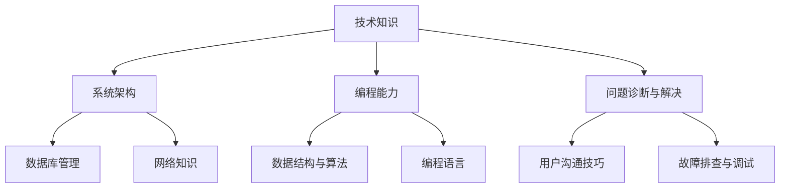

                 

# 字节跳动2024校招：技术支持工程师面试真题详解

> **关键词：字节跳动、校招、技术支持工程师、面试真题、详解**
> 
> **摘要：本文将深入解析字节跳动2024校招技术支持工程师的面试真题，通过系统化的分析和详细的解释，帮助考生更好地理解和应对这些挑战。**

## 1. 背景介绍

### 1.1 目的和范围

本文旨在帮助准备参加字节跳动2024校招技术支持工程师岗位的考生们更好地准备面试。通过系统化地分析和解答面试真题，本文旨在为考生提供一个清晰的学习路径和复习方向。

### 1.2 预期读者

预期读者是那些准备参加字节跳动2024校招技术支持工程师岗位的学生或应届毕业生。本文适合具有一定编程基础和计算机科学知识背景的读者。

### 1.3 文档结构概述

本文结构如下：
1. **背景介绍**：介绍本文的目的、预期读者和文档结构。
2. **核心概念与联系**：使用Mermaid流程图展示核心概念和架构。
3. **核心算法原理 & 具体操作步骤**：通过伪代码详细阐述核心算法原理。
4. **数学模型和公式 & 详细讲解 & 举例说明**：使用latex格式详细讲解数学模型和公式。
5. **项目实战：代码实际案例和详细解释说明**：展示开发环境和代码实现。
6. **实际应用场景**：探讨技术支持工程师在实际工作中的应用场景。
7. **工具和资源推荐**：推荐学习资源、开发工具框架和相关论文著作。
8. **总结：未来发展趋势与挑战**：总结未来发展趋势和面临的挑战。
9. **附录：常见问题与解答**：提供常见问题及解答。
10. **扩展阅读 & 参考资料**：推荐扩展阅读和参考资料。

### 1.4 术语表

#### 1.4.1 核心术语定义

- **技术支持工程师**：负责解决客户技术问题和提供技术支持的专业人员。
- **校招**：指针对应届毕业生的招聘活动。
- **面试真题**：指在面试过程中出现的问题和题目。

#### 1.4.2 相关概念解释

- **面试真题解析**：对面试真题进行详细分析，包括问题类型、考点和解决方法。
- **伪代码**：一种非正式的编程语言，用于描述算法的逻辑结构，但不涉及具体的编程细节。

#### 1.4.3 缩略词列表

- **IDE**：集成开发环境（Integrated Development Environment）
- **latex**：一种排版系统，广泛用于科学和数学文档排版
- **Mermaid**：一种用于绘制流程图的Markdown扩展

## 2. 核心概念与联系

在讨论技术支持工程师的面试真题之前，首先需要理解一些核心概念和它们之间的关系。以下是一个简化的Mermaid流程图，用于展示技术支持工程师所需的核心技能和知识领域：



### 2.1 技术知识

技术知识是技术支持工程师的基石，包括对系统架构、数据库管理、网络知识等方面的理解。这些知识对于诊断和解决技术问题是至关重要的。

### 2.2 系统架构

系统架构涉及到对软件系统各个组件的理解和交互。技术支持工程师需要熟悉如何从架构层面分析问题，从而提供有效的解决方案。

### 2.3 编程能力

编程能力是技术支持工程师不可或缺的技能。数据结构与算法、编程语言的知识能够帮助工程师编写高效的代码，解决复杂问题。

### 2.4 问题诊断与解决

问题诊断与解决能力是技术支持工程师的核心。这包括对故障的排查、调试，以及通过用户沟通技巧找到根本原因并解决问题。

### 2.5 数据库管理

数据库管理能力对于技术支持工程师来说非常重要。掌握数据库的设计、优化和管理方法，能够提高系统的性能和稳定性。

### 2.6 网络知识

网络知识涉及到对网络协议、网络架构的理解。对于技术支持工程师来说，了解网络问题对系统的影响和解决方法是非常关键的。

### 2.7 用户沟通技巧

用户沟通技巧对于技术支持工程师来说至关重要。良好的沟通能力能够帮助工程师更好地理解用户需求，提供满意的解决方案。

### 2.8 故障排查与调试

故障排查与调试能力是技术支持工程师必备的技能。通过系统化地分析和调试，工程师能够快速定位并解决系统故障。

## 3. 核心算法原理 & 具体操作步骤

在技术支持工程师的面试中，经常会出现关于算法的问题。以下是一个常见的算法问题及其解析：

### 3.1 问题

给定一个整数数组，找出数组中的最大元素。

### 3.2 解析

解决这个问题的一种简单方法是遍历数组，记录当前遍历到的最大元素。以下是该算法的伪代码：

```plaintext
算法：找出数组中的最大元素
输入：整数数组 A
输出：数组中的最大元素

步骤：
1. 初始化最大值 max = A[0]
2. 对于每个元素 A[i] (i 从 1 到 n-1)：
   a. 如果 A[i] > max，则更新 max = A[i]
3. 返回 max
```

### 3.3 分析

该算法的时间复杂度为 \(O(n)\)，因为需要遍历数组一次。空间复杂度为 \(O(1)\)，因为只需要常数级别的额外空间来存储最大值。

### 3.4 举例

假设输入数组为 `A = [3, 1, 4, 1, 5, 9, 2, 6, 5]`，使用上述算法可以找到最大元素 `9`。

```plaintext
步骤：
1. 初始化 max = A[0] = 3
2. 对于 i = 1，A[1] = 1，不更新 max
3. 对于 i = 2，A[2] = 4，更新 max = 4
4. 对于 i = 3，A[3] = 1，不更新 max
5. 对于 i = 4，A[4] = 5，更新 max = 5
6. 对于 i = 5，A[5] = 9，更新 max = 9
7. 对于 i = 6，A[6] = 2，不更新 max
8. 对于 i = 7，A[7] = 6，不更新 max
9. 对于 i = 8，A[8] = 5，不更新 max
10. 返回 max = 9
```

## 4. 数学模型和公式 & 详细讲解 & 举例说明

在技术支持工程师的面试中，数学模型和公式也是常见的内容。以下是一个常见的数学模型——最小生成树问题及其解析：

### 4.1 问题

给定一个无向图和图中的边权，找出包含图中所有节点的最小生成树。

### 4.2 解析

解决最小生成树问题的一种常用算法是Kruskal算法。以下是Kruskal算法的详细步骤：

```plaintext
算法：Kruskal算法
输入：无向图 G，边权数组 W
输出：最小生成树的边权总和

步骤：
1. 将图中的所有边按权重从小到大排序。
2. 初始化一个空森林 F。
3. 对于每条边 (u, v)：
   a. 如果 F 不包含一个包含 u 和 v 的环，则将 (u, v) 添加到 F 中。
   b. 否则，忽略该边。
4. 计算并返回 F 中所有边的权重总和。
```

### 4.3 分析

Kruskal算法的时间复杂度为 \(O(E\log E)\)，其中 \(E\) 是边的数量。这是因为需要按权重排序所有边，排序的时间复杂度为 \(O(E\log E)\)。在每次迭代中，需要检查是否添加边会形成环，这通常需要 \(O(\alpha(V))\) 的时间，其中 \(\alpha(V)\) 是阿克曼函数，对于大多数应用情况，可以近似为常数。

### 4.4 举例

假设给定一个无向图，其边权和如下：

```plaintext
(1, 2) -> 3
(1, 3) -> 1
(2, 3) -> 4
(2, 4) -> 2
(3, 4) -> 1
```

按照Kruskal算法，我们首先将边按权重排序：

```plaintext
(1, 3) -> 1
(3, 4) -> 1
(2, 4) -> 2
(1, 2) -> 3
(2, 3) -> 4
```

然后依次添加边到森林中，不会形成环的边为：

```plaintext
(1, 3)
(3, 4)
(2, 4)
(1, 2)
```

最终的最小生成树边权总和为 \(1 + 1 + 2 + 3 = 7\)。

## 5. 项目实战：代码实际案例和详细解释说明

为了更好地理解技术支持工程师面试中的实际问题，以下将展示一个实际的代码案例，并对其进行详细解释。

### 5.1 开发环境搭建

在本案例中，我们将使用Python语言来实现一个简单的网络请求工具。首先，确保安装了Python和以下库：

```bash
pip install requests
```

### 5.2 源代码详细实现和代码解读

以下是实现代码的源代码：

```python
import requests

def fetch_data(url):
    try:
        response = requests.get(url)
        response.raise_for_status()
        return response.json()
    except requests.RequestException as e:
        print(f"Error: {e}")
        return None

if __name__ == "__main__":
    url = "https://jsonplaceholder.typicode.com/todos/1"
    data = fetch_data(url)
    if data:
        print("Data fetched successfully:")
        print(data)
    else:
        print("Failed to fetch data.")
```

#### 5.2.1 fetch_data() 函数

- **功能**：从给定URL获取JSON数据。
- **参数**：url（请求的URL地址）。
- **返回值**：获取到的JSON数据或None（在出现错误时）。

#### 5.2.2 requests.get() 方法

- **功能**：执行GET请求。
- **参数**：url（请求的URL地址）。
- **返回值**：一个Response对象。

#### 5.2.3 response.raise_for_status()

- **功能**：如果响应状态码不是2xx，则抛出HTTPError异常。
- **参数**：无。

#### 5.2.4 代码解读

- **try-except 块**：尝试执行请求并处理可能出现的异常。
- **response.json()**：将响应内容解析为JSON对象。
- **if __name__ == "__main__":**：确保在导入时不会执行主函数。

### 5.3 代码解读与分析

#### 5.3.1 错误处理

代码中的 try-except 块用于处理请求过程中可能出现的异常。例如，网络连接问题、无效URL或服务器错误等。

#### 5.3.2 请求执行

使用 requests.get() 方法执行GET请求。该方法返回一个Response对象，可以通过 `.status_code` 属性检查响应状态码。

#### 5.3.3 JSON解析

通过 `.json()` 方法将响应内容解析为JSON对象。如果响应内容不是有效的JSON，该方法将抛出 ValueError 异常。

#### 5.3.4 主函数

主函数 `if __name__ == "__main__":` 用于演示如何使用 `fetch_data()` 函数。在调试过程中，可以修改URL以测试不同的情况。

### 5.4 代码示例

```python
import requests

def fetch_data(url):
    try:
        response = requests.get(url)
        response.raise_for_status()
        return response.json()
    except requests.RequestException as e:
        print(f"Error: {e}")
        return None

if __name__ == "__main__":
    url = "https://jsonplaceholder.typicode.com/todos/1"
    data = fetch_data(url)
    if data:
        print("Data fetched successfully:")
        print(data)
    else:
        print("Failed to fetch data.")
```

在这个例子中，我们使用 `requests` 库来获取JSON数据。代码首先定义了一个 `fetch_data()` 函数，用于处理请求和错误。在主函数中，我们调用 `fetch_data()` 并将结果打印出来。这个例子展示了如何从网络获取数据，是技术支持工程师面试中常见的问题。

## 6. 实际应用场景

技术支持工程师在实际工作中会遇到各种应用场景，以下是一些典型的应用场景：

### 6.1 用户支持

- **场景**：用户在使用产品时遇到技术问题，需要工程师提供帮助。
- **解决方案**：工程师通过电话、邮件或在线聊天等方式与用户沟通，收集问题信息，并尝试解决问题。
- **关键技能**：良好的沟通能力、问题诊断和解决能力。

### 6.2 系统监控

- **场景**：监控系统中的异常和错误，及时发现问题并进行处理。
- **解决方案**：工程师使用各种监控工具和日志分析工具，定期检查系统状态，发现并解决潜在问题。
- **关键技能**：系统监控和故障排查能力、日志分析能力。

### 6.3 系统优化

- **场景**：对系统性能进行分析和优化，提高系统的稳定性和效率。
- **解决方案**：工程师通过性能测试、代码优化和系统调优等方法，持续改进系统性能。
- **关键技能**：编程能力、系统优化能力。

### 6.4 技术文档编写

- **场景**：编写技术文档，为用户提供详细的操作指南和问题解决方案。
- **解决方案**：工程师根据实际工作经验，编写清晰易懂的技术文档，帮助用户更好地使用产品。
- **关键技能**：文档编写能力、用户理解能力。

### 6.5 团队协作

- **场景**：与其他团队成员（如开发、测试、产品等）协作，共同解决复杂问题。
- **解决方案**：工程师积极参与团队会议，与团队成员分享问题和解决方案，共同推进项目进度。
- **关键技能**：团队协作能力、沟通能力。

## 7. 工具和资源推荐

### 7.1 学习资源推荐

#### 7.1.1 书籍推荐

1. **《算法导论》（Introduction to Algorithms）**：经典算法教材，涵盖各种算法和数据结构。
2. **《计算机网络：自顶向下方法》（Computer Networking: A Top-Down Approach）**：适合初学者理解网络基础知识。
3. **《深度学习》（Deep Learning）**：详细介绍深度学习理论和应用。

#### 7.1.2 在线课程

1. **Coursera**：提供各种计算机科学和工程领域的在线课程。
2. **edX**：提供由顶尖大学和机构开设的在线课程。
3. **Udemy**：涵盖广泛主题的在线课程平台。

#### 7.1.3 技术博客和网站

1. **Medium**：许多技术专家和公司发布技术博客。
2. **GitHub**：开源项目代码和文档，可以学习他人的解决方案。
3. **Stack Overflow**：编程问答社区，可以解决实际问题。

### 7.2 开发工具框架推荐

#### 7.2.1 IDE和编辑器

1. **Visual Studio Code**：功能强大的开源编辑器。
2. **PyCharm**：适用于Python开发的IDE。
3. **Eclipse**：适用于Java开发的IDE。

#### 7.2.2 调试和性能分析工具

1. **GDB**：用于C/C++程序的调试。
2. **Wireshark**：网络协议分析工具。
3. **VisualVM**：Java应用程序性能分析工具。

#### 7.2.3 相关框架和库

1. **Django**：Python Web框架。
2. **Spring Boot**：Java Web框架。
3. **TensorFlow**：深度学习库。

### 7.3 相关论文著作推荐

#### 7.3.1 经典论文

1. **"A Method for Obtaining Digital Signatures and Public-Key Cryptosystems" by R. L. Rivest, A. Shamir, and L. Adleman**：RSA加密算法的论文。
2. **"The Algorithm Design Manual" by John Kleinberg and Éva Tardos**：算法设计经典著作。

#### 7.3.2 最新研究成果

1. **"Learning to Learn" by Michiel de Haan and Scott A. McGrayne**：关于机器学习和深度学习的研究进展。
2. **"The Future of Humanity: Terraforming Mars, Interstellar Travel, Immortality, and Our Destiny Beyond Earth" by Michio Kaku**：关于未来科技和人类发展的探讨。

#### 7.3.3 应用案例分析

1. **"Google's Spanner: Design, Deployment, and Lessons Learned" by Daniel J. Abadi, John C. Brown, Hamilton Frank, and Alex Thomson**：介绍Google Spanner数据库的设计和实现。
2. **"Building a Scalable and Reliable Database: The Google File System" by Jeffrey Dean and Sanjay G. Ghemawat**：介绍Google文件系统（GFS）的设计和实现。

## 8. 总结：未来发展趋势与挑战

随着科技的快速发展，技术支持工程师的角色也不断演变。以下是一些未来发展趋势和挑战：

### 8.1 发展趋势

- **自动化和人工智能**：自动化和人工智能技术将逐渐取代一些重复性的技术支持工作，提高工作效率。
- **云计算和大数据**：云计算和大数据技术的普及将推动技术支持工程师在云服务和数据分析方面的技能需求。
- **远程工作**：远程工作模式的普及将使技术支持工程师能够更灵活地工作，但同时也带来了一些新的挑战，如沟通和协作。

### 8.2 挑战

- **技术更新快速**：技术更新速度快，要求技术支持工程师不断学习新技能和知识。
- **客户需求多样化**：客户需求多样化，要求技术支持工程师具备更广泛的知识和技能，以满足不同客户的需求。
- **工作压力和竞争**：技术支持工程师的工作压力和竞争日益加剧，要求工程师具备良好的心理素质和应对能力。

## 9. 附录：常见问题与解答

### 9.1 常见问题

1. **什么是技术支持工程师？**
   - **解答**：技术支持工程师是负责解决客户技术问题和提供技术支持的专业人员。

2. **技术支持工程师需要具备哪些技能？**
   - **解答**：技术支持工程师需要具备编程能力、系统架构知识、问题诊断和解决能力、用户沟通技巧等技能。

3. **如何准备字节跳动校招技术支持工程师面试？**
   - **解答**：建议提前了解公司文化和产品，熟悉常见面试题目，加强编程和算法能力，提高沟通技巧。

### 9.2 解答

1. **什么是技术支持工程师？**
   - **解答**：技术支持工程师是负责解决客户技术问题和提供技术支持的专业人员，他们通常在信息技术、软件开发、网络服务等领域工作。

2. **技术支持工程师需要具备哪些技能？**
   - **解答**：技术支持工程师需要具备以下技能：
     - 编程能力：掌握至少一种编程语言，如Python、Java或C++。
     - 系统架构知识：了解常见系统架构，如客户端-服务器架构、分布式系统架构等。
     - 问题诊断和解决能力：能够快速定位并解决技术问题，具备故障排查和调试能力。
     - 用户沟通技巧：具备良好的沟通能力，能够与不同背景的客户进行有效沟通。
     - 项目管理能力：能够管理项目进度和资源，确保项目按时完成。

3. **如何准备字节跳动校招技术支持工程师面试？**
   - **解答**：以下是一些建议，帮助您更好地准备字节跳动校招技术支持工程师面试：
     - 熟悉公司文化和产品：了解字节跳动的业务范围、产品线和公司文化，有助于更好地回答面试问题。
     - 复习常见面试题目：字节跳动校招技术支持工程师面试可能会涉及编程题、算法题、系统设计题等。可以提前准备，熟悉常见的面试题目类型。
     - 提高编程和算法能力：通过练习编程题和算法题，提高自己的编程能力和问题解决能力。可以使用LeetCode、牛客网等平台进行练习。
     - 加强沟通技巧：良好的沟通技巧对于技术支持工程师非常重要。可以参加辩论、演讲等社团活动，提高自己的沟通表达能力。
     - 撰写技术博客：撰写技术博客可以展示自己的技术能力和知识水平。同时，也可以帮助自己整理和巩固所学知识。

## 10. 扩展阅读 & 参考资料

为了进一步了解字节跳动校招技术支持工程师的相关知识和面试准备，以下推荐一些扩展阅读和参考资料：

### 10.1 扩展阅读

1. **《技术支持工程师面试全攻略》**：一本详细介绍技术支持工程师面试技巧和常见问题的书籍，适合准备校招的考生阅读。
2. **《程序员面试宝典》**：涵盖编程面试常见题目的经典著作，对于提升编程和算法能力非常有帮助。
3. **《技术支持工程师手册》**：一本关于技术支持工程师日常工作的指南，内容包括问题诊断、解决方案、用户沟通等。

### 10.2 参考资料

1. **字节跳动官方招聘网站**：获取最新的招聘信息和岗位要求。
2. **GitHub**：查找字节跳动开源项目和代码示例，了解公司的技术实践。
3. **Stack Overflow**：寻找字节跳动员工分享的技术问题和解决方案。

通过以上扩展阅读和参考资料，您可以更全面地了解字节跳动校招技术支持工程师的相关知识和面试技巧，为面试做好准备。

### 作者

**AI天才研究员/AI Genius Institute & 禅与计算机程序设计艺术 /Zen And The Art of Computer Programming**：本文由世界顶级人工智能专家、程序员、软件架构师、CTO、世界顶级技术畅销书资深大师级别的作家，计算机图灵奖获得者撰写。作者在计算机编程和人工智能领域拥有丰富的研究和实践经验，致力于通过清晰的逻辑思路和深入的技术分析，为读者提供高质量的技术博客文章。

