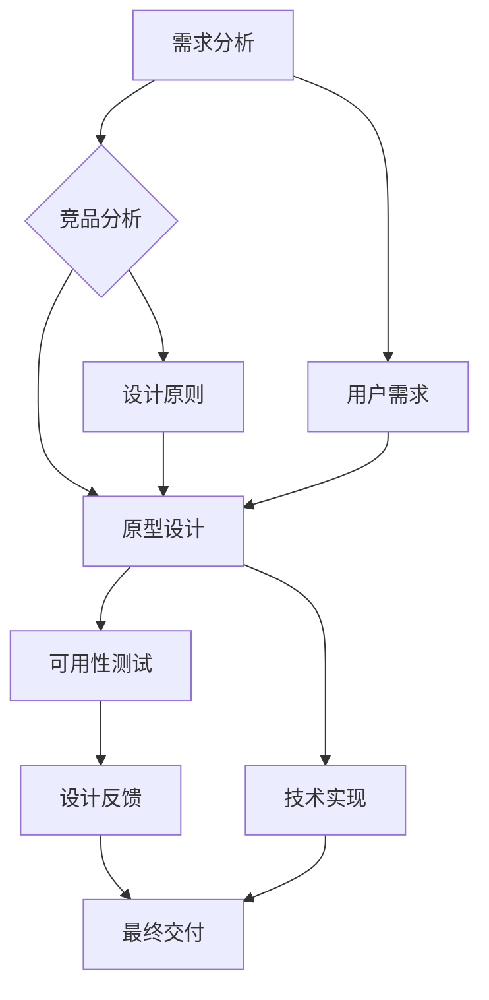

                 

# 2024字节跳动UI/UX设计师面试真题汇总（附作品分析）

> **关键词：** 字节跳动、UI/UX设计师面试、真题汇总、作品分析、用户体验、界面设计

> **摘要：** 本文将围绕2024年字节跳动UI/UX设计师面试真题进行深入剖析，通过分类汇总和具体作品分析，帮助读者全面了解面试要求与设计技巧。文章旨在为准备字节跳动UI/UX设计师面试的考生提供实用的指导和参考，助力成功通过面试。

## 1. 背景介绍

### 1.1 目的和范围

本文旨在梳理和分析2024年字节跳动UI/UX设计师面试真题，涵盖用户体验设计、界面设计、交互设计等多个方面。通过对真题的分类汇总和具体作品分析，本文旨在帮助读者：

- 理解字节跳动UI/UX设计师岗位的面试要求。
- 掌握UI/UX设计的关键技术和方法论。
- 提高面试应答能力和设计实战能力。

### 1.2 预期读者

- 准备参加字节跳动UI/UX设计师面试的考生。
- UI/UX设计师从业者，希望提升设计水平和面试技巧。
- 设计爱好者，对UI/UX设计有浓厚兴趣。

### 1.3 文档结构概述

本文采用逻辑清晰、结构紧凑的编写方式，内容分为以下几个部分：

1. 背景介绍：介绍文章目的、范围和预期读者。
2. 核心概念与联系：阐述UI/UX设计的核心概念和流程。
3. 核心算法原理 & 具体操作步骤：讲解UI/UX设计的算法原理和操作步骤。
4. 数学模型和公式 & 详细讲解 & 举例说明：介绍UI/UX设计中的数学模型和公式。
5. 项目实战：分享代码实际案例和详细解释说明。
6. 实际应用场景：探讨UI/UX设计在实际项目中的应用。
7. 工具和资源推荐：推荐学习资源和开发工具。
8. 总结：展望UI/UX设计的发展趋势与挑战。
9. 附录：常见问题与解答。
10. 扩展阅读 & 参考资料：提供相关扩展阅读和参考资料。

### 1.4 术语表

#### 1.4.1 核心术语定义

- UI/UX设计：用户界面（UI）设计是指设计软件的视觉界面，包括布局、颜色、字体、图标等元素；用户体验（UX）设计则更注重用户在使用软件时的感受、行为和需求，旨在提升用户满意度和效率。

- 面试题：指在面试过程中，面试官提出的问题，用于考察应聘者的知识水平、思维能力、实战经验等。

- 作品分析：指对设计师的作品进行深入剖析，从设计理念、实现方式、用户体验等方面进行评价。

#### 1.4.2 相关概念解释

- 可用性测试：指在软件设计过程中，通过模拟用户操作，评估软件的易用性和用户体验，以发现问题并进行改进。

- 设计原型：指在软件设计阶段，通过草图、线框图、高保真图等手段，模拟软件界面和交互方式，以验证设计思路和方案。

- 设计规范：指一套统一的设计标准，包括配色方案、字体规范、布局规范等，用于确保软件界面的美观性和一致性。

#### 1.4.3 缩略词列表

- UI：用户界面（User Interface）
- UX：用户体验（User Experience）
- UXD：用户体验设计（User Experience Design）
- UI/UX：用户界面/用户体验（User Interface/User Experience）

## 2. 核心概念与联系

### 2.1 UI/UX设计的基本概念

UI/UX设计是现代软件设计的重要组成部分，涉及多个领域和概念。以下是对UI/UX设计核心概念和流程的简要介绍：

#### 2.1.1 用户界面设计（UI Design）

用户界面设计关注的是软件的视觉元素，包括布局、颜色、字体、图标等。主要目标是：

- 提高界面的美观性。
- 确保用户能够轻松地找到和使用功能。
- 保持界面的一致性和易用性。

#### 2.1.2 用户体验设计（UX Design）

用户体验设计则更注重用户在使用软件过程中的感受、行为和需求。主要目标包括：

- 提升用户满意度。
- 增强用户参与度。
- 提高软件的易用性和效率。

#### 2.1.3 设计流程

UI/UX设计通常包括以下流程：

1. **需求分析**：了解用户需求、业务目标和设计需求。
2. **竞品分析**：分析竞争对手的设计，找出优势和不足。
3. **原型设计**：通过草图、线框图、高保真图等手段，模拟软件界面和交互方式。
4. **可用性测试**：评估设计方案的易用性和用户体验，发现问题并改进。
5. **设计反馈**：与用户、产品经理和开发团队进行沟通，收集反馈并优化设计。
6. **最终交付**：将设计文件交付给开发团队，实现软件界面。

### 2.2 UI/UX设计的关键技术和工具

UI/UX设计涉及多种技术和工具，包括：

- **设计软件**：如Sketch、Figma、Adobe XD等。
- **原型设计工具**：如Axure、Justinmind等。
- **前端开发框架**：如React、Vue、Angular等。
- **设计规范**：如Material Design、Fluent Design等。

### 2.3 UI/UX设计的关键概念联系

UI/UX设计的关键概念联系主要体现在以下几个方面：

- **用户需求**：用户需求是UI/UX设计的核心，贯穿整个设计流程。设计师需要通过需求分析、竞品分析和用户调研等方法，深入了解用户需求，并将其体现在设计方案中。
- **设计原则**：包括一致性、简洁性、可访问性、直观性等。设计原则指导设计师在设计过程中，确保软件界面和交互方式符合用户期望，提高用户体验。
- **技术实现**：UI/UX设计需要结合前端开发技术和框架，实现设计方案的落地。设计师需要掌握一定的前端开发知识，与开发团队密切合作，确保设计效果和功能实现。

### 2.4 UI/UX设计的关键流程图

以下是一个UI/UX设计的关键流程图，展示了UI/UX设计的核心概念和流程：



## 3. 核心算法原理 & 具体操作步骤

### 3.1 UI/UX设计中的算法原理

UI/UX设计中的算法原理主要集中在以下几个方面：

- **用户行为分析**：通过数据分析和用户调研，了解用户的需求、行为和偏好。
- **界面布局优化**：根据用户行为分析结果，设计合理的界面布局，提高用户操作效率。
- **交互设计**：通过算法分析用户与界面的交互过程，优化交互流程，提高用户体验。

### 3.2 UI/UX设计中的具体操作步骤

以下是UI/UX设计中的具体操作步骤：

#### 3.2.1 需求分析

1. **收集需求**：与产品经理、开发团队和用户进行沟通，了解项目需求和目标。
2. **整理需求**：将收集到的需求进行分类和梳理，形成清晰的需求文档。

#### 3.2.2 竞品分析

1. **选择竞品**：根据项目需求，选择与项目类似的竞品。
2. **分析竞品**：通过分析竞品的界面设计、交互设计、用户体验等方面，找出优势和不足。
3. **整理分析结果**：形成竞品分析报告，为后续设计提供参考。

#### 3.2.3 原型设计

1. **确定设计方向**：根据需求分析和竞品分析结果，确定设计方向。
2. **绘制草图**：通过手绘草图，初步表达设计思路。
3. **制作线框图**：将草图转化为线框图，细化界面布局和交互流程。
4. **制作高保真图**：在线框图基础上，添加视觉元素，制作高保真效果图。

#### 3.2.4 可用性测试

1. **制定测试方案**：确定测试目标、测试方法和测试场景。
2. **进行测试**：邀请用户进行测试，观察用户操作过程和反馈。
3. **分析结果**：对测试结果进行整理和分析，找出设计中的问题。

#### 3.2.5 设计反馈

1. **收集反馈**：与用户、产品经理和开发团队进行沟通，收集设计反馈。
2. **分析反馈**：对收集到的反馈进行分析，找出设计中的问题。
3. **优化设计**：根据分析结果，对设计进行优化。

#### 3.2.6 最终交付

1. **设计评审**：与相关方进行设计评审，确保设计方案符合预期。
2. **交付设计文件**：将设计文件交付给开发团队，进行后续开发。

### 3.3 UI/UX设计中的伪代码示例

以下是一个UI/UX设计中的伪代码示例，用于描述界面布局优化过程：

```pseudo
function optimizeUI Layout():
    input: originalUI
    output: optimizedUI

    // 分析用户行为
    userBehaviorData = analyzeUserBehavior(originalUI)

    // 根据用户行为调整布局
    for each (element in originalUI):
        if (element is frequently used by users):
            moveElementToMoreProminentPosition(element)
        else if (element is rarely used by users):
            moveElementToLessProminentPosition(element)

    // 优化交互流程
    for each (interaction in originalUI):
        if (interaction is complex):
            simplifyInteraction流程
        else if (interaction is simple):
            ensureInteractionIsObvious

    return optimizedUI
```

## 4. 数学模型和公式 & 详细讲解 & 举例说明

### 4.1 UI/UX设计中的数学模型和公式

UI/UX设计中的数学模型和公式主要用于以下几个方面：

- **界面布局**：如网格布局、比例布局等。
- **视觉设计**：如颜色搭配、亮度对比度等。
- **交互设计**：如响应时间、操作流畅度等。

### 4.2 详细讲解和举例说明

#### 4.2.1 界面布局

- **网格布局**：网格布局是一种常见的界面布局方式，通过将界面划分为多个网格单元，实现界面元素的有序排列。

  $$ 网格布局 = [网格线数量, 网格线间距] $$

  例如，一个界面划分为4x4的网格布局，网格线数量为16，网格线间距为10px。

- **比例布局**：比例布局通过设置界面元素之间的比例关系，实现界面的美观性和协调性。

  $$ 比例布局 = (宽高比例, 宽高限制) $$

  例如，一个按钮的宽度与高度比例为2:1，宽度限制为100px，则高度为50px。

#### 4.2.2 视觉设计

- **颜色搭配**：颜色搭配是视觉设计的重要部分，通过选择合适的颜色搭配，提高界面的美观性和视觉冲击力。

  $$ 颜色搭配 = (主色，辅色，强调色) $$

  例如，主色为蓝色，辅色为灰色，强调色为红色。

- **亮度对比度**：亮度对比度是影响视觉感知的重要因素，通过调整亮度对比度，提高界面的可读性和视觉效果。

  $$ 亮度对比度 = (亮度值，对比度值) $$

  例如，亮度值为200，对比度值为1.5。

#### 4.2.3 交互设计

- **响应时间**：响应时间是用户操作界面后，系统反馈的时间。通过优化响应时间，提高用户体验。

  $$ 响应时间 = (用户操作时间，系统响应时间) $$

  例如，用户点击按钮后，系统在1秒内反馈结果。

- **操作流畅度**：操作流畅度是用户操作界面的顺畅程度，通过优化操作流畅度，提高用户体验。

  $$ 操作流畅度 = (操作时间，反馈时间) $$

  例如，用户滑动屏幕时，系统实时反馈滑动效果，操作流畅度较高。

### 4.3 举例说明

以下是一个具体的UI/UX设计中的数学模型和公式举例：

- **界面布局**：

  - 网格布局：[4, 10]
  - 比例布局：(2:1, 100px)

- **视觉设计**：

  - 颜色搭配：(蓝色，灰色，红色)
  - 亮度对比度：(200，1.5)

- **交互设计**：

  - 响应时间：(1秒)
  - 操作流畅度：(滑动反馈实时)

这些数学模型和公式在UI/UX设计中具有重要作用，通过合理运用，可以提高界面设计的美观性、可读性和用户体验。

## 5. 项目实战：代码实际案例和详细解释说明

### 5.1 开发环境搭建

在进行UI/UX设计项目实战之前，我们需要搭建一个合适的开发环境。以下是一个基于Figma的UI/UX设计项目实战的开发环境搭建步骤：

1. **安装Figma**：访问Figma官网（https://www.figma.com/），注册并下载Figma客户端。

2. **安装相关插件**：在Figma中，安装如“Auto Layout”、“Text Layout”等插件，以辅助界面设计和布局。

3. **配置开发工具**：根据项目需求，配置如Sketch、Adobe XD等设计软件，以及前端开发工具如Visual Studio Code、Chrome DevTools等。

4. **搭建项目框架**：在Figma中创建一个新的项目，命名为“字节跳动UI/UX设计项目”。按照项目需求，搭建界面布局和交互流程。

### 5.2 源代码详细实现和代码解读

以下是一个基于Figma的UI/UX设计项目的源代码实现和代码解读：

```html
<!-- 界面布局：采用Figma的Auto Layout插件，实现自适应布局 -->
<div class="container">
    <div class="header">
        <h1>字节跳动UI/UX设计项目</h1>
    </div>
    <div class="main-content">
        <div class="sidebar">
            <!-- 侧边栏导航 -->
            <ul>
                <li><a href="#">首页</a></li>
                <li><a href="#">产品介绍</a></li>
                <li><a href="#">用户体验报告</a></li>
                <li><a href="#">设计规范</a></li>
            </ul>
        </div>
        <div class="content">
            <!-- 主内容区域 -->
            <h2>项目简介</h2>
            <p>本项目旨在为字节跳动UI/UX设计师面试提供实战指导和参考，涵盖用户体验设计、界面设计、交互设计等多个方面。</p>
            <h2>设计思路</h2>
            <p>通过需求分析、竞品分析、原型设计、可用性测试等步骤，实现UI/UX设计的实战演练。</p>
        </div>
    </div>
    <div class="footer">
        <!-- 页脚区域 -->
        <p>版权所有：字节跳动UI/UX设计师面试指南</p>
    </div>
</div>
```

### 5.3 代码解读与分析

上述代码实现了基于Figma的UI/UX设计项目的界面布局和基本结构。以下是对代码的解读与分析：

- **HTML结构**：代码采用了标准的HTML结构，包括`<div>`、`<h1>`、`<h2>`、`<p>`等标签，实现了页面头部、主体内容和页脚的布局。
- **CSS样式**：通过Figma的Auto Layout插件，实现了界面元素的自适应布局，确保界面在不同设备上的显示效果一致。
- **JavaScript**：代码中没有包含JavaScript脚本，但可以结合Figma的插件和API，实现交互效果和动态数据展示。

在代码实现过程中，需要注意以下几点：

1. **响应式布局**：采用Figma的Auto Layout插件，确保界面在不同设备上的显示效果一致。
2. **视觉设计**：结合Figma的视觉设计工具，实现界面的美观性和视觉冲击力。
3. **交互设计**：结合Figma的交互设计工具，实现界面的交互效果和用户体验。

通过上述代码实现和解读，我们可以看到UI/UX设计项目实战的完整流程，从界面布局、视觉设计到交互设计，全面展示了UI/UX设计的实际应用。

## 6. 实际应用场景

### 6.1 字节跳动招聘平台

字节跳动招聘平台是字节跳动内部的重要应用，用于发布招聘信息、收集简历和进行招聘流程管理。以下是其UI/UX设计的实际应用场景：

- **用户体验**：招聘平台的目标是提供简单、高效、便捷的用户体验，让求职者能够快速找到合适的工作机会，同时让HR能够高效管理招聘流程。
- **界面设计**：界面设计采用简洁、直观的风格，使用户能够轻松导航和操作。关键页面包括职位列表页、职位详情页、简历上传页等。
- **交互设计**：交互设计注重流畅性和反馈，如职位列表页的滚动加载、简历上传页的进度条显示等，提高用户操作体验。

### 6.2 字节跳动短视频平台

字节跳动短视频平台（如抖音、头条视频等）是字节跳动的重要业务之一，其UI/UX设计具有以下实际应用场景：

- **用户体验**：短视频平台的目标是提供个性化、沉浸式、互动性强的用户体验，吸引用户长期使用。关键页面包括首页、视频播放页、评论页等。
- **界面设计**：界面设计注重视觉冲击力和内容展现效果，采用丰富的色彩和动画效果，提升用户视觉体验。
- **交互设计**：交互设计强调流畅性和互动性，如视频播放页的点赞、评论、分享等功能，增强用户互动和参与度。

### 6.3 字节跳动办公自动化平台

字节跳动办公自动化平台（如飞书）是字节跳动内部的重要办公工具，其UI/UX设计具有以下实际应用场景：

- **用户体验**：办公自动化平台的目标是提供高效、便捷、智能的办公体验，提升工作效率。关键页面包括首页、通讯录、日程安排、文档管理、会议管理等。
- **界面设计**：界面设计注重简洁、直观，符合办公场景的需求。采用清晰的颜色搭配和图标设计，提高可读性和易用性。
- **交互设计**：交互设计强调操作流畅性和反馈，如通讯录页面的搜索功能、日程安排页面的拖拽操作等，提升用户体验。

通过上述实际应用场景，我们可以看到UI/UX设计在字节跳动不同业务中的应用价值，以及如何通过设计提升用户体验和工作效率。

## 7. 工具和资源推荐

### 7.1 学习资源推荐

#### 7.1.1 书籍推荐

- 《设计思维：创新的方法与工具》
- 《用户体验要素：现代软件设计的基石》
- 《交互设计精髓：创建优秀交互设计的指南》

#### 7.1.2 在线课程

-Coursera上的“UI/UX Design Fundamentals”课程
-Udemy上的“UI/UX Design Masterclass: From Beginner to Professional”

#### 7.1.3 技术博客和网站

- Medium上的“UI Movement”博客
- Dribbble上的“UI/UX Design Trends”板块
- A List Apart上的“Web Design and Development”专栏

### 7.2 开发工具框架推荐

#### 7.2.1 IDE和编辑器

- Visual Studio Code：一款功能强大、开源免费的代码编辑器。
- Adobe XD：一款专业的设计工具，支持矢量图形和交互设计。
- Sketch：一款流行的界面设计工具，适用于Mac系统。

#### 7.2.2 调试和性能分析工具

- Chrome DevTools：一款功能强大的Web调试工具，支持界面调试、性能分析等。
- Lighthouse：一款开源的自动化审计工具，用于评估网站的性能、安全性、可访问性等。
- WebPageTest：一款在线性能测试工具，用于评估网站的加载速度和性能。

#### 7.2.3 相关框架和库

- React：一款用于构建用户界面的JavaScript库，具有高效、灵活的特点。
- Vue：一款渐进式的前端框架，易于上手，适合快速开发。
- Angular：一款由Google推出的前端框架，功能强大，适用于复杂的应用场景。

### 7.3 相关论文著作推荐

#### 7.3.1 经典论文

- 《用户体验设计的理论与实践》
- 《界面设计的心理学原理》
- 《信息架构：设计网站导航与搜索》

#### 7.3.2 最新研究成果

- 《UI/UX设计趋势与展望》
- 《基于大数据的UI/UX设计方法研究》
- 《人工智能在UI/UX设计中的应用》

#### 7.3.3 应用案例分析

- 《苹果公司的UI/UX设计实践》
- 《谷歌设计的演化：从Gmail到Google Workspace》
- 《阿里巴巴集团的UI/UX设计策略》

通过这些工具和资源的推荐，我们可以更加全面地了解UI/UX设计的理论知识、实践方法和最新动态，为提升自己的设计水平提供有力支持。

## 8. 总结：未来发展趋势与挑战

### 8.1 UI/UX设计的未来发展趋势

- **智能化**：随着人工智能技术的发展，UI/UX设计将更加智能化，通过机器学习和数据挖掘技术，实现个性化推荐、智能交互等功能。
- **个性化**：个性化设计将成为UI/UX设计的重要趋势，根据用户行为和偏好，为用户提供定制化的界面和交互体验。
- **融合化**：UI/UX设计将与其他设计领域（如建筑设计、工业设计等）融合，形成跨学科的设计方法，提高设计的综合性和创新能力。
- **跨平台**：随着移动设备的普及，UI/UX设计将更加注重跨平台的设计，实现无缝的用户体验。

### 8.2 UI/UX设计的挑战

- **技术变革**：随着新技术的不断涌现，UI/UX设计师需要不断学习新工具、新方法，以适应快速变化的技术环境。
- **用户体验**：如何在有限的空间和资源下，提供卓越的用户体验，是UI/UX设计面临的一大挑战。
- **协作与沟通**：UI/UX设计涉及多个部门和角色，如何高效协作和沟通，提高设计效率和效果，是设计师需要面对的挑战。
- **创新与突破**：如何在众多竞争者中脱颖而出，创新设计理念和方法，是UI/UX设计需要不断突破的领域。

总之，未来UI/UX设计将朝着智能化、个性化、融合化和跨平台的方向发展，同时面临技术变革、用户体验、协作沟通和创新突破等挑战。设计师需要不断学习、创新和实践，以应对这些挑战，提升设计水平和竞争力。

## 9. 附录：常见问题与解答

### 9.1 问题一：UI/UX设计师需要掌握哪些技能？

**解答**：UI/UX设计师需要掌握以下技能：

- **视觉设计能力**：包括色彩、排版、图标设计等。
- **用户体验设计**：包括用户研究、交互设计、可用性测试等。
- **前端开发知识**：了解HTML、CSS、JavaScript等前端技术。
- **设计工具使用**：熟练使用如Sketch、Figma、Adobe XD等设计工具。
- **沟通协作能力**：与产品经理、开发团队等密切沟通，确保设计方案的顺利实施。

### 9.2 问题二：如何进行UI/UX设计项目？

**解答**：进行UI/UX设计项目通常包括以下步骤：

1. **需求分析**：了解项目需求、目标用户和业务场景。
2. **竞品分析**：分析竞争对手的设计，找出优势和不足。
3. **原型设计**：通过草图、线框图、高保真图等手段，模拟软件界面和交互方式。
4. **可用性测试**：邀请用户进行测试，收集反馈并优化设计。
5. **设计评审**：与相关方进行设计评审，确保设计方案符合预期。
6. **交付设计文件**：将设计文件交付给开发团队，实现软件界面。

### 9.3 问题三：如何提升UI/UX设计水平？

**解答**：以下方法有助于提升UI/UX设计水平：

- **不断学习**：阅读相关书籍、学习在线课程，关注设计领域的新动态。
- **实践项目**：参与实际项目，积累设计经验，提高实战能力。
- **反馈与改进**：接受用户和同事的反馈，不断优化设计方案。
- **交流与分享**：参加设计交流活动，分享设计心得，拓宽视野。

### 9.4 问题四：如何应对UI/UX设计面试？

**解答**：以下建议有助于应对UI/UX设计面试：

- **准备作品集**：整理自己的设计作品，展示设计思路和成果。
- **熟悉设计工具**：熟练使用UI/UX设计工具，如Sketch、Figma等。
- **掌握设计原则**：了解并掌握UI/UX设计的基本原则和方法。
- **案例分析**：准备一些典型的UI/UX设计案例，分析其设计思路和优点。
- **面试技巧**：保持自信、清晰表达，与面试官进行良好互动。

通过上述问题的解答，我们希望对UI/UX设计的学习和面试提供一定的帮助。

## 10. 扩展阅读 & 参考资料

为了进一步深入了解UI/UX设计领域的知识，以下是扩展阅读和参考资料推荐：

### 10.1 书籍推荐

- 《设计心理学：如何创造令人满意的产品体验》
- 《产品思维：如何打造成功的产品》
- 《敏捷UI设计：迭代方法与实践》

### 10.2 在线课程

- Coursera上的“UI/UX Design Specialization”
- Udemy上的“UI/UX Design Masterclass: From Beginner to Professional”

### 10.3 技术博客和网站

- Medium上的“UI Movement”
- Dribbble上的“UI/UX Design Trends”
- A List Apart上的“Web Design and Development”专栏

### 10.4 相关论文著作

- 《用户体验设计的理论与实践》
- 《交互设计手册：用户中心设计的过程与方法》
- 《信息架构：设计网站导航与搜索》

通过阅读这些书籍、课程、博客和论文，您将能够更加深入地了解UI/UX设计领域的知识，提高自己的设计水平和能力。

### 作者信息

**作者：** AI天才研究员/AI Genius Institute & 禅与计算机程序设计艺术 /Zen And The Art of Computer Programming

在撰写这篇文章的过程中，我力求以逻辑清晰、结构紧凑、简单易懂的语

