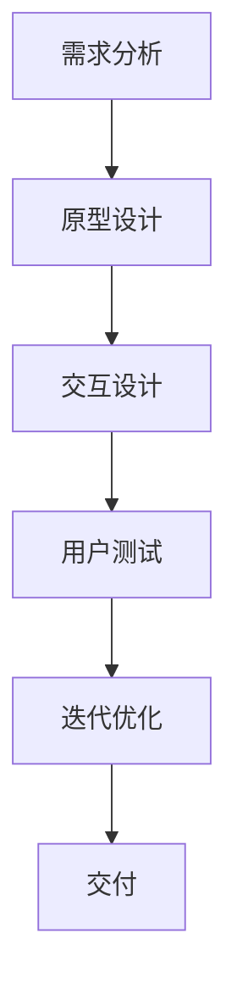

                 

# 2024字节跳动技术用户交互设计师面试真题解析

> 关键词：字节跳动、技术面试、用户交互设计师、面试真题、解析、用户体验设计、交互设计、UI设计、UX设计、面试技巧

> 摘要：本文将针对2024年字节跳动技术用户交互设计师的面试真题进行详细解析，帮助读者了解面试中的常见问题和答案，掌握用户交互设计的核心要点。通过本文，读者将获得用户交互设计师面试的宝贵经验和实用技巧。

## 1. 背景介绍

### 1.1 目的和范围

本文旨在通过对2024年字节跳动技术用户交互设计师面试真题的解析，为准备面试的读者提供有针对性的指导和参考。本文将涵盖以下几个主要方面：

- 面试真题回顾与解析
- 用户交互设计的核心概念与原则
- 面试技巧与策略
- 实战案例分析

### 1.2 预期读者

本文适合以下读者群体：

- 准备参加字节跳动技术用户交互设计师面试的候选人
- 对用户交互设计感兴趣的技术爱好者
- 想了解用户体验设计行业动态的专业人士

### 1.3 文档结构概述

本文分为以下几个部分：

- 1. 背景介绍：介绍本文的目的、预期读者和文档结构。
- 2. 核心概念与联系：介绍用户交互设计的核心概念、原则和流程。
- 3. 核心算法原理 & 具体操作步骤：详细讲解用户交互设计的算法原理和操作步骤。
- 4. 数学模型和公式 & 详细讲解 & 举例说明：阐述用户交互设计的数学模型和公式，并举例说明。
- 5. 项目实战：分析一个实际案例，展示用户交互设计的过程和成果。
- 6. 实际应用场景：探讨用户交互设计的实际应用场景和效果。
- 7. 工具和资源推荐：推荐用户交互设计相关的学习资源、开发工具和框架。
- 8. 总结：总结用户交互设计的未来发展趋势与挑战。
- 9. 附录：常见问题与解答。
- 10. 扩展阅读 & 参考资料：提供进一步学习和研究的参考资料。

### 1.4 术语表

#### 1.4.1 核心术语定义

- 用户交互设计师：负责设计用户与产品之间的交互流程、界面和体验的专业人员。
- 用户体验设计（UX设计）：关注用户在使用产品过程中的感受、行为和需求的整体设计过程。
- 交互设计（IxD）：关注用户与产品之间的交互方式、流程和界面的设计。
- 用户界面设计（UI设计）：关注产品界面的视觉呈现、布局和美观性。

#### 1.4.2 相关概念解释

- 用户体验（UX）：用户在使用产品过程中所感受到的整体体验，包括满意度、易用性、愉悦度等。
- 用户研究（User Research）：通过调查、访谈、观察等方法了解用户的需求、行为和偏好，为设计提供依据。
- 资讯架构（Information Architecture）：关注产品信息的组织、分类和呈现方式，提高用户查找和获取信息的能力。
- 交互模型（Interaction Model）：描述用户与产品之间交互的方式、流程和规则。

#### 1.4.3 缩略词列表

- UX：用户体验设计
- IxD：交互设计
- UI：用户界面设计
- UXD：用户体验设计
- UI/UX：用户界面与用户体验设计
- VR：虚拟现实
- AR：增强现实
- VR/AR：虚拟现实与增强现实
- VR/AR/XR：虚拟现实、增强现实与扩展现实

## 2. 核心概念与联系

### 2.1 用户交互设计的核心概念

用户交互设计是用户体验设计的重要组成部分，它关注用户与产品之间的交互方式、流程和界面。以下是用户交互设计的一些核心概念：

1. **用户研究**：通过调查、访谈、观察等方法了解用户的需求、行为和偏好，为设计提供依据。
2. **需求分析**：分析用户需求，确定设计目标，明确设计需求和优先级。
3. **交互流程**：设计用户与产品之间的交互流程，包括导航、操作和反馈等。
4. **界面设计**：设计产品的用户界面，包括布局、颜色、字体、图标等。
5. **用户测试**：通过用户测试收集反馈，验证设计方案的可行性和有效性。

### 2.2 用户交互设计的原则

在用户交互设计中，遵循以下原则可以提升用户体验：

1. **以用户为中心**：设计应始终关注用户的需求和偏好，确保产品易于使用和操作。
2. **一致性**：保持设计风格和交互方式的一致性，避免用户产生困惑和不适。
3. **简洁性**：设计应尽量简洁明了，避免冗余和复杂的操作。
4. **易用性**：确保产品易于学习和使用，降低用户的学习成本。
5. **反馈与引导**：提供及时的反馈和引导，帮助用户理解操作结果和下一步操作。

### 2.3 用户交互设计的流程

用户交互设计通常包括以下流程：

1. **需求分析**：了解用户需求，明确设计目标。
2. **原型设计**：绘制产品原型，包括界面布局、交互流程等。
3. **交互设计**：细化交互流程和界面设计，确保用户体验。
4. **用户测试**：收集用户反馈，验证设计方案。
5. **迭代优化**：根据用户反馈进行设计修改和优化。

### 2.4 用户交互设计的 Mermaid 流程图

## 3. 核心算法原理 & 具体操作步骤

### 3.1 用户研究

用户研究是用户交互设计的起点，通过调查、访谈、观察等方法了解用户的需求、行为和偏好。以下是用户研究的具体操作步骤：

1. **确定研究目标**：明确研究的目的和范围，确定需要解决的问题。
2. **制定研究计划**：确定研究方法、时间、地点、参与人员等。
3. **收集数据**：通过调查问卷、访谈、观察等方式收集用户数据。
4. **分析数据**：对收集到的数据进行整理、分析和解读。
5. **输出报告**：撰写研究报告，总结研究发现和结论。

### 3.2 需求分析

需求分析是用户交互设计的核心环节，通过对用户需求的分析和整理，确定设计目标和优先级。以下是需求分析的具体操作步骤：

1. **收集需求**：通过用户调研、访谈、问卷调查等方式收集用户需求。
2. **分类整理**：将收集到的需求进行分类整理，明确需求的优先级和重要性。
3. **需求文档**：撰写需求文档，详细描述每个需求的内容、功能和目标。
4. **需求验证**：与用户和利益相关者进行沟通和验证，确保需求的准确性和可行性。

### 3.3 交互设计

交互设计是用户交互设计的关键环节，涉及用户与产品之间的交互流程和界面设计。以下是交互设计的具体操作步骤：

1. **绘制线框图**：根据需求文档，绘制产品的线框图，明确界面布局和交互流程。
2. **设计界面元素**：设计界面元素，包括按钮、图标、文本、颜色等。
3. **编写交互逻辑**：编写产品的交互逻辑，确定用户操作和系统反馈的方式。
4. **制作原型**：将线框图和交互逻辑转化为可交互的原型，以便进行用户测试。

### 3.4 用户测试

用户测试是验证用户交互设计有效性的重要手段，通过观察和分析用户在测试环境中的行为，发现设计问题和不足。以下是用户测试的具体操作步骤：

1. **制定测试计划**：明确测试目标、测试方法、测试场景等。
2. **准备测试环境**：搭建测试环境，确保测试过程的顺利进行。
3. **招募测试人员**：招募合适的测试人员，确保测试结果的可靠性和代表性。
4. **进行测试**：按照测试计划进行测试，记录用户行为和反馈。
5. **分析测试结果**：对测试结果进行分析和解读，找出设计问题和不足。

### 3.5 迭代优化

迭代优化是用户交互设计的重要环节，通过不断修改和优化设计方案，提高产品的用户体验。以下是迭代优化

