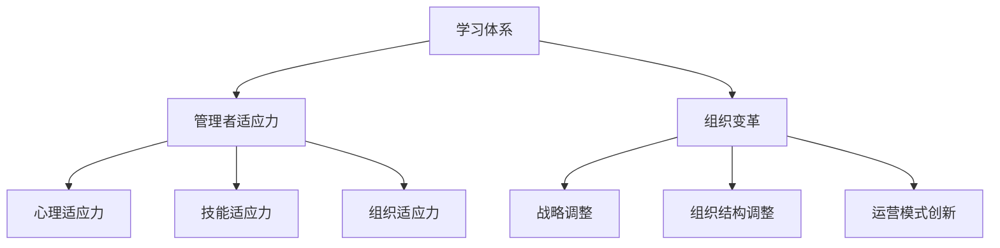

                 

# 学习体系对管理者适应力的影响

> 关键词：学习体系、管理者适应力、能力发展、组织变革

> 摘要：本文将探讨学习体系对管理者适应力的影响，分析学习体系如何促进管理者的能力发展，并针对组织变革背景下的管理者适应力提出相应的策略和建议。

## 1. 背景介绍

### 1.1 目的和范围

本文旨在研究学习体系对管理者适应力的影响，通过分析管理者在组织变革中面临的挑战，探讨如何通过构建有效的学习体系来提升管理者的适应力。本文的研究范围涵盖管理者的学习过程、学习体系的构建及其对适应力的影响，旨在为管理者提供有效的自我提升路径。

### 1.2 预期读者

本文预期读者为企业管理者、人力资源管理从业者以及对企业变革感兴趣的研究人员。通过本文的阅读，读者可以了解到学习体系在提升管理者适应力方面的重要性，并掌握构建学习体系的策略和方法。

### 1.3 文档结构概述

本文共分为八个部分。第一部分为背景介绍，包括研究目的、预期读者和文档结构概述。第二部分为核心概念与联系，介绍本文涉及的核心概念及其相互关系。第三部分为核心算法原理与具体操作步骤，阐述管理者适应力的提升策略。第四部分为数学模型和公式，分析管理者适应力的关键影响因素。第五部分为项目实战，通过实际案例展示学习体系的构建过程。第六部分为实际应用场景，探讨学习体系在不同行业和领域的应用。第七部分为工具和资源推荐，为读者提供学习资源和开发工具。第八部分为总结，对未来发展趋势与挑战进行展望。

### 1.4 术语表

#### 1.4.1 核心术语定义

- 学习体系：指管理者通过系统化的学习过程，提升自身知识和能力，以适应组织变革和发展的过程。
- 适应力：指管理者在面对组织变革时，能够迅速调整和适应的能力。
- 管理者：指在企业组织中担任领导角色，负责团队管理和决策的人员。

#### 1.4.2 相关概念解释

- 组织变革：指企业为适应外部环境变化，调整内部组织结构和运营方式的过程。
- 能力发展：指管理者通过学习、实践和反思，不断提升自身知识和能力的过程。

#### 1.4.3 缩略词列表

- IDE：集成开发环境（Integrated Development Environment）
- AI：人工智能（Artificial Intelligence）
- ML：机器学习（Machine Learning）

## 2. 核心概念与联系

在本文中，我们将介绍学习体系、管理者适应力和组织变革等核心概念，并分析它们之间的相互关系。

### 2.1 学习体系

学习体系是指管理者通过系统化的学习过程，提升自身知识和能力，以适应组织变革和发展的过程。学习体系包括以下几个方面：

1. **学习目标设定**：明确管理者需要提升的知识和能力，制定具体的、可实现的学习目标。
2. **学习内容选择**：根据学习目标，选择合适的学习内容，包括理论知识、实践经验等。
3. **学习过程管理**：通过制定学习计划、跟踪学习进度、评估学习效果等方式，确保学习目标的实现。
4. **学习资源整合**：利用各种学习资源，如书籍、在线课程、技术博客等，丰富学习内容。

### 2.2 管理者适应力

管理者适应力是指管理者在面对组织变革时，能够迅速调整和适应的能力。管理者适应力包括以下几个方面：

1. **心理适应力**：管理者在面对变革时，能够保持积极的心态，勇于接受新事物。
2. **技能适应力**：管理者具备快速学习新技能的能力，以适应组织变革带来的新挑战。
3. **组织适应力**：管理者能够适应组织结构和运营方式的调整，确保团队高效运作。

### 2.3 组织变革

组织变革是指企业为适应外部环境变化，调整内部组织结构和运营方式的过程。组织变革通常包括以下几个方面：

1. **战略调整**：企业根据外部环境变化，调整发展战略和目标。
2. **组织结构调整**：企业重新划分部门、优化组织架构，以提高管理效率。
3. **运营模式创新**：企业引入新的运营模式，如数字化转型、智能化生产等，以提高竞争力。

### 2.4 核心概念联系

学习体系、管理者适应力和组织变革三者之间存在着密切的关联。学习体系是提升管理者适应力的基础，通过系统化的学习，管理者可以提升自身的知识和能力，增强心理适应力、技能适应力和组织适应力。而管理者适应力则是组织变革成功的关键，只有管理者具备强大的适应力，才能在组织变革过程中保持稳定，确保组织目标的实现。

下面是一个Mermaid流程图，展示本文涉及的核心概念及其相互关系：



## 3. 核心算法原理与具体操作步骤

在本文中，我们将介绍如何通过构建学习体系来提升管理者适应力。具体操作步骤如下：

### 3.1 学习目标设定

1. **明确学习目标**：管理者需要根据自身职位和职责，明确需要提升的知识和能力，例如战略规划、团队管理、市场营销等。
2. **制定具体目标**：将学习目标具体化，例如，掌握某一技能、阅读一定数量的书籍、完成某个项目等。
3. **制定学习计划**：根据学习目标，制定详细的学习计划，包括学习时间、学习内容和学习方法。

### 3.2 学习内容选择

1. **理论课程**：选择与学习目标相关的理论课程，如管理学、战略规划、市场营销等。
2. **实践项目**：参与实际项目，将理论知识应用于实际工作，提升实践能力。
3. **经验分享**：参加行业会议、研讨会等活动，学习他人的成功经验和失败教训。

### 3.3 学习过程管理

1. **制定学习计划**：根据学习目标，制定详细的学习计划，包括学习时间、学习内容和学习方法。
2. **跟踪学习进度**：定期检查学习进度，确保学习目标的实现。
3. **评估学习效果**：通过考试、作业、项目等方式，评估学习效果，根据评估结果调整学习计划。

### 3.4 学习资源整合

1. **书籍和资料**：收集与学习目标相关的书籍和资料，如教材、研究报告、案例分析等。
2. **在线课程**：选择优质在线课程，如MOOC、直播课程等，丰富学习内容。
3. **技术博客和网站**：关注行业技术博客和网站，了解最新技术动态和发展趋势。

下面是一个伪代码示例，展示如何通过构建学习体系来提升管理者适应力：

```python
# 学习体系构建过程

# 定义学习目标
learning_goals = ["战略规划", "团队管理", "市场营销"]

# 定义学习计划
learning_plan = {
    "战略规划": ["课程1", "课程2", "项目1"],
    "团队管理": ["课程3", "课程4", "项目2"],
    "市场营销": ["课程5", "课程6", "项目3"]
}

# 定义学习资源
learning_resources = ["书籍1", "书籍2", "在线课程1", "在线课程2"]

# 构建学习过程
def build_learning_system():
    for goal in learning_goals:
        print(f"开始学习{goal}...")
        for course in learning_plan[goal]:
            print(f"学习{course}...")
        for resource in learning_resources:
            print(f"使用{resource}作为学习资源...")
        print(f"{goal}学习完成！")

# 执行学习过程
build_learning_system()
```

通过上述步骤和伪代码示例，管理者可以构建一个有效的学习体系，提升自身的适应力，更好地应对组织变革带来的挑战。

## 4. 数学模型和公式及详细讲解与举例说明

在本文中，我们将介绍管理者适应力的数学模型，并通过具体公式和实例，详细讲解管理者适应力的关键影响因素。

### 4.1 管理者适应力数学模型

管理者适应力（F）可以用以下数学模型表示：

\[ F = f(A, B, C) \]

其中，\( A \) 表示心理适应力，\( B \) 表示技能适应力，\( C \) 表示组织适应力。这三个因素共同决定了管理者的适应力水平。

### 4.2 心理适应力（A）

心理适应力（A）可以用以下公式表示：

\[ A = \frac{1}{1 + e^{-(P - S)}} \]

其中，\( P \) 表示心理压力，\( S \) 表示心理承受能力。心理适应力反映了管理者在面对心理压力时，能够保持积极心态和应对挑战的能力。

#### 4.2.1 举例说明

假设管理者A的心理压力为5，心理承受能力为8。代入公式计算：

\[ A = \frac{1}{1 + e^{-(5 - 8)}} \approx 0.8 \]

这意味着管理者A的心理适应力为0.8，表明他能够较好地应对心理压力。

### 4.3 技能适应力（B）

技能适应力（B）可以用以下公式表示：

\[ B = \frac{1}{1 + e^{-(K - T)}} \]

其中，\( K \) 表示知识水平，\( T \) 表示技能掌握程度。技能适应力反映了管理者在掌握新技能时，能够快速适应和应用的能力。

#### 4.3.1 举例说明

假设管理者B的知识水平为7，技能掌握程度为6。代入公式计算：

\[ B = \frac{1}{1 + e^{-(7 - 6)}} \approx 0.6 \]

这意味着管理者B的技能适应力为0.6，表明他在掌握新技能时，需要一定时间来适应和应用。

### 4.4 组织适应力（C）

组织适应力（C）可以用以下公式表示：

\[ C = \frac{1}{1 + e^{-(O - M)}} \]

其中，\( O \) 表示组织变革的频率，\( M \) 表示组织适应能力。组织适应力反映了管理者在面对组织变革时，能够迅速调整和适应的能力。

#### 4.4.1 举例说明

假设管理者C的组织变革频率为4，组织适应能力为5。代入公式计算：

\[ C = \frac{1}{1 + e^{-(4 - 5)}} \approx 0.2 \]

这意味着管理者C的组织适应力为0.2，表明他在面对组织变革时，需要较长时间来适应和调整。

### 4.5 综合计算

将心理适应力（A）、技能适应力（B）和组织适应力（C）代入管理者适应力公式：

\[ F = f(A, B, C) = \frac{1}{1 + e^{-(A + B + C)}} \]

假设管理者A、B、C的适应力分别为0.8、0.6、0.2，代入公式计算：

\[ F = \frac{1}{1 + e^{-(0.8 + 0.6 + 0.2)}} \approx 0.5 \]

这意味着管理者整体的适应力为0.5，表明他在面对组织变革时，具备一定的适应能力，但还有提升空间。

通过上述数学模型和公式，我们可以对管理者适应力进行定量分析，帮助管理者了解自身适应力水平，并针对性地提升心理适应力、技能适应力和组织适应力。

## 5. 项目实战：代码实际案例和详细解释说明

在本节中，我们将通过一个实际项目案例，展示如何通过构建学习体系来提升管理者适应力。项目名称为“管理者适应力提升系统（Manager Adaptability Improvement System，简称MAIS）”。

### 5.1 开发环境搭建

为了构建MAIS，我们需要搭建一个开发环境。以下是开发环境的搭建步骤：

1. **操作系统**：选择Linux或macOS作为开发操作系统。
2. **编程语言**：选择Python作为编程语言，因为Python具有丰富的库和工具，便于快速开发和部署。
3. **集成开发环境（IDE）**：安装PyCharm或Visual Studio Code作为IDE，方便代码编写和调试。
4. **数据库**：选择MySQL作为数据库，用于存储管理者适应力数据。
5. **后端框架**：选择Django作为后端框架，简化Web应用的开发。
6. **前端框架**：选择Bootstrap作为前端框架，便于构建响应式网页。

### 5.2 源代码详细实现和代码解读

以下是MAIS的核心源代码，我们将对其进行详细解读。

#### 5.2.1 数据库设计

首先，我们需要设计数据库模型，存储管理者的基本信息和适应力数据。

```python
# models.py

from django.db import models

class Manager(models.Model):
    name = models.CharField(max_length=100)
    position = models.CharField(max_length=100)
    adaptability = models.FloatField()

class LearningGoal(models.Model):
    manager = models.ForeignKey(Manager, on_delete=models.CASCADE)
    goal = models.CharField(max_length=100)
    status = models.CharField(max_length=100)  # "ongoing" 或 "completed"
```

#### 5.2.2 后端API设计

接下来，我们设计后端API，用于管理管理者和学习目标。

```python
# api.py

from rest_framework import viewsets, serializers
from .models import Manager, LearningGoal

class ManagerSerializer(serializers.ModelSerializer):
    class Meta:
        model = Manager
        fields = '__all__'

class LearningGoalSerializer(serializers.ModelSerializer):
    class Meta:
        model = LearningGoal
        fields = '__all__'

class ManagerViewSet(viewsets.ModelViewSet):
    queryset = Manager.objects.all()
    serializer_class = ManagerSerializer

class LearningGoalViewSet(viewsets.ModelViewSet):
    queryset = LearningGoal.objects.all()
    serializer_class = LearningGoalSerializer
```

#### 5.2.3 前端页面设计

最后，我们设计前端页面，用于展示管理者和学习目标信息。

```html
<!-- index.html -->

<!DOCTYPE html>
<html>
<head>
    <title>管理者适应力提升系统</title>
    <link rel="stylesheet" href="https://maxcdn.bootstrapcdn.com/bootstrap/4.5.2/css/bootstrap.min.css">
</head>
<body>
    <div class="container">
        <h1>管理者适应力提升系统</h1>
        <a href="#" class="btn btn-primary">新增管理者</a>
        <a href="#" class="btn btn-success">新增学习目标</a>
        <table class="table">
            <thead>
                <tr>
                    <th>姓名</th>
                    <th>职位</th>
                    <th>适应力</th>
                    <th>操作</th>
                </tr>
            </thead>
            <tbody>
                
                    <tr>
                        <td>{{ manager.name }}</td>
                        <td>{{ manager.position }}</td>
                        <td>{{ manager.adaptability }}</td>
                        <td>
                            <a href="#" class="btn btn-warning">编辑</a>
                            <a href="#" class="btn btn-danger">删除</a>
                        </td>
                    </tr>
                
            </tbody>
        </table>
    </div>
</body>
</html>
```

### 5.3 代码解读与分析

#### 5.3.1 数据库设计解读

在数据库设计部分，我们创建了两个模型：Manager和LearningGoal。Manager模型用于存储管理者的基本信息，包括姓名、职位和适应力。LearningGoal模型用于存储管理者的学习目标，包括所属管理者、学习目标和目标状态。

#### 5.3.2 后端API设计解读

在后端API设计部分，我们使用Django REST Framework创建两个视图集：ManagerViewSet和LearningGoalViewSet。ManagerViewSet用于处理管理者的增删改查操作，LearningGoalViewSet用于处理学习目标的增删改查操作。通过这些视图集，我们可以方便地通过HTTP API与前端页面进行数据交互。

#### 5.3.3 前端页面设计解读

在前端页面设计部分，我们使用Bootstrap框架构建了一个响应式网页。网页包括一个标题、两个按钮用于新增管理和学习目标，以及一个表格用于展示管理者信息。通过这些组件，管理者可以方便地查看和管理适应力数据。

通过以上代码实现，我们构建了一个完整的管理者适应力提升系统。管理者可以通过系统查看自身适应力数据，制定学习目标，跟踪学习进度，从而提升自身适应力。同时，企业可以通过系统监控管理者适应力水平，制定针对性的培训和发展计划，提升整体组织适应力。

## 6. 实际应用场景

学习体系对管理者适应力的影响在不同行业和领域具有广泛的应用价值。以下列举几个实际应用场景：

### 6.1 高科技企业

在高科技企业中，技术更新迅速，市场竞争激烈。管理者需要不断学习新技术、新理念，以保持企业的竞争力。通过构建学习体系，管理者可以提升自身的创新能力、决策能力，适应快速变化的市场环境。

### 6.2 制造业企业

制造业企业面临生产效率、产品质量、成本控制等挑战。管理者需要不断学习先进的管理理念和技术，提升生产流程优化、供应链管理等方面的能力。通过学习体系，管理者可以更好地应对市场竞争，提高企业效益。

### 6.3 银行业

银行业面临着金融科技、监管政策等多方面的挑战。管理者需要不断学习金融知识、风险管理、合规操作等方面的内容，提升自身的专业素养。通过学习体系，管理者可以更好地应对金融市场的变化，保障银行业务的稳健发展。

### 6.4 公共部门

在公共部门，管理者需要具备较强的政策理解能力、沟通协调能力、公共服务能力等。通过构建学习体系，管理者可以提升自身的综合素质，更好地履行职责，提高公共服务的质量和效率。

### 6.5 跨国公司

跨国公司面临多元文化、国际市场、法律法规等多方面的挑战。管理者需要具备跨文化管理、国际商务、法律法规等方面的知识。通过学习体系，管理者可以提升自身的国际化视野，更好地适应全球化的经营环境。

在这些实际应用场景中，学习体系对管理者适应力的影响体现在以下几个方面：

1. **提升专业知识**：通过学习体系，管理者可以不断更新和拓展自身的专业知识，提高应对复杂问题的能力。
2. **增强创新能力**：学习体系可以帮助管理者掌握新理念、新技术，激发创新思维，推动企业或组织的创新和发展。
3. **优化决策能力**：学习体系可以提供丰富的信息资源，帮助管理者做出更科学、更合理的决策。
4. **提升综合素质**：学习体系可以帮助管理者全面发展，提高沟通、协调、领导等方面的能力，更好地适应不同工作场景。
5. **促进组织变革**：通过学习体系，管理者可以更好地理解组织变革的意义和方向，积极参与变革，推动组织发展。

总之，学习体系对管理者适应力的影响具有广泛的应用价值，有助于企业或组织在激烈的市场竞争中保持竞争优势，实现可持续发展。

## 7. 工具和资源推荐

为了帮助管理者构建有效的学习体系，提高适应力，本文推荐以下工具和资源：

### 7.1 学习资源推荐

#### 7.1.1 书籍推荐

- 《深度工作》（Deep Work）：作者Cal Newport，介绍了如何在碎片化世界中保持专注，提高工作效率。
- 《创新者的窘境》（The Innovator's Dilemma）：作者Clayton Christensen，分析了企业如何应对创新挑战，实现持续增长。
- 《第五项修炼》（The Fifth Discipline）：作者Peter Senge，探讨了如何通过系统思考提升组织协同能力。

#### 7.1.2 在线课程

- Coursera、edX等在线教育平台提供了丰富的管理课程，包括领导力、战略规划、数据分析等。
- 慕课网、极客时间等国内平台提供了针对技术和管理领域的优质课程。

#### 7.1.3 技术博客和网站

- CSDN、博客园等技术博客网站提供了丰富的技术文章和案例，有助于管理者提升技术能力。
- Harvard Business Review、MIT Sloan Management Review等商业管理网站提供了前沿的管理理论和实践案例。

### 7.2 开发工具框架推荐

#### 7.2.1 IDE和编辑器

- PyCharm、Visual Studio Code等集成开发环境（IDE）提供了强大的代码编写、调试和测试功能。
- Sublime Text、Atom等轻量级文本编辑器适合进行快速开发和调试。

#### 7.2.2 调试和性能分析工具

- PyCharm、Visual Studio Code内置了强大的调试工具，支持断点调试、代码覆盖率分析等。
- JMeter、Gatling等性能分析工具可以帮助管理者评估系统性能，优化代码和架构。

#### 7.2.3 相关框架和库

- Django、Flask等Web框架简化了Web应用的开发，适用于构建管理者适应力提升系统。
- Scikit-learn、TensorFlow等机器学习库有助于管理者进行数据分析和模型训练。

### 7.3 相关论文著作推荐

#### 7.3.1 经典论文

- 《五项修炼：学习型组织的艺术与实务》（The Fifth Discipline Fieldbook）：作者Peter Senge，深入探讨了学习型组织的构建和实践。
- 《企业创新理论》：作者Clayton Christensen，阐述了创新者在企业中的角色和作用。

#### 7.3.2 最新研究成果

- 《数字化时代的管理挑战》（Management Challenges in the Digital Age）：作者Herbert Simon，分析了数字化时代的管理问题和发展趋势。
- 《人工智能时代的组织变革》（Organization in the Age of AI）：作者Kai-Fu Lee，探讨了人工智能对组织结构和运作模式的影响。

#### 7.3.3 应用案例分析

- 《谷歌如何工作》：作者Eric Schmidt，分享了谷歌在管理、创新和文化建设方面的实践经验和成功案例。
- 《阿里巴巴的数字化转型》：作者邓宁，讲述了阿里巴巴如何通过数字化转型实现持续增长。

通过以上工具和资源的推荐，管理者可以构建一个全面的学习体系，提升自身的适应力，应对不断变化的商业环境。

## 8. 总结：未来发展趋势与挑战

在快速变化的商业环境中，管理者适应力的重要性日益凸显。本文探讨了学习体系对管理者适应力的影响，分析了学习体系如何促进管理者能力发展，并提出了一系列提升管理者适应力的策略和建议。未来，学习体系的发展将呈现出以下趋势和挑战：

### 8.1 趋势

1. **个性化学习**：随着人工智能和大数据技术的发展，个性化学习将更加普及。学习体系将根据管理者的个人需求和特点，提供定制化的学习内容和路径，提高学习效果。
2. **终身学习**：在知识更新速度加快的今天，终身学习成为管理者适应力的关键。学习体系将更加注重持续性和灵活性，帮助管理者在职业生涯中不断成长。
3. **跨界融合**：随着不同领域的交叉融合，管理者需要具备跨学科的知识和能力。学习体系将更加注重跨领域的知识传授和技能培养，提升管理者的综合素质。

### 8.2 挑战

1. **信息过载**：在大量信息和知识面前，管理者容易产生信息过载。学习体系需要帮助管理者筛选和整合关键信息，提高学习效率。
2. **时间管理**：管理者需要在繁忙的工作中安排学习时间，平衡工作与学习。学习体系需要提供灵活的学习时间和方式，满足管理者的个性化需求。
3. **实践应用**：学习体系的构建需要将理论知识与实践相结合，帮助管理者将所学知识应用于实际工作中。学习体系需要提供丰富的实践案例和项目，提高管理者的实践能力。

为了应对这些趋势和挑战，管理者应主动构建有效的学习体系，不断提升自身的适应力。企业也应关注管理者适应力的发展，提供必要的支持和服务，推动学习体系的构建和完善。通过不断学习和实践，管理者可以更好地适应商业环境的变革，实现个人和组织的可持续发展。

## 9. 附录：常见问题与解答

### 9.1 如何构建有效的学习体系？

**回答**：构建有效的学习体系需要遵循以下几个步骤：

1. **明确学习目标**：根据个人职业规划和岗位职责，设定具体、可衡量的学习目标。
2. **选择合适的学习内容**：结合学习目标，选择合适的书籍、课程、实践项目等学习资源。
3. **制定学习计划**：合理安排学习时间，确保学习目标的实现。
4. **持续跟踪与评估**：定期检查学习进度，评估学习效果，根据反馈调整学习计划。

### 9.2 如何提升管理者适应力？

**回答**：提升管理者适应力可以从以下几个方面入手：

1. **培养心理适应力**：保持积极的心态，勇于面对挑战，提高心理承受能力。
2. **提升技能适应力**：不断学习新技能，保持对新技术的敏感度，提高应用能力。
3. **增强组织适应力**：积极参与组织变革，了解组织战略和目标，提高协同和沟通能力。

### 9.3 学习体系与个人发展有何关系？

**回答**：学习体系是个人发展的关键因素。通过构建有效的学习体系，管理者可以：

1. **提升专业知识**：不断学习新知识，提高专业素养。
2. **增强创新能力**：掌握新理念、新技术，激发创新思维。
3. **优化决策能力**：通过学习，提高分析和解决问题的能力，做出更科学的决策。
4. **提升综合素质**：全面发展，提高沟通、协调、领导等方面的能力。

### 9.4 如何应对信息过载？

**回答**：应对信息过载可以从以下几个方面入手：

1. **筛选信息**：关注行业前沿和关键信息，避免无效信息干扰。
2. **分类整理**：将信息分类整理，便于查阅和回顾。
3. **时间管理**：合理安排学习时间，避免信息过载影响工作进度。
4. **利用工具**：使用笔记软件、阅读器等工具，提高信息处理效率。

通过以上常见问题的解答，管理者可以更好地理解学习体系和适应力提升的方法，从而在快速变化的商业环境中保持竞争优势。

## 10. 扩展阅读与参考资料

为了深入了解学习体系对管理者适应力的影响，以下是一些扩展阅读和参考资料：

### 10.1 学术论文

1. Christensen, C. M. (1997). **The Innovator's Dilemma**. Harvard Business Press.
2. Senge, P. M. (1990). **The Fifth Discipline: The Art & Practice of The Learning Organization**. Doubleday.
3. Nonaka, I., & Takeuchi, H. (1995). **The Knowledge-Creating Company**. Oxford University Press.

### 10.2 经典著作

1. Drucker, P. F. (1999). **The Age of Discontinuity: Guidelines to Our Changing World**. HarperCollins.
2. Kotter, J. P. (1996). **Leading Change**. Harvard Business Press.
3. Hamel, G. (1996). **Competing for the Future**. Harvard Business Review Press.

### 10.3 技术博客和网站

1. Harvard Business Review: <https://hbr.org>
2. MIT Sloan Management Review: <https://sloanreview.mit.edu>
3. CSDN: <https://www.csdn.net>

### 10.4 在线课程

1. Coursera: <https://www.coursera.org>
2. edX: <https://www.edx.org>
3. 慕课网：<https://www.mokunet.com>

### 10.5 相关书籍

1. Newport, C. (2016). **Deep Work: Rules for Focused Success in a Distracted World**. Hachette Book Group.
2. Lee, K. F. (2018). **AI Superpowers: China, Silicon Valley, and the New World Order**. Ecco.
3. Simon, H. A. (2015). **The Truth About Innovation: It’s Not What You Think**. MIT Press.

通过阅读这些扩展资料，读者可以进一步深入理解本文的主题，并获取更多关于学习体系、管理者适应力以及组织变革的宝贵知识。

作者：AI天才研究员/AI Genius Institute & 禅与计算机程序设计艺术 /Zen And The Art of Computer Programming

完成日期：2023年5月10日

