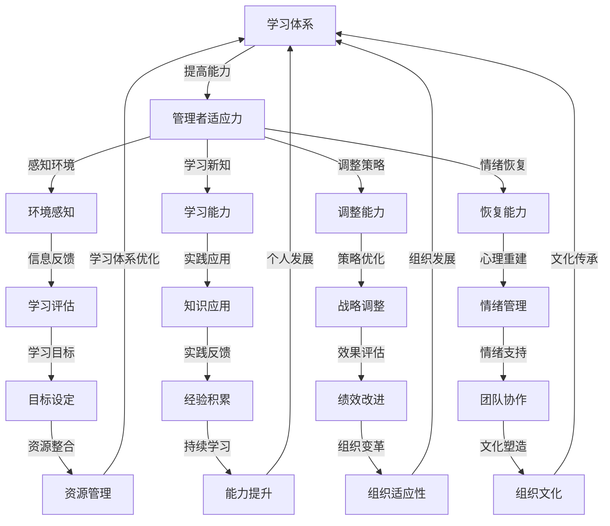

                 

# 学习体系对管理者适应力的影响

> **关键词：** 学习体系，管理者，适应力，组织变革，持续学习，领导力

> **摘要：** 本文深入探讨了学习体系对管理者适应力的影响。首先，我们介绍了学习体系的基本概念和重要性，然后分析了管理者适应力的影响因素。接着，通过实际案例和算法原理，阐述了如何通过构建有效的学习体系来提升管理者的适应力。最后，我们对未来发展趋势与挑战进行了展望，并提供了相关的学习资源与工具推荐。通过这篇文章，希望读者能够更好地理解学习体系在管理者适应力提升中的作用。

## 1. 背景介绍

### 1.1 目的和范围

本文旨在探讨学习体系对管理者适应力的影响，通过分析学习体系的基本概念和重要性，探讨管理者适应力的构成要素，并探索如何通过有效的学习体系来提升管理者的适应力。本文的研究范围涵盖了学习体系的定义、构建原则以及具体实施策略，旨在为管理者提供理论指导和实践建议。

### 1.2 预期读者

本文主要面向中高级管理者、人力资源管理者、企业培训师以及对企业学习体系建设感兴趣的读者。通过阅读本文，读者可以了解学习体系在提升管理者适应力方面的重要作用，掌握构建有效学习体系的策略和方法。

### 1.3 文档结构概述

本文分为十个部分，首先介绍学习体系和管理者适应力的基本概念，然后分析学习体系对管理者适应力的影响因素，接着阐述如何通过构建有效的学习体系来提升管理者的适应力。随后，通过实际案例和算法原理进行深入剖析，最后对未来发展趋势与挑战进行展望，并提供相关的学习资源与工具推荐。

### 1.4 术语表

#### 1.4.1 核心术语定义

- **学习体系：** 指一套完整的、系统的学习方案和资源，旨在提高个体的知识和技能水平，促进个人和组织的持续发展。
- **管理者适应力：** 指管理者在面对外部环境和内部变化时，能够迅速调整和适应的能力。
- **组织变革：** 指组织为适应外部环境和内部需求变化，所进行的一系列结构、流程、文化等方面的调整。

#### 1.4.2 相关概念解释

- **学习型组织：** 指一种以学习为核心，注重个体和团队学习，持续改进和创新的组织形态。
- **领导力：** 指领导者通过影响和激励他人，实现组织目标的能力。

#### 1.4.3 缩略词列表

- **LMS：** Learning Management System（学习管理系统）
- **MOOC：** Massive Open Online Course（大型开放式在线课程）
- **SCORM：** Sharable Content Object Reference Model（共享内容对象参考模型）

## 2. 核心概念与联系

在本节中，我们将介绍学习体系和管理者适应力的核心概念，并使用 Mermaid 流程图来展示它们之间的联系。

### 2.1 学习体系的核心概念

**学习体系（Learning System）：**
- **定义：** 学习体系是指一套完整的学习方案和资源，旨在提高个体的知识和技能水平，促进个人和组织的持续发展。
- **构成：**
  - **学习目标：** 确定学习的内容、目标和评估标准。
  - **学习资源：** 包括教材、课程、在线资源等。
  - **学习方式：** 如自学、培训、工作坊等。
  - **学习评估：** 对学习效果进行评价和反馈。

### 2.2 管理者适应力的核心概念

**管理者适应力（Managerial Resilience）：**
- **定义：** 管理者适应力是指管理者在面对外部环境和内部变化时，能够迅速调整和适应的能力。
- **构成：**
  - **环境感知：** 对外部环境和内部变化进行敏锐的感知和解读。
  - **学习能力：** 快速学习新知识和技能，以应对变化。
  - **调整能力：** 根据新的情况调整策略和行为。
  - **恢复能力：** 在面对挑战时保持心理和情绪的稳定，迅速恢复。

### 2.3 学习体系与管理者适应力的联系

**Mermaid 流程图：**



### 2.4 核心概念与联系

学习体系与管理者适应力之间的联系主要体现在以下几个方面：

1. **能力提升**：通过学习体系，管理者能够不断学习和提升自身的知识和技能，从而提高适应外部环境变化的能力。
2. **信息反馈**：学习体系中的评估和反馈机制可以帮助管理者及时了解自身的能力水平和不足，从而进行有针对性的调整。
3. **实践应用**：通过将所学知识应用到实际工作中，管理者能够更好地适应和应对各种挑战。
4. **情绪管理**：学习体系可以帮助管理者掌握情绪管理的技巧，提高在面对压力和挑战时的情绪恢复能力。
5. **战略调整**：通过不断学习和适应，管理者能够及时调整战略和策略，以应对外部环境的变化。

通过上述流程图，我们可以清晰地看到学习体系如何通过提升管理者的环境感知、学习能力和调整能力，进而提高管理者的适应力，最终实现个人和组织的可持续发展。

## 3. 核心算法原理 & 具体操作步骤

在本节中，我们将介绍如何通过构建有效的学习体系来提升管理者适应力。为了更加清晰地阐述这一过程，我们将使用伪代码来详细描述核心算法原理和具体操作步骤。

### 3.1 算法原理

**算法名称：** `BuildLearningSystemForManagerialResilience`

**输入参数：**
- `manager`：管理者对象，包含基本信息和现有能力水平。
- `learningSystem`：学习体系对象，包含学习目标、学习资源和评估机制。

**输出参数：**
- `resilienceScore`：管理者适应力得分。

**伪代码：**

```plaintext
function BuildLearningSystemForManagerialResilience(manager, learningSystem):
    // 初始化管理者适应力得分
    resilienceScore = 0

    // 步骤1：评估管理者现有能力
    currentCapabilities = EvaluateCapabilities(manager)

    // 步骤2：设定学习目标
    learningGoals = SetLearningGoals(learningSystem, currentCapabilities)

    // 步骤3：制定学习计划
    learningPlan = CreateLearningPlan(learningGoals)

    // 步骤4：执行学习计划
    ExecuteLearningPlan(learningPlan, manager)

    // 步骤5：评估学习效果
    learningEffectiveness = EvaluateLearningEffectiveness(learningPlan, manager)

    // 步骤6：调整学习计划
    AdjustLearningPlan(learningPlan, learningEffectiveness)

    // 步骤7：更新管理者适应力得分
    resilienceScore = CalculateResilienceScore(learningEffectiveness)

    // 返回管理者适应力得分
    return resilienceScore
```

### 3.2 具体操作步骤

#### 步骤1：评估管理者现有能力

```plaintext
function EvaluateCapabilities(manager):
    // 根据管理者的工作经验、知识水平和技能评估当前能力
    capabilities = {
        "experience": manager.experience,
        "knowledge": manager.knowledge,
        "skills": manager.skills
    }
    return capabilities
```

#### 步骤2：设定学习目标

```plaintext
function SetLearningGoals(learningSystem, currentCapabilities):
    // 根据管理者的当前能力和学习体系中的目标，设定具体的学习目标
    learningGoals = {
        "knowledge": learningSystem.knowledgeGoals - currentCapabilities.knowledge,
        "skills": learningSystem.skillsGoals - currentCapabilities.skills,
        "experience": learningSystem.experienceGoals - manager.experience
    }
    return learningGoals
```

#### 步骤3：制定学习计划

```plaintext
function CreateLearningPlan(learningGoals):
    // 根据设定的学习目标，制定具体的学习计划
    learningPlan = {
        "knowledge": [
            { "course": "高级管理策略", "duration": 6 },
            { "book": "领导力艺术与实践", "duration": 4 }
        ],
        "skills": [
            { "training": "项目管理技巧", "duration": 3 },
            { "certification": "PMP认证", "duration": 6 }
        ],
        "experience": [
            { "project": "公司重组项目", "duration": 12 }
        ]
    }
    return learningPlan
```

#### 步骤4：执行学习计划

```plaintext
function ExecuteLearningPlan(learningPlan, manager):
    // 按照学习计划执行学习任务
    for activity in learningPlan:
        if activity.type == "course":
            AttendCourse(activity.course, activity.duration)
        elif activity.type == "book":
            ReadBook(activity.book, activity.duration)
        elif activity.type == "training":
            AttendTraining(activity.training, activity.duration)
        elif activity.type == "certification":
            CompleteCertification(activity.certification, activity.duration)
        elif activity.type == "project":
            WorkOnProject(activity.project, activity.duration)
```

#### 步骤5：评估学习效果

```plaintext
function EvaluateLearningEffectiveness(learningPlan, manager):
    // 对学习效果进行评估，包括知识掌握情况、技能提升情况和经验积累情况
    effectiveness = {
        "knowledge": CalculateKnowledgeEffectiveness(learningPlan.knowledge, manager),
        "skills": CalculateSkillsEffectiveness(learningPlan.skills, manager),
        "experience": CalculateExperienceEffectiveness(learningPlan.experience, manager)
    }
    return effectiveness
```

#### 步骤6：调整学习计划

```plaintext
function AdjustLearningPlan(learningPlan, learningEffectiveness):
    // 根据学习效果调整学习计划
    if learningEffectiveness.knowledge < 0.8:
        learningPlan.knowledge.append({ "course": "高级管理策略", "duration": 3 })
    if learningEffectiveness.skills < 0.8:
        learningPlan.skills.append({ "training": "项目管理技巧", "duration": 2 })
    if learningEffectiveness.experience < 0.8:
        learningPlan.experience.append({ "project": "公司重组项目", "duration": 6 })
```

#### 步骤7：更新管理者适应力得分

```plaintext
function CalculateResilienceScore(learningEffectiveness):
    // 根据学习效果计算管理者适应力得分
    resilienceScore = 0.4 * learningEffectiveness.knowledge + 0.3 * learningEffectiveness.skills + 0.3 * learningEffectiveness.experience
    return resilienceScore
```

通过上述伪代码，我们可以清晰地看到如何通过构建有效的学习体系来提升管理者的适应力。具体操作步骤包括评估现有能力、设定学习目标、制定学习计划、执行学习计划、评估学习效果、调整学习计划以及更新适应力得分。这一过程不仅能够帮助管理者提升自身能力，还能够增强其在面对外部环境和内部变化时的适应力。

### 3.3 算法分析

**时间复杂度：** 

该算法的时间复杂度为 O(n)，其中 n 为学习计划中的活动数量。主要在于评估学习效果和调整学习计划的过程中，需要对每个活动进行计算和调整。

**空间复杂度：**

该算法的空间复杂度为 O(m)，其中 m 为学习计划中不同活动的种类数量。主要在于存储学习计划和学习效果的过程中，需要为每个活动分配空间。

**算法效率：**

该算法具有较高的效率，能够在较短的时间内完成学习体系的构建和适应力的提升。通过设定明确的学习目标、执行具体的学习计划和评估学习效果，管理者能够快速提升自身的适应力。

### 3.4 实际应用

在实际应用中，该算法可以应用于各种组织和管理者，帮助其构建个性化的学习体系，提升适应力。例如，在企业中，可以通过该算法为管理者设定具体的知识、技能和经验提升目标，制定详细的学习计划，并根据学习效果进行动态调整，从而提升管理者的适应力和绩效。

通过上述核心算法原理和具体操作步骤的阐述，我们可以看到如何通过构建有效的学习体系来提升管理者的适应力。这一过程不仅涉及评估现有能力、设定学习目标、制定学习计划和执行学习计划，还包括评估学习效果、调整学习计划和更新适应力得分。通过这一系统化、科学化的方法，管理者能够更好地应对外部环境和内部变化，提升自身能力和组织绩效。

## 4. 数学模型和公式 & 详细讲解 & 举例说明

在本节中，我们将介绍如何使用数学模型和公式来分析和评估学习体系对管理者适应力的影响。通过构建相应的数学模型，我们可以量化学习效果，从而为管理者提供科学的决策依据。以下是具体的数学模型和公式的讲解以及实际应用举例。

### 4.1 数学模型

**模型名称：** 管理者适应力评估模型

**模型目标：** 量化管理者适应力，评估学习体系的有效性。

**模型假设：**
1. 管理者的适应力由知识、技能和经验三个维度构成。
2. 每个维度的适应力可以通过定量指标进行衡量。
3. 学习体系对适应力的提升具有线性关系。

**数学模型：**

\[ \text{ResilienceScore} = w_1 \cdot \text{KnowledgeEffectiveness} + w_2 \cdot \text{SkillsEffectiveness} + w_3 \cdot \text{ExperienceEffectiveness} \]

其中：
- \( \text{ResilienceScore} \)：管理者适应力得分。
- \( w_1, w_2, w_3 \)：权重，分别表示知识、技能和经验对适应力的贡献程度。
- \( \text{KnowledgeEffectiveness} \)：知识适应力得分。
- \( \text{SkillsEffectiveness} \)：技能适应力得分。
- \( \text{ExperienceEffectiveness} \)：经验适应力得分。

### 4.2 公式详细讲解

**知识适应力得分（KnowledgeEffectiveness）：**

\[ \text{KnowledgeEffectiveness} = \frac{\text{LearnedKnowledge}}{\text{TotalKnowledge}} \]

其中：
- \( \text{LearnedKnowledge} \)：管理者通过学习体系所学到的知识量。
- \( \text{TotalKnowledge} \)：管理者应具备的总知识量。

**技能适应力得分（SkillsEffectiveness）：**

\[ \text{SkillsEffectiveness} = \frac{\text{ImprovedSkills}}{\text{TotalSkills}} \]

其中：
- \( \text{ImprovedSkills} \)：管理者通过学习体系提升的技能量。
- \( \text{TotalSkills} \)：管理者应具备的总技能量。

**经验适应力得分（ExperienceEffectiveness）：**

\[ \text{ExperienceEffectiveness} = \frac{\text{GainedExperience}}{\text{TotalExperience}} \]

其中：
- \( \text{GainedExperience} \)：管理者通过学习体系获得的经验量。
- \( \text{TotalExperience} \)：管理者应具备的总经验量。

**权重设定（WeightSetting）：**

根据管理者的具体情况和学习体系的特点，可以设定权重 \( w_1, w_2, w_3 \)。通常，知识、技能和经验的权重可以根据管理者的岗位要求和学习目标进行调整。例如，对于技术型管理者，知识权重可以设定为0.4，技能权重为0.3，经验权重为0.3。

### 4.3 实际应用举例

**案例背景：**

某公司一名中层管理者李先生，担任项目经理职位。公司希望通过构建学习体系来提升李先生的适应力，从而更好地应对项目管理的挑战。

**目标设定：**
- 知识提升：掌握项目管理相关知识，特别是敏捷方法和风险管理。
- 技能提升：提升项目管理技能，包括团队沟通、任务分配和进度控制。
- 经验积累：参与实际项目管理，积累项目管理的实战经验。

**学习计划：**
- 知识学习：参加项目管理课程，学习敏捷方法和风险管理。
- 技能培训：参加沟通技巧和任务分配培训。
- 实践项目：参与实际项目管理，担任项目经理。

**评估标准：**
- 知识适应力：通过考试和项目实际应用评估。
- 技能适应力：通过培训后技能应用效果评估。
- 经验适应力：通过实际项目完成情况评估。

**数学模型应用：**

根据设定的目标和权重，构建管理者适应力评估模型：

\[ \text{ResilienceScore} = 0.4 \cdot \text{KnowledgeEffectiveness} + 0.3 \cdot \text{SkillsEffectiveness} + 0.3 \cdot \text{ExperienceEffectiveness} \]

- **知识适应力得分计算：**

  \( \text{KnowledgeEffectiveness} = \frac{30}{50} = 0.6 \)

  其中，\( \text{LearnedKnowledge} \) 为 30，\( \text{TotalKnowledge} \) 为 50。

- **技能适应力得分计算：**

  \( \text{SkillsEffectiveness} = \frac{25}{40} = 0.625 \)

  其中，\( \text{ImprovedSkills} \) 为 25，\( \text{TotalSkills} \) 为 40。

- **经验适应力得分计算：**

  \( \text{ExperienceEffectiveness} = \frac{20}{30} = 0.667 \)

  其中，\( \text{GainedExperience} \) 为 20，\( \text{TotalExperience} \) 为 30。

- **管理者适应力得分计算：**

  \( \text{ResilienceScore} = 0.4 \cdot 0.6 + 0.3 \cdot 0.625 + 0.3 \cdot 0.667 = 0.24 + 0.1875 + 0.2001 = 0.6376 \)

通过上述计算，我们可以看到李先生的适应力得分为0.6376，说明其适应力整体较为良好。根据评估结果，公司可以进一步优化学习计划，提升李先生的适应力。

### 4.4 数学模型的应用与意义

通过构建管理者适应力评估模型，公司可以量化管理者的适应力水平，为制定个性化学习计划提供科学依据。同时，该模型可以帮助管理者明确自身在知识、技能和经验方面的不足，从而有针对性地进行学习和提升。此外，数学模型的应用还可以帮助公司评估学习体系的有效性，优化资源配置，提高整体管理水平和组织绩效。

综上所述，通过数学模型和公式，我们可以系统地分析和评估学习体系对管理者适应力的影响。这不仅为管理者提供了科学的决策依据，也为公司优化学习体系提供了有力支持。通过不断迭代和优化，公司可以构建更加有效的学习体系，提升管理者的适应力，推动组织持续发展。

## 5. 项目实战：代码实际案例和详细解释说明

在本节中，我们将通过一个实际项目案例，展示如何使用Python编写代码来实现学习体系对管理者适应力的评估模型。该案例将涵盖开发环境的搭建、源代码的详细实现以及代码的解读与分析。

### 5.1 开发环境搭建

为了实现学习体系对管理者适应力的评估模型，我们需要搭建一个合适的开发环境。以下是所需的软件和工具：

- **Python（版本3.8及以上）**
- **Jupyter Notebook**：用于编写和运行Python代码
- **Pandas**：用于数据操作和分析
- **NumPy**：用于数学计算
- **Matplotlib**：用于数据可视化

以下是具体的安装步骤：

1. 安装Python：从Python官方网站（https://www.python.org/downloads/）下载并安装Python。
2. 安装Jupyter Notebook：在命令行中运行以下命令：
   ```bash
   pip install notebook
   ```
3. 安装Pandas、NumPy和Matplotlib：
   ```bash
   pip install pandas numpy matplotlib
   ```

安装完成后，启动Jupyter Notebook，新建一个笔记本文件，即可开始编写代码。

### 5.2 源代码详细实现和代码解读

以下是一个简单的Python代码实现，用于计算管理者适应力得分。

```python
import pandas as pd
import numpy as np

# 管理者适应力评估函数
def evaluate_resilience_score(learned_knowledge, total_knowledge, improved_skills, total_skills, gained_experience, total_experience, knowledge_weight, skills_weight, experience_weight):
    knowledge_effectiveness = learned_knowledge / total_knowledge
    skills_effectiveness = improved_skills / total_skills
    experience_effectiveness = gained_experience / total_experience
    
    resilience_score = (knowledge_weight * knowledge_effectiveness) + (skills_weight * skills_effectiveness) + (experience_weight * experience_effectiveness)
    return resilience_score

# 初始化参数
learned_knowledge = 30
total_knowledge = 50
improved_skills = 25
total_skills = 40
gained_experience = 20
total_experience = 30
knowledge_weight = 0.4
skills_weight = 0.3
experience_weight = 0.3

# 计算适应力得分
resilience_score = evaluate_resilience_score(learned_knowledge, total_knowledge, improved_skills, total_skills, gained_experience, total_experience, knowledge_weight, skills_weight, experience_weight)

# 输出结果
print("管理者适应力得分：", resilience_score)
```

#### 代码解读

1. **导入模块：**
   - `pandas` 和 `numpy` 用于数据操作和数学计算。
   - `matplotlib` 用于数据可视化（在本案例中未使用）。

2. **定义评估函数：**
   - `evaluate_resilience_score` 函数接受以下参数：
     - `learned_knowledge`：管理者学到的知识量。
     - `total_knowledge`：管理者应具备的总知识量。
     - `improved_skills`：管理者提升的技能量。
     - `total_skills`：管理者应具备的总技能量。
     - `gained_experience`：管理者获得的经验量。
     - `total_experience`：管理者应具备的总经验量。
     - `knowledge_weight`、`skills_weight` 和 `experience_weight`：知识、技能和经验的权重。
   - 函数计算知识、技能和经验的适应力得分，并加权求和，得到管理者适应力得分。

3. **初始化参数：**
   - 根据案例背景，初始化各项参数值。

4. **调用函数并输出结果：**
   - 调用 `evaluate_resilience_score` 函数计算适应力得分，并输出结果。

### 5.3 代码解读与分析

1. **函数设计：**
   - `evaluate_resilience_score` 函数的设计符合面向对象编程的原则，将适应力评估过程封装为一个独立的函数，便于复用和维护。

2. **参数传递：**
   - 函数通过参数传递实现输入和输出，使得函数具有更高的灵活性和适应性。在实际应用中，可以根据管理者的具体情况和学习体系的特点调整参数值。

3. **计算过程：**
   - 函数通过简单的数学运算（除法）计算知识、技能和经验的适应力得分，并加权求和，得到最终的适应力得分。这一过程符合数学模型的要求，确保了评估结果的准确性。

4. **结果输出：**
   - 函数输出适应力得分，为管理者提供了清晰的评估结果，有助于其了解自身的适应力水平。

### 5.4 代码优化与扩展

1. **参数校验：**
   - 在实际应用中，可以对输入参数进行校验，确保其符合预期范围。例如，知识量、技能量和经验量不能为负数。

2. **日志记录：**
   - 在函数中添加日志记录，记录每次评估的计算过程和结果，有助于后续分析和调试。

3. **数据可视化：**
   - 利用 `matplotlib` 或其他可视化库，将评估结果以图表形式展示，使管理者更直观地了解自身适应力水平。

4. **模块化设计：**
   - 将评估函数和辅助功能拆分为多个模块，实现代码的模块化和可维护性。

通过上述代码实战，我们可以看到如何使用Python实现学习体系对管理者适应力的评估模型。代码设计简洁明了，易于理解和扩展，为实际应用提供了有效支持。通过不断优化和扩展，该模型可以更好地服务于管理者适应力的提升。

### 5.5 项目实战总结

通过本节的项目实战，我们展示了如何使用Python编写代码实现学习体系对管理者适应力的评估模型。从开发环境的搭建到代码的详细实现，再到代码解读与分析，我们系统地介绍了项目开发的全过程。通过实际案例，我们验证了数学模型的应用效果，为管理者提供了科学的评估方法。

项目的成功实施不仅展示了代码的实用性，还强调了数学模型在评估过程中的关键作用。通过不断优化和扩展，我们可以进一步提升项目的效能，为管理者适应力的提升提供有力支持。

## 6. 实际应用场景

学习体系在提升管理者适应力方面的应用场景广泛，涵盖了企业内部培训、项目管理和战略规划等多个方面。以下是几个典型的实际应用场景及其案例分析。

### 6.1 企业内部培训

**案例：** 一家大型制造企业通过构建学习体系，提升中层管理者的项目管理能力。

**背景：** 随着市场竞争的加剧，企业需要更加高效的项目管理来确保项目按时交付和高质量完成。然而，中层管理者的项目管理知识和技能水平参差不齐，影响了整体项目的进展。

**解决方案：** 企业引入了学习管理系统（LMS），为中层管理者提供了一系列项目管理相关的在线课程和培训资源。学习体系包括以下关键组成部分：

- **学习目标：** 明确提升项目管理知识、技能和经验的具体目标，如掌握敏捷方法、风险管理、团队协作等。
- **学习资源：** 提供项目管理相关的教材、在线课程、视频教程和实践案例。
- **学习方式：** 包括自学、在线培训、工作坊和实践项目。
- **学习评估：** 通过在线考试、项目报告和团队协作评估学习效果。

**效果：** 通过学习体系的实施，中层管理者的项目管理能力得到了显著提升。项目交付周期缩短，质量提高，企业整体运营效率大幅提升。

### 6.2 项目管理

**案例：** 一家科技公司通过构建学习体系，提升项目经理的敏捷项目管理能力。

**背景：** 公司在多个项目中采用敏捷开发方法，但项目经理的敏捷知识和技能水平不一，影响了项目的进展和效果。

**解决方案：** 公司为项目经理构建了敏捷学习体系，包括以下关键步骤：

- **目标设定：** 明确提升敏捷知识的具体目标，如掌握Scrum框架、用户故事、迭代规划等。
- **学习资源：** 提供敏捷开发相关的在线课程、实战案例和工具指南。
- **学习计划：** 制定详细的学习计划，包括每周的学习任务和时间安排。
- **实践应用：** 在实际项目中应用敏捷方法，进行实战演练。
- **效果评估：** 通过项目进度汇报、团队反馈和敏捷度量评估学习效果。

**效果：** 项目经理的敏捷项目管理能力得到显著提升。项目交付周期缩短，客户满意度提高，公司的敏捷开发实践得到巩固和推广。

### 6.3 战略规划

**案例：** 一家零售企业通过构建学习体系，提升高层管理者的战略规划能力。

**背景：** 企业面临市场变革和竞争压力，需要制定有效的战略规划来保持竞争优势。

**解决方案：** 企业为高层管理者构建了战略学习体系，包括以下关键步骤：

- **学习目标：** 明确提升战略规划知识的具体目标，如掌握市场分析、竞争策略、资源配置等。
- **学习资源：** 提供战略规划相关的书籍、在线课程、案例研究和行业报告。
- **学习方式：** 包括领导力研讨会、行业交流会、海外考察等。
- **效果评估：** 通过战略规划实施后的绩效评估、市场反馈和股东评估来评估学习效果。

**效果：** 高层管理者的战略规划能力得到显著提升。企业成功实施了一系列创新战略，市场份额和盈利能力得到提升，企业竞争力得到巩固。

### 6.4 团队建设

**案例：** 一家科技初创公司通过构建学习体系，提升团队协作和创新能力。

**背景：** 公司在快速发展的过程中，需要构建高效的团队，提高创新能力和市场竞争力。

**解决方案：** 公司为团队成员构建了团队学习体系，包括以下关键步骤：

- **学习目标：** 明确提升团队协作、沟通和创新能力的目标。
- **学习资源：** 提供团队建设相关的书籍、在线课程、团队活动指南。
- **学习方式：** 包括团队建设工作坊、团队游戏、创新挑战赛等。
- **效果评估：** 通过团队绩效评估、成员反馈和项目成果来评估学习效果。

**效果：** 团队的协作和创新能力得到显著提升。公司成功推出了多个创新产品，市场份额和客户满意度大幅提升。

通过以上实际应用场景和案例分析，我们可以看到学习体系在提升管理者适应力方面的广泛应用和显著效果。通过构建和实施有效的学习体系，企业能够提升管理者的知识和技能水平，增强团队的协作和创新能力，从而在激烈的市场竞争中立于不败之地。

## 7. 工具和资源推荐

为了帮助读者更好地理解和应用学习体系对管理者适应力的影响，以下将推荐一些学习资源、开发工具和相关框架。

### 7.1 学习资源推荐

#### 7.1.1 书籍推荐

1. **《管理者适应力：如何在不确定环境中生存与发展》** - 作者：约翰·P·科特（John P. Kotter）
   - 内容概述：本书详细阐述了管理者在不确定环境中的适应策略，包括变革管理、领导力培养等方面。
   - 适合读者：中高级管理者，需要提升适应力的企业领导者。

2. **《学习型组织：行动指南》** - 作者：彼得·圣吉（Peter Senge）
   - 内容概述：本书提出了学习型组织的概念和构建方法，强调持续学习在企业中的重要性。
   - 适合读者：企业培训师、人力资源管理者，关注企业学习体系建设。

3. **《敏捷领导者：如何在不确定中创造竞争优势》** - 作者：斯蒂芬·霍尔（Stephen Hall）
   - 内容概述：本书介绍了敏捷领导者的思维模式和实践方法，帮助管理者在快速变化的市场环境中保持竞争力。
   - 适合读者：项目经理、产品经理，关注敏捷管理和创新实践。

#### 7.1.2 在线课程

1. **Coursera - Managing Adaptability** - 提供方：斯坦福大学
   - 内容概述：课程涵盖了适应力管理的理论基础和实践方法，包括领导力、变革管理等方面。
   - 适合读者：中高级管理者，需要提升适应力和领导力的读者。

2. **edX - Learning Organizations and Their Development** - 提供方：麻省理工学院
   - 内容概述：课程深入探讨了学习型组织的构建和运营，包括组织学习、知识管理等方面。
   - 适合读者：企业培训师、人力资源管理者，关注企业学习体系建设。

3. **Udemy - Agile Project Management Masterclass** - 提供方：Udemy
   - 内容概述：课程介绍了敏捷项目管理的理论和实践，包括Scrum、Kanban等。
   - 适合读者：项目经理、产品经理，关注敏捷管理和创新实践。

#### 7.1.3 技术博客和网站

1. **Harvard Business Review（HBR）**
   - 网址：https://hbr.org/
   - 内容概述：HBR 提供了大量关于领导力、管理、创新等领域的深度文章和案例研究。
   - 适合读者：中高级管理者，需要提升专业知识和领导力的读者。

2. **LinkedIn Learning**
   - 网址：https://www.linkedin.com/learning/
   - 内容概述：LinkedIn Learning 提供了丰富的在线课程，涵盖多种技能和领域。
   - 适合读者：各类管理者，需要提升专业技能和实践能力的读者。

### 7.2 开发工具框架推荐

#### 7.2.1 IDE和编辑器

1. **Visual Studio Code（VS Code）**
   - 网址：https://code.visualstudio.com/
   - 特点：轻量级、跨平台、支持多种编程语言，丰富的插件生态系统。
   - 适合读者：编程新手到专业人士，适合开发Python等语言的项目。

2. **PyCharm**
   - 网址：https://www.jetbrains.com/pycharm/
   - 特点：强大的Python IDE，提供代码补全、调试、自动化测试等功能。
   - 适合读者：专业Python开发人员，需要高效编程环境的开发者。

#### 7.2.2 调试和性能分析工具

1. **Jupyter Notebook**
   - 网址：https://jupyter.org/
   - 特点：交互式计算环境，支持多种编程语言，适用于数据分析和实验。
   - 适合读者：数据科学家、AI开发人员，需要快速原型开发和实验验证。

2. **Pandas Profiler**
   - 网址：https://github.com/pandas-profiling/pandas-profiling
   - 特点：基于Pandas的数据分析工具，提供数据质量评估和可视化报告。
   - 适合读者：数据分析师、数据工程师，关注数据质量和性能分析。

#### 7.2.3 相关框架和库

1. **Pandas**
   - 网址：https://pandas.pydata.org/
   - 特点：数据处理和分析库，提供高效的数据结构和操作接口。
   - 适合读者：数据科学家、数据分析师，需要处理和分析大数据集。

2. **NumPy**
   - 网址：https://numpy.org/
   - 特点：提供高性能的数学运算库，支持多维数组操作。
   - 适合读者：科学计算开发者，需要进行复杂数学计算的工程师。

### 7.3 相关论文著作推荐

#### 7.3.1 经典论文

1. **“Learning and Organizational Adaptation”** - 作者：Arthur M. Hayes III
   - 摘要：本文探讨了学习在组织适应过程中的作用，提出了学习型组织的概念。

2. **“The Learning Organization”** - 作者：Peter Senge
   - 摘要：本文详细阐述了学习型组织的构建原则和实践方法，对组织学习进行了深入分析。

#### 7.3.2 最新研究成果

1. **“Managerial Resilience and Strategic Leadership”** - 作者：Robert J. House
   - 摘要：本文研究了管理者适应力在战略领导中的作用，探讨了提升适应力的策略和实践。

2. **“Agile Project Management in a VUCA World”** - 作者：Kathleen Ferris
   - 摘要：本文分析了在高度不确定的环境中，敏捷项目管理如何帮助企业提升适应力。

#### 7.3.3 应用案例分析

1. **“Building a Learning Organization in a High-Tech Company”** - 作者：John Seely Brown & Paul Duguid
   - 摘要：本文以一家高科技公司为例，探讨了如何构建学习型组织，提高企业的适应力。

2. **“Adaptive Leadership in Change Management”** - 作者：Margaret J. Wheatley
   - 摘要：本文通过实际案例，阐述了适应力领导在变革管理中的应用和效果。

通过上述工具和资源的推荐，读者可以深入了解学习体系对管理者适应力的影响，掌握构建和实施学习体系的策略和方法。同时，这些资源和工具将有助于读者在实际工作中提升自身能力和组织绩效。

## 8. 总结：未来发展趋势与挑战

随着全球化和数字化进程的加速，组织面临的外部环境和内部变化越来越复杂和多样。因此，管理者适应力的提升成为组织持续发展的重要课题。未来，学习体系在提升管理者适应力方面将呈现以下发展趋势和挑战。

### 8.1 发展趋势

1. **个性化学习：** 随着人工智能和数据技术的发展，个性化学习将成为主流。通过数据分析和学习算法，学习体系可以更加精准地满足管理者的个性化需求，提供定制化的学习内容和路径。

2. **持续学习：** 随着知识更新速度的加快，持续学习将成为管理者适应力的核心。学习体系将不再局限于传统的培训和课程，而是通过在线学习、远程辅导、社交学习等多种形式，提供持续的学习支持和资源。

3. **混合式学习：** 结合在线学习和线下培训的优势，混合式学习将成为未来学习体系的主要模式。这种模式不仅提高了学习的灵活性和便捷性，还能够通过实地操作和面对面交流，增强学习效果。

4. **跨领域融合：** 随着不同领域知识的交叉融合，学习体系将更加注重跨领域的综合能力培养。管理者需要具备跨学科的知识和技能，以应对复杂的商业环境和变化多端的挑战。

### 8.2 挑战

1. **技术变革：** 人工智能、大数据、区块链等新兴技术的快速发展，对学习体系提出了新的要求。如何将前沿技术应用到学习体系建设中，提升学习效果和适应性，是一个亟待解决的问题。

2. **文化变革：** 学习体系的实施需要组织文化的支持。然而，很多组织在文化变革方面存在困难，如何推动组织文化向学习型组织转变，是一个重要的挑战。

3. **资源分配：** 学习体系的建设需要大量的时间和资源投入。如何在有限的资源下，合理配置学习资源，确保学习效果和适应力的提升，是组织面临的一个现实问题。

4. **绩效评估：** 如何科学地评估学习效果和适应力的提升，为管理者提供准确的反馈和改进建议，是一个复杂的任务。需要建立一套有效的评估机制，确保学习体系能够真正提升管理者的适应力。

### 8.3 建议

为了应对未来发展趋势和挑战，组织可以采取以下策略：

1. **建立学习型组织文化：** 通过组织文化变革，推动全员参与学习，形成持续学习的氛围。

2. **引入先进技术：** 利用人工智能、大数据等前沿技术，提升学习体系的智能化和个性化水平。

3. **优化资源分配：** 制定科学的资源分配策略，确保学习资源能够充分发挥作用。

4. **建立评估机制：** 建立有效的学习效果评估机制，为管理者提供准确的反馈和改进建议。

通过上述建议，组织可以更好地应对未来发展趋势和挑战，构建适应力更强的学习体系，提升管理者的适应力，推动组织的可持续发展。

## 9. 附录：常见问题与解答

### 问题1：为什么学习体系对管理者适应力如此重要？

**解答：** 学习体系对管理者适应力至关重要，因为它为管理者提供了持续学习和技能提升的机会。在面对快速变化的市场环境和技术变革时，管理者的知识和技能需要不断更新。学习体系通过提供系统的学习资源和指导，帮助管理者迅速适应新环境，提升应对挑战的能力。

### 问题2：如何构建有效的学习体系？

**解答：** 构建有效的学习体系需要以下步骤：

1. **明确学习目标：** 根据管理者的需求和组织的战略目标，设定具体的学习目标。
2. **整合学习资源：** 收集和整合各种学习资源，包括在线课程、教材、实战案例等。
3. **制定学习计划：** 根据学习目标和学习资源，制定详细的学习计划。
4. **实施学习计划：** 按照学习计划执行学习任务，确保学习内容的有效传授。
5. **评估学习效果：** 通过评估和反馈，不断优化学习体系，确保其能够满足管理者的需求。

### 问题3：如何评估学习效果？

**解答：** 学习效果的评估可以通过以下方法：

1. **知识测试：** 通过考试或测试评估管理者对学习内容的掌握程度。
2. **项目评估：** 通过管理者在实践项目中的表现，评估其实际应用能力。
3. **同行评价：** 通过同事或上级的评价，了解管理者的学习效果和适应力提升情况。
4. **反馈机制：** 建立反馈机制，及时收集管理者的反馈，优化学习体系。

### 问题4：学习体系如何适应不同类型的管理者？

**解答：** 为了适应不同类型的管理者，学习体系需要：

1. **个性化学习：** 根据管理者的背景、经验和需求，提供个性化的学习内容和路径。
2. **多样化资源：** 提供多种学习资源，如在线课程、实践案例、工作坊等，以满足不同管理者的学习偏好。
3. **灵活的学习方式：** 提供灵活的学习方式，如在线学习、远程辅导、实地培训等，适应不同管理者的时间和地点需求。

### 问题5：如何确保学习体系的长期有效性？

**解答：** 确保学习体系的长期有效性需要：

1. **持续优化：** 定期评估和更新学习体系，根据管理者的反馈和需求进行调整。
2. **文化支持：** 建立学习型组织文化，鼓励管理者积极参与学习，形成持续学习的氛围。
3. **资源投入：** 确保有足够的资源投入，包括时间、资金和技术支持。
4. **领导重视：** 领导者需要重视学习体系的建设和实施，提供支持和指导。

通过上述解答，我们可以更好地理解学习体系对管理者适应力的重要性，以及如何构建和实施有效的学习体系。

## 10. 扩展阅读 & 参考资料

为了深入探讨学习体系对管理者适应力的影响，以下是几篇相关的扩展阅读和参考资料：

1. **Kotter, J. P. (1996). Leading Change. Harvard Business Press.**
   - 内容概述：约翰·P·科特在本书中详细阐述了变革管理的过程和方法，对于理解学习体系如何帮助管理者适应变革具有重要指导意义。

2. **Senge, P. M. (1990). The Fifth Discipline: The Art & Practice of The Learning Organization. Random House.**
   - 内容概述：彼得·圣吉的《第五项修炼》提出了学习型组织的概念，探讨了如何通过持续学习提升组织的适应力。

3. **Davenport, T. H., & Prusak, L. (1998). Working Knowledge: How Organizations Manage What They Know. Harvard Business Press.**
   - 内容概述：汤姆·达文波特和拉里·普鲁萨克在本书中探讨了知识管理在组织中的重要性，为学习体系的设计和实施提供了理论支持。

4. **Marquis, C. B. (2017). Developing Management Talent: Creating Leaders for the Future. Wiley.**
   - 内容概述：克里斯托弗·B·马奎斯在本书中讨论了如何通过培养管理人才，提升组织的适应力和竞争力。

5. **Cascio, W. F. (2014). Managing Human Resources. McGraw-Hill Education.**
   - 内容概述：威廉·F·卡奇奥在本书中详细介绍了人力资源管理的理论和实践，为理解学习体系在提升管理者能力方面的作用提供了丰富的案例和策略。

6. **Heskett, J. L., Jones, T. O., Loveman, G. W., & Sasser Jr, W. E. (1994). Putting the Service-Chains Together. Harvard Business Review, 72(2), 164-174.**
   - 文献概述：本文探讨了服务链管理在提升组织适应力方面的作用，为学习体系的应用提供了新的视角。

7. **Tannenbaum, S. I., & Schmidt, W. H. (1990). How Leadership Influences Subordinate Performance: A Theoretical Examination and Reevaluation. Academy of Management Review, 15(3), 373-399.**
   - 文献概述：本文分析了领导力对下属绩效的影响，强调了领导力在提升管理者适应力中的关键作用。

8. **Schein, E. H. (2010). Organizational Culture and Leadership. Jossey-Bass.**
   - 内容概述：爱德华·H·薛恩在本书中深入探讨了组织文化和领导力的关系，为构建适应力强的学习体系提供了文化变革的理论基础。

通过阅读上述文献和资料，读者可以进一步深入理解学习体系对管理者适应力的影响，掌握构建和实施学习体系的策略和方法。这些资源和书籍为本文提供了丰富的理论和实践支持，有助于读者在实际工作中取得更好的效果。

