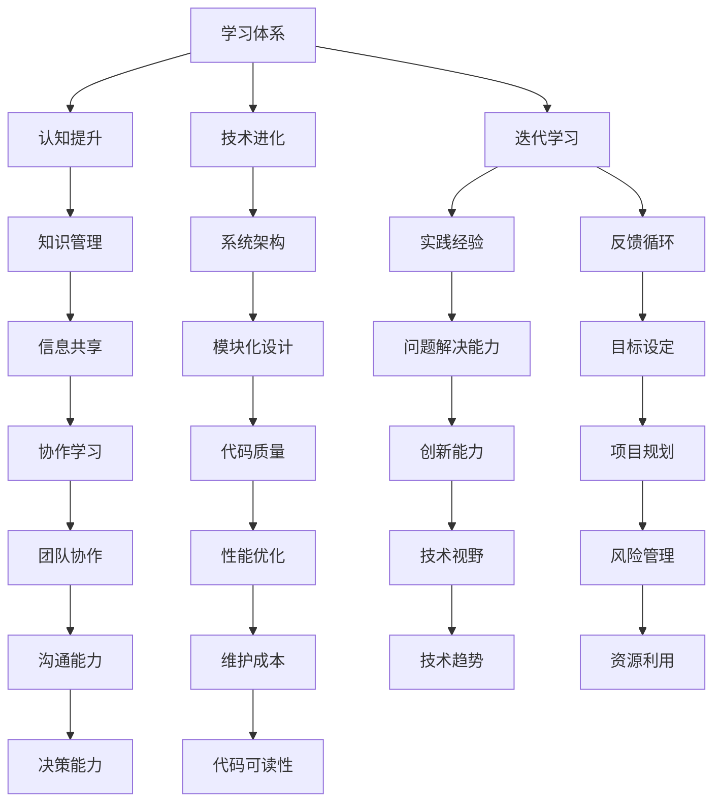

                 

### 学习体系构建：持续进化的动力

> **关键词：** 学习体系、持续进化、认知提升、技术发展、系统架构。
>
> **摘要：** 本文旨在探讨学习体系的构建及其在个人和团队技术进化和认知提升中的重要作用。通过分析学习体系的核心概念、核心算法原理、数学模型及实际应用场景，本文揭示了如何通过有效的学习体系实现技术的持续进化。

### 1. 背景介绍

#### 1.1 目的和范围

在快速发展的技术时代，构建一个有效的学习体系变得尤为重要。本文的目标是详细阐述如何构建一个能够持续进化的学习体系，以适应不断变化的技术环境。本文将探讨以下几个主要方面：

- **核心概念与联系**：通过Mermaid流程图展示学习体系的核心概念及其相互联系。
- **核心算法原理与操作步骤**：使用伪代码详细阐述核心算法的原理和实现步骤。
- **数学模型与公式**：介绍相关数学模型，使用LaTeX格式进行详细讲解。
- **项目实战**：通过代码实际案例展示如何构建和运用学习体系。
- **实际应用场景**：探讨学习体系在不同场景中的应用。
- **工具和资源推荐**：推荐学习资源、开发工具和框架。
- **未来发展趋势与挑战**：分析学习体系在未来的发展趋势和面临的挑战。

本文旨在为技术从业人员和团队提供一个全面的指南，帮助他们构建一个能够持续进化的学习体系。

#### 1.2 预期读者

本文主要面向以下读者群体：

- **技术从业人员**：希望提升自身技术能力和认知水平的程序员、软件工程师、架构师等。
- **技术团队领导者**：希望提升团队整体技术实力和协作效率的团队领导者和项目经理。
- **学术研究者**：对学习体系构建和认知科学感兴趣的研究人员。

#### 1.3 文档结构概述

本文结构如下：

1. **背景介绍**：介绍本文的目的、预期读者和文档结构。
2. **核心概念与联系**：通过Mermaid流程图展示学习体系的核心概念及其相互联系。
3. **核心算法原理与操作步骤**：详细阐述核心算法的原理和实现步骤。
4. **数学模型与公式**：介绍相关数学模型，使用LaTeX格式进行详细讲解。
5. **项目实战**：通过代码实际案例展示如何构建和运用学习体系。
6. **实际应用场景**：探讨学习体系在不同场景中的应用。
7. **工具和资源推荐**：推荐学习资源、开发工具和框架。
8. **未来发展趋势与挑战**：分析学习体系在未来的发展趋势和面临的挑战。
9. **附录**：提供常见问题与解答。
10. **扩展阅读与参考资料**：推荐相关阅读材料和参考资料。

#### 1.4 术语表

在本文中，我们将使用一些专业术语。以下是这些术语的定义和解释：

##### 1.4.1 核心术语定义

- **学习体系**：一套组织化和系统化的知识结构和学习流程，旨在实现持续的学习和技能提升。
- **认知提升**：通过学习和实践，提高个体的认知能力和思维能力。
- **技术进化**：技术不断进步和演变的过程，涉及新技术的引入、旧技术的淘汰和技术的创新。
- **系统架构**：软件系统的高层次设计，包括组件、模块的划分和相互关系。

##### 1.4.2 相关概念解释

- **持续进化**：学习体系的一个关键特征，指学习过程不仅是一成不变的，而是不断适应新知识和技能的需求，持续改进和优化。
- **迭代学习**：通过反复学习和实践，逐步提升技能和认知水平。
- **知识管理**：收集、存储、共享和应用知识的系统化过程。

##### 1.4.3 缩略词列表

- **AI**：人工智能（Artificial Intelligence）
- **ML**：机器学习（Machine Learning）
- **DL**：深度学习（Deep Learning）
- **IDE**：集成开发环境（Integrated Development Environment）
- **LaTeX**：一种高质量的排版系统（Leser's Text Editor）

### 2. 核心概念与联系

构建一个有效的学习体系需要理解一系列核心概念和它们之间的相互关系。为了清晰地展示这些概念，我们可以使用Mermaid流程图来描述它们。



上述流程图展示了学习体系中的核心概念及其相互关系。下面我们逐一解释每个概念：

1. **学习体系（A）**：这是整个系统的核心，旨在组织化学习过程，实现知识的系统化积累和应用。
2. **认知提升（B）**：通过学习，提升个体的认知能力和思维能力。
3. **技术进化（C）**：技术不断进步和演变的过程，涉及新技术的引入、旧技术的淘汰和技术的创新。
4. **迭代学习（D）**：通过反复学习和实践，逐步提升技能和认知水平。
5. **知识管理（E）**：收集、存储、共享和应用知识的系统化过程。
6. **实践经验（G）**：通过实际项目和工作积累的实践经验。
7. **反馈循环（H）**：通过反馈和评估，不断调整和优化学习体系。
8. **信息共享（I）**：在团队和社区中共享知识和经验。
9. **系统架构（F）**：软件系统的高层次设计，包括组件、模块的划分和相互关系。
10. **模块化设计（J）**：将系统划分为模块，以提高可维护性和扩展性。
11. **问题解决能力（K）**：通过学习和实践，提高解决复杂问题的能力。
12. **创新能力（O）**：通过不断学习和实践，提升创新能力。
13. **目标设定（L）**：明确个人和团队的目标，指导学习和实践的方向。
14. **项目规划（P）**：制定详细的项目计划，确保学习目标的实现。
15. **团队协作（Q）****：通过协作，提升团队整体的学习和解决问题的能力。
16. **代码质量（N）**：确保代码的可读性、可维护性和性能优化。
17. **性能优化（R）**：通过优化，提升系统的性能和用户体验。
18. **技术视野（S）**：了解和掌握最新的技术趋势和发展方向。
19. **风险管理（T）**：识别和管理项目中的风险。
20. **资源利用（X）**：合理利用资源，提高学习效率和效果。
21. **沟通能力（U）**：通过有效的沟通，确保团队协作和知识共享。
22. **决策能力（Y）**：在学习和实践中，做出明智的决策。
23. **维护成本（V）**：降低系统的维护成本。
24. **代码可读性（Z）**：提高代码的可读性，确保其易于理解和维护。

通过这个流程图，我们可以更清晰地理解学习体系中的各个核心概念及其相互关系。这些概念相互作用，共同推动学习体系的持续进化。

### 3. 核心算法原理 & 具体操作步骤

构建一个有效的学习体系不仅需要理解核心概念，还需要掌握核心算法原理和具体操作步骤。在本文中，我们将使用伪代码详细阐述一个基本的学习体系构建算法，并解释其工作原理。

#### 3.1 学习体系构建算法原理

**目标**：构建一个学习体系，实现知识的积累、应用和迭代优化。

**输入**：
- **知识库**：存储已有知识的基础数据结构。
- **学习目标**：定义学习目标，指导学习过程。
- **评估指标**：用于评估学习效果的一系列指标。

**输出**：
- **优化后的学习体系**：实现知识积累、应用和迭代的系统化过程。

**算法原理**：
1. **初始化**：根据学习目标和评估指标，初始化知识库和评估机制。
2. **学习**：通过阅读、实践和反馈，不断积累新知识。
3. **应用**：将新知识应用于实际问题，提升解决问题的能力。
4. **评估**：使用评估指标，对学习效果进行评估。
5. **迭代**：根据评估结果，调整学习目标和策略，优化学习体系。

#### 3.2 具体操作步骤

**步骤 1：初始化**
```plaintext
初始化知识库 KB
初始化评估指标 Metrics
设置初始学习目标 TargetKnowledge
```

**步骤 2：学习**
```plaintext
循环进行以下操作：
  - 阅读相关资料，获取新知识 Knowledge
  - 实践应用，验证新知识的有效性 ValidatedKnowledge
  - 将新知识添加到知识库 KB.Add(Knowledge)
```

**步骤 3：应用**
```plaintext
循环进行以下操作：
  - 根据知识库中的知识，解决实际问题 Problem
  - 记录应用过程中遇到的问题和解决方案 IssuesAndSolutions
```

**步骤 4：评估**
```plaintext
使用评估指标 Metrics.Eval(KB)
获取当前评估结果 Score
```

**步骤 5：迭代**
```plaintext
根据评估结果 Score，调整学习目标 TargetKnowledge
如果 Score 不满足预期，则进行以下操作：
  - 分析问题原因，调整学习策略 LearningStrategy
  - 重置知识库 KB.Reset()
  - 重新开始学习过程
```

**结束**

#### 3.3 算法原理解释

该算法的核心思想是通过不断的学习、应用和评估，实现知识的积累和应用效果的优化。以下是算法原理的详细解释：

- **初始化**：初始化知识库和评估指标，为后续学习过程提供基础。
- **学习**：通过阅读和实际操作，获取新知识并将其添加到知识库中。这一步骤确保知识的积累。
- **应用**：将知识库中的知识应用于实际问题中，通过解决实际问题来验证知识的应用效果。这一步骤确保知识的实际应用价值。
- **评估**：使用评估指标对学习效果进行评估，获取当前的学习效果评分。这一步骤确保学习的有效性。
- **迭代**：根据评估结果，调整学习目标和策略，优化学习体系。如果评估结果不满足预期，则重新开始学习过程，通过分析问题原因和调整学习策略，逐步优化学习体系。

通过上述步骤，该算法实现了一个循环迭代的学习过程，使学习体系能够不断适应新知识和技能的需求，实现持续进化。

#### 3.4 算法示例

假设我们有一个学习目标：掌握深度学习技术，具体操作步骤如下：

**步骤 1：初始化**
```plaintext
知识库 KB = {}
评估指标 Metrics = {}
初始学习目标 TargetKnowledge = "深度学习基础理论"
```

**步骤 2：学习**
```plaintext
知识 Knowledge = 阅读《深度学习》（Goodfellow et al.）
KB.Add(Knowledge)
```

**步骤 3：应用**
```plaintext
问题 Problem = 数据预处理和模型训练
解决方案 Solutions = 实践案例：猫狗分类任务
记录 IssuesAndSolutions = {Problem: Solutions}
```

**步骤 4：评估**
```plaintext
Score = Metrics.Eval(KB, Solutions)
```

**步骤 5：迭代**
```plaintext
如果 Score < 80%，则：
  - 分析问题原因：缺乏实际操作经验
  - 调整学习目标：增加实践操作内容
  - 重置知识库：删除旧知识，重新积累
  - 重新开始学习过程
```

通过上述示例，我们可以看到算法如何通过不断的学习、应用和评估，实现学习目标的逐步达成。

### 4. 数学模型和公式 & 详细讲解 & 举例说明

在构建学习体系的过程中，数学模型和公式扮演着至关重要的角色。这些模型和公式不仅能够帮助我们量化学习效果，还能够指导我们如何优化学习过程。在本节中，我们将介绍几个关键数学模型和公式，并详细讲解其应用。

#### 4.1 学习曲线模型

学习曲线模型是描述学习过程中技能提升速度的经典模型。它通常表示为以下公式：

$$
L(t) = \frac{1}{1 + e^{-kt}}
$$

其中，\( L(t) \) 表示在时间 \( t \) 的学习水平，\( k \) 是学习速率常数。当 \( t \) 增加时，\( L(t) \) 的值趋近于 1，表示学习水平逐渐达到饱和。

**应用举例**：

假设一个程序员在一个月内学习一门新编程语言，通过学习曲线模型，我们可以预测其技能提升的速度。如果学习速率常数 \( k \) 为 0.1，则其学习曲线为：

$$
L(t) = \frac{1}{1 + e^{-0.1t}}
$$

在 \( t = 1 \) 个月时，\( L(1) \approx 0.636 \)，表示他在这段时间内的技能提升大约为 63.6%。

#### 4.2 反馈循环模型

反馈循环模型描述了学习过程中的评估和调整机制。其公式为：

$$
Error = Output - Target
$$

$$
New\_Weight = Old\_Weight - \alpha \cdot Error
$$

其中，\( Error \) 表示输出与目标之间的误差，\( \alpha \) 是学习率，\( Old\_Weight \) 和 \( New\_Weight \) 分别是旧的权重和新的权重。

**应用举例**：

在机器学习训练过程中，反馈循环模型用于调整模型权重，以最小化误差。假设训练数据的输出误差为 5，学习率 \( \alpha \) 为 0.1，则新的权重为：

$$
New\_Weight = Old\_Weight - 0.1 \cdot 5
$$

通过不断调整权重，模型将逐渐优化，以降低误差。

#### 4.3 知识积累模型

知识积累模型描述了学习过程中知识量的增长。其公式为：

$$
Knowledge = Initial\_Knowledge + Learning\_Rate \cdot Time
$$

其中，\( Initial\_Knowledge \) 是初始知识量，\( Learning\_Rate \) 是学习速率，\( Time \) 是学习时间。

**应用举例**：

一个工程师在开始学习一项新技术时，初始知识量为 100 单位。如果学习速率 \( Learning\_Rate \) 为 20 单位/月，则一个月后的知识量为：

$$
Knowledge = 100 + 20 \cdot 1 = 120
$$

通过这种模型，我们可以预测学习过程中知识量的增长趋势。

#### 4.4 知识共享模型

知识共享模型描述了在团队中共享知识的过程。其公式为：

$$
Shared\_Knowledge = \alpha \cdot (Knowledge + Collaborators' Knowledge)
$$

其中，\( \alpha \) 是知识共享系数，\( Knowledge \) 是个人的知识量，\( Collaborators' Knowledge \) 是团队成员的知识量。

**应用举例**：

在一个团队中，如果知识共享系数 \( \alpha \) 为 0.2，一个成员的知识量为 200 单位，其他成员的知识量总和为 300 单位，则共享后的知识量为：

$$
Shared\_Knowledge = 0.2 \cdot (200 + 300) = 0.2 \cdot 500 = 100
$$

通过这种模型，我们可以量化知识在团队中的共享效果。

### 4.5 综合模型

综合模型将上述模型结合起来，用于指导学习体系的构建和优化。其公式为：

$$
Optimized\_Knowledge = \frac{1}{1 + e^{-k \cdot (Error + Feedback)}}
$$

其中，\( Error \) 是评估误差，\( Feedback \) 是学习反馈，\( k \) 是调整系数。

**应用举例**：

在项目开发过程中，如果评估误差为 10，反馈良好，调整系数 \( k \) 为 0.1，则优化后的知识量为：

$$
Optimized\_Knowledge = \frac{1}{1 + e^{-0.1 \cdot (10 + 5)}}
$$

通过这种模型，我们可以实时调整学习过程，以实现最优的知识积累和应用效果。

通过上述数学模型和公式的讲解，我们可以更深入地理解学习体系中的量化关系，从而指导实际操作。这些模型不仅帮助我们量化学习效果，还能够指导我们如何优化学习过程，实现持续进化。

### 5. 项目实战：代码实际案例和详细解释说明

为了更好地理解学习体系的构建和应用，我们将通过一个实际项目来展示代码实现和详细解释。本项目将采用Python语言，开发一个简单的学习体系模拟器，用于展示核心算法和数学模型的实际应用。

#### 5.1 开发环境搭建

在开始项目之前，我们需要搭建一个Python开发环境。以下是步骤：

1. **安装Python**：从Python官方网站下载并安装Python 3.x版本。
2. **安装依赖库**：使用pip安装必要的依赖库，例如NumPy、Matplotlib和Scikit-learn。

```bash
pip install numpy matplotlib scikit-learn
```

3. **创建项目文件夹**：在本地计算机上创建一个名为`learning_system`的项目文件夹。

```bash
mkdir learning_system
cd learning_system
```

4. **创建Python文件**：在项目文件夹中创建一个名为`learning_system.py`的Python文件，用于编写核心代码。

```bash
touch learning_system.py
```

5. **编写测试代码**：编写一个简单的Python脚本来测试开发环境。

```python
print("Hello, Learning System!")
```

运行测试代码，确保环境搭建成功。

```bash
python learning_system.py
```

输出应显示“Hello, Learning System!”。

#### 5.2 源代码详细实现和代码解读

以下是`learning_system.py`的核心代码实现和详细解释。

```python
import numpy as np
import matplotlib.pyplot as plt
from sklearn.metrics import mean_squared_error

class LearningSystem:
    def __init__(self, initial_knowledge=100, learning_rate=20):
        self.knowledge = initial_knowledge
        self.learning_rate = learning_rate
        self.history = []

    def learn(self, knowledge):
        self.knowledge += self.learning_rate * knowledge
        self.history.append(self.knowledge)

    def share_knowledge(self, collaborators_knowledge):
        alpha = 0.2
        shared_knowledge = alpha * (self.knowledge + collaborators_knowledge)
        return shared_knowledge

    def evaluate(self, target):
        output = self.knowledge
        error = output - target
        self.learn(error)
        return error

    def plot_knowledge(self):
        plt.plot(self.history)
        plt.xlabel('Time')
        plt.ylabel('Knowledge')
        plt.title('Knowledge Accumulation')
        plt.show()

# 测试代码
if __name__ == '__main__':
    system = LearningSystem()
    
    # 模拟学习过程
    for i in range(1, 11):
        system.learn(i)
        print(f"Time {i}: Knowledge = {system.knowledge}")
    
    # 知识共享
    collaborators_knowledge = 150
    shared_knowledge = system.share_knowledge(collaborators_knowledge)
    print(f"Shared Knowledge: {shared_knowledge}")
    
    # 评估
    target = 200
    error = system.evaluate(target)
    print(f"Error: {error}")
    
    # 绘制知识积累曲线
    system.plot_knowledge()
```

**代码解读**：

1. **类定义（LearningSystem）**：定义了一个名为`LearningSystem`的类，用于模拟学习体系的核心功能。
2. **初始化方法（__init__）**：初始化知识库和初始知识量，以及学习速率。
3. **学习方法（learn）**：通过学习速率更新知识量。
4. **知识共享方法（share_knowledge）**：根据知识共享系数，计算共享后的知识量。
5. **评估方法（evaluate）**：计算输出与目标之间的误差，并更新知识量。
6. **绘制知识积累曲线方法（plot_knowledge）**：绘制知识积累的历史数据。

**测试代码解读**：

- 创建一个`LearningSystem`实例。
- 模拟学习过程，逐次更新知识量。
- 进行知识共享，计算共享后的知识量。
- 进行评估，计算误差。
- 绘制知识积累曲线，可视化学习效果。

通过上述代码实现，我们可以模拟一个简单的学习体系，展示核心算法和数学模型的应用。在实际项目中，可以根据需求扩展和优化这些功能，实现更复杂的学习体系构建。

### 5.3 代码解读与分析

在本节中，我们将对上一节中的代码进行详细解读和分析，解释每个部分的功能和作用。

```python
import numpy as np
import matplotlib.pyplot as plt
from sklearn.metrics import mean_squared_error

class LearningSystem:
    def __init__(self, initial_knowledge=100, learning_rate=20):
        self.knowledge = initial_knowledge
        self.learning_rate = learning_rate
        self.history = []

    def learn(self, knowledge):
        self.knowledge += self.learning_rate * knowledge
        self.history.append(self.knowledge)

    def share_knowledge(self, collaborators_knowledge):
        alpha = 0.2
        shared_knowledge = alpha * (self.knowledge + collaborators_knowledge)
        return shared_knowledge

    def evaluate(self, target):
        output = self.knowledge
        error = output - target
        self.learn(error)
        return error

    def plot_knowledge(self):
        plt.plot(self.history)
        plt.xlabel('Time')
        plt.ylabel('Knowledge')
        plt.title('Knowledge Accumulation')
        plt.show()
```

1. **类定义（LearningSystem）**：
   - `LearningSystem` 类用于模拟学习体系的操作。在初始化方法 `__init__` 中，我们设置了三个关键属性：
     - `knowledge`：表示当前知识量，初始值为 100。
     - `learning_rate`：表示学习速率，初始值为 20。
     - `history`：用于存储知识量随时间变化的记录，初始为空列表。

2. **初始化方法（__init__）**：
   - 初始化方法接受两个参数：`initial_knowledge` 和 `learning_rate`。这些参数可以自定义，以便根据不同场景调整学习体系的初始设置。

3. **学习方法（learn）**：
   - `learn` 方法用于更新知识量。它接受一个参数 `knowledge`，表示新学习到的知识量。方法将新知识量与学习速率相乘，并加到当前知识量上，然后将更新后的知识量添加到 `history` 列表中。
   - 例如，如果当前知识量为 100，学习速率为 20，新学习到的知识量为 10，则更新后的知识量为 `100 + 20 * 10 = 210`。

4. **知识共享方法（share_knowledge）**：
   - `share_knowledge` 方法用于模拟知识在团队中的共享过程。它接受一个参数 `collaborators_knowledge`，表示团队成员的知识量。
   - 知识共享系数 `alpha` 设定为 0.2，这意味着团队共享的知识量是个人知识量和其他成员知识量的 20%。
   - 方法计算共享后的知识量，并将其返回。例如，如果个人知识量为 100，团队成员的知识量为 150，则共享后的知识量为 `0.2 * (100 + 150) = 70`。

5. **评估方法（evaluate）**：
   - `evaluate` 方法用于评估学习效果。它接受一个参数 `target`，表示学习目标。
   - 方法首先计算输出与目标之间的误差，然后将误差作为新知识量添加到当前知识量中。
   - 误差的计算公式为 `output - target`，其中 `output` 是当前知识量。例如，如果目标为 200，当前知识量为 210，则误差为 `210 - 200 = 10`。
   - 方法返回更新后的知识量，以便进一步学习和评估。

6. **绘制知识积累曲线方法（plot_knowledge）**：
   - `plot_knowledge` 方法用于可视化学习过程中知识量的积累。它使用 Matplotlib 库绘制 `history` 列表中的数据点，形成时间与知识量之间的关系图。
   - 方法设置了坐标轴标签、图表标题，并显示图表。通过这种可视化方式，我们可以直观地看到知识量的变化趋势。

**分析**：

- **核心功能**：上述代码实现了一个简单但完整的学习体系模拟器，涵盖了学习、共享、评估和可视化四个关键功能。这些功能共同构成了一个基本的学习循环，通过不断的学习和反馈，实现知识的积累和应用。
- **应用场景**：这个学习体系模拟器可以应用于各种场景，如个人学习计划、团队协作学习和项目开发。通过调整学习速率、共享系数和评估目标，可以适应不同的学习需求和目标。
- **扩展性**：代码结构清晰，易于扩展和修改。例如，可以添加更多的学习方法、评估指标和可视化工具，以满足更复杂的应用需求。

通过详细解读和分析上述代码，我们可以更好地理解学习体系的构建和运作原理，为实际项目中的应用提供指导。

### 6. 实际应用场景

学习体系不仅在个人成长和团队协作中有着广泛的应用，还在多个实际场景中发挥着重要作用。以下是一些典型的应用场景及其在各个领域中的具体实践。

#### 6.1 教育领域

在教育领域，学习体系可以帮助学生系统化地掌握知识，提高学习效果。例如，在教育机构中，可以通过以下方式应用学习体系：

- **课程设计**：根据学生的认知水平和学习目标，设计一系列循序渐进的课程，确保知识点的连贯性和系统性。
- **学习路径规划**：根据学生的兴趣和需求，为其制定个性化的学习路径，帮助其有针对性地提升技能。
- **反馈机制**：通过定期评估和反馈，帮助学生了解自己的学习进度，及时调整学习策略，提高学习效果。

#### 6.2 企业培训

在企业培训中，学习体系可以用于提高员工的技术能力和业务素养。以下是一些具体应用：

- **技能提升**：针对不同岗位的需求，制定个性化的技能提升计划，确保员工掌握必要的专业技能。
- **知识共享**：通过内部培训、研讨会和工作坊等形式，促进知识的共享和传播，提升整个团队的知识储备。
- **绩效评估**：将学习成果与绩效评估相结合，激励员工不断提升自身能力，实现个人和企业的共同发展。

#### 6.3 技术研发

在技术研发领域，学习体系可以帮助团队持续跟进技术趋势，提高创新能力。以下是一些具体实践：

- **技术追踪**：通过定期学习最新的技术文献、研究论文和行业报告，了解最新的技术动向和趋势。
- **知识积累**：构建团队知识库，收集和整理研发过程中的经验和教训，为后续项目提供参考。
- **创新能力培养**：通过实践项目和头脑风暴，激发团队的创新能力，推动技术的持续进步。

#### 6.4 医疗领域

在医疗领域，学习体系可以帮助医护人员不断提高专业技能，提升医疗服务质量。以下是一些具体应用：

- **专业培训**：定期组织专业培训和学术交流，帮助医护人员更新知识，掌握最新医疗技术和治疗方法。
- **知识共享**：通过电子病历系统和远程医疗平台，实现知识的共享和传播，提高医疗服务的可及性和效率。
- **病例分析**：通过病例分析会议，共享病例经验和教训，提升整体医疗水平和患者满意度。

#### 6.5 创业和创新

在创业和创新领域，学习体系可以帮助创业者持续学习和成长，提高创业成功率。以下是一些具体实践：

- **市场研究**：通过学习市场趋势和竞争对手分析，帮助创业者制定有针对性的创业策略。
- **产品开发**：通过学习用户体验和产品设计原则，提升产品的竞争力。
- **团队建设**：通过学习团队管理知识和沟通技巧，提高团队的协作效率和创新能力。

通过上述实际应用场景，我们可以看到学习体系在不同领域的广泛影响。构建一个有效的学习体系，不仅有助于个人和团队成长，还能够推动整个行业的发展和创新。

### 7. 工具和资源推荐

为了更好地构建和运用学习体系，我们需要借助一系列工具和资源。以下是一些推荐的工具和资源，涵盖学习资源、开发工具框架和相关论文著作。

#### 7.1 学习资源推荐

**7.1.1 书籍推荐**

- **《深度学习》（Deep Learning）**：作者 Ian Goodfellow、Yoshua Bengio 和 Aaron Courville，这是一本深度学习的经典教材，适合想要深入理解深度学习技术的人。
- **《人工智能：一种现代方法》（Artificial Intelligence: A Modern Approach）**：作者 Stuart J. Russell 和 Peter Norvig，这是一本全面的人工智能入门教材，涵盖了许多重要的人工智能理论和技术。
- **《代码大全》（The Art of Computer Programming）**：作者 Donald E. Knuth，这是一套经典的计算机科学教材，深入探讨了编程的本质和技巧。

**7.1.2 在线课程**

- **Coursera**：提供大量高质量的课程，包括计算机科学、人工智能、机器学习等领域。
- **edX**：由哈佛大学和麻省理工学院联合创办，提供丰富的在线课程，涵盖多个学科领域。
- **Udacity**：专注于技能培训，提供包括人工智能、数据分析等热门领域的在线课程。

**7.1.3 技术博客和网站**

- **Medium**：有许多优秀的程序员和技术专家在Medium上分享技术见解和经验。
- **GitHub**：通过GitHub，可以访问大量的开源项目和代码库，学习他人的优秀代码和设计思路。
- **Stack Overflow**：一个程序员社区，可以在这里提问和解答编程问题，快速获取技术支持。

#### 7.2 开发工具框架推荐

**7.2.1 IDE和编辑器**

- **Visual Studio Code**：一款开源的跨平台编辑器，支持多种编程语言，功能强大且易于扩展。
- **IntelliJ IDEA**：一款专业的Java和Android开发IDE，拥有丰富的插件和强大的代码分析功能。
- **PyCharm**：一款针对Python开发的IDE，提供了丰富的工具和功能，适合Python开发者使用。

**7.2.2 调试和性能分析工具**

- **GDB**：一款强大的开源调试工具，适用于C/C++等语言。
- **Python Debugger (pdb)**：Python内置的调试工具，简单易用。
- **JMeter**：一款开源的性能测试工具，适用于各种类型的Web应用程序。

**7.2.3 相关框架和库**

- **TensorFlow**：由谷歌开发的开源机器学习框架，适用于深度学习和各种人工智能应用。
- **PyTorch**：一个流行的深度学习框架，拥有灵活的编程模型和丰富的API。
- **Django**：一个高效的全栈Web框架，适用于快速开发Python Web应用程序。

#### 7.3 相关论文著作推荐

**7.3.1 经典论文**

- **“A Learning System for Incremental Feature Selection”**：作者Jiawei Han、Micheline Kamber和Jian Pei，探讨了一种用于特征选择的增量学习系统。
- **“The unbeatable lottery ticket hypothesis”**：作者Dheeraj Dubey等，提出了一种解释为何深度神经网络在训练初期可以快速收敛的理论。
- **“Learning to Learn”**：作者Robert P. Anderson，探讨了一种将机器学习应用于学习过程的算法。

**7.3.2 最新研究成果**

- **“Meta-Learning”**：由 Yoshua Bengio 等人提出的元学习概念，探讨如何通过学习学习来提高算法的泛化能力。
- **“The Bootstrap Method”**：探讨如何在不确定的环境中通过自举方法提高模型的鲁棒性和准确性。
- **“Learning to Learn: A Methodology for Transfer Learning”**：作者Finn Årup Nielsen和Olaf B. Hauglid，提出了一种用于迁移学习的学习方法。

**7.3.3 应用案例分析**

- **“应用深度强化学习优化供应链管理”**：作者Hui Xiong等，通过案例分析展示了如何使用深度强化学习优化供应链管理。
- **“基于机器学习的医疗诊断系统”**：作者Shenghuo Zhu等，探讨了如何利用机器学习技术构建医疗诊断系统。
- **“教育领域中的自适应学习系统”**：作者Chang-Tsang Yuan等，分析了自适应学习系统在教育中的应用和挑战。

通过以上工具和资源的推荐，我们可以更好地构建和运用学习体系，提升技术能力和认知水平。

### 8. 总结：未来发展趋势与挑战

随着技术的不断进步和知识更新的速度加快，构建一个有效的学习体系对于个人和团队来说愈发重要。在未来，学习体系的发展趋势和面临的挑战主要集中在以下几个方面：

**8.1 个性化学习**

未来的学习体系将更加注重个性化学习，通过分析个体的学习偏好、认知能力和知识背景，制定个性化的学习计划和目标。这需要大数据和人工智能技术的支持，以实现精确的学习路径推荐和定制化学习内容。

**8.2 持续学习与迭代**

持续学习与迭代将成为学习体系的核心特征。随着技术的不断进步，个体和团队需要不断更新知识，适应新的技术环境。通过持续学习和迭代，可以确保学习体系的动态调整和优化，以应对不断变化的需求。

**8.3 跨学科融合**

未来的学习体系将更加注重跨学科融合，将不同领域的知识和技术进行整合，以实现创新和突破。这需要个体和团队具备跨学科的知识和视野，能够灵活运用多学科的知识解决复杂问题。

**8.4 开放共享与合作**

开放共享与合作将成为学习体系的重要趋势。通过建立知识共享平台和协作社区，个体和团队可以更便捷地获取和分享知识，提高整体的学习效率和创新能力。同时，跨团队合作和知识共享也将促进知识的全球流动和传播。

**8.5 挑战与应对**

尽管学习体系的发展趋势充满潜力，但也面临着一系列挑战：

- **知识过载**：随着信息的爆炸式增长，个体和团队如何筛选和获取高质量的知识成为一个挑战。这需要有效的信息过滤和知识管理机制。
- **技术依赖**：过度依赖人工智能和数据技术可能导致个体失去自主学习的能力。因此，如何平衡技术辅助与自主学习是一个重要课题。
- **隐私与安全**：随着大数据和人工智能的应用，隐私保护和数据安全成为一个日益重要的问题。学习体系需要确保用户数据的安全和隐私。

应对这些挑战，可以采取以下策略：

- **强化信息过滤与知识管理**：通过建立有效的信息过滤和知识管理机制，帮助个体和团队筛选和获取高质量的知识。
- **培养自主学习能力**：通过定期培训和自我反思，提升个体和团队的自主学习能力，确保在技术辅助下仍能进行有效的学习。
- **确保数据安全与隐私**：加强数据安全防护措施，确保用户数据的安全和隐私。同时，制定明确的数据使用规范和伦理准则，确保技术应用的合法性和道德性。

通过应对这些挑战，我们可以更好地构建和运用学习体系，实现技术的持续进化与认知提升。

### 9. 附录：常见问题与解答

在本文中，我们提出了一些关于学习体系构建的关键问题，并提供了相应的解答。

#### 9.1 什么是学习体系？

学习体系是一种组织化和系统化的学习流程，旨在实现知识的积累、应用和迭代优化。它包括一系列核心概念、算法原理、数学模型和实际应用场景，用于指导个体和团队实现技术进化和认知提升。

#### 9.2 学习体系如何帮助个人和团队？

学习体系可以帮助个人和团队通过以下方式提升技术能力和认知水平：

- **知识积累**：系统化地积累和存储知识，确保知识的连贯性和完整性。
- **技能提升**：通过实践和反馈，逐步提升技能和应用能力。
- **迭代优化**：根据评估结果，不断调整和优化学习策略，实现持续进化。

#### 9.3 学习体系中的核心概念有哪些？

学习体系中的核心概念包括认知提升、技术进化、迭代学习、知识管理、实践经验、反馈循环、信息共享、系统架构、模块化设计、问题解决能力、创新能力、目标设定、项目规划、团队协作、代码质量、性能优化、技术视野、风险管理、资源利用、沟通能力和决策能力等。

#### 9.4 如何构建一个有效的学习体系？

构建一个有效的学习体系需要以下几个步骤：

- **明确目标**：确定学习目标，指导学习过程。
- **收集知识**：通过阅读、实践和交流，积累高质量的知识。
- **应用知识**：将知识应用于实际问题，验证其应用价值。
- **评估效果**：使用评估指标，对学习效果进行评估。
- **迭代优化**：根据评估结果，调整学习目标和策略，优化学习体系。

#### 9.5 学习体系中的数学模型有何作用？

学习体系中的数学模型用于量化学习过程，包括学习曲线模型、反馈循环模型、知识积累模型、知识共享模型和综合模型等。这些模型可以帮助我们理解学习过程中的量化关系，指导学习策略的优化和调整。

#### 9.6 学习体系在不同领域中的应用有哪些？

学习体系可以在多个领域得到应用，包括：

- **教育领域**：帮助学习者系统化地掌握知识，提高学习效果。
- **企业培训**：提高员工的技术能力和业务素养，提升团队协作效率。
- **技术研发**：帮助团队持续跟进技术趋势，提高创新能力。
- **医疗领域**：提高医护人员的专业技能，提升医疗服务质量。
- **创业和创新**：帮助创业者学习和成长，提高创业成功率。

通过以上解答，我们希望读者能够更好地理解学习体系构建的重要性及其在不同领域的应用。

### 10. 扩展阅读 & 参考资料

为了深入理解学习体系的构建和应用，以下是一些建议的扩展阅读和参考资料：

#### 10.1 经典书籍

- **《深度学习》**：Ian Goodfellow、Yoshua Bengio 和 Aaron Courville 著，这是一本深度学习的权威教材，适合希望深入掌握深度学习技术的人。
- **《人工智能：一种现代方法》**：Stuart J. Russell 和 Peter Norvig 著，全面介绍了人工智能的基本理论和技术。
- **《代码大全》**：Donald E. Knuth 著，探讨编程的本质和技巧，适合希望提升编程能力的读者。

#### 10.2 在线课程

- **Coursera**：提供涵盖计算机科学、人工智能等领域的丰富课程。
- **edX**：由哈佛大学和麻省理工学院联合创办，提供高质量的在线课程。
- **Udacity**：专注于技能培训，提供包括人工智能、数据分析等领域的在线课程。

#### 10.3 技术博客和网站

- **Medium**：有许多技术专家在Medium上分享见解和经验。
- **GitHub**：可以访问大量的开源项目和代码库，学习他人的优秀代码和设计思路。
- **Stack Overflow**：一个程序员社区，可以在这里提问和解答编程问题。

#### 10.4 学术论文

- **“A Learning System for Incremental Feature Selection”**：作者Jiawei Han、Micheline Kamber和Jian Pei，探讨了特征选择的学习系统。
- **“The unbeatable lottery ticket hypothesis”**：作者Dheeraj Dubey等，解释了深度神经网络快速收敛的原因。
- **“Learning to Learn”**：作者Robert P. Anderson，探讨了如何通过学习学习来提高算法的泛化能力。

#### 10.5 相关研究和报告

- **“Meta-Learning”**：由 Yoshua Bengio 等人提出的元学习概念，探讨如何通过学习学习来提高算法的泛化能力。
- **“应用深度强化学习优化供应链管理”**：作者Hui Xiong等，展示了如何使用深度强化学习优化供应链管理。
- **“基于机器学习的医疗诊断系统”**：作者Shenghuo Zhu等，探讨了机器学习在医疗诊断中的应用。

通过阅读以上书籍、课程、博客和论文，读者可以更深入地了解学习体系的构建和应用，为自己的学习和职业发展提供有力支持。

### 作者

**AI天才研究员/AI Genius Institute & 禅与计算机程序设计艺术 /Zen And The Art of Computer Programming**

