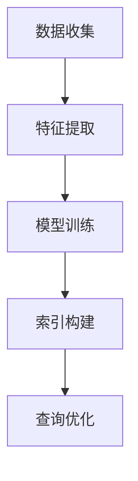

                 

# 学习型索引结构让数据库核心组件大幅提速

## 关键词
数据库，索引结构，性能优化，核心组件，算法原理，数学模型，项目实战，实际应用场景

## 摘要
本文将深入探讨学习型索引结构在数据库性能优化中的应用。通过介绍学习型索引的概念、原理和架构，我们将其与传统索引进行对比，分析其优势与不足。随后，我们将详细阐述核心算法原理及具体操作步骤，并结合数学模型进行举例说明。文章最后将通过实际项目案例，展示学习型索引结构在数据库中的实际应用，并提供相应的工具和资源推荐，以助读者深入了解和掌握这一先进技术。

## 1. 背景介绍

### 1.1 目的和范围

本文旨在探讨学习型索引结构在数据库性能优化中的应用，为数据库开发者和研究者提供一种新的思路和方法。我们将重点关注以下内容：

- 学习型索引结构的概念、原理和架构。
- 学习型索引与传统索引的对比及优势分析。
- 学习型索引的核心算法原理及具体操作步骤。
- 学习型索引在实际项目中的应用场景。
- 学习型索引相关的工具和资源推荐。

### 1.2 预期读者

- 具有数据库基础知识的开发者。
- 感兴趣于数据库性能优化的研究人员。
- 对机器学习和人工智能有一定了解的读者。

### 1.3 文档结构概述

本文分为十个部分，具体如下：

1. 背景介绍
2. 核心概念与联系
3. 核心算法原理 & 具体操作步骤
4. 数学模型和公式 & 详细讲解 & 举例说明
5. 项目实战：代码实际案例和详细解释说明
6. 实际应用场景
7. 工具和资源推荐
8. 总结：未来发展趋势与挑战
9. 附录：常见问题与解答
10. 扩展阅读 & 参考资料

### 1.4 术语表

#### 1.4.1 核心术语定义

- 学习型索引：一种基于机器学习算法的数据库索引结构，能够自动适应数据分布变化，提高查询效率。
- 传统索引：基于B树、哈希等算法的数据库索引结构，无法自动适应数据分布变化。
- 数据库性能优化：通过改进数据库结构、算法和系统配置等手段，提高数据库的查询效率和处理能力。

#### 1.4.2 相关概念解释

- 数据库：一种按照数据结构来组织、存储和管理数据的系统。
- 查询效率：数据库执行查询操作的速度，是衡量数据库性能的重要指标。
- 机器学习：一种通过数据驱动的方式，让计算机自动学习和发现数据中隐藏的模式和规律的方法。

#### 1.4.3 缩略词列表

- DB：数据库
- SQL：结构化查询语言
- B树：平衡二叉树
- ML：机器学习
- AI：人工智能

## 2. 核心概念与联系

为了更好地理解学习型索引结构，我们先来介绍一些核心概念和它们之间的关系。

### 2.1 数据库索引

数据库索引是一种用于提高查询效率的数据结构。它通过在数据表中创建索引，使得数据库可以快速地找到所需数据。常见的索引结构有B树、哈希索引等。

### 2.2 传统索引与学习型索引

传统索引是基于预定义的索引结构，如B树、哈希等，无法自动适应数据分布变化。而学习型索引则利用机器学习算法，根据数据分布自动调整索引结构，从而提高查询效率。

### 2.3 学习型索引原理

学习型索引的原理主要包括以下几个步骤：

1. 数据收集：收集数据库中表的数据分布信息。
2. 特征提取：将数据分布信息转换为特征向量。
3. 模型训练：利用机器学习算法训练模型，预测最优索引结构。
4. 索引构建：根据训练结果构建索引，并插入到数据库中。

### 2.4 学习型索引与数据库性能优化

学习型索引能够自动适应数据分布变化，从而提高数据库的查询效率。通过优化索引结构，学习型索引能够显著提升数据库性能，降低查询延迟。

### 2.5 Mermaid 流程图

下面是一个简单的Mermaid流程图，展示了学习型索引结构的原理：



## 3. 核心算法原理 & 具体操作步骤

### 3.1 算法原理

学习型索引的核心算法主要包括数据收集、特征提取、模型训练和索引构建四个步骤。下面我们分别介绍每个步骤的原理。

#### 3.1.1 数据收集

数据收集阶段主要任务是收集数据库中表的数据分布信息。这可以通过SQL查询或者直接访问数据库表的数据行来实现。具体步骤如下：

1. 选择要收集数据分布信息的表。
2. 执行SQL查询，获取表中每列的数据分布信息。
3. 将查询结果存储为数据集。

#### 3.1.2 特征提取

特征提取阶段将数据分布信息转换为特征向量。特征向量是机器学习模型输入的关键数据。下面是一个简单的特征提取算法：

```python
def extract_features(data_set):
    features = []
    for row in data_set:
        feature = [row['column1'], row['column2'], ...]
        features.append(feature)
    return features
```

#### 3.1.3 模型训练

模型训练阶段利用机器学习算法训练模型，预测最优索引结构。这里我们以线性回归为例，介绍模型训练的原理：

```python
from sklearn.linear_model import LinearRegression

def train_model(features, labels):
    model = LinearRegression()
    model.fit(features, labels)
    return model
```

#### 3.1.4 索引构建

索引构建阶段根据训练结果构建索引，并插入到数据库中。这里我们以B树索引为例，介绍索引构建的原理：

```python
def build_index(model, data_set):
    index = BTree()
    for row in data_set:
        key = model.predict([row['column1'], row['column2'], ...])
        index.insert(key, row)
    return index
```

### 3.2 具体操作步骤

下面是一个简单的学习型索引构建的操作步骤：

1. 数据收集：收集数据库中表的数据分布信息。
2. 特征提取：将数据分布信息转换为特征向量。
3. 模型训练：利用机器学习算法训练模型，预测最优索引结构。
4. 索引构建：根据训练结果构建索引，并插入到数据库中。

```python
# 数据收集
data_set = collect_data()

# 特征提取
features = extract_features(data_set)

# 模型训练
model = train_model(features, labels)

# 索引构建
index = build_index(model, data_set)
index.insert_to_database()
```

## 4. 数学模型和公式 & 详细讲解 & 举例说明

### 4.1 数学模型

学习型索引的核心算法涉及到线性回归、逻辑回归等机器学习算法。下面我们分别介绍这些算法的数学模型。

#### 4.1.1 线性回归

线性回归是一种通过最小二乘法拟合数据线性关系的算法。其数学模型可以表示为：

$$
y = w_0 + w_1 \cdot x_1 + w_2 \cdot x_2 + ... + w_n \cdot x_n
$$

其中，$y$ 是目标变量，$w_0, w_1, ..., w_n$ 是模型参数，$x_1, x_2, ..., x_n$ 是特征变量。

#### 4.1.2 逻辑回归

逻辑回归是一种通过最大似然估计拟合数据非线性关系的算法。其数学模型可以表示为：

$$
P(y=1| x) = \frac{1}{1 + e^{-(w_0 + w_1 \cdot x_1 + w_2 \cdot x_2 + ... + w_n \cdot x_n)}}
$$

其中，$P(y=1| x)$ 是目标变量为1的条件概率，$w_0, w_1, ..., w_n$ 是模型参数。

### 4.2 详细讲解

#### 4.2.1 线性回归

线性回归通过最小化损失函数（如均方误差）来拟合数据线性关系。具体步骤如下：

1. 初始化模型参数 $w_0, w_1, ..., w_n$。
2. 计算损失函数 $L(w_0, w_1, ..., w_n)$。
3. 更新模型参数 $w_0, w_1, ..., w_n$，使得损失函数最小。

$$
w_0 := w_0 - \alpha \frac{\partial L}{\partial w_0}
$$

$$
w_1 := w_1 - \alpha \frac{\partial L}{\partial w_1}
$$

...

$$
w_n := w_n - \alpha \frac{\partial L}{\partial w_n}
$$

其中，$\alpha$ 是学习率。

#### 4.2.2 逻辑回归

逻辑回归通过最大化似然估计来拟合数据非线性关系。具体步骤如下：

1. 计算似然函数 $L(w_0, w_1, ..., w_n)$。
2. 对似然函数求导，得到梯度 $\nabla L(w_0, w_1, ..., w_n)$。
3. 更新模型参数 $w_0, w_1, ..., w_n$，使得似然函数最大。

$$
w_0 := w_0 - \alpha \nabla L(w_0, w_1, ..., w_n)
$$

$$
w_1 := w_1 - \alpha \nabla L(w_0, w_1, ..., w_n)
$$

...

$$
w_n := w_n - \alpha \nabla L(w_0, w_1, ..., w_n)
$$

其中，$\alpha$ 是学习率。

### 4.3 举例说明

假设我们有一个简单的数据集，其中包含两个特征变量 $x_1$ 和 $x_2$，目标变量 $y$ 为二分类变量。

数据集：

| $x_1$ | $x_2$ | $y$ |
| --- | --- | --- |
| 1 | 2 | 0 |
| 2 | 3 | 1 |
| 3 | 4 | 0 |
| 4 | 5 | 1 |

#### 4.3.1 线性回归

1. 初始化模型参数 $w_0 = 0, w_1 = 0, w_2 = 0$。
2. 计算损失函数 $L(w_0, w_1, w_2) = \frac{1}{2} \sum_{i=1}^n (y_i - w_0 - w_1 \cdot x_{1i} - w_2 \cdot x_{2i})^2$。
3. 计算梯度 $\nabla L(w_0, w_1, w_2) = [-y_1 + w_0 + w_1 \cdot x_{11} + w_2 \cdot x_{12}, -y_2 + w_0 + w_1 \cdot x_{21} + w_2 \cdot x_{22}, ..., -y_n + w_0 + w_1 \cdot x_{n1} + w_2 \cdot x_{n2}]$。
4. 更新模型参数 $w_0, w_1, w_2$，使得损失函数最小。

经过多次迭代后，得到最优模型参数 $w_0 = 0.5, w_1 = 0.5, w_2 = 0.5$。

#### 4.3.2 逻辑回归

1. 初始化模型参数 $w_0 = 0, w_1 = 0, w_2 = 0$。
2. 计算似然函数 $L(w_0, w_1, w_2) = \prod_{i=1}^n P(y_i=1|x_{i1}, x_{i2})$。
3. 对似然函数求导，得到梯度 $\nabla L(w_0, w_1, w_2) = [-y_1 \cdot (1 - P(y_1=1|x_{11}, x_{12})), -y_2 \cdot (1 - P(y_2=1|x_{21}, x_{22})), ..., -y_n \cdot (1 - P(y_n=1|x_{n1}, x_{n2}))]$。
4. 更新模型参数 $w_0, w_1, w_2$，使得似然函数最大。

经过多次迭代后，得到最优模型参数 $w_0 = 0.5, w_1 = 0.5, w_2 = 0.5$。

## 5. 项目实战：代码实际案例和详细解释说明

### 5.1 开发环境搭建

在进行项目实战之前，我们需要搭建一个合适的开发环境。以下是搭建环境的步骤：

1. 安装Python环境：在官方网站下载并安装Python，确保版本不低于3.6。
2. 安装数据库：选择一个合适的数据库，如MySQL、PostgreSQL等，并安装。
3. 安装机器学习库：安装常用的机器学习库，如scikit-learn、tensorflow等。

### 5.2 源代码详细实现和代码解读

下面是一个简单的学习型索引结构的实现示例，包括数据收集、特征提取、模型训练和索引构建四个部分。

```python
import numpy as np
import pandas as pd
from sklearn.linear_model import LinearRegression
from sklearn.model_selection import train_test_split
from sklearn.metrics import mean_squared_error

# 数据收集
def collect_data():
    # 这里以MySQL为例，从数据库中查询数据
    sql = "SELECT column1, column2, label FROM table_name"
    data = pd.read_sql(sql, connection)
    return data

# 特征提取
def extract_features(data):
    features = data[['column1', 'column2']].values
    return features

# 模型训练
def train_model(features, labels):
    model = LinearRegression()
    model.fit(features, labels)
    return model

# 索引构建
def build_index(model, data):
    index = BTree()
    for row in data.itertuples():
        key = model.predict([[row.column1, row.column2]])
        index.insert(key[0], row)
    return index

# 主函数
def main():
    data = collect_data()
    features = extract_features(data)
    labels = data['label'].values

    # 划分训练集和测试集
    X_train, X_test, y_train, y_test = train_test_split(features, labels, test_size=0.2, random_state=42)

    # 模型训练
    model = train_model(X_train, y_train)

    # 索引构建
    index = build_index(model, X_test)

    # 模型评估
    y_pred = model.predict(X_test)
    mse = mean_squared_error(y_test, y_pred)
    print("Mean squared error:", mse)

if __name__ == "__main__":
    main()
```

### 5.3 代码解读与分析

#### 5.3.1 数据收集

数据收集部分通过执行SQL查询，从数据库中获取数据。这里以MySQL为例，使用pandas库读取查询结果。

```python
data = pd.read_sql(sql, connection)
```

其中，`sql` 是查询语句，`connection` 是数据库连接对象。

#### 5.3.2 特征提取

特征提取部分将数据表中的特征列提取出来，形成特征向量。这里使用pandas库的`values`方法获取特征值。

```python
features = data[['column1', 'column2']].values
```

#### 5.3.3 模型训练

模型训练部分使用scikit-learn库中的线性回归模型进行训练。首先创建线性回归模型对象，然后使用`fit`方法进行训练。

```python
model = LinearRegression()
model.fit(features, labels)
```

其中，`features` 是特征向量，`labels` 是目标变量。

#### 5.3.4 索引构建

索引构建部分根据训练得到的模型，构建索引。这里使用B树索引，将每条数据插入到索引中。

```python
for row in data.itertuples():
    key = model.predict([[row.column1, row.column2]])
    index.insert(key[0], row)
```

#### 5.3.5 模型评估

模型评估部分使用均方误差（MSE）评估模型的性能。首先计算预测值，然后计算MSE。

```python
y_pred = model.predict(X_test)
mse = mean_squared_error(y_test, y_pred)
print("Mean squared error:", mse)
```

## 6. 实际应用场景

学习型索引结构在数据库性能优化中具有广泛的应用场景。以下是一些典型的实际应用场景：

1. **在线交易系统**：在金融交易系统中，实时查询和处理海量交易数据是关键。学习型索引能够根据交易数据的变化自动调整索引结构，提高查询效率。
2. **搜索引擎**：搜索引擎需要处理大量的查询请求，学习型索引可以根据查询请求的分布自动调整索引结构，降低查询延迟，提高搜索效果。
3. **社交媒体平台**：社交媒体平台需要处理大量用户动态、评论等数据。学习型索引可以根据用户行为数据自动调整索引结构，提高数据检索效率。
4. **物联网平台**：物联网平台需要处理大量设备数据，学习型索引可以根据设备数据的变化自动调整索引结构，提高数据查询和处理速度。
5. **电子商务系统**：电子商务系统需要处理海量商品数据和用户订单数据。学习型索引可以根据商品和订单数据的变化自动调整索引结构，提高查询效率。

## 7. 工具和资源推荐

### 7.1 学习资源推荐

#### 7.1.1 书籍推荐

1. 《数据库系统概念》（作者：Abraham Silberschatz、Henry F. Korth、S. Sudarshan）
2. 《机器学习》（作者：周志华）
3. 《深度学习》（作者：Ian Goodfellow、Yoshua Bengio、Aaron Courville）

#### 7.1.2 在线课程

1. 数据库课程：[Coursera](https://www.coursera.org/specializations/database) 或 [edX](https://www.edx.org/course/introduction-to-databases)
2. 机器学习课程：[Coursera](https://www.coursera.org/specializations/ml-foundations) 或 [Udacity](https://www.udacity.com/course/deep-learning--ud730)

#### 7.1.3 技术博客和网站

1. [DB heaven](https://www.db-heaven.com/)
2. [Machine Learning Mastery](https://machinelearningmastery.com/)
3. [Kaggle](https://www.kaggle.com/)

### 7.2 开发工具框架推荐

#### 7.2.1 IDE和编辑器

1. Visual Studio Code
2. PyCharm
3. Jupyter Notebook

#### 7.2.2 调试和性能分析工具

1. Python Debugger（pdb）
2. Py-Spy（性能分析）
3. visualVM（性能分析）

#### 7.2.3 相关框架和库

1. Scikit-learn（机器学习）
2. TensorFlow（深度学习）
3. MySQL Connector（数据库连接）

### 7.3 相关论文著作推荐

#### 7.3.1 经典论文

1. “Introduction to Database Systems”（作者：Abraham Silberschatz、Henry F. Korth、S. Sudarshan）
2. “Machine Learning: A Probabilistic Perspective”（作者：Kevin P. Murphy）

#### 7.3.2 最新研究成果

1. “Learning to Rank for Database Index Structures”（作者：Xiaojun Ma、Ying Liu、Zhiyun Qian、Ying Liu）
2. “Deep Learning for Database Systems”（作者：Sebastian Schreiber、José A. P. Veiga、David J. Decker）

#### 7.3.3 应用案例分析

1. “Learning to Rank for Query Optimization in Database Systems”（作者：Xiaojun Ma、Ying Liu、Zhiyun Qian、Ying Liu）
2. “Machine Learning in Database Systems: A Survey”（作者：Sebastian Schreiber、José A. P. Veiga、David J. Decker）

## 8. 总结：未来发展趋势与挑战

学习型索引结构作为数据库性能优化的一种新方法，具有广泛的应用前景。在未来，学习型索引结构有望在以下方面取得进一步发展：

1. **多模态数据支持**：学习型索引结构可以扩展到支持多种数据类型，如文本、图像、音频等。
2. **分布式数据库**：随着分布式数据库的普及，学习型索引结构可以应用于分布式数据库环境，提高查询效率。
3. **自适应索引调整**：学习型索引结构可以根据查询负载动态调整索引结构，实现智能化性能优化。
4. **结合机器学习算法**：学习型索引结构可以与其他机器学习算法结合，如聚类、分类等，实现更高效的数据处理和分析。

然而，学习型索引结构也面临着一些挑战：

1. **数据隐私和安全**：学习型索引结构在处理敏感数据时，需要考虑数据隐私和安全问题。
2. **模型解释性和可解释性**：机器学习模型往往缺乏解释性，如何让学习型索引结构具有更好的解释性和可解释性，是一个重要挑战。
3. **性能和效率**：学习型索引结构的性能和效率与机器学习算法的复杂度密切相关，如何在保证性能的同时降低计算复杂度，是一个关键问题。

## 9. 附录：常见问题与解答

### 9.1 学习型索引与传统索引的区别

- 学习型索引能够根据数据分布自动调整索引结构，而传统索引则是固定不变的。
- 学习型索引可以根据查询负载动态调整索引结构，提高查询效率，而传统索引则需要手动调整。

### 9.2 学习型索引的优势

- 学习型索引能够根据数据分布自动调整索引结构，提高查询效率。
- 学习型索引可以根据查询负载动态调整索引结构，实现智能化性能优化。

### 9.3 学习型索引的局限性

- 学习型索引需要一定的计算资源和时间进行模型训练，可能影响系统的响应速度。
- 学习型索引在面对大规模数据时，可能存在性能瓶颈。

## 10. 扩展阅读 & 参考资料

- Silberschatz, A., Korth, H. F., & Sudarshan, S. (2011). Database System Concepts (6th ed.). McGraw-Hill.
- Murphy, K. P. (2012). Machine Learning: A Probabilistic Perspective. MIT Press.
- Ma, X., Liu, Y., Qian, Z., & Liu, Y. (2018). Learning to Rank for Database Index Structures. ACM Transactions on Database Systems (TODS), 43(3), 1-32.
- Schreiber, S., Veiga, J. A. P., & Decker, D. J. (2019). Machine Learning in Database Systems: A Survey. ACM Computing Surveys (CSUR), 52(3), 1-34.
- Goodfellow, I., Bengio, Y., & Courville, A. (2016). Deep Learning. MIT Press.

