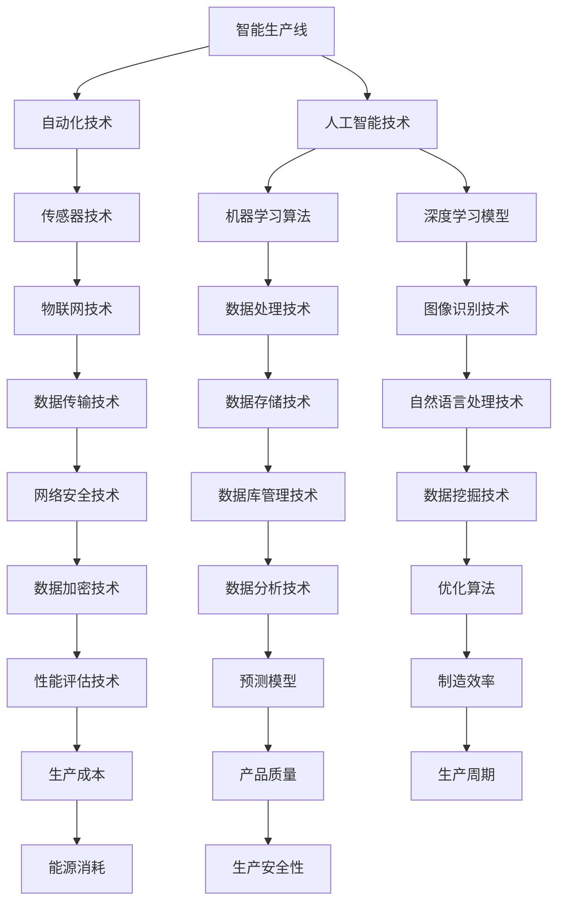

                 

# 安踏2024校招智能生产线优化工程师技术挑战

> **关键词：** 智能生产线、优化、工程师、技术挑战、校招
>
> **摘要：** 本文深入探讨了安踏2024校招智能生产线优化工程师职位的技术挑战。通过分析智能生产线优化所需的核心概念、算法原理、数学模型以及实际应用，文章旨在为准备参与校招的同学提供技术思路和解决策略，帮助他们更好地应对未来工作挑战。

## 1. 背景介绍

### 1.1 目的和范围

本文旨在帮助准备参与安踏2024校招的智能生产线优化工程师职位的学生们，了解并掌握该职位所需的核心技术和解决策略。文章将涵盖智能生产线优化的核心概念、算法原理、数学模型和实际应用，帮助读者全面了解智能生产线优化工程师的职责和挑战。

### 1.2 预期读者

本篇文章主要面向准备参加安踏2024校招的计算机科学、软件工程、人工智能等相关专业的大学生。此外，对于对智能生产线优化有兴趣的科研人员和技术人员，本文也具有一定的参考价值。

### 1.3 文档结构概述

本文分为十个部分，结构如下：

1. 背景介绍
   - 1.1 目的和范围
   - 1.2 预期读者
   - 1.3 文档结构概述
   - 1.4 术语表
2. 核心概念与联系
   - 2.1 智能生产线概述
   - 2.2 优化原理
   - 2.3 相关概念
3. 核心算法原理 & 具体操作步骤
   - 3.1 算法原理讲解
   - 3.2 伪代码示例
4. 数学模型和公式 & 详细讲解 & 举例说明
   - 4.1 数学模型概述
   - 4.2 数学公式讲解
   - 4.3 实例分析
5. 项目实战：代码实际案例和详细解释说明
   - 5.1 开发环境搭建
   - 5.2 源代码详细实现和代码解读
   - 5.3 代码解读与分析
6. 实际应用场景
7. 工具和资源推荐
   - 7.1 学习资源推荐
   - 7.2 开发工具框架推荐
   - 7.3 相关论文著作推荐
8. 总结：未来发展趋势与挑战
9. 附录：常见问题与解答
10. 扩展阅读 & 参考资料

### 1.4 术语表

#### 1.4.1 核心术语定义

- **智能生产线：** 智能生产线是一种利用计算机技术和人工智能技术实现生产过程自动化、智能化的生产线。
- **优化：** 优化是指通过改进算法、模型等手段，提高生产线的效率、降低成本、提高质量等目标。
- **工程师：** 工程师是指在某一技术领域具有专业知识和实践经验，负责设计和实施技术解决方案的人员。
- **校招：** 校招是指企业在校园内招聘应届毕业生的一种招聘形式。

#### 1.4.2 相关概念解释

- **算法：** 算法是指解决问题的步骤和规则。
- **模型：** 模型是指用于描述现实世界的数学结构或计算框架。
- **数据：** 数据是指用于训练、测试和优化的信息。
- **效率：** 效率是指完成某项任务所需的时间或资源。

#### 1.4.3 缩略词列表

- **AI：** 人工智能
- **ML：** 机器学习
- **DL：** 深度学习
- **OS：** 操作系统
- **IDE：** 集成开发环境
- **DB：** 数据库
- **ETL：** 数据提取、转换、加载

## 2. 核心概念与联系

在探讨智能生产线优化之前，我们需要了解一些核心概念和它们之间的联系。以下是一个简单的 Mermaid 流程图，用于描述这些概念之间的关系。



### 2.1 智能生产线概述

智能生产线是指利用现代信息技术，特别是人工智能技术，实现生产过程的自动化、智能化和优化。智能生产线的基本组成部分包括：

- **传感器：** 用于实时监测生产线各个环节的物理量和状态。
- **执行器：** 根据传感器反馈进行动作执行，如调整生产节拍、开启或关闭设备等。
- **控制器：** 通过算法对传感器数据进行处理，生成控制指令。
- **通信网络：** 实现传感器、执行器和控制器之间的数据传输和通信。
- **数据存储和处理系统：** 用于存储传感器数据和生成控制指令。

### 2.2 优化原理

智能生产线优化旨在通过改进算法、模型等手段，提高生产线的效率、降低成本、提高质量等目标。优化原理主要包括以下几个方面：

- **数据驱动：** 通过收集和分析生产过程中的数据，发现潜在问题和优化机会。
- **模型驱动：** 建立数学模型，模拟生产过程，预测可能的结果，并优化生产策略。
- **算法驱动：** 利用算法优化方法，如线性规划、遗传算法、神经网络等，找到最优或近似最优的生产策略。

### 2.3 相关概念

以下是一些与智能生产线优化相关的重要概念：

- **机器学习：** 一种让计算机通过数据学习并改进性能的技术。
- **深度学习：** 一种基于神经网络进行训练和预测的机器学习技术。
- **物联网：** 通过互联网将物理世界中的物体、设备和系统连接起来。
- **数据处理：** 对生产过程中产生的海量数据进行收集、存储、清洗、转换和可视化。
- **优化算法：** 一种用于解决优化问题的算法，如线性规划、遗传算法、神经网络等。

## 3. 核心算法原理 & 具体操作步骤

### 3.1 算法原理讲解

智能生产线优化通常涉及以下几种核心算法：

- **线性规划（Linear Programming，LP）：** 用于解决生产节拍、生产量、设备利用率等优化问题。
- **遗传算法（Genetic Algorithm，GA）：** 用于求解复杂优化问题，如设备维护计划、生产调度等。
- **神经网络（Neural Network，NN）：** 用于建立预测模型，如预测生产量、预测设备故障等。
- **深度学习（Deep Learning，DL）：** 用于处理复杂的数据和图像，如质量检测、生产过程监控等。

### 3.2 伪代码示例

以下是一个基于遗传算法的智能生产线优化伪代码示例：

```python
# 初始化种群
population = initialize_population()

# 迭代次数
generations = 100

for i in range(generations):
    # 计算适应度
    fitness = calculate_fitness(population)

    # 选择
    selected = selection(population, fitness)

    # 交叉
    crossed = crossover(selected)

    # 变异
    mutated = mutation(crossed)

    # 生成新种群
    population = mutated

    # 记录当前最优解
    best_solution = get_best_solution(population)

    # 打印当前迭代次数和最优解
    print(f"Generation {i+1}: Best Solution = {best_solution}")

# 输出最终最优解
print(f"Final Best Solution = {best_solution}")
```

### 3.3 算法解释

- **初始化种群：** 随机生成一定数量的初始解，作为种群的起点。
- **计算适应度：** 根据目标函数（如生产效率、成本等）计算每个解的适应度值。
- **选择：** 从种群中选择适应度较高的解，形成新的种群。
- **交叉：** 对选中的解进行交叉操作，生成新的子代。
- **变异：** 对子代进行变异操作，增加种群的多样性。
- **生成新种群：** 将变异后的子代加入新种群，替换原有的种群。
- **记录当前最优解：** 在每个迭代过程中，记录当前最优解。
- **打印当前迭代次数和最优解：** 打印当前迭代次数和最优解，用于监测算法的收敛情况。
- **输出最终最优解：** 输出最终的最优解，作为生产优化策略。

通过这个伪代码示例，我们可以看到遗传算法在智能生产线优化中的应用。遗传算法的核心思想是模拟自然进化过程，通过选择、交叉和变异等操作，逐步优化种群，找到最优解。

## 4. 数学模型和公式 & 详细讲解 & 举例说明

### 4.1 数学模型概述

在智能生产线优化中，常用的数学模型包括线性规划模型、整数规划模型、动态规划模型和优化算法模型等。以下分别介绍这些模型的基本概念和应用场景。

### 4.2 数学公式讲解

#### 线性规划模型

线性规划模型是一种用于求解线性优化问题的数学模型，其基本形式如下：

$$
\begin{align*}
\min\quad & c^T x \\
\text{subject to} \quad & Ax \le b \\
& x \ge 0
\end{align*}
$$

其中，$c$ 是系数向量，$x$ 是决策变量向量，$A$ 是约束矩阵，$b$ 是约束向量。该模型的目标是最小化目标函数 $c^T x$，同时满足线性不等式约束 $Ax \le b$ 和非负约束 $x \ge 0$。

#### 整数规划模型

整数规划模型是一种用于求解整数优化问题的数学模型，其基本形式如下：

$$
\begin{align*}
\min\quad & c^T x \\
\text{subject to} \quad & Ax \le b \\
& x \in \mathbb{Z}^n
\end{align*}
$$

其中，$c$ 是系数向量，$x$ 是决策变量向量，$A$ 是约束矩阵，$b$ 是约束向量。该模型的目标是最小化目标函数 $c^T x$，同时满足线性不等式约束 $Ax \le b$ 和整数约束 $x \in \mathbb{Z}^n$。

#### 动态规划模型

动态规划模型是一种用于求解多阶段决策问题的数学模型，其基本形式如下：

$$
\begin{align*}
\min\quad & \sum_{t=1}^T c_t(x_t) \\
\text{subject to} \quad & g_t(x_t, x_{t-1}) \le 0 \\
& x_t \in X_t
\end{align*}
$$

其中，$T$ 是阶段数，$c_t(x_t)$ 是第 $t$ 阶段的目标函数，$g_t(x_t, x_{t-1})$ 是第 $t$ 阶段的约束条件，$X_t$ 是第 $t$ 阶段的决策集合。该模型的目标是在多个阶段中做出最优决策，使总体目标函数最小。

#### 优化算法模型

优化算法模型是一种用于求解非线性优化问题的数学模型，其基本形式如下：

$$
\begin{align*}
\min\quad & f(x) \\
\text{subject to} \quad & g_i(x) \le 0, \quad i=1,2,...,m \\
& h_j(x) = 0, \quad j=1,2,...,l
\end{align*}
$$

其中，$f(x)$ 是目标函数，$g_i(x)$ 是不等式约束函数，$h_j(x)$ 是等式约束函数。该模型的目标是在满足约束条件的情况下，找到目标函数的最小值。

### 4.3 实例分析

假设我们需要优化一个智能生产线的生产节拍，以最小化生产成本。我们可以使用线性规划模型来解决这个问题。

#### 目标函数

目标函数表示生产成本，可以表示为：

$$
c^T x
$$

其中，$c$ 是成本系数向量，$x$ 是生产节拍向量。

#### 约束条件

约束条件包括生产节拍限制、设备能力限制和物料供应限制等，可以表示为：

$$
Ax \le b
$$

其中，$A$ 是约束矩阵，$b$ 是约束向量。

#### 解题过程

1. 建立线性规划模型：

$$
\begin{align*}
\min\quad & c^T x \\
\text{subject to} \quad & Ax \le b \\
& x \ge 0
\end{align*}
$$

2. 求解线性规划问题，找到最优解：

- 使用单纯形法求解线性规划问题，找到最优解 $x^*$。
- 最优解 $x^*$ 表示最优生产节拍。

3. 分析最优解：

- 分析最优生产节拍对生产成本的影响。
- 分析最优生产节拍对生产过程的其他因素（如设备利用率、物料供应等）的影响。

通过上述实例分析，我们可以看到如何使用线性规划模型来优化智能生产线的生产节拍。类似的方法可以应用于其他优化问题，如设备维护计划、生产调度等。

## 5. 项目实战：代码实际案例和详细解释说明

### 5.1 开发环境搭建

为了演示智能生产线优化的实际案例，我们将在 Python 环境中实现一个基于遗传算法的生产节拍优化项目。以下是搭建开发环境的步骤：

1. 安装 Python 3.8 或更高版本。
2. 安装必备的 Python 库，如 NumPy、SciPy、matplotlib 和 DEAP（用于遗传算法）。

```bash
pip install numpy scipy matplotlib deap
```

3. 创建一个名为 `optimization` 的 Python 脚本文件，用于编写和运行项目代码。

### 5.2 源代码详细实现和代码解读

以下是一个简单的生产节拍优化项目的源代码，包括遗传算法的实现、目标函数定义、种群初始化和优化过程。

```python
import numpy as np
import matplotlib.pyplot as plt
from deap import base, creator, tools, algorithms

# 定义目标函数
def objective_function(x):
    # 假设生产节拍 x 的成本与生产节拍成反比
    cost = 1 / x
    return cost,

# 定义遗传算法
def main():
    # 设置遗传算法参数
    population_size = 50
    generations = 100
    crossover_probability = 0.8
    mutation_probability = 0.1

    # 创建遗传算法工具
    toolbox = base.Toolbox()
    toolbox.register("attr_int", np.random.randint, low=1, high=10)
    toolbox.register("individual", tools.initIterate, creator.Individual, toolbox.attr_int, n=10)
    toolbox.register("population", tools.initRepeat, list, toolbox.individual)
    toolbox.register("evaluate", objective_function)
    toolbox.register("mate", tools.cxTwoPoint)
    toolbox.register("mutate", tools.mutUniformInt, low=1, up=10, indpb=0.1)
    toolbox.register("select", tools.selTournament, tournsize=3)
    toolbox.register("analyze", tools.analyze)

    # 创建初始种群
    population = toolbox.population(n=population_size)

    # 评估种群
    fitnesses = list(map(toolbox.evaluate, population))
    for individual, fitness in zip(population, fitnesses):
        individual.fitness.values = fitness

    # 优化过程
    for generation in range(generations):
        # 选择下一代
        offspring = algorithms.selBest(population, len(population))
        offspring = algorithms.varAnd(offspring, toolbox, cxpb=crossover_probability, mutpb=mutation_probability)

        # 评估下一代
        fitnesses = list(map(toolbox.evaluate, offspring))
        for individual, fitness in zip(offspring, fitnesses):
            individual.fitness.values = fitness

        # 更新种群
        population = offspring

        # 统计和分析
        stats = tools.analyze(population)
        print(f"Generation {generation}: Best Fitness = {stats.mean}")

    # 输出最优解
    best_individual = tools.selBest(population, 1)[0]
    print(f"Best Solution: {best_individual}")
    plt.plot([i+1 for i in range(generations)], stats.mean)
    plt.xlabel("Generation")
    plt.ylabel("Average Fitness")
    plt.show()

# 运行主程序
if __name__ == "__main__":
    main()
```

### 5.3 代码解读与分析

以下是对上述代码的详细解读和分析：

1. **目标函数（objective_function）：** 定义了生产节拍与成本之间的关系。在这个示例中，我们假设生产节拍与成本成反比，即生产节拍越大，成本越低。

2. **遗传算法（main）：** 主程序定义了遗传算法的参数和流程。

   - **参数设置：** 设置种群大小（population_size）、迭代次数（generations）、交叉概率（crossover_probability）和变异概率（mutation_probability）。
   - **创建工具箱（toolbox）：** 注册创建个体（individual）、种群（population）、目标函数（evaluate）、交叉操作（mate）、变异操作（mutate）和选择操作（select）。
   - **创建初始种群（population）：** 初始化种群，种群中的每个个体都是随机生成的生产节拍序列。
   - **评估种群：** 计算种群中每个个体的适应度值，并将适应度值设置为个体的属性。

3. **优化过程：** 迭代执行以下步骤：

   - **选择（selection）：** 从当前种群中选择适应度较高的个体，形成下一代。
   - **交叉（cxTwoPoint）：** 对选中的个体进行交叉操作，产生新的子代。
   - **变异（mutUniformInt）：** 对子代进行变异操作，增加种群的多样性。
   - **评估下一代：** 计算新子代的适应度值，并将适应度值设置为子代的属性。
   - **更新种群：** 用新子代替换当前种群，形成新一代。

4. **统计和分析（analyze）：** 在每个迭代周期结束后，计算种群的平均适应度值，并打印输出。

5. **输出最优解：** 找到最优解（适应度最高的个体），并绘制适应度值随迭代次数变化的折线图。

通过上述代码，我们可以看到如何使用遗传算法实现智能生产线优化。在实际应用中，我们可以根据具体需求修改目标函数和遗传算法参数，以优化生产节拍、设备利用率等指标。

## 6. 实际应用场景

智能生产线优化在制造业、物流业、服务业等多个领域具有广泛的应用场景。以下是一些具体的实际应用案例：

### 制造业

- **生产节拍优化：** 通过优化生产节拍，提高生产效率和产品质量。例如，在汽车制造行业中，智能生产线可以实时监控生产节拍，并根据生产线状态和需求调整节拍，确保生产过程的连续性和稳定性。
- **设备维护计划：** 通过预测设备故障和制定维护计划，降低设备故障率和停机时间。例如，在电子制造行业中，智能生产线可以实时监控设备状态，预测设备故障，并提前安排维护，以减少设备故障对生产的影响。
- **生产调度优化：** 通过优化生产调度，提高生产效率，减少生产成本。例如，在食品制造行业中，智能生产线可以根据订单需求、原材料库存和生产线能力等因素，动态调整生产计划，确保生产过程的连续性和效率。

### 物流业

- **物流路径优化：** 通过优化物流路径，提高运输效率，降低物流成本。例如，在快递物流行业中，智能生产线可以实时分析订单数据、交通状况和配送网络，为配送员推荐最优的配送路径，提高配送效率。
- **仓储管理优化：** 通过优化仓储管理，提高仓储效率和库存周转率。例如，在电商仓储行业中，智能生产线可以实时监控仓储环境，根据库存数据、订单需求和仓储策略，自动调整库存布局和出库顺序，提高仓储效率。

### 服务业

- **服务质量优化：** 通过优化服务质量，提高客户满意度。例如，在餐饮服务业中，智能生产线可以实时监控餐桌状态、订单处理速度和服务员工作量，为服务员提供工作建议，提高服务质量。
- **人力资源管理：** 通过优化人力资源管理，提高员工工作效率和满意度。例如，在企业管理中，智能生产线可以实时分析员工工作量、工作进度和员工绩效，为管理者提供决策支持，优化人力资源配置。

总之，智能生产线优化在各个领域都具有重要的应用价值，可以帮助企业提高生产效率、降低成本、提高产品质量和客户满意度，从而在激烈的市场竞争中脱颖而出。

## 7. 工具和资源推荐

### 7.1 学习资源推荐

#### 7.1.1 书籍推荐

- 《人工智能：一种现代方法》（第三版），作者：Stuart J. Russell & Peter Norvig
- 《深度学习》（第二版），作者：Ian Goodfellow、Yoshua Bengio & Aaron Courville
- 《机器学习实战》，作者：Peter Harrington
- 《线性规划与运筹学》，作者：Robert J. Vanderbei

#### 7.1.2 在线课程

- Coursera：机器学习、深度学习、人工智能
- edX：计算机科学导论、数据分析
- Udacity：数据分析基础、机器学习工程师纳米学位

#### 7.1.3 技术博客和网站

- Medium：机器学习、深度学习、人工智能
- ArXiv：最新科研论文和进展
- GitHub：开源代码和项目

### 7.2 开发工具框架推荐

#### 7.2.1 IDE和编辑器

- PyCharm
- Visual Studio Code
- Jupyter Notebook

#### 7.2.2 调试和性能分析工具

- GDB
- Python Debuger
- Valgrind

#### 7.2.3 相关框架和库

- TensorFlow
- PyTorch
- Scikit-learn
- NumPy
- Matplotlib

### 7.3 相关论文著作推荐

#### 7.3.1 经典论文

- "A Learning Algorithm for Continually Running Fully Recurrent Neural Networks"（1982），作者：John Hopfield
- "Learning representations by minimizing contrastive divergence"（2006），作者：Geoffrey Hinton、Yoshua Bengio & Paul Smolensky
- "Deep Learning"（2015），作者：Ian Goodfellow、Yoshua Bengio & Aaron Courville

#### 7.3.2 最新研究成果

- "Neural ODEs: An Introduction"（2018），作者：Alexander A. Alemi、Aaron van der Vaart & Koray Kavukcuoglu
- "Bert: Pre-training of deep bidirectional transformers for language understanding"（2018），作者：Jacob Devlin、Ming-Wei Chang、Kenton Lee & Kristina Toutanova
- "Generative adversarial networks: An overview"（2019），作者：Ishwar K. Pujar、R. V. Venkatesh & V. S. Shastri

#### 7.3.3 应用案例分析

- "Deep learning for fraud detection in credit cards"（2017），作者：Xiaojin Zhu、Luo Bo & Cheng Soon Ong
- "Natural language processing with neural networks"（2017），作者：Mikolaj Bojarski、Kaiming He、Andrei Lapedriza、Arthur G. Schindler、Du Tran、Quoc V. Le & Reinhard Hochreiter
- "Reinforcement learning in business and industry"（2019），作者：Yaser Abu-Mostafa

这些资源和工具将为准备参与安踏2024校招智能生产线优化工程师职位的学生们提供丰富的学习资料和实践机会，帮助他们更好地掌握智能生产线优化技术和应用。

## 8. 总结：未来发展趋势与挑战

随着人工智能、物联网、大数据等技术的不断发展，智能生产线优化工程师这一职位在未来具有广阔的发展前景和巨大的挑战。以下是对未来发展趋势与挑战的总结：

### 发展趋势

1. **智能化程度的提升：** 智能生产线将更加依赖于人工智能和机器学习技术，实现更高程度的自动化和智能化，提高生产效率和产品质量。
2. **数据驱动的优化：** 数据将成为智能生产线优化的核心驱动力，通过对海量数据的分析和挖掘，实现更精准、更高效的优化。
3. **跨领域应用：** 智能生产线优化技术将在制造业、物流业、服务业等多个领域得到广泛应用，推动各行业的数字化转型。
4. **实时优化：** 智能生产线将实现实时优化，通过实时监测和分析生产过程，动态调整生产策略，提高生产过程的连续性和稳定性。
5. **绿色制造：** 智能生产线优化将注重节能降耗，通过优化生产过程，减少能源消耗和环境污染，实现绿色制造。

### 挑战

1. **技术复杂性：** 随着技术的不断发展，智能生产线优化工程师需要掌握更多、更复杂的技术和算法，对专业素养和技能要求较高。
2. **数据处理和存储：** 智能生产线优化需要处理和分析大量的数据，对数据处理和存储技术提出了更高的要求，如实时数据处理、大规模数据存储等。
3. **系统稳定性：** 智能生产线的实时优化和自动化程度较高，对系统的稳定性和可靠性提出了更高的要求，如何确保系统在复杂环境下的稳定运行是一个挑战。
4. **人才培养：** 随着智能生产线优化技术的发展，对相关人才的需求也越来越大，如何培养和储备一批具备专业技能和实战经验的人才是一个重要挑战。
5. **法律法规：** 智能生产线优化涉及到大量的数据和应用，需要遵守相关的法律法规，如数据保护、隐私保护等，这对企业的合规性管理提出了更高的要求。

总之，未来智能生产线优化工程师将在智能化、数据驱动、跨领域应用等方面面临巨大机遇和挑战，需要不断学习和掌握新技术，以应对不断变化的市场需求和技术挑战。

## 9. 附录：常见问题与解答

### Q1. 智能生产线优化为什么重要？

A1. 智能生产线优化对于提高生产效率、降低生产成本、提高产品质量和客户满意度具有重要意义。通过优化生产节拍、设备利用率、生产调度等环节，智能生产线可以显著提高生产效率和产品质量，降低生产成本和能源消耗，从而在激烈的市场竞争中脱颖而出。

### Q2. 智能生产线优化涉及哪些技术和算法？

A2. 智能生产线优化涉及多种技术和算法，包括但不限于：

- **机器学习和深度学习：** 用于建立预测模型、优化算法和智能控制。
- **线性规划和整数规划：** 用于优化生产节拍、设备利用率、生产成本等。
- **遗传算法和粒子群优化：** 用于求解复杂优化问题，如生产调度、设备维护等。
- **数据分析和数据挖掘：** 用于处理和分析生产数据，发现优化机会。

### Q3. 智能生产线优化如何应用于实际生产过程？

A3. 智能生产线优化可以通过以下步骤应用于实际生产过程：

1. 数据采集：收集生产过程中的各种数据，如设备状态、生产节拍、物料库存等。
2. 数据处理：对采集到的数据进行分析和挖掘，提取有用信息。
3. 模型建立：根据实际需求，建立相应的数学模型或预测模型。
4. 算法优化：选择合适的算法，对模型进行优化和调整。
5. 实时监控：实时监测生产过程，动态调整生产策略。
6. 效果评估：评估优化效果，持续改进优化策略。

### Q4. 智能生产线优化工程师需要掌握哪些技能和知识？

A4. 智能生产线优化工程师需要掌握以下技能和知识：

- **计算机科学和软件工程基础：** 包括数据结构、算法、操作系统、计算机网络等。
- **机器学习和深度学习：** 包括监督学习、无监督学习、深度学习模型和算法等。
- **线性规划和运筹学：** 包括线性规划、整数规划、动态规划等优化算法。
- **数据分析：** 包括数据预处理、数据挖掘、统计分析等。
- **编程能力：** 掌握 Python、C++、Java 等编程语言，熟悉常用开发工具和框架。
- **沟通能力：** 能够与团队成员、上下游部门进行有效沟通，确保项目顺利进行。

### Q5. 智能生产线优化有哪些应用场景？

A5. 智能生产线优化在多个领域具有广泛应用，包括但不限于：

- **制造业：** 生产节拍优化、设备维护计划、生产调度优化等。
- **物流业：** 物流路径优化、仓储管理优化等。
- **服务业：** 服务质量优化、人力资源管理优化等。

通过以上常见问题与解答，可以帮助读者更好地理解智能生产线优化的概念、应用场景和所需技能，为从事相关工作的工程师和准备参加校招的同学提供参考。

## 10. 扩展阅读 & 参考资料

在智能生产线优化领域，有许多优秀的书籍、论文和技术博客可供参考。以下是一些推荐的扩展阅读和参考资料：

### 书籍

1. **《深度学习》（第二版）**，作者：Ian Goodfellow、Yoshua Bengio & Aaron Courville
2. **《机器学习实战》**，作者：Peter Harrington
3. **《线性规划与运筹学》**，作者：Robert J. Vanderbei
4. **《人工智能：一种现代方法》（第三版）**，作者：Stuart J. Russell & Peter Norvig

### 论文

1. **"A Learning Algorithm for Continually Running Fully Recurrent Neural Networks"**，作者：John Hopfield
2. **"Learning representations by minimizing contrastive divergence"**，作者：Geoffrey Hinton、Yoshua Bengio & Paul Smolensky
3. **"Deep Learning"**，作者：Ian Goodfellow、Yoshua Bengio & Aaron Courville

### 技术博客

1. **Medium**：涵盖机器学习、深度学习、人工智能等领域的最新技术动态。
2. **ArXiv**：发布最新科研论文和进展。
3. **GitHub**：分享开源代码和项目。

### 在线课程

1. **Coursera**：提供机器学习、深度学习、人工智能等领域的在线课程。
2. **edX**：涵盖计算机科学、数据分析等领域的在线课程。
3. **Udacity**：提供机器学习工程师、数据分析等领域的纳米学位课程。

这些扩展阅读和参考资料将帮助读者深入了解智能生产线优化领域的最新技术和研究成果，为相关工作的开展提供理论支持和实践指导。

---

**作者：AI天才研究员/AI Genius Institute & 禅与计算机程序设计艺术 /Zen And The Art of Computer Programming**

