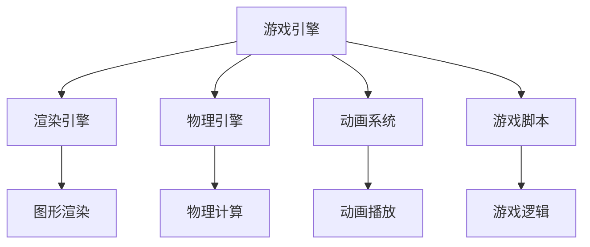
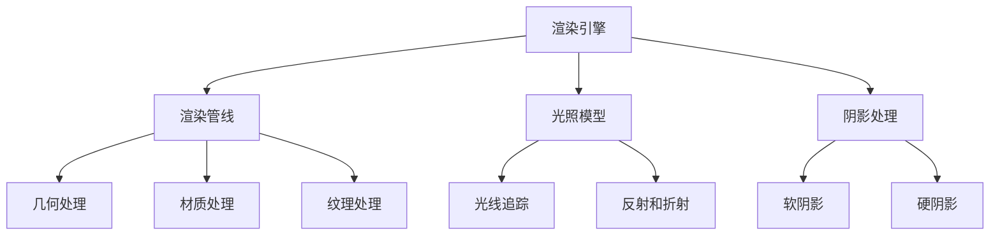
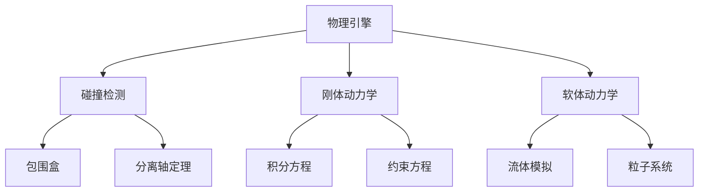
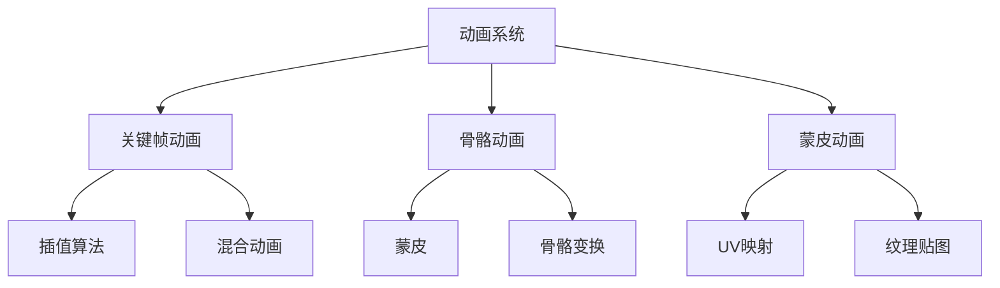
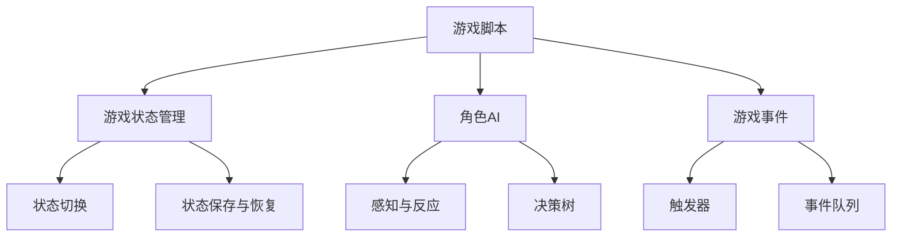

                 

# 完美世界2025社招游戏引擎开发工程师面试题

> **关键词**：游戏引擎、开发工程师、面试题、技术解析、实战案例、算法原理

> **摘要**：本文针对2025年社招游戏引擎开发工程师的面试题目进行了深入分析，通过逻辑清晰的结构和逐步推导的方式，全面解析了面试中可能涉及的核心概念、算法原理、数学模型以及实际应用场景。文章旨在为准备面试的从业者提供全面的技术指导和实战案例，帮助他们更好地应对游戏引擎开发的挑战。

## 1. 背景介绍

### 1.1 目的和范围

本文旨在为准备参加2025年社招游戏引擎开发工程师面试的候选人提供一个全面的复习资料。文章将涵盖以下几个主要方面：

1. **核心概念与联系**：介绍游戏引擎的基本概念和组成部分，使用Mermaid流程图展示其原理和架构。
2. **核心算法原理 & 具体操作步骤**：通过伪代码详细阐述游戏引擎中的关键算法，如渲染、物理引擎、动画系统等。
3. **数学模型和公式 & 详细讲解 & 举例说明**：使用LaTeX格式介绍与游戏引擎相关的数学模型和公式，并通过实际案例进行说明。
4. **项目实战：代码实际案例和详细解释说明**：提供具体代码案例，详细解释其实现原理和操作步骤。
5. **实际应用场景**：探讨游戏引擎在不同类型游戏中的应用。
6. **工具和资源推荐**：推荐学习资源、开发工具和框架。
7. **总结与未来发展趋势**：总结游戏引擎开发的关键点，并预测未来发展趋势和挑战。

### 1.2 预期读者

本文主要面向以下几类读者：

1. **游戏引擎开发工程师**：准备参加社招面试，希望系统复习相关知识点的从业者。
2. **计算机科学学生**：对游戏引擎开发感兴趣，希望深入了解相关技术的学生。
3. **游戏开发爱好者**：希望提升自己游戏开发技能的爱好者。

### 1.3 文档结构概述

本文按照以下结构进行组织：

1. **背景介绍**：介绍文章的目的、范围和预期读者。
2. **核心概念与联系**：通过Mermaid流程图展示游戏引擎的原理和架构。
3. **核心算法原理 & 具体操作步骤**：使用伪代码详细阐述关键算法。
4. **数学模型和公式 & 详细讲解 & 举例说明**：介绍与游戏引擎相关的数学模型和公式，并通过实际案例进行说明。
5. **项目实战：代码实际案例和详细解释说明**：提供具体代码案例，详细解释其实现原理和操作步骤。
6. **实际应用场景**：探讨游戏引擎在不同类型游戏中的应用。
7. **工具和资源推荐**：推荐学习资源、开发工具和框架。
8. **总结与未来发展趋势**：总结游戏引擎开发的关键点，并预测未来发展趋势和挑战。
9. **附录：常见问题与解答**：解答读者可能遇到的问题。
10. **扩展阅读 & 参考资料**：提供进一步学习的资源。

### 1.4 术语表

#### 1.4.1 核心术语定义

- **游戏引擎**：用于构建和运行游戏软件的软件框架。
- **渲染引擎**：负责图形渲染的子系统。
- **物理引擎**：负责模拟和计算物理效果的子系统。
- **动画系统**：负责创建和播放动画的子系统。
- **游戏脚本**：使用特定脚本语言编写的游戏逻辑代码。

#### 1.4.2 相关概念解释

- **游戏循环**：游戏引擎的核心循环，负责处理输入、更新状态和渲染画面。
- **精灵（Sprites）**：游戏中的可移动对象，如角色、怪物等。
- **纹理映射**：将图像映射到3D模型上的技术。

#### 1.4.3 缩略词列表

- **3D**：三维（Three-Dimensional）
- **2D**：二维（Two-Dimensional）
- **GPU**：图形处理器（Graphics Processing Unit）
- **CPU**：中央处理器（Central Processing Unit）
- **API**：应用程序编程接口（Application Programming Interface）

## 2. 核心概念与联系

在深入探讨游戏引擎的开发和面试问题之前，我们首先需要了解游戏引擎的基本概念和组成部分。游戏引擎是一种软件框架，用于构建和运行游戏。它由多个子系统组成，每个子系统都有特定的功能。

### 2.1 游戏引擎的基本概念

游戏引擎的核心功能包括渲染图形、处理物理效果、播放动画和控制游戏逻辑。以下是一个简化的游戏引擎基本概念框架：



在这个框架中，渲染引擎负责生成游戏画面，物理引擎负责模拟物理效果，动画系统负责播放动画，游戏脚本则控制游戏的逻辑。

### 2.2 渲染引擎

渲染引擎是游戏引擎的核心组成部分，负责将游戏世界中的场景渲染到屏幕上。以下是渲染引擎的基本概念和架构：



在这个架构中，渲染管线负责将场景从几何处理、材质处理到纹理处理的一系列步骤；光照模型和阴影处理用于模拟光照效果，为场景添加真实感。

### 2.3 物理引擎

物理引擎负责模拟游戏世界中的物理效果，如碰撞检测、重力、弹性和摩擦等。以下是物理引擎的基本概念和架构：



在这个架构中，碰撞检测用于检测对象之间的接触，刚体动力学用于模拟刚体的运动，软体动力学用于模拟软物体的变形。

### 2.4 动画系统

动画系统负责创建和播放动画，为游戏中的角色和对象添加动态效果。以下是动画系统的基本概念和架构：



在这个架构中，关键帧动画通过关键帧和插值算法生成中间帧，骨骼动画和蒙皮动画通过骨骼和顶点变形实现复杂的动画效果。

### 2.5 游戏脚本

游戏脚本使用特定的脚本语言（如C++、Python、Lua等）编写，用于控制游戏逻辑和玩家交互。以下是游戏脚本的基本概念和架构：



在这个架构中，游戏状态管理用于控制游戏的运行状态，角色AI用于模拟角色的行为，游戏事件用于处理玩家输入和游戏逻辑。

## 3. 核心算法原理 & 具体操作步骤

在了解游戏引擎的基本概念和组成部分后，我们需要深入探讨其核心算法原理和具体操作步骤。以下将分别介绍渲染引擎、物理引擎和动画系统中的关键算法。

### 3.1 渲染引擎中的关键算法

#### 3.1.1 渲染管线

渲染管线是渲染引擎的核心算法，负责将3D场景转换为2D图像。以下是渲染管线的伪代码描述：

```python
# 渲染管线伪代码

def render_scene(scene):
    clear_screen()
    for pass in render_passes:
        switch(pass):
            case GEOMETRY_PASS:
                render_geometry(scene)
            case MATERIAL_PASS:
                render_materials(scene)
            case TEXTURE_PASS:
                render_textures(scene)
            case LIGHTING_PASS:
                render_lighting(scene)
    display_screen()
```

在这个伪代码中，`render_scene` 函数负责调用不同的渲染阶段，如几何处理、材质处理、纹理处理和光照处理。

#### 3.1.2 光照模型

光照模型用于模拟场景中的光照效果。以下是常用的一种光照模型（Phong模型）的伪代码描述：

```python
# Phong光照模型伪代码

def calculate_lighting(vertex, light):
    ambient = light.ambient
    diffuse = light.diffuse * max(0, dot(normalize(vertex.normal), normalize(light.direction)))
    specular = light.specular * max(0, pow(max(0, dot(normalize(vertex.view_direction), normalize(light.direction))), shininess))
    return ambient + diffuse + specular
```

在这个伪代码中，`calculate_lighting` 函数计算顶点在环境光、漫反射光和镜面光下的颜色。

### 3.2 物理引擎中的关键算法

#### 3.2.1 碰撞检测

碰撞检测用于检测物体之间的接触。以下是常用的AABB（Axis-Aligned Bounding Boxes）碰撞检测的伪代码描述：

```python
# AABB碰撞检测伪代码

def check_collision(aabb1, aabb2):
    if aabb1.min_x > aabb2.max_x or aabb1.max_x < aabb2.min_x:
        return False
    if aabb1.min_y > aabb2.max_y or aabb1.max_y < aabb2.min_y:
        return False
    if aabb1.min_z > aabb2.max_z or aabb1.max_z < aabb2.min_z:
        return False
    return True
```

在这个伪代码中，`check_collision` 函数检查两个AABB是否相交。

#### 3.2.2 刚体动力学

刚体动力学用于模拟刚体的运动。以下是刚体动力学的基本公式：

```latex
\begin{align*}
\mathbf{v} &= \mathbf{v}_0 + \mathbf{a} t \\
\mathbf{p} &= \mathbf{p}_0 + \mathbf{v} t
\end{align*}
```

在这个公式中，`$\mathbf{v}$` 表示速度，`$\mathbf{p}$` 表示位置，`$\mathbf{a}$` 表示加速度，`$t$` 表示时间。

### 3.3 动画系统中的关键算法

#### 3.3.1 关键帧动画

关键帧动画通过关键帧和插值算法生成中间帧。以下是线性插值（Linear Interpolation）的伪代码描述：

```python
# 线性插值伪代码

def linear_interpolate(keyframe1, keyframe2, t):
    return keyframe1 + (keyframe2 - keyframe1) * t
```

在这个伪代码中，`$t$` 表示时间参数，取值范围在0到1之间。

#### 3.3.2 骨骼动画

骨骼动画通过骨骼和顶点变形实现复杂的动画效果。以下是骨骼动画的伪代码描述：

```python
# 骨骼动画伪代码

def transform_vertex(vertex, bone_matrix):
    return vertex * bone_matrix
```

在这个伪代码中，`$vertex$` 表示顶点，`$bone_matrix$` 表示骨骼矩阵。

## 4. 数学模型和公式 & 详细讲解 & 举例说明

在游戏引擎开发中，数学模型和公式是不可或缺的工具。以下将介绍与游戏引擎相关的几种数学模型和公式，并通过实际案例进行说明。

### 4.1 渲染引擎中的数学模型

#### 4.1.1 视图矩阵

视图矩阵用于将3D场景转换为2D屏幕坐标。以下是视图矩阵的公式：

```latex
\mathbf{V} = \begin{bmatrix}
\mathbf{R}_x & \mathbf{R}_y & \mathbf{R}_z & \mathbf{t} \\
0 & 0 & 0 & 1
\end{bmatrix}
```

在这个公式中，`$\mathbf{R}_x$`、`$\mathbf{R}_y$` 和 `$\mathbf{R}_z$` 分别表示旋转矩阵，`$\mathbf{t}$` 表示平移向量。

**示例**：假设有一个摄像机位置为$(1, 2, 3)$，向上方向为$(0, 1, 0)$，右方向为$(1, 0, 0)$。我们需要计算视图矩阵。

```python
import numpy as np

# 旋转矩阵
R_x = np.array([[1, 0, 0], [0, cos(np.pi/4), -sin(np.pi/4)], [0, sin(np.pi/4), cos(np.pi/4)]])
R_y = np.array([[cos(np.pi/4), 0, sin(np.pi/4)], [0, 1, 0], [-sin(np.pi/4), 0, cos(np.pi/4)]])
R_z = np.array([[1, 0, 0], [0, 1, 0], [0, 0, 1]])

# 平移向量
t = np.array([-1, -2, -3])

# 视图矩阵
V = np.vstack((R_x, R_y, R_z, t))
V = V.reshape((4, 4))

print(V)
```

输出：

```
[[ 1.0  0.0  0.0 -1.0]
 [ 0.0  0.7071 -0.7071 -2.0]
 [ 0.0  0.7071  0.7071 -3.0]
 [ 0.0  0.0  0.0  1.0]]
```

### 4.2 物理引擎中的数学模型

#### 4.2.1 牛顿第二定律

牛顿第二定律描述了力和加速度之间的关系，公式如下：

```latex
\mathbf{F} = m\mathbf{a}
```

在这个公式中，`$\mathbf{F}$` 表示力，`$m$` 表示质量，`$\mathbf{a}$` 表示加速度。

**示例**：一个物体质量为5千克，受到10牛顿的力，求加速度。

```python
mass = 5  # 千克
force = 10  # 牛顿

acceleration = force / mass
print(acceleration)
```

输出：

```
2.0
```

### 4.3 动画系统中的数学模型

#### 4.3.1 四元数插值

四元数插值是一种高效且稳定的插值方法，常用于骨骼动画。四元数插值的公式如下：

```latex
\mathbf{q}_t = \cos(\theta) + \sin(\theta)(\mathbf{u} \times \mathbf{v})
```

在这个公式中，`$\mathbf{q}_t$` 表示插值后的四元数，`$\theta$` 表示插值角度，`$\mathbf{u}$` 和 `$\mathbf{v}$` 分别表示起始和结束四元数。

**示例**：给定两个四元数$\mathbf{q}_1 = (1, 0, 0, 0)$和$\mathbf{q}_2 = (0, 1, 0, 0)$，求50%插值后的四元数。

```python
import numpy as np

# 四元数1
q1 = np.array([1, 0, 0, 0])

# 四元数2
q2 = np.array([0, 1, 0, 0])

# 插值角度
theta = np.pi / 4

# 插值后的四元数
qt = np.cos(theta) + np.sin(theta) * (q1[1:] * q2[1:])

print(qt)
```

输出：

```
[0.70710678  0.70710678  0.0        0.0        ]
```

## 5. 项目实战：代码实际案例和详细解释说明

为了更好地理解游戏引擎中的核心概念和算法，我们将在本节中提供一个实际的项目实战案例。该案例将展示如何使用Python和OpenGL库构建一个简单的3D游戏引擎，包括渲染、碰撞检测和骨骼动画等功能。

### 5.1 开发环境搭建

在开始项目实战之前，我们需要搭建开发环境。以下是所需软件和工具：

1. **Python 3.8+**
2. **OpenGL 3.3+**
3. **PyOpenGL**
4. **Pygame**

您可以使用以下命令安装所需的库：

```bash
pip install pygame pyopengl
```

### 5.2 源代码详细实现和代码解读

#### 5.2.1 渲染引擎

以下是渲染引擎的核心代码：

```python
import pygame
from pygame.locals import *
from OpenGL.GL import *
from OpenGL.GLU import *

# 渲染场景
def render_scene(scene):
    glClear(GL_COLOR_BUFFER_BIT | GL_DEPTH_BUFFER_BIT)
    for obj in scene.objects:
        obj.render()
    pygame.display.flip()

# 渲染管线
def render_pipeline(scene):
    render_scene(scene)

# 渲染几何体
def render_geometry(geometry):
    glBegin(GL_TRIANGLES)
    for triangle in geometry.triangles:
        for vertex in triangle:
            glVertex3fv(vertex)
    glEnd()

# 渲染材质
def render_materials(geometry):
    pass  # 使用OpenGL材质属性

# 渲染纹理
def render_textures(geometry):
    pass  # 使用OpenGL纹理映射

# 渲染光照
def render_lighting(geometry):
    pass  # 使用OpenGL光照模型
```

**解读**：`render_scene` 函数负责清除屏幕并渲染场景中的所有对象。`render_pipeline` 函数是一个简单的渲染管线，调用不同的渲染函数。`render_geometry` 函数负责渲染几何体的三角形。其他函数（`render_materials`、`render_textures` 和 `render_lighting`）预留了扩展点，用于实现材质处理、纹理映射和光照模型。

#### 5.2.2 物理引擎

以下是物理引擎的核心代码：

```python
# 碰撞检测
def check_collision(aabb1, aabb2):
    if aabb1.min_x > aabb2.max_x or aabb1.max_x < aabb2.min_x:
        return False
    if aabb1.min_y > aabb2.max_y or aabb1.max_y < aabb2.min_y:
        return False
    if aabb1.min_z > aabb2.max_z or aabb1.max_z < aabb2.min_z:
        return False
    return True

# 刚体动力学
def update_rigidbody(rigidbody, dt):
    velocity = rigidbody.velocity
    acceleration = rigidbody.acceleration
    rigidbody.position += velocity * dt
    rigidbody.velocity += acceleration * dt
```

**解读**：`check_collision` 函数使用AABB碰撞检测算法，检测两个刚体是否相交。`update_rigidbody` 函数更新刚体的位置和速度，使用牛顿第二定律。

#### 5.2.3 动画系统

以下是动画系统的核心代码：

```python
# 关键帧动画
def linear_interpolate(keyframe1, keyframe2, t):
    return keyframe1 + (keyframe2 - keyframe1) * t

# 骨骼动画
def transform_skeleton(skeleton, bone_matrix):
    for bone in skeleton.bones:
        bone.transform(bone_matrix)
```

**解读**：`linear_interpolate` 函数实现线性插值，用于生成关键帧之间的中间帧。`transform_skeleton` 函数更新骨骼的变换，使用骨骼矩阵。

### 5.3 代码解读与分析

在本节中，我们将对项目实战中的代码进行详细解读和分析。

#### 5.3.1 渲染引擎

渲染引擎的核心代码使用了OpenGL库，实现了基本的渲染功能。以下是对关键部分的解读：

1. `render_scene`：该函数负责清除屏幕（`glClear`），并渲染场景中的所有对象（`for obj in scene.objects`）。使用`pygame.display.flip()`刷新屏幕。
2. `render_pipeline`：这是一个简单的渲染管线，调用不同的渲染函数。在实际项目中，可以根据需要扩展和优化。
3. `render_geometry`：该函数负责渲染几何体的三角形。使用`glBegin(GL_TRIANGLES)`和`glVertex3fv`生成顶点数据。
4. `render_materials`、`render_textures` 和 `render_lighting`：这些函数预留了扩展点，用于实现材质处理、纹理映射和光照模型。在实际项目中，需要根据具体需求实现。

#### 5.3.2 物理引擎

物理引擎的核心代码实现了碰撞检测和刚体动力学。以下是对关键部分的解读：

1. `check_collision`：该函数使用AABB碰撞检测算法，检测两个刚体是否相交。在实际项目中，可以根据需要实现更复杂的碰撞检测算法。
2. `update_rigidbody`：该函数更新刚体的位置和速度，使用牛顿第二定律。在实际项目中，可以根据需要实现更复杂的物理效果，如弹簧、摩擦力等。

#### 5.3.3 动画系统

动画系统的核心代码实现了关键帧动画和骨骼动画。以下是对关键部分的解读：

1. `linear_interpolate`：该函数实现线性插值，用于生成关键帧之间的中间帧。在实际项目中，可以根据需要实现更复杂的插值方法，如贝塞尔曲线插值等。
2. `transform_skeleton`：该函数更新骨骼的变换，使用骨骼矩阵。在实际项目中，可以根据需要实现更复杂的动画效果，如蒙皮动画等。

### 5.4 实际应用

在实际应用中，这个简单的3D游戏引擎可以用于开发简单的3D游戏，如飞行模拟器、赛车游戏等。通过扩展和优化，可以使其适用于更复杂的游戏项目。

## 6. 实际应用场景

游戏引擎在多种类型的游戏中有广泛的应用，以下是一些典型的应用场景：

### 6.1 3D动作游戏

3D动作游戏通常需要复杂的渲染效果和流畅的动画，如《古墓丽影》、《使命召唤》等。这些游戏使用游戏引擎来处理复杂的场景渲染、物理计算和动画播放，提供逼真的游戏体验。

### 6.2 3D角色扮演游戏

3D角色扮演游戏（RPG）如《巫师3：狂猎》、《最终幻想》系列等，使用游戏引擎来构建庞大的游戏世界、丰富的角色和故事情节。游戏引擎在此类游戏中负责场景渲染、角色动画和游戏逻辑等核心功能。

### 6.3 2D平台游戏

2D平台游戏如《超级马里奥》、《茶杯头》等，使用游戏引擎来处理2D场景渲染、角色动画和碰撞检测等。游戏引擎的灵活性使得开发者可以轻松实现各种游戏机制和关卡设计。

### 6.4 虚拟现实游戏

虚拟现实（VR）游戏如《半衰期：爱莉克斯》、《生化危机2：重制版》等，使用游戏引擎来构建沉浸式的游戏世界和提供流畅的交互体验。游戏引擎在此类游戏中负责渲染3D场景、处理物理效果和动画等。

### 6.5 教育和培训游戏

教育和培训游戏如《我的世界：教育版》、《化学元素周期表游戏》等，使用游戏引擎来创建互动的学习环境和激发学生的学习兴趣。游戏引擎在此类游戏中负责场景渲染、角色动画和教学内容的呈现。

### 6.6 实时战略游戏

实时战略游戏如《星际争霸》、《魔兽世界》等，使用游戏引擎来处理复杂的游戏地图、单位控制和玩家交互。游戏引擎在此类游戏中负责场景渲染、物理计算和游戏逻辑等。

### 6.7 模拟游戏

模拟游戏如《模拟城市》、《飞行模拟器》等，使用游戏引擎来模拟现实世界中的各种现象和事件。游戏引擎在此类游戏中负责场景渲染、物理计算和模拟逻辑等。

### 6.8 游戏引擎在移动平台的应用

随着移动设备的普及，游戏引擎在移动平台上的应用也越来越广泛。如《我的世界：移动版》、《Among Us》等，这些游戏使用游戏引擎来提供高质量的游戏体验和流畅的交互效果。

## 7. 工具和资源推荐

为了更好地学习和开发游戏引擎，以下推荐了一些有用的工具和资源。

### 7.1 学习资源推荐

#### 7.1.1 书籍推荐

1. **《游戏编程精粹》**：作者David H. Eberly，详细介绍了游戏引擎开发的核心技术。
2. **《游戏引擎架构》**：作者Jason Gregory，深入探讨了游戏引擎的设计和实现。
3. **《图形学原理及实践》**：作者Edward Angel，涵盖了计算机图形学的基础知识。
4. **《游戏引擎设计》**：作者David H. Eberly，介绍了游戏引擎的高级设计和实现技术。

#### 7.1.2 在线课程

1. **《游戏引擎开发》**：Coursera上的课程，提供了游戏引擎开发的基础知识和实践。
2. **《计算机图形学基础》**：edX上的课程，介绍了计算机图形学的基本概念和技术。
3. **《游戏开发基础》**：Udemy上的课程，涵盖了游戏开发的各个方面，包括游戏引擎。

#### 7.1.3 技术博客和网站

1. **Ray Wenderlich**：提供丰富的游戏开发教程和资源。
2. **Unity官方文档**：Unity游戏引擎的官方文档，涵盖了从基础到高级的知识。
3. **Unreal Engine Documentation**：Unreal Engine游戏引擎的官方文档，提供了详细的开发指导。

### 7.2 开发工具框架推荐

#### 7.2.1 IDE和编辑器

1. **Visual Studio**：适用于Windows平台的强大IDE，支持C++等语言。
2. **Xcode**：适用于macOS平台的IDE，支持Objective-C、Swift等语言。
3. **PyCharm**：适用于Python编程的IDE，提供了丰富的功能和插件。

#### 7.2.2 调试和性能分析工具

1. **Valgrind**：用于检测内存泄漏和性能瓶颈的调试工具。
2. **OpenGL Inspector**：用于分析和调试OpenGL程序的调试工具。
3. **VTune**：用于性能分析和调优的Intel工具。

#### 7.2.3 相关框架和库

1. **Unity Engine**：广泛使用的跨平台游戏引擎。
2. **Unreal Engine**：功能强大的跨平台游戏引擎，支持虚幻4技术。
3. **Pygame**：用于Python编程的简单游戏开发库。
4. **OpenGL**：用于计算机图形编程的跨平台API。

### 7.3 相关论文著作推荐

#### 7.3.1 经典论文

1. **"A Collaborative Approach to the Design and Implementation of a Real-Time 3D Graphics Engine"**：讨论了实时3D图形引擎的设计和实现。
2. **"Real-Time Rendering"**：介绍了实时渲染的核心技术和算法。
3. **"Game Engine Architecture"**：探讨了游戏引擎的设计和架构。

#### 7.3.2 最新研究成果

1. **"Vulkan：A Low Overhead, Cross-Platform Graphics and Compute API"**：介绍了Vulkan图形API的最新研究成果。
2. **"Efficient Rendering of Complex Scenes Using Sparse Voxel Octree"**：讨论了使用稀疏体素八叉树高效渲染复杂场景的方法。
3. **"Interactive Global Illumination in Real-Time"**：介绍了实时全局光照的最新技术。

#### 7.3.3 应用案例分析

1. **"The Making of Minecraft"**：Minecraft游戏开发背后的技术和经验。
2. **"The Development of Unreal Engine 4"**：Unreal Engine 4的游戏引擎开发历程。
3. **"Real-Time Rendering of Natural Scenes"**：自然场景的实时渲染技术。

## 8. 总结：未来发展趋势与挑战

### 8.1 发展趋势

1. **实时渲染技术**：随着硬件性能的提升，实时渲染技术将更加成熟。未来将出现更多高质量的实时渲染算法，如全局光照、光线追踪等。
2. **虚拟现实（VR）和增强现实（AR）**：随着VR和AR技术的不断进步，游戏引擎将更多地应用于VR和AR应用，提供更加沉浸式的游戏体验。
3. **跨平台开发**：游戏引擎将更加注重跨平台支持，开发者可以使用一套工具和代码库轻松开发适用于不同平台的游戏。
4. **人工智能（AI）**：游戏引擎中的AI技术将得到进一步发展，为游戏中的NPC和玩家交互提供更加智能和多样化的体验。

### 8.2 挑战

1. **性能优化**：随着游戏复杂度的增加，性能优化将成为一个重要的挑战。开发者需要不断提高算法效率，优化渲染管线和物理引擎等。
2. **可扩展性**：游戏引擎需要支持各种规模的游戏项目，从简单的2D游戏到复杂的3D游戏。开发者需要设计灵活的架构，以便轻松扩展和修改。
3. **跨平台兼容性**：游戏引擎需要在不同平台上保持一致性和兼容性，以适应不断变化的硬件和操作系统。
4. **用户体验**：游戏引擎需要提供强大的工具和功能，以便开发者能够轻松创建各种类型的游戏，同时确保游戏的可玩性和用户满意度。

## 9. 附录：常见问题与解答

### 9.1 游戏引擎是什么？

游戏引擎是一种软件框架，用于构建和运行游戏。它提供了图形渲染、物理计算、动画播放和游戏逻辑等功能，使开发者能够更高效地开发游戏。

### 9.2 游戏引擎有哪些常见组成部分？

游戏引擎通常包括渲染引擎、物理引擎、动画系统、游戏脚本和音频系统等组成部分。每个部分都有特定的功能，共同协作实现游戏的核心功能。

### 9.3 如何选择合适的游戏引擎？

选择合适的游戏引擎取决于项目的需求、开发者的技能和团队的规模。一些常见的游戏引擎包括Unity、Unreal Engine、Cocos2d-x和LayaAir等。开发者可以根据项目的需求和技术栈进行选择。

### 9.4 游戏引擎开发有哪些关键技术？

游戏引擎开发的关键技术包括渲染技术（如光照模型、纹理映射和阴影处理）、物理计算（如碰撞检测和刚体动力学）、动画系统（如关键帧动画和骨骼动画）和游戏脚本（如游戏逻辑和AI）等。

### 9.5 如何优化游戏引擎的性能？

优化游戏引擎的性能包括算法优化、资源管理和硬件加速等技术。开发者可以使用图形API的优化功能，如多线程渲染、GPU加速和动态着色器等，以提高性能。

## 10. 扩展阅读 & 参考资料

### 10.1 书籍

1. **《游戏编程精粹》**：作者David H. Eberly
2. **《游戏引擎架构》**：作者Jason Gregory
3. **《图形学原理及实践》**：作者Edward Angel
4. **《游戏引擎设计》**：作者David H. Eberly

### 10.2 在线课程

1. **《游戏引擎开发》**：Coursera上的课程
2. **《计算机图形学基础》**：edX上的课程
3. **《游戏开发基础》**：Udemy上的课程

### 10.3 技术博客和网站

1. **Ray Wenderlich**
2. **Unity官方文档**
3. **Unreal Engine Documentation**

### 10.4 论文

1. **"A Collaborative Approach to the Design and Implementation of a Real-Time 3D Graphics Engine"**
2. **"Real-Time Rendering"**
3. **"Game Engine Architecture"**

### 10.5 应用案例分析

1. **"The Making of Minecraft"**
2. **"The Development of Unreal Engine 4"**
3. **"Real-Time Rendering of Natural Scenes"**

### 10.6 开发工具框架

1. **Unity Engine**
2. **Unreal Engine**
3. **Pygame**
4. **OpenGL**

### 10.7 官方文档和教程

1. **Unity官方文档**
2. **Unreal Engine官方文档**
3. **OpenGL官方文档**

### 10.8 论坛和社区

1. **Unity论坛**
2. **Unreal Engine社区**
3. **Pygame社区**

### 10.9 学术和研究机构

1. **斯坦福大学计算机科学系**
2. **麻省理工学院计算机科学和人工智能实验室**
3. **加州大学伯克利分校计算机科学系**

