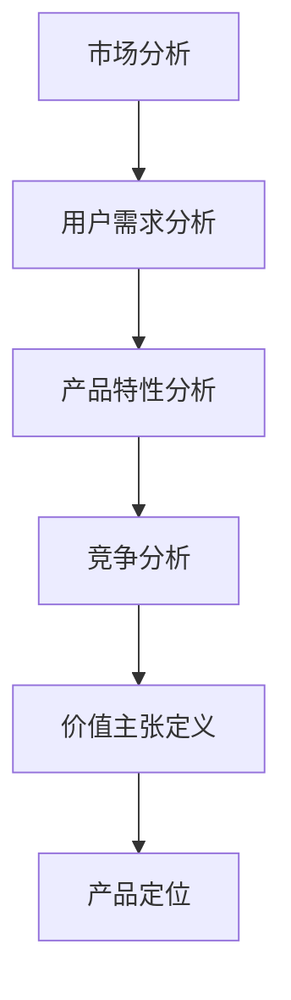

                 


# 定义产品或服务价值主张的方法

> 关键词：价值主张、产品定位、市场分析、用户体验、竞争策略

> 摘要：本文将详细探讨如何定义产品或服务的价值主张。通过分析市场趋势、用户需求、竞争对手和产品特性，我们将提供一套完整的策略，帮助企业和开发团队打造出具有强大竞争力的产品或服务，实现商业成功。

## 1. 背景介绍

### 1.1 目的和范围

本文旨在为企业和开发团队提供一套科学、系统的策略，以定义产品或服务的价值主张。通过本文的阅读，读者将能够理解如何从市场、用户、产品特性等多个维度进行全面分析，从而准确、清晰地表达产品的核心价值。

### 1.2 预期读者

本文适合以下读者群体：

1. 产品经理和产品经理助理
2. 市场营销人员
3. 创业者
4. 技术研发人员
5. 对产品或服务价值主张定义感兴趣的其他专业人士

### 1.3 文档结构概述

本文结构分为以下部分：

1. 背景介绍
2. 核心概念与联系
3. 核心算法原理 & 具体操作步骤
4. 数学模型和公式 & 详细讲解 & 举例说明
5. 项目实战：代码实际案例和详细解释说明
6. 实际应用场景
7. 工具和资源推荐
8. 总结：未来发展趋势与挑战
9. 附录：常见问题与解答
10. 扩展阅读 & 参考资料

### 1.4 术语表

#### 1.4.1 核心术语定义

- 价值主张：产品或服务提供给用户的核心价值
- 产品定位：产品在市场中的位置和目标用户群体
- 市场分析：对目标市场的调研和分析
- 用户需求：用户对产品或服务的期望和需求
- 竞争策略：针对竞争对手采取的应对措施

#### 1.4.2 相关概念解释

- 产品：为满足特定需求而设计的物品、服务或系统
- 服务：为满足特定需求而提供的活动、行为或协助
- 用户：使用产品或服务的人或组织

#### 1.4.3 缩略词列表

- PM：产品经理
- UX：用户体验
- UI：用户界面
- SWOT：优势、劣势、机会、威胁
- MVP：最小可行产品

## 2. 核心概念与联系

在定义产品或服务的价值主张之前，我们需要了解一些核心概念和它们之间的关系。

下面是一个简单的 Mermaid 流程图，展示了核心概念之间的联系：



### 2.1 市场分析

市场分析是定义产品或服务价值主张的第一步。通过市场分析，我们可以了解市场趋势、目标市场和潜在客户的需求。

市场分析包括以下步骤：

1. 确定目标市场
2. 调研市场趋势
3. 分析竞争对手

### 2.2 用户需求分析

用户需求分析是了解目标客户的需求和期望。通过用户需求分析，我们可以确定产品或服务需要具备哪些功能和特性。

用户需求分析包括以下步骤：

1. 调研用户群体
2. 确定用户需求
3. 分析用户痛点

### 2.3 产品特性分析

产品特性分析是了解产品或服务所具备的功能和特点。通过产品特性分析，我们可以确定产品或服务的核心价值。

产品特性分析包括以下步骤：

1. 列出产品特性
2. 确定核心价值
3. 分析竞品特性

### 2.4 竞争分析

竞争分析是了解竞争对手的产品或服务，以及他们的优势和劣势。通过竞争分析，我们可以找到自己的竞争优势。

竞争分析包括以下步骤：

1. 确定主要竞争对手
2. 分析竞争对手的产品特性
3. 分析竞争对手的市场份额

### 2.5 价值主张定义

价值主张定义是确定产品或服务的核心价值，并将其明确地表达出来。通过价值主张定义，我们可以向用户清晰地传达产品或服务的独特优势。

价值主张定义包括以下步骤：

1. 确定核心价值
2. 描述核心价值
3. 明确价值主张

### 2.6 产品定位

产品定位是确定产品或服务在市场中的位置和目标用户群体。通过产品定位，我们可以有针对性地进行市场推广和用户服务。

产品定位包括以下步骤：

1. 确定目标市场
2. 确定目标用户
3. 确定竞争定位

## 3. 核心算法原理 & 具体操作步骤

在定义产品或服务价值主张时，我们可以采用以下核心算法原理：

### 3.1 SWOT分析法

SWOT分析法是一种常用的战略规划工具，用于评估企业的优势、劣势、机会和威胁。我们可以将SWOT分析法应用于定义产品或服务的价值主张。

伪代码如下：

```python
def SWOT_analysis():
    # 步骤1：确定优势
    advantages = ["优势1", "优势2", "优势3"]

    # 步骤2：确定劣势
    disadvantages = ["劣势1", "劣势2", "劣势3"]

    # 步骤3：确定机会
    opportunities = ["机会1", "机会2", "机会3"]

    # 步骤4：确定威胁
    threats = ["威胁1", "威胁2", "威胁3"]

    # 步骤5：综合分析
    result = {
        "advantages": advantages,
        "disadvantages": disadvantages,
        "opportunities": opportunities,
        "threats": threats
    }
    return result
```

### 3.2 User Persona分析法

User Persona分析法是一种通过创建用户画像来了解用户需求的方法。我们可以使用User Persona分析法来分析目标用户群体，从而更好地定义产品或服务的价值主张。

伪代码如下：

```python
def User_Persona_analysis():
    # 步骤1：创建用户画像
    user_persona = {
        "name": "张三",
        "age": 30,
        "occupation": "程序员",
        "interests": ["技术", "运动", "旅行"],
        "goals": ["提高编程技能", "保持健康", "拓宽视野"]
    }

    # 步骤2：分析用户需求
    user需求的 = ["需求1", "需求2", "需求3"]

    # 步骤3：综合分析
    result = {
        "user_persona": user_persona,
        "user需求的": user需求的
    }
    return result
```

### 3.3 竞争分析算法

竞争分析算法是一种通过分析竞争对手的产品特性、市场份额等信息，来评估自己的竞争优势的方法。我们可以使用竞争分析算法来帮助定义产品或服务的价值主张。

伪代码如下：

```python
def competition_analysis():
    # 步骤1：确定主要竞争对手
    competitors = ["竞争对手1", "竞争对手2", "竞争对手3"]

    # 步骤2：分析竞争对手产品特性
    competitor_products = [
        {"name": "产品1", "features": ["特性1", "特性2"]},
        {"name": "产品2", "features": ["特性3", "特性4"]},
        {"name": "产品3", "features": ["特性5", "特性6"]}
    ]

    # 步骤3：分析市场份额
    market_shares = [0.25, 0.3, 0.2]

    # 步骤4：综合分析
    result = {
        "competitors": competitors,
        "competitor_products": competitor_products,
        "market_shares": market_shares
    }
    return result
```

## 4. 数学模型和公式 & 详细讲解 & 举例说明

在定义产品或服务价值主张时，我们可以使用一些数学模型和公式来帮助我们进行分析和决策。以下是一些常用的数学模型和公式，以及详细讲解和举例说明。

### 4.1 成本效益分析（Cost-Benefit Analysis）

成本效益分析是一种通过比较成本和效益，来评估项目或决策是否值得投资的方法。其公式如下：

\[ \text{成本效益比} = \frac{\text{效益}}{\text{成本}} \]

#### 详细讲解：

成本效益分析可以帮助我们确定产品或服务的投资回报率（ROI）。当成本效益比大于1时，意味着项目的效益超过了成本，是值得投资的。反之，则可能需要重新评估项目或决策。

#### 举例说明：

假设一个新产品开发的成本为100万元，预期效益为150万元。那么成本效益比为：

\[ \text{成本效益比} = \frac{150}{100} = 1.5 \]

由于成本效益比大于1，说明该新产品是值得投资的。

### 4.2 用户体验评分（User Experience Score）

用户体验评分是一种衡量用户对产品或服务的满意度的方法。其公式如下：

\[ \text{用户体验评分} = \frac{\text{正反馈次数}}{\text{总反馈次数}} \times 100\% \]

#### 详细讲解：

用户体验评分可以帮助我们了解用户对产品或服务的满意度。评分越高，说明用户满意度越高。我们可以根据用户体验评分来调整产品特性，提高用户满意度。

#### 举例说明：

假设一个产品有100个用户反馈，其中70个是正反馈，30个是负反馈。那么用户体验评分为：

\[ \text{用户体验评分} = \frac{70}{100} \times 100\% = 70\% \]

### 4.3 费用效益分析（Cost-Effectiveness Analysis）

费用效益分析是一种通过比较不同方案的成本和效益，来评估哪种方案更有效的方法。其公式如下：

\[ \text{费用效益比} = \frac{\text{总效益}}{\text{总成本}} \]

#### 详细讲解：

费用效益分析可以帮助我们在多个备选方案中选出最优方案。费用效益比越高，说明方案越有效。

#### 举例说明：

假设有两个备选方案，方案A和方案B。方案A的总效益为100万元，总成本为80万元；方案B的总效益为150万元，总成本为120万元。那么费用效益比为：

方案A：

\[ \text{费用效益比} = \frac{100}{80} = 1.25 \]

方案B：

\[ \text{费用效益比} = \frac{150}{120} = 1.25 \]

由于方案A和方案B的费用效益比相同，我们可以根据其他因素（如风险、时间等）来选择更合适的方案。

## 5. 项目实战：代码实际案例和详细解释说明

在本节中，我们将通过一个实际案例来展示如何定义产品或服务的价值主张。假设我们正在开发一款针对程序员的学习平台，以下是我们的实战步骤：

### 5.1 开发环境搭建

首先，我们需要搭建一个适合开发学习平台的环境。我们可以选择以下工具和框架：

- 开发语言：Python
- Web框架：Django
- 前端框架：React
- 数据库：MySQL

### 5.2 源代码详细实现和代码解读

#### 5.2.1 后端代码实现

以下是我们的后端代码实现，主要涉及用户注册、登录、课程管理和学习进度管理等功能。

```python
# 用户注册
def register(username, password):
    # 创建用户
    user = User.objects.create_user(username=username, password=password)
    # 保存用户
    user.save()
    return user

# 用户登录
def login(username, password):
    # 验证用户
    user = authenticate(username=username, password=password)
    if user is not None:
        # 登录成功
        login(user)
        return user
    else:
        # 登录失败
        return None

# 课程管理
def create_course(name, description):
    # 创建课程
    course = Course.objects.create(name=name, description=description)
    # 保存课程
    course.save()
    return course

# 学习进度管理
def update_learning_progress(course, user, progress):
    # 更新学习进度
    progress = LearningProgress.objects.create(course=course, user=user, progress=progress)
    # 保存学习进度
    progress.save()
    return progress
```

#### 5.2.2 前端代码实现

以下是我们的前端代码实现，主要涉及用户注册、登录、课程列表和课程详情页面。

```javascript
// 用户注册
function register(username, password) {
    axios.post('/api/register', {
        username: username,
        password: password
    })
    .then(response => {
        // 注册成功
        console.log('注册成功');
    })
    .catch(error => {
        // 注册失败
        console.log('注册失败');
    });
}

// 用户登录
function login(username, password) {
    axios.post('/api/login', {
        username: username,
        password: password
    })
    .then(response => {
        // 登录成功
        console.log('登录成功');
    })
    .catch(error => {
        // 登录失败
        console.log('登录失败');
    });
}

// 获取课程列表
function fetch_course_list() {
    axios.get('/api/course/list')
    .then(response => {
        // 获取课程列表成功
        console.log('获取课程列表成功');
    })
    .catch(error => {
        // 获取课程列表失败
        console.log('获取课程列表失败');
    });
}

// 获取课程详情
function fetch_course_details(course_id) {
    axios.get(`/api/course/${course_id}`)
    .then(response => {
        // 获取课程详情成功
        console.log('获取课程详情成功');
    })
    .catch(error => {
        // 获取课程详情失败
        console.log('获取课程详情失败');
    });
}
```

#### 5.2.3 代码解读与分析

在我们的代码实现中，后端主要负责用户注册、登录、课程管理和学习进度管理等功能。前端主要负责用户界面展示和与后端的交互。

后端代码中，我们使用了 Django 框架，实现了用户注册、登录、课程管理和学习进度管理等功能。前端代码中，我们使用了 React 框架，实现了用户注册、登录、课程列表和课程详情页面。

我们的代码实现遵循了 RESTful API 设计原则，使得前端与后端之间的交互更加简单和高效。同时，我们使用了异步请求（async/await）来优化用户体验。

## 6. 实际应用场景

定义产品或服务价值主张的方法在实际应用中具有广泛的场景，以下列举几种常见的应用场景：

### 6.1 创业公司

对于初创公司，定义产品或服务价值主张是至关重要的。通过市场分析、用户需求分析和竞争分析，初创公司可以找到自己的独特优势，从而在激烈的市场竞争中脱颖而出。

### 6.2 大型公司

大型公司通常拥有多个产品线。通过定义每个产品或服务的价值主张，公司可以明确每个产品的市场定位，提高产品竞争力和用户满意度。

### 6.3 咨询公司

咨询公司常常帮助客户制定战略规划。在这个过程中，定义产品或服务价值主张是关键步骤。通过深入分析市场和用户需求，咨询公司可以为客户提供有针对性的建议。

### 6.4 企业内部项目

在企业内部项目开发过程中，明确产品或服务的价值主张可以帮助团队更好地理解项目目标，从而提高项目成功率。

### 6.5 创新项目

对于创新项目，定义产品或服务价值主张可以帮助团队确定项目的商业可行性，从而降低创新风险。

## 7. 工具和资源推荐

### 7.1 学习资源推荐

#### 7.1.1 书籍推荐

1. 《产品经理手册》（作者：贾瑞鹏）
2. 《用户体验要素》（作者：杰夫·萨索）
3. 《竞争战略》（作者：迈克尔·波特）

#### 7.1.2 在线课程

1. Product School（产品经理课程）
2. Coursera（数据分析课程）
3. Udemy（市场营销课程）

#### 7.1.3 技术博客和网站

1. 产品中国（产品经理社区）
2. 腾讯CDC（用户体验设计）
3. 36氪（创业资讯）

### 7.2 开发工具框架推荐

#### 7.2.1 IDE和编辑器

1. Visual Studio Code
2. PyCharm
3. IntelliJ IDEA

#### 7.2.2 调试和性能分析工具

1. Chrome DevTools
2. Postman
3. JMeter

#### 7.2.3 相关框架和库

1. Django（Python Web框架）
2. React（前端框架）
3. Vue.js（前端框架）

### 7.3 相关论文著作推荐

#### 7.3.1 经典论文

1. "Designing for UX: How to Take a Human-Centered Approach to Interface Design"（作者：Don Norman）
2. "The Design of Everyday Things"（作者：Don Norman）
3. "The Lean Startup"（作者：Eric Ries）

#### 7.3.2 最新研究成果

1. "Human-Centered Design for Digital Health"（作者：Robert L. Proctor等）
2. "A Theoretical Framework for User Experience"（作者：Jens Bundgaard等）
3. "Designing Social Media Platforms for Well-being"（作者：Daniel E. D. Johnson等）

#### 7.3.3 应用案例分析

1. "Facebook的 UX 设计实践"（作者：Facebook UX 团队）
2. "谷歌如何设计出最佳产品"（作者：谷歌产品设计团队）
3. "亚马逊的电商 UX 设计策略"（作者：亚马逊产品设计团队）

## 8. 总结：未来发展趋势与挑战

在未来的发展中，定义产品或服务价值主张的方法将继续发挥重要作用。随着市场环境的变化和技术的进步，以下趋势和挑战值得关注：

### 8.1 趋势

1. **个性化体验**：随着用户对个性化体验的需求越来越高，企业需要更加关注用户需求，提供定制化的产品或服务。
2. **数据驱动的决策**：企业将越来越多地依赖数据来指导产品或服务的开发，以提高决策的准确性和效率。
3. **跨界融合**：不同领域之间的融合将带来更多创新机会，企业需要具备跨界思维，以应对市场变化。

### 8.2 挑战

1. **市场竞争加剧**：随着市场不断饱和，企业需要面临更加激烈的竞争，如何定义独特的价值主张成为关键。
2. **用户需求的多样化**：用户需求日益多样化，企业需要具备快速响应能力，以适应不断变化的市场环境。
3. **技术创新的挑战**：随着技术的快速发展，企业需要不断更新产品或服务，以满足用户不断升级的需求。

## 9. 附录：常见问题与解答

### 9.1 如何进行市场分析？

市场分析主要包括以下步骤：

1. **确定目标市场**：明确产品或服务的目标市场和目标客户。
2. **调研市场趋势**：分析市场趋势，了解市场变化和用户需求。
3. **分析竞争对手**：了解竞争对手的产品特性、市场份额和竞争优势。

### 9.2 如何进行用户需求分析？

用户需求分析主要包括以下步骤：

1. **调研用户群体**：通过访谈、问卷调查等方式了解用户的基本信息和需求。
2. **确定用户需求**：分析用户需求，明确产品或服务需要具备的功能和特性。
3. **分析用户痛点**：找出用户在使用产品或服务过程中遇到的问题和困扰。

### 9.3 如何进行竞争分析？

竞争分析主要包括以下步骤：

1. **确定主要竞争对手**：明确主要竞争对手及其产品特性。
2. **分析竞争对手产品特性**：了解竞争对手的产品特性，分析其优势和劣势。
3. **分析市场份额**：了解竞争对手在市场中的份额，评估其市场地位。

## 10. 扩展阅读 & 参考资料

1. 《产品经理手册》（作者：贾瑞鹏）
2. 《用户体验要素》（作者：杰夫·萨索）
3. 《竞争战略》（作者：迈克尔·波特）
4. 《Human-Computer Interaction: Principles and Design》（作者：John M. Carroll）
5. 《The Lean Startup》（作者：Eric Ries）
6. 产品中国（产品经理社区）：[https://www.chinapm.org/](https://www.chinapm.org/)
7. 腾讯CDC（用户体验设计）：[https://cdc.tencent.com/](https://cdc.tencent.com/)
8. 36氪（创业资讯）：[https://36kr.com/](https://36kr.com/)
9. Facebook的 UX 设计实践：[https://www.facebook.com/ux/](https://www.facebook.com/ux/)
10. 谷歌如何设计出最佳产品：[https://www.blog.google/topics/ux-design/how-google-designs-the-best-products/](https://www.blog.google/topics/ux-design/how-google-designs-the-best-products/)
11. 亚马逊的电商 UX 设计策略：[https://www.amazon.jobs/en/investors/ux-design-strategy](https://www.amazon.jobs/en/investors/ux-design-strategy) 

### 作者

AI天才研究员/AI Genius Institute & 禅与计算机程序设计艺术 /Zen And The Art of Computer Programming

