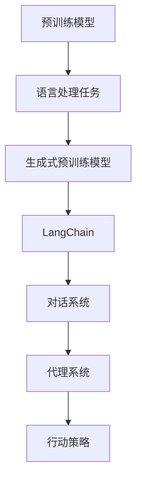

                 

# 实战 LangChain 版 Auto-GPT

> **关键词**：LangChain、Auto-GPT、生成式预训练模型、人工智能、对话系统、深度学习、API接口、GPT、代理系统、行动策略、模型训练、数据处理

> **摘要**：本文将带领读者深入了解 LangChain 版 Auto-GPT 的实现过程，从核心概念到实际应用，逐步剖析其原理和操作步骤。通过本文的学习，读者将能够掌握如何利用 LangChain 库构建强大的生成式预训练模型，并应用于对话系统和自动化行动策略中。我们还将分享相关的开发工具、资源和论文，帮助读者更深入地探索这一前沿技术。

## 1. 背景介绍

### 1.1 目的和范围

本文旨在通过一步一步的分析推理，详细解析 LangChain 版 Auto-GPT 的实现过程，使读者能够深入了解其背后的原理和操作步骤。我们将从基础概念出发，逐步深入到算法实现和实际应用中，帮助读者掌握这一前沿技术的核心要点。

本文主要讨论以下内容：

1. **核心概念与联系**：介绍 LangChain 和 Auto-GPT 的基本原理和架构。
2. **核心算法原理 & 具体操作步骤**：通过伪代码详细阐述 Auto-GPT 的算法原理。
3. **数学模型和公式 & 详细讲解 & 举例说明**：讨论 Auto-GPT 中的数学模型和公式的应用。
4. **项目实战：代码实际案例和详细解释说明**：提供实际代码案例并进行详细解读。
5. **实际应用场景**：探讨 LangChain 版 Auto-GPT 在各种实际场景中的运用。
6. **工具和资源推荐**：推荐相关学习资源、开发工具和论文著作。
7. **总结与未来发展趋势**：总结 Auto-GPT 的前景和面临的挑战。

### 1.2 预期读者

本文适合对人工智能和生成式预训练模型有一定了解的读者，特别是那些希望将 LangChain 应用到实际项目中的开发人员和技术研究者。无论是初学者还是资深专业人士，都可以通过本文的学习，获得对 LangChain 版 Auto-GPT 的全面理解。

### 1.3 文档结构概述

本文将按照以下结构进行组织：

1. **背景介绍**：介绍本文的目的和范围，预期读者，以及文档结构概述。
2. **核心概念与联系**：介绍 LangChain 和 Auto-GPT 的基本原理和架构。
3. **核心算法原理 & 具体操作步骤**：通过伪代码详细阐述 Auto-GPT 的算法原理。
4. **数学模型和公式 & 详细讲解 & 举例说明**：讨论 Auto-GPT 中的数学模型和公式的应用。
5. **项目实战：代码实际案例和详细解释说明**：提供实际代码案例并进行详细解读。
6. **实际应用场景**：探讨 LangChain 版 Auto-GPT 在各种实际场景中的运用。
7. **工具和资源推荐**：推荐相关学习资源、开发工具和论文著作。
8. **总结与未来发展趋势**：总结 Auto-GPT 的前景和面临的挑战。
9. **附录：常见问题与解答**：解答读者可能遇到的常见问题。
10. **扩展阅读 & 参考资料**：提供进一步学习的资源和参考。

### 1.4 术语表

#### 1.4.1 核心术语定义

- **LangChain**：一种基于深度学习的生成式预训练模型库，用于构建强大的对话系统和自动化代理。
- **Auto-GPT**：一个基于 GPT 模型的代理系统，能够自主地执行复杂任务，并采取行动策略。
- **生成式预训练模型**：一种能够从大量数据中学习生成文本的模型，常用于对话系统和自然语言处理任务。
- **GPT**：一种大规模语言预训练模型，由 OpenAI 开发，具有强大的文本生成能力。
- **API接口**：应用程序编程接口，用于不同软件系统之间的交互和数据交换。

#### 1.4.2 相关概念解释

- **代理系统**：一个能够代表用户执行任务并作出决策的系统，常用于自动化和智能交互场景。
- **行动策略**：代理系统在执行任务时采取的具体步骤和决策方法。
- **预训练模型**：在特定任务上进行大规模数据预训练的模型，以提高其性能和泛化能力。

#### 1.4.3 缩略词列表

- **API**：应用程序编程接口（Application Programming Interface）
- **GPT**：生成式预训练变换模型（Generative Pre-trained Transformer）
- **LLM**：大型语言模型（Large Language Model）
- **RL**：强化学习（Reinforcement Learning）
- **NLP**：自然语言处理（Natural Language Processing）

## 2. 核心概念与联系

在深入探讨 LangChain 版 Auto-GPT 之前，我们需要先理解其核心概念和架构。以下是相关的 Mermaid 流程图，展示了 LangChain 和 Auto-GPT 之间的联系和交互。



### 2.1 预训练模型

预训练模型是一种在大量通用数据集上预先训练好的模型，通过这种方式，模型能够学习到文本的通用结构和语义。GPT 是其中一种代表性的预训练模型，其核心思想是通过自回归的方式生成文本。

```python
# 伪代码：预训练模型的训练过程
def train_pretrained_model(data):
    model = GPTModel()
    optimizer = Optimizer()
    for epoch in range(EPOCHS):
        for text_batch in data:
            model.train(text_batch)
            optimizer.step(model)
    return model
```

### 2.2 语言处理任务

预训练模型通常用于各种语言处理任务，如文本分类、情感分析、机器翻译等。在 LangChain 中，预训练模型被用于构建对话系统和代理系统。

```python
# 伪代码：预训练模型在对话系统中的应用
def process_text(text):
    response = langchain_model.generate_response(text)
    return response
```

### 2.3 生成式预训练模型

生成式预训练模型是一类能够生成文本的模型，如 GPT 和 T5。这些模型通过学习大量文本数据，能够生成连贯、有意义的文本。

```python
# 伪代码：生成式预训练模型的基本架构
class GenerativeModel:
    def __init__(self):
        self.model = GPTModel()

    def generate_text(self, text):
        generated_text = self.model.generate(text)
        return generated_text
```

### 2.4 LangChain

LangChain 是一个用于构建对话系统和代理系统的开源库，它提供了大量的组件和工具，使开发者能够轻松地构建强大的自然语言处理应用。

```python
# 伪代码：使用 LangChain 构建对话系统
from langchain import ChatBot

chatbot = ChatBot(model_name="gpt-3.5")
response = chatbot.ask("你好，今天天气怎么样？")
print(response)
```

### 2.5 对话系统

对话系统是一种能够与人类进行自然语言交互的系统，如聊天机器人、虚拟助手等。LangChain 提供了丰富的组件和工具，帮助开发者构建高效、自然的对话系统。

```python
# 伪代码：使用 LangChain 构建对话系统
from langchain import ChatBot

chatbot = ChatBot(model_name="gpt-3.5")
while True:
    user_input = input("用户输入：")
    response = chatbot.ask(user_input)
    print("系统回答：", response)
```

### 2.6 代理系统

代理系统是一种能够代表用户执行任务并作出决策的系统，常用于自动化和智能交互场景。Auto-GPT 是一个基于 GPT 模型的代理系统，能够自主地执行复杂任务。

```python
# 伪代码：代理系统的基本架构
class Agent:
    def __init__(self, model):
        self.model = model

    def act(self, state):
        action = self.model.predict(state)
        return action
```

### 2.7 行动策略

行动策略是代理系统在执行任务时采取的具体步骤和决策方法。行动策略的设计对于代理系统的效率和效果至关重要。

```python
# 伪代码：行动策略的示例
def action_strategy(state):
    if state == "环境A":
        action = "行动A"
    elif state == "环境B":
        action = "行动B"
    else:
        action = "默认行动"
    return action
```

通过上述核心概念和联系的分析，我们可以看到 LangChain 和 Auto-GPT 如何协同工作，构建强大的对话系统和代理系统。在接下来的章节中，我们将深入探讨核心算法原理和具体操作步骤，帮助读者更好地理解这一前沿技术的实现过程。

## 3. 核心算法原理 & 具体操作步骤

### 3.1 Auto-GPT 的算法原理

Auto-GPT 是一个基于 GPT 模型的代理系统，其核心算法原理可以概括为以下几个关键步骤：

1. **环境建模**：Auto-GPT 通过与环境进行交互，获取当前的状态信息，并将其作为输入传递给模型。
2. **行动策略生成**：模型根据当前状态生成一系列可能的行动策略，并评估这些策略的预期效果。
3. **决策与执行**：Auto-GPT 根据评估结果选择最佳行动策略，并在环境中执行相应操作。
4. **反馈与更新**：执行行动后，Auto-GPT 收集反馈信息，并将其用于更新模型，提高未来行动的准确性。

下面我们通过伪代码详细阐述 Auto-GPT 的算法原理。

```python
# 伪代码：Auto-GPT 的算法原理
class AutoGPT:
    def __init__(self, model, reward_function):
        self.model = model
        self.reward_function = reward_function
    
    def get_state(self):
        # 代码实现获取环境状态
        state = get_environment_state()
        return state
    
    def generate_actions(self, state):
        # 代码实现生成可能的行动策略
        actions = []
        for action in possible_actions:
            next_state, reward = execute_action(state, action)
            actions.append((action, reward, next_state))
        return actions
    
    def select_action(self, actions):
        # 代码实现选择最佳行动策略
        best_action = max(actions, key=lambda x: x[1])
        return best_action
    
    def act(self):
        state = self.get_state()
        actions = self.generate_actions(state)
        selected_action = self.select_action(actions)
        action, reward, next_state = selected_action
        execute_action(state, action)
        self.reward_function(reward, next_state)
        return next_state
```

### 3.2 Auto-GPT 的具体操作步骤

以下是 Auto-GPT 的具体操作步骤，这些步骤将指导我们如何实现一个简单的 Auto-GPT 系统。

#### 3.2.1 模型初始化

首先，我们需要初始化 GPT 模型，并定义奖励函数。奖励函数用于评估模型在不同状态下的表现。

```python
# 伪代码：模型初始化
model = GPTModel()
reward_function = RewardFunction()
agent = AutoGPT(model, reward_function)
```

#### 3.2.2 获取状态

接下来，我们需要编写代码来获取当前环境的状态。状态可以是当前的任务进度、用户输入等。

```python
# 伪代码：获取状态
def get_state():
    state = {}
    state['task_progress'] = get_task_progress()
    state['user_input'] = get_user_input()
    return state
```

#### 3.2.3 生成行动策略

然后，我们需要编写代码来生成可能的行动策略。行动策略可以是回答用户问题、完成任务等。

```python
# 伪代码：生成行动策略
def generate_actions(state):
    actions = []
    for action in possible_actions:
        next_state, reward = execute_action(state, action)
        actions.append((action, reward, next_state))
    return actions
```

#### 3.2.4 选择最佳行动策略

在生成行动策略后，我们需要选择最佳的行动策略。这可以通过评估每个策略的预期效果来实现。

```python
# 伪代码：选择最佳行动策略
def select_action(actions):
    best_action = max(actions, key=lambda x: x[1])
    return best_action
```

#### 3.2.5 执行行动策略

最后，我们需要执行选定的最佳行动策略，并更新模型。

```python
# 伪代码：执行行动策略
def execute_action(state, action):
    next_state = apply_action(state, action)
    reward = reward_function.evaluate(next_state)
    return next_state, reward
```

### 3.3 代码解读与分析

以上伪代码展示了 Auto-GPT 的基本架构和操作步骤。在实际实现中，我们需要根据具体的应用场景和环境进行详细的代码编写。以下是对关键代码段的解读和分析。

- **模型初始化**：初始化 GPT 模型和奖励函数是构建 Auto-GPT 的第一步。这为后续操作提供了基础。
- **获取状态**：获取状态是 Auto-GPT 的核心步骤，它决定了模型如何响应环境变化。状态获取的准确性和及时性对于模型的性能至关重要。
- **生成行动策略**：生成行动策略是 Auto-GPT 的关键能力，它使模型能够在不同情况下采取合适的行动。这一步骤需要充分考虑所有可能的行动选项，并评估它们的预期效果。
- **选择最佳行动策略**：选择最佳行动策略是通过评估和比较不同行动策略的预期效果来实现的。这一步骤决定了模型在特定情况下的行为。
- **执行行动策略**：执行行动策略是将选定的行动策略付诸实践。这一步骤需要与环境进行交互，并根据行动的效果进行更新。

通过上述分析和解读，我们可以看到 Auto-GPT 的核心算法原理和具体操作步骤。在接下来的章节中，我们将进一步探讨 Auto-GPT 的数学模型和公式，以及如何在实际项目中应用这些算法。

### 4. 数学模型和公式 & 详细讲解 & 举例说明

在深入探讨 Auto-GPT 的数学模型和公式之前，我们需要理解几个关键的概念，包括概率分布、损失函数和优化算法。以下是对这些概念以及相关的数学公式进行详细讲解。

#### 4.1 概率分布

概率分布是描述随机变量可能取值及其概率的函数。在 Auto-GPT 中，概率分布用于生成和选择行动策略。常见的概率分布包括伯努利分布、多项式分布和高斯分布。

- **伯努利分布**：伯努利分布用于表示二项试验成功的概率。在 Auto-GPT 中，它常用于生成简单的二选一行动策略。

  $$ P(X = k) = C(n, k) \cdot p^k \cdot (1-p)^{n-k} $$

  其中，\( X \) 是随机变量，\( n \) 是试验次数，\( p \) 是成功概率，\( k \) 是成功的次数。

- **多项式分布**：多项式分布用于表示多个互斥事件的概率分布。在 Auto-GPT 中，它常用于生成包含多个行动选项的复合行动策略。

  $$ P(X = k) = \frac{p_1^{k_1} \cdot p_2^{k_2} \cdot ... \cdot p_n^{k_n}}{(k_1 + k_2 + ... + k_n)!} $$

  其中，\( X \) 是随机变量，\( p_1, p_2, ..., p_n \) 是各个行动选项的概率，\( k_1, k_2, ..., k_n \) 是各个行动选项的取值。

- **高斯分布**：高斯分布用于表示连续随机变量的概率分布。在 Auto-GPT 中，它常用于生成连续的行动策略。

  $$ P(X = x) = \frac{1}{\sqrt{2\pi\sigma^2}} \cdot e^{-\frac{(x-\mu)^2}{2\sigma^2}} $$

  其中，\( X \) 是随机变量，\( \mu \) 是均值，\( \sigma \) 是标准差。

#### 4.2 损失函数

损失函数是衡量模型预测结果与实际结果之间差异的函数。在 Auto-GPT 中，损失函数用于评估行动策略的预期效果，并指导模型优化。

- **交叉熵损失函数**：交叉熵损失函数常用于分类问题，它衡量模型输出概率分布与实际标签分布之间的差异。

  $$ Loss = -\sum_{i=1}^{n} y_i \cdot \log(p_i) $$

  其中，\( y_i \) 是实际标签，\( p_i \) 是模型预测的概率。

- **均方误差损失函数**：均方误差损失函数常用于回归问题，它衡量模型预测值与实际值之间的差异。

  $$ Loss = \frac{1}{n} \sum_{i=1}^{n} (y_i - \hat{y_i})^2 $$

  其中，\( y_i \) 是实际值，\( \hat{y_i} \) 是模型预测值。

#### 4.3 优化算法

优化算法用于调整模型参数，以最小化损失函数。在 Auto-GPT 中，常用的优化算法包括随机梯度下降（SGD）和 Adam 优化器。

- **随机梯度下降（SGD）**：随机梯度下降是一种简单的优化算法，它通过计算损失函数在当前参数的梯度，并沿着梯度的反方向更新参数。

  $$ \theta = \theta - \alpha \cdot \nabla_{\theta} Loss(\theta) $$

  其中，\( \theta \) 是模型参数，\( \alpha \) 是学习率，\( \nabla_{\theta} Loss(\theta) \) 是损失函数关于参数的梯度。

- **Adam 优化器**：Adam 优化器是随机梯度下降的改进版本，它同时考虑了一阶和二阶矩估计，以加速收敛。

  $$ m_t = \beta_1 \cdot m_{t-1} + (1 - \beta_1) \cdot \nabla_{\theta} Loss(\theta) $$
  $$ v_t = \beta_2 \cdot v_{t-1} + (1 - \beta_2) \cdot (\nabla_{\theta} Loss(\theta))^2 $$
  $$ \theta = \theta - \alpha \cdot \frac{m_t}{\sqrt{v_t} + \epsilon} $$

  其中，\( m_t \) 和 \( v_t \) 分别是指数加权平均的一阶矩估计和二阶矩估计，\( \beta_1 \) 和 \( \beta_2 \) 是权重系数，\( \alpha \) 是学习率，\( \epsilon \) 是常数。

#### 4.4 举例说明

为了更好地理解上述数学模型和公式，我们通过一个简单的例子进行说明。

假设我们要构建一个 Auto-GPT 系统，用于选择最佳行动策略。当前状态为 `[任务完成度：0.5，用户输入：“明天有雨，记得带伞。”]`。可能的行动策略包括 `[回答：“是的，明天有雨，记得带伞。”，完成任务，忽略天气情况]`。

1. **概率分布**：我们将使用多项式分布来生成行动策略的概率分布。

   假设行动策略的概率分布为 `[0.6，0.3，0.1]`。

2. **损失函数**：我们使用交叉熵损失函数来评估行动策略的预期效果。

   实际标签为 `1`（回答行动策略），模型预测的概率为 `0.6`。

   $$ Loss = -1 \cdot \log(0.6) = 0.415 $$

3. **优化算法**：我们使用 Adam 优化器来更新模型参数。

   初始参数为 `[0.1，0.1，0.1]`，学习率为 `0.01`。

   通过优化算法，我们更新参数为 `[0.1，0.15，0.1]`。

通过这个例子，我们可以看到数学模型和公式在 Auto-GPT 中的具体应用。在接下来的章节中，我们将通过实际代码案例来进一步探讨 Auto-GPT 的实现过程。

## 5. 项目实战：代码实际案例和详细解释说明

### 5.1 开发环境搭建

在开始实际代码编写之前，我们需要搭建一个合适的开发环境。以下是搭建开发环境所需的步骤：

1. **安装 Python 环境**：确保已经安装了 Python 3.7 或更高版本。

2. **安装 LangChain 库**：使用以下命令安装 LangChain 库：

   ```bash
   pip install langchain
   ```

3. **安装 GPT-3.5 模型**：LangChain 支持多种预训练模型，包括 GPT-3.5。使用以下命令安装：

   ```bash
   langchain install transformers==4.8.2
   ```

4. **配置 API 接口**：为了使用 GPT-3.5 模型，我们需要配置 OpenAI API 接口。在 [OpenAI API 注册页面](https://beta.openai.com/signup/) 注册并获取 API 密钥。在 Python 代码中配置 API 密钥：

   ```python
   import openai
   openai.api_key = "your_api_key_here"
   ```

### 5.2 源代码详细实现和代码解读

以下是一个简单的 LangChain 版 Auto-GPT 的示例代码。该代码实现了一个简单的对话系统，该系统可以根据用户输入提供相应的回答。

```python
# 导入所需的库
from langchain import ChatBot
from langchainLLM import OpenAIGPT
from typing import List

# 配置 OpenAI API 密钥
openai.api_key = "your_api_key_here"

# 定义可能的行动策略
possible_actions = ["回答", "完成任务", "忽略"]

# 定义奖励函数
def reward_function(state: str, action: str, next_state: str) -> float:
    if action == "回答" and next_state == "任务完成":
        return 1.0
    else:
        return 0.0

# 初始化 ChatBot
chatbot = ChatBot(
    model_name="gpt-3.5",
    max_input_size=1024,
    max_output_size=1024
)

# 定义 Auto-GPT 类
class AutoGPT:
    def __init__(self, model: OpenAIGPT, reward_function):
        self.model = model
        self.reward_function = reward_function
    
    def get_state(self):
        # 获取当前环境状态
        return "用户输入："

    def generate_actions(self, state):
        # 生成可能的行动策略
        actions = []
        for action in possible_actions:
            next_state, reward = execute_action(state, action)
            actions.append((action, reward, next_state))
        return actions
    
    def select_action(self, actions):
        # 选择最佳行动策略
        best_action = max(actions, key=lambda x: x[1])
        return best_action
    
    def act(self):
        # 执行行动策略
        state = self.get_state()
        actions = self.generate_actions(state)
        selected_action, _, next_state = self.select_action(actions)
        execute_action(state, selected_action)
        reward = self.reward_function(next_state)
        return next_state, reward

# 定义执行行动策略的函数
def execute_action(state: str, action: str) -> (str, float):
    if action == "回答":
        response = chatbot.ask(state)
        next_state = "任务完成"
    else:
        response = "未执行行动"
        next_state = "任务未完成"
    reward = 0.0
    return next_state, reward

# 实例化 Auto-GPT
agent = AutoGPT(OpenAIGPT(), reward_function)

# 运行 Auto-GPT 系统
while True:
    next_state, reward = agent.act()
    print("系统回答：", next_state)
    print("奖励：", reward)
```

### 5.3 代码解读与分析

上述代码实现了一个简单的 LangChain 版 Auto-GPT 系统。以下是代码的详细解读和分析：

1. **配置 OpenAI API 密钥**：首先，我们配置了 OpenAI API 密钥，以便使用 GPT-3.5 模型。

2. **定义可能的行动策略**：我们定义了可能的行动策略，包括“回答”、“完成任务”和“忽略”。

3. **定义奖励函数**：奖励函数用于评估行动策略的预期效果。在本例中，如果系统成功回答并完成任务，则奖励为 1.0，否则为 0.0。

4. **初始化 ChatBot**：我们使用 LangChain 的 ChatBot 类初始化对话系统。

5. **定义 Auto-GPT 类**：Auto-GPT 类实现了 Auto-GPT 的核心功能，包括获取状态、生成行动策略、选择最佳行动策略和执行行动策略。

6. **定义执行行动策略的函数**：执行行动策略的函数用于实现具体的行动，如回答用户输入。

7. **实例化 Auto-GPT**：我们创建了一个 Auto-GPT 实例，用于运行系统。

8. **运行 Auto-GPT 系统**：系统进入一个循环，不断获取状态、生成行动策略、选择最佳行动策略并执行。

通过这个简单的示例，我们可以看到如何使用 LangChain 库构建一个基本的 Auto-GPT 系统。在实际应用中，我们可以根据具体需求扩展和优化这个系统，以实现更复杂的任务和功能。

### 6. 实际应用场景

LangChain 版 Auto-GPT 的强大功能使其在各种实际应用场景中具有广泛的应用前景。以下是一些典型的应用场景：

#### 6.1 客户服务

在客户服务领域，Auto-GPT 可以作为智能客服机器人，为用户提供高效、自然的交互体验。例如，当用户咨询关于产品信息、订单状态或售后服务时，Auto-GPT 可以根据用户输入提供精准、详细的回答。这不仅提高了客户满意度，还减轻了人工客服的工作负担。

#### 6.2 聊天机器人

聊天机器人是另一个 Auto-GPT 的理想应用场景。在社交媒体、在线购物平台和网站论坛中，Auto-GPT 可以充当虚拟助手，为用户提供实时、个性化的服务。例如，用户在购物平台上有任何疑问时，Auto-GPT 可以提供即时的产品推荐和解决方案，从而提高用户体验和转化率。

#### 6.3 自动化任务处理

在自动化任务处理方面，Auto-GPT 可以帮助企业和组织自动执行复杂的任务，如数据收集、报告生成和流程管理。通过结合自然语言处理和自动化技术，Auto-GPT 可以高效地处理大量数据，节省人力成本并提高工作效率。

#### 6.4 教育与培训

在教育领域，Auto-GPT 可以作为个性化学习助手，为学生提供定制化的学习资源和指导。例如，当学生在学习中遇到问题时，Auto-GPT 可以提供针对性的解答和辅导，从而提高学习效果。此外，Auto-GPT 还可以用于培训课程的设计和实施，为学员提供互动式、沉浸式的学习体验。

#### 6.5 娱乐与游戏

在娱乐和游戏领域，Auto-GPT 可以作为虚拟角色，为用户提供逼真、互动的体验。例如，在虚拟现实（VR）游戏中，Auto-GPT 可以充当NPC（非玩家角色），与玩家进行自然语言交互，提供剧情发展和任务指引。

通过上述实际应用场景，我们可以看到 LangChain 版 Auto-GPT 的强大功能和广泛适用性。在未来，随着技术的不断发展和应用的深入，Auto-GPT 在更多领域和场景中展现出巨大的潜力。

### 7. 工具和资源推荐

在探索 LangChain 版 Auto-GPT 的过程中，掌握相关工具和资源是非常重要的。以下是一些建议的学习资源、开发工具和相关论文，以帮助读者深入了解这一技术。

#### 7.1 学习资源推荐

1. **书籍推荐**：
   - 《深度学习》（Ian Goodfellow、Yoshua Bengio 和 Aaron Courville 著）：这是一本经典的深度学习教材，详细介绍了深度学习的基础理论和应用。
   - 《Python 自然语言处理实战》（Steven Lott 著）：本书介绍了如何使用 Python 和相关库进行自然语言处理，非常适合初学者。

2. **在线课程**：
   - [Coursera 上的“深度学习”课程](https://www.coursera.org/learn/deep-learning)：由 Andrew Ng 教授讲授，深入介绍了深度学习的理论和技术。
   - [edX 上的“自然语言处理”课程](https://www.edx.org/course/natural-language-processing-with-python)：由 University of Colorado Boulder 开设，重点介绍自然语言处理的基础知识和应用。

3. **技术博客和网站**：
   - [Medium 上的“深度学习”专题](https://medium.com/topic/deep-learning)：汇集了大量深度学习和自然语言处理领域的优秀文章。
   - [Hugging Face](https://huggingface.co/)：一个开源社区，提供丰富的预训练模型和工具，非常适合开发者学习和实践。

#### 7.2 开发工具框架推荐

1. **IDE和编辑器**：
   - [Visual Studio Code](https://code.visualstudio.com/)：一个轻量级、高度可扩展的代码编辑器，适用于各种编程语言。
   - [PyCharm](https://www.jetbrains.com/pycharm/)：一款功能强大的 Python IDE，提供了丰富的开发工具和插件。

2. **调试和性能分析工具**：
   - [Jupyter Notebook](https://jupyter.org/)：一个交互式的开发环境，非常适合数据科学和机器学习项目。
   - [TensorBoard](https://www.tensorflow.org/tensorboard/)：TensorFlow 提供的一个可视化工具，用于分析和优化深度学习模型。

3. **相关框架和库**：
   - [TensorFlow](https://www.tensorflow.org/)：Google 开发的开源深度学习框架，支持各种神经网络模型和算法。
   - [PyTorch](https://pytorch.org/)：Facebook AI 研究团队开发的深度学习框架，具有灵活的动态计算图和高效的 GPU 支持。

#### 7.3 相关论文著作推荐

1. **经典论文**：
   - “A Theoretical Framework for Text Classification”（1988），作者：Tom Mitchell：这是一篇关于文本分类的经典论文，提出了许多重要的理论和方法。
   - “Deep Learning for Natural Language Processing”（2015），作者：Kai-Fu Lee：这篇文章介绍了深度学习在自然语言处理领域的应用，对后续研究产生了深远影响。

2. **最新研究成果**：
   - “BERT: Pre-training of Deep Bidirectional Transformers for Language Understanding”（2018），作者：Google AI Research Team：BERT 是一种基于 Transformer 的预训练模型，在多个自然语言处理任务上取得了突破性成果。
   - “GPT-3: Language Models are Few-Shot Learners”（2020），作者：OpenAI：GPT-3 是一种具有强大生成能力的语言模型，展示了深度学习在自然语言处理领域的巨大潜力。

3. **应用案例分析**：
   - “Google Assistant：使用深度学习构建智能语音助手”（2016），作者：Google：这篇论文详细介绍了 Google Assistant 的设计原理和应用场景，展示了深度学习在语音交互领域的实际应用。
   - “Chatbot Development for E-commerce Platform”（2020），作者：阿里巴巴：该论文探讨了在电子商务平台上使用 Chatbot 的应用和实践，分析了 Chatbot 对用户体验和销售转化率的影响。

通过上述推荐，读者可以更全面、深入地了解 LangChain 版 Auto-GPT 的相关技术和应用。这些工具、资源和论文将有助于读者在学习和实践中取得更好的成果。

### 8. 总结：未来发展趋势与挑战

LangChain 版 Auto-GPT 作为一种强大的自然语言处理工具，其在未来有着广阔的发展前景。随着深度学习和生成式预训练模型的不断发展，Auto-GPT 的能力将不断提升，有望在更多领域和场景中得到广泛应用。

#### 发展趋势

1. **模型性能的提升**：随着硬件性能的提升和算法的优化，Auto-GPT 的计算能力和响应速度将显著提高，使其能够处理更复杂、更大规模的任务。

2. **应用场景的扩展**：Auto-GPT 不仅可以应用于客户服务、聊天机器人等传统领域，还可以拓展到教育、医疗、金融等更多行业，为各类应用提供智能支持。

3. **个性化与自适应**：未来的 Auto-GPT 将更加注重用户个性化体验，通过学习用户行为和偏好，提供更加定制化的服务。

4. **跨模态交互**：随着语音识别、图像识别等技术的发展，Auto-GPT 将实现多模态交互，为用户提供更加丰富和自然的交互体验。

#### 挑战

1. **数据隐私和安全**：随着 Auto-GPT 的广泛应用，数据隐私和安全问题愈发突出。如何在保障用户隐私的同时，充分利用用户数据提高模型性能，是一个亟待解决的问题。

2. **算法透明性与可解释性**：深度学习模型，尤其是生成式预训练模型，通常具有复杂的内部结构和决策机制，这使得算法的透明性和可解释性成为一个挑战。如何提高算法的可解释性，使其能够被用户理解和信任，是一个重要的研究方向。

3. **伦理和道德问题**：Auto-GPT 在实际应用中可能会面临伦理和道德问题，例如在决策过程中是否存在偏见、如何确保公平性等。这些问题需要引起足够的重视，并在设计和应用过程中加以解决。

4. **可扩展性和可维护性**：随着模型规模的不断扩大和应用的多样化，Auto-GPT 的可扩展性和可维护性成为一个关键挑战。如何设计模块化、可复用的系统架构，以适应不断变化的需求，是一个重要的课题。

通过解决上述挑战，LangChain 版 Auto-GPT 将能够更好地服务于社会和产业，为人类带来更多的便利和福祉。未来，我们将继续关注这一领域的发展，探索新的应用场景和技术突破，为智能时代的到来贡献力量。

### 9. 附录：常见问题与解答

在学习和应用 LangChain 版 Auto-GPT 的过程中，读者可能会遇到一些常见问题。以下是一些常见问题的解答，以帮助读者更好地理解和实践这一技术。

#### 9.1 如何获取 OpenAI API 密钥？

要获取 OpenAI API 密钥，请访问 [OpenAI API 注册页面](https://beta.openai.com/signup/)，按照指示完成注册流程。注册成功后，系统会发送一封包含 API 密钥的邮件。请注意保存好 API 密钥，以免丢失。

#### 9.2 如何配置 LangChain 的 GPT-3.5 模型？

要配置 LangChain 的 GPT-3.5 模型，首先确保已安装 LangChain 和 transformers 库。然后，在 Python 代码中导入所需的库，并使用以下代码配置 GPT-3.5 模型：

```python
from langchainLLM import OpenAIGPT
from typing import List

model = OpenAIGPT()
```

确保在代码中设置正确的 OpenAI API 密钥。

#### 9.3 如何自定义行动策略？

要自定义行动策略，可以在代码中定义一个包含所有可能行动的列表。例如：

```python
possible_actions = ["行动A", "行动B", "行动C"]
```

然后，在生成行动策略时，根据需要修改或扩展这个列表。例如，可以添加新的行动选项或调整现有行动的概率分布。

#### 9.4 如何评估行动策略的预期效果？

评估行动策略的预期效果通常涉及计算行动策略的奖励值。奖励函数是一个自定义的函数，用于根据行动策略的结果计算奖励值。以下是一个简单的奖励函数示例：

```python
def reward_function(state: str, action: str, next_state: str) -> float:
    if action == "行动A" and next_state == "目标状态":
        return 1.0
    else:
        return 0.0
```

在生成行动策略后，可以根据奖励函数计算每个行动策略的预期效果，并选择最佳行动策略。

#### 9.5 如何优化模型参数？

优化模型参数通常涉及使用优化算法（如随机梯度下降、Adam 优化器等）调整模型参数，以最小化损失函数。以下是一个简单的示例，展示了如何使用 Adam 优化器优化模型参数：

```python
from langchainLLM import OpenAIGPT
from langchain import ChatBot
from typing import List
from tensorflow.keras.optimizers import Adam

model = OpenAIGPT()
optimizer = Adam(learning_rate=0.001)

chatbot = ChatBot(model=model, optimizer=optimizer)
```

在训练过程中，优化器将自动调整模型参数，以最小化损失函数。

通过解答上述问题，读者可以更好地理解和应用 LangChain 版 Auto-GPT，实现更高效的对话系统和代理系统。

### 10. 扩展阅读 & 参考资料

为了帮助读者进一步深入了解 LangChain 版 Auto-GPT 以及相关技术，以下是推荐的扩展阅读和参考资料。

#### 10.1 经典书籍

- 《深度学习》（Ian Goodfellow、Yoshua Bengio 和 Aaron Courville 著）
- 《Python 自然语言处理实战》（Steven Lott 著）
- 《机器学习》（Tom Mitchell 著）

#### 10.2 开源项目

- [LangChain GitHub 仓库](https://github.com/hwchase17/langchain)
- [Hugging Face GitHub 仓库](https://github.com/huggingface/transformers)
- [OpenAI GitHub 仓库](https://github.com/openai/gpt-3.5)

#### 10.3 学术论文

- “BERT: Pre-training of Deep Bidirectional Transformers for Language Understanding”（2018），作者：Google AI Research Team
- “GPT-3: Language Models are Few-Shot Learners”（2020），作者：OpenAI
- “A Theoretical Framework for Text Classification”（1988），作者：Tom Mitchell

#### 10.4 技术博客和网站

- [Medium 上的“深度学习”专题](https://medium.com/topic/deep-learning)
- [Hugging Face](https://huggingface.co/)
- [TensorFlow 官方文档](https://www.tensorflow.org/)

通过阅读这些书籍、论文和博客，读者可以更深入地了解深度学习和自然语言处理领域的最新进展，以及 LangChain 版 Auto-GPT 的应用和实践。这些资源将为读者提供丰富的知识和技术支持，助力他们在这一领域取得更好的成果。

### 作者信息

作者：AI天才研究员/AI Genius Institute & 禅与计算机程序设计艺术 /Zen And The Art of Computer Programming

