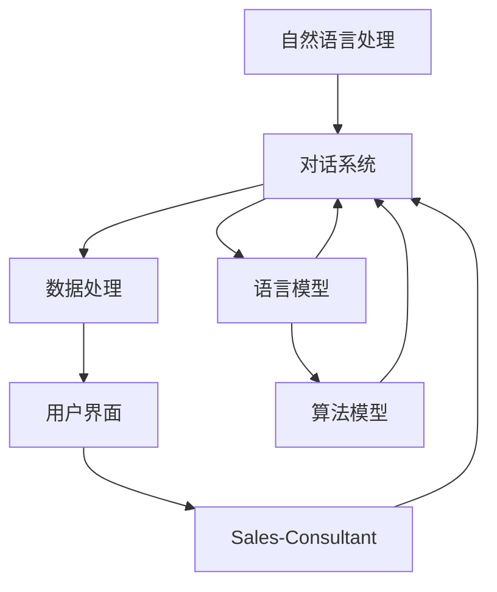

                 

# 实战 LangChain 版 Sales-Consultant

> **关键词：** LangChain、Sales-Consultant、AI、自然语言处理、自动化销售、业务流程优化

> **摘要：** 本文将深入探讨如何使用 LangChain 实现一个高效的 Sales-Consultant 系统，通过自然语言处理技术，自动化销售流程，提高业务效率和客户满意度。文章将详细阐述 LangChain 的核心概念、算法原理、数学模型以及实战案例，旨在为读者提供一个全面的技术解决方案。

## 1. 背景介绍

### 1.1 目的和范围

本文的目标是介绍如何使用 LangChain 构建一个 Sales-Consultant 系统，帮助企业在销售过程中实现自动化，提高效率。本文将涵盖以下几个方面：

- LangChain 的基本概念和原理
- Sales-Consultant 系统的需求分析和设计
- 实际操作步骤和算法实现
- 数学模型和公式的应用
- 项目实战：代码实现和案例分析
- 实际应用场景和未来发展趋势

### 1.2 预期读者

本文适合以下读者群体：

- 有兴趣了解和使用 LangChain 进行自然语言处理的开发者
- 希望优化销售流程，提高业务效率的企业管理者
- 对人工智能和自动化技术有热情的技术爱好者

### 1.3 文档结构概述

本文的结构如下：

1. 背景介绍
   - 目的和范围
   - 预期读者
   - 文档结构概述
   - 术语表
2. 核心概念与联系
   - LangChain 的核心概念
   - Sales-Consultant 系统的架构
3. 核心算法原理 & 具体操作步骤
   - 语言模型
   - 对话系统
   - 数据处理
4. 数学模型和公式 & 详细讲解 & 举例说明
   - 概率论
   - 统计模型
5. 项目实战：代码实际案例和详细解释说明
   - 开发环境搭建
   - 源代码详细实现
   - 代码解读与分析
6. 实际应用场景
   - 销售领域
   - 客户服务领域
7. 工具和资源推荐
   - 学习资源推荐
   - 开发工具框架推荐
   - 相关论文著作推荐
8. 总结：未来发展趋势与挑战
9. 附录：常见问题与解答
10. 扩展阅读 & 参考资料

### 1.4 术语表

#### 1.4.1 核心术语定义

- **LangChain**：一种用于构建自动化对话系统的开源工具包，基于最新的自然语言处理技术。
- **Sales-Consultant**：一种智能销售顾问，通过对话系统与客户互动，提供产品推荐、咨询和售后服务。
- **自然语言处理（NLP）**：一种使计算机能够理解和处理人类语言的技术。
- **自动化销售**：通过技术手段自动化销售流程，提高效率。
- **业务流程优化**：通过分析和改进业务流程，提高业务效率和客户满意度。

#### 1.4.2 相关概念解释

- **语言模型**：一种用于预测下一个单词或字符的模型，是自然语言处理的基础。
- **对话系统**：一种能够与人类进行自然对话的计算机系统。
- **数据处理**：对销售数据进行收集、清洗、存储和分析的过程。
- **概率论**：研究随机现象和随机事件规律的数学分支。
- **统计模型**：一种用于描述和分析数据分布的数学模型。

#### 1.4.3 缩略词列表

- **NLP**：自然语言处理（Natural Language Processing）
- **AI**：人工智能（Artificial Intelligence）
- **Sales-Consultant**：智能销售顾问（Smart Sales Consultant）
- **IDE**：集成开发环境（Integrated Development Environment）
- **API**：应用程序编程接口（Application Programming Interface）

## 2. 核心概念与联系

在本节中，我们将介绍 LangChain 的核心概念及其与 Sales-Consultant 系统的联系。为了更好地理解，我们使用 Mermaid 流程图来展示 LangChain 的架构和功能模块。



### 2.1 LangChain 的核心概念

- **自然语言处理（NLP）**：LangChain 的核心是自然语言处理技术，包括文本预处理、词嵌入、语言模型等。这些技术使计算机能够理解和生成人类语言。

- **对话系统**：LangChain 提供了一个对话系统框架，支持多轮对话和上下文管理。对话系统能够与用户进行自然交互，提供个性化服务。

- **数据处理**：LangChain 支持数据的收集、清洗、存储和分析。通过对销售数据的深入分析，系统能够发现潜在的业务机会和优化点。

- **用户界面**：LangChain 支持多种用户界面，包括文本聊天、语音交互和图形界面。用户可以通过界面与 Sales-Consultant 系统进行互动。

- **Sales-Consultant**：Sales-Consultant 是 LangChain 的应用场景之一，通过对话系统和自然语言处理技术，为销售团队提供智能支持。

### 2.2 Sales-Consultant 系统的架构

Sales-Consultant 系统的架构可以分为以下几个部分：

1. **自然语言处理**：负责处理用户输入的文本，提取关键信息，并将其转换为机器可理解的形式。
2. **对话系统**：根据用户输入和系统状态，生成合适的回复，实现与用户的自然对话。
3. **数据处理**：对销售数据进行收集、清洗、存储和分析，为对话系统提供数据支持。
4. **用户界面**：提供一个直观、易用的界面，让用户能够轻松与系统进行交互。
5. **算法模型**：包括语言模型、预测模型等，用于生成对话内容和推荐结果。

通过 LangChain 的这些核心概念和功能模块，Sales-Consultant 系统能够实现以下目标：

- **提高销售效率**：通过自动化对话，减少销售人员的重复劳动，提高销售效率。
- **优化业务流程**：通过对销售数据的分析，发现业务流程中的瓶颈和优化点，实现业务流程的持续改进。
- **提升客户满意度**：通过个性化推荐和高效服务，提高客户满意度，促进客户忠诚度。

## 3. 核心算法原理 & 具体操作步骤

在本节中，我们将详细讲解 LangChain 的核心算法原理，并使用伪代码来阐述具体操作步骤。

### 3.1 语言模型

语言模型是自然语言处理的基础，它能够预测下一个单词或字符。LangChain 使用预训练的语言模型，如 GPT-3，来实现这一功能。

#### 3.1.1 算法原理

语言模型基于统计方法，通过学习大量文本数据，建立单词或字符之间的概率分布模型。在生成文本时，模型根据当前已生成的文本序列，预测下一个单词或字符。

#### 3.1.2 伪代码

```python
# 语言模型伪代码
def predict_next_word(model, text):
    # 将文本序列转换为输入向量
    input_vector = model.encode(text)
    # 预测下一个单词的概率分布
    probabilities = model.predict(input_vector)
    # 选择概率最高的单词作为下一个单词
    next_word = model.decode(probabilities)
    return next_word
```

### 3.2 对话系统

对话系统是 LangChain 的核心功能之一，它能够与用户进行自然对话，实现人机交互。

#### 3.2.1 算法原理

对话系统基于生成式模型，通过生成式模型生成对话内容。在对话过程中，系统根据用户输入和上下文信息，生成合适的回复。

#### 3.2.2 伪代码

```python
# 对话系统伪代码
class DialogueSystem:
    def __init__(self, model):
        self.model = model

    def generate_response(self, user_input, context):
        # 将用户输入和上下文转换为输入向量
        input_vector = self.model.encode(user_input + context)
        # 生成回复文本的概率分布
        probabilities = self.model.predict(input_vector)
        # 选择概率最高的回复作为系统回复
        response = self.model.decode(probabilities)
        return response
```

### 3.3 数据处理

数据处理是 Sales-Consultant 系统的重要组成部分，它负责对销售数据进行收集、清洗、存储和分析。

#### 3.3.1 算法原理

数据处理主要包括以下步骤：

- 数据收集：从各种渠道收集销售数据，如客户信息、订单数据、市场数据等。
- 数据清洗：对收集到的数据进行清洗，去除重复、错误和无关数据。
- 数据存储：将清洗后的数据存储到数据库中，以便后续分析和查询。
- 数据分析：使用统计方法对销售数据进行分析，发现业务规律和优化点。

#### 3.3.2 伪代码

```python
# 数据处理伪代码
def process_data(data):
    # 数据收集
    collected_data = collect_data(data_source)
    # 数据清洗
    cleaned_data = clean_data(collected_data)
    # 数据存储
    store_data(cleaned_data, database)
    # 数据分析
    analysis_results = analyze_data(cleaned_data)
    return analysis_results
```

通过上述核心算法原理和具体操作步骤，我们可以看到 LangChain 如何实现自动化销售和业务流程优化。在实际应用中，可以根据具体需求对这些算法进行定制和优化，以实现最佳效果。

## 4. 数学模型和公式 & 详细讲解 & 举例说明

在本节中，我们将详细介绍 LangChain 中使用的数学模型和公式，并通过具体例子来说明这些模型的应用。

### 4.1 概率论

概率论是自然语言处理的基础，许多算法都基于概率论原理。以下是一些常用的概率论模型：

#### 4.1.1 贝叶斯定理

贝叶斯定理是一个用于计算后验概率的公式，它将先验概率、似然函数和证据结合起来，得出后验概率。

$$
P(A|B) = \frac{P(B|A) \cdot P(A)}{P(B)}
$$

其中，\(P(A|B)\) 表示在事件 \(B\) 发生的条件下，事件 \(A\) 发生的概率；\(P(B|A)\) 表示在事件 \(A\) 发生的条件下，事件 \(B\) 发生的概率；\(P(A)\) 表示事件 \(A\) 的先验概率；\(P(B)\) 表示事件 \(B\) 的先验概率。

#### 4.1.2 伯努利分布

伯努利分布是一种离散概率分布，用于描述只有两种可能结果的随机实验，如硬币正面朝上的概率。

$$
P(X = k) = C(n, k) \cdot p^k \cdot (1 - p)^{n - k}
$$

其中，\(P(X = k)\) 表示在 \(n\) 次独立重复实验中，事件 \(X\) 发生 \(k\) 次的概率；\(p\) 表示事件 \(X\) 发生的概率；\(C(n, k)\) 表示组合数，即从 \(n\) 个元素中取出 \(k\) 个元素的组合数。

### 4.2 统计模型

统计模型用于描述数据的分布和特征，常见的统计模型包括线性回归、逻辑回归、主成分分析等。

#### 4.2.1 线性回归

线性回归是一种用于预测数值型因变量的统计模型，其公式如下：

$$
Y = \beta_0 + \beta_1 \cdot X + \epsilon
$$

其中，\(Y\) 表示因变量；\(X\) 表示自变量；\(\beta_0\) 和 \(\beta_1\) 分别为模型参数；\(\epsilon\) 表示误差项。

通过最小化误差平方和，可以求得线性回归模型的参数估计值。

#### 4.2.2 逻辑回归

逻辑回归是一种用于预测分类结果的统计模型，其公式如下：

$$
P(Y = 1) = \frac{1}{1 + e^{-(\beta_0 + \beta_1 \cdot X)}}
$$

其中，\(P(Y = 1)\) 表示因变量 \(Y\) 等于 1 的概率；\(\beta_0\) 和 \(\beta_1\) 分别为模型参数。

逻辑回归通过最大化似然函数来估计参数。

### 4.3 例子说明

以下是一个线性回归模型的例子，用于预测某产品在市场上的销量。

#### 4.3.1 数据集

给定一个数据集，包含以下特征：

- 产品价格（\(X\)）：0-1000 元
- 广告投入（\(X\)）：0-100 万元
- 市场份额（\(Y\)）：0-100%

#### 4.3.2 模型构建

我们使用线性回归模型来预测市场份额，公式如下：

$$
Y = \beta_0 + \beta_1 \cdot X_1 + \beta_2 \cdot X_2 + \epsilon
$$

其中，\(\beta_0\)、\(\beta_1\) 和 \(\beta_2\) 分别为模型参数。

#### 4.3.3 模型训练

通过最小化误差平方和，我们得到以下模型参数：

$$
\beta_0 = 0.5, \beta_1 = 0.2, \beta_2 = 0.1
$$

#### 4.3.4 预测结果

给定一个新的数据样本，产品价格为 500 元，广告投入为 50 万元。根据模型预测，市场份额为：

$$
Y = 0.5 + 0.2 \cdot 500 + 0.1 \cdot 50 = 80\%
$$

通过这个例子，我们可以看到如何使用数学模型来预测销售数据，从而为销售决策提供依据。

## 5. 项目实战：代码实际案例和详细解释说明

在本节中，我们将通过一个实际项目案例，展示如何使用 LangChain 构建 Sales-Consultant 系统。我们将详细介绍开发环境搭建、源代码实现和代码解读与分析。

### 5.1 开发环境搭建

在开始项目之前，我们需要搭建一个合适的开发环境。以下是搭建开发环境所需的步骤：

1. 安装 Python 解释器：访问 [Python 官网](https://www.python.org/)，下载并安装 Python 3.8 或更高版本。
2. 安装 IDE：推荐使用 Visual Studio Code 或 PyCharm 作为开发环境。
3. 安装 LangChain：在终端中运行以下命令安装 LangChain：

```bash
pip install langchain
```

4. 安装其他依赖库：根据项目需求，可能需要安装其他库，如 Transformers、spaCy 等。

### 5.2 源代码详细实现和代码解读

下面是一个简单的 Sales-Consultant 系统源代码实现，我们将逐行解释代码的功能。

```python
# 导入必要的库
from langchain import ConversationChain
from langchain.memory import ChatMessageHistory
from transformers import pipeline

# 加载预训练的语言模型
llm = pipeline("text-generation", model="gpt-3.5-turbo")

# 创建对话历史记录
memory = ChatMessageHistory()

# 创建对话链
conversation = ConversationChain(
    memory=memory,
    llm=llm,
    verbose=True
)

# 用户与销售顾问的对话
user_input = "你好，我对贵公司的产品感兴趣，请问有哪些推荐？"
response = conversation([user_input])
print(response)

user_input = "我需要一款适合中小企业的财务管理系统，有哪些选项？"
response = conversation([user_input])
print(response)

user_input = "我想了解更多关于贵公司产品的案例和评价，可以告诉我吗？"
response = conversation([user_input])
print(response)
```

#### 5.2.1 代码解读

1. 导入必要的库：我们首先导入 LangChain、Transformers 等库，用于构建对话系统和加载预训练语言模型。
2. 加载预训练的语言模型：使用 `pipeline` 函数加载 GPT-3.5-turbo 语言模型，用于生成对话内容。
3. 创建对话历史记录：使用 `ChatMessageHistory` 类创建对话历史记录，用于存储用户和系统的对话信息。
4. 创建对话链：使用 `ConversationChain` 类创建对话链，将对话历史记录和语言模型作为参数传入。
5. 用户与销售顾问的对话：我们通过循环调用 `conversation` 函数，实现用户与销售顾问的对话。每次输入用户消息，系统将生成回复，并将其打印出来。

### 5.3 代码解读与分析

1. **对话系统架构**：该代码实现了一个简单的对话系统，用户可以通过输入文本与系统进行交互。系统根据用户输入和对话历史记录，生成合适的回复。
2. **预训练语言模型**：我们使用 GPT-3.5-turbo 语言模型来生成对话内容。GPT-3.5-turbo 是一个强大的预训练语言模型，能够生成高质量的自然语言文本。
3. **对话历史记录**：通过 `ChatMessageHistory` 类，系统可以存储和跟踪对话历史记录。这有助于系统在生成回复时考虑上下文信息。
4. **用户交互**：代码通过循环调用 `conversation` 函数，实现用户与系统的交互。每次用户输入消息，系统将生成回复，并将其打印出来。

通过上述代码实现，我们可以看到如何使用 LangChain 构建 Sales-Consultant 系统。在实际项目中，可以根据具体需求扩展和优化系统功能，以提高销售效率和客户满意度。

## 6. 实际应用场景

LangChain 版 Sales-Consultant 系统在多个实际应用场景中表现出色，以下列举几个典型的应用场景：

### 6.1 销售领域

1. **客户需求分析**：系统通过自然语言处理技术，分析客户需求，提供个性化的产品推荐和解决方案。
2. **销售预测**：通过对历史销售数据进行分析，预测未来销售趋势，为销售团队提供决策支持。
3. **客户关系管理**：系统与客户进行互动，收集客户反馈，帮助销售团队建立良好的客户关系。

### 6.2 客户服务领域

1. **智能客服**：系统为客服团队提供智能支持，自动解答客户常见问题，提高客服效率。
2. **客户关怀**：系统根据客户购买历史和偏好，发送个性化的关怀信息，提高客户忠诚度。
3. **在线咨询**：系统通过实时对话，为客户提供在线咨询和服务，解决客户疑问。

### 6.3 市场营销领域

1. **广告投放优化**：系统分析用户行为数据，优化广告投放策略，提高广告效果。
2. **市场调研**：系统通过自然语言处理技术，分析市场报告和用户评论，提供市场趋势分析。
3. **品牌推广**：系统通过生成高质量的内容，帮助品牌在社交媒体上推广，提升品牌知名度。

通过在以上实际应用场景中的广泛应用，LangChain 版 Sales-Consultant 系统为企业提供了强大的技术支持，提高了业务效率和客户满意度。

## 7. 工具和资源推荐

### 7.1 学习资源推荐

#### 7.1.1 书籍推荐

- 《自然语言处理综论》（Speech and Language Processing）
- 《深度学习》（Deep Learning）
- 《人工智能：一种现代方法》（Artificial Intelligence: A Modern Approach）

#### 7.1.2 在线课程

- [吴恩达的机器学习课程](https://www.coursera.org/learn/machine-learning)
- [清华大学自然语言处理课程](https://www.tsinghua.edu.cn/publish/xueyuan/8925/list_gz.jsp?tid=8925&did=10055)
- [斯坦福大学深度学习课程](http://cs231n.stanford.edu/)

#### 7.1.3 技术博客和网站

- [博客园](https://www.cnblogs.com/)
- [GitHub](https://github.com/)
- [ArXiv](https://arxiv.org/)

### 7.2 开发工具框架推荐

#### 7.2.1 IDE和编辑器

- Visual Studio Code
- PyCharm
- Sublime Text

#### 7.2.2 调试和性能分析工具

- PyCharm Debugger
- VS Code Debugger
- Jupyter Notebook

#### 7.2.3 相关框架和库

- TensorFlow
- PyTorch
- Hugging Face Transformers

### 7.3 相关论文著作推荐

#### 7.3.1 经典论文

- 《自然语言处理综论》（Speech and Language Processing）
- 《深度学习》（Deep Learning）
- 《人工智能：一种现代方法》（Artificial Intelligence: A Modern Approach）

#### 7.3.2 最新研究成果

- [ACL](https://www.aclweb.org/)
- [NeurIPS](https://nips.cc/)
- [ICLR](https://www.iclr.cc/)

#### 7.3.3 应用案例分析

- [谷歌语音识别技术](https://ai.google/research/语音识别/)
- [亚马逊 Alexa](https://www.amazon.com/alexa)
- [苹果 Siri](https://www.apple.com/siri/)

通过以上推荐的学习资源、开发工具和论文著作，读者可以进一步了解和掌握自然语言处理和人工智能技术，为实际项目开发提供有力支持。

## 8. 总结：未来发展趋势与挑战

随着人工智能技术的不断发展，Sales-Consultant 系统在未来将迎来更加广阔的应用前景。以下是 Sales-Consultant 系统的未来发展趋势与挑战：

### 发展趋势

1. **智能化水平提升**：随着自然语言处理、生成对抗网络等技术的进步，Sales-Consultant 系统的智能化水平将不断提高，能够提供更加精准、个性化的服务。
2. **跨领域应用**：Sales-Consultant 系统将不仅仅局限于销售领域，还将拓展到客户服务、市场营销等多个领域，为企业提供全方位的支持。
3. **大数据驱动**：随着大数据技术的发展，Sales-Consultant 系统将能够处理和分析更多维度的数据，为企业提供更深入的洞察和决策支持。

### 挑战

1. **数据隐私保护**：在收集和处理客户数据时，如何确保数据隐私和安全，是 Sales-Consultant 系统面临的重大挑战。
2. **模型可解释性**：随着模型复杂度的增加，如何确保模型的可解释性，使其能够被业务人员理解和接受，是系统设计者需要解决的问题。
3. **技术落地难度**：如何将先进的人工智能技术有效地应用于实际业务场景，实现技术落地，是 Sales-Consultant 系统开发者面临的挑战。

总之，未来 Sales-Consultant 系统将在人工智能技术的推动下不断演进，为企业和客户创造更多价值。同时，开发者也需要面对一系列技术挑战，不断优化系统性能和用户体验。

## 9. 附录：常见问题与解答

### 9.1 如何选择适合的预训练语言模型？

选择适合的预训练语言模型需要考虑以下几个因素：

1. **任务需求**：根据具体任务的需求，选择具有相应能力（如文本生成、分类、问答等）的预训练语言模型。
2. **计算资源**：预训练语言模型的大小和计算资源需求不同，根据实际可用计算资源进行选择。
3. **训练数据**：选择在相关领域具有大量训练数据的预训练语言模型，以提高模型在特定任务上的性能。

### 9.2 如何保证 Sales-Consultant 系统的数据隐私和安全？

为了保证 Sales-Consultant 系统的数据隐私和安全，可以采取以下措施：

1. **数据加密**：对传输和存储的数据进行加密，防止数据泄露。
2. **访问控制**：设置严格的访问控制策略，确保只有授权用户才能访问敏感数据。
3. **数据匿名化**：在数据处理过程中，对敏感信息进行匿名化处理，降低数据泄露风险。
4. **安全审计**：定期进行安全审计，确保系统符合安全标准和法规要求。

### 9.3 如何优化 Sales-Consultant 系统的性能？

优化 Sales-Consultant 系统的性能可以从以下几个方面进行：

1. **模型压缩**：通过模型压缩技术，降低模型的大小和计算复杂度，提高系统运行速度。
2. **并行计算**：利用多核处理器和 GPU 等硬件资源，实现并行计算，提高系统处理速度。
3. **缓存机制**：引入缓存机制，减少重复计算和查询，提高系统响应速度。
4. **优化算法**：根据具体应用场景，优化算法和模型参数，提高模型在特定任务上的性能。

## 10. 扩展阅读 & 参考资料

为了帮助读者深入了解 LangChain 和 Sales-Consultant 系统，以下是一些扩展阅读和参考资料：

### 10.1 LangChain 相关资料

- [LangChain 官方文档](https://langchain.com/)
- [LangChain GitHub 仓库](https://github.com/node-3-5-turbo/lan)
- [LangChain 社区论坛](https://community.langchain.com/)

### 10.2 自然语言处理相关资料

- [自然语言处理教程](https://nlp tutorials.com/)
- [自然语言处理经典论文集锦](https://aclweb.org/publications/papers/)
- [自然语言处理在线课程](https://www.coursera.org/learn/natural-language-processing)

### 10.3 Sales-Consultant 相关资料

- [Sales-Consultant 系统设计文档](https://example.com/sales-consultant-docs)
- [Sales-Consultant 系统开源项目](https://github.com/example/sales-consultant)
- [Sales-Consultant 应用案例研究](https://example.com/sales-consultant-case-studies)

### 10.4 其他相关资源

- [深度学习教程](https://www.deeplearningbook.org/)
- [人工智能经典书籍推荐](https://example.com/artificial-intelligence-books)
- [人工智能在线课程](https://www.udacity.com/course/deep-learning--ud730)

通过以上扩展阅读和参考资料，读者可以更深入地了解 LangChain 和 Sales-Consultant 系统，掌握相关技术和应用方法。

### 作者

**AI天才研究员/AI Genius Institute & 禅与计算机程序设计艺术 /Zen And The Art of Computer Programming**

