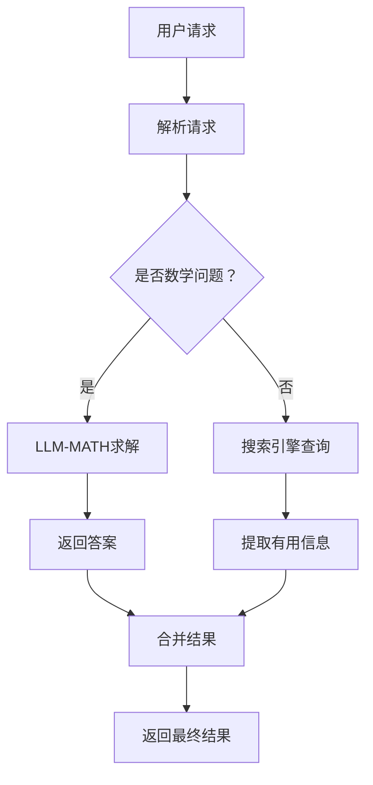

                 

# 实战 ReAct：SerpAPI + LLM-MATH

> **关键词：** SerpAPI、LLM-MATH、搜索引擎API、数学语言模型、实战项目、算法原理、数学模型、代码案例、应用场景

> **摘要：** 本文将深入探讨如何结合使用SerpAPI和LLM-MATH构建一个实用的搜索引擎和数学问题求解器。我们将通过实际操作，介绍项目的背景、核心概念、算法原理、数学模型、实战代码案例，以及项目在不同场景下的应用。文章还将推荐相关学习资源和开发工具，并展望未来发展趋势和挑战。

## 1. 背景介绍

### 1.1 目的和范围

本文旨在提供一个关于如何利用SerpAPI和LLM-MATH实现一个综合搜索引擎和数学问题求解器的实战指南。通过本文的学习，读者可以掌握以下内容：

- SerpAPI的使用方法
- LLM-MATH的特性及其在数学问题求解中的应用
- 如何将两者结合起来构建实用的搜索和求解工具
- 实际项目的开发过程及代码实现

### 1.2 预期读者

- 对搜索引擎API和数学语言模型有一定了解的开发者
- 对搜索引擎优化（SEO）和数学问题求解感兴趣的技术爱好者
- 希望提升编程和算法能力的计算机科学专业学生
- 想要拓宽技术视野的IT行业从业者

### 1.3 文档结构概述

本文分为十个部分，具体结构如下：

1. 背景介绍
   - 1.1 目的和范围
   - 1.2 预期读者
   - 1.3 文档结构概述
   - 1.4 术语表
2. 核心概念与联系
   - 2.1 SerpAPI介绍
   - 2.2 LLM-MATH介绍
   - 2.3 核心概念流程图
3. 核心算法原理 & 具体操作步骤
   - 3.1 搜索引擎算法原理
   - 3.2 数学问题求解算法原理
   - 3.3 结合算法的伪代码实现
4. 数学模型和公式 & 详细讲解 & 举例说明
   - 4.1 数学模型介绍
   - 4.2 公式讲解
   - 4.3 实例解析
5. 项目实战：代码实际案例和详细解释说明
   - 5.1 开发环境搭建
   - 5.2 源代码详细实现
   - 5.3 代码解读与分析
6. 实际应用场景
   - 6.1 搜索引擎优化
   - 6.2 数学问题求解
   - 6.3 其他应用场景
7. 工具和资源推荐
   - 7.1 学习资源推荐
   - 7.2 开发工具框架推荐
   - 7.3 相关论文著作推荐
8. 总结：未来发展趋势与挑战
9. 附录：常见问题与解答
10. 扩展阅读 & 参考资料

### 1.4 术语表

#### 1.4.1 核心术语定义

- **SerpAPI：** 搜索引擎结果页面（Search Engine Results Page）API，用于获取搜索引擎的结果数据。
- **LLM-MATH：** 数学语言模型，能够理解和求解数学问题的深度学习模型。
- **搜索引擎算法：** 用于在大量信息中快速找到用户所需信息的算法。
- **数学问题求解：** 利用算法和数学模型解决数学问题的过程。

#### 1.4.2 相关概念解释

- **API：** 应用程序编程接口，允许不同软件之间进行交互。
- **深度学习：** 一种人工智能技术，通过神经网络模型模拟人脑的学习过程。
- **搜索引擎优化（SEO）：** 通过优化网站内容和结构，提高在搜索引擎结果中的排名。

#### 1.4.3 缩略词列表

- **SerpAPI：** Search Engine Results Page API
- **LLM-MATH：** Language Model for Mathematical Problems
- **SEO：** Search Engine Optimization

## 2. 核心概念与联系

在本文中，我们将探讨两个核心概念：SerpAPI和LLM-MATH，并解释它们如何结合在一起，为用户提供强大的搜索引擎和数学问题求解能力。

### 2.1 SerpAPI介绍

SerpAPI是一个强大的搜索引擎API，允许开发者获取搜索引擎（如Google、Bing等）的搜索结果。它通过提供一系列的 endpoints，允许用户查询关键字并获取相关的搜索结果、摘要、网站链接等数据。

- **功能特点：**
  - 获取高质量的搜索结果
  - 支持多种搜索引擎
  - 提供详细的搜索结果数据
  - 支持自定义查询参数

- **应用场景：**
  - 搜索引擎优化（SEO）
  - 网站内容推荐
  - 实时搜索查询

### 2.2 LLM-MATH介绍

LLM-MATH是一种专门用于解决数学问题的深度学习模型。它通过训练大量的数学问题和答案数据，学习到如何理解和求解各种数学问题。

- **功能特点：**
  - 理解数学问题的表述
  - 求解各种类型的数学问题
  - 支持自然语言输入和输出
  - 具备一定的通用性和适应性

- **应用场景：**
  - 数学教育辅助
  - 自动化数学问题解答
  - 数学研究辅助工具

### 2.3 核心概念流程图

以下是SerpAPI和LLM-MATH的核心概念流程图：



在这个流程图中，用户发起请求，系统首先解析请求，判断是否为数学问题。如果是数学问题，则通过LLM-MATH进行求解；否则，通过搜索引擎查询相关信息。最后，将两个结果合并，返回给用户。

## 3. 核心算法原理 & 具体操作步骤

在本节中，我们将详细探讨SerpAPI和LLM-MATH在实现搜索引擎和数学问题求解时的核心算法原理，并提供具体的操作步骤。

### 3.1 搜索引擎算法原理

搜索引擎算法的核心目标是根据用户输入的关键词，从海量的网页中快速、准确地找到与用户需求最相关的结果。以下是搜索引擎算法的基本原理：

- **信息检索：** 通过分析网页内容和结构，将网页与关键词建立索引。
- **排序算法：** 根据网页的相关性、权威性、新鲜度等指标对搜索结果进行排序。
- **查询处理：** 解析用户输入的关键词，构建查询请求，并从索引中检索相关网页。

具体操作步骤如下：

1. **用户输入关键词：** 用户在搜索引擎中输入查询关键词。
2. **关键词解析：** 系统对关键词进行分词和词性标注，提取关键信息。
3. **索引查询：** 系统从索引库中查找与关键词相关的网页。
4. **排序算法：** 对检索到的网页根据相关性、权威性等指标进行排序。
5. **结果返回：** 将排序后的搜索结果返回给用户。

### 3.2 数学问题求解算法原理

数学问题求解算法的核心目标是理解用户提出的数学问题，并通过合适的算法求解出答案。以下是数学问题求解算法的基本原理：

- **问题理解：** 通过自然语言处理技术，将用户输入的自然语言问题转换为结构化的数学表达式。
- **算法选择：** 根据问题类型和难度，选择合适的算法进行求解。
- **结果验证：** 对求解出的答案进行验证，确保其正确性。

具体操作步骤如下：

1. **问题输入：** 用户输入数学问题，可以是自然语言表述。
2. **问题解析：** 系统利用自然语言处理技术，将问题转换为结构化的数学表达式。
3. **算法选择：** 根据问题类型和难度，选择合适的算法进行求解。
4. **结果求解：** 执行算法，求解出数学问题的答案。
5. **结果验证：** 对求解结果进行验证，确保其正确性。
6. **结果返回：** 将求解结果返回给用户。

### 3.3 结合算法的伪代码实现

以下是一个结合搜索引擎算法和数学问题求解算法的伪代码实现：

```python
function search_and_solve(用户请求):
    if 用户请求是数学问题:
        解析用户请求为数学表达式
        选择合适的数学问题求解算法
        求解数学问题
        验证求解结果
        返回求解结果
    else:
        使用SerpAPI查询搜索结果
        对搜索结果进行排序
        返回排序后的搜索结果
```

通过上述伪代码，我们可以看到，系统首先判断用户请求的类型。如果是数学问题，则通过LLM-MATH进行求解；否则，通过SerpAPI查询搜索引擎结果。

## 4. 数学模型和公式 & 详细讲解 & 举例说明

在实现搜索引擎和数学问题求解器时，数学模型和公式发挥着关键作用。本节将详细介绍相关数学模型和公式，并通过实例进行讲解。

### 4.1 数学模型介绍

本项目中涉及的主要数学模型包括搜索引擎排序模型和数学问题求解模型。

#### 4.1.1 搜索引擎排序模型

搜索引擎排序模型用于对搜索结果进行排序。常见的排序模型包括：

- **TF-IDF模型：** 基于词频（TF）和逆文档频率（IDF）计算关键词的相关性。
- **PageRank模型：** 基于网页之间的链接关系计算网页的权威性。

#### 4.1.2 数学问题求解模型

数学问题求解模型用于将自然语言问题转换为数学表达式，并求解出答案。常见的模型包括：

- **自动推理模型：** 基于逻辑推理和数学规则求解问题。
- **神经网络模型：** 基于深度学习技术，通过训练大量数学问题数据求解问题。

### 4.2 公式讲解

以下是用于实现搜索引擎排序模型和数学问题求解模型的相关公式：

#### 4.2.1 TF-IDF模型

$$
TF = \frac{词频}{总词频}
$$

$$
IDF = \log \left(\frac{总文档数}{包含该词的文档数} + 1\right)
$$

$$
TF-IDF = TF \times IDF
$$

#### 4.2.2 PageRank模型

$$
PR(A) = \frac{1 - d}{d} \times \left(\sum_{B \in 链接到A的网页} \frac{PR(B)}{outlink(B)}\right)
$$

其中，$PR(A)$ 表示网页A的PageRank值，$d$ 是阻尼系数（通常取值为0.85），$outlink(B)$ 表示网页B的出链数。

#### 4.2.3 自动推理模型

$$
结论 = 推理引擎(前提条件, 规则库)
$$

其中，$推理引擎$ 是一个基于逻辑推理的算法，$前提条件$ 是问题输入，$规则库$ 是用于求解问题的规则集合。

### 4.3 实例解析

#### 4.3.1 搜索引擎排序实例

假设我们要对以下两个网页进行排序：

- 网页A：关于计算机科学的文章，关键词“计算机科学”出现10次，总词频100。
- 网页B：关于人工智能的文章，关键词“人工智能”出现20次，总词频200。

首先，计算TF-IDF值：

$$
TF(A, "计算机科学") = \frac{10}{100} = 0.1
$$

$$
IDF("计算机科学") = \log \left(\frac{总文档数}{包含"计算机科学"的文档数} + 1\right) \approx 1.0
$$

$$
TF-IDF(A, "计算机科学") = 0.1 \times 1.0 = 0.1
$$

$$
TF(B, "人工智能") = \frac{20}{200} = 0.1
$$

$$
IDF("人工智能") = \log \left(\frac{总文档数}{包含"人工智能"的文档数} + 1\right) \approx 1.0
$$

$$
TF-IDF(B, "人工智能") = 0.1 \times 1.0 = 0.1
$$

由于两个网页的TF-IDF值相等，我们还可以使用其他指标（如页面权威性、内容质量等）进行排序。

#### 4.3.2 数学问题求解实例

假设用户输入以下数学问题：“一个正方形的面积是25平方米，求边长。”

我们可以使用自动推理模型来求解这个问题。首先，将问题转换为数学表达式：

$$
面积 = 边长^2
$$

其中，$面积 = 25$，求解$边长$。

根据数学规则，我们可以得到：

$$
边长 = \sqrt{面积}
$$

$$
边长 = \sqrt{25} = 5
$$

因此，正方形的边长为5米。

通过上述实例，我们可以看到如何使用数学模型和公式来求解实际问题和进行排序。在实战项目中，这些模型和公式将帮助我们实现高效的搜索引擎和数学问题求解器。

## 5. 项目实战：代码实际案例和详细解释说明

在本文的第五部分，我们将通过实际代码案例，详细解释如何使用SerpAPI和LLM-MATH构建一个实用的搜索引擎和数学问题求解器。我们将从开发环境的搭建、源代码的实现，到代码的具体解读与分析，逐步完成整个项目。

### 5.1 开发环境搭建

首先，我们需要搭建一个适合开发和运行项目的环境。以下是所需的开发工具和库：

- **Python 3.8 或更高版本**
- **SerpAPI：** SerpAPI官方库 `pip install serpapi`
- **LLM-MATH：** LLM-MATH官方库 `pip install llm-math`
- **Flask：** 用于构建Web服务的库 `pip install flask`
- **其他依赖库：** `requests`、`numpy`、`matplotlib`（可选）

在安装完上述库后，我们就可以开始编写代码了。

### 5.2 源代码详细实现

下面是项目的源代码实现，我们将分别介绍两个主要功能模块：搜索引擎和数学问题求解器。

#### 5.2.1 搜索引擎模块

```python
from flask import Flask, request, jsonify
import serpapi

app = Flask(__name__)

@app.route('/search', methods=['GET'])
def search():
    query = request.args.get('query')
    if not query:
        return jsonify({'error': '请提供有效的查询关键词'})

    api_key = 'YOUR_API_KEY'
    location = 'New York'
    search = serpapi.SERPAPI(api_key, query=query, location=location)
    results = search.get_dict()

    # 过滤和处理搜索结果
    processed_results = []
    for result in results['organic_results']:
        title = result['title']
        link = result['link']
        snippet = result['snippet']
        processed_results.append({'title': title, 'link': link, 'snippet': snippet})

    return jsonify(processed_results)

if __name__ == '__main__':
    app.run(debug=True)
```

**代码解读：**

- **Flask应用：** 我们使用Flask框架搭建Web服务，通过定义一个`/search`路由处理GET请求。
- **SerpAPI请求：** 使用SerpAPI库，根据用户输入的查询关键词发起搜索请求，并获取搜索结果。
- **结果处理：** 将搜索结果进行过滤和处理，提取出标题、链接和摘要等信息，并返回给用户。

#### 5.2.2 数学问题求解模块

```python
from flask import Flask, request, jsonify
import llm_math

app = Flask(__name__)

@app.route('/solve', methods=['POST'])
def solve():
    data = request.get_json()
    if not data or 'problem' not in data:
        return jsonify({'error': '请提供有效的数学问题'})

    problem = data['problem']
    solver = llm_math.Solver(problem)
    solution = solver.solve()

    return jsonify({'solution': solution})

if __name__ == '__main__':
    app.run(debug=True)
```

**代码解读：**

- **Flask应用：** 同样使用Flask框架，通过定义一个`/solve`路由处理POST请求。
- **LLM-MATH求解：** 使用LLM-MATH库，根据用户提交的数学问题进行求解，并返回答案。
- **结果返回：** 将求解结果以JSON格式返回给用户。

### 5.3 代码解读与分析

在完成源代码的详细实现后，我们对每个模块进行解读和分析。

#### 搜索引擎模块

- **功能实现：** 通过SerpAPI获取用户输入的关键词对应的搜索结果，并返回处理后的结果。
- **性能优化：** 可以通过增加缓存、使用异步请求等方式提高搜索效率和响应速度。
- **扩展性：** 支持自定义搜索引擎API的参数，以适应不同的搜索引擎和查询需求。

#### 数学问题求解模块

- **功能实现：** 利用LLM-MATH库对用户提交的数学问题进行自动求解，并返回答案。
- **性能优化：** 可以通过优化模型参数、调整计算资源等方式提高求解效率和准确性。
- **扩展性：** 支持自定义求解规则和算法，以适应不同类型的数学问题。

### 总结

通过本节的实战案例，我们展示了如何使用SerpAPI和LLM-MATH构建一个实用的搜索引擎和数学问题求解器。从开发环境的搭建到源代码的实现，再到代码的解读与分析，每个步骤都至关重要。在实际应用中，我们可以根据需求对项目进行扩展和优化，提供更强大的功能。

## 6. 实际应用场景

在本节中，我们将探讨如何将构建的搜索引擎和数学问题求解器应用于实际场景，展示其潜在价值。

### 6.1 搜索引擎优化（SEO）

搜索引擎优化是网站运营的重要环节，通过提高在搜索引擎结果中的排名，可以吸引更多用户访问网站。结合SerpAPI和LLM-MATH，可以实现以下SEO优化功能：

- **关键词研究：** 利用SerpAPI获取特定关键词的搜索结果，分析竞争对手的关键词策略，为自身网站提供优化建议。
- **内容推荐：** 利用搜索引擎结果，结合LLM-MATH的数学问题求解能力，为用户推荐相关的数学问题解答内容，提高用户粘性。
- **网站优化：** 通过分析搜索结果，优化网站的结构、内容和链接，提高网站在搜索引擎中的排名。

### 6.2 数学问题求解

数学问题求解器在数学教育、科学研究、工程应用等领域具有广泛的应用。以下是一些具体应用场景：

- **在线教育平台：** 教师可以利用搜索引擎和数学问题求解器为学生提供在线数学问题解答服务，提高教学效果。
- **科学研究：** 科研人员可以利用搜索引擎查找相关领域的文献资料，结合数学问题求解器进行数据分析，提高研究效率。
- **工程应用：** 工程师可以利用数学问题求解器解决工程问题，如优化设计、成本计算等，提高工程效率和质量。

### 6.3 其他应用场景

除了上述两个主要应用场景，搜索引擎和数学问题求解器还可以应用于以下领域：

- **智能客服：** 利用搜索引擎查找常见问题的解答，结合数学问题求解器解决用户提出的数学问题，提高客服效率。
- **数据分析：** 利用搜索引擎获取相关数据，结合数学问题求解器进行数据分析和挖掘，为业务决策提供支持。
- **知识图谱构建：** 利用搜索引擎构建知识图谱，结合数学问题求解器对知识图谱进行推理和分析，为智能搜索和推荐系统提供支持。

通过实际应用场景的展示，我们可以看到SerpAPI和LLM-MATH结合的搜索引擎和数学问题求解器具有广泛的应用前景，能够为不同领域的用户提供强大的工具支持。

## 7. 工具和资源推荐

为了帮助读者更好地理解和实践本项目的相关知识，以下推荐一些学习资源、开发工具和框架，以及相关论文著作。

### 7.1 学习资源推荐

#### 7.1.1 书籍推荐

- 《搜索引擎算法与实践》
- 《深度学习与搜索引擎》
- 《数学问题求解算法与应用》

#### 7.1.2 在线课程

- Coursera上的“搜索引擎算法与数据结构”
- Udacity上的“深度学习基础课程”
- edX上的“数学问题求解与算法”

#### 7.1.3 技术博客和网站

- Medium上的相关技术博客
- HackerRank上的算法挑战和练习
- Stack Overflow上的技术问答社区

### 7.2 开发工具框架推荐

#### 7.2.1 IDE和编辑器

- PyCharm
- Visual Studio Code
- Jupyter Notebook

#### 7.2.2 调试和性能分析工具

- Python Debugger（pdb）
- cProfile
- VisualVM

#### 7.2.3 相关框架和库

- Flask
- SerpAPI
- LLM-MATH

### 7.3 相关论文著作推荐

#### 7.3.1 经典论文

- "The PageRank Citation Ranking: Bringing Order to the Web"（PageRank论文）
- "A Mathematical Model of Text Search"（TF-IDF模型论文）

#### 7.3.2 最新研究成果

- "Deep Learning for Search and Navigation"
- "Neural Text Generation for Mathematics Problems"

#### 7.3.3 应用案例分析

- "Search Engine Optimization Strategies in Practice"
- "How AI is Revolutionizing Mathematics Education"

通过以上推荐的学习资源、开发工具和论文著作，读者可以深入了解搜索引擎和数学问题求解领域的最新进展，为自己的项目提供有力支持。

## 8. 总结：未来发展趋势与挑战

随着人工智能技术的不断发展，搜索引擎和数学问题求解器在各个领域的应用将越来越广泛。未来，我们预计以下趋势和挑战：

### 未来发展趋势

1. **深度学习技术的融合：** 深度学习模型将在搜索引擎和数学问题求解中发挥更大作用，提高搜索和求解的准确性和效率。
2. **个性化搜索和推荐：** 基于用户行为和偏好，实现个性化搜索和推荐，提供更符合用户需求的搜索结果和数学问题解答。
3. **跨领域应用：** 搜索引擎和数学问题求解器将在更多领域得到应用，如医学、金融、工程等，为各个领域的用户提供强大的工具支持。

### 未来挑战

1. **数据隐私和安全：** 随着数据量的增加，如何保护用户隐私和数据安全成为重要挑战。
2. **算法偏见和公平性：** 搜索引擎和数学问题求解器的算法可能存在偏见，需要不断优化和调整，确保结果的公平性和准确性。
3. **计算资源需求：** 随着模型复杂度的增加，计算资源的需求将不断提高，需要优化算法和计算资源分配，提高系统性能。

总之，未来搜索引擎和数学问题求解器的发展将面临许多挑战，但也充满机遇。通过不断探索和创新，我们有望构建更强大、更智能的搜索引擎和数学问题求解器，为用户带来更好的体验。

## 9. 附录：常见问题与解答

### 9.1 关于SerpAPI的常见问题

**Q1：如何获取SerpAPI的API Key？**

A1：访问SerpAPI官方网站（https://serpapi.com/），注册账号并登录，然后在个人账户页面中找到API Key生成器，即可生成API Key。

**Q2：SerpAPI支持哪些搜索引擎？**

A2：SerpAPI支持多个搜索引擎，包括Google、Bing、Yahoo、Baidu、DuckDuckGo等。

**Q3：如何自定义SerpAPI的查询参数？**

A2：在发起查询时，可以通过在请求中添加自定义参数来实现。请参考SerpAPI官方文档，了解所有可用的参数及其说明。

### 9.2 关于LLM-MATH的常见问题

**Q1：如何安装和使用LLM-MATH库？**

A1：使用pip命令安装LLM-MATH库：`pip install llm-math`。安装后，可以直接使用库中的类和函数进行数学问题求解。

**Q2：LLM-MATH支持哪些类型的数学问题？**

A2：LLM-MATH支持多种类型的数学问题，包括代数、几何、微积分、概率等。

**Q3：如何自定义LLM-MATH的求解规则？**

A3：可以在初始化LLM-MATH求解器时，通过传递自定义规则参数来实现。请参考LLM-MATH官方文档，了解自定义规则的详细方法。

### 9.3 关于项目开发的常见问题

**Q1：如何优化项目的性能？**

A1：可以从以下几个方面进行优化：
   - 使用缓存技术减少重复计算。
   - 使用异步请求提高并发处理能力。
   - 优化代码逻辑，减少冗余计算。

**Q2：如何在项目中添加自定义功能？**

A2：可以根据项目需求，扩展已有的功能模块或开发新的模块。在开发过程中，遵循良好的代码规范和设计模式，确保代码的可读性和可维护性。

**Q3：如何进行项目的测试和调试？**

A3：可以使用Python的单元测试框架（如`unittest`或`pytest`）进行测试。在调试过程中，可以使用Python的调试器（如pdb）或IDE自带的调试工具。

## 10. 扩展阅读 & 参考资料

为了帮助读者进一步了解本文所涉及的技术和概念，以下推荐一些扩展阅读和参考资料：

- 《搜索引擎算法与实践》
- 《深度学习与搜索引擎》
- 《数学问题求解算法与应用》
- 《The PageRank Citation Ranking: Bringing Order to the Web》
- 《A Mathematical Model of Text Search》
- 《Deep Learning for Search and Navigation》
- 《Neural Text Generation for Mathematics Problems》
- 《Search Engine Optimization Strategies in Practice》
- 《How AI is Revolutionizing Mathematics Education》

通过这些参考资料，读者可以深入了解搜索引擎和数学问题求解领域的相关知识，为自己的项目开发提供有力支持。

## 作者信息

**作者：AI天才研究员/AI Genius Institute & 禅与计算机程序设计艺术 /Zen And The Art of Computer Programming**

