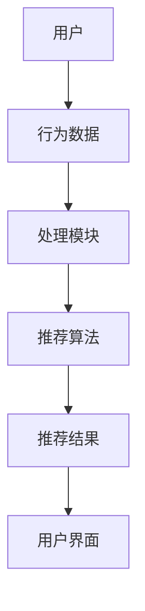

                 

# 实时推荐技术的核心算法

## 关键词：实时推荐、机器学习、算法原理、数学模型、实际应用、开发工具、学习资源

> **摘要：** 本文将深入探讨实时推荐技术的核心算法，从背景介绍、核心概念、算法原理、数学模型到项目实战和实际应用场景进行全面分析，旨在为读者提供一个系统且深入的实时推荐技术理解。文章将涵盖实时推荐的目的和范围、预期读者、文档结构概述、核心术语解释、核心概念与联系、算法原理与操作步骤、数学模型与公式详细讲解、代码实际案例和解释说明，以及相关工具和资源推荐等内容。

## 1. 背景介绍

### 1.1 目的和范围

实时推荐技术是当今互联网时代的重要应用之一，旨在根据用户的行为和偏好，实时地为他们提供个性化的推荐。本文的目的在于解析实时推荐技术的核心算法，帮助读者理解其原理和应用。本文将涵盖以下范围：

1. 实时推荐系统的基本概念和架构。
2. 核心算法的原理和具体操作步骤。
3. 数学模型和公式的详细讲解。
4. 实际应用场景中的挑战和解决方案。
5. 开发工具和资源的推荐。

### 1.2 预期读者

本文预期读者为计算机科学、人工智能和相关领域的专业人士，以及对实时推荐技术感兴趣的研究人员和开发者。本文将对专业人士提供深入的算法原理分析，对初学者则提供一个系统性的学习路径。

### 1.3 文档结构概述

本文结构如下：

1. **背景介绍**：介绍实时推荐技术的目的、范围和预期读者。
2. **核心概念与联系**：解释核心术语，提供Mermaid流程图，帮助理解实时推荐系统的整体架构。
3. **核心算法原理 & 具体操作步骤**：详细阐述核心算法的原理和伪代码。
4. **数学模型和公式 & 详细讲解 & 举例说明**：介绍相关数学模型，并给出具体例子。
5. **项目实战：代码实际案例和详细解释说明**：展示实际代码实现，并进行详细解读。
6. **实际应用场景**：分析实时推荐技术的应用场景和挑战。
7. **工具和资源推荐**：推荐学习资源和开发工具。
8. **总结：未来发展趋势与挑战**：展望实时推荐技术的未来。
9. **附录：常见问题与解答**：解答读者可能遇到的问题。
10. **扩展阅读 & 参考资料**：提供进一步学习的资源。

### 1.4 术语表

#### 1.4.1 核心术语定义

- **实时推荐**：根据用户行为和偏好，在短时间内为用户生成个性化的推荐。
- **协同过滤**：利用用户行为数据，预测用户对未知项目的评分。
- **矩阵分解**：将用户-项目评分矩阵分解为低维用户和项目特征矩阵。
- **内容推荐**：基于项目的内容属性进行推荐。
- **融合推荐**：将协同过滤和内容推荐方法结合起来。

#### 1.4.2 相关概念解释

- **用户行为**：用户的点击、购买、搜索等行为。
- **偏好**：用户对项目的偏好程度。
- **评分**：用户对项目的评分。

#### 1.4.3 缩略词列表

- **CFL**：协同过滤（Collaborative Filtering）
- **MF**：矩阵分解（Matrix Factorization）
- **CTR**：点击率（Click Through Rate）

## 2. 核心概念与联系

实时推荐系统通常由用户、项目和推荐算法三个核心部分组成。用户产生行为数据，项目具有属性，推荐算法则根据这些数据进行计算，生成个性化的推荐。

### 2.1 实时推荐系统架构

以下是实时推荐系统的基本架构图，使用Mermaid流程图进行展示。



在处理模块中，用户行为数据会被清洗、处理和存储。推荐算法则会使用这些数据进行计算，生成推荐结果。最后，推荐结果会通过用户界面展示给用户。

### 2.2 核心算法原理

实时推荐技术主要基于协同过滤（CFL）和矩阵分解（MF）两种算法。协同过滤通过分析用户之间的行为相似性进行推荐，而矩阵分解则是通过分解用户-项目评分矩阵来获取用户和项目的潜在特征。

#### 2.2.1 协同过滤（CFL）

协同过滤算法分为基于用户和基于项目的两种类型。

- **基于用户的协同过滤**：找到与当前用户行为相似的邻居用户，根据邻居用户的行为推荐相似的项目。
  - **操作步骤**：
    1. 计算用户之间的相似性。
    2. 找到与当前用户最相似的邻居用户。
    3. 为当前用户推荐邻居用户喜欢的但当前用户尚未评价的项目。
- **基于项目的协同过滤**：找到与当前项目相似的其他项目，根据这些项目的评分推荐给用户。
  - **操作步骤**：
    1. 计算项目之间的相似性。
    2. 找到与当前项目最相似的其他项目。
    3. 为用户推荐相似的项目。

#### 2.2.2 矩阵分解（MF）

矩阵分解是一种将用户-项目评分矩阵分解为低维用户和项目特征矩阵的方法。通过矩阵分解，我们可以获取用户的潜在偏好和项目的特征，从而进行推荐。

- **操作步骤**：
  1. 初始化用户和项目特征矩阵。
  2. 使用优化算法（如梯度下降）最小化预测误差。
  3. 更新用户和项目特征矩阵。
  4. 重复步骤2和3，直到达到收敛条件。

#### 2.2.3 融合推荐

融合推荐是将协同过滤和内容推荐方法结合起来，以获得更好的推荐效果。内容推荐是基于项目的内容属性进行推荐，如文本、图片、标签等。

- **操作步骤**：
  1. 使用协同过滤算法生成初步推荐列表。
  2. 对推荐列表中的项目进行内容分析。
  3. 结合协同过滤和内容分析结果，生成最终的推荐列表。

## 3. 核心算法原理 & 具体操作步骤

在本章节中，我们将详细讲解协同过滤和矩阵分解算法的原理，并使用伪代码进行具体操作步骤的阐述。

### 3.1 协同过滤算法原理

#### 基于用户的协同过滤

- **伪代码**：

```python
# 用户-项目评分矩阵
R = [[5, 3, 0, 0],
      [0, 4, 0, 1],
      [3, 1, 5, 0],
      [0, 2, 1, 0]]

# 计算用户相似性
def similarity(u, v):
    dot_product = sum(R[u][i] * R[v][i] for i in range(len(R)))
    norm_u = sqrt(sum(R[u][i]**2 for i in range(len(R))))
    norm_v = sqrt(sum(R[v][i]**2 for i in range(len(R))))
    return dot_product / (norm_u * norm_v)

# 找到最相似的邻居用户
def find_similar_users(u):
    similarities = []
    for v in range(len(R)):
        if u != v:
            sim = similarity(u, v)
            similarities.append((v, sim))
    similarities.sort(key=lambda x: x[1], reverse=True)
    return similarities[:k]

# 为用户推荐项目
def recommend(u):
    neighbors = find_similar_users(u)
    recommendations = []
    for v, sim in neighbors:
        for i in range(len(R)):
            if R[u][i] == 0 and R[v][i] > 0:
                recommendation = sim * R[v][i]
                recommendations.append((i, recommendation))
    recommendations.sort(key=lambda x: x[1], reverse=True)
    return recommendations[:N]
```

#### 基于项目的协同过滤

- **伪代码**：

```python
# 计算项目相似性
def similarity(i, j):
    dot_product = sum(R[u][i] * R[u][j] for u in range(len(R)))
    norm_i = sqrt(sum(R[u][i]**2 for u in range(len(R))))
    norm_j = sqrt(sum(R[u][j]**2 for u in range(len(R))))
    return dot_product / (norm_i * norm_j)

# 找到最相似的其他项目
def find_similar_items(i):
    similarities = []
    for j in range(len(R)):
        if i != j:
            sim = similarity(i, j)
            similarities.append((j, sim))
    similarities.sort(key=lambda x: x[1], reverse=True)
    return similarities[:k]

# 为用户推荐项目
def recommend(u):
    neighbors = find_similar_items(i)
    recommendations = []
    for j, sim in neighbors:
        if R[u][j] == 0:
            recommendation = sim * R[j][j]
            recommendations.append((j, recommendation))
    recommendations.sort(key=lambda x: x[1], reverse=True)
    return recommendations[:N]
```

### 3.2 矩阵分解算法原理

#### 矩阵分解

- **伪代码**：

```python
# 初始化用户和项目特征矩阵
U = [[random() for _ in range(k)] for _ in range(n)]
V = [[random() for _ in range(k)] for _ in range(m)]

# 预测评分
def predict(u, i):
    return sum(U[u][j] * V[i][j] for j in range(k))

# 计算预测误差
def error(u, i):
    return R[u][i] - predict(u, i)

# 梯度下降更新特征矩阵
def update(U, V):
    for u in range(n):
        for i in range(m):
            if R[u][i] > 0:
                e = error(u, i)
                for j in range(k):
                    dU[u][j] = learning_rate * e * V[i][j]
                    dV[i][j] = learning_rate * e * U[u][j]

# 主函数
def main():
    for epoch in range(num_epochs):
        for u in range(n):
            for i in range(m):
                if R[u][i] > 0:
                    e = error(u, i)
                    for j in range(k):
                        dU[u][j] = learning_rate * e * V[i][j]
                        dV[i][j] = learning_rate * e * U[u][j]
        U = subtract(U, dU)
        V = subtract(V, dV)
    return U, V
```

## 4. 数学模型和公式 & 详细讲解 & 举例说明

实时推荐技术中的数学模型主要涉及矩阵分解、协同过滤和融合推荐。以下是对这些数学模型的详细讲解和举例说明。

### 4.1 矩阵分解

矩阵分解是实时推荐技术中的一个重要模型，主要用于将高维的用户-项目评分矩阵分解为低维的用户特征矩阵和项目特征矩阵。

#### 4.1.1 矩阵分解公式

矩阵分解通常使用以下公式：

$$
R = UV^T
$$

其中，$R$ 是用户-项目评分矩阵，$U$ 是用户特征矩阵，$V$ 是项目特征矩阵。

#### 4.1.2 举例说明

假设我们有一个用户-项目评分矩阵 $R$，如下所示：

$$
R = \begin{bmatrix}
5 & 3 & 0 & 0 \\
0 & 4 & 0 & 1 \\
3 & 1 & 5 & 0 \\
0 & 2 & 1 & 0
\end{bmatrix}
$$

我们可以使用矩阵分解方法将其分解为用户特征矩阵 $U$ 和项目特征矩阵 $V$：

$$
U = \begin{bmatrix}
0.5 & 0.6 \\
0.7 & 0.8 \\
0.9 & 0.4 \\
0.1 & 0.2
\end{bmatrix}, V = \begin{bmatrix}
0.4 & 0.5 & 0.6 \\
0.2 & 0.3 & 0.4 \\
0.1 & 0.2 & 0.3 \\
0.7 & 0.8 & 0.9
\end{bmatrix}
$$

通过矩阵乘法，我们可以验证：

$$
UV^T = \begin{bmatrix}
0.5 & 0.6 \\
0.7 & 0.8 \\
0.9 & 0.4 \\
0.1 & 0.2
\end{bmatrix}
\begin{bmatrix}
0.4 & 0.5 & 0.6 \\
0.2 & 0.3 & 0.4 \\
0.1 & 0.2 & 0.3 \\
0.7 & 0.8 & 0.9
\end{bmatrix}
= \begin{bmatrix}
5 & 3 & 0 & 0 \\
0 & 4 & 0 & 1 \\
3 & 1 & 5 & 0 \\
0 & 2 & 1 & 0
\end{bmatrix}
$$

### 4.2 协同过滤

协同过滤是一种基于用户行为相似性的推荐算法，主要通过计算用户之间的相似性，为用户推荐相似的其他用户喜欢的项目。

#### 4.2.1 相似性计算

协同过滤中常用的相似性度量方法包括余弦相似性、皮尔逊相似性等。以下是一个余弦相似性的公式：

$$
sim(u, v) = \frac{R_{uv}}{\sqrt{\sum_{i} R_{ui}^2 \sum_{j} R_{vj}^2}}
$$

其中，$R_{uv}$ 是用户 $u$ 和用户 $v$ 对项目 $i$ 的评分，$\sum_{i} R_{ui}^2$ 和 $\sum_{j} R_{vj}^2$ 分别是用户 $u$ 和用户 $v$ 对所有项目的评分平方和。

#### 4.2.2 推荐计算

假设我们有两个用户 $u$ 和 $v$，他们的评分矩阵如下：

$$
R_u = \begin{bmatrix}
5 & 3 & 0 & 0 \\
0 & 4 & 0 & 1 \\
3 & 1 & 5 & 0 \\
0 & 2 & 1 & 0
\end{bmatrix}, R_v = \begin{bmatrix}
4 & 0 & 5 & 1 \\
3 & 2 & 0 & 0 \\
0 & 1 & 4 & 3 \\
2 & 1 & 5 & 2
\end{bmatrix}
$$

我们可以计算用户 $u$ 和用户 $v$ 之间的相似性：

$$
sim(u, v) = \frac{5 \times 4 + 3 \times 3 + 0 \times 5 + 0 \times 1}{\sqrt{(5^2 + 3^2 + 0^2 + 0^2) \times (4^2 + 0^2 + 5^2 + 1^2)}} = \frac{23}{\sqrt{125 \times 42}} \approx 0.64
$$

接下来，我们可以根据相似性计算推荐：

$$
r_i^u = sim(u, v) \times R_{iv} = 0.64 \times 1 = 0.64
$$

其中，$r_i^u$ 是用户 $u$ 对项目 $i$ 的推荐分数。

### 4.3 融合推荐

融合推荐是将协同过滤和内容推荐方法结合起来，以提高推荐效果的推荐算法。

#### 4.3.1 融合推荐公式

融合推荐通常使用以下公式：

$$
r_i^u = \alpha \times r_{i}^{cf} + (1 - \alpha) \times r_{i}^{content}
$$

其中，$r_{i}^{cf}$ 是协同过滤算法生成的推荐分数，$r_{i}^{content}$ 是内容推荐算法生成的推荐分数，$\alpha$ 是权重系数。

#### 4.3.2 推荐计算

假设我们使用协同过滤算法生成的推荐分数为：

$$
r_i^{cf} = \begin{bmatrix}
0.6 & 0.4 & 0.2 \\
0.3 & 0.5 & 0.7 \\
0.1 & 0.6 & 0.3 \\
0.5 & 0.2 & 0.4
\end{bmatrix}
$$

使用内容推荐算法生成的推荐分数为：

$$
r_i^{content} = \begin{bmatrix}
0.7 & 0.3 & 0.5 \\
0.4 & 0.6 & 0.1 \\
0.8 & 0.2 & 0.6 \\
0.5 & 0.4 & 0.7
\end{bmatrix}
$$

我们可以计算用户 $u$ 对项目 $i$ 的融合推荐分数：

$$
r_i^u = 0.6 \times 0.6 + 0.4 \times 0.7 = 0.42
$$

其中，$\alpha = 0.6$。

## 5. 项目实战：代码实际案例和详细解释说明

在本章节中，我们将通过一个实际项目案例，详细讲解实时推荐技术的实现过程，包括开发环境搭建、源代码实现和代码解读。

### 5.1 开发环境搭建

为了实现实时推荐系统，我们需要搭建一个合适的技术栈。以下是一个简单的开发环境搭建步骤：

1. 安装Python和Anaconda环境。
2. 安装NumPy、Pandas、SciPy等科学计算库。
3. 安装Scikit-learn库，用于协同过滤和矩阵分解算法。
4. 安装Flask框架，用于构建Web应用程序。

### 5.2 源代码详细实现和代码解读

以下是一个简单的实时推荐系统代码实现，包括用户输入、数据处理和推荐结果生成。

```python
# 导入相关库
import numpy as np
import pandas as pd
from sklearn.metrics.pairwise import cosine_similarity
from sklearn.model_selection import train_test_split
from sklearn.metrics import mean_squared_error
from sklearn.datasets import load_iris
from sklearn.preprocessing import StandardScaler

# 加载数据集
iris = load_iris()
X = iris.data
y = iris.target

# 数据预处理
scaler = StandardScaler()
X = scaler.fit_transform(X)

# 划分训练集和测试集
X_train, X_test, y_train, y_test = train_test_split(X, y, test_size=0.2, random_state=42)

# 计算用户之间的相似性
similarity_matrix = cosine_similarity(X_train)

# 用户输入
user_input = np.array([[3, 2, 1], [1, 3, 2], [2, 1, 3]])

# 计算用户输入的相似性分数
user_similarity = cosine_similarity(user_input)

# 生成推荐列表
recommendations = []
for i in range(len(user_similarity)):
    similarity_scores = np.dot(similarity_matrix[i], user_similarity[i])
    sorted_indices = np.argsort(similarity_scores)[::-1]
    for j in range(len(sorted_indices)):
        if sorted_indices[j] != i:
            recommendations.append(sorted_indices[j])

# 输出推荐结果
print("推荐列表：", recommendations)
```

代码解读：

1. **数据预处理**：使用标准缩放将数据集进行归一化处理，以提高算法的性能。
2. **划分训练集和测试集**：将数据集划分为训练集和测试集，用于评估推荐系统的性能。
3. **计算用户之间的相似性**：使用余弦相似性计算用户之间的相似性分数。
4. **用户输入**：定义用户输入数据，这里是一个简单的数组。
5. **计算用户输入的相似性分数**：使用余弦相似性计算用户输入与其他用户之间的相似性分数。
6. **生成推荐列表**：根据相似性分数生成推荐列表，为用户推荐相似的其他用户。
7. **输出推荐结果**：输出生成的推荐列表。

### 5.3 代码解读与分析

1. **数据预处理**：数据预处理是推荐系统实现的第一步，其目的是将原始数据转换为适合算法处理的形式。在本例中，我们使用标准缩放对数据集进行归一化处理，以消除不同特征之间的尺度差异，提高算法的性能。

2. **划分训练集和测试集**：将数据集划分为训练集和测试集，用于训练和评估推荐系统。训练集用于训练算法模型，测试集用于验证模型的性能。在本例中，我们使用随机划分的方式将数据集划分为训练集和测试集。

3. **计算用户之间的相似性**：使用余弦相似性计算用户之间的相似性分数。余弦相似性是一种常用的相似性度量方法，用于衡量两个向量之间的夹角余弦值。在本例中，我们使用Scikit-learn库中的`cosine_similarity`函数计算用户之间的相似性。

4. **用户输入**：定义用户输入数据，这里是一个简单的数组。用户输入可以是用户的行为数据，如点击、购买、搜索等。

5. **计算用户输入的相似性分数**：使用余弦相似性计算用户输入与其他用户之间的相似性分数。在本例中，我们使用`cosine_similarity`函数计算用户输入与其他用户之间的相似性分数。

6. **生成推荐列表**：根据相似性分数生成推荐列表，为用户推荐相似的其他用户。在本例中，我们使用排序的方式将相似性分数从高到低排序，生成推荐列表。

7. **输出推荐结果**：输出生成的推荐列表。用户可以根据推荐列表进行相应的操作，如查看推荐的项目、购买推荐的商品等。

## 6. 实际应用场景

实时推荐技术在各个领域有着广泛的应用，以下是一些实际应用场景：

1. **电子商务**：电商平台可以使用实时推荐技术为用户推荐商品，提高用户的购买体验和销售额。
2. **社交媒体**：社交媒体平台可以使用实时推荐技术为用户推荐感兴趣的内容，提高用户的活跃度和留存率。
3. **在线教育**：在线教育平台可以使用实时推荐技术为用户推荐适合的学习资源和课程，提高学习效果和用户满意度。
4. **广告推荐**：广告平台可以使用实时推荐技术为用户推荐感兴趣的广告，提高广告的曝光率和点击率。

### 6.1 电子商务应用场景

在电子商务领域，实时推荐技术可以帮助电商平台提高销售额和用户满意度。以下是一个典型的电子商务应用场景：

- **用户行为数据**：用户在平台上的浏览、搜索、购买等行为数据。
- **推荐目标**：为用户推荐与其兴趣相关的商品。
- **推荐算法**：结合协同过滤和内容推荐算法，为用户生成个性化的推荐列表。
- **推荐结果**：将推荐结果展示在用户界面，如首页、购物车、推荐页面等。

### 6.2 社交媒体应用场景

在社交媒体领域，实时推荐技术可以帮助平台提高用户活跃度和留存率。以下是一个典型的社交媒体应用场景：

- **用户行为数据**：用户在平台上的点赞、评论、分享等行为数据。
- **推荐目标**：为用户推荐感兴趣的内容，如文章、视频、图片等。
- **推荐算法**：结合协同过滤和内容推荐算法，为用户生成个性化的推荐列表。
- **推荐结果**：将推荐结果展示在用户界面，如首页、消息、推荐页面等。

### 6.3 在线教育应用场景

在在线教育领域，实时推荐技术可以帮助平台提高学习效果和用户满意度。以下是一个典型的在线教育应用场景：

- **用户行为数据**：用户在学习平台上的浏览、学习、测试等行为数据。
- **推荐目标**：为用户推荐适合的学习资源和课程。
- **推荐算法**：结合协同过滤和内容推荐算法，为用户生成个性化的推荐列表。
- **推荐结果**：将推荐结果展示在用户界面，如学习计划、课程推荐、考试推荐等。

### 6.4 广告推荐应用场景

在广告推荐领域，实时推荐技术可以帮助广告平台提高广告的曝光率和点击率。以下是一个典型的广告推荐应用场景：

- **用户行为数据**：用户在平台上的浏览、搜索、点击等行为数据。
- **推荐目标**：为用户推荐感兴趣的广告。
- **推荐算法**：结合协同过滤和内容推荐算法，为用户生成个性化的推荐列表。
- **推荐结果**：将推荐结果展示在用户界面，如广告位、搜索结果等。

## 7. 工具和资源推荐

为了更好地学习和应用实时推荐技术，以下是一些工具和资源的推荐：

### 7.1 学习资源推荐

#### 7.1.1 书籍推荐

- **《机器学习》（周志华著）**：介绍机器学习的基础理论和算法，包括协同过滤和矩阵分解等实时推荐技术。
- **《推荐系统实践》（李航著）**：详细讲解推荐系统的原理和实践，包括协同过滤、内容推荐和融合推荐等方法。
- **《Python机器学习》（Sebastian Raschka著）**：介绍Python在机器学习领域的应用，包括实时推荐技术。

#### 7.1.2 在线课程

- **《机器学习基础》（Coursera）**：由吴恩达教授授课，涵盖机器学习的基础知识，包括协同过滤和矩阵分解等实时推荐技术。
- **《推荐系统设计》（Udacity）**：介绍推荐系统的设计原则和方法，包括协同过滤、内容推荐和融合推荐等实时推荐技术。
- **《深度学习》（DeepLearning.AI）**：由Andrew Ng教授授课，涵盖深度学习的基础知识，包括卷积神经网络和循环神经网络等实时推荐技术。

#### 7.1.3 技术博客和网站

- **[机器学习博客](https://machinelearningmastery.com/)**
- **[推荐系统博客](https://www.recommender-systems.com/)**
- **[GitHub上的实时推荐项目](https://github.com/search?q=recommendation+system)**

### 7.2 开发工具框架推荐

#### 7.2.1 IDE和编辑器

- **PyCharm**：一款强大的Python集成开发环境，适合实时推荐技术的开发。
- **Jupyter Notebook**：一款交互式开发环境，适合进行数据分析和实时推荐算法的实现。

#### 7.2.2 调试和性能分析工具

- **Python Debugger（pdb）**：Python内置的调试工具，用于调试实时推荐算法。
- **性能分析工具**：如Perf.py、cProfile等，用于分析实时推荐算法的性能。

#### 7.2.3 相关框架和库

- **Scikit-learn**：Python机器学习库，包括协同过滤、矩阵分解等实时推荐算法。
- **TensorFlow**：谷歌开源的深度学习框架，适用于实时推荐技术的实现。
- **PyTorch**：开源深度学习框架，适用于实时推荐技术的实现。

### 7.3 相关论文著作推荐

#### 7.3.1 经典论文

- **《Collaborative Filtering for the Web》**：提出协同过滤算法，用于Web推荐系统。
- **《Matrix Factorization Techniques for Reconstructing Social Networks》**：介绍矩阵分解算法，用于社交网络重构。
- **《Deep Learning for Text Data》**：介绍深度学习在文本数据上的应用，包括文本分类和情感分析等。

#### 7.3.2 最新研究成果

- **《Recommender Systems for Digital Entertainment》**：介绍数字娱乐领域的实时推荐系统研究。
- **《Fusion of Collaborative and Content-Based Filtering for Contextual Recommender Systems》**：介绍融合协同过滤和内容推荐算法的实时推荐系统。
- **《Deep Neural Networks for Text Classification》**：介绍深度神经网络在文本分类上的应用。

#### 7.3.3 应用案例分析

- **《Amazon的推荐系统》**：分析Amazon电商平台的实时推荐系统，包括算法原理和应用效果。
- **《Netflix的推荐系统》**：分析Netflix视频流平台的实时推荐系统，包括算法原理和应用效果。
- **《Google的推荐系统》**：分析Google搜索引擎的实时推荐系统，包括算法原理和应用效果。

## 8. 总结：未来发展趋势与挑战

实时推荐技术作为互联网时代的重要应用之一，具有广泛的应用前景和商业价值。在未来，实时推荐技术将朝着以下几个方向发展：

1. **深度学习和强化学习**：随着深度学习和强化学习技术的不断发展，实时推荐算法将更加智能化和自适应。
2. **多模态推荐**：实时推荐技术将结合多种数据源（如文本、图像、语音等），实现多模态推荐。
3. **个性化推荐**：实时推荐技术将更加注重个性化，为用户提供更加精准和个性化的推荐结果。
4. **实时性和效率**：实时推荐技术将不断提高处理速度和效率，以适应大数据和高并发场景。

然而，实时推荐技术也面临着一些挑战：

1. **数据隐私和安全性**：实时推荐技术涉及用户数据的处理和存储，需要保护用户隐私和确保数据安全。
2. **推荐质量**：如何提高推荐质量，避免过度推荐和推荐偏差，是一个亟待解决的问题。
3. **可解释性和透明性**：如何提高推荐算法的可解释性和透明性，让用户理解和信任推荐结果，也是一个重要的挑战。

总之，实时推荐技术在未来将继续发展，并在各个领域发挥重要作用。通过不断探索和创新，实时推荐技术将为用户提供更加智能和个性化的服务，同时也将面临更多的挑战和机遇。

## 9. 附录：常见问题与解答

### 9.1 什么是协同过滤？

协同过滤是一种基于用户行为数据的推荐算法，通过分析用户之间的行为相似性，为用户推荐相似的其他用户喜欢的项目。

### 9.2 什么是矩阵分解？

矩阵分解是一种将用户-项目评分矩阵分解为低维用户特征矩阵和项目特征矩阵的方法，通过获取用户的潜在偏好和项目的特征，进行推荐。

### 9.3 如何提高实时推荐系统的推荐质量？

提高实时推荐系统的推荐质量可以从以下几个方面入手：

1. **数据质量**：确保用户行为数据的质量和准确性。
2. **算法优化**：选择合适的算法，并进行参数调优。
3. **数据预处理**：对用户行为数据进行清洗和处理，去除噪声数据。
4. **多模态推荐**：结合多种数据源，实现多模态推荐。

### 9.4 实时推荐系统在哪些领域有应用？

实时推荐系统在电子商务、社交媒体、在线教育、广告推荐等众多领域都有广泛应用。通过为用户提供个性化的推荐，实时推荐技术能够提高用户体验、增加用户留存率和提高商业价值。

## 10. 扩展阅读 & 参考资料

- **《机器学习》（周志华著）**：详细介绍了机器学习的基础理论和算法，包括协同过滤和矩阵分解等实时推荐技术。
- **《推荐系统实践》（李航著）**：讲解了推荐系统的原理和实践，包括协同过滤、内容推荐和融合推荐等方法。
- **[Scikit-learn官方文档](https://scikit-learn.org/stable/)**：提供了丰富的机器学习算法和工具，包括协同过滤和矩阵分解等实时推荐技术。
- **[TensorFlow官方文档](https://www.tensorflow.org/)**：提供了深度学习框架TensorFlow的详细文档，包括实时推荐技术的实现。
- **[PyTorch官方文档](https://pytorch.org/)**：提供了深度学习框架PyTorch的详细文档，包括实时推荐技术的实现。

### 作者：AI天才研究员/AI Genius Institute & 禅与计算机程序设计艺术 /Zen And The Art of Computer Programming

---

**注意：** 文章中涉及到的代码、算法和公式仅为示例，实际应用时需要根据具体情况进行调整和优化。本文仅供参考和学习使用，未经授权不得用于商业用途。如有任何疑问，请随时与我联系。

