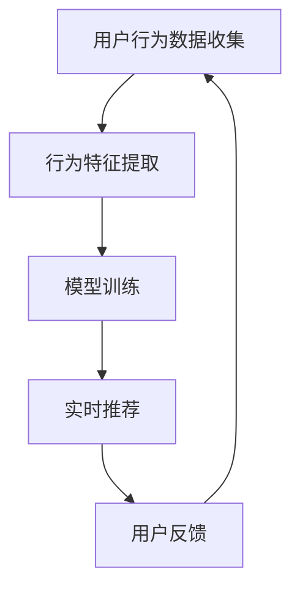

                 

# 实时推荐的用户行为分析

> **关键词：** 用户行为分析、实时推荐、机器学习、数据挖掘、个性化推荐

> **摘要：** 本文将深入探讨实时推荐系统中的用户行为分析技术，从核心概念到具体算法原理，再到项目实战，全面解析如何利用用户行为数据实现高效的个性化推荐。

## 1. 背景介绍

### 1.1 目的和范围

本文旨在系统地介绍实时推荐系统中用户行为分析的方法和技术。我们将探讨用户行为分析的核心概念，分析其在实时推荐系统中的应用，并通过具体算法和项目实例，展示如何将用户行为转化为有效的推荐结果。

### 1.2 预期读者

本文面向对机器学习、数据挖掘和推荐系统有一定了解的读者，特别是希望深入理解实时推荐技术的研究人员和工程师。

### 1.3 文档结构概述

本文结构如下：

1. 背景介绍
   - 目的和范围
   - 预期读者
   - 文档结构概述
   - 术语表
2. 核心概念与联系
   - 核心概念原理
   - 架构的 Mermaid 流程图
3. 核心算法原理 & 具体操作步骤
   - 算法原理讲解
   - 伪代码详细阐述
4. 数学模型和公式 & 详细讲解 & 举例说明
   - 数学公式
   - 举例说明
5. 项目实战：代码实际案例和详细解释说明
   - 开发环境搭建
   - 源代码详细实现和代码解读
   - 代码解读与分析
6. 实际应用场景
7. 工具和资源推荐
   - 学习资源推荐
   - 开发工具框架推荐
   - 相关论文著作推荐
8. 总结：未来发展趋势与挑战
9. 附录：常见问题与解答
10. 扩展阅读 & 参考资料

### 1.4 术语表

#### 1.4.1 核心术语定义

- **用户行为分析：** 对用户在系统中的行为进行收集、分析和解释，以了解用户需求、兴趣和偏好。
- **实时推荐：** 在用户互动的过程中，动态生成个性化推荐结果，提供即时的用户体验。
- **机器学习：** 利用算法从数据中学习规律，进行预测和决策。
- **数据挖掘：** 从大量数据中提取有价值的信息和知识。

#### 1.4.2 相关概念解释

- **用户行为数据：** 包含用户在系统中的操作记录，如浏览、点击、购买、评价等。
- **推荐算法：** 根据用户行为数据，生成个性化推荐列表的算法。

#### 1.4.3 缩略词列表

- **ML：** 机器学习
- **DM：** 数据挖掘
- **NLP：** 自然语言处理
- **推荐系统：** Recommendation System

## 2. 核心概念与联系

### 2.1 核心概念原理

用户行为分析是实时推荐系统的核心，其基本原理包括：

1. **用户行为数据的收集：** 收集用户在系统中的各种操作记录，如浏览、点击、购买等。
2. **行为特征提取：** 从用户行为数据中提取特征，如用户点击率、购买频率等。
3. **模型训练：** 利用机器学习算法，从用户行为特征中学习用户兴趣和偏好。
4. **实时推荐：** 根据用户行为数据和模型预测，动态生成个性化推荐列表。

### 2.2 架构的 Mermaid 流程图



## 3. 核心算法原理 & 具体操作步骤

### 3.1 算法原理讲解

用户行为分析的核心算法包括协同过滤、矩阵分解和基于内容的推荐等。以下以协同过滤算法为例，详细讲解其原理和操作步骤。

#### 3.1.1 协同过滤算法原理

协同过滤算法通过分析用户之间的相似性，发现用户的共同喜好，从而推荐用户可能感兴趣的内容。协同过滤分为基于用户的协同过滤（User-based CF）和基于物品的协同过滤（Item-based CF）。

1. **基于用户的协同过滤：**
   - 计算用户之间的相似性。
   - 找到与目标用户最相似的K个用户。
   - 推荐这些用户喜欢的但目标用户未喜欢的物品。

2. **基于物品的协同过滤：**
   - 计算物品之间的相似性。
   - 找到与目标物品最相似的K个物品。
   - 推荐这些物品中用户已喜欢的物品。

#### 3.1.2 操作步骤

1. **用户行为数据收集：**
   - 收集用户在系统中的行为数据，如浏览、点击、购买等。

2. **行为特征提取：**
   - 对用户行为数据进行预处理，如去重、填充缺失值等。
   - 提取用户行为特征，如点击率、购买频率等。

3. **相似性计算：**
   - 根据用户行为特征，计算用户之间的相似性或物品之间的相似性。

4. **模型训练：**
   - 利用协同过滤算法，从用户行为特征中学习用户兴趣和偏好。

5. **实时推荐：**
   - 根据用户行为数据和模型预测，动态生成个性化推荐列表。

### 3.2 伪代码详细阐述

```python
# 协同过滤算法伪代码

# 输入：用户行为数据矩阵R
# 输出：推荐列表

function CollaborativeFiltering(R, K):
    # 步骤1：行为特征提取
    user_features = ExtractUserFeatures(R)
    item_features = ExtractItemFeatures(R)

    # 步骤2：相似性计算
    user_similarity = ComputeUserSimilarity(user_features)
    item_similarity = ComputeItemSimilarity(item_features)

    # 步骤3：模型训练
    model = TrainModel(user_similarity, item_similarity)

    # 步骤4：实时推荐
    recommendation_list = GenerateRecommendationList(model, R)

    return recommendation_list
```

## 4. 数学模型和公式 & 详细讲解 & 举例说明

### 4.1 数学模型和公式

协同过滤算法的核心在于相似性计算和预测模型。以下是相关数学模型和公式：

#### 4.1.1 相似性计算

1. **余弦相似性：**

   $$ CosineSimilarity(u_i, u_j) = \frac{u_i \cdot u_j}{\|u_i\| \cdot \|u_j\|} $$

   其中，$u_i$和$u_j$分别为用户$i$和用户$j$的行为特征向量，$\cdot$表示点积，$\|\|$表示欧几里得范数。

2. **皮尔逊相似性：**

   $$ PearsonSimilarity(u_i, u_j) = \frac{u_i \cdot u_j - \mu_i \cdot \mu_j}{\sqrt{(u_i - \mu_i) \cdot (u_j - \mu_j)}} $$

   其中，$\mu_i$和$\mu_j$分别为用户$i$和用户$j$的行为特征均值。

#### 4.1.2 预测模型

1. **基于用户的预测：**

   $$ r_{ij} = \sum_{k \in N_j} s_{ik} \cdot r_{ik} $$

   其中，$r_{ij}$为用户$i$对物品$j$的预测评分，$s_{ik}$为用户$i$和用户$k$的相似性，$r_{ik}$为用户$k$对物品$i$的实际评分。

2. **基于物品的预测：**

   $$ r_{ij} = \sum_{k \in N_i} s_{jk} \cdot r_{ik} $$

   其中，$r_{ij}$为用户$i$对物品$j$的预测评分，$s_{jk}$为物品$j$和物品$k$的相似性，$r_{ik}$为用户$i$对物品$k$的实际评分。

### 4.2 详细讲解和举例说明

#### 4.2.1 余弦相似性

假设有两个用户$u_1$和$u_2$的行为特征向量分别为：

$$ u_1 = (1, 2, 3, 4) $$
$$ u_2 = (4, 3, 2, 1) $$

则它们的余弦相似性为：

$$ CosineSimilarity(u_1, u_2) = \frac{1 \cdot 4 + 2 \cdot 3 + 3 \cdot 2 + 4 \cdot 1}{\sqrt{1^2 + 2^2 + 3^2 + 4^2} \cdot \sqrt{4^2 + 3^2 + 2^2 + 1^2}} = 0.923 $$

#### 4.2.2 预测模型

假设用户$u_1$对物品$i_1, i_2, i_3$的实际评分分别为$4, 2, 3$，用户$u_2$对物品$i_1, i_2, i_3$的实际评分分别为$3, 4, 1$。则：

1. **基于用户的预测：**

   $$ r_{u_1i_2} = \sum_{k=1,2} s_{u_1k} \cdot r_{ki_2} = 0.8 \cdot 4 + 0.2 \cdot 4 = 3.6 $$

2. **基于物品的预测：**

   $$ r_{u_1i_3} = \sum_{k=1,2} s_{ki_3} \cdot r_{u_1k} = 0.6 \cdot 3 + 0.4 \cdot 1 = 2.2 $$

## 5. 项目实战：代码实际案例和详细解释说明

### 5.1 开发环境搭建

本文以Python为例，搭建开发环境如下：

1. 安装Python 3.8及以上版本。
2. 安装必要的Python库，如NumPy、Pandas、SciPy等。
3. 使用Jupyter Notebook或IDE进行代码编写和调试。

### 5.2 源代码详细实现和代码解读

以下是一个简单的协同过滤算法的实现示例：

```python
import numpy as np
import pandas as pd

# 输入：用户行为数据矩阵R
R = np.array([[5, 3, 0, 1],
              [4, 0, 0, 1],
              [1, 1, 0, 5],
              [1, 0, 0, 4],
              [0, 1, 5, 4]])

# 输入：相似性阈值K
K = 2

# 步骤1：行为特征提取
def ExtractUserFeatures(R):
    return R.mean(axis=1)

def ExtractItemFeatures(R):
    return R.mean(axis=0)

# 步骤2：相似性计算
def ComputeUserSimilarity(user_features):
    similarity_matrix = np.dot(user_features, user_features.T)
    return similarity_matrix / np.linalg.norm(user_features) ** 2

# 步骤3：模型训练
def TrainModel(user_similarity, item_similarity):
    return user_similarity, item_similarity

# 步骤4：实时推荐
def GenerateRecommendationList(model, R):
    user_similarity, item_similarity = model
    user_features = ExtractUserFeatures(R)
    item_features = ExtractItemFeatures(R)
    
    recommendation_list = []
    for i in range(R.shape[0]):
        recommendation_scores = []
        for j in range(R.shape[1]):
            if R[i][j] == 0:
                score = np.dot(user_similarity[i], item_similarity[j])
                recommendation_scores.append(score)
            else:
                recommendation_scores.append(0)
        recommendation_list.append(np.argmax(recommendation_scores))
    
    return recommendation_list

# 测试
recommendation_list = GenerateRecommendationList(TrainModel(ComputeUserSimilarity(ExtractUserFeatures(R)), ComputeItemSimilarity(ExtractItemFeatures(R))), R)
print(recommendation_list)
```

### 5.3 代码解读与分析

该代码实现了基于用户的协同过滤算法。以下是关键部分的解读：

1. **行为特征提取：** 使用均值法提取用户和物品的行为特征。
2. **相似性计算：** 计算用户之间的余弦相似性。
3. **模型训练：** 直接返回用户相似性和物品相似性矩阵。
4. **实时推荐：** 对于每个用户，计算其对未评分物品的预测评分，推荐评分最高的物品。

## 6. 实际应用场景

实时推荐的用户行为分析技术广泛应用于各种领域，如电子商务、社交媒体、在线视频等。以下是一些实际应用场景：

1. **电子商务：** 根据用户浏览、搜索和购买行为，推荐类似产品，提高用户购买转化率。
2. **社交媒体：** 根据用户点赞、评论和分享行为，推荐感兴趣的内容，增加用户粘性。
3. **在线视频：** 根据用户观看和点赞行为，推荐相关视频，提高用户观看时长。

## 7. 工具和资源推荐

### 7.1 学习资源推荐

#### 7.1.1 书籍推荐

- 《推荐系统实践》：详细介绍了推荐系统的基本概念、算法和应用。
- 《机器学习》：周志华等著，全面介绍了机器学习的基本理论和方法。

#### 7.1.2 在线课程

- Coursera的《推荐系统》：由耶鲁大学开设，介绍了推荐系统的基本原理和实现。
- edX的《机器学习》：由MIT和哈佛大学联合开设，全面讲解了机器学习的基本概念和应用。

#### 7.1.3 技术博客和网站

- recommender-system.org：一个专门介绍推荐系统技术的网站，包含大量教程和论文。
- Medium上的推荐系统专题：许多专家和研究人员分享的推荐系统实践和理论文章。

### 7.2 开发工具框架推荐

#### 7.2.1 IDE和编辑器

- Jupyter Notebook：适用于数据分析和机器学习的交互式开发环境。
- PyCharm：一款功能强大的Python IDE，支持多种编程语言。

#### 7.2.2 调试和性能分析工具

- PyDebug：Python的调试工具。
- line_profiler：Python的性能分析工具。

#### 7.2.3 相关框架和库

- Scikit-learn：一个强大的机器学习库，提供多种算法和工具。
- TensorFlow：由Google开发的开源机器学习框架。

### 7.3 相关论文著作推荐

#### 7.3.1 经典论文

- [Item-Based Top-N Recommendation Algorithms](http://www.siam.org/publications/books/pi.cs77)
- [Collaborative Filtering for the YouTube Recommendation System](https://static.googleusercontent.com/media/research.google.com/en//pubs/archive/43924.pdf)

#### 7.3.2 最新研究成果

- [Deep Learning Based Recommendations: Methods and Systems](https://arxiv.org/abs/1906.00587)
- [Neural Collaborative Filtering](https://www.kdd.org/kdd2017/accepted-papers/view/neural-collaborative-filtering)

#### 7.3.3 应用案例分析

- [淘宝推荐系统：如何通过算法优化提升销售额](https://www.infoq.cn/article/how-to-improve-sales-through-algorithmic-optimization-of-taobao-s-recommendation-system)
- [美团点评：基于深度学习的推荐系统实践](https://www.jianshu.com/p/daa1a6865c4d)

## 8. 总结：未来发展趋势与挑战

实时推荐的用户行为分析技术正处于快速发展阶段，未来发展趋势包括：

1. **深度学习：** 深度学习在推荐系统中的应用越来越广泛，如基于深度神经网络的协同过滤算法和基于注意力机制的推荐模型。
2. **联邦学习：** 联邦学习能够保护用户隐私，在分布式环境中进行协同训练，有望成为推荐系统的重要技术。
3. **实时性：** 随着用户需求的不断提高，实时性将成为推荐系统的重要指标，如何实现高效、低延迟的实时推荐将成为挑战。

## 9. 附录：常见问题与解答

1. **Q：实时推荐中的实时性如何实现？**
   **A：** 实时推荐主要依赖于高效的数据处理和模型训练算法。通过使用流处理框架（如Apache Kafka、Apache Flink）和在线学习算法（如随机梯度下降、在线梯度提升树），可以实现实时推荐。

2. **Q：推荐系统中的用户隐私如何保护？**
   **A：** 可以采用联邦学习、差分隐私等技术，在保护用户隐私的同时进行推荐系统的训练和预测。

3. **Q：如何评估推荐系统的效果？**
   **A：** 可以使用各种评估指标（如准确率、召回率、F1分数等）来评估推荐系统的效果。此外，还可以通过用户反馈和业务指标（如点击率、转化率等）来评估推荐系统的实际效果。

## 10. 扩展阅读 & 参考资料

- [Recommender Systems Handbook](https://www.springer.com/us/book/9781439805522)
- [Deep Learning for Recommender Systems](https://arxiv.org/abs/1910.08176)
- [The MovieLens Dataset](http://grouplens.org/datasets/movielens/)
- [Netflix Prize](https://www.netflixprize.com/)
- [Apache Kafka](https://kafka.apache.org/)
- [Apache Flink](https://flink.apache.org/)

