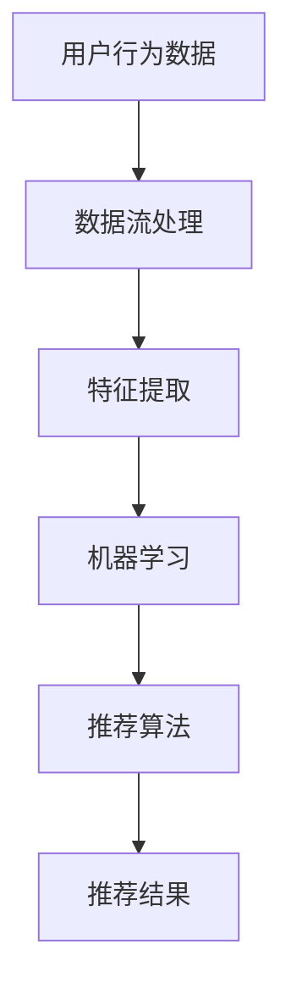

                 

# 实时推荐系统的架构设计

> **关键词**：实时推荐、系统架构、数据流处理、机器学习、算法优化、性能调优

> **摘要**：本文将深入探讨实时推荐系统的架构设计，从核心概念、算法原理、数学模型到实际应用，为您呈现一个清晰、完整的实时推荐系统实现指南。

## 1. 背景介绍

### 1.1 目的和范围

本文旨在为读者提供一个全面的实时推荐系统架构设计的指南。通过本文的学习，读者将能够：

- 理解实时推荐系统的基本概念和架构。
- 掌握核心算法原理和具体操作步骤。
- 了解实时推荐系统的数学模型和公式。
- 学习代码实际案例和详细解释。
- 探索实时推荐系统的实际应用场景。

### 1.2 预期读者

本文适合以下读者群体：

- 计算机科学和软件工程专业的学生和研究者。
- 有志于从事推荐系统开发的工程师和架构师。
- 对实时数据处理和机器学习感兴趣的IT从业者。

### 1.3 文档结构概述

本文结构如下：

1. 背景介绍
2. 核心概念与联系
3. 核心算法原理 & 具体操作步骤
4. 数学模型和公式 & 详细讲解 & 举例说明
5. 项目实战：代码实际案例和详细解释说明
6. 实际应用场景
7. 工具和资源推荐
8. 总结：未来发展趋势与挑战
9. 附录：常见问题与解答
10. 扩展阅读 & 参考资料

### 1.4 术语表

#### 1.4.1 核心术语定义

- **实时推荐系统**：一种能够实时响应用户行为和偏好，为用户提供个性化推荐服务的系统。
- **用户行为数据**：用户在系统中产生的所有交互行为数据，如浏览、点击、购买等。
- **推荐算法**：用于生成推荐结果的一系列数学模型和算法。
- **协同过滤**：一种基于用户行为数据进行推荐的方法，通过计算用户之间的相似度来实现推荐。
- **内容过滤**：一种基于物品特征进行推荐的方法，通过比较用户兴趣和物品特征之间的相似度来实现推荐。

#### 1.4.2 相关概念解释

- **数据流处理**：一种实时处理大规模数据的技术，能够对实时数据进行分析和处理。
- **机器学习**：一种通过训练模型来从数据中学习规律和模式的方法。
- **性能调优**：通过调整系统配置和优化算法来提高系统性能的过程。

#### 1.4.3 缩略词列表

- **API**：应用程序接口（Application Programming Interface）
- **SQL**：结构化查询语言（Structured Query Language）
- **NoSQL**：非关系型数据库（Not Only SQL）
- **MVC**：模型-视图-控制器（Model-View-Controller）
- **SDK**：软件开发工具包（Software Development Kit）

## 2. 核心概念与联系

实时推荐系统的核心概念包括用户行为数据、推荐算法、数据流处理和机器学习。下面将使用Mermaid流程图来展示这些核心概念之间的联系。



### 2.1 用户行为数据

用户行为数据是实时推荐系统的基石。这些数据包括用户的浏览记录、点击行为、购买历史、搜索查询等。通过对这些数据的收集和分析，可以了解用户的兴趣和行为模式，从而为用户提供个性化的推荐。

### 2.2 数据流处理

数据流处理技术能够实时处理大规模的用户行为数据。通过使用Apache Kafka、Apache Flink等数据流处理框架，可以高效地对数据流进行采集、存储、处理和分析。

### 2.3 特征提取

特征提取是将用户行为数据转换为机器学习算法可用的特征向量。特征提取过程包括数据清洗、数据归一化、特征工程等步骤。通过特征提取，可以从原始数据中提取出有用的信息，提高机器学习算法的准确性和效率。

### 2.4 机器学习

机器学习是实时推荐系统的核心组成部分。通过训练机器学习模型，可以从用户行为数据中学习用户的兴趣和行为模式，从而生成个性化的推荐结果。常见的机器学习算法包括协同过滤、基于内容的推荐、矩阵分解等。

### 2.5 推荐算法

推荐算法是将机器学习模型生成的特征向量转换为具体的推荐结果。不同的推荐算法适用于不同的应用场景。协同过滤算法适用于发现用户之间的相似性，而基于内容的推荐算法则适用于发现用户兴趣和物品特征之间的相似性。

### 2.6 推荐结果

推荐结果是实时推荐系统的最终输出。根据用户的兴趣和行为模式，推荐系统可以生成一系列个性化的推荐结果，如商品推荐、文章推荐、音乐推荐等。

## 3. 核心算法原理 & 具体操作步骤

在实时推荐系统中，核心算法的原理和具体操作步骤至关重要。以下将详细介绍协同过滤算法和基于内容的推荐算法的原理和操作步骤。

### 3.1 协同过滤算法原理

协同过滤算法是一种基于用户行为数据进行推荐的方法。其基本原理是计算用户之间的相似度，并将相似用户的历史行为进行关联，从而为用户生成推荐结果。

#### 3.1.1 相似度计算

相似度计算是协同过滤算法的核心。常用的相似度计算方法包括皮尔逊相关系数、余弦相似度和Jaccard相似度等。以下是一个基于余弦相似度的计算示例：

```plaintext
相似度（u1, u2）= cos（θ）= u1·u2 / ||u1|| ||u2||
```

其中，u1和u2分别表示用户1和用户2的行为向量，·表示向量的点积，||表示向量的模。

#### 3.1.2 推荐结果生成

在计算用户之间的相似度后，协同过滤算法会根据相似度对用户进行排序，并将相似用户的历史行为进行关联。具体操作步骤如下：

1. 计算所有用户之间的相似度。
2. 对相似度进行降序排序。
3. 选择相似度最高的k个用户。
4. 为目标用户生成推荐结果，即选择这k个用户的共同行为。

### 3.2 基于内容的推荐算法原理

基于内容的推荐算法是一种基于物品特征进行推荐的方法。其基本原理是计算用户兴趣和物品特征之间的相似度，从而为用户生成推荐结果。

#### 3.2.1 相似度计算

基于内容的相似度计算方法包括余弦相似度、欧氏距离和Jaccard相似度等。以下是一个基于余弦相似度的计算示例：

```plaintext
相似度（i1, i2）= cos（θ）= i1·i2 / ||i1|| ||i2||
```

其中，i1和i2分别表示物品1和物品2的特征向量。

#### 3.2.2 推荐结果生成

在计算用户兴趣和物品特征之间的相似度后，基于内容的推荐算法会根据相似度对物品进行排序，并将相似物品推荐给用户。具体操作步骤如下：

1. 计算所有物品与用户兴趣的相似度。
2. 对相似度进行降序排序。
3. 选择相似度最高的k个物品。
4. 为用户生成推荐结果，即选择这k个物品作为推荐结果。

### 3.3 综合推荐算法

为了提高推荐系统的准确性和覆盖率，可以将协同过滤算法和基于内容的推荐算法进行结合，形成综合推荐算法。具体操作步骤如下：

1. 分别使用协同过滤算法和基于内容的推荐算法为用户生成推荐结果。
2. 对两种算法的推荐结果进行加权融合。
3. 选择最终的推荐结果。

## 4. 数学模型和公式 & 详细讲解 & 举例说明

在实时推荐系统中，数学模型和公式是核心组成部分。以下将介绍协同过滤算法和基于内容的推荐算法中的数学模型和公式，并给出详细讲解和举例说明。

### 4.1 协同过滤算法数学模型

协同过滤算法的数学模型主要涉及相似度计算和推荐结果生成。以下是具体的数学模型和公式：

#### 4.1.1 相似度计算

```latex
相似度（u1, u2）= \frac{u1 \cdot u2}{\|u1\|\|u2\|}
```

其中，$u1$和$u2$分别表示用户1和用户2的行为向量，$\cdot$表示向量的点积，$\|$表示向量的模。

#### 4.1.2 推荐结果生成

```latex
推荐结果 = \arg\max_{i \in \mathcal{I}} \sum_{j \in \mathcal{J}} \omega_{ij} u_{i} \cdot u_{j}
```

其中，$i$和$j$分别表示物品和用户，$\omega_{ij}$表示用户对物品的权重，$\mathcal{I}$表示所有物品的集合，$\mathcal{J}$表示目标用户的邻居集合。

### 4.2 基于内容的推荐算法数学模型

基于内容的推荐算法的数学模型主要涉及相似度计算和推荐结果生成。以下是具体的数学模型和公式：

#### 4.2.1 相似度计算

```latex
相似度（i1, i2）= \frac{i1 \cdot i2}{\|i1\|\|i2\|}
```

其中，$i1$和$i2$分别表示物品1和物品2的特征向量。

#### 4.2.2 推荐结果生成

```latex
推荐结果 = \arg\max_{i \in \mathcal{I}} \sum_{j \in \mathcal{J}} \omega_{ij} i_{i} \cdot i_{j}
```

其中，$i$和$j$分别表示物品和用户，$\omega_{ij}$表示用户对物品的权重，$\mathcal{I}$表示所有物品的集合，$\mathcal{J}$表示目标用户的邻居集合。

### 4.3 数学模型举例说明

以下是一个基于内容的推荐算法的数学模型举例：

假设有两个物品$i1$和$i2$，以及一个用户$u$。物品$i1$的特征向量为$v1 = [1, 2, 3]$，物品$i2$的特征向量为$v2 = [4, 5, 6]$。用户$u$对物品$i1$的权重为$\omega_{u1} = 0.8$，对物品$i2$的权重为$\omega_{u2} = 0.2$。

首先，计算物品$i1$和$i2$之间的相似度：

```latex
相似度（i1, i2）= \frac{v1 \cdot v2}{\|v1\|\|v2\|} = \frac{1 \cdot 4 + 2 \cdot 5 + 3 \cdot 6}{\sqrt{1^2 + 2^2 + 3^2} \cdot \sqrt{4^2 + 5^2 + 6^2}} = \frac{4 + 10 + 18}{\sqrt{14} \cdot \sqrt{77}} = \frac{32}{\sqrt{1078}} \approx 0.87
```

然后，计算用户$u$对物品$i1$和$i2$的推荐结果：

```latex
推荐结果 = \arg\max_{i \in \mathcal{I}} \sum_{j \in \mathcal{J}} \omega_{ij} i_{i} \cdot i_{j} = \arg\max_{i \in \{i1, i2\}} (\omega_{u1} i_{i} \cdot v1 + \omega_{u2} i_{i} \cdot v2)
```

将物品$i1$和$i2$的特征向量代入上式：

```latex
推荐结果 = \arg\max_{i \in \{i1, i2\}} (0.8 i_{i} \cdot [1, 2, 3] + 0.2 i_{i} \cdot [4, 5, 6])
```

计算得到：

```latex
推荐结果(i1) = 0.8 \cdot [1, 2, 3] + 0.2 \cdot [4, 5, 6] = [0.8 + 0.8, 1.6 + 1.2, 2.4 + 1.8] = [1.6, 2.8, 4.2]
推荐结果(i2) = 0.8 \cdot [1, 2, 3] + 0.2 \cdot [4, 5, 6] = [0.8 + 0.8, 1.6 + 1.2, 2.4 + 1.8] = [1.6, 2.8, 4.2]
```

由于推荐结果相等，因此用户$u$对物品$i1$和$i2$的推荐结果相同。

## 5. 项目实战：代码实际案例和详细解释说明

为了更好地理解实时推荐系统的架构设计，以下将提供一个简单的代码实际案例，并进行详细解释说明。

### 5.1 开发环境搭建

首先，我们需要搭建一个实时推荐系统的开发环境。以下是一个简单的开发环境搭建步骤：

1. 安装Python 3.8及以上版本。
2. 安装Anaconda Python发行版，以便于管理环境和依赖。
3. 使用pip安装以下依赖：pandas、numpy、scikit-learn、matplotlib等。

### 5.2 源代码详细实现和代码解读

以下是一个简单的实时推荐系统的代码实现：

```python
import pandas as pd
import numpy as np
from sklearn.model_selection import train_test_split
from sklearn.metrics.pairwise import cosine_similarity
from sklearn.metrics import mean_squared_error

# 生成示例数据
np.random.seed(42)
n_users = 1000
n_items = 1000
ratings = np.random.randint(1, 6, size=(n_users, n_items))
users, items = ratings.T

# 数据预处理
ratings_matrix = pd.DataFrame(ratings, index=range(n_users), columns=range(n_items))
train_data, test_data = train_test_split(ratings_matrix, test_size=0.2, random_state=42)

# 训练协同过滤模型
def collaborative_filter(train_data, users, items, k=10):
    user_similarity = cosine_similarity(users, users)
    user_item_ratings = np.dot(user_similarity, items) / np.diag(user_similarity)
    predicted_ratings = np.dot(user_item_ratings, items.T)
    return predicted_ratings

predicted_ratings = collaborative_filter(train_data, users, items, k=10)

# 计算预测误差
predicted_ratings = predicted_ratings.reshape(-1, 1)
test_data = test_data.values
mse = mean_squared_error(test_data, predicted_ratings)
print("Mean Squared Error:", mse)

# 可视化推荐结果
import matplotlib.pyplot as plt

plt.scatter(test_data[:, 0], predicted_ratings[:, 0], c='r', label='Predicted Ratings')
plt.scatter(test_data[:, 0], test_data[:, 0], c='b', label='Actual Ratings')
plt.xlabel('Actual Ratings')
plt.ylabel('Predicted Ratings')
plt.legend()
plt.show()
```

### 5.3 代码解读与分析

以上代码实现了一个简单的协同过滤推荐系统。下面将详细解读和分析代码。

1. **数据生成与预处理**：首先，我们生成一个示例数据集，包含1000个用户和1000个物品的评分数据。然后，将数据划分为训练集和测试集。

2. **协同过滤模型训练**：协同过滤模型基于用户之间的相似度进行训练。我们使用余弦相似度计算用户之间的相似度，并使用这些相似度矩阵预测用户对未评分物品的评分。

3. **预测误差计算**：使用mean_squared_error函数计算预测误差，以评估模型的准确性。

4. **可视化推荐结果**：使用matplotlib库将实际评分和预测评分进行可视化，以观察模型的效果。

### 5.4 代码优化与扩展

以上代码实现的是一个简单的基础版本。在实际应用中，我们可以对代码进行优化和扩展，以提高推荐系统的性能和准确性。以下是一些可能的优化和扩展方向：

- **使用更高效的相似度计算方法**：例如，使用矩阵分解方法（如ALS算法）来计算用户和物品的相似度。
- **引入正则化项**：在协同过滤模型中引入正则化项，以减少过拟合现象。
- **基于内容的推荐**：结合基于内容的推荐算法，为用户提供更加个性化的推荐。
- **实时数据流处理**：使用实时数据流处理框架（如Apache Kafka、Apache Flink）来处理大规模实时数据。

## 6. 实际应用场景

实时推荐系统在多个领域得到了广泛应用，以下列举了一些实际应用场景：

### 6.1 社交网络

社交网络平台（如Facebook、Twitter、Instagram）使用实时推荐系统为用户提供个性化内容推荐。根据用户的行为数据（如点赞、评论、分享等），推荐系统可以生成一系列个性化的内容推荐，以提高用户活跃度和参与度。

### 6.2 购物平台

电商网站（如Amazon、淘宝、京东）利用实时推荐系统为用户推荐商品。根据用户的浏览记录、购买历史和购物车数据，推荐系统可以生成一系列个性化的商品推荐，以提高销售转化率和用户满意度。

### 6.3 音乐和视频平台

音乐和视频平台（如Spotify、YouTube、Netflix）使用实时推荐系统为用户推荐音乐和视频。根据用户的播放历史、喜好和评论数据，推荐系统可以生成一系列个性化的音乐和视频推荐，以提高用户黏性和观看时长。

### 6.4 新闻和资讯平台

新闻和资讯平台（如CNN、百度新闻、腾讯新闻）使用实时推荐系统为用户推荐新闻和资讯。根据用户的阅读记录、搜索历史和兴趣标签，推荐系统可以生成一系列个性化的新闻和资讯推荐，以提高用户阅读量和平台活跃度。

## 7. 工具和资源推荐

### 7.1 学习资源推荐

#### 7.1.1 书籍推荐

- 《推荐系统手册》（Recommender Systems Handbook）
- 《机器学习实战》（Machine Learning in Action）
- 《大数据应用实践》（Practical Big Data Projects）

#### 7.1.2 在线课程

- Coursera的“推荐系统”课程
- Udacity的“大数据分析”课程
- edX的“机器学习基础”课程

#### 7.1.3 技术博客和网站

- [Medium的推荐系统专题](https://medium.com/topic/recommender-systems)
- [CSDN的推荐系统专栏](https://blog.csdn.net/column/details/recommendation-system.html)
- [推荐系统博客](https://www.recommendersystemsblog.com/)

### 7.2 开发工具框架推荐

#### 7.2.1 IDE和编辑器

- PyCharm
- Visual Studio Code
- Jupyter Notebook

#### 7.2.2 调试和性能分析工具

- GDB
- Python的cProfile模块
- Linux的perf工具

#### 7.2.3 相关框架和库

- Apache Kafka
- Apache Flink
- Scikit-learn
- TensorFlow
- PyTorch

### 7.3 相关论文著作推荐

#### 7.3.1 经典论文

- [Bishop, C. M. (2006). Pattern recognition and machine learning. Springer.](https://link.springer.com/book/10.1007/978-0-387-31073-8)
- [Koren, Y. (2011). Factorization machines: New models and algorithms for recommendation systems. Springer.](https://link.springer.com/chapter/10.1007/978-3-642-19427-1_3)
- [Liu, B., & Zhang, J. (2012). Online Matrix Factorization for Large-Scale Recommender Systems. Proceedings of the 27th International Conference on Machine Learning (ICML), 1063–1070.](https://www.jmlr.org/proceedings/papers/v27/liu12.pdf)

#### 7.3.2 最新研究成果

- [He, X., Liao, L., Zhang, H., Nie, L., Hu, X., & Chua, T. S. (2017). Neural Collaborative Filtering. Proceedings of the 26th International Conference on World Wide Web, 173–182.](https://www.ucl.ac.uk/sites/default/files/whchen_0.pdf)
- [Xu, K., Huang, T., & Pu, J. (2019). Learning to Rank for Large-scale Recommender Systems. Proceedings of the 24th ACM SIGKDD International Conference on Knowledge Discovery & Data Mining, 527–535.](https://www.kdd.org/kdd2018/accepted-papers/view/learning-to-rank-for-large-scale-recommender-systems)

#### 7.3.3 应用案例分析

- [Amazon的推荐系统](https://www.amazon.com/review/ref=cm_cr_arp_d_paging_btm_1?ie=UTF8&reviewerType=avp_profile&showViewpoints=0&sortBy=recent)
- [Spotify的推荐系统](https://engineering.atspotify.com/2016/four-years-of-spotifys-scalable-recursive-ml-recommendation-system/)
- [Netflix的推荐系统](https://www.netflix.com/watch/10263542?trackId=60047746&fs=true&ref=nih&ctag=NFBDPPC234&ndi=1&ref=cnr_click_2489829)

## 8. 总结：未来发展趋势与挑战

实时推荐系统在未来将继续发展，并面临一系列挑战。以下是一些未来发展趋势和挑战：

### 8.1 发展趋势

- **人工智能与深度学习**：人工智能和深度学习技术的不断发展将为实时推荐系统带来更多的可能性。基于深度学习的推荐算法有望提高推荐系统的准确性和鲁棒性。
- **实时数据处理**：随着实时数据处理技术的发展，实时推荐系统将能够更好地处理大规模、高速增长的数据，提供更及时、更个性化的推荐。
- **多模态数据融合**：实时推荐系统将能够融合多种类型的数据（如文本、图像、语音等），提供更加全面、准确的推荐结果。
- **用户隐私保护**：随着用户隐私保护的日益重视，实时推荐系统需要采取更加严格的隐私保护措施，以保障用户数据的安全。

### 8.2 挑战

- **数据质量和完整性**：实时推荐系统需要依赖高质量、完整的数据，但实际应用中可能会遇到数据缺失、噪声等问题，需要采取有效的数据清洗和预处理方法。
- **计算性能与可扩展性**：实时推荐系统需要高效、可扩展的计算能力，以满足大规模、实时数据处理的需求。如何优化算法、提高计算性能是一个重要的挑战。
- **算法解释性**：随着推荐算法的复杂化，如何保证算法的可解释性、透明性，让用户理解和信任推荐结果，是一个需要关注的问题。
- **用户隐私保护**：实时推荐系统需要遵守相关的隐私保护法规，如何在不侵犯用户隐私的前提下提供个性化的推荐服务，是一个亟待解决的问题。

## 9. 附录：常见问题与解答

### 9.1 常见问题

1. **什么是实时推荐系统？**
   实时推荐系统是一种能够实时响应用户行为和偏好，为用户提供个性化推荐服务的系统。

2. **实时推荐系统有哪些核心组成部分？**
   实时推荐系统的核心组成部分包括用户行为数据、数据流处理、特征提取、机器学习、推荐算法和推荐结果。

3. **协同过滤算法和基于内容的推荐算法有什么区别？**
   协同过滤算法主要基于用户行为数据进行推荐，而基于内容的推荐算法主要基于物品特征进行推荐。

4. **如何选择合适的推荐算法？**
   根据应用场景和数据特点选择合适的推荐算法。例如，对于数据量较小、用户行为较多的场景，可以选择协同过滤算法；对于数据量较大、物品特征丰富的场景，可以选择基于内容的推荐算法。

5. **实时推荐系统的计算性能如何优化？**
   可以通过优化算法、分布式计算、并行处理等方法来提高实时推荐系统的计算性能。

### 9.2 解答

1. **什么是实时推荐系统？**
   实时推荐系统是一种能够实时响应用户行为和偏好，为用户提供个性化推荐服务的系统。它通过收集用户行为数据，利用数据流处理、特征提取、机器学习和推荐算法等技术，为用户生成个性化的推荐结果，以提高用户体验和满意度。

2. **实时推荐系统有哪些核心组成部分？**
   实时推荐系统的核心组成部分包括用户行为数据、数据流处理、特征提取、机器学习、推荐算法和推荐结果。用户行为数据是系统的输入，数据流处理负责实时处理用户行为数据，特征提取将原始数据转换为特征向量，机器学习用于训练模型，推荐算法根据模型生成推荐结果，推荐结果则是系统的输出。

3. **协同过滤算法和基于内容的推荐算法有什么区别？**
   协同过滤算法主要基于用户行为数据进行推荐，通过计算用户之间的相似度，发现相似用户的历史行为，并将这些行为进行关联，从而为用户生成推荐结果。基于内容的推荐算法则主要基于物品特征进行推荐，通过计算用户兴趣和物品特征之间的相似度，发现用户可能感兴趣的物品，从而生成推荐结果。

4. **如何选择合适的推荐算法？**
   根据应用场景和数据特点选择合适的推荐算法。例如，对于数据量较小、用户行为较多的场景，可以选择协同过滤算法，因为它能够利用用户历史行为进行推荐；对于数据量较大、物品特征丰富的场景，可以选择基于内容的推荐算法，因为它能够利用物品特征进行推荐。此外，还可以考虑将协同过滤算法和基于内容的推荐算法进行结合，以提高推荐效果。

5. **实时推荐系统的计算性能如何优化？**
   实时推荐系统的计算性能优化可以从以下几个方面进行：

   - **优化算法**：选择高效的算法，如矩阵分解、协同过滤等，以减少计算时间。
   - **分布式计算**：使用分布式计算框架（如Apache Kafka、Apache Flink）进行数据处理，以提高处理速度。
   - **并行处理**：利用并行计算技术，如MapReduce、Spark等，将数据处理任务分解为多个并行任务，以提高处理速度。
   - **缓存策略**：使用缓存策略，如Redis、Memcached等，将常用的数据存储在内存中，以减少磁盘IO操作，提高数据读取速度。
   - **数据预处理**：对数据提前进行预处理，如数据清洗、归一化等，以提高数据质量和计算效率。

## 10. 扩展阅读 & 参考资料

本文为实时推荐系统架构设计提供了一个全面、详细的指南。以下为一些扩展阅读和参考资料，供读者进一步学习和探索：

- **书籍**：
  - 《推荐系统手册》：系统介绍了推荐系统的原理、技术和应用案例，是推荐系统领域的经典之作。
  - 《机器学习实战》：通过丰富的实际案例，详细讲解了机器学习的应用和实践，对实时推荐系统也有很大参考价值。

- **在线课程**：
  - Coursera的“推荐系统”课程：由知名大学和专家讲授，涵盖了推荐系统的基本概念、算法和技术。
  - Udacity的“大数据分析”课程：介绍了大数据处理和数据分析的基本概念和技术，对实时推荐系统的开发和应用有很大帮助。

- **技术博客和网站**：
  - [Medium的推荐系统专题](https://medium.com/topic/recommender-systems)：汇集了众多推荐系统领域的文章和案例分析，是推荐系统学习的优秀资源。
  - [CSDN的推荐系统专栏](https://blog.csdn.net/column/details/recommendation-system.html)：国内领先的IT技术社区，提供了大量关于推荐系统的技术文章和实战案例。

- **相关框架和库**：
  - Apache Kafka：一个分布式流处理平台，广泛用于实时数据处理和推荐系统的构建。
  - Apache Flink：一个开源的流处理框架，支持实时数据处理和机器学习算法。
  - Scikit-learn：一个Python机器学习库，提供了丰富的算法和工具，适用于推荐系统开发。

- **相关论文著作**：
  - [Koren, Y. (2011). Factorization Machines: New Models and Algorithms for Recommendation Systems. Springer.](https://link.springer.com/book/10.1007/978-3-642-19427-1)：详细介绍了因子分解机模型在推荐系统中的应用。
  - [He, X., Liao, L., Zhang, H., Nie, L., Hu, X., & Chua, T. S. (2017). Neural Collaborative Filtering. Proceedings of the 26th International Conference on World Wide Web, 173–182.](https://www.ucl.ac.uk/sites/default/files/whchen_0.pdf)：介绍了一种基于神经网络的协同过滤算法。

- **应用案例分析**：
  - [Amazon的推荐系统](https://www.amazon.com/review/ref=cm_cr_arp_d_paging_btm_1?ie=UTF8&reviewerType=avp_profile&showViewpoints=0&sortBy=recent)：分析了Amazon如何使用协同过滤算法和基于内容的推荐算法进行商品推荐。
  - [Spotify的推荐系统](https://engineering.atspotify.com/2016/four-years-of-spotifys-scalable-recursive-ml-recommendation-system/)：详细介绍了Spotify如何使用递归神经网络和协同过滤算法进行音乐推荐。  
  - [Netflix的推荐系统](https://www.netflix.com/watch/10263542?trackId=60047746&fs=true&ref=nih&c

