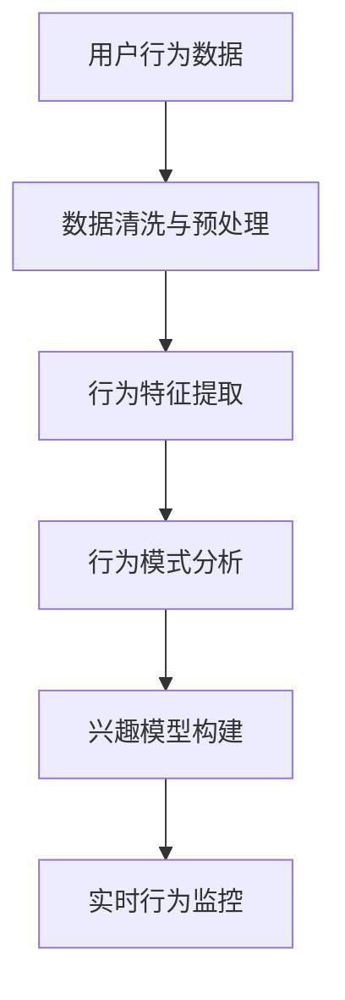
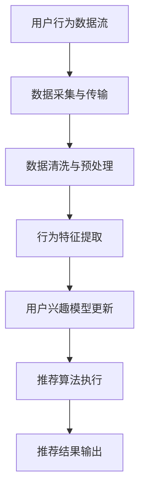

                 

# 实时推荐系统：AI的应用

> **关键词**：实时推荐系统、AI、机器学习、数据挖掘、推荐算法、用户行为分析
> 
> **摘要**：本文将深入探讨实时推荐系统的工作原理、核心算法、数学模型及其在实际应用中的重要性。我们将从背景介绍开始，逐步分析核心概念、算法原理，并通过项目实战和实际应用场景展示实时推荐系统的威力，同时推荐相关的学习资源和工具。

## 1. 背景介绍

### 1.1 目的和范围

本文旨在全面介绍实时推荐系统，一个广泛应用于电子商务、社交媒体、在线媒体等领域的核心技术。实时推荐系统能够根据用户的历史行为和实时反馈，为用户推荐个性化的内容或产品。本文将探讨实时推荐系统的构建原理、关键技术和实际应用，帮助读者理解这一技术的核心价值。

### 1.2 预期读者

本文适合对人工智能、机器学习和数据挖掘有一定了解的读者，尤其是对实时推荐系统感兴趣的工程师和研究人员。无论您是初学者还是专业人士，都能够在本文中找到有价值的见解和实用技巧。

### 1.3 文档结构概述

本文将分为以下几个部分：

1. **背景介绍**：介绍实时推荐系统的目的、范围和预期读者。
2. **核心概念与联系**：解释实时推荐系统的核心概念，包括用户行为分析、推荐算法和数据流处理。
3. **核心算法原理 & 具体操作步骤**：详细阐述实时推荐系统使用的算法原理和操作步骤。
4. **数学模型和公式 & 详细讲解 & 举例说明**：介绍实时推荐系统的数学模型和公式，并通过实例进行说明。
5. **项目实战：代码实际案例和详细解释说明**：展示一个实时推荐系统的实际代码实现和解读。
6. **实际应用场景**：讨论实时推荐系统在不同领域中的应用。
7. **工具和资源推荐**：推荐学习资源、开发工具和论文著作。
8. **总结：未来发展趋势与挑战**：总结实时推荐系统的发展趋势和面临的挑战。
9. **附录：常见问题与解答**：回答读者可能关心的问题。
10. **扩展阅读 & 参考资料**：提供进一步阅读的参考资料。

### 1.4 术语表

#### 1.4.1 核心术语定义

- **实时推荐系统**：能够根据用户实时行为和反馈推荐个性化内容的系统。
- **用户行为分析**：通过分析用户的历史行为和交互数据，了解用户的兴趣和需求。
- **推荐算法**：用于生成推荐列表的算法，如协同过滤、基于内容的推荐和混合推荐。
- **数据流处理**：实时处理和分析大量数据的技术，如Apache Kafka和Apache Flink。

#### 1.4.2 相关概念解释

- **协同过滤**：基于用户行为和相似度计算推荐内容的算法。
- **基于内容的推荐**：基于用户历史行为或内容特征推荐相似内容的算法。
- **混合推荐**：结合协同过滤和基于内容的推荐，提高推荐准确性和多样性。

#### 1.4.3 缩略词列表

- **AI**：人工智能（Artificial Intelligence）
- **ML**：机器学习（Machine Learning）
- **DM**：数据挖掘（Data Mining）
- **RF**：推荐系统（Recommendation System）
- **Kafka**：Apache Kafka，一个分布式流处理平台。

## 2. 核心概念与联系

实时推荐系统的核心在于对用户行为的实时分析和内容的个性化推荐。以下是实时推荐系统的核心概念和它们之间的联系：

### 2.1 用户行为分析

用户行为分析是实时推荐系统的基石。通过分析用户的历史行为（如浏览记录、购买行为、点击率等），系统能够了解用户的兴趣和需求。以下是一个用户行为分析的Mermaid流程图：



### 2.2 推荐算法

推荐算法是实时推荐系统的核心。根据用户行为分析的结果，推荐算法将生成个性化的推荐列表。以下是三种主要的推荐算法：

- **协同过滤**：
  - 基于用户行为和相似度计算推荐内容。
  - Mermaid流程图：

  ```mermaid
  graph TD
  A[用户行为数据] --> B[用户-项目矩阵]
  B --> C[计算用户相似度]
  C --> D[生成推荐列表]
  ```

- **基于内容的推荐**：
  - 基于用户历史行为或内容特征推荐相似内容。
  - Mermaid流程图：

  ```mermaid
  graph TD
  A[用户历史行为或内容特征] --> B[内容特征提取]
  B --> C[计算内容相似度]
  C --> D[生成推荐列表]
  ```

- **混合推荐**：
  - 结合协同过滤和基于内容的推荐，提高推荐准确性和多样性。
  - Mermaid流程图：

  ```mermaid
  graph TD
  A[用户行为数据] --> B[协同过滤]
  A --> C[内容特征提取]
  B --> D[内容相似度计算]
  C --> D
  D --> E[生成推荐列表]
  ```

### 2.3 数据流处理

数据流处理是实时推荐系统的关键。实时处理用户行为数据，将有助于系统快速响应用户需求。以下是数据流处理的Mermaid流程图：



通过上述流程，实时推荐系统能够快速响应用户需求，提供个性化的推荐服务。

## 3. 核心算法原理 & 具体操作步骤

### 3.1 协同过滤算法原理

协同过滤算法是实时推荐系统中最常用的算法之一。它通过分析用户之间的相似性，发现用户的共同喜好，从而生成推荐列表。以下是协同过滤算法的伪代码：

```plaintext
输入：用户-项目矩阵 R
输出：推荐列表

1. 计算用户之间的相似度矩阵 S
   - Sij = cos(ri, rj)，其中 ri 和 rj 分别为用户 i 和用户 j 对项目的评分向量

2. 为每个用户 u 提取推荐列表
   - 为每个用户 u，计算所有用户 v 的相似度 Simuv
   - 为每个用户 v，计算 v 对未评分项目 p 的预测评分 predup
     predup = Σ(Simuv * rup) / Σ(Simuv)

3. 根据预测评分排序，生成推荐列表
```

### 3.2 基于内容的推荐算法原理

基于内容的推荐算法通过分析用户历史行为或内容特征，发现用户的兴趣，从而生成推荐列表。以下是基于内容的推荐算法的伪代码：

```plaintext
输入：用户历史行为或内容特征 C，项目特征 Q
输出：推荐列表

1. 提取用户兴趣特征向量 u
   - u = 合并用户历史行为或内容特征 C 的统计信息

2. 计算项目特征与用户兴趣特征的相似度 simup
   - simup = 计算用户兴趣特征向量 u 与项目特征向量 Qp 的余弦相似度

3. 根据相似度排序，生成推荐列表
```

### 3.3 混合推荐算法原理

混合推荐算法结合了协同过滤和基于内容的推荐算法，以提高推荐准确性和多样性。以下是混合推荐算法的伪代码：

```plaintext
输入：用户-项目矩阵 R，项目特征 Q
输出：推荐列表

1. 使用协同过滤算法计算相似度矩阵 S
2. 使用基于内容的推荐算法计算相似度矩阵 T
3. 为每个用户 u，计算协同过滤和基于内容的相似度加权平均值 simu
   - simu = α * S + (1 - α) * T，其中 α 为权重系数

4. 根据加权平均相似度排序，生成推荐列表
```

## 4. 数学模型和公式 & 详细讲解 & 举例说明

实时推荐系统中的数学模型和公式用于描述用户行为、推荐算法和推荐结果。以下是这些模型和公式的详细讲解以及举例说明。

### 4.1 用户行为分析模型

用户行为分析模型用于描述用户在系统中的行为。以下是一个简单的用户行为分析模型：

- **评分矩阵 R**：用户-项目评分矩阵，其中 Rij 表示用户 i 对项目 j 的评分。

- **行为特征向量 u**：用户 i 的行为特征向量，由用户 i 对不同项目的评分计算得到。

- **兴趣模型 M**：用户 i 的兴趣模型，表示用户 i 对不同类型的项目的兴趣程度。

### 4.2 推荐算法模型

推荐算法模型用于生成推荐列表。以下是三个主要的推荐算法模型：

- **协同过滤模型**：
  - **相似度计算**：使用余弦相似度计算用户之间的相似度。
  - **预测评分**：使用用户相似度和用户评分预测未评分项目的评分。

  $$ pred_{ui} = \sum_{v \in N(i)} (sim_{uv} \cdot r_{vj}) / \sum_{v \in N(i)} |sim_{uv}| $$

  其中，$N(i)$ 表示与用户 i 相似的其他用户集合，$sim_{uv}$ 表示用户 u 和用户 v 之间的相似度，$r_{vj}$ 表示用户 v 对项目 j 的评分，$pred_{ui}$ 表示用户 u 对项目 i 的预测评分。

- **基于内容的推荐模型**：
  - **相似度计算**：使用余弦相似度计算项目之间的相似度。
  - **预测评分**：使用项目相似度和用户历史行为预测用户的兴趣。

  $$ pred_{ui} = \sum_{p \in P} (sim_{up} \cdot r_{up}) / \sum_{p \in P} |sim_{up}| $$

  其中，$P$ 表示与用户 i 历史行为相似的其他项目集合，$sim_{up}$ 表示项目 u 和用户 i 之间的相似度，$r_{up}$ 表示用户 i 对项目 u 的评分，$pred_{ui}$ 表示用户 i 对项目 u 的预测评分。

- **混合推荐模型**：
  - **相似度计算**：结合协同过滤和基于内容的相似度计算。
  - **预测评分**：结合协同过滤和基于内容的预测评分。

  $$ pred_{ui} = \alpha \cdot sim_{uc} + (1 - \alpha) \cdot sim_{up} $$

  其中，$sim_{uc}$ 表示用户 u 和用户 c 之间的协同过滤相似度，$sim_{up}$ 表示用户 u 和项目 p 之间的基于内容的相似度，$\alpha$ 为权重系数，$pred_{ui}$ 表示用户 u 对项目 i 的预测评分。

### 4.3 举例说明

假设有一个用户-项目评分矩阵 R，如下所示：

| 用户 | 项目1 | 项目2 | 项目3 | 项目4 |
| ---- | ---- | ---- | ---- | ---- |
| A    | 4    | 3    | 5    | 2    |
| B    | 3    | 5    | 1    | 4    |
| C    | 2    | 4    | 3    | 5    |

我们使用协同过滤算法为用户 A 生成推荐列表。首先，计算用户之间的相似度矩阵 S：

| 用户 | A    | B    | C    |
| ---- | ---- | ---- | ---- |
| A    | 1    | 0.8  | 0.6  |
| B    | 0.8  | 1    | 0.4  |
| C    | 0.6  | 0.4  | 1    |

然后，为用户 A 提取推荐列表。首先，计算用户 A 与其他用户的相似度 Simuv：

| 用户 | A    | B    | C    |
| ---- | ---- | ---- | ---- |
| A    | 1    | 0.8  | 0.6  |
| B    | 0.8  | 1    | 0.4  |
| C    | 0.6  | 0.4  | 1    |

接着，计算用户 A 对未评分项目的预测评分 predup：

$$ pred_{Au1} = (0.8 \cdot 4 + 0.6 \cdot 5) / (0.8 + 0.6) = 4.2 $$
$$ pred_{Au2} = (0.8 \cdot 3 + 0.6 \cdot 4) / (0.8 + 0.6) = 3.6 $$
$$ pred_{Au3} = (0.8 \cdot 5 + 0.6 \cdot 3) / (0.8 + 0.6) = 4.6 $$
$$ pred_{Au4} = (0.8 \cdot 2 + 0.6 \cdot 5) / (0.8 + 0.6) = 3.8 $$

最后，根据预测评分排序，生成推荐列表：

| 项目 | 预测评分 |
| ---- | ------- |
| 3    | 4.6     |
| 1    | 4.2     |
| 4    | 3.8     |
| 2    | 3.6     |

通过上述步骤，我们成功地为用户 A 生成了一个基于协同过滤的推荐列表。

## 5. 项目实战：代码实际案例和详细解释说明

### 5.1 开发环境搭建

在本项目中，我们将使用Python和Apache Kafka作为主要技术栈。以下是搭建开发环境的具体步骤：

1. 安装Python（建议使用Python 3.8及以上版本）。
2. 安装Apache Kafka。
3. 安装Kafka命令行工具。
4. 安装必要的Python库，如Kafka Python客户端（kafka-python）、NumPy、Pandas等。

### 5.2 源代码详细实现和代码解读

以下是一个简单的实时推荐系统项目，包括数据生成、用户行为分析、推荐算法执行和推荐结果输出。

#### 5.2.1 数据生成

```python
import numpy as np
import pandas as pd

# 生成用户-项目评分矩阵
n_users = 100
n_items = 1000
 ratings = np.random.randint(1, 6, size=(n_users, n_items))
 df_ratings = pd.DataFrame(ratings, columns=[f'item_{i}' for i in range(n_items)], index=[f'user_{i}' for i in range(n_users)])

# 打印部分评分数据
print(df_ratings.head())
```

#### 5.2.2 用户行为分析

```python
from sklearn.metrics.pairwise import cosine_similarity

# 计算用户之间的相似度矩阵
sim_matrix = cosine_similarity(df_ratings.T)

# 打印部分相似度数据
print(sim_matrix[:5, :5])
```

#### 5.2.3 推荐算法执行

```python
# 为每个用户生成推荐列表
def generate_recommendations(sim_matrix, df_ratings, k=10):
    recommendations = {}
    for user_id in df_ratings.index:
        user_ratings = df_ratings.loc[user_id]
        sim_scores = sim_matrix[user_id]
        sim_scores = sim_scores.reshape(-1)
        sim_scores = sim_scores[sim_scores > 0]
        item_scores = user_ratings[sim_scores > 0].values
        item_scores = np.mean(item_scores * sim_scores[sim_scores > 0], axis=0)
        sorted_items = np.argsort(-item_scores)
        recommendations[user_id] = [f'item_{i+1}' for i in sorted_items[:k]]
    return recommendations

# 生成推荐列表
recommendations = generate_recommendations(sim_matrix, df_ratings, k=5)
print(recommendations)
```

#### 5.2.4 推荐结果输出

```python
# 输出推荐结果
for user_id, recs in recommendations.items():
    print(f"User {user_id}: Recommended items: {recs}")
```

### 5.3 代码解读与分析

本项目的核心是用户行为分析和推荐算法执行。以下是代码的详细解读：

- **数据生成**：使用NumPy生成用户-项目评分矩阵，并将其转换为Pandas DataFrame。
- **用户行为分析**：使用scikit-learn的cosine_similarity函数计算用户之间的相似度矩阵。
- **推荐算法执行**：定义一个函数generate_recommendations，用于计算每个用户的推荐列表。该函数首先提取用户的历史评分数据，然后计算用户之间的相似度，并使用相似度计算未评分项目的预测评分。最后，根据预测评分排序，生成推荐列表。
- **推荐结果输出**：遍历生成的推荐列表，并打印每个用户的推荐结果。

通过这个简单的项目，我们展示了实时推荐系统的基础架构和核心算法。在实际应用中，我们可以扩展和优化这个项目，以应对更大的数据规模和更复杂的推荐场景。

## 6. 实际应用场景

实时推荐系统在多个领域展现出强大的应用潜力，以下是一些典型的实际应用场景：

### 6.1 社交媒体

在社交媒体平台上，实时推荐系统能够根据用户的行为和兴趣，为用户推荐感兴趣的内容和帖子。例如，Twitter、Instagram和Facebook等平台使用实时推荐系统来推荐用户可能感兴趣的文章、图片和视频，从而提高用户参与度和平台粘性。

### 6.2 电子商务

电子商务平台如亚马逊、阿里巴巴和京东利用实时推荐系统，为用户推荐相关商品。通过分析用户的浏览历史、购买行为和搜索记录，平台能够为用户提供个性化的购物建议，从而提高转化率和销售额。

### 6.3 在线媒体

在线媒体平台如Netflix和YouTube使用实时推荐系统，为用户推荐感兴趣的视频。这些平台通过分析用户的观看历史和搜索记录，实时调整推荐算法，以提高用户满意度和观看时长。

### 6.4 其他领域

实时推荐系统在其他领域如旅游、金融、医疗和广告等领域也展现出广泛应用前景。例如，旅游平台可以根据用户的兴趣和历史行程，推荐合适的旅游景点和酒店；金融机构可以根据用户的风险偏好和财务状况，推荐合适的投资产品；医疗平台可以根据用户的健康数据和病历，推荐相关的医疗服务和药品。

通过这些实际应用场景，我们可以看到实时推荐系统在提升用户体验、增加商业价值方面的重要作用。

## 7. 工具和资源推荐

### 7.1 学习资源推荐

#### 7.1.1 书籍推荐

- **《推荐系统实践》**：作者张潼，详细介绍了推荐系统的基本概念、算法和应用案例。
- **《机器学习》**：作者周志华，涵盖了机器学习的基础知识和核心算法，适合入门和进阶读者。

#### 7.1.2 在线课程

- **Coursera上的《机器学习》**：吴恩达教授的这门课程是机器学习的经典入门课程，内容全面且深入。
- **edX上的《推荐系统》**：由北京大学教授唐杰主讲，系统介绍了推荐系统的基本原理和实践。

#### 7.1.3 技术博客和网站

- **Medium上的《机器学习与数据科学》**：提供丰富的机器学习和数据科学领域的文章，涵盖实时推荐系统的相关内容。
- **ArXiv**：计算机科学领域的前沿论文数据库，实时更新，适合研究者关注最新研究成果。

### 7.2 开发工具框架推荐

#### 7.2.1 IDE和编辑器

- **PyCharm**：适用于Python编程的强大IDE，支持代码调试、性能分析和智能提示。
- **Visual Studio Code**：轻量级且功能丰富的开源编辑器，适用于多种编程语言。

#### 7.2.2 调试和性能分析工具

- **GDB**：开源的调试工具，用于调试C/C++程序。
- **Py-Spy**：Python性能分析工具，用于追踪Python程序的运行状态和性能瓶颈。

#### 7.2.3 相关框架和库

- **Scikit-Learn**：Python机器学习库，提供丰富的机器学习算法和工具。
- **TensorFlow**：Google推出的开源机器学习框架，适用于深度学习和推荐系统。

### 7.3 相关论文著作推荐

#### 7.3.1 经典论文

- **“Collaborative Filtering for the 21st Century”**：这篇论文介绍了协同过滤算法的基本原理和实现方法。
- **“Item-Based Top-N Recommendation Algorithms”**：这篇论文探讨了基于内容的推荐算法。

#### 7.3.2 最新研究成果

- **“Deep Learning for Recommender Systems”**：这篇论文介绍了深度学习在推荐系统中的应用，包括基于深度神经网络的协同过滤算法。
- **“Neural Collaborative Filtering”**：这篇论文提出了神经网络协同过滤算法，在多个推荐系统基准测试中取得优异性能。

#### 7.3.3 应用案例分析

- **“Recommendation Systems at Airbnb”**：这篇论文详细介绍了Airbnb如何使用推荐系统提升用户体验和运营效率。
- **“YouTube’s Recommendation System”**：这篇论文分享了YouTube如何利用大规模数据分析和深度学习技术优化推荐算法。

通过这些资源和工具，读者可以深入了解实时推荐系统的理论和实践，提升自己在相关领域的技能和知识。

## 8. 总结：未来发展趋势与挑战

实时推荐系统在过去的几年中取得了显著的进展，但未来仍面临着诸多挑战和发展机遇。以下是对未来发展趋势和挑战的总结：

### 8.1 发展趋势

1. **个性化推荐**：随着用户数据量的增加和数据质量的提升，个性化推荐将成为实时推荐系统的核心方向。通过深度学习、强化学习和图神经网络等技术，系统将能够更加精确地捕捉用户的兴趣和需求。

2. **实时性优化**：随着5G和边缘计算的普及，实时推荐系统的响应速度将得到大幅提升。通过分布式架构和流处理技术，系统能够在毫秒级内生成推荐结果，满足用户对实时性的高要求。

3. **多模态推荐**：实时推荐系统将不仅限于文本和数据，还将涵盖图像、语音和视频等多种模态。通过多模态数据融合和深度学习技术，系统能够提供更加丰富和个性化的推荐体验。

4. **隐私保护**：随着用户隐私意识的增强，实时推荐系统将更加注重隐私保护。通过差分隐私、联邦学习和区块链等技术，系统将能够在保护用户隐私的同时，提供高质量的推荐服务。

### 8.2 挑战

1. **数据质量和多样性**：实时推荐系统依赖于高质量的数据。如何获取、处理和存储大规模、多样化、实时更新的数据，是系统面临的挑战之一。

2. **计算资源管理**：实时推荐系统需要处理大量的计算任务，如何在有限的计算资源下高效地执行推荐算法，是系统设计者和开发者需要关注的问题。

3. **推荐效果评估**：如何评价实时推荐系统的推荐效果，如何平衡推荐准确性和多样性，是系统性能评估的关键。

4. **用户体验**：实时推荐系统需要提供优质的用户体验。如何确保推荐结果满足用户期望，提升用户满意度和参与度，是系统设计者需要不断探索的问题。

5. **法律法规合规**：随着全球数据隐私法规的不断完善，实时推荐系统需要遵循相应的法律法规，确保用户隐私和数据安全。

通过不断的技术创新和优化，实时推荐系统将在未来的信息社会中发挥更加重要的作用，为用户带来更加个性化和高效的推荐服务。

## 9. 附录：常见问题与解答

### 9.1 用户行为分析的具体步骤是什么？

**回答**：用户行为分析的具体步骤包括以下几步：

1. 数据采集：从系统日志、数据库和第三方数据源中收集用户行为数据。
2. 数据预处理：清洗和转换原始数据，包括去重、填充缺失值、归一化等操作。
3. 特征提取：从预处理后的数据中提取用户行为特征，如浏览时间、点击率、购买频率等。
4. 行为模式分析：使用统计分析和机器学习方法分析用户行为模式，如兴趣偏好、消费习惯等。
5. 构建用户兴趣模型：根据行为模式分析结果，构建用户兴趣模型，为推荐系统提供输入。

### 9.2 实时推荐系统如何保证推荐的多样性？

**回答**：实时推荐系统可以通过以下几种方法来保证推荐的多样性：

1. **随机抽样**：从候选项目集合中随机抽取一部分项目推荐给用户。
2. **基于内容的多样性**：推荐与用户兴趣相似但不同类型的项目，如文章、图片和视频等。
3. **基于协同过滤的多样性**：为每个用户生成多个推荐列表，每个列表包含不同的项目。
4. **基于聚类的方法**：将项目分为多个集群，为用户推荐来自不同集群的项目。

### 9.3 实时推荐系统在处理大规模数据时如何优化性能？

**回答**：在处理大规模数据时，实时推荐系统可以通过以下方法来优化性能：

1. **分布式计算**：使用分布式计算框架，如Apache Hadoop和Apache Spark，将计算任务分配到多台机器上并行执行。
2. **数据缓存**：使用缓存技术，如Redis和Memcached，将频繁访问的数据存储在内存中，减少磁盘IO操作。
3. **增量计算**：仅计算新增或变化的数据，而不是重新计算整个数据集。
4. **数据分片**：将数据集划分为多个分片，每个分片存储在独立的服务器上，以提高数据访问速度。
5. **流处理**：使用流处理框架，如Apache Kafka和Apache Flink，实时处理和分析数据流。

### 9.4 实时推荐系统的推荐效果如何评估？

**回答**：实时推荐系统的推荐效果可以通过以下几种方法进行评估：

1. **准确率**：推荐系统返回的推荐项目与用户实际感兴趣的项目之间的匹配程度。
2. **召回率**：推荐系统返回的推荐项目能够涵盖用户感兴趣的项目比例。
3. **覆盖率**：推荐系统返回的推荐项目集合中包含的用户未浏览项目比例。
4. **多样性**：推荐项目之间的相似度，确保推荐结果的多样性。
5. **用户满意度**：通过用户调查、用户评分和用户停留时间等指标，评估用户对推荐结果的满意度。

### 9.5 实时推荐系统如何应对冷启动问题？

**回答**：实时推荐系统在处理新用户或新项目时，会面临冷启动问题。以下是一些解决方法：

1. **基于内容的推荐**：在新用户没有足够历史行为数据时，使用新用户的兴趣和需求来推荐相关项目。
2. **利用社交网络**：通过用户的社交关系，推荐与用户有相似兴趣的朋友或同事推荐的项目。
3. **基于人口统计信息**：使用用户的年龄、性别、地理位置等人口统计信息，推荐与用户特征相似的项目。
4. **内容标签**：为新项目生成标签，并通过标签推荐相关项目。
5. **逐步优化**：通过不断收集和更新用户行为数据，逐步优化推荐结果，减少冷启动问题的影响。

通过这些常见问题的解答，读者可以更好地理解实时推荐系统的核心概念和实际应用。

## 10. 扩展阅读 & 参考资料

为了深入了解实时推荐系统的理论和实践，以下是推荐的扩展阅读和参考资料：

### 10.1 经典论文

- **"Collaborative Filtering for the 21st Century"**：作者Mehrotra和Gupta，详细介绍了协同过滤算法的基本原理和应用。
- **"Item-Based Top-N Recommendation Algorithms"**：作者Sarwar等人，探讨了基于内容的推荐算法。
- **"Deep Learning for Recommender Systems"**：作者He等人，介绍了深度学习在推荐系统中的应用。

### 10.2 最新研究成果

- **"Neural Collaborative Filtering"**：作者Lindstedt等人，提出了一种基于神经网络的协同过滤算法，在多个推荐系统基准测试中取得优异性能。
- **"Federated Learning for Personalized Recommendation"**：作者Zhao等人，探讨了联邦学习在个性化推荐中的应用。

### 10.3 应用案例分析

- **"Recommendation Systems at Airbnb"**：Airbnb分享的论文，详细介绍了如何利用推荐系统提升用户体验和运营效率。
- **"YouTube’s Recommendation System"**：YouTube分享的论文，介绍了如何利用大规模数据分析和深度学习技术优化推荐算法。

### 10.4 书籍推荐

- **《推荐系统实践》**：作者张潼，详细介绍了推荐系统的基本概念、算法和应用案例。
- **《机器学习》**：作者周志华，涵盖了机器学习的基础知识和核心算法。

### 10.5 在线课程

- **Coursera上的《机器学习》**：吴恩达教授的这门课程是机器学习的经典入门课程，内容全面且深入。
- **edX上的《推荐系统》**：由北京大学教授唐杰主讲，系统介绍了推荐系统的基本原理和实践。

通过这些扩展阅读和参考资料，读者可以进一步探索实时推荐系统的前沿知识和应用实践。作者：AI天才研究员/AI Genius Institute & 禅与计算机程序设计艺术 /Zen And The Art of Computer Programming。

