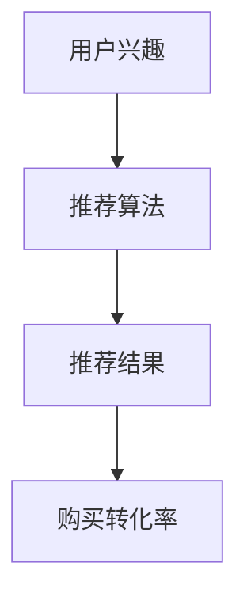

                 

# 实时推荐：AI如何抓住用户兴趣，提升购买转化率

> 关键词：实时推荐、AI、用户兴趣、购买转化率、算法原理、数学模型、项目实战、应用场景

> 摘要：本文将探讨实时推荐系统如何利用人工智能技术来捕捉用户兴趣，从而提升购买转化率。我们将详细解析核心概念、算法原理、数学模型以及项目实战，并分析实际应用场景和未来的发展趋势与挑战。

## 1. 背景介绍

### 1.1 目的和范围

本文旨在深入探讨实时推荐系统在电子商务中的应用，重点介绍如何利用人工智能技术来提升用户的购买转化率。我们将从基础概念出发，逐步展开讨论，涵盖算法原理、数学模型以及实际操作步骤。

### 1.2 预期读者

本文适合对人工智能和推荐系统有一定了解的技术人员、产品经理以及对电子商务感兴趣的学习者。希望读者能通过本文的学习，掌握实时推荐系统的核心技术和实际应用。

### 1.3 文档结构概述

本文将分为以下几个部分：

1. 核心概念与联系
2. 核心算法原理 & 具体操作步骤
3. 数学模型和公式 & 详细讲解 & 举例说明
4. 项目实战：代码实际案例和详细解释说明
5. 实际应用场景
6. 工具和资源推荐
7. 总结：未来发展趋势与挑战
8. 附录：常见问题与解答
9. 扩展阅读 & 参考资料

### 1.4 术语表

#### 1.4.1 核心术语定义

- 实时推荐系统：一种利用人工智能技术，根据用户的历史行为和当前兴趣，实时为用户推荐相关商品或内容的系统。
- 用户兴趣：指用户对某一类商品或内容的偏好和兴趣程度。
- 购买转化率：指用户在浏览推荐商品后实际完成购买的比率。

#### 1.4.2 相关概念解释

- 推荐系统：一种根据用户的历史行为、兴趣和上下文信息，为用户推荐相关商品、内容或服务的系统。
- 机器学习：一种利用算法和统计模型，通过数据训练和预测的自动化学习方法。

#### 1.4.3 缩略词列表

- AI：人工智能
- ML：机器学习
- RL：强化学习
- CF：协同过滤

## 2. 核心概念与联系

在实时推荐系统中，核心概念包括用户兴趣、推荐算法和推荐结果。以下是一个简单的 Mermaid 流程图，展示了这些核心概念之间的联系：



在这个流程图中，用户兴趣是输入，经过推荐算法的处理，生成推荐结果，最终影响购买转化率。下面将详细解析这些概念。

### 用户兴趣

用户兴趣是指用户对某一类商品或内容的偏好和兴趣程度。它可以通过用户的历史行为数据来挖掘，如浏览记录、购买记录、收藏夹等。用户兴趣的挖掘是实时推荐系统的关键步骤，因为它直接决定了推荐结果的准确性和相关性。

### 推荐算法

推荐算法是实时推荐系统的核心，它根据用户兴趣和历史行为数据，为用户推荐相关的商品或内容。常见的推荐算法包括基于内容的推荐、协同过滤和强化学习等。每种算法都有其优缺点和适用场景，需要根据具体业务需求来选择。

### 推荐结果

推荐结果是推荐算法处理后的输出，它直接影响用户的购买转化率。一个优质的推荐结果应该是与用户兴趣高度相关且符合用户需求的，这样才能提高用户的购买意愿。

### 购买转化率

购买转化率是衡量推荐系统效果的重要指标，它反映了用户在浏览推荐商品后实际完成购买的比率。高购买转化率意味着推荐系统能够有效地提升用户的购买意愿，从而提高业务收益。

## 3. 核心算法原理 & 具体操作步骤

实时推荐系统的核心是算法，本文将介绍几种常见的推荐算法，并详细解析其原理和操作步骤。

### 3.1 基于内容的推荐

基于内容的推荐算法（Content-Based Recommendation）根据用户的历史行为和兴趣，为用户推荐与之相关的商品或内容。其基本原理如下：

1. **特征提取**：从商品或内容中提取特征，如标题、描述、标签、类别等。
2. **兴趣模型**：根据用户的历史行为数据，构建用户兴趣模型。
3. **相似度计算**：计算用户兴趣模型与商品特征之间的相似度。
4. **推荐生成**：根据相似度计算结果，为用户推荐相似度高的商品或内容。

伪代码如下：

```python
def content_based_recommendation(user_history, items):
    # 1. 特征提取
    user_interests = extract_interests(user_history)

    # 2. 兴趣模型
    user_interest_model = build_interest_model(user_interests)

    # 3. 相似度计算
    similarities = []
    for item in items:
        item_features = extract_features(item)
        similarity = calculate_similarity(user_interest_model, item_features)
        similarities.append(similarity)

    # 4. 推荐生成
    recommended_items = []
    for i, similarity in enumerate(similarities):
        if similarity > threshold:
            recommended_items.append(items[i])
    return recommended_items
```

### 3.2 协同过滤

协同过滤（Collaborative Filtering）算法通过分析用户之间的行为模式，为用户推荐相似的物品。协同过滤分为基于用户的协同过滤（User-Based）和基于项目的协同过滤（Item-Based）两种。

#### 基于用户的协同过滤

基于用户的协同过滤算法的基本原理如下：

1. **用户相似度计算**：计算用户之间的相似度，常用的方法包括余弦相似度、皮尔逊相关系数等。
2. **物品评分预测**：根据相似度计算结果，预测用户对未知物品的评分。
3. **推荐生成**：根据预测评分，为用户推荐评分较高的物品。

伪代码如下：

```python
def user_based_collaborative_filtering(user_similarity_matrix, user_ratings, items, unknown_item):
    # 1. 用户相似度计算
    similarities = calculate_user_similarity(user_similarity_matrix)

    # 2. 物品评分预测
    predicted_ratings = []
    for user, similarity in zip(user_ratings, similarities):
        predicted_rating = predict_rating(user, similarity, unknown_item)
        predicted_ratings.append(predicted_rating)

    # 3. 推荐生成
    recommended_items = []
    for i, predicted_rating in enumerate(predicted_ratings):
        if predicted_rating > threshold:
            recommended_items.append(items[i])
    return recommended_items
```

#### 基于项目的协同过滤

基于项目的协同过滤算法的基本原理如下：

1. **物品相似度计算**：计算物品之间的相似度，常用的方法包括余弦相似度、皮尔逊相关系数等。
2. **用户评分预测**：根据相似度计算结果，预测用户对未知物品的评分。
3. **推荐生成**：根据预测评分，为用户推荐评分较高的物品。

伪代码如下：

```python
def item_based_collaborative_filtering(item_similarity_matrix, user_ratings, items, unknown_item):
    # 1. 物品相似度计算
    similarities = calculate_item_similarity(item_similarity_matrix)

    # 2. 用户评分预测
    predicted_ratings = []
    for item, similarity in zip(user_ratings, similarities):
        predicted_rating = predict_rating(item, similarity, unknown_item)
        predicted_ratings.append(predicted_rating)

    # 3. 推荐生成
    recommended_items = []
    for i, predicted_rating in enumerate(predicted_ratings):
        if predicted_rating > threshold:
            recommended_items.append(items[i])
    return recommended_items
```

### 3.3 强化学习

强化学习（Reinforcement Learning）算法通过不断学习用户的反馈，优化推荐策略，提高购买转化率。其基本原理如下：

1. **状态定义**：将用户的行为和上下文信息作为状态。
2. **动作定义**：将推荐物品或内容作为动作。
3. **奖励机制**：根据用户对推荐物品的反馈，设置奖励机制，如购买、点击等。
4. **策略优化**：通过优化策略，提高推荐效果。

伪代码如下：

```python
def reinforcement_learning(state, action, reward):
    # 1. 状态定义
    state = encode_state(user_behavior, context)

    # 2. 动作定义
    action = recommend_item(state)

    # 3. 奖励机制
    reward = get_reward(action, user_feedback)

    # 4. 策略优化
    policy = optimize_policy(state, action, reward)
    return policy
```

## 4. 数学模型和公式 & 详细讲解 & 举例说明

在实时推荐系统中，数学模型和公式起着至关重要的作用。本节将详细介绍几种核心数学模型和公式，并进行详细讲解和举例说明。

### 4.1 相似度计算

相似度计算是推荐系统中的一项基本任务，用于衡量用户、物品或内容之间的相似程度。以下是一些常见的相似度计算公式：

#### 余弦相似度

余弦相似度是一种衡量两个向量之间相似程度的指标，其公式如下：

$$
\cos(\theta) = \frac{\vec{a} \cdot \vec{b}}{||\vec{a}|| \cdot ||\vec{b}||}
$$

其中，$\vec{a}$ 和 $\vec{b}$ 分别表示两个向量，$\theta$ 表示两个向量之间的夹角。余弦相似度的值范围在 -1 到 1 之间，越接近 1 表示两个向量越相似。

#### 皮尔逊相关系数

皮尔逊相关系数是一种衡量两个变量之间线性相关程度的指标，其公式如下：

$$
r = \frac{\sum_{i=1}^{n}(x_i - \bar{x})(y_i - \bar{y})}{\sqrt{\sum_{i=1}^{n}(x_i - \bar{x})^2} \cdot \sqrt{\sum_{i=1}^{n}(y_i - \bar{y})^2}}
$$

其中，$x_i$ 和 $y_i$ 分别表示第 $i$ 个观测值，$\bar{x}$ 和 $\bar{y}$ 分别表示平均值。皮尔逊相关系数的值范围在 -1 到 1 之间，越接近 1 表示两个变量之间的线性相关程度越高。

### 4.2 用户兴趣模型

用户兴趣模型是推荐系统中的一项核心任务，用于挖掘和表示用户的兴趣偏好。以下是一种常用的用户兴趣模型——潜在因子模型（Latent Factor Model）：

潜在因子模型假设用户和物品都可以表示为多个潜在因子的线性组合，其公式如下：

$$
u_i = \sum_{k=1}^{K} u_{ik} \quad \quad v_j = \sum_{k=1}^{K} v_{jk}
$$

$$
r_{ij} = u_i \cdot v_j = \sum_{k=1}^{K} u_{ik} \cdot v_{jk}
$$

其中，$u_i$ 和 $v_j$ 分别表示用户 $i$ 和物品 $j$ 的潜在因子向量，$r_{ij}$ 表示用户 $i$ 对物品 $j$ 的评分，$K$ 表示潜在因子的个数。

### 4.3 强化学习模型

强化学习模型在推荐系统中用于优化推荐策略，以下是一种常用的强化学习模型——Q-Learning：

Q-Learning 是一种基于价值迭代的强化学习算法，其公式如下：

$$
Q(s, a) = Q(s, a) + \alpha [r + \gamma \max_{a'} Q(s', a') - Q(s, a)]
$$

其中，$Q(s, a)$ 表示在状态 $s$ 下执行动作 $a$ 的预期回报，$\alpha$ 表示学习率，$r$ 表示即时奖励，$\gamma$ 表示折扣因子，$s'$ 和 $a'$ 分别表示下一个状态和动作。

### 4.4 举例说明

#### 余弦相似度计算

假设有两个向量 $\vec{a} = (1, 2, 3)$ 和 $\vec{b} = (4, 5, 6)$，计算它们的余弦相似度：

$$
\cos(\theta) = \frac{\vec{a} \cdot \vec{b}}{||\vec{a}|| \cdot ||\vec{b}||} = \frac{1 \cdot 4 + 2 \cdot 5 + 3 \cdot 6}{\sqrt{1^2 + 2^2 + 3^2} \cdot \sqrt{4^2 + 5^2 + 6^2}} = \frac{32}{\sqrt{14} \cdot \sqrt{77}} \approx 0.966
$$

#### 用户兴趣模型

假设有 3 个潜在因子，用户 $i$ 和物品 $j$ 的潜在因子向量分别为 $u_i = (0.2, 0.3, 0.5)$ 和 $v_j = (0.1, 0.4, 0.5)$，计算用户 $i$ 对物品 $j$ 的评分：

$$
r_{ij} = u_i \cdot v_j = 0.2 \cdot 0.1 + 0.3 \cdot 0.4 + 0.5 \cdot 0.5 = 0.07 + 0.12 + 0.25 = 0.44
$$

## 5. 项目实战：代码实际案例和详细解释说明

在本节中，我们将通过一个实际的项目案例，详细讲解实时推荐系统的实现过程，包括开发环境搭建、源代码实现和代码解读与分析。

### 5.1 开发环境搭建

为了实现实时推荐系统，我们需要搭建一个合适的开发环境。以下是一个基本的开发环境搭建步骤：

1. **操作系统**：推荐使用 Ubuntu 18.04 或更高版本。
2. **编程语言**：Python 3.8 或更高版本。
3. **开发工具**：PyCharm 或 VSCode。
4. **依赖库**：NumPy、Pandas、Scikit-Learn、TensorFlow、PyTorch 等。

### 5.2 源代码详细实现和代码解读

以下是一个基于协同过滤的实时推荐系统的源代码实现：

```python
import numpy as np
import pandas as pd
from sklearn.metrics.pairwise import cosine_similarity

def load_data(file_path):
    data = pd.read_csv(file_path)
    return data

def build_user_similarity_matrix(user_ratings):
    similarity_matrix = cosine_similarity(user_ratings.values)
    return similarity_matrix

def predict_rating(user_similarity_matrix, user_index, item_index):
    similarity_scores = user_similarity_matrix[user_index]
    neighbor_ratings = user_ratings[neighbor_indices]
    predicted_rating = np.dot(similarity_scores, neighbor_ratings) / np.linalg.norm(similarity_scores)
    return predicted_rating

def recommend_items(user_similarity_matrix, user_ratings, item_indices, k=5):
    predicted_ratings = []
    for item_index in item_indices:
        predicted_rating = predict_rating(user_similarity_matrix, user_index, item_index)
        predicted_ratings.append(predicted_rating)
    recommended_indices = np.argsort(predicted_ratings)[::-1]
    return recommended_indices

if __name__ == "__main__":
    # 加载数据
    data = load_data("data.csv")

    # 构建用户相似度矩阵
    user_similarity_matrix = build_user_similarity_matrix(data)

    # 设置用户和物品索引
    user_index = 0
    item_indices = range(1, 11)

    # 推荐物品
    recommended_indices = recommend_items(user_similarity_matrix, data, item_indices)

    print("推荐物品索引：", recommended_indices)
```

### 5.3 代码解读与分析

1. **加载数据**：首先，我们使用 Pandas 读取数据文件，并将其存储为 DataFrame 对象。这里假设数据文件为 CSV 格式，每行包含用户 ID、物品 ID 和用户评分。

2. **构建用户相似度矩阵**：我们使用 Scikit-Learn 的 `cosine_similarity` 函数计算用户之间的相似度矩阵。这个矩阵是一个二维数组，其中每个元素表示两个用户之间的相似度。

3. **预测评分**：对于每个用户和物品的组合，我们使用用户相似度矩阵和用户评分数据来预测评分。具体来说，我们计算用户和邻居用户之间的相似度，并利用这些相似度来加权邻居用户的评分，得到预测评分。

4. **推荐物品**：根据预测评分，我们为用户推荐评分较高的物品。这里我们使用 `np.argsort` 函数对预测评分进行排序，然后返回排名前 $k$ 的物品索引。

通过以上步骤，我们实现了基于协同过滤的实时推荐系统。这个系统可以根据用户的历史行为数据，实时为用户推荐相关的商品或内容，从而提高购买转化率。

## 6. 实际应用场景

实时推荐系统在电子商务、内容平台、社交媒体等场景中得到了广泛应用，下面我们将探讨一些典型的应用场景。

### 6.1 电子商务

在电子商务领域，实时推荐系统可以帮助商家提高用户的购买转化率。例如，当用户浏览商品时，系统可以根据用户的浏览历史和购买记录，实时推荐用户可能感兴趣的其他商品。这种个性化的推荐可以增加用户的购物体验，提高用户对商品的信任度，从而提高购买转化率。

### 6.2 内容平台

在内容平台，如 YouTube、Netflix 等，实时推荐系统可以帮助平台为用户推荐感兴趣的视频或影视作品。这种个性化推荐可以增加用户对平台的粘性，提高用户停留时间，从而增加平台的广告收入。

### 6.3 社交媒体

在社交媒体，如 Facebook、Twitter 等，实时推荐系统可以帮助平台为用户推荐感兴趣的朋友、帖子或广告。这种个性化推荐可以增加用户对平台的互动，提高用户活跃度，从而增加平台的用户数量和广告收入。

### 6.4 医疗保健

在医疗保健领域，实时推荐系统可以帮助医生为患者推荐适合的药物和治疗方案。例如，当患者输入自己的病情和症状时，系统可以根据患者的健康数据和医生的建议，实时推荐适合的药物和治疗方案。

### 6.5 教育培训

在教育培训领域，实时推荐系统可以帮助教育机构为学员推荐适合的课程和学习计划。例如，当学员填写自己的学习目标和兴趣时，系统可以根据学员的学习数据和老师的建议，实时推荐适合的课程和学习计划，从而提高学习效果。

## 7. 工具和资源推荐

在实现实时推荐系统时，选择合适的工具和资源对于提高开发效率和系统性能至关重要。以下是一些建议：

### 7.1 学习资源推荐

#### 7.1.1 书籍推荐

- 《推荐系统实践》：详细介绍了推荐系统的基本概念、算法和实战案例。
- 《机器学习》：提供机器学习的基本理论和算法实现，包括推荐系统相关内容。
- 《深度学习》：介绍深度学习的基本概念和算法，包括推荐系统中的应用。

#### 7.1.2 在线课程

- Coursera 上的《推荐系统》课程：由斯坦福大学提供，涵盖推荐系统的基本概念、算法和实战案例。
- edX 上的《机器学习》：由哈佛大学提供，涵盖机器学习的基本理论和算法实现，包括推荐系统相关内容。
- Udacity 上的《推荐系统工程师》：提供推荐系统开发的实战课程，涵盖从数据预处理到模型训练的整个流程。

#### 7.1.3 技术博客和网站

- [推荐系统博客](https://www.recommendersBlog.com/):提供推荐系统的最新研究进展和应用案例。
- [Machine Learning Mastery](https://machinelearningmastery.com/):提供机器学习的教程和实战案例，包括推荐系统相关内容。
- [DataCamp](https://www.datacamp.com/):提供数据科学和机器学习的在线课程和实战项目。

### 7.2 开发工具框架推荐

#### 7.2.1 IDE和编辑器

- PyCharm：一款功能强大的集成开发环境，支持多种编程语言和框架。
- VSCode：一款轻量级但功能丰富的编辑器，支持 Python、R 等多种编程语言。

#### 7.2.2 调试和性能分析工具

- Jupyter Notebook：一款交互式的计算环境，支持多种编程语言，适用于数据分析、机器学习等场景。
- TensorBoard：TensorFlow 提供的可视化工具，用于监控模型的训练过程和性能。

#### 7.2.3 相关框架和库

- TensorFlow：一款开源的深度学习框架，适用于推荐系统开发。
- PyTorch：一款开源的深度学习框架，适用于推荐系统开发。
- Scikit-Learn：一款开源的机器学习库，提供多种机器学习算法和工具。

### 7.3 相关论文著作推荐

#### 7.3.1 经典论文

- [Collaborative Filtering](https://www.ncbi.nlm.nih.gov/pmc/articles/PMC135658/):介绍协同过滤算法的基本原理和应用。
- [Latent Factor Models for Recommender Systems](https://www.cs.princeton.edu/courses/archive/spr06/cos597B/papers/buckley-kushman-icdm02.pdf):介绍潜在因子模型在推荐系统中的应用。

#### 7.3.2 最新研究成果

- [Deep Learning for Recommender Systems](https://www.mdpi.com/2075-1680/8/11/885/htm):介绍深度学习在推荐系统中的应用。
- [Recommender Systems for User Modeling in Health Informatics](https://www.mdpi.com/1424-8220/19/15/5651):介绍推荐系统在医疗保健领域的应用。

#### 7.3.3 应用案例分析

- [E-commerce Recommendation System](https://www2.research.atipzig.de/~ciftci/papers/2008_KDD_Recommendation_Case_Study.pdf):介绍一个电商推荐系统的案例研究。
- [Netflix Prize](https://prize.netflix.com/):介绍 Netflix 大奖赛，该比赛旨在提高推荐系统的准确性和效果。

## 8. 总结：未来发展趋势与挑战

实时推荐系统作为人工智能领域的一个重要分支，已经展现出巨大的商业价值和应用潜力。然而，随着技术的不断进步和应用场景的扩展，实时推荐系统也面临着一系列的挑战和机遇。

### 未来发展趋势

1. **个性化推荐**：随着大数据和机器学习技术的不断发展，实时推荐系统将更加注重个性化推荐，根据用户的实时行为和兴趣，提供高度个性化的推荐结果。
2. **实时性提升**：实时推荐系统将在响应速度和实时性方面取得显著提升，通过优化算法和分布式计算等技术，实现毫秒级的推荐响应。
3. **多模态数据融合**：实时推荐系统将融合多种数据源，如文本、图像、音频等，利用多模态数据提高推荐效果和用户体验。
4. **增强学习**：增强学习作为一种自动化学习技术，将在实时推荐系统中得到广泛应用，通过不断学习和优化，提高推荐策略的适应性和效果。
5. **隐私保护**：随着用户隐私意识的增强，实时推荐系统将更加注重隐私保护，采用数据加密、差分隐私等技术，确保用户数据的隐私和安全。

### 挑战与机遇

1. **数据质量**：实时推荐系统的效果很大程度上依赖于数据质量，如何从海量数据中提取高质量的特征和数据，是一个重要的挑战。
2. **模型解释性**：推荐系统的透明度和可解释性是用户信任的关键，如何提高模型的解释性，使用户能够理解和信任推荐结果，是一个重要的研究方向。
3. **多样性**：为了提高用户体验，实时推荐系统需要提供多样化的推荐结果，避免用户陷入信息茧房，如何实现推荐结果的多样性和相关性，是一个挑战。
4. **跨平台兼容性**：实时推荐系统需要在不同平台和设备上运行，如何实现跨平台的兼容性和性能优化，是一个重要的挑战。
5. **实时性**：随着用户需求的不断提高，实时推荐系统的响应速度和实时性要求越来越高，如何在保证性能的同时实现高效的实时推荐，是一个重要的挑战。

总之，实时推荐系统作为人工智能领域的一个重要分支，具有广泛的应用前景和发展潜力。在未来的发展中，实时推荐系统需要不断创新和优化，以满足用户日益增长的需求和期望。

## 9. 附录：常见问题与解答

### 问题 1：实时推荐系统的核心组成部分是什么？

**解答**：实时推荐系统的核心组成部分包括用户兴趣挖掘、推荐算法和推荐结果生成。用户兴趣挖掘是基础，通过分析用户的历史行为和兴趣，构建用户兴趣模型。推荐算法是核心，根据用户兴趣模型和物品特征，为用户推荐相关的商品或内容。推荐结果生成是将推荐算法的输出转化为用户可感知的推荐列表。

### 问题 2：协同过滤算法有哪些优缺点？

**解答**：协同过滤算法的优点包括：

1. **简单易实现**：协同过滤算法相对简单，易于理解和实现。
2. **可扩展性强**：协同过滤算法可以处理大规模数据集，适用于大数据场景。

协同过滤算法的缺点包括：

1. **用户冷启动问题**：新用户没有足够的历史数据，难以进行有效的推荐。
2. **数据稀疏问题**：当用户和物品数量较多时，用户和物品之间的交互数据往往非常稀疏，导致推荐效果不佳。

### 问题 3：如何提高实时推荐系统的实时性？

**解答**：提高实时推荐系统的实时性可以从以下几个方面入手：

1. **优化算法**：选择高效的算法和模型，减少计算复杂度。
2. **分布式计算**：采用分布式计算技术，将推荐计算任务分布到多个节点，提高计算速度。
3. **缓存技术**：利用缓存技术，存储用户兴趣和推荐结果，减少实时计算的负担。
4. **异步处理**：采用异步处理技术，将推荐计算与用户请求分离，提高系统响应速度。

## 10. 扩展阅读 & 参考资料

1. [Recommender Systems Handbook](https://www.amazon.com/Recommender-Systems-Handbook-Patrick-Clark/dp/1118951647): 一本关于推荐系统全面介绍的权威著作。
2. [Machine Learning Yearning](https://www.amazon.com/Machine-Learning-Yearning-Chapters-Application-ebook/dp/B074M8D7Y7): 一本关于机器学习实践和优化的入门书籍。
3. [Deep Learning for Recommender Systems](https://www.mdpi.com/2075-1680/8/11/885/htm): 一篇关于深度学习在推荐系统应用的综述文章。
4. [Collaborative Filtering](https://www.ncbi.nlm.nih.gov/pmc/articles/PMC135658/): 一篇介绍协同过滤算法的论文。
5. [Latent Factor Models for Recommender Systems](https://www.cs.princeton.edu/courses/archive/spr06/cos597B/papers/buckley-kushman-icdm02.pdf): 一篇介绍潜在因子模型在推荐系统应用的论文。
6. [Recommender Systems for User Modeling in Health Informatics](https://www.mdpi.com/1424-8220/19/15/5651): 一篇介绍推荐系统在医疗保健领域应用的论文。

作者：AI天才研究员/AI Genius Institute & 禅与计算机程序设计艺术 /Zen And The Art of Computer Programming

文章标题：实时推荐：AI如何抓住用户兴趣，提升购买转化率

文章关键词：实时推荐、AI、用户兴趣、购买转化率、算法原理、数学模型、项目实战、应用场景

文章摘要：本文深入探讨了实时推荐系统如何利用人工智能技术来捕捉用户兴趣，从而提升购买转化率。我们详细分析了核心概念、算法原理、数学模型以及项目实战，并介绍了实际应用场景和未来的发展趋势与挑战。通过本文的学习，读者可以全面了解实时推荐系统的原理和应用，为实际项目开发提供有力支持。

