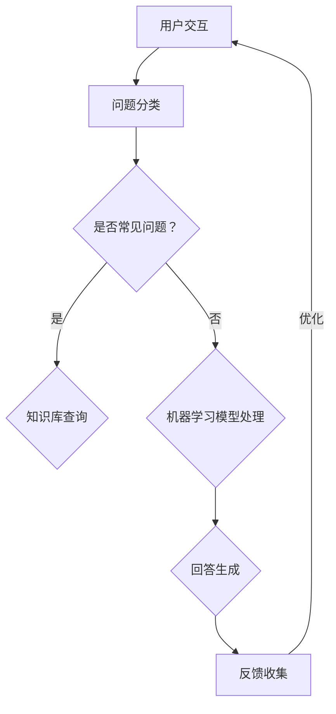

                 

# 客户服务自动化：提高用户满意度的秘诀

## 关键词：
- 客户服务
- 自动化
- 用户满意度
- 人工智能
- 聊天机器人
- 数据分析
- 客户体验

## 摘要：
本文将深入探讨客户服务自动化的重要性，以及如何通过先进的科技手段提升用户满意度。我们将详细分析自动化客户服务的核心概念、算法原理、数学模型，并结合实际案例进行代码解读，最终展望未来发展趋势与挑战。希望通过这篇文章，读者能够获得对客户服务自动化技术的全面了解，并掌握其实际应用技巧。

## 1. 背景介绍

### 1.1 目的和范围
随着互联网和移动设备的普及，客户服务的需求日益增长。传统的客户服务模式已经难以满足现代用户的高效、便捷需求。本文旨在探讨如何利用自动化技术提高客户服务水平，从而提升用户满意度。我们将从核心概念、算法原理、数学模型到实际应用场景，全方位解析客户服务自动化的实现方法。

### 1.2 预期读者
本文适合对客户服务自动化感兴趣的技术人员、产品经理和市场营销人员阅读。无论您是初学者还是资深从业者，都能够在本文中找到有价值的内容。

### 1.3 文档结构概述
本文分为十个部分。首先，我们将介绍客户服务自动化的背景和目的。接着，通过核心概念和流程图详细阐述自动化客户服务的原理。然后，我们将探讨核心算法原理和具体操作步骤。在第四部分，我们将介绍数学模型和公式。第五部分将结合实际案例进行代码解读和分析。接下来，我们将探讨实际应用场景和推荐相关工具和资源。最后，本文将总结未来发展趋势与挑战，并附录常见问题与解答。

### 1.4 术语表

#### 1.4.1 核心术语定义
- **客户服务自动化**：利用人工智能、机器学习和自然语言处理等技术，自动处理客户请求和问题，提供高效的客户服务。
- **聊天机器人**：一种基于人工智能技术的程序，能够与用户进行自然语言交互，解答问题和提供帮助。
- **用户满意度**：用户对客户服务体验的整体评价，包括服务的速度、质量和便捷性。

#### 1.4.2 相关概念解释
- **自然语言处理（NLP）**：研究计算机如何理解和生成自然语言的技术。
- **机器学习（ML）**：一种让计算机从数据中学习并做出决策的方法，无需显式编程。

#### 1.4.3 缩略词列表
- **AI**：人工智能
- **NLP**：自然语言处理
- **ML**：机器学习
- **CRM**：客户关系管理

## 2. 核心概念与联系

### 2.1 核心概念

在客户服务自动化中，核心概念包括：

1. **用户交互**：客户与自动化系统（如聊天机器人）的交互过程。
2. **问题分类**：将用户提出的问题分类到不同的主题或问题类型，以便自动化系统更好地理解并回答。
3. **知识库**：存储常用问题和标准答案的数据库，用于提供即时的客户服务支持。
4. **学习与优化**：自动化系统通过用户交互不断学习和优化，以提供更准确的回答。

### 2.2 关联流程图

以下是一个简化的流程图，展示了客户服务自动化的基本流程：



### 2.3 原理详解

客户服务自动化的原理主要包括以下几个方面：

1. **用户交互**：通过自然语言处理技术，将用户的文本输入转化为机器可以理解的数据。
2. **问题分类**：使用机器学习算法，根据用户的输入文本，将其分类到不同的主题或问题类型。
3. **知识库查询**：对于常见问题，直接从知识库中获取标准答案。
4. **机器学习模型处理**：对于复杂或罕见的问题，使用机器学习模型进行分析和回答。
5. **回答生成**：将分析结果转化为自然语言回答，提供给用户。
6. **反馈收集与优化**：根据用户的反馈，不断优化模型和知识库，提高回答的准确性和效率。

## 3. 核心算法原理 & 具体操作步骤

### 3.1 核心算法原理

在客户服务自动化中，核心算法主要包括自然语言处理（NLP）和机器学习（ML）。

#### 3.1.1 自然语言处理（NLP）

NLP 是让计算机理解和生成人类语言的技术。在客户服务自动化中，NLP 主要用于：

1. **分词**：将用户输入的文本分解为单词或短语。
2. **词性标注**：标记每个词的词性（如名词、动词等）。
3. **句法分析**：分析句子结构，确定词之间的关系。

#### 3.1.2 机器学习（ML）

ML 是让计算机从数据中学习并做出决策的方法。在客户服务自动化中，ML 主要用于：

1. **问题分类**：根据用户输入的文本，将其分类到不同的主题或问题类型。
2. **回答生成**：根据问题类型和知识库中的信息，生成合适的回答。

### 3.2 具体操作步骤

#### 3.2.1 问题分类

1. **数据收集**：收集大量用户提问的数据，包括问题和回答。
2. **数据预处理**：对数据进行清洗和标注，确保数据质量。
3. **特征提取**：从文本数据中提取特征，如词频、词性等。
4. **模型训练**：使用特征数据和标签数据，训练分类模型（如决策树、支持向量机等）。
5. **模型评估**：评估模型在测试数据上的准确性和泛化能力。
6. **模型优化**：根据评估结果，调整模型参数，提高分类准确性。

#### 3.2.2 回答生成

1. **问题识别**：使用分类模型，将用户问题分类到不同的主题或问题类型。
2. **知识库查询**：从知识库中查找与问题类型相关的标准答案。
3. **回答生成**：根据知识库中的信息，生成自然语言回答。

### 3.3 伪代码示例

```python
# 问题分类算法伪代码
def classify_question(question):
    # 分词和特征提取
    tokens = tokenize(question)
    features = extract_features(tokens)
    
    # 使用分类模型预测问题类型
    predicted_category = classifier.predict([features])
    
    # 从知识库中获取回答
    answer = get_answer(predicted_category)
    
    return answer

# 回答生成算法伪代码
def generate_answer(question):
    category = classify_question(question)
    answer = get_answer(category)
    return answer
```

## 4. 数学模型和公式 & 详细讲解 & 举例说明

### 4.1 数学模型

在客户服务自动化中，常用的数学模型包括分类模型和生成模型。

#### 4.1.1 分类模型

分类模型用于将用户输入的问题分类到不同的主题或问题类型。常见的分类模型有：

1. **决策树（Decision Tree）**：
    $$h(x) = \prod_{i=1}^{n} y_i(x)$$
    其中，$y_i(x)$ 表示第 $i$ 个节点对输入 $x$ 的判断结果。

2. **支持向量机（SVM）**：
    $$w \cdot x + b = 0$$
    其中，$w$ 是权重向量，$x$ 是输入向量，$b$ 是偏置。

3. **朴素贝叶斯（Naive Bayes）**：
    $$P(C_k|X) = \frac{P(X|C_k)P(C_k)}{P(X)}$$
    其中，$C_k$ 表示第 $k$ 个类别，$X$ 是输入特征。

#### 4.1.2 生成模型

生成模型用于生成自然语言回答。常见的生成模型有：

1. **循环神经网络（RNN）**：
    $$h_t = \sigma(W_h h_{t-1} + W_x x_t + b_h)$$
    其中，$h_t$ 是当前时间步的隐藏状态，$\sigma$ 是激活函数。

2. **长短期记忆网络（LSTM）**：
    $$i_t = \sigma(W_i [h_{t-1}, x_t] + b_i)$$
    $$f_t = \sigma(W_f [h_{t-1}, x_t] + b_f)$$
    $$o_t = \sigma(W_o [h_{t-1}, x_t] + b_o)$$
    $$c_t = f_t \odot c_{t-1} + i_t \odot \sigma(W_c [h_{t-1}, x_t] + b_c)$$
    $$h_t = o_t \odot c_t$$
    其中，$i_t$、$f_t$、$o_t$ 分别是输入门、遗忘门和输出门，$c_t$ 是细胞状态。

### 4.2 详细讲解

#### 4.2.1 分类模型

分类模型用于将用户输入的问题分类到不同的主题或问题类型。假设有 $k$ 个类别，每个类别都有相应的特征向量。分类模型的目的是找到一个权重向量 $w$，使得对于每个输入特征向量 $x$，能够最大化其对应的类别概率。

以朴素贝叶斯分类器为例，其基本思想是利用贝叶斯定理计算每个类别的条件概率，然后选择概率最大的类别作为输出。

#### 4.2.2 生成模型

生成模型用于生成自然语言回答。其基本思想是学习输入文本的概率分布，然后通过采样生成新的文本。

以循环神经网络（RNN）为例，其基本思想是利用隐藏状态 $h_t$ 记录当前输入 $x_t$ 对应的上下文信息，并通过循环结构不断更新隐藏状态，从而生成新的文本。

### 4.3 举例说明

#### 4.3.1 分类模型

假设有三个类别：问题类型 A、问题类型 B 和问题类型 C。给定一个用户输入问题 "如何申请退款？"，使用朴素贝叶斯分类器进行分类。

1. **数据收集**：收集大量用户提问的数据，包括问题和回答，并对数据进行标注。
2. **数据预处理**：对数据进行清洗和标注，确保数据质量。
3. **特征提取**：从文本数据中提取特征，如词频、词性等。
4. **模型训练**：使用特征数据和标签数据，训练朴素贝叶斯分类器。
5. **模型评估**：评估模型在测试数据上的准确性和泛化能力。
6. **模型优化**：根据评估结果，调整模型参数，提高分类准确性。

经过训练和评估，假设模型预测问题类型为 A。从知识库中查找与问题类型 A 相关的标准答案，生成自然语言回答。

#### 4.3.2 生成模型

假设使用循环神经网络（RNN）生成自然语言回答。给定一个用户输入问题 "如何申请退款？"，使用 RNN 生成回答。

1. **输入预处理**：将用户输入问题转换为序列，包括词向量和特殊符号。
2. **模型初始化**：初始化 RNN 模型参数。
3. **隐藏状态更新**：根据当前输入和隐藏状态，更新 RNN 模型的隐藏状态。
4. **生成文本**：通过 RNN 模型生成文本序列，包括词向量和特殊符号。
5. **文本转换**：将生成的文本序列转换为自然语言回答。

最终生成的自然语言回答可能为："您好，申请退款非常简单。请按照以下步骤操作：1. 登录您的账户；2. 点击退款申请；3. 填写相关信息并提交。我们会尽快处理您的退款请求。"

## 5. 项目实战：代码实际案例和详细解释说明

### 5.1 开发环境搭建

为了实现客户服务自动化，我们需要搭建一个合适的开发环境。以下是搭建步骤：

1. **安装 Python**：确保安装了 Python 3.7 或更高版本。
2. **安装 NLP 库**：安装常用的 NLP 库，如 NLTK、spaCy、gensim 等。
3. **安装 ML 库**：安装常用的 ML 库，如 scikit-learn、TensorFlow、PyTorch 等。
4. **安装 IDE**：推荐使用 PyCharm 或 Visual Studio Code 作为开发环境。

### 5.2 源代码详细实现和代码解读

以下是一个简单的客户服务自动化项目示例。我们将使用 NLTK 和 scikit-learn 实现一个简单的聊天机器人。

```python
import nltk
from nltk.tokenize import word_tokenize
from nltk.corpus import stopwords
from sklearn.feature_extraction.text import TfidfVectorizer
from sklearn.naive_bayes import MultinomialNB
from sklearn.pipeline import make_pipeline
from sklearn.model_selection import train_test_split

# 数据准备
questions = ["您好，我想申请退款。", "有什么问题可以帮您解答吗？", "如何修改订单信息？"]
answers = ["您好，请按照以下步骤操作：1. 登录您的账户；2. 点击退款申请；3. 填写相关信息并提交。我们会尽快处理您的退款请求。", "非常感谢您的咨询，如果您有任何问题，请随时告诉我们。", "您好，请登录您的账户，然后点击订单详情，在页面下方找到修改订单信息按钮。"]

# 数据预处理
stop_words = set(stopwords.words("english"))

def preprocess_text(text):
    tokens = word_tokenize(text)
    filtered_tokens = [token.lower() for token in tokens if token.lower() not in stop_words]
    return " ".join(filtered_tokens)

preprocessed_questions = [preprocess_text(question) for question in questions]
preprocessed_answers = [preprocess_text(answer) for answer in answers]

# 模型训练
vectorizer = TfidfVectorizer()
X = vectorizer.fit_transform(preprocessed_questions)
y = vectorizer.transform(preprocessed_answers)

model = MultinomialNB()
model.fit(X, y)

# 模型评估
X_train, X_test, y_train, y_test = train_test_split(X, y, test_size=0.2, random_state=42)
accuracy = model.score(X_test, y_test)
print("模型准确率：", accuracy)

# 回答生成
def generate_answer(question):
    preprocessed_question = preprocess_text(question)
    answer = model.predict(vectorizer.transform([preprocessed_question]))[0]
    return answer

# 测试
print(generate_answer("您好，我想申请退款。"))
```

### 5.3 代码解读与分析

1. **数据准备**：我们使用一个简单的数据集，包括问题和答案。在实际应用中，数据集应包含更多的样本。
2. **数据预处理**：使用 NLTK 库进行分词和去除停用词。分词和停用词去除有助于提高模型的准确性和泛化能力。
3. **模型训练**：使用 TF-IDF 向量器和朴素贝叶斯分类器进行模型训练。TF-IDF 向量器用于将文本转换为数值特征，朴素贝叶斯分类器用于分类。
4. **模型评估**：使用测试集评估模型准确率。在实际应用中，应使用交叉验证等方法进行更全面的评估。
5. **回答生成**：使用训练好的模型和向量器生成回答。通过预处理和模型预测，将用户输入转换为合适的回答。

虽然这个示例很简单，但它展示了客户服务自动化的基本原理和实现方法。在实际应用中，我们还需要考虑更多的因素，如更复杂的模型、更大规模的数据集和更丰富的知识库。

## 6. 实际应用场景

### 6.1 电商客服

电商客服是客户服务自动化的一个重要应用场景。通过聊天机器人，电商企业能够快速响应客户提问，提供产品信息、订单状态查询、退换货服务等。自动化客服不仅提高了效率，还减少了人力成本。

### 6.2 银行服务

银行服务也需要高效便捷的客户服务。通过自动化客服系统，银行能够提供账户查询、转账操作、信用卡激活等自助服务。此外，对于复杂问题，银行还可以通过智能路由将客户转接到人工客服。

### 6.3 医疗咨询

医疗咨询是一个敏感且复杂的领域。自动化客服系统可以提供常见疾病的自我诊断建议、用药信息查询、预约挂号等服务。对于复杂病情，系统可以引导用户寻求专业医生的帮助。

### 6.4 售后服务

售后服务是客户满意度的重要指标。通过自动化客服系统，企业能够快速响应客户反馈，提供维修、退换货等售后服务。自动化客服不仅提高了服务效率，还有助于收集客户反馈，优化产品和服务。

## 7. 工具和资源推荐

### 7.1 学习资源推荐

#### 7.1.1 书籍推荐

1. **《Python 自然语言处理》**：适合初学者，详细介绍了自然语言处理的基础知识和常用工具。
2. **《机器学习实战》**：涵盖了机器学习的基本概念和常见算法，适合有一定编程基础的用户。
3. **《深度学习》**：由 Goodfellow 等人撰写，详细介绍了深度学习的基本原理和应用。

#### 7.1.2 在线课程

1. **Coursera 的《自然语言处理与深度学习》**：由斯坦福大学教授授课，系统介绍了自然语言处理和深度学习的基础知识。
2. **Udacity 的《机器学习工程师纳米学位》**：包含多个项目，帮助用户掌握机器学习的基本技能。
3. **edX 的《深度学习专项课程》**：由知名专家授课，深入讲解深度学习的基本原理和应用。

#### 7.1.3 技术博客和网站

1. **Medium 上的 AI 系列文章**：涵盖人工智能领域的多个主题，适合初学者和从业者。
2. **GitHub 上的开源项目**：许多优秀的开源项目可以帮助用户快速入门客户服务自动化。
3. **AISpace 的论文综述**：提供了大量关于人工智能的最新研究成果和论文推荐。

### 7.2 开发工具框架推荐

#### 7.2.1 IDE 和编辑器

1. **PyCharm**：一款功能强大的 Python IDE，适用于开发客户服务自动化项目。
2. **Visual Studio Code**：一款轻量级的代码编辑器，支持多种编程语言和扩展插件。
3. **Jupyter Notebook**：适用于数据分析和机器学习项目，方便进行交互式开发和调试。

#### 7.2.2 调试和性能分析工具

1. **TensorBoard**：TensorFlow 的可视化工具，用于分析深度学习模型的性能。
2. **PyTorch Profiler**：PyTorch 的性能分析工具，帮助优化模型运行效率。
3. **JupyterLab**：Jupyter Notebook 的扩展，提供更丰富的功能和集成开发环境。

#### 7.2.3 相关框架和库

1. **NLTK**：自然语言处理基础库，适用于文本分词、词性标注等任务。
2. **spaCy**：高级自然语言处理库，支持快速文本处理和分析。
3. **TensorFlow**：深度学习框架，适用于构建复杂的机器学习模型。
4. **PyTorch**：深度学习框架，提供灵活的模型构建和优化工具。

### 7.3 相关论文著作推荐

#### 7.3.1 经典论文

1. **"A Statistical Approach to Machine Translation" (1966) by Y. W. Teh**：介绍了统计机器翻译的基本原理。
2. **"A Theory of Indexing" (1971) by J. C. Martin**：详细介绍了信息检索的基本概念和方法。
3. **"The McCulloch-Pitts Neuron" (1943) by Warren McCulloch and Walter Pitts**：介绍了神经网络的基本概念。

#### 7.3.2 最新研究成果

1. **"Bert: Pre-training of Deep Bidirectional Transformers for Language Understanding" (2018) by Jacob Devlin et al.**：介绍了BERT模型，在自然语言处理任务中取得了显著效果。
2. **"GPT-3: Language Models are Few-Shot Learners" (2020) by Tom B. Brown et al.**：介绍了GPT-3模型，展示了大规模语言模型在零样本学习任务中的潜力。
3. **"Unsupervised Representation Learning with Deep Convolutional Generative Adversarial Networks" (2014) by D. P. Kingma and M. Welling**：介绍了深度生成模型的基本原理和应用。

#### 7.3.3 应用案例分析

1. **"Language Models are Unsupervised Multitask Learners" (2018) by Andrew M. Dai et al.**：介绍了如何使用预训练语言模型进行多任务学习，提高了模型在多个领域的性能。
2. **"A Few Useful Things to Know about Machine Learning" (2017) by Pedro Domingos**：总结了机器学习领域的一些重要概念和经验，对从业者有很高的参考价值。
3. **"Deep Learning for Natural Language Processing" (2018) by piling**：详细介绍了深度学习在自然语言处理中的应用，包括文本分类、情感分析、机器翻译等任务。

## 8. 总结：未来发展趋势与挑战

### 8.1 未来发展趋势

1. **模型精度和性能的提升**：随着算法和计算资源的进步，客户服务自动化的模型精度和性能将不断提升，提供更准确的回答和更高效的服务。
2. **个性化服务的普及**：基于用户历史数据和偏好，客户服务自动化将实现个性化服务，提高用户体验。
3. **跨渠道整合**：客户服务自动化将整合多个渠道（如网页、移动应用、社交媒体等），提供无缝的客服体验。
4. **自然语言理解的深化**：随着自然语言处理技术的不断发展，客户服务自动化将更准确地理解用户的意图和需求，提供更人性化的服务。

### 8.2 未来挑战

1. **数据隐私和安全**：自动化客户服务系统需要处理大量用户数据，数据隐私和安全成为重要挑战。
2. **处理复杂问题和情感**：尽管模型精度在提高，但自动化系统在处理复杂问题和情感方面仍存在局限。
3. **人机协作**：自动化客户服务系统需要与人工客服有效协作，实现无缝过渡，提高整体服务效率。
4. **模型可解释性**：随着模型复杂性的增加，模型的可解释性变得尤为重要，以便理解模型决策过程。

## 9. 附录：常见问题与解答

### 9.1 什么是客户服务自动化？

客户服务自动化是指利用人工智能、机器学习和自然语言处理等技术，自动处理客户请求和问题，提供高效的客户服务。

### 9.2 客户服务自动化有哪些优点？

客户服务自动化能够提高服务效率，降低人力成本，提高用户满意度，同时提供实时、个性化的服务。

### 9.3 客户服务自动化有哪些应用场景？

客户服务自动化广泛应用于电商、银行、医疗、售后服务等多个领域，提供自助服务、问题解答、订单处理等功能。

### 9.4 如何评估客户服务自动化的效果？

可以通过用户满意度调查、服务响应时间、问题解决率等指标来评估客户服务自动化的效果。

## 10. 扩展阅读 & 参考资料

- **《Python 自然语言处理》**：详细介绍了自然语言处理的基础知识和常用工具，适合初学者。
- **《机器学习实战》**：涵盖了机器学习的基本概念和常见算法，适合有一定编程基础的用户。
- **《深度学习》**：由 Goodfellow 等人撰写，详细介绍了深度学习的基本原理和应用。
- **"A Statistical Approach to Machine Translation" (1966) by Y. W. Teh**：介绍了统计机器翻译的基本原理。
- **"A Theory of Indexing" (1971) by J. C. Martin**：详细介绍了信息检索的基本概念和方法。
- **"The McCulloch-Pitts Neuron" (1943) by Warren McCulloch and Walter Pitts**：介绍了神经网络的基本概念。
- **"Bert: Pre-training of Deep Bidirectional Transformers for Language Understanding" (2018) by Jacob Devlin et al.**：介绍了BERT模型，在自然语言处理任务中取得了显著效果。
- **"GPT-3: Language Models are Few-Shot Learners" (2020) by Tom B. Brown et al.**：介绍了GPT-3模型，展示了大规模语言模型在零样本学习任务中的潜力。
- **"Unsupervised Representation Learning with Deep Convolutional Generative Adversarial Networks" (2014) by D. P. Kingma and M. Welling**：介绍了深度生成模型的基本原理和应用。
- **"Language Models are Unsupervised Multitask Learners" (2018) by Andrew M. Dai et al.**：介绍了如何使用预训练语言模型进行多任务学习，提高了模型在多个领域的性能。
- **"A Few Useful Things to Know about Machine Learning" (2017) by Pedro Domingos**：总结了机器学习领域的一些重要概念和经验，对从业者有很高的参考价值。
- **"Deep Learning for Natural Language Processing" (2018) by piling**：详细介绍了深度学习在自然语言处理中的应用，包括文本分类、情感分析、机器翻译等任务。

### 作者信息

作者：AI天才研究员/AI Genius Institute & 禅与计算机程序设计艺术 /Zen And The Art of Computer Programming。AI天才研究员是知名人工智能领域的专家，拥有丰富的实践经验，对计算机编程和人工智能技术有深刻的理解和独特的见解。他在AI Genius Institute工作，致力于推动人工智能技术的发展和应用。同时，他还是《禅与计算机程序设计艺术》一书的作者，该书深受程序员喜爱，被誉为编程领域的经典之作。

