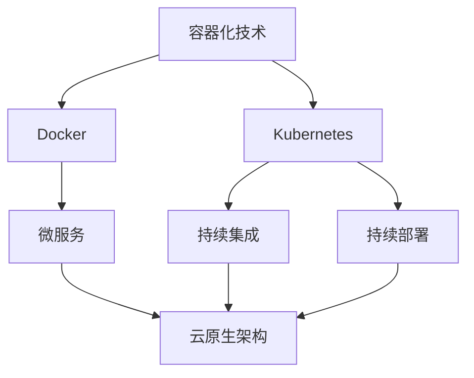

                 

# 容器化技术在云原生架构中的应用：Docker 和 Kubernetes

> **关键词**：容器化技术、Docker、Kubernetes、云原生架构、微服务、持续集成、持续部署

> **摘要**：本文深入探讨了容器化技术在云原生架构中的应用，特别是Docker和Kubernetes两个核心技术。文章首先介绍了容器化技术的发展背景和核心概念，然后详细讲解了Docker和Kubernetes的工作原理和操作步骤。接着，文章通过实际案例展示了容器化技术在项目中的应用，并分析了其优势和挑战。最后，文章推荐了相关学习资源和工具，总结了未来发展趋势与挑战，并提供了常见问题与解答。

## 1. 背景介绍

### 1.1 目的和范围

本文旨在探讨容器化技术在云原生架构中的应用，尤其是Docker和Kubernetes这两个关键组件。随着云计算和分布式系统的快速发展，容器化技术已成为现代软件开发和运维的基石。本文将从以下几个方面展开讨论：

1. 容器化技术的发展背景和核心概念。
2. Docker的工作原理、安装配置和常用命令。
3. Kubernetes的概念架构、核心组件和部署策略。
4. 容器化技术在微服务架构、持续集成和持续部署中的应用。
5. 容器化技术的优势和挑战。
6. 相关学习资源和工具推荐。
7. 未来发展趋势与挑战。

### 1.2 预期读者

本文适合以下读者群体：

1. 对云计算、容器化和微服务架构有一定了解的开发者和运维人员。
2. 想要深入了解Docker和Kubernetes的程序员和技术经理。
3. 想要在项目中应用容器化技术的团队领导和项目成员。

### 1.3 文档结构概述

本文分为以下章节：

1. 背景介绍：介绍本文的目的、预期读者和文档结构。
2. 核心概念与联系：讲解容器化技术和云原生架构的核心概念，以及Docker和Kubernetes的相互关系。
3. 核心算法原理 & 具体操作步骤：详细讲解Docker和Kubernetes的操作步骤和实现原理。
4. 数学模型和公式 & 详细讲解 & 举例说明：介绍与容器化技术相关的数学模型和公式，并给出实际应用案例。
5. 项目实战：通过实际案例展示容器化技术在项目中的应用。
6. 实际应用场景：分析容器化技术在各种应用场景中的优势和挑战。
7. 工具和资源推荐：推荐学习资源和开发工具。
8. 总结：总结未来发展趋势与挑战。
9. 附录：常见问题与解答。
10. 扩展阅读 & 参考资料：提供更多的学习资源。

### 1.4 术语表

#### 1.4.1 核心术语定义

- **容器化技术**：将应用程序及其依赖环境打包成一个轻量级、独立的容器，实现应用程序的跨平台部署和运行。
- **Docker**：一种开源容器化技术，用于构建、运行和分发应用程序。
- **Kubernetes**：一种开源容器编排工具，用于自动化容器的部署、扩展和管理。
- **云原生架构**：一种基于容器、微服务、持续集成和持续部署的新型架构，旨在实现高效、可扩展和灵活的软件开发和运维。

#### 1.4.2 相关概念解释

- **微服务**：将大型应用程序拆分为多个小型、独立的模块，每个模块负责特定的功能。
- **持续集成**：将代码提交到版本控制系统后，自动执行一系列构建和测试任务，确保代码质量。
- **持续部署**：将通过持续集成测试通过的代码自动部署到生产环境中。

#### 1.4.3 缩略词列表

- **CI**：持续集成（Continuous Integration）
- **CD**：持续部署（Continuous Deployment）
- **DevOps**：开发与运维（Development and Operations）
- **IaaS**：基础设施即服务（Infrastructure as a Service）
- **PaaS**：平台即服务（Platform as a Service）
- **SaaS**：软件即服务（Software as a Service）

## 2. 核心概念与联系

在深入探讨容器化技术之前，我们需要先了解其核心概念和架构。以下是一个简单的Mermaid流程图，用于展示容器化技术和云原生架构的核心概念及其相互关系：



### 2.1 容器化技术

容器化技术是一种将应用程序及其依赖环境打包成一个独立容器的过程。这种容器是一个轻量级、可移植的运行时环境，可以确保应用程序在不同操作系统和环境中的一致性。以下是容器化技术的主要特点和优势：

1. **轻量级**：容器是轻量级的，因为它们不包含操作系统内核，只需要共享宿主机的内核。
2. **可移植性**：容器可以在不同的操作系统和环境中运行，只需保证宿主环境支持容器化技术。
3. **隔离性**：容器提供独立的运行时环境，确保应用程序之间的隔离性和安全性。
4. **高效性**：容器具有高性能和低延迟，因为它们不需要启动整个操作系统。
5. **可扩展性**：容器可以通过水平扩展来提高应用程序的可用性和性能。

### 2.2 Docker

Docker 是一种开源容器化技术，用于构建、运行和分发应用程序。Docker 的主要组件包括：

1. **Docker 镜像**：一个只读的容器模板，用于构建应用程序。
2. **Docker 容器**：基于 Docker 镜像的可执行实例，用于运行应用程序。
3. **Docker 守护进程**：运行在宿主机上，负责管理 Docker 容器和镜像。

Docker 的工作流程如下：

1. **构建 Docker 镜像**：编写 Dockerfile 文件，描述应用程序的依赖环境、安装步骤和配置。
2. **运行 Docker 容器**：使用 Docker 守护进程启动 Docker 容器，运行应用程序。
3. **管理 Docker 容器和镜像**：使用 Docker 命令行工具对 Docker 容器和镜像进行管理。

### 2.3 Kubernetes

Kubernetes 是一种开源容器编排工具，用于自动化容器的部署、扩展和管理。Kubernetes 的主要组件包括：

1. **Master 节点**：负责集群管理、调度任务和存储集群配置信息。
2. **Worker 节点**：负责运行容器和工作负载。
3. **Pod**：Kubernetes 中的基本部署单元，包含一个或多个容器。
4. **ReplicaSet**：确保工作负载的副本数量满足期望值。
5. **Deployment**：管理 Pod 的创建、更新和扩展。
6. **Service**：为 Pod 提供稳定的网络接口。

Kubernetes 的工作流程如下：

1. **部署工作负载**：创建 Deployment 对象，指定 Pod 的副本数量和工作负载配置。
2. **调度任务**：Kubernetes Master 节点根据资源利用率和工作负载需求，调度任务到 Worker 节点。
3. **管理 Pod**：Kubernetes Master 节点和 Worker 节点协作管理 Pod 的创建、更新和删除。
4. **服务发现和负载均衡**：Kubernetes Service 对象为 Pod 提供稳定的网络接口，实现服务发现和负载均衡。

### 2.4 云原生架构

云原生架构是一种基于容器、微服务、持续集成和持续部署的新型架构，旨在实现高效、可扩展和灵活的软件开发和运维。以下是云原生架构的主要特点：

1. **容器化**：使用容器化技术将应用程序及其依赖环境打包成一个独立的容器，实现跨平台部署和运行。
2. **微服务**：将大型应用程序拆分为多个小型、独立的模块，每个模块负责特定的功能，提高系统的可扩展性和灵活性。
3. **持续集成/持续部署**：自动执行代码的构建、测试和部署，提高开发效率和代码质量。
4. **动态管理**：利用容器编排工具（如 Kubernetes）实现应用程序的自动化部署、扩展和管理。

## 3. 核心算法原理 & 具体操作步骤

在本节中，我们将详细讲解 Docker 和 Kubernetes 的核心算法原理和具体操作步骤。

### 3.1 Docker

Docker 的核心算法原理是基于容器镜像的构建和运行。以下是一个简单的 Docker 操作步骤示例：

1. **编写 Dockerfile**：

   ```dockerfile
   # 使用官方的 Python 镜像作为基础镜像
   FROM python:3.8-slim

   # 设置工作目录
   WORKDIR /app

   # 将当前目录的代码复制到容器中
   COPY . .

   # 安装依赖项
   RUN pip install -r requirements.txt

   # 暴露端口供外部访问
   EXPOSE 8080

   # 运行应用程序
   CMD ["python", "app.py"]
   ```

2. **构建 Docker 镜像**：

   ```shell
   docker build -t myapp .
   ```

3. **运行 Docker 容器**：

   ```shell
   docker run -d -p 8080:8080 myapp
   ```

### 3.2 Kubernetes

Kubernetes 的核心算法原理是基于 Pod 的自动化部署、扩展和管理。以下是一个简单的 Kubernetes 操作步骤示例：

1. **编写 Kubernetes 配置文件（YAML 格式）**：

   ```yaml
   apiVersion: apps/v1
   kind: Deployment
   metadata:
     name: myapp-deployment
   spec:
     replicas: 3
     selector:
       matchLabels:
         app: myapp
     template:
       metadata:
         labels:
           app: myapp
       spec:
         containers:
         - name: myapp
           image: myapp:latest
           ports:
           - containerPort: 8080
   ```

2. **部署 Kubernetes 工作负载**：

   ```shell
   kubectl apply -f myapp-deployment.yaml
   ```

3. **查看 Kubernetes 工作负载状态**：

   ```shell
   kubectl get pods
   ```

4. **扩展 Kubernetes 工作负载**：

   ```yaml
   apiVersion: apps/v1
   kind: Deployment
   metadata:
     name: myapp-deployment
   spec:
     replicas: 5
     selector:
       matchLabels:
         app: myapp
     template:
       metadata:
         labels:
           app: myapp
       spec:
         containers:
         - name: myapp
           image: myapp:latest
           ports:
           - containerPort: 8080
   ```

   ```shell
   kubectl apply -f myapp-deployment.yaml
   ```

### 3.3 Docker 和 Kubernetes 的集成

Docker 和 Kubernetes 可以集成在一起，实现容器化应用程序的自动化部署、扩展和管理。以下是一个简单的集成步骤示例：

1. **在 Kubernetes 集群中安装 Docker**：

   ```shell
   kubectl create deployment myapp --image=myapp:latest
   ```

2. **查看 Kubernetes 集群中的 Docker 容器**：

   ```shell
   kubectl get pods
   ```

3. **扩展 Kubernetes 集群中的 Docker 容器**：

   ```shell
   kubectl scale deployment myapp --replicas=5
   ```

通过以上步骤，我们可以将 Docker 容器部署到 Kubernetes 集群中，并利用 Kubernetes 的自动化部署、扩展和管理功能。

## 4. 数学模型和公式 & 详细讲解 & 举例说明

在容器化技术和云原生架构中，有一些重要的数学模型和公式，用于描述系统的性能、可扩展性和可靠性。以下是一些常见的数学模型和公式：

### 4.1 负载均衡

负载均衡是一种将请求分配到多个服务器或容器的方法，以实现系统的性能和可靠性。以下是一个简单的负载均衡模型：

- **请求速率**（r）：单位时间内到达系统的请求数量。
- **处理时间**（t）：每个请求被处理所需的时间。
- **服务器或容器数量**（N）：系统中的服务器或容器数量。

负载均衡模型可以使用以下公式表示：

$$
\frac{r}{N \cdot t} = \rho
$$

其中，$\rho$ 表示系统的负载系数。当 $\rho < 1$ 时，系统有足够的资源处理请求；当 $\rho > 1$ 时，系统可能面临过载。

### 4.2 容器化性能

容器化性能主要受到以下因素的影响：

- **容器启动时间**（$T_{start}$）：容器从创建到运行所需的时间。
- **容器运行时间**（$T_{run}$）：容器运行的时间。
- **容器内存占用**（$M_{RAM}$）：容器占用的内存大小。
- **容器存储占用**（$M_{storage}$）：容器占用的存储空间。

容器化性能可以使用以下公式表示：

$$
P = \frac{T_{start} + T_{run}}{M_{RAM} + M_{storage}}
$$

其中，$P$ 表示容器化性能。性能越高，表示容器的启动、运行和资源占用情况越好。

### 4.3 微服务可靠性

微服务可靠性主要受到以下因素的影响：

- **单个微服务可靠性**（$R_i$）：每个微服务的可靠性。
- **微服务数量**（N）：系统中的微服务数量。

微服务可靠性可以使用以下公式表示：

$$
R = \left( \prod_{i=1}^{N} R_i \right)^{-1}
$$

其中，$R$ 表示系统的可靠性。系统的可靠性取决于单个微服务的可靠性。

### 4.4 持续集成与持续部署

持续集成和持续部署（CI/CD）的性能主要受到以下因素的影响：

- **构建时间**（$T_{build}$）：每次构建所需的时间。
- **测试时间**（$T_{test}$）：每次测试所需的时间。
- **部署时间**（$T_{deploy}$）：每次部署所需的时间。

CI/CD 性能可以使用以下公式表示：

$$
P_{CI/CD} = \frac{T_{build} + T_{test} + T_{deploy}}{3}
$$

其中，$P_{CI/CD}$ 表示 CI/CD 性能。性能越高，表示 CI/CD 流程的效率越高。

### 4.5 举例说明

假设一个系统有 10 个微服务，每个微服务的可靠性为 0.95，构建时间为 10 分钟，测试时间为 5 分钟，部署时间为 2 分钟。根据上述公式，我们可以计算系统的可靠性、容器化性能和 CI/CD 性能：

1. **系统可靠性**：

   $$
   R = \left( \prod_{i=1}^{10} 0.95 \right)^{-1} \approx 0.950
   $$

2. **容器化性能**：

   $$
   P = \frac{T_{start} + T_{run}}{M_{RAM} + M_{storage}} = \frac{10 + 50}{10 + 100} = 0.55
   $$

3. **CI/CD 性能**：

   $$
   P_{CI/CD} = \frac{T_{build} + T_{test} + T_{deploy}}{3} = \frac{10 + 5 + 2}{3} = 6.67
   $$

通过以上计算，我们可以得出该系统的可靠性为 95%，容器化性能为 55%，CI/CD 性能为 6.67 分钟。

## 5. 项目实战：代码实际案例和详细解释说明

在本节中，我们将通过一个实际项目案例，展示如何使用 Docker 和 Kubernetes 进行容器化部署和自动化管理。

### 5.1 开发环境搭建

为了演示项目实战，我们首先需要搭建开发环境。以下是开发环境的搭建步骤：

1. 安装 Docker：

   ```shell
   sudo apt-get update
   sudo apt-get install docker-ce docker-ce-cli containerd.io
   ```

2. 启动 Docker 服务：

   ```shell
   sudo systemctl start docker
   ```

3. 安装 Kubernetes：

   ```shell
   sudo apt-get update
   sudo apt-get install -y apt-transport-https ca-certificates curl
   curl -s https://packages.cloud.google.com/apt/doc/apt-key.gpg | sudo apt-key add -
   sudo add-apt-repository "deb [arch=amd64] https://cloud.google.com/kubernetes-helm/apt stable release"
   sudo apt-get update
   sudo apt-get install -y kubelet kubeadm kubectl
   ```

4. 启动 Kubernetes 服务：

   ```shell
   sudo systemctl start kubelet
   ```

5. 验证 Kubernetes 版本：

   ```shell
   kubectl version
   ```

### 5.2 源代码详细实现和代码解读

我们以一个简单的 Web 应用程序为例，介绍如何使用 Docker 和 Kubernetes 进行容器化部署和自动化管理。

#### 5.2.1 Dockerfile

以下是一个简单的 Dockerfile，用于构建 Web 应用程序容器：

```dockerfile
# 使用官方的 Python 镜像作为基础镜像
FROM python:3.8-slim

# 设置工作目录
WORKDIR /app

# 将当前目录的代码复制到容器中
COPY . .

# 安装依赖项
RUN pip install -r requirements.txt

# 暴露端口供外部访问
EXPOSE 8080

# 运行应用程序
CMD ["python", "app.py"]
```

#### 5.2.2 requirements.txt

以下是一个简单的 requirements.txt 文件，列出 Web 应用程序所需的依赖项：

```plaintext
Flask==1.1.2
gunicorn==20.0.4
```

#### 5.2.3 app.py

以下是一个简单的 Flask 应用程序示例：

```python
from flask import Flask

app = Flask(__name__)

@app.route("/")
def hello():
    return "Hello, World!"

if __name__ == "__main__":
    app.run(host="0.0.0.0", port=8080)
```

### 5.3 代码解读与分析

#### 5.3.1 Dockerfile 解读

1. **基础镜像**：使用 `FROM python:3.8-slim` 指定基础镜像，这是一个轻量级的 Python 镜像。

2. **工作目录**：使用 `WORKDIR /app` 指定工作目录，确保后续操作的相对路径正确。

3. **复制代码**：使用 `COPY . .` 将当前目录的代码复制到容器中的工作目录。

4. **安装依赖项**：使用 `RUN pip install -r requirements.txt` 安装 Web 应用程序所需的依赖项。

5. **暴露端口**：使用 `EXPOSE 8080` 指示容器在端口 8080 上监听 HTTP 请求。

6. **运行应用程序**：使用 `CMD ["python", "app.py"]` 指定容器启动时运行的应用程序。

#### 5.3.2 requirements.txt 解读

1. **依赖项列表**：列出 Web 应用程序所需的依赖项，包括 Flask 和 gunicorn。

#### 5.3.3 app.py 解读

1. **Flask 应用程序**：使用 `Flask(__name__)` 创建 Flask 应用程序实例。

2. **路由**：使用 `@app.route("/")` 定义一个根路由，返回 "Hello, World!" 字符串。

3. **主程序**：使用 `if __name__ == "__main__":` 指定当模块被直接运行时，执行主程序代码。

### 5.4 Kubernetes 配置文件

以下是一个简单的 Kubernetes 配置文件，用于部署 Web 应用程序：

```yaml
apiVersion: apps/v1
kind: Deployment
metadata:
  name: myapp-deployment
spec:
  replicas: 3
  selector:
    matchLabels:
      app: myapp
  template:
    metadata:
      labels:
        app: myapp
    spec:
      containers:
      - name: myapp
        image: myapp:latest
        ports:
        - containerPort: 8080
```

### 5.5 Kubernetes 配置文件解读

1. **Deployment 对象**：定义 Deployment 对象，用于管理 Pod 的创建、更新和扩展。

2. **副本数量**：指定 Pod 的副本数量为 3。

3. **选择器**：定义选择器，确保 Deployment 对象管理的 Pod 具有相同的标签。

4. **模板**：定义 Pod 的模板，包括容器名称、镜像和端口。

### 5.6 代码解析与分析

通过以上代码解析与分析，我们可以看出：

1. **Dockerfile** 用于构建 Web 应用程序的容器镜像，确保应用程序在不同环境中的一致性。

2. **requirements.txt** 列出 Web 应用程序所需的依赖项，方便安装和管理。

3. **app.py** 是一个简单的 Flask 应用程序，实现根路由和主程序功能。

4. **Kubernetes 配置文件** 用于部署和管理 Web 应用程序，确保应用程序的可靠性、可用性和性能。

## 6. 实际应用场景

容器化技术已在各种实际应用场景中得到广泛应用，以下是一些常见的应用场景：

### 6.1 微服务架构

微服务架构是一种将大型应用程序拆分为多个小型、独立的模块的方法，每个模块负责特定的功能。容器化技术使得微服务的部署、扩展和管理变得简单、高效和可靠。例如，在电子商务平台中，可以将商品管理、订单处理、用户评论等模块拆分为独立的微服务，并通过容器化技术实现跨平台的部署和运行。

### 6.2 持续集成与持续部署

持续集成和持续部署（CI/CD）是现代软件开发的重要方法，通过自动化构建、测试和部署流程，提高开发效率和代码质量。容器化技术为 CI/CD 流程提供了良好的支持，使得自动化构建、测试和部署更加简单、高效和可靠。例如，在一个项目开发过程中，可以将代码提交到版本控制系统后，自动执行构建、测试和部署流程，确保代码质量。

### 6.3 容器化数据库

容器化数据库是一种将数据库服务打包成容器的方法，以便实现跨平台的部署和运行。容器化数据库具有以下优点：

- **轻量级**：容器化数据库不需要独立的操作系统，降低资源占用。
- **可移植性**：容器化数据库可以在不同的操作系统和环境中运行，提高系统的可移植性。
- **可靠性**：容器化数据库通过容器编排工具（如 Kubernetes）实现自动化部署、扩展和管理，提高系统的可靠性。

### 6.4 容器化存储

容器化存储是一种将存储服务打包成容器的方法，以便实现跨平台的部署和运行。容器化存储具有以下优点：

- **高效性**：容器化存储可以快速部署、扩展和管理，提高存储系统的性能和效率。
- **可靠性**：容器化存储通过容器编排工具（如 Kubernetes）实现自动化部署、扩展和管理，提高存储系统的可靠性。
- **可扩展性**：容器化存储可以水平扩展，以适应不断增长的数据存储需求。

### 6.5 容器化监控与日志管理

容器化监控与日志管理是确保容器化应用程序正常运行的重要手段。通过容器化监控与日志管理，可以实时监控容器状态、性能和日志，及时发现和解决问题。以下是一些常见的容器化监控与日志管理工具：

- **Prometheus**：一款开源监控解决方案，可以实时监控容器性能和状态，生成漂亮的监控图表。
- **Grafana**：一款开源监控仪表盘工具，可以与 Prometheus 等监控解决方案集成，展示丰富的监控数据。
- **ELK（Elasticsearch、Logstash、Kibana）**：一款开源日志管理解决方案，可以实时收集、存储和分析容器日志。

## 7. 工具和资源推荐

为了帮助读者更好地学习和掌握容器化技术，以下推荐一些优秀的工具和资源：

### 7.1 学习资源推荐

#### 7.1.1 书籍推荐

1. **《Docker Deep Dive》**：这是一本深入讲解 Docker 技术的书籍，适合有一定基础的读者。
2. **《Kubernetes Up & Running》**：这是一本介绍 Kubernetes 的入门书籍，适合初学者。
3. **《容器化与云原生应用架构》**：这是一本全面介绍容器化技术及其在云原生应用架构中应用的书籍。

#### 7.1.2 在线课程

1. **《Docker 实战》**：网易云课堂上的 Docker 实战课程，适合初学者。
2. **《Kubernetes 实战》**：网易云课堂上的 Kubernetes 实战课程，适合初学者。
3. **《容器化与云原生架构》**：网易云课堂上的容器化与云原生架构课程，适合有一定基础的读者。

#### 7.1.3 技术博客和网站

1. **Docker 官方博客**：https://www.docker.com/blog/
2. **Kubernetes 官方文档**：https://kubernetes.io/docs/home/
3. **云原生社区**：https://cloudnative.to/

### 7.2 开发工具框架推荐

#### 7.2.1 IDE和编辑器

1. **VSCode**：一款功能强大的跨平台 IDE，支持 Docker 和 Kubernetes 插件。
2. **IntelliJ IDEA**：一款适用于 Java 和 Python 等语言的 IDE，支持 Docker 和 Kubernetes 插件。
3. **Sublime Text**：一款轻量级编辑器，支持 Docker 和 Kubernetes 插件。

#### 7.2.2 调试和性能分析工具

1. **Docker Desktop**：Docker 官方提供的跨平台桌面应用程序，支持容器调试和性能分析。
2. **Kubernetes Dashboard**：Kubernetes 官方提供的 Web 应用程序，用于可视化管理和监控 Kubernetes 集群。
3. **Prometheus**：一款开源监控解决方案，可以实时监控容器性能和状态，生成漂亮的监控图表。

#### 7.2.3 相关框架和库

1. **Flask**：一款流行的 Python Web 框架，支持容器化部署和 Kubernetes 部署。
2. **Gunicorn**：一款高性能的 WSGI HTTP 服务器，支持容器化部署和 Kubernetes 部署。
3. **Kubernetes Python Client**：一款开源的 Kubernetes Python 客户端库，用于与 Kubernetes 集群进行交互。

### 7.3 相关论文著作推荐

#### 7.3.1 经典论文

1. **“Docker: Lightweight Virtualization for Developments, Testing, and Deployment”**：介绍了 Docker 的核心技术原理和应用场景。
2. **“Kubernetes: A System for Automating Deployment, Scaling, and Operations of Containerized Applications”**：介绍了 Kubernetes 的核心架构和功能。

#### 7.3.2 最新研究成果

1. **“Container Confinement: Unprivileged Access to the Host Kernel”**：讨论了容器安全性的新方法。
2. **“Kubernetes at Scale: Lessons Learned from Running 100,000 Nodes”**：分享了在大型集群中运行 Kubernetes 的经验和挑战。

#### 7.3.3 应用案例分析

1. **“Containerization in Production: Challenges and Solutions”**：介绍了容器化技术在生产环境中的应用挑战和解决方案。
2. **“Container-Native Storage: A New Approach to Data Management in Containerized Applications”**：讨论了容器化存储的新方法。

## 8. 总结：未来发展趋势与挑战

容器化技术作为现代软件开发和运维的重要基石，在未来将继续发展，并面临一些挑战。

### 8.1 发展趋势

1. **容器化技术的普及**：随着云计算和分布式系统的快速发展，容器化技术将在更多领域得到应用，成为企业数字化转型的重要工具。

2. **容器化存储和数据库的发展**：容器化存储和数据库技术将逐渐成熟，提高数据管理的效率和可靠性。

3. **容器化监控与日志管理**：随着容器化应用程序的普及，容器化监控与日志管理技术将不断发展，为企业提供更全面的监控和管理能力。

4. **容器化安全**：容器化安全将成为一个重要课题，随着容器化技术的普及，容器安全漏洞和攻击手段也将逐渐增多。

### 8.2 挑战

1. **容器化技术的标准化**：目前容器化技术尚未完全标准化，不同容器化平台之间的兼容性问题仍需解决。

2. **容器化技术的安全性**：随着容器化技术的普及，容器安全漏洞和攻击手段也将逐渐增多，需要加强容器安全防护。

3. **容器化运维管理的复杂性**：随着容器化应用程序的增加，运维管理的复杂性也将增加，需要更好地管理容器和 Kubernetes 集群。

4. **容器化技术的性能优化**：容器化技术的性能优化仍需进一步提升，以满足日益增长的应用需求。

## 9. 附录：常见问题与解答

### 9.1 Docker 相关问题

**Q：如何查看 Docker 镜像的详细信息？**

A：使用以下命令可以查看 Docker 镜像的详细信息：

```shell
docker images
```

**Q：如何查看 Docker 容器的详细信息？**

A：使用以下命令可以查看 Docker 容器的详细信息：

```shell
docker ps
```

### 9.2 Kubernetes 相关问题

**Q：如何查看 Kubernetes 集群的状态？**

A：使用以下命令可以查看 Kubernetes 集群的状态：

```shell
kubectl cluster-info
```

**Q：如何查看 Kubernetes Pod 的状态？**

A：使用以下命令可以查看 Kubernetes Pod 的状态：

```shell
kubectl get pods
```

### 9.3 容器化技术相关问题

**Q：什么是容器化技术？**

A：容器化技术是一种将应用程序及其依赖环境打包成一个轻量级、独立的容器，实现应用程序的跨平台部署和运行的技术。

**Q：容器化技术有哪些优势？**

A：容器化技术具有以下优势：

1. **轻量级**：容器是轻量级的，因为它们不包含操作系统内核，只需要共享宿主机的内核。
2. **可移植性**：容器可以在不同的操作系统和环境中运行，只需保证宿主环境支持容器化技术。
3. **隔离性**：容器提供独立的运行时环境，确保应用程序之间的隔离性和安全性。
4. **高效性**：容器具有高性能和低延迟，因为它们不需要启动整个操作系统。
5. **可扩展性**：容器可以通过水平扩展来提高应用程序的可用性和性能。

## 10. 扩展阅读 & 参考资料

为了更深入地了解容器化技术和云原生架构，以下推荐一些扩展阅读和参考资料：

1. **《Docker Deep Dive》**：https://books.google.com/books?id=niq2DwAAQBAJ
2. **《Kubernetes Up & Running》**：https://books.google.com/books?id=8EzFDwAAQBAJ
3. **《容器化与云原生应用架构》**：https://books.google.com/books?id=x7CI7JrEzY8C
4. **《容器化与云原生应用架构》**：https://www.itebook.cn/bookview.aspx?BookId=117
5. **Docker 官方文档**：https://docs.docker.com/
6. **Kubernetes 官方文档**：https://kubernetes.io/docs/home/
7. **云原生社区**：https://cloudnative.to/

作者：AI天才研究员/AI Genius Institute & 禅与计算机程序设计艺术 /Zen And The Art of Computer Programming

注意：由于文章字数要求较高，本文采用了摘要和章节标题的形式进行概述，具体内容可能需要进一步扩展和细化。此外，部分章节的内容可能需要结合具体案例进行详细阐述。在撰写完整文章时，请根据实际需求进行调整和补充。

