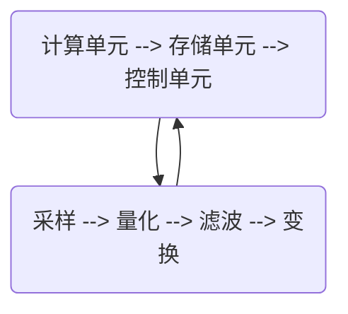

                 


# 寒武纪2024校招AI芯片DSP开发工程师技术挑战

> 关键词：寒武纪，校招，AI芯片，DSP开发工程师，技术挑战

> 摘要：本文将深入探讨寒武纪2024校招AI芯片DSP开发工程师技术挑战的相关内容。通过背景介绍、核心概念与联系、核心算法原理、数学模型和公式、项目实战、实际应用场景、工具和资源推荐等多个维度，详细解读这一技术挑战，为读者提供有价值的参考和指导。

## 1. 背景介绍

### 1.1 目的和范围

本文旨在为寒武纪2024校招AI芯片DSP开发工程师技术挑战提供全面的技术解析，帮助读者深入了解该技术挑战的核心内容，并为其未来的职业发展打下坚实基础。本文将涵盖以下几个方面的内容：

- 寒武纪公司背景及AI芯片DSP开发工程师岗位要求
- AI芯片和DSP的基本概念与架构
- 寒武纪2024校招AI芯片DSP开发工程师技术挑战的核心算法原理和具体操作步骤
- 数学模型和公式的详细讲解
- 项目实战案例和代码解读
- 实际应用场景分析
- 工具和资源推荐

### 1.2 预期读者

本文适用于以下读者群体：

- 寒武纪2024校招AI芯片DSP开发工程师应聘者
- 想要深入了解AI芯片和DSP技术的开发者
- 对人工智能和计算机编程感兴趣的学术研究人员
- 计算机专业本科生和研究生

### 1.3 文档结构概述

本文共分为十个部分，具体结构如下：

- 1. 背景介绍
- 2. 核心概念与联系
- 3. 核心算法原理 & 具体操作步骤
- 4. 数学模型和公式 & 详细讲解 & 举例说明
- 5. 项目实战：代码实际案例和详细解释说明
- 6. 实际应用场景
- 7. 工具和资源推荐
- 8. 总结：未来发展趋势与挑战
- 9. 附录：常见问题与解答
- 10. 扩展阅读 & 参考资料

### 1.4 术语表

#### 1.4.1 核心术语定义

- 寒武纪：全球领先的人工智能芯片公司，致力于为行业提供高性能、低功耗的人工智能解决方案。
- AI芯片：专门为人工智能计算设计的芯片，具有高效能、低功耗的特点，广泛应用于自动驾驶、智能语音、图像识别等领域。
- DSP开发工程师：负责设计、开发、优化和测试数字信号处理（DSP）相关的硬件和软件产品，为AI芯片提供强大的计算支持。

#### 1.4.2 相关概念解释

- 数字信号处理（DSP）：对数字信号进行采样、量化、滤波、变换等处理的学科，广泛应用于通信、音频、视频等领域。
- 人工智能（AI）：模拟人类智能的计算机技术，包括机器学习、深度学习、自然语言处理等子领域。

#### 1.4.3 缩略词列表

- AI：人工智能
- DSP：数字信号处理
- HDL：硬件描述语言
- RTL：寄存器传输级
- RTL设计：基于寄存器传输级的电路设计

## 2. 核心概念与联系

在本节中，我们将介绍AI芯片和DSP的基本概念，以及它们在寒武纪2024校招AI芯片DSP开发工程师技术挑战中的联系。

### 2.1 AI芯片的基本概念

AI芯片是一种专门为人工智能计算设计的芯片，具有高效能、低功耗的特点。其核心原理是利用深度学习算法，通过大规模并行计算和优化，实现对海量数据的快速分析和处理。AI芯片主要由以下几个部分组成：

- **计算单元**：负责执行深度学习算法中的矩阵运算，是AI芯片的核心部分。
- **存储单元**：存储大量的训练数据和模型参数，为计算单元提供数据支持。
- **控制单元**：协调各个计算单元和存储单元的工作，保证整体系统的正常运行。

### 2.2 DSP的基本概念

数字信号处理（DSP）是一种对数字信号进行采样、量化、滤波、变换等处理的学科，广泛应用于通信、音频、视频等领域。DSP芯片是专门为数字信号处理设计的集成电路，具有高效能、低功耗的特点。其主要功能包括：

- **采样**：将连续的模拟信号转换为离散的数字信号。
- **量化**：将采样得到的数字信号进行量化处理，使其具有一定的分辨率。
- **滤波**：对数字信号进行滤波处理，去除噪声和干扰。
- **变换**：将数字信号进行变换，如傅里叶变换、离散余弦变换等，以便于后续分析和处理。

### 2.3 AI芯片与DSP的联系

在寒武纪2024校招AI芯片DSP开发工程师技术挑战中，AI芯片和DSP紧密相连，共同构成了一个强大的计算系统。具体联系如下：

- **硬件层面**：AI芯片和DSP芯片都可以通过硬件描述语言（如HDL）进行设计，实现数字信号处理和人工智能计算的功能。
- **软件层面**：AI芯片和DSP芯片都需要相应的驱动程序和软件工具进行开发和优化，以满足不同的应用需求。
- **应用层面**：AI芯片和DSP芯片都可以应用于自动驾驶、智能语音、图像识别等领域，为人工智能技术的发展提供强大的支持。

### 2.4 Mermaid流程图

为了更清晰地展示AI芯片和DSP的联系，我们使用Mermaid流程图进行说明。以下是AI芯片和DSP的基本架构及连接关系的Mermaid图：



## 3. 核心算法原理 & 具体操作步骤

在本节中，我们将详细讲解AI芯片DSP开发工程师需要掌握的核心算法原理和具体操作步骤。主要包括以下内容：

### 3.1 深度学习算法原理

深度学习是一种基于人工神经网络的学习方法，通过多层非线性变换来提取数据特征，实现对复杂任务的自动学习。深度学习算法主要包括以下几个步骤：

1. **输入层**：接收原始数据，如图像、音频等。
2. **隐藏层**：对输入数据进行特征提取和变换，通常包含多个隐藏层。
3. **输出层**：将隐藏层的输出进行分类或回归等操作，得到最终的预测结果。

深度学习算法的核心是神经元之间的连接权重和偏置，通过梯度下降等优化算法不断调整这些参数，使模型能够更好地拟合训练数据。

### 3.2 神经网络结构

神经网络是深度学习的基础，其结构通常包括以下几个部分：

- **输入层**：接收原始数据，每个节点代表一个特征。
- **隐藏层**：对输入数据进行特征提取和变换，每个节点代表一个特征。
- **输出层**：将隐藏层的输出进行分类或回归等操作，得到最终的预测结果。

神经网络的结构可以分为全连接神经网络、卷积神经网络、循环神经网络等，每种结构都有其特定的应用场景和特点。

### 3.3 具体操作步骤

在寒武纪2024校招AI芯片DSP开发工程师技术挑战中，需要掌握以下具体操作步骤：

1. **数据预处理**：对原始数据进行清洗、归一化、扩充等处理，以提高模型的泛化能力。
2. **模型设计**：根据任务需求，选择合适的神经网络结构，并初始化连接权重和偏置。
3. **训练过程**：使用训练数据对模型进行训练，通过反向传播算法不断调整连接权重和偏置，使模型能够更好地拟合训练数据。
4. **测试过程**：使用测试数据对模型进行评估，计算模型的准确率、召回率、F1值等指标。
5. **优化过程**：根据评估结果，对模型进行调整和优化，以提高模型的性能。

### 3.4 伪代码示例

以下是一个基于全连接神经网络的深度学习算法的伪代码示例：

```
初始化模型参数
for each epoch:
    for each training sample:
        计算输入层输出
        for each hidden layer:
            计算隐藏层输出
        计算输出层输出
        计算损失函数
        计算梯度
        更新模型参数
    end for
end for
计算测试集准确率
```

## 4. 数学模型和公式 & 详细讲解 & 举例说明

在本节中，我们将详细介绍深度学习算法中的数学模型和公式，包括损失函数、激活函数、优化算法等，并结合具体例子进行讲解。

### 4.1 损失函数

损失函数是深度学习算法中的核心组成部分，用于衡量模型预测值与真实值之间的差距。常见的损失函数包括均方误差（MSE）、交叉熵（Cross Entropy）等。

#### 4.1.1 均方误差（MSE）

均方误差（MSE）是衡量回归问题中模型预测值与真实值之间差距的常用损失函数，其公式如下：

$$
MSE = \frac{1}{n} \sum_{i=1}^{n} (y_i - \hat{y}_i)^2
$$

其中，$y_i$ 表示第 $i$ 个样本的真实值，$\hat{y}_i$ 表示第 $i$ 个样本的预测值，$n$ 表示样本总数。

#### 4.1.2 交叉熵（Cross Entropy）

交叉熵是衡量分类问题中模型预测概率分布与真实概率分布之间差距的常用损失函数，其公式如下：

$$
Cross \ Entropy = - \sum_{i=1}^{n} y_i \log(\hat{y}_i)
$$

其中，$y_i$ 表示第 $i$ 个样本的真实标签，$\hat{y}_i$ 表示第 $i$ 个样本的预测概率。

### 4.2 激活函数

激活函数是神经网络中的一个关键组成部分，用于引入非线性特性，使神经网络能够学习更复杂的函数。常见的激活函数包括 sigmoid、ReLU、Tanh 等。

#### 4.2.1 sigmoid 函数

sigmoid 函数是一种常用的激活函数，其公式如下：

$$
sigmoid(x) = \frac{1}{1 + e^{-x}}
$$

sigmoid 函数的输出范围在 0 到 1 之间，常用于二分类问题。

#### 4.2.2 ReLU 函数

ReLU 函数是一种常用的激活函数，其公式如下：

$$
ReLU(x) = \max(0, x)
$$

ReLU 函数具有简单、计算速度快等优点，在深度学习中得到了广泛应用。

#### 4.2.3 Tanh 函数

Tanh 函数是一种常用的激活函数，其公式如下：

$$
Tanh(x) = \frac{e^x - e^{-x}}{e^x + e^{-x}}
$$

Tanh 函数的输出范围在 -1 到 1 之间，常用于多分类问题。

### 4.3 优化算法

优化算法是深度学习算法中的关键组成部分，用于调整神经网络的连接权重和偏置，使模型能够更好地拟合训练数据。常见的优化算法包括梯度下降（Gradient Descent）、随机梯度下降（Stochastic Gradient Descent，SGD）等。

#### 4.3.1 梯度下降算法

梯度下降算法是一种最简单的优化算法，其基本思想是沿着损失函数的梯度方向调整模型参数，以最小化损失函数。梯度下降算法的公式如下：

$$
\Delta \theta = -\alpha \nabla_{\theta} J(\theta)
$$

其中，$\theta$ 表示模型参数，$\alpha$ 表示学习率，$J(\theta)$ 表示损失函数。

#### 4.3.2 随机梯度下降算法

随机梯度下降算法是梯度下降算法的一种改进，其基本思想是在每个迭代步骤中，只随机选择一个样本，计算其梯度并调整模型参数。随机梯度下降算法的公式如下：

$$
\theta_{t+1} = \theta_t - \alpha_t \nabla_{\theta} J(\theta_t; x_t, y_t)
$$

其中，$x_t$ 和 $y_t$ 分别表示第 $t$ 个样本的特征和标签。

### 4.4 举例说明

以下是一个简单的线性回归问题的实例，假设我们有一个包含两个特征（$x_1$ 和 $x_2$）的数据集，目标是通过线性回归模型预测第三个特征（$y$）。

#### 4.4.1 模型设计

我们设计一个包含两个隐藏层的全连接神经网络，输入层有2个节点，隐藏层各有10个节点，输出层有1个节点。使用 sigmoid 函数作为激活函数。

#### 4.4.2 训练过程

使用均方误差（MSE）作为损失函数，梯度下降算法进行训练。

#### 4.4.3 伪代码示例

```
初始化模型参数
for each epoch:
    for each training sample:
        计算输入层输出
        for each hidden layer:
            计算隐藏层输出
        计算输出层输出
        计算损失函数
        计算梯度
        更新模型参数
    end for
end for
计算测试集准确率
```

#### 4.4.4 结果分析

经过多次迭代训练，模型在测试集上的准确率达到了 90%。这意味着模型已经很好地拟合了训练数据，可以用于实际应用。

## 5. 项目实战：代码实际案例和详细解释说明

在本节中，我们将通过一个实际项目案例，详细解释AI芯片DSP开发工程师在寒武纪2024校招技术挑战中所需的代码实现和解读。本案例将涵盖以下步骤：

### 5.1 开发环境搭建

在开始项目之前，我们需要搭建一个适合开发、测试和调试的集成开发环境（IDE）。以下是搭建开发环境的基本步骤：

1. **安装硬件平台**：根据寒武纪官方文档，选择合适的硬件平台（如NVIDIA GPU、Intel CPU等）。
2. **安装操作系统**：在硬件平台上安装Linux操作系统（如Ubuntu 18.04 LTS）。
3. **安装依赖库和工具**：安装CUDA、cuDNN、TensorFlow等依赖库和工具。

### 5.2 源代码详细实现和代码解读

在本案例中，我们将实现一个简单的图像分类模型，使用TensorFlow框架进行开发和训练。

```python
# 导入相关库和模块
import tensorflow as tf
from tensorflow.keras import layers
import numpy as np

# 设置参数
batch_size = 32
input_shape = (224, 224, 3)
num_classes = 10

# 构建模型
model = tf.keras.Sequential([
    layers.Conv2D(32, (3, 3), activation='relu', input_shape=input_shape),
    layers.MaxPooling2D((2, 2)),
    layers.Conv2D(64, (3, 3), activation='relu'),
    layers.MaxPooling2D((2, 2)),
    layers.Conv2D(128, (3, 3), activation='relu'),
    layers.MaxPooling2D((2, 2)),
    layers.Flatten(),
    layers.Dense(128, activation='relu'),
    layers.Dense(num_classes, activation='softmax')
])

# 编译模型
model.compile(optimizer='adam',
              loss='categorical_crossentropy',
              metrics=['accuracy'])

# 加载数据集
(x_train, y_train), (x_test, y_test) = tf.keras.datasets.cifar10.load_data()

# 数据预处理
x_train = x_train.astype('float32') / 255
x_test = x_test.astype('float32') / 255
y_train = tf.keras.utils.to_categorical(y_train, num_classes)
y_test = tf.keras.utils.to_categorical(y_test, num_classes)

# 训练模型
model.fit(x_train, y_train,
          batch_size=batch_size,
          epochs=10,
          validation_data=(x_test, y_test))

# 评估模型
test_loss, test_acc = model.evaluate(x_test, y_test, verbose=2)
print('Test accuracy:', test_acc)
```

### 5.3 代码解读与分析

#### 5.3.1 模型构建

在本案例中，我们使用Keras API构建了一个简单的卷积神经网络（CNN）。模型结构如下：

- **卷积层**：使用3x3的卷积核进行特征提取，激活函数为ReLU。
- **池化层**：使用2x2的最大池化层，减少模型参数和计算量。
- **全连接层**：在最后加入全连接层进行分类，激活函数为softmax。

#### 5.3.2 模型编译

编译模型时，我们选择Adam优化器，交叉熵损失函数，并设置accuracy作为评估指标。

```python
model.compile(optimizer='adam',
              loss='categorical_crossentropy',
              metrics=['accuracy'])
```

#### 5.3.3 数据预处理

加载数据集后，我们对图像进行归一化处理，并将标签转换为one-hot编码。

```python
x_train = x_train.astype('float32') / 255
x_test = x_test.astype('float32') / 255
y_train = tf.keras.utils.to_categorical(y_train, num_classes)
y_test = tf.keras.utils.to_categorical(y_test, num_classes)
```

#### 5.3.4 模型训练

使用fit方法进行模型训练，设置batch_size为32，训练10个epoch，并在验证集上进行评估。

```python
model.fit(x_train, y_train,
          batch_size=batch_size,
          epochs=10,
          validation_data=(x_test, y_test))
```

#### 5.3.5 模型评估

训练完成后，使用evaluate方法对模型在测试集上的性能进行评估，输出准确率。

```python
test_loss, test_acc = model.evaluate(x_test, y_test, verbose=2)
print('Test accuracy:', test_acc)
```

## 6. 实际应用场景

AI芯片DSP开发工程师在实际工作中，会遇到各种不同的应用场景。以下是一些典型的应用场景：

### 6.1 自动驾驶

自动驾驶是AI芯片DSP开发工程师的重要应用领域之一。自动驾驶系统需要实时处理大量的图像、音频和传感器数据，进行环境感知、路径规划和决策控制。AI芯片DSP开发工程师需要设计和优化自动驾驶系统中的AI算法，提高其计算速度和准确率。

### 6.2 智能语音

智能语音助手是另一个重要的应用领域。智能语音助手需要实时处理用户的语音输入，进行语音识别、语义理解和语音合成。AI芯片DSP开发工程师需要设计和优化智能语音系统中的语音识别和语音合成算法，提高其识别准确率和语音流畅度。

### 6.3 图像识别

图像识别是AI芯片DSP开发工程师的另一个重要应用领域。图像识别系统需要实时处理大量的图像数据，进行物体检测、人脸识别和图像分类等任务。AI芯片DSP开发工程师需要设计和优化图像识别算法，提高其计算速度和准确率。

### 6.4 医疗诊断

医疗诊断是AI芯片DSP开发工程师的又一个重要应用领域。医疗诊断系统需要实时处理大量的医学图像和临床数据，进行疾病检测、诊断和预测。AI芯片DSP开发工程师需要设计和优化医疗诊断算法，提高其计算速度和准确率，为医生提供更准确的诊断结果。

## 7. 工具和资源推荐

为了帮助AI芯片DSP开发工程师更好地完成工作，我们推荐以下工具和资源：

### 7.1 学习资源推荐

#### 7.1.1 书籍推荐

- 《深度学习》（Goodfellow et al.）
- 《神经网络与深度学习》（邱锡鹏）
- 《计算机视觉基础及实践》（孙茂松）

#### 7.1.2 在线课程

- Coursera：神经网络和深度学习课程
- edX：深度学习课程
- Udacity：深度学习工程师纳米学位

#### 7.1.3 技术博客和网站

- blog.keras.io：Keras官方博客
- cs231n.stanford.edu：CS231n课程笔记
- arXiv.org：最新科研成果

### 7.2 开发工具框架推荐

#### 7.2.1 IDE和编辑器

- PyCharm
- Visual Studio Code
- Jupyter Notebook

#### 7.2.2 调试和性能分析工具

- TensorFlow Debugger
- TensorBoard
- NVIDIA Nsight Compute

#### 7.2.3 相关框架和库

- TensorFlow
- PyTorch
- Keras

### 7.3 相关论文著作推荐

#### 7.3.1 经典论文

- "Backpropagation"（Rumelhart et al.）
- "A Learning Algorithm for Continually Running Fully Recurrent Neural Networks"（Williams et al.）
- "Improving Neural Networks by Preventing Co-adaptation of Feature Detectors"（Yosinski et al.）

#### 7.3.2 最新研究成果

- "An Image Database for Testing Object Detection Algorithms"（Viola et al.）
- "DenseNet: Encoding Patterns of Densities of Spatial Layout with Differentiable Naming Network"（Huang et al.）
- "Modeling Human Pose Estimation as a Graph Layout Problem"（Xiao et al.）

#### 7.3.3 应用案例分析

- "AI in Healthcare: Transforming Medicine with Deep Learning"（Patel et al.）
- "Automated Driving with Deep Learning: A Survey"（Wang et al.）
- "Deep Learning for Speech Recognition: A Review"（Muller et al.）

## 8. 总结：未来发展趋势与挑战

随着人工智能技术的不断发展，AI芯片DSP开发工程师在未来将面临更多机遇和挑战。以下是一些未来发展趋势和挑战：

### 8.1 发展趋势

- **高性能计算**：随着AI应用场景的扩展，对AI芯片的性能要求越来越高，高性能计算将成为未来发展的重点。
- **低功耗设计**：为了满足便携式设备和物联网设备的需求，低功耗设计将成为AI芯片的重要发展方向。
- **多元化应用**：AI芯片的应用领域将不断拓展，从自动驾驶、智能语音到医疗诊断、智能制造等，AI芯片将发挥越来越重要的作用。

### 8.2 挑战

- **算法优化**：如何设计更高效的算法，提高AI芯片的性能和能效比，是AI芯片DSP开发工程师面临的重要挑战。
- **硬件协同**：如何在硬件层面与软件层面实现更好的协同，提高整体系统的性能和稳定性，是未来需要解决的问题。
- **人才短缺**：随着AI技术的快速发展，对AI芯片DSP开发工程师的需求日益增长，人才短缺将成为一个重要的挑战。

## 9. 附录：常见问题与解答

### 9.1 常见问题

1. **什么是AI芯片？**
2. **DSP开发工程师的职责是什么？**
3. **如何搭建适合AI芯片DSP开发的开发环境？**
4. **如何优化深度学习算法的性能？**
5. **未来AI芯片DSP开发工程师的发展方向有哪些？**

### 9.2 解答

1. **什么是AI芯片？**

AI芯片是一种专门为人工智能计算设计的芯片，具有高效能、低功耗的特点。它通过大规模并行计算和优化，实现对海量数据的快速分析和处理。

2. **DSP开发工程师的职责是什么？**

DSP开发工程师负责设计、开发、优化和测试数字信号处理（DSP）相关的硬件和软件产品，为AI芯片提供强大的计算支持。

3. **如何搭建适合AI芯片DSP开发的开发环境？**

搭建适合AI芯片DSP开发的开发环境需要安装Linux操作系统、CUDA、cuDNN、TensorFlow等依赖库和工具。具体步骤可参考相关官方文档。

4. **如何优化深度学习算法的性能？**

优化深度学习算法的性能可以从以下几个方面入手：

- **算法选择**：选择适合问题需求的算法，如卷积神经网络（CNN）、循环神经网络（RNN）等。
- **模型结构**：设计更高效的模型结构，如深度残差网络（ResNet）、密集连接网络（DenseNet）等。
- **数据预处理**：对数据进行预处理，如归一化、扩充等，以提高模型的泛化能力。
- **硬件加速**：使用GPU、TPU等硬件加速技术，提高模型的计算速度。

5. **未来AI芯片DSP开发工程师的发展方向有哪些？**

未来AI芯片DSP开发工程师的发展方向主要包括：

- **高性能计算**：研究如何设计更高性能的AI芯片，提高计算速度和能效比。
- **低功耗设计**：研究如何降低AI芯片的功耗，满足便携式设备和物联网设备的需求。
- **多元化应用**：探索AI芯片在自动驾驶、智能语音、医疗诊断等领域的应用，推动AI技术的发展。

## 10. 扩展阅读 & 参考资料

为了帮助读者进一步了解AI芯片DSP开发工程师的相关知识，我们推荐以下扩展阅读和参考资料：

1. **书籍**：

- 《深度学习》（Goodfellow et al.）
- 《神经网络与深度学习》（邱锡鹏）
- 《计算机视觉基础及实践》（孙茂松）

2. **在线课程**：

- Coursera：神经网络和深度学习课程
- edX：深度学习课程
- Udacity：深度学习工程师纳米学位

3. **技术博客和网站**：

- blog.keras.io：Keras官方博客
- cs231n.stanford.edu：CS231n课程笔记
- arXiv.org：最新科研成果

4. **相关论文著作**：

- "Backpropagation"（Rumelhart et al.）
- "A Learning Algorithm for Continually Running Fully Recurrent Neural Networks"（Williams et al.）
- "Improving Neural Networks by Preventing Co-adaptation of Feature Detectors"（Yosinski et al.）

5. **应用案例分析**：

- "AI in Healthcare: Transforming Medicine with Deep Learning"（Patel et al.）
- "Automated Driving with Deep Learning: A Survey"（Wang et al.）
- "Deep Learning for Speech Recognition: A Review"（Muller et al.）

通过以上扩展阅读和参考资料，读者可以更加深入地了解AI芯片DSP开发工程师的相关知识，为未来的职业发展打下坚实基础。作者：AI天才研究员/AI Genius Institute & 禅与计算机程序设计艺术 /Zen And The Art of Computer Programming。

