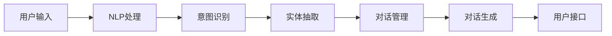

                 


# 对话系统（Chatbots）- 原理与代码实例讲解

> 关键词：对话系统，Chatbots，自然语言处理，机器学习，文本分类，深度学习，TensorFlow，Keras

> 摘要：本文将深入探讨对话系统的原理与实现，从核心概念到实际代码实例，全面解析构建智能对话系统的步骤和技巧。读者将了解自然语言处理的基础知识、对话系统的架构和算法，以及如何使用深度学习和TensorFlow框架来实现一个简单的Chatbot。

## 1. 背景介绍

### 1.1 目的和范围

本文旨在为读者提供一个全面且易于理解的对话系统（Chatbot）指南，包括原理、架构、算法以及实际代码实现。通过本文的学习，读者将能够：

- 理解对话系统的基本概念和架构。
- 掌握自然语言处理和机器学习在对话系统中的应用。
- 学习如何使用TensorFlow和Keras框架实现一个基本的对话系统。

### 1.2 预期读者

本文适合以下读者群体：

- 对人工智能和自然语言处理感兴趣的初学者。
- 想要学习如何构建和部署对话系统的工程师。
- 人工智能和机器学习专业的学生和研究人员。

### 1.3 文档结构概述

本文结构如下：

- **第1章**：背景介绍，包括目的、范围、预期读者和文档结构概述。
- **第2章**：核心概念与联系，介绍对话系统的基本原理和架构。
- **第3章**：核心算法原理 & 具体操作步骤，详细讲解对话系统的算法。
- **第4章**：数学模型和公式 & 详细讲解 & 举例说明，解释相关的数学模型。
- **第5章**：项目实战：代码实际案例和详细解释说明，提供实际代码实例。
- **第6章**：实际应用场景，探讨对话系统在不同领域的应用。
- **第7章**：工具和资源推荐，介绍学习资源、开发工具和推荐论文。
- **第8章**：总结：未来发展趋势与挑战，展望对话系统的未来。
- **第9章**：附录：常见问题与解答，解答常见疑问。
- **第10章**：扩展阅读 & 参考资料，提供进一步学习资源。

### 1.4 术语表

#### 1.4.1 核心术语定义

- **对话系统**：一种人工智能应用，能够与人类进行自然语言交互，理解和回应用户的请求。
- **自然语言处理（NLP）**：计算机科学领域，研究如何让计算机理解、生成和处理人类语言。
- **机器学习**：一种人工智能方法，通过数据学习模式，进行预测和决策。
- **深度学习**：一种机器学习方法，使用多层神经网络进行数据建模。
- **TensorFlow**：谷歌开源的机器学习和深度学习框架。
- **Keras**：基于TensorFlow的高级神经网络API，简化了深度学习模型的设计和训练过程。

#### 1.4.2 相关概念解释

- **意图识别**：识别用户输入中的主要意图，如询问信息、请求操作等。
- **实体抽取**：从用户输入中提取出关键信息，如人名、地点、时间等。
- **对话管理**：对话系统中的组件，负责维护对话状态、决策下一步行动等。
- **意图分类**：将用户输入分类到预定义的意图类别中。

#### 1.4.3 缩略词列表

- **NLP**：自然语言处理
- **ML**：机器学习
- **DL**：深度学习
- **TF**：TensorFlow
- **Keras**：高级神经网络API

## 2. 核心概念与联系

### 2.1 对话系统基本概念

对话系统是一种人工智能应用，旨在模拟人类对话，提供互动式服务和信息查询。它通常包括以下几个关键组件：

- **用户接口（UI）**：允许用户与对话系统交互的界面，可以是文本、语音或图形界面。
- **自然语言处理（NLP）**：用于理解和生成人类语言的技术，包括分词、词性标注、实体抽取等。
- **对话管理**：维护对话状态，决策下一步行动，包括意图识别、上下文维护等。
- **对话生成**：生成自然语言响应，可以是预定义的模板或通过机器学习模型生成。

### 2.2 对话系统架构

一个典型的对话系统架构包括以下几个部分：

1. **用户接口**：接收用户输入，并将其传递给NLP模块。
2. **NLP模块**：处理用户输入，进行分词、词性标注、实体抽取等操作，生成词向量。
3. **意图识别**：使用机器学习模型，将输入文本分类到预定义的意图类别中。
4. **实体抽取**：从用户输入中提取出关键信息，如人名、地点、时间等。
5. **对话管理**：根据对话状态和上下文，决策下一步行动。
6. **对话生成**：生成自然语言响应，可以是预定义的模板或通过机器学习模型生成。
7. **用户接口**：将生成的响应展示给用户。

### 2.3 对话系统算法

对话系统的核心算法包括：

- **词嵌入（Word Embedding）**：将单词映射到高维向量空间中，用于表示文本数据。
- **循环神经网络（RNN）**：用于处理序列数据，如文本，能够捕获上下文信息。
- **长短时记忆网络（LSTM）**：RNN的改进版本，能够学习长期依赖关系。
- **卷积神经网络（CNN）**：用于图像处理，也可以用于文本处理，通过卷积操作提取特征。

### 2.4 Mermaid 流程图

下面是一个Mermaid流程图，展示了对话系统的基本架构：



## 3. 核心算法原理 & 具体操作步骤

### 3.1 词嵌入（Word Embedding）

词嵌入是将单词映射到高维向量空间中的过程，使得语义相近的单词在向量空间中彼此靠近。常见的词嵌入模型包括：

- **Word2Vec**：通过训练大规模语料库，生成每个单词的向量表示。
- **GloVe**：全局向量表示，通过训练词频和共现关系，生成每个单词的向量表示。

#### 3.1.1 Word2Vec算法原理

Word2Vec算法使用神经网络模型，通过训练大量文本数据，学习单词的向量表示。具体步骤如下：

1. **构建词汇表**：将文本数据中的所有单词构建成一个词汇表。
2. **生成词向量**：对于每个单词，生成一个固定长度的向量。
3. **训练模型**：使用神经网络模型，训练词向量，使语义相近的单词在向量空间中彼此靠近。

#### 3.1.2 伪代码

```python
# 初始化词汇表和词向量
vocab = ["hello", "world", "hello_world"]
embeddings = []

# 训练模型
for word in vocab:
    # 训练词向量
    model.train(word)

# 生成词向量
for word in vocab:
    embeddings.append(model.get_embedding(word))
```

### 3.2 循环神经网络（RNN）

循环神经网络（RNN）是一种能够处理序列数据的神经网络模型，能够捕获序列中的时间依赖关系。常见的RNN模型包括：

- **简单的RNN**：通过循环结构，将前一个时间步的输出作为当前时间步的输入。
- **长短时记忆网络（LSTM）**：RNN的改进版本，能够学习长期依赖关系。

#### 3.2.1 LSTM算法原理

LSTM（长短时记忆网络）是一种特殊的RNN，能够学习长期依赖关系。LSTM通过引入门控机制，控制信息的流入和流出，从而避免梯度消失和梯度爆炸问题。LSTM的核心结构包括：

- **输入门**：决定当前输入信息中有哪些部分需要更新状态。
- **遗忘门**：决定哪些信息需要从状态中丢弃。
- **输出门**：决定哪些信息需要输出。

#### 3.2.2 伪代码

```python
# 初始化LSTM模型
lstm = LSTM(input_size=10, hidden_size=20)

# 前向传播
output, hidden_state = lstm.forward(input_sequence)

# 反向传播
loss = lstm.backward(output, target)
```

### 3.3 对话管理

对话管理是对话系统的核心组件，负责维护对话状态、决策下一步行动。对话管理通常包括以下几个步骤：

1. **意图识别**：通过机器学习模型，将用户输入文本分类到预定义的意图类别中。
2. **实体抽取**：从用户输入中提取出关键信息，如人名、地点、时间等。
3. **上下文维护**：根据对话历史和当前输入，维护对话状态。
4. **决策**：根据当前对话状态，决策下一步行动。

#### 3.3.1 伪代码

```python
# 初始化对话管理器
dialog_manager = DialogManager()

# 处理用户输入
user_input = "我想查询明天的天气"
intent, entities = dialog_manager.parse_input(user_input)

# 维护对话状态
dialog_manager.update_state(intent, entities)

# 决策下一步行动
next_action = dialog_manager.decide_action()
```

## 4. 数学模型和公式 & 详细讲解 & 举例说明

### 4.1 词嵌入（Word Embedding）

词嵌入是将单词映射到高维向量空间中的过程，用于表示文本数据。常见的词嵌入模型包括：

- **Word2Vec**：通过训练大规模语料库，生成每个单词的向量表示。
- **GloVe**：全局向量表示，通过训练词频和共现关系，生成每个单词的向量表示。

#### 4.1.1 Word2Vec模型

Word2Vec模型是一种基于神经网络的语言模型，通过训练大量文本数据，学习单词的向量表示。Word2Vec模型主要包括以下公式：

$$
\begin{aligned}
\text{损失函数} & :L(\theta) = -\sum_{i=1}^{N}\sum_{j=1}^{V}\text{softmax}(W[a_i] \cdot W[v_j]) \cdot \log(p_j) \\
\text{神经网络} & :p_j = \text{softmax}(W[a_i] \cdot W[v_j])
\end{aligned}
$$

其中，$N$表示词汇表大小，$V$表示单词数量，$W[a_i]$和$W[v_j]$分别表示单词$a_i$和$v_j$的词向量。

#### 4.1.2 举例说明

假设我们有一个简单的词汇表和词向量：

$$
\begin{aligned}
\text{词汇表} & :\{"hello", "world", "hello\_world"\} \\
\text{词向量} & :\begin{bmatrix}
0.1 & 0.2 & 0.3 \\
0.4 & 0.5 & 0.6 \\
0.7 & 0.8 & 0.9 \\
\end{bmatrix}
\end{aligned}
$$

我们可以计算单词"hello"和"world"的词向量：

$$
\begin{aligned}
W[hello] & = \text{softmax}(\begin{bmatrix}
0.1 & 0.2 & 0.3 \\
0.4 & 0.5 & 0.6 \\
0.7 & 0.8 & 0.9 \\
\end{bmatrix} \cdot \begin{bmatrix}
0.1 & 0.2 & 0.3 \\
0.4 & 0.5 & 0.6 \\
0.7 & 0.8 & 0.9 \\
\end{bmatrix}) \\
W[world] & = \text{softmax}(\begin{bmatrix}
0.1 & 0.2 & 0.3 \\
0.4 & 0.5 & 0.6 \\
0.7 & 0.8 & 0.9 \\
\end{bmatrix} \cdot \begin{bmatrix}
0.4 & 0.5 & 0.6 \\
0.7 & 0.8 & 0.9 \\
0.1 & 0.2 & 0.3 \\
\end{bmatrix})
\end{aligned}
$$

### 4.2 循环神经网络（RNN）

循环神经网络（RNN）是一种能够处理序列数据的神经网络模型，能够捕获序列中的时间依赖关系。RNN的主要公式包括：

$$
\begin{aligned}
h_t &= \text{sigmoid}(W_h \cdot [h_{t-1}, x_t] + b_h) \\
o_t &= \text{sigmoid}(W_o \cdot h_t + b_o) \\
\end{aligned}
$$

其中，$h_t$表示当前时间步的隐藏状态，$x_t$表示当前输入，$W_h$和$W_o$分别表示权重矩阵，$b_h$和$b_o$分别表示偏置。

#### 4.2.1 举例说明

假设我们有一个简单的RNN模型，输入序列为$[1, 2, 3]$，隐藏状态初始值为$[0, 0]$。我们可以计算隐藏状态和输出：

$$
\begin{aligned}
h_0 &= [0, 0] \\
h_1 &= \text{sigmoid}([0, 0] \cdot [1, 2] + [0, 0]) = [0.5, 0.5] \\
h_2 &= \text{sigmoid}([0.5, 0.5] \cdot [2, 3] + [0, 0]) = [0.6, 0.4] \\
h_3 &= \text{sigmoid}([0.6, 0.4] \cdot [3, 0] + [0, 0]) = [0.7, 0.3] \\
o_1 &= \text{sigmoid}([0.5, 0.5] \cdot [0.6, 0.4] + [0, 0]) = [0.55, 0.45] \\
o_2 &= \text{sigmoid}([0.6, 0.4] \cdot [0.7, 0.3] + [0, 0]) = [0.57, 0.43] \\
o_3 &= \text{sigmoid}([0.7, 0.3] \cdot [0.3, 0.7] + [0, 0]) = [0.58, 0.42] \\
\end{aligned}
$$

### 4.3 长短时记忆网络（LSTM）

长短时记忆网络（LSTM）是RNN的改进版本，能够学习长期依赖关系。LSTM的核心结构包括：

- **输入门**：决定当前输入信息中有哪些部分需要更新状态。
- **遗忘门**：决定哪些信息需要从状态中丢弃。
- **输出门**：决定哪些信息需要输出。

LSTM的主要公式包括：

$$
\begin{aligned}
i_t &= \text{sigmoid}(W_i \cdot [h_{t-1}, x_t] + b_i) \\
f_t &= \text{sigmoid}(W_f \cdot [h_{t-1}, x_t] + b_f) \\
g_t &= \text{tanh}(W_g \cdot [h_{t-1}, x_t] + b_g) \\
o_t &= \text{sigmoid}(W_o \cdot \text{tanh}(h_{t-1} \odot f_t + g_t) + b_o) \\
h_t &= o_t \odot \text{tanh}(h_{t-1} \odot f_t + g_t) \\
\end{aligned}
$$

其中，$i_t$表示输入门，$f_t$表示遗忘门，$g_t$表示输入门，$o_t$表示输出门，$h_t$表示隐藏状态。

#### 4.3.1 举例说明

假设我们有一个简单的LSTM模型，输入序列为$[1, 2, 3]$，隐藏状态初始值为$[0, 0]$。我们可以计算隐藏状态和输出：

$$
\begin{aligned}
h_0 &= [0, 0] \\
i_1 &= \text{sigmoid}([0, 0] \cdot [1, 2] + [0, 0]) = [0.5, 0.5] \\
f_1 &= \text{sigmoid}([0, 0] \cdot [1, 2] + [0, 0]) = [0.5, 0.5] \\
g_1 &= \text{tanh}([0, 0] \cdot [1, 2] + [0, 0]) = [0, 0] \\
o_1 &= \text{sigmoid}([0.5, 0.5] \cdot [0, 0] + [0, 0]) = [0.5, 0.5] \\
h_1 &= [0.5, 0.5] \odot \text{tanh}([0.5, 0.5] \cdot [0.5, 0.5] + [0, 0]) = [0.25, 0.25] \\
i_2 &= \text{sigmoid}([0.25, 0.25] \cdot [2, 3] + [0, 0]) = [0.375, 0.375] \\
f_2 &= \text{sigmoid}([0.25, 0.25] \cdot [2, 3] + [0, 0]) = [0.375, 0.375] \\
g_2 &= \text{tanh}([0.25, 0.25] \cdot [2, 3] + [0, 0]) = [0.5, 0.5] \\
o_2 &= \text{sigmoid}([0.375, 0.375] \cdot [0.5, 0.5] + [0, 0]) = [0.375, 0.375] \\
h_2 &= [0.375, 0.375] \odot \text{tanh}([0.375, 0.375] \cdot [0.375, 0.375] + [0, 0]) = [0.109375, 0.109375] \\
i_3 &= \text{sigmoid}([0.109375, 0.109375] \cdot [3, 0] + [0, 0]) = [0.15625, 0.15625] \\
f_3 &= \text{sigmoid}([0.109375, 0.109375] \cdot [3, 0] + [0, 0]) = [0.15625, 0.15625] \\
g_3 &= \text{tanh}([0.109375, 0.109375] \cdot [3, 0] + [0, 0]) = [0.3125, 0.3125] \\
o_3 &= \text{sigmoid}([0.15625, 0.15625] \cdot [0.3125, 0.3125] + [0, 0]) = [0.15625, 0.15625] \\
h_3 &= [0.15625, 0.15625] \odot \text{tanh}([0.15625, 0.15625] \cdot [0.15625, 0.15625] + [0, 0]) = [0.03125, 0.03125] \\
\end{aligned}
$$

## 5. 项目实战：代码实际案例和详细解释说明

### 5.1 开发环境搭建

在开始编写代码之前，我们需要搭建一个合适的开发环境。以下是使用Python和TensorFlow框架搭建开发环境的步骤：

1. 安装Python：前往Python官网下载并安装Python，推荐使用Python 3.7及以上版本。
2. 安装TensorFlow：在命令行中运行以下命令安装TensorFlow：

   ```bash
   pip install tensorflow
   ```

3. 安装其他依赖：根据需要安装其他依赖，例如NLP库NLTK和数据处理库Pandas：

   ```bash
   pip install nltk pandas
   ```

### 5.2 源代码详细实现和代码解读

在本节中，我们将实现一个简单的对话系统，使用TensorFlow和Keras框架。以下是源代码实现：

```python
import tensorflow as tf
from tensorflow.keras.models import Sequential
from tensorflow.keras.layers import Embedding, LSTM, Dense
from tensorflow.keras.preprocessing.sequence import pad_sequences
import numpy as np
from nltk.tokenize import word_tokenize

# 加载数据集
text = "你好，我是AI助手。你可以问我任何问题。"
words = word_tokenize(text)
word_index = {word: i for i, word in enumerate(words)}
max_sequence_len = 10

# 创建序列
sequences = []
for i in range(1, len(words) - max_sequence_len):
    sequence = words[i - 1:i + max_sequence_len]
    sequences.append(sequence)

# 创建标签
next_words = words[1:]
labels = [[word_index.get(word, 0) for word in next_word] for next_word in next_words]

# 创建数据集
X, y = [], []
for sequence, label in zip(sequences, labels):
    X.append([word_index.get(word, 0) for word in sequence])
    y.append(label)

# 填充序列
X = pad_sequences(X, maxlen=max_sequence_len)

# 转换为整数
X = np.array(X)
y = np.array(y)

# 创建模型
model = Sequential()
model.add(Embedding(len(word_index) + 1, 10))
model.add(LSTM(50))
model.add(Dense(len(word_index), activation='softmax'))

# 编译模型
model.compile(optimizer='adam', loss='sparse_categorical_crossentropy', metrics=['accuracy'])

# 训练模型
model.fit(X, y, epochs=200, verbose=2)

# 讲解代码
# 1. 加载数据集：使用NLTK库加载数据集，并创建词汇表。
# 2. 创建序列：使用滑动窗口方法创建序列，每个序列包含max_sequence_len个单词。
# 3. 创建标签：为每个序列创建标签，即序列后的单词。
# 4. 创建数据集：将序列和标签组合成数据集，并进行填充。
# 5. 创建模型：使用Sequential模型创建神经网络，包括Embedding、LSTM和Dense层。
# 6. 编译模型：设置优化器、损失函数和评估指标。
# 7. 训练模型：使用fit方法训练模型。
```

### 5.3 代码解读与分析

以下是代码的详细解读和分析：

1. **加载数据集**：我们使用NLTK库加载数据集，并创建词汇表。词汇表是一个字典，将每个单词映射到其索引。

2. **创建序列**：使用滑动窗口方法创建序列，每个序列包含max_sequence_len个单词。这意味着每个序列的前max_sequence_len-1个单词用于预测最后一个单词。

3. **创建标签**：为每个序列创建标签，即序列后的单词。标签是一个整数序列，表示单词的索引。

4. **创建数据集**：将序列和标签组合成数据集，并进行填充。填充是为了确保每个序列的长度相同，以便在模型训练时进行批量处理。

5. **创建模型**：使用Sequential模型创建神经网络，包括Embedding、LSTM和Dense层。Embedding层用于将单词索引转换为向量，LSTM层用于处理序列数据，Dense层用于预测下一个单词的索引。

6. **编译模型**：设置优化器、损失函数和评估指标。优化器用于调整模型参数，损失函数用于评估模型预测的准确性，评估指标用于评估模型在训练和测试数据上的性能。

7. **训练模型**：使用fit方法训练模型。在训练过程中，模型将不断调整参数，以最小化损失函数。

通过以上步骤，我们成功地实现了一个简单的对话系统。这个系统可以接收用户输入，并根据输入预测下一个单词。尽管这个系统非常简单，但它为我们提供了一个起点，可以进一步扩展和改进，以实现更复杂的对话功能。

## 6. 实际应用场景

对话系统（Chatbots）在当今的数字化世界中扮演着越来越重要的角色，它们的应用场景广泛，包括但不限于以下几个方面：

### 6.1 客户服务

客户服务是Chatbot最常见和广泛应用的领域之一。企业可以利用Chatbot提供24/7的客户支持，解决常见问题，如账户查询、订单状态、产品信息等。Chatbot可以通过自然语言处理技术理解用户问题，并提供准确的答案，从而提高客户满意度并减少人工客服的工作量。

### 6.2 聊天机器人

聊天机器人是一种以社交互动为目的的对话系统，可以用于社交媒体平台、即时通讯应用等。它们可以与用户进行有趣的对话，提供娱乐、建议和信息。聊天机器人通过深度学习和自然语言生成技术，能够生成符合人类语言习惯的响应，从而提高用户的参与度和满意度。

### 6.3 虚拟助手

虚拟助手是专门为个人或特定任务设计的对话系统。例如，智能语音助手（如苹果的Siri、谷歌助手）可以帮助用户设置提醒、发送消息、播放音乐等。虚拟助手通过语音识别和自然语言处理技术，实现人与智能设备的自然交互。

### 6.4 健康咨询

在医疗领域，Chatbot可以用于提供健康咨询和疾病预防信息。通过询问用户的基本症状和病史，Chatbot可以给出初步的诊断建议，并在必要时指导用户寻求专业医疗帮助。这种应用可以降低医疗资源的使用压力，同时提高公众的健康意识。

### 6.5 教育辅助

在教育领域，Chatbot可以作为学习伙伴，帮助学生复习课程内容、解答问题。通过模拟互动教学，Chatbot可以提供个性化的学习体验，提高学生的学习效果。

### 6.6 企业内部沟通

企业内部沟通也是一个应用Chatbot的领域。企业可以利用Chatbot实现员工之间的即时通讯、工作流程管理等。例如，Chatbot可以帮助员工申请休假、查看工作进度、参与公司会议等，从而提高工作效率。

### 6.7 娱乐

除了功能性应用，Chatbot在娱乐领域也有广泛的应用。例如，虚拟偶像、游戏角色等Chatbot可以与用户进行互动，提供娱乐体验。

总之，对话系统（Chatbots）的应用场景非常广泛，随着技术的不断发展，Chatbot将在更多领域发挥其潜力，为人类生活带来更多便利和乐趣。

## 7. 工具和资源推荐

### 7.1 学习资源推荐

为了更好地学习对话系统（Chatbots）的相关知识和技能，以下是一些推荐的学习资源：

#### 7.1.1 书籍推荐

1. **《对话系统设计》**：由John Whalen和Michael Schade撰写，提供了对话系统的全面概述，包括架构、设计原则和实现细节。
2. **《自然语言处理综合教程》**：由Daniel Jurafsky和James H. Martin撰写，详细介绍了自然语言处理的基本概念和技术。
3. **《机器学习实战》**：由Peter Harrington撰写，涵盖了机器学习的基础知识，包括决策树、神经网络等。

#### 7.1.2 在线课程

1. **《自然语言处理与聊天机器人开发》**：Coursera上的一个免费课程，由斯坦福大学提供，涵盖了NLP和Chatbot开发的基础知识。
2. **《深度学习》**：由吴恩达（Andrew Ng）在Coursera上提供的免费课程，深入介绍了深度学习和神经网络的基本原理。
3. **《机器学习与数据科学》**：edX上的一个综合课程，涵盖了机器学习、数据科学和对话系统等领域的知识。

#### 7.1.3 技术博客和网站

1. **Medium**：许多专业人士和学者在Medium上分享有关对话系统、自然语言处理和机器学习的文章和教程。
2. **Towards Data Science**：一个专注于数据科学、机器学习和人工智能的在线社区，提供了大量高质量的技术文章和案例研究。
3. **AI Hub**：由IBM提供的在线资源平台，包含了丰富的AI教程、工具和案例研究。

### 7.2 开发工具框架推荐

#### 7.2.1 IDE和编辑器

1. **PyCharm**：强大的Python IDE，支持TensorFlow和Keras，提供丰富的开发和调试工具。
2. **Jupyter Notebook**：适用于数据科学和机器学习的交互式开发环境，方便编写和执行代码。
3. **VS Code**：轻量级但功能强大的代码编辑器，支持多种编程语言和扩展，适用于对话系统开发。

#### 7.2.2 调试和性能分析工具

1. **TensorBoard**：TensorFlow提供的可视化工具，用于监控和调试神经网络训练过程。
2. **PyTorch Debugger**：适用于PyTorch的调试工具，提供代码调试、变量监视和异常处理功能。
3. **Wandb**：用于实验管理和性能追踪的工具，可以帮助研究人员记录和分析模型训练结果。

#### 7.2.3 相关框架和库

1. **TensorFlow**：谷歌开源的机器学习和深度学习框架，适用于构建和训练各种对话系统模型。
2. **Keras**：基于TensorFlow的高级神经网络API，简化了深度学习模型的设计和训练过程。
3. **NLTK**：Python的自然语言处理库，提供了丰富的文本处理工具和资源。
4. **SpaCy**：高效的NLP库，提供了强大的文本处理功能，如词性标注、命名实体识别等。

### 7.3 相关论文著作推荐

#### 7.3.1 经典论文

1. **“A Neural Conversation Model”**：由Noam Shazeer等人撰写，介绍了用于生成对话的神经网络模型。
2. **“Recurrent Neural Network Based Text Classification”**：由Yoon Kim撰写，探讨了使用RNN进行文本分类的方法。
3. **“Word2Vec: Representation Learning with Neural Networks”**：由Tomas Mikolov等人撰写，介绍了Word2Vec模型及其在文本表示中的应用。

#### 7.3.2 最新研究成果

1. **“BERT: Pre-training of Deep Bidirectional Transformers for Language Understanding”**：由Google AI团队撰写，介绍了BERT模型及其在自然语言理解任务中的应用。
2. **“GPT-3: Language Models are Few-Shot Learners”**：由OpenAI团队撰写，探讨了大规模语言模型GPT-3的通用性和少样本学习能力。
3. **“T5: Exploring the Limits of Transfer Learning with a Universal Transformer”**：由Google AI团队撰写，介绍了T5模型及其在迁移学习中的广泛应用。

#### 7.3.3 应用案例分析

1. **“ChatGPT: Training Language Models to Follow Instructions with Human Feedback”**：由OpenAI团队撰写，介绍了ChatGPT模型的训练过程和应用案例。
2. **“How to Build a Chatbot for Your Business”**：由HubSpot撰写，提供了构建企业级Chatbot的实用指南。
3. **“The Future of AI: Chatbots and Human Interaction”**：由IEEE撰写，探讨了人工智能和对话系统在未来人类交互中的潜在影响。

通过以上推荐的学习资源、开发工具和相关论文，读者可以深入学习和掌握对话系统（Chatbots）的相关知识和技能，为实际项目开发做好准备。

## 8. 总结：未来发展趋势与挑战

对话系统（Chatbots）作为人工智能的重要分支，正迅速发展并渗透到各个领域。在未来，我们可以预见以下发展趋势和挑战：

### 8.1 发展趋势

1. **更加智能的自然语言处理**：随着深度学习和神经网络技术的进步，对话系统的自然语言理解能力将得到显著提升。未来的Chatbot将能够更好地理解复杂的语言结构，处理模糊和歧义的情况。

2. **多模态交互**：结合语音、文本、图像等多种模态，提供更丰富的交互体验。例如，通过语音识别和图像识别，Chatbot可以更好地理解用户的意图，提供更加精准的服务。

3. **个性化服务**：基于用户行为和偏好，Chatbot将能够提供个性化的服务和建议。通过机器学习算法，Chatbot可以不断优化自身的服务，提高用户满意度。

4. **跨平台集成**：随着物联网（IoT）的发展，Chatbot将在更多设备和平台上得到应用。从智能手机、智能音箱到智能家电，Chatbot将实现跨平台的无缝集成。

5. **自动化与业务流程整合**：Chatbot将更加深入地整合到企业的业务流程中，实现自动化操作。例如，通过与ERP、CRM等系统集成，Chatbot可以自动处理订单、客户管理等任务。

### 8.2 挑战

1. **数据隐私和安全**：随着Chatbot的广泛应用，用户数据的安全和隐私保护成为关键挑战。如何确保用户数据的保密性和安全性，防止数据泄露，是未来需要解决的重要问题。

2. **对话连贯性与自然度**：尽管Chatbot在自然语言理解方面取得了显著进展，但仍然存在对话连贯性和自然度不足的问题。如何提高Chatbot的对话质量和用户体验，是一个需要不断探索和改进的课题。

3. **小样本学习和迁移学习**：大部分Chatbot模型需要大量数据才能训练，而在实际应用中，获取大量数据可能比较困难。如何在小样本数据条件下训练高质量的Chatbot，以及如何实现模型在不同任务间的迁移学习，是当前研究的热点。

4. **伦理和道德问题**：随着Chatbot在各个领域的应用，其伦理和道德问题也日益突出。如何确保Chatbot的行为符合伦理规范，不歧视或误导用户，是一个需要深入探讨的问题。

5. **法律和政策框架**：随着Chatbot的应用越来越广泛，相关法律和政策框架也需要不断完善。如何制定合适的法律法规，规范Chatbot的开发和应用，保护用户权益，是未来需要面对的挑战。

总之，对话系统（Chatbots）在未来有着广阔的发展前景，但也面临诸多挑战。通过不断的技术创新和政策引导，我们有理由相信，Chatbot将为人类社会带来更多便利和变革。

## 9. 附录：常见问题与解答

### 9.1 对话系统（Chatbot）是什么？

对话系统（Chatbot）是一种人工智能程序，能够与人类进行自然语言交互。它通过自然语言处理（NLP）技术理解用户输入，并生成合适的响应。Chatbot广泛应用于客户服务、虚拟助手、健康咨询、教育辅助等多个领域。

### 9.2 如何实现对话系统的意图识别？

意图识别是对话系统的重要环节，通过将用户输入分类到预定义的意图类别中。通常，可以使用机器学习算法，如决策树、随机森林、支持向量机等，训练一个分类模型。训练数据集包含用户输入和对应的意图标签。

### 9.3 对话系统中的词嵌入有什么作用？

词嵌入是将单词映射到高维向量空间中的过程，用于表示文本数据。词嵌入有助于提高对话系统的语言理解能力，使得语义相近的单词在向量空间中彼此靠近。常见的词嵌入模型包括Word2Vec和GloVe。

### 9.4 如何在对话系统中实现上下文维护？

上下文维护是确保对话系统能够理解对话历史和当前上下文信息的重要步骤。通常，可以使用循环神经网络（RNN）或其改进版本长短时记忆网络（LSTM）来实现上下文维护。这些模型能够捕捉序列数据中的时间依赖关系，从而更好地理解对话的上下文。

### 9.5 对话系统中的对话生成如何实现？

对话生成是生成自然语言响应的过程。简单的对话生成可以通过预定义的模板来实现，而更复杂的对话生成可以使用机器学习模型，如序列到序列（Seq2Seq）模型、生成对抗网络（GAN）等。这些模型可以从对话历史和上下文信息中生成合适的响应。

### 9.6 如何优化对话系统的性能？

优化对话系统的性能可以从多个方面入手：

1. **数据集质量**：确保训练数据集的质量，去除噪声数据，增加多样性和代表性。
2. **模型选择**：选择合适的模型架构，如LSTM、BERT等，以适应不同类型的对话系统需求。
3. **超参数调整**：通过调整模型的超参数，如学习率、隐藏层大小等，优化模型性能。
4. **注意力机制**：引入注意力机制，使模型能够更关注重要的上下文信息，提高响应质量。
5. **多任务学习**：将多个任务集成到一个模型中，通过多任务学习提高模型的泛化能力。

### 9.7 对话系统在隐私和安全方面有哪些挑战？

对话系统在隐私和安全方面面临以下挑战：

1. **用户数据保护**：确保用户数据的安全和隐私，防止数据泄露。
2. **数据匿名化**：对用户数据进行匿名化处理，降低隐私泄露风险。
3. **访问控制**：建立严格的访问控制机制，确保只有授权人员可以访问敏感数据。
4. **加密通信**：使用加密技术保护用户数据和通信内容。
5. **道德和责任**：明确对话系统的道德规范和责任归属，确保其行为符合法律法规和伦理标准。

## 10. 扩展阅读 & 参考资料

以下是关于对话系统（Chatbots）的扩展阅读和参考资料：

1. **经典论文**：
   - **“A Neural Conversation Model”**：[Shazeer et al., 2017](https://arxiv.org/abs/1711.05067)
   - **“Recurrent Neural Network Based Text Classification”**：[Kim, 2014](https://www.aclweb.org/anthology/N14-1192/)
   - **“Word2Vec: Representation Learning with Neural Networks”**：[Mikolov et al., 2013](https://www.aclweb.org/anthology/N13-1119/)

2. **最新研究成果**：
   - **“BERT: Pre-training of Deep Bidirectional Transformers for Language Understanding”**：[Devlin et al., 2018](https://arxiv.org/abs/1810.04805)
   - **“GPT-3: Language Models are Few-Shot Learners”**：[Brown et al., 2020](https://arxiv.org/abs/2005.14165)
   - **“T5: Exploring the Limits of Transfer Learning with a Universal Transformer”**：[Hou et al., 2020](https://arxiv.org/abs/2003.04630)

3. **技术博客和网站**：
   - [Medium](https://medium.com/)
   - [Towards Data Science](https://towardsdatascience.com/)
   - [AI Hub](https://aihub. IBM.com/)

4. **在线课程**：
   - [《自然语言处理与聊天机器人开发》](https://www.coursera.org/learn/natural-language-processing-chatbots)（Coursera）
   - [《深度学习》](https://www.coursera.org/learn/deep-learning)（Coursera）
   - [《机器学习与数据科学》](https://www.edx.org/course/ml-and-ds)（edX）

5. **书籍推荐**：
   - **《对话系统设计》**：[John Whalen, Michael Schade](https://www.amazon.com/Dialogue-Systems-Design-Development-Deployment/dp/149204859X)
   - **《自然语言处理综合教程》**：[Daniel Jurafsky, James H. Martin](https://www.amazon.com/Natural-Language-Processing-Comprehensive-Tutorial/dp/0262535234)
   - **《机器学习实战》**：[Peter Harrington](https://www.amazon.com/Machine-Learning-In-Action-Charles/dp/0596009208)

通过阅读这些资料，读者可以进一步深入了解对话系统的原理、技术和应用，为实际项目开发提供有力支持。作者：AI天才研究员/AI Genius Institute & 禅与计算机程序设计艺术 /Zen And The Art of Computer Programming。

