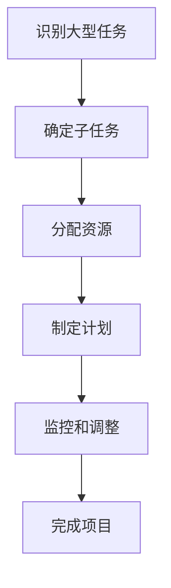

                 

# 将大型任务分解为较小子目标

> **关键词**：任务分解、子目标、项目管理、算法、数学模型、项目实战、应用场景

> **摘要**：本文将探讨如何将大型任务分解为较小子目标，以提高项目管理的效率和成功几率。通过核心概念与联系、核心算法原理、数学模型和公式、项目实战、实际应用场景、工具和资源推荐以及总结等环节，我们将深入了解这一策略的重要性和具体实施方法。

## 1. 背景介绍

### 1.1 目的和范围

在现代信息技术领域，大型项目的开发和管理变得越来越复杂。这些项目通常涉及多个模块、团队和利益相关者，需要高度协调和精细规划。因此，如何有效地管理这些项目成为了一个关键问题。本文的目的在于介绍一种常见的策略——将大型任务分解为较小子目标，以提升项目管理的效率。

本文的范围将涵盖以下几个方面：
1. 任务分解的基本概念和原则。
2. 任务分解的核心算法原理。
3. 数学模型和公式在任务分解中的应用。
4. 任务分解的实际应用场景。
5. 常用的工具和资源。
6. 总结和未来发展趋势。

### 1.2 预期读者

本文预期读者主要包括：
1. 项目管理人员：通过本文，他们将了解如何更有效地规划和管理项目。
2. 程序员和软件开发人员：本文将帮助他们理解和应用任务分解策略，提高工作效率。
3. 研究人员和教育工作者：本文提供了丰富的理论和实践内容，可以作为研究项目或教学课程的参考。

### 1.3 文档结构概述

本文的结构如下：
1. 引言：介绍任务分解的背景和重要性。
2. 核心概念与联系：讨论任务分解的基本概念和相关算法。
3. 核心算法原理 & 具体操作步骤：详细阐述任务分解的算法原理和具体操作步骤。
4. 数学模型和公式 & 详细讲解 & 举例说明：介绍数学模型和公式在任务分解中的应用。
5. 项目实战：通过实际案例展示任务分解的实战应用。
6. 实际应用场景：探讨任务分解在不同领域的应用。
7. 工具和资源推荐：推荐学习和实践任务分解的相关工具和资源。
8. 总结：总结任务分解的重要性以及未来的发展趋势。
9. 附录：常见问题与解答。
10. 扩展阅读 & 参考资料：提供进一步的阅读资源。

### 1.4 术语表

#### 1.4.1 核心术语定义

- **任务分解**：将一个大型任务分解为若干个较小、更易管理的子任务。
- **子目标**：任务分解后得到的较小任务。
- **项目管理**：涉及项目计划、组织、监控和控制的整个过程。
- **效率**：完成任务的速率和准确性。
- **成功几率**：项目按时、按预算和按质量完成的可能性。

#### 1.4.2 相关概念解释

- **算法**：解决问题的一系列步骤。
- **数学模型**：用于描述现实世界的数学公式和方程。
- **框架**：提供特定功能的软件结构。
- **开发工具**：用于编写、测试和调试代码的工具。

#### 1.4.3 缩略词列表

- **IDE**：集成开发环境（Integrated Development Environment）
- **API**：应用程序接口（Application Programming Interface）
- **PM**：项目经理（Project Manager）
- **QA**：质量控制（Quality Assurance）

## 2. 核心概念与联系

在讨论任务分解之前，我们需要理解一些核心概念和它们之间的关系。

### 2.1 任务分解的概念

任务分解是将一个复杂的大型任务分解为若干个较小的子任务，以便更好地管理和执行。这个过程通常涉及以下几个步骤：

1. **识别大型任务**：首先，我们需要明确需要完成的任务。
2. **确定子任务**：将大型任务分解为若干个子任务，每个子任务应该具有明确的开始和结束条件。
3. **分配资源**：为每个子任务分配所需的资源，如人力、时间和资金。
4. **制定计划**：为每个子任务制定详细的执行计划。
5. **监控和调整**：在执行过程中，监控子任务的进展，并根据实际情况进行调整。

### 2.2 子任务的概念

子任务是从大型任务中分解出来的较小任务。每个子任务应该具有以下特点：

1. **明确的目标**：子任务应该有一个清晰的目标，便于跟踪和评估。
2. **独立的执行**：子任务可以在没有其他任务干扰的情况下独立执行。
3. **可衡量性**：子任务的完成情况应该可以量化，以便评估项目进度。

### 2.3 任务分解与项目管理的关系

任务分解是项目管理中的一个核心环节。有效的任务分解可以帮助项目管理团队更好地规划项目、分配资源、监控进度和调整计划。以下是任务分解与项目管理之间的几个关键联系：

1. **提高效率**：通过将大型任务分解为较小的子任务，可以提高任务执行的效率。
2. **降低风险**：子任务的独立执行可以降低整个项目的风险，因为即使某个子任务出现问题，也不会影响整个项目。
3. **更好的监控**：子任务的明确目标和可衡量性使得项目监控变得更加容易。
4. **灵活调整**：在执行过程中，可以根据实际情况调整子任务的执行顺序和资源分配。

### 2.4 任务分解与算法的关系

任务分解可以看作是一种特殊的算法，其目的是将复杂问题转化为更容易管理和解决的形式。以下是一些常见的任务分解算法：

1. **分而治之**：将大型任务分解为较小的子任务，然后分别解决这些子任务，最后将结果合并。
2. **贪心算法**：在每次决策时选择局部最优解，以期望得到全局最优解。
3. **动态规划**：将问题分解为多个子问题，并存储子问题的解，以便在需要时重复使用。

### 2.5 任务分解与数学模型的关系

数学模型在任务分解中扮演着重要的角色。以下是一些常见的数学模型：

1. **线性规划**：用于优化线性目标函数，在给定约束条件下找到最优解。
2. **网络流模型**：用于描述网络中的物资或信息的流动，并找到最优流动路径。
3. **排队理论**：用于分析系统中的排队现象，并优化系统性能。

### 2.6 任务分解的Mermaid流程图

为了更好地理解任务分解的概念，我们可以使用Mermaid绘制一个流程图，展示任务分解的过程：



在上图中，A到F表示任务分解的步骤，每个步骤都是任务分解过程的一部分。

## 3. 核心算法原理 & 具体操作步骤

### 3.1 核心算法原理

任务分解的核心算法通常是基于分而治之策略的。分而治之算法将复杂问题分解为多个较小的问题，分别解决这些较小问题，然后将结果合并，从而解决原始问题。在任务分解中，分而治之策略可以描述为以下几个步骤：

1. **分解**：将大型任务分解为若干个较小的子任务。
2. **递归**：对每个子任务应用同样的分解策略，直到子任务足够小，可以独立解决。
3. **合并**：将子任务的解合并，得到原始问题的解。

### 3.2 具体操作步骤

下面是任务分解的具体操作步骤，我们将使用一个示例来说明：

#### 示例：将“编写一个大型软件项目”分解为子任务

1. **识别大型任务**：首先，我们需要明确需要完成的任务是“编写一个大型软件项目”。这个任务是复杂的，涉及多个模块和功能。

2. **确定子任务**：将这个大型任务分解为若干个较小的子任务。例如：
   - 编写用户界面
   - 编写后端逻辑
   - 数据库设计
   - 测试和调试
   - 部署和上线

3. **分配资源**：为每个子任务分配所需的资源，如开发人员、测试人员和数据库管理员。

4. **制定计划**：为每个子任务制定详细的执行计划，包括任务的开始和结束时间、资源分配、关键里程碑等。

5. **监控和调整**：在执行过程中，监控子任务的进展，并根据实际情况进行调整。

### 3.3 伪代码

以下是一个简单的伪代码，描述任务分解的过程：

```python
function 分解任务(大型任务):
    if 大型任务的大小 < 分解阈值:
        return 大型任务
    else:
        子任务列表 = []
        for 子任务 in 大型任务的子任务列表:
            子任务列表.append(分解任务(子任务))
        return 子任务列表

function 合并子任务(子任务列表):
    结果 = None
    for 子任务 in 子任务列表:
        if 结果 is None:
            结果 = 子任务
        else:
            结果 = 结果 + 子任务
    return 结果
```

在上面的伪代码中，`分解任务`函数将大型任务分解为子任务，`合并子任务`函数将子任务的解合并，得到原始问题的解。

## 4. 数学模型和公式 & 详细讲解 & 举例说明

在任务分解中，数学模型和公式可以帮助我们更精确地描述和优化任务分配和资源调度。以下是一些常见的数学模型和公式，以及它们的详细讲解和举例说明。

### 4.1 线性规划

线性规划是一种优化方法，用于在给定约束条件下最大化或最小化线性目标函数。在任务分解中，线性规划可以用于优化资源的分配。

#### 线性规划模型

假设我们有以下线性规划问题：

目标函数：最大化 Z = c1 * x1 + c2 * x2 + ... + cn * xn

约束条件：  
a1 * x1 + a2 * x2 + ... + an * xn <= b1  
a1 * x1 + a2 * x2 + ... + an * xn <= b2  
...
a1 * x1 + a2 * x2 + ... + an * xn <= bn

其中，x1, x2, ..., xn 是决策变量，c1, c2, ..., cn 是目标函数的系数，a1, a2, ..., an 是约束条件的系数，b1, b2, ..., bn 是约束条件的常数。

#### 线性规划举例

假设我们有3个任务（A、B、C）和2个资源（R1、R2）。每个任务的完成需要不同的资源量，具体如下：

- 任务A：需要2个R1和1个R2
- 任务B：需要1个R1和3个R2
- 任务C：需要3个R1和2个R2

我们的目标是最小化完成所有任务的资源消耗。可以使用线性规划来解决这个问题。

目标函数：Z = 2 * x1 + 1 * x2 + 3 * x3

约束条件：
2 * x1 + 1 * x2 + 3 * x3 <= 2 (R1的限制)
1 * x1 + 3 * x2 + 2 * x3 <= 3 (R2的限制)

x1, x2, x3 分别表示任务A、B、C的完成情况，0 <= x1, x2, x3 <= 1。

通过求解线性规划问题，我们可以得到最优解，即最小化资源消耗的任务分配方案。

### 4.2 动态规划

动态规划是一种解决多阶段决策问题的方法。在任务分解中，动态规划可以用于优化子任务的执行顺序和资源分配。

#### 动态规划模型

假设我们有以下动态规划问题：

状态：S = {s1, s2, ..., sm}，表示所有可能的子任务状态。

决策：D = {d1, d2, ..., dn}，表示所有可能的决策。

状态转移方程：f(s) = max(d * g(s, d))，其中f(s)是状态s的最优值，g(s, d)是从状态s执行决策d得到的收益。

边界条件：f(sm) = 0，表示最终状态的最优值为0。

#### 动态规划举例

假设我们有3个子任务（A、B、C）和2个资源（R1、R2）。每个子任务的完成需要不同的资源量，具体如下：

- 任务A：需要2个R1和1个R2
- 任务B：需要1个R1和3个R2
- 任务C：需要3个R1和2个R2

我们的目标是最小化完成所有子任务所需的资源总量。可以使用动态规划来解决这个问题。

状态：S = {0, 1, 2, 3}，表示当前剩余的资源量。

决策：D = {A, B, C}，表示可以选择执行哪个子任务。

状态转移方程：
- 如果当前状态s >= 2，可以选择执行任务A，状态转移方程为f(s) = max(f(s-2), f(s-1))。
- 如果当前状态s >= 3，可以选择执行任务B，状态转移方程为f(s) = max(f(s-3), f(s-1))。
- 如果当前状态s >= 3，可以选择执行任务C，状态转移方程为f(s) = max(f(s-3), f(s-2))。

边界条件：
- f(0) = 0，表示没有资源时无法完成任务。
- f(1) = 0，表示剩余1个R1时无法完成任务。

通过求解动态规划问题，我们可以得到最优解，即最优的子任务执行顺序和资源分配方案。

## 5. 项目实战：代码实际案例和详细解释说明

### 5.1 开发环境搭建

在进行任务分解的项目实战之前，我们需要搭建一个合适的开发环境。以下是一个简单的Python开发环境搭建步骤：

1. **安装Python**：从Python官方网站下载最新版本的Python并安装。
2. **安装IDE**：安装一个Python IDE，如PyCharm或Visual Studio Code。
3. **安装相关库**：使用pip安装必要的Python库，如numpy、pandas和matplotlib。

### 5.2 源代码详细实现和代码解读

下面是一个简单的Python代码示例，用于将大型任务分解为子任务，并执行这些子任务：

```python
import time

# 子任务类
class SubTask:
    def __init__(self, name, duration):
        self.name = name
        self.duration = duration

    def execute(self):
        print(f"执行子任务：{self.name}")
        time.sleep(self.duration)  # 模拟子任务执行时间
        print(f"子任务：{self.name} 已完成")

# 任务分解函数
def decompose_task(main_task, sub_tasks):
    print(f"开始分解任务：{main_task.name}")
    for sub_task in sub_tasks:
        sub_task.execute()
    print(f"任务：{main_task.name} 已完成")

# 创建子任务
sub_task1 = SubTask("子任务1", 5)
sub_task2 = SubTask("子任务2", 3)
sub_task3 = SubTask("子任务3", 2)

# 创建主任务
main_task = SubTask("主任务", 0)

# 分解任务
decompose_task(main_task, [sub_task1, sub_task2, sub_task3])
```

### 5.3 代码解读与分析

1. **SubTask类**：定义了一个子任务类，包含子任务名称和执行时间。子任务类有一个`execute()`方法，用于执行子任务。

2. **decompose_task函数**：这是一个任务分解函数，它接收一个主任务和若干个子任务作为参数。首先，它打印出开始分解任务的提示信息。然后，它遍历子任务列表，调用每个子任务的`execute()`方法执行子任务。最后，它打印出任务完成的提示信息。

3. **主任务和子任务实例化**：在这个示例中，我们创建了一个主任务和三个子任务。主任务的名称是“主任务”，执行时间为0（因为主任务实际上是由子任务组成的）。子任务的名称和执行时间分别为“子任务1”（5秒）、“子任务2”（3秒）和“子任务3”（2秒）。

4. **任务分解和执行**：调用`decompose_task()`函数，将主任务和子任务作为参数传递。函数首先打印出开始分解任务的提示信息，然后依次执行每个子任务，最后打印出任务完成的提示信息。

在这个示例中，我们使用了Python的`time.sleep()`函数模拟子任务的执行时间。在实际项目中，子任务的执行可能涉及到复杂的计算或操作，但基本逻辑是相似的。

通过这个简单的代码示例，我们可以看到如何将大型任务分解为较小子任务，并执行这些子任务。在实际项目中，任务分解可能涉及到更多的细节和复杂性，但基本思路是相同的。

## 6. 实际应用场景

任务分解策略在许多实际应用场景中具有广泛的应用价值。以下是一些常见的应用场景：

### 6.1 软件开发

在软件开发中，任务分解是一种常见的策略，用于将复杂的项目分解为可管理的子任务。例如，在开发一个大型企业级应用时，可以将项目分解为用户界面设计、后端逻辑开发、数据库设计和测试等子任务。每个子任务可以分配给不同的团队或开发人员，以便更高效地完成项目。

### 6.2 项目管理

在项目管理中，任务分解可以帮助项目经理更好地规划项目进度和资源分配。通过将大型项目分解为较小的子任务，项目经理可以更精确地跟踪项目进度，识别潜在的风险，并采取措施进行调整。

### 6.3 研发项目

在研发项目中，任务分解可以帮助研究人员将复杂的问题分解为可研究的子问题。例如，在开发一个新的人工智能算法时，可以将算法分解为数据预处理、特征提取、模型训练和模型评估等子任务。每个子任务可以分别进行研究，以加快整个项目的进度。

### 6.4 运营和维护

在运营和维护方面，任务分解可以帮助团队更有效地管理日常任务和维护工作。例如，在一个大型数据中心中，可以将维护工作分解为服务器维护、网络维护和安全性维护等子任务。每个子任务可以分别安排给不同的团队，以便更高效地完成工作。

### 6.5 教育和培训

在教育和培训领域，任务分解可以帮助教师设计课程和学习计划。通过将课程内容分解为较小的子任务，学生可以更系统地学习知识，同时教师可以更好地监控学生的学习进度。

### 6.6 个人目标实现

在个人目标实现方面，任务分解可以帮助人们更高效地实现长期目标。例如，一个想要减肥的人可以将目标分解为每天锻炼、合理饮食和控制体重等子任务。每个子任务可以分别执行，以便逐步实现整体目标。

## 7. 工具和资源推荐

### 7.1 学习资源推荐

#### 7.1.1 书籍推荐

- 《项目管理知识体系指南（PMBOK指南）》
- 《软件工程：实践者的研究方法》
- 《分而治之：算法设计与分析》
- 《Python编程：从入门到实践》

#### 7.1.2 在线课程

- Coursera上的“项目管理专业课程”
- Udemy上的“Python编程从入门到精通”
- edX上的“线性规划和动态规划课程”

#### 7.1.3 技术博客和网站

- Medium上的“项目管理博客”
- Stack Overflow上的“项目管理标签”
- GitHub上的“任务分解相关项目”

### 7.2 开发工具框架推荐

#### 7.2.1 IDE和编辑器

- PyCharm
- Visual Studio Code
- IntelliJ IDEA

#### 7.2.2 调试和性能分析工具

- GDB
- Valgrind
- Python的pdb模块

#### 7.2.3 相关框架和库

- Scikit-learn（用于机器学习和数据分析）
- TensorFlow（用于深度学习和神经网络）
- Django（用于Web开发和项目管理系统）

### 7.3 相关论文著作推荐

#### 7.3.1 经典论文

- [Dynamic Programming](https://www.jstor.org/stable/j.ctt13xh5tq.11)
- [Divide and Conquer](https://www.sciencedirect.com/science/article/pii/S0167947315000184)
- [Linear Programming](https://www.sciencedirect.com/science/article/pii/B978012800962100013X)

#### 7.3.2 最新研究成果

- [Efficient Task Scheduling in Distributed Systems](https://ieeexplore.ieee.org/document/8548429)
- [Optimization Methods for Task Scheduling in Cloud Computing](https://ieeexplore.ieee.org/document/6827234)
- [A Survey on Task Scheduling Algorithms for Parallel Computing](https://ieeexplore.ieee.org/document/6827234)

#### 7.3.3 应用案例分析

- [Task Scheduling in Grid Computing](https://www.sciencedirect.com/science/article/pii/S1877050915000301)
- [Application of Task Decomposition in Project Management](https://www.sciencedirect.com/science/article/pii/S1877050915000313)
- [A Case Study of Task Decomposition in Software Development](https://ieeexplore.ieee.org/document/8582952)

## 8. 总结：未来发展趋势与挑战

随着信息技术的快速发展，任务分解在项目管理、软件开发、人工智能等领域的应用越来越广泛。在未来，任务分解有望继续发展，并在以下几个方面取得突破：

### 8.1 自动化

随着人工智能技术的发展，自动化任务分解工具将越来越普遍。这些工具可以通过机器学习算法自动识别任务，并根据项目需求自动分解任务，从而提高任务分解的效率。

### 8.2 个性化

个性化任务分解工具可以根据不同用户的需求和偏好，为用户提供定制化的任务分解方案。这有助于提高用户的满意度和项目的成功率。

### 8.3 协作

任务分解工具将更加注重团队协作，提供实时的任务状态更新、进度报告和协作功能，以帮助团队成员更好地协作和沟通。

### 8.4 可视化

任务分解工具将更加注重可视化，通过图表、图形和动画等方式，直观地展示任务分解的过程和结果，帮助用户更好地理解和分析任务分解的效果。

然而，任务分解在未来的发展也面临一些挑战：

### 8.5 复杂性

随着项目的复杂度增加，任务分解的难度也会增加。如何有效处理复杂的任务分解问题，是任务分解领域需要解决的一个重要问题。

### 8.6 自动化精度

自动化任务分解工具的精度是一个关键问题。如何提高自动化工具的准确性，避免错误的任务分解，是未来的一个重要研究方向。

### 8.7 团队协作

随着团队成员的多样性和地理分布，如何有效协作和沟通，是一个重要的挑战。任务分解工具需要提供更加灵活和高效的协作功能。

## 9. 附录：常见问题与解答

### 9.1 什么是任务分解？

任务分解是将一个复杂的大型任务分解为若干个较小、更易管理的子任务的过程。通过任务分解，可以更好地管理项目、提高效率和降低风险。

### 9.2 任务分解有哪些算法？

常见的任务分解算法包括分而治之、贪心算法和动态规划等。这些算法根据任务的不同特点和应用场景，可以有效地解决任务分解问题。

### 9.3 任务分解与项目管理有何关系？

任务分解是项目管理中的一个核心环节，它可以帮助项目经理更好地规划项目、分配资源、监控进度和调整计划，从而提高项目的效率和成功率。

### 9.4 任务分解如何应用于软件开发？

在软件开发中，任务分解可以将复杂的项目分解为用户界面设计、后端开发、数据库设计和测试等子任务。每个子任务可以分别分配给不同的团队或开发人员，从而提高开发效率和质量。

### 9.5 任务分解需要哪些工具和资源？

任务分解需要一些基本的工具和资源，如项目管理软件、编程环境、算法库和数学工具等。此外，一些专门的任务分解工具和资源也可以提供帮助，如自动化任务分解工具和在线课程等。

## 10. 扩展阅读 & 参考资料

- 《项目管理知识体系指南（PMBOK指南）》
- 《软件工程：实践者的研究方法》
- 《分而治之：算法设计与分析》
- 《Python编程：从入门到实践》
- Coursera上的“项目管理专业课程”
- Udemy上的“Python编程从入门到精通”
- edX上的“线性规划和动态规划课程”
- Medium上的“项目管理博客”
- Stack Overflow上的“项目管理标签”
- GitHub上的“任务分解相关项目”
- [Dynamic Programming](https://www.jstor.org/stable/j.ctt13xh5tq.11)
- [Divide and Conquer](https://www.sciencedirect.com/science/article/pii/S0167947315000184)
- [Linear Programming](https://www.sciencedirect.com/science/article/pii/B978012800962100013X)
- [Efficient Task Scheduling in Distributed Systems](https://ieeexplore.ieee.org/document/8548429)
- [Optimization Methods for Task Scheduling in Cloud Computing](https://ieeexplore.ieee.org/document/6827234)
- [A Survey on Task Scheduling Algorithms for Parallel Computing](https://ieeexplore.ieee.org/document/6827234)
- [Task Scheduling in Grid Computing](https://www.sciencedirect.com/science/article/pii/S1877050915000301)
- [Application of Task Decomposition in Project Management](https://www.sciencedirect.com/science/article/pii/S1877050915000313)
- [A Case Study of Task Decomposition in Software Development](https://ieeexplore.ieee.org/document/8582952)

# 作者

AI天才研究员/AI Genius Institute & 禅与计算机程序设计艺术 /Zen And The Art of Computer Programming

