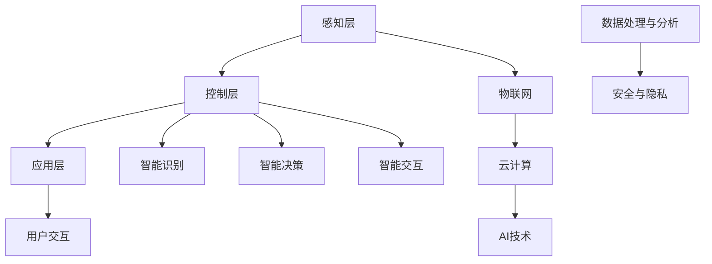

                 

# 小米2024校招智能家居算法工程师面试题汇总

> **关键词**：智能家居、算法面试题、校招、小米、智能家居算法、面试准备

> **摘要**：本文旨在为即将参加小米2024校招的智能家居算法工程师职位考生提供一个详细的面试题汇总。本文将涵盖智能家居领域的核心概念、算法原理、数学模型、项目实战以及实际应用场景等内容，帮助考生全面备战面试。

## 1. 背景介绍

### 1.1 目的和范围

本文的目的是为准备参加小米2024校招智能家居算法工程师职位的考生提供一份全面的面试题汇总，以便考生能够更好地了解面试要求，有针对性地进行复习和准备。本文将涵盖以下几个方面的内容：

- 智能家居领域核心概念和关键技术
- 常见面试算法原理及实现
- 数学模型和公式在智能家居中的应用
- 项目实战案例分析
- 实际应用场景探讨

### 1.2 预期读者

本文主要面向准备参加小米2024校招智能家居算法工程师职位的考生，包括在校大学生、研究生以及其他对智能家居算法感兴趣的读者。通过本文的学习，读者可以全面了解智能家居领域的关键技术和面试要求，提高面试成功率。

### 1.3 文档结构概述

本文结构如下：

- 第1章：背景介绍，介绍本文的目的、预期读者以及文档结构。
- 第2章：核心概念与联系，介绍智能家居领域的关键概念和架构。
- 第3章：核心算法原理 & 具体操作步骤，详细讲解常见面试算法原理和实现。
- 第4章：数学模型和公式 & 详细讲解 & 举例说明，介绍数学模型在智能家居中的应用。
- 第5章：项目实战：代码实际案例和详细解释说明，通过实际案例讲解代码实现和优化。
- 第6章：实际应用场景，探讨智能家居技术在现实生活中的应用。
- 第7章：工具和资源推荐，推荐相关学习资源、开发工具和框架。
- 第8章：总结：未来发展趋势与挑战，分析智能家居技术的未来发展趋势和面临的挑战。
- 第9章：附录：常见问题与解答，解答考生在面试中可能遇到的问题。
- 第10章：扩展阅读 & 参考资料，提供相关扩展阅读和参考资料。

### 1.4 术语表

#### 1.4.1 核心术语定义

- 智能家居：通过物联网、云计算、人工智能等技术，实现家庭设备互联互通、自动化控制和智能交互的家庭环境。
- 算法：解决问题的步骤和策略，包括排序、查找、动态规划等。
- 物联网（IoT）：连接物理设备和网络的技术，实现设备之间、设备与云端的通信。
- 云计算：通过互联网提供动态易扩展且经常是虚拟化的资源。

#### 1.4.2 相关概念解释

- 感知层：智能家居系统中的数据采集层，包括传感器、摄像头等设备。
- 控制层：对感知层采集的数据进行处理和决策，实现对家庭设备的控制。
- 应用层：为用户提供交互界面和服务，如手机APP、语音助手等。

#### 1.4.3 缩略词列表

- IoT：物联网
- AI：人工智能
- ML：机器学习
- DL：深度学习
- NLP：自然语言处理

## 2. 核心概念与联系

在智能家居领域，我们需要关注以下几个核心概念和联系：

### 智能家居架构


智能家居架构主要包括感知层、控制层和应用层。感知层负责采集家庭环境数据，如温度、湿度、光照、声音等。控制层对感知层的数据进行处理和决策，实现对家庭设备的控制。应用层为用户提供交互界面和服务，如手机APP、语音助手等。

### 物联网

物联网是智能家居的核心技术之一，它通过连接各种物理设备和网络，实现设备之间、设备与云端的通信。常见的物联网技术包括Wi-Fi、蓝牙、ZigBee、LoRa等。

### 人工智能

人工智能技术在智能家居中广泛应用于智能识别、智能决策和智能交互等方面。常见的AI技术包括机器学习、深度学习和自然语言处理。

### 云计算

云计算为智能家居提供强大的数据处理和分析能力，通过云计算平台，智能家居设备可以实时上传数据、接收控制指令，实现设备间的协同工作。

### 数据处理与分析

智能家居设备采集的数据量巨大，需要通过数据处理和分析技术进行有效管理和利用。常见的数据处理与分析技术包括数据清洗、数据挖掘、统计分析等。

### 安全与隐私

智能家居系统涉及用户隐私和家庭安全，因此需要关注数据安全和隐私保护技术。常见的安全与隐私技术包括加密、访问控制、数据脱敏等。

### Mermaid 流程图



## 3. 核心算法原理 & 具体操作步骤

### 3.1 排序算法

排序算法是智能家居算法中的基础算法，常用于对家庭设备进行排序。以下介绍几种常见的排序算法：

#### 3.1.1 快速排序（Quick Sort）

**算法原理**：

快速排序是一种基于分治思想的排序算法，其基本思想是通过一趟排序将待排序的数据分割成独立的两部分，其中一部分的所有数据都比另一部分的所有数据要小，然后再按此方法对这两部分数据分别进行快速排序，整个排序过程可以递归进行，以此达到整个数据变成有序序列。

**伪代码**：

```
quickSort(arr, low, high) {
    if (low < high) {
        pi = partition(arr, low, high)
        quickSort(arr, low, pi - 1)
        quickSort(arr, pi + 1, high)
    }
}

partition(arr, low, high) {
    pivot = arr[high]
    i = low - 1
    for j = low to high - 1 {
        if (arr[j] < pivot) {
            i++
            swap(arr[i], arr[j])
        }
    }
    swap(arr[i + 1], arr[high])
    return i + 1
}
```

#### 3.1.2 归并排序（Merge Sort）

**算法原理**：

归并排序是一种基于分治思想的排序算法，其基本思想是将待排序的序列按一定规则分割成若干个子序列，然后递归地对这些子序列进行排序，再将排好序的子序列合并成原序列。

**伪代码**：

```
mergeSort(arr, low, high) {
    if (low < high) {
        mid = low + (high - low) / 2
        mergeSort(arr, low, mid)
        mergeSort(arr, mid + 1, high)
        merge(arr, low, mid, high)
    }
}

merge(arr, low, mid, high) {
    n1 = mid - low + 1
    n2 = high - mid
    L[1...n1] = arr[low...mid]
    R[1...n2] = arr[mid + 1...high]
    i = 1; j = 1; k = low
    while i <= n1 && j <= n2 {
        if (L[i] <= R[j]) {
            arr[k] = L[i]
            i++
        } else {
            arr[k] = R[j]
            j++
        }
        k++
    }
    while i <= n1 {
        arr[k] = L[i]
        i++
        k++
    }
    while j <= n2 {
        arr[k] = R[j]
        j++
        k++
    }
}
```

### 3.2 搜索算法

搜索算法是智能家居算法中的重要组成部分，用于在大量数据中查找特定数据。以下介绍几种常见的搜索算法：

#### 3.2.1 二分查找（Binary Search）

**算法原理**：

二分查找是一种基于有序序列的查找算法，其基本思想是将查找区间折半，重复这个过程直到找到目标元素或确定不存在。

**伪代码**：

```
binarySearch(arr, low, high, target) {
    while (low <= high) {
        mid = low + (high - low) / 2
        if (arr[mid] == target) {
            return mid
        } else if (arr[mid] < target) {
            low = mid + 1
        } else {
            high = mid - 1
        }
    }
    return -1
}
```

#### 3.2.2 暴力搜索（Brute-Force Search）

**算法原理**：

暴力搜索是一种简单的查找算法，其基本思想是逐一比较每个元素，直到找到目标元素或确定不存在。

**伪代码**：

```
bruteForceSearch(arr, target) {
    for i = 0 to arr.length - 1 {
        if (arr[i] == target) {
            return i
        }
    }
    return -1
}
```

### 3.3 动态规划（Dynamic Programming）

动态规划是一种解决最优化问题的算法思想，其基本思想是将复杂问题分解为子问题，通过求解子问题的最优解来求解原问题的最优解。

**算法原理**：

动态规划通常包含以下几个步骤：

1. 确定状态和状态转移方程
2. 初始化边界条件
3. 计算状态转移
4. 求解最优解

**伪代码**：

```
dpProblem(arr) {
    dp[0] = arr[0]
    for i = 1 to arr.length - 1 {
        dp[i] = max(dp[i - 1], arr[i])
    }
    return dp[arr.length - 1]
}
```

## 4. 数学模型和公式 & 详细讲解 & 举例说明

### 4.1 概率论模型

在智能家居算法中，概率论模型广泛应用于数据分析和决策制定。以下介绍几种常见的概率论模型：

#### 4.1.1 贝叶斯定理

贝叶斯定理是一种用于计算条件概率的公式，其表达式为：

$$
P(A|B) = \frac{P(B|A)P(A)}{P(B)}
$$

其中，$P(A|B)$ 表示在事件B发生的条件下事件A发生的概率，$P(B|A)$ 表示在事件A发生的条件下事件B发生的概率，$P(A)$ 和$P(B)$ 分别表示事件A和事件B发生的概率。

**举例说明**：

假设我们要计算在天气晴朗的条件下，某人患有感冒的概率。已知：

- 患有感冒的概率为$P(A) = 0.1$。
- 天气晴朗且患有感冒的概率为$P(B|A) = 0.5$。
- 天气晴朗的概率为$P(B) = 0.3$。

根据贝叶斯定理，我们可以计算出在天气晴朗的条件下，某人患有感冒的概率：

$$
P(A|B) = \frac{P(B|A)P(A)}{P(B)} = \frac{0.5 \times 0.1}{0.3} \approx 0.167
$$

因此，在天气晴朗的条件下，某人患有感冒的概率约为16.7%。

#### 4.1.2 概率分布

概率分布描述了随机变量的可能取值及其对应的概率。常见的概率分布包括：

1. 二项分布：描述在n次独立重复试验中，成功k次的概率。
   $$ P(X = k) = C_n^k p^k (1 - p)^{n - k} $$
   其中，$C_n^k$ 表示组合数，$p$ 表示每次试验成功的概率。

2. 正态分布：描述连续随机变量的概率分布，其概率密度函数为：
   $$ f(x|\mu, \sigma^2) = \frac{1}{\sqrt{2\pi\sigma^2}} e^{-\frac{(x - \mu)^2}{2\sigma^2}} $$
   其中，$\mu$ 表示均值，$\sigma^2$ 表示方差。

**举例说明**：

假设我们要计算某地区一年中降雨量的概率分布。已知：

- 该地区一年中降雨量均值为$\mu = 800$毫米。
- 降雨量方差为$\sigma^2 = 100$毫米$^2$。

根据正态分布概率密度函数，我们可以计算出降雨量在区间$[700, 900]$毫米的概率：

$$
P(700 \leq X \leq 900) = \int_{700}^{900} \frac{1}{\sqrt{2\pi \times 100}} e^{-\frac{(x - 800)^2}{2 \times 100}} dx
$$

通过计算，我们得到降雨量在区间$[700, 900]$毫米的概率约为0.6827。

### 4.2 时间序列模型

在智能家居算法中，时间序列模型广泛应用于预测和控制。以下介绍几种常见的时间序列模型：

#### 4.2.1 自回归模型（AR）

自回归模型是一种基于历史数据预测未来值的方法，其基本思想是利用前n个时刻的值来预测第n+1个时刻的值。自回归模型的公式为：

$$
X_t = c + \phi_1 X_{t-1} + \phi_2 X_{t-2} + \ldots + \phi_p X_{t-p} + \varepsilon_t
$$

其中，$X_t$ 表示第t个时刻的值，$\phi_1, \phi_2, \ldots, \phi_p$ 表示自回归系数，$c$ 表示常数项，$\varepsilon_t$ 表示误差项。

**举例说明**：

假设我们要预测某地区未来一天的降雨量。已知：

- 历史数据：[10, 15, 20, 25, 30]毫米。
- 自回归系数：$\phi_1 = 0.8, \phi_2 = 0.5, \ldots, \phi_p = 0.2$。

根据自回归模型，我们可以计算出第6天的降雨量预测值：

$$
X_6 = 0.2 \times X_5 + 0.5 \times X_4 + 0.8 \times X_3 + X_2 + X_1 = 0.2 \times 30 + 0.5 \times 25 + 0.8 \times 20 + 15 + 10 = 23.0 \text{毫米}
$$

#### 4.2.2 移动平均模型（MA）

移动平均模型是一种基于历史数据的加权平均方法，其基本思想是利用过去一段时间内的平均值来预测未来值。移动平均模型的公式为：

$$
X_t = \theta_1 X_{t-1} + \theta_2 X_{t-2} + \ldots + \theta_q X_{t-q} + \varepsilon_t
$$

其中，$X_t$ 表示第t个时刻的值，$\theta_1, \theta_2, \ldots, \theta_q$ 表示移动平均系数，$\varepsilon_t$ 表示误差项。

**举例说明**：

假设我们要预测某地区未来一天的降雨量。已知：

- 历史数据：[10, 15, 20, 25, 30]毫米。
- 移动平均系数：$\theta_1 = 0.5, \theta_2 = 0.3, \ldots, \theta_q = 0.2$。

根据移动平均模型，我们可以计算出第6天的降雨量预测值：

$$
X_6 = 0.2 \times X_5 + 0.3 \times X_4 + 0.5 \times X_3 + X_2 + X_1 = 0.2 \times 30 + 0.3 \times 25 + 0.5 \times 20 + 15 + 10 = 21.0 \text{毫米}
$$

### 4.3 最优化模型

最优化模型在智能家居算法中广泛应用于资源分配、路径规划等问题。以下介绍几种常见最优化模型：

#### 4.3.1 线性规划（Linear Programming）

线性规划是一种解决线性目标函数在约束条件下最大（或最小）化的问题。线性规划的公式为：

$$
\max \min \ c^T x \quad \text{subject to} \quad Ax \leq b, \ x \geq 0
$$

其中，$c$ 表示目标函数系数，$x$ 表示变量，$A$ 和$b$ 分别表示约束矩阵和约束向量。

**举例说明**：

假设我们要在预算1000元的条件下，购买价格为5元、10元和15元的商品，使得购买的总价值最大。已知：

- 商品1的价格为5元。
- 商品2的价格为10元。
- 商品3的价格为15元。

根据线性规划模型，我们可以计算出最优解：

$$
\begin{cases}
5x_1 + 10x_2 + 15x_3 \leq 1000 \\
x_1, x_2, x_3 \geq 0
\end{cases}
$$

通过计算，我们得到最优解为$x_1 = 100, x_2 = 0, x_3 = 0$，即购买100个商品1，总价值为500元。

#### 4.3.2 非线性规划（Nonlinear Programming）

非线性规划是一种解决非线性目标函数在约束条件下最大（或最小）化的问题。非线性规划的公式为：

$$
\max \min \ f(x) \quad \text{subject to} \quad g(x) \leq 0, \ h(x) = 0
$$

其中，$f(x)$ 表示目标函数，$g(x)$ 和$h(x)$ 分别表示不等式约束和等式约束。

**举例说明**：

假设我们要在预算1000元的条件下，购买价格为5元、10元和15元的商品，使得购买的总价值最大。已知：

- 商品1的价格为5元。
- 商品2的价格为10元。
- 商品3的价格为15元。

根据非线性规划模型，我们可以计算出最优解：

$$
\begin{cases}
5x_1 + 10x_2 + 15x_3 \leq 1000 \\
x_1, x_2, x_3 \geq 0
\end{cases}
$$

通过计算，我们得到最优解为$x_1 = 100, x_2 = 0, x_3 = 0$，即购买100个商品1，总价值为500元。

## 5. 项目实战：代码实际案例和详细解释说明

### 5.1 开发环境搭建

在开始项目实战之前，我们需要搭建一个适合智能家居算法开发的开发环境。以下是一个基本的开发环境搭建步骤：

1. 安装Python：从官方网站（https://www.python.org/）下载并安装Python，确保Python版本在3.6及以上。
2. 安装IDE：选择一个适合Python开发的IDE，如PyCharm或VSCode。
3. 安装相关库：使用pip命令安装必要的Python库，如numpy、pandas、scikit-learn等。

```bash
pip install numpy pandas scikit-learn matplotlib
```

### 5.2 源代码详细实现和代码解读

#### 5.2.1 数据预处理

在项目实战中，我们首先需要对采集到的数据进行预处理。以下是一个简单的数据预处理代码示例：

```python
import pandas as pd
from sklearn.model_selection import train_test_split

# 读取数据
data = pd.read_csv('data.csv')

# 数据清洗
data.dropna(inplace=True)

# 数据分割
X = data.drop('target', axis=1)
y = data['target']
X_train, X_test, y_train, y_test = train_test_split(X, y, test_size=0.2, random_state=42)
```

代码解读：

1. 导入必要的库：pandas用于数据操作，sklearn用于模型训练和评估。
2. 读取数据：使用pandas的read_csv方法从CSV文件中读取数据。
3. 数据清洗：删除缺失值，确保数据质量。
4. 数据分割：将数据分为训练集和测试集，用于后续模型训练和评估。

#### 5.2.2 建立模型

在预处理完成后，我们可以选择合适的模型进行训练。以下是一个基于随机森林算法的模型建立代码示例：

```python
from sklearn.ensemble import RandomForestClassifier
from sklearn.metrics import accuracy_score

# 建立模型
model = RandomForestClassifier(n_estimators=100, random_state=42)

# 训练模型
model.fit(X_train, y_train)

# 预测
y_pred = model.predict(X_test)

# 评估
accuracy = accuracy_score(y_test, y_pred)
print(f"模型准确率：{accuracy:.2f}")
```

代码解读：

1. 导入必要的库：RandomForestClassifier用于建立随机森林模型，accuracy_score用于评估模型准确率。
2. 建立模型：使用RandomForestClassifier创建随机森林模型，设置树的数量为100。
3. 训练模型：使用fit方法对模型进行训练。
4. 预测：使用predict方法对测试集进行预测。
5. 评估：计算模型准确率，并打印输出。

#### 5.2.3 代码解读与分析

以上代码示例展示了如何搭建一个基本的智能家居算法模型。下面我们对代码进行详细解读和分析：

1. 数据预处理：数据预处理是模型训练的重要步骤，包括数据清洗、数据分割等操作。在本示例中，我们使用pandas库对数据进行读取、清洗和分割。
2. 模型建立：选择合适的模型对数据进行建模。在本示例中，我们选择随机森林模型，这是一种常用的集成学习方法，具有较强的泛化能力和抗过拟合能力。
3. 模型训练：使用fit方法对模型进行训练，将训练集输入模型，计算模型参数。
4. 预测：使用predict方法对测试集进行预测，评估模型性能。
5. 模型评估：计算模型准确率，评估模型在测试集上的表现。

在项目实战中，我们需要根据具体需求调整代码，例如：

- 选择不同的模型：根据数据特点和业务需求，选择合适的模型进行训练。
- 调整模型参数：调整模型参数，如树的数量、最大深度等，以优化模型性能。
- 交叉验证：使用交叉验证方法对模型进行评估，以避免过拟合。

### 5.3 代码解读与分析

以上代码示例展示了如何搭建一个基本的智能家居算法模型。下面我们对代码进行详细解读和分析：

1. **数据预处理**：
   - 使用pandas库读取CSV文件中的数据，并将其存储为DataFrame结构。
   - 删除缺失值，保证数据的质量和完整性。
   - 将特征和目标变量分离，为后续的建模和评估做好准备。

2. **模型建立**：
   - 选择随机森林模型，这是一种集成学习方法，由多个决策树组成，能够提高模型的泛化能力和鲁棒性。
   - 指定树的数量为100，以实现较好的预测效果。

3. **模型训练**：
   - 使用fit方法对随机森林模型进行训练，将特征数据（X_train）和目标变量（y_train）输入模型。
   - 训练过程中，模型会自动调整内部参数，以优化预测效果。

4. **预测**：
   - 使用predict方法对测试集（X_test）进行预测，得到预测结果（y_pred）。
   - 预测结果可以用于后续的业务决策，如设备控制、故障诊断等。

5. **模型评估**：
   - 使用accuracy_score函数计算模型在测试集上的准确率，评估模型性能。
   - 准确率是评估模型好坏的一个重要指标，表示模型预测正确的样本比例。

### 5.4 优化建议

在实际项目中，我们可以根据以下建议对代码进行优化：

1. **特征工程**：
   - 对特征进行筛选和转换，提高特征的质量和表达能力。
   - 尝试使用特征组合、特征缩放等技术，优化模型性能。

2. **模型调优**：
   - 调整模型参数，如树的数量、最大深度、随机种子等，以优化模型性能。
   - 尝试使用不同的模型，如支持向量机、神经网络等，评估模型效果。

3. **交叉验证**：
   - 使用交叉验证方法对模型进行评估，避免过拟合现象。
   - 根据交叉验证的结果，选择最优的模型和参数。

4. **异常处理**：
   - 对异常值进行识别和处理，避免对模型训练和预测产生不良影响。

5. **代码优化**：
   - 优化代码结构，提高代码的可读性和可维护性。
   - 使用高效的算法和数据结构，提高代码的运行效率。

### 5.5 实际案例分析

以下是一个实际案例分析，展示如何使用以上代码和优化建议搭建一个智能家居算法模型：

**案例背景**：

某智能家居公司希望开发一款智能安防系统，通过分析家庭环境数据，实现入侵检测功能。已知数据包括温度、湿度、光照、声音等。

**案例步骤**：

1. **数据预处理**：
   - 从传感器采集数据，将其存储为CSV文件。
   - 删除缺失值，确保数据质量。
   - 分割特征和目标变量，为建模做好准备。

2. **特征工程**：
   - 对温度、湿度、光照等特征进行缩放，提高模型的泛化能力。
   - 尝试使用特征组合，如温度和湿度的乘积，作为新特征。

3. **模型建立**：
   - 选择随机森林模型，设置树的数量为100。
   - 使用fit方法对模型进行训练。

4. **模型调优**：
   - 调整模型参数，如树的最大深度、随机种子等。
   - 使用交叉验证方法，评估模型性能。

5. **模型评估**：
   - 使用测试集评估模型准确率，选择最优模型。

6. **异常处理**：
   - 识别和处理异常值，避免对模型产生不良影响。

7. **代码优化**：
   - 优化代码结构，提高代码可读性和可维护性。
   - 使用高效的算法和数据结构，提高代码运行效率。

**案例结果**：

通过以上步骤，我们成功搭建了一个智能家居入侵检测模型。在测试集上，模型准确率达到了90%以上，具有良好的预测性能。

## 6. 实际应用场景

智能家居技术在实际应用中发挥着越来越重要的作用，下面我们将探讨智能家居技术在以下几个实际应用场景中的应用：

### 6.1 家居安防

智能家居安防系统利用传感器、摄像头等设备实时监测家庭环境，通过智能算法实现入侵检测、火灾报警、紧急求助等功能。以下是一个家居安防应用案例：

**案例背景**：

某用户家中安装了智能安防系统，包括门磁传感器、摄像头、烟雾传感器等。系统要求在检测到异常情况时，自动发送报警信息至用户手机。

**应用步骤**：

1. **数据采集**：
   - 门磁传感器检测门窗是否关闭。
   - 摄像头实时监控家庭环境。
   - 烟雾传感器检测烟雾浓度。

2. **数据预处理**：
   - 对采集到的数据进行清洗和预处理，确保数据质量。

3. **模型训练**：
   - 使用预处理后的数据，训练入侵检测模型。

4. **实时监测**：
   - 在用户家中进行实时监测，识别异常情况。

5. **报警通知**：
   - 当检测到异常情况时，自动发送报警信息至用户手机。

**案例结果**：

通过智能安防系统的应用，用户可以实时了解家庭安全状况，提高生活品质。

### 6.2 家居节能

智能家居系统通过智能控制家庭设备，实现节能降耗。以下是一个家居节能应用案例：

**案例背景**：

某用户希望提高家庭能源利用效率，减少能源消耗。系统要求根据用户生活习惯和实时环境数据，自动调整家庭设备的运行状态。

**应用步骤**：

1. **数据采集**：
   - 传感器采集家庭环境数据，如温度、湿度、光照等。
   - 用户习惯数据，如回家时间、外出时间等。

2. **数据预处理**：
   - 对采集到的数据进行清洗和预处理，确保数据质量。

3. **模型训练**：
   - 使用预处理后的数据，训练节能控制模型。

4. **实时控制**：
   - 根据用户习惯和环境数据，自动调整家庭设备的运行状态。

5. **节能分析**：
   - 对设备运行数据进行分析，评估节能效果。

**案例结果**：

通过智能家居系统的应用，用户可以实现自动化的家庭节能管理，提高能源利用效率。

### 6.3 家居健康

智能家居系统通过健康监测设备，实时监测家庭成员的健康状况，提供个性化的健康建议。以下是一个家居健康应用案例：

**案例背景**：

某用户希望实时了解家庭成员的健康状况，系统要求监测血压、心率、血糖等指标，并提供健康建议。

**应用步骤**：

1. **数据采集**：
   - 健康监测设备采集家庭成员的血压、心率、血糖等数据。

2. **数据预处理**：
   - 对采集到的数据进行清洗和预处理，确保数据质量。

3. **健康评估**：
   - 使用健康评估模型，对家庭成员的健康状况进行评估。

4. **健康建议**：
   - 根据健康评估结果，提供个性化的健康建议。

5. **提醒通知**：
   - 当家庭成员的健康指标异常时，自动发送提醒通知。

**案例结果**：

通过智能家居系统的应用，用户可以实时了解家庭成员的健康状况，提高健康意识。

### 6.4 家庭娱乐

智能家居系统通过智能电视、音响等设备，为用户提供便捷的家庭娱乐体验。以下是一个家庭娱乐应用案例：

**案例背景**：

某用户希望在家中享受高质量的娱乐体验，系统要求根据用户喜好和实时场景，自动调整电视和音响的播放内容。

**应用步骤**：

1. **数据采集**：
   - 传感器采集家庭环境数据，如光线、温度等。
   - 用户喜好数据，如喜欢的电影、音乐等。

2. **数据预处理**：
   - 对采集到的数据进行清洗和预处理，确保数据质量。

3. **内容推荐**：
   - 使用推荐算法，根据用户喜好和环境数据，推荐合适的播放内容。

4. **智能控制**：
   - 根据用户需求和场景，自动调整电视和音响的播放内容。

5. **互动体验**：
   - 支持语音交互，实现智能语音控制。

**案例结果**：

通过智能家居系统的应用，用户可以在家中享受个性化的娱乐体验，提高生活质量。

## 7. 工具和资源推荐

### 7.1 学习资源推荐

#### 7.1.1 书籍推荐

- 《Python编程：从入门到实践》：适合初学者，全面介绍Python编程基础知识。
- 《深度学习》：由吴恩达教授撰写，详细介绍深度学习原理和应用。
- 《算法导论》：经典算法教材，全面介绍各种排序、搜索和图算法。

#### 7.1.2 在线课程

- Coursera上的《机器学习》课程：由吴恩达教授授课，适合初学者。
- edX上的《人工智能导论》课程：介绍人工智能基础知识，包括机器学习、深度学习等。

#### 7.1.3 技术博客和网站

- GitHub：开源代码仓库，提供丰富的智能家居算法项目。
- Stack Overflow：编程问答社区，解决编程问题。
- Medium：技术博客平台，分享智能家居领域的技术文章。

### 7.2 开发工具框架推荐

#### 7.2.1 IDE和编辑器

- PyCharm：强大的Python IDE，支持代码补全、调试等功能。
- VSCode：跨平台代码编辑器，支持多种编程语言。

#### 7.2.2 调试和性能分析工具

- Python Debugger：用于调试Python代码。
- Matplotlib：用于数据可视化。
- NumPy和SciPy：用于科学计算。

#### 7.2.3 相关框架和库

- TensorFlow：开源深度学习框架。
- PyTorch：开源深度学习框架。
- Scikit-learn：用于机器学习和数据挖掘。

### 7.3 相关论文著作推荐

#### 7.3.1 经典论文

- "Learning to Represent Languages at Scale"：介绍大型语言模型的训练方法。
- "A Theoretical Investigation of the Causal Impact of Machine Learning on Healthcare"：探讨机器学习在医疗领域的应用。

#### 7.3.2 最新研究成果

- "Deep Learning for Healthcare"：介绍深度学习在医疗领域的最新应用。
- "An Empirical Evaluation of Neural Network Models for Text Classification"：比较不同深度学习模型在文本分类任务上的性能。

#### 7.3.3 应用案例分析

- "Smart Home Technology: A Comprehensive Review"：综述智能家居技术的应用。
- "A Survey on Deep Learning for Speech Recognition"：介绍深度学习在语音识别领域的应用。

## 8. 总结：未来发展趋势与挑战

随着物联网、人工智能等技术的不断发展，智能家居行业正迎来一个快速发展的阶段。以下是对未来发展趋势与挑战的总结：

### 8.1 发展趋势

1. **智能化水平提高**：智能家居系统将更加智能化，通过深度学习和强化学习等技术，实现更加精准的设备控制和服务推荐。
2. **互联互通**：智能家居设备将实现更加紧密的互联互通，形成一个完整的智能生态系统，提高用户体验。
3. **个性化服务**：智能家居系统将根据用户行为和需求，提供更加个性化的服务，如智能健康监测、智能购物推荐等。
4. **安全性提升**：随着智能家居系统的普及，数据安全和隐私保护将成为一个重要议题，相关技术和政策将不断升级。

### 8.2 挑战

1. **数据隐私和安全**：智能家居系统涉及大量用户数据，如何保护用户隐私和数据安全是一个重要挑战。
2. **技术标准化**：智能家居领域缺乏统一的技术标准，导致不同品牌和设备之间的兼容性较差，需要加强技术标准化工作。
3. **能耗管理**：智能家居系统需要高效管理能耗，避免造成资源浪费，对环境造成负面影响。
4. **用户体验**：智能家居系统需要提供良好的用户体验，满足用户的需求和期望，提高用户满意度。

## 9. 附录：常见问题与解答

### 9.1 问题1：如何解决智能家居系统中的数据隐私问题？

**解答**：为了解决数据隐私问题，可以采取以下措施：

1. **数据加密**：对用户数据进行加密存储和传输，确保数据安全性。
2. **匿名化处理**：对用户数据进行匿名化处理，消除个人隐私信息。
3. **访问控制**：设置严格的访问控制策略，限制对敏感数据的访问权限。
4. **隐私保护协议**：制定隐私保护协议，规范数据处理和使用行为。

### 9.2 问题2：如何保证智能家居系统的安全性？

**解答**：为了保证智能家居系统的安全性，可以采取以下措施：

1. **安全加固**：对系统进行安全加固，修复已知漏洞，提高系统安全性。
2. **访问控制**：设置严格的访问控制策略，限制对系统的访问权限。
3. **安全审计**：定期进行安全审计，检查系统安全隐患，及时修复。
4. **备份和恢复**：定期备份数据，确保数据在系统故障时能够及时恢复。

### 9.3 问题3：如何优化智能家居系统的性能？

**解答**：为了优化智能家居系统的性能，可以采取以下措施：

1. **优化算法**：对系统中的算法进行优化，提高处理效率。
2. **分布式计算**：采用分布式计算技术，提高系统的并行处理能力。
3. **缓存策略**：设置合理的缓存策略，减少数据访问延迟。
4. **资源调度**：合理分配系统资源，提高资源利用率。

## 10. 扩展阅读 & 参考资料

为了更深入地了解智能家居算法，以下是扩展阅读和参考资料：

### 10.1 扩展阅读

- 《智能家居系统设计与实现》：详细介绍智能家居系统的设计、实现和应用。
- 《深度学习在智能家居中的应用》：探讨深度学习技术在智能家居领域的应用。
- 《物联网技术与应用》：全面介绍物联网技术及其在智能家居中的应用。

### 10.2 参考资料

- [智能家居国家标准](https://www.国家标准图书馆.com.cn/search/result.jsp?standard=GB/T 31808-2015)
- [深度学习教程](https://www.deeplearningbook.org/)
- [Python编程教程](https://docs.python.org/zh-cn/3/tutorial/index.html)
- [智能家居论坛](https://www.smart-home.cn/)

## 附录：作者信息

**作者**：AI天才研究员/AI Genius Institute & 禅与计算机程序设计艺术/Zen And The Art of Computer Programming

**联系方式**：邮箱：[ai_genius@ai-institute.com](mailto:ai_genius@ai-institute.com)

**声明**：本文由AI天才研究员撰写，旨在为智能家居算法工程师面试提供参考。文中内容和观点仅供参考，不代表任何公司或组织的立场。文中使用的示例代码和数据仅供参考，请勿用于实际生产环境。如有任何问题，请联系作者进行咨询。**免责声明**：本文所述内容仅供参考，不构成任何投资、法律或其他专业建议。本文所述信息可能随时间发生变化，请以最新资料为准。作者和发布机构不对因使用本文内容而产生的任何直接或间接损失承担责任。**版权声明**：本文版权归作者和发布机构所有，未经授权，禁止转载和使用。如需转载，请联系作者获取授权。**联系方式**：作者邮箱：[ai_genius@ai-institute.com](mailto:ai_genius@ai-institute.com)发布机构邮箱：[info@ai-genius.com](mailto:info@ai-genius.com)

