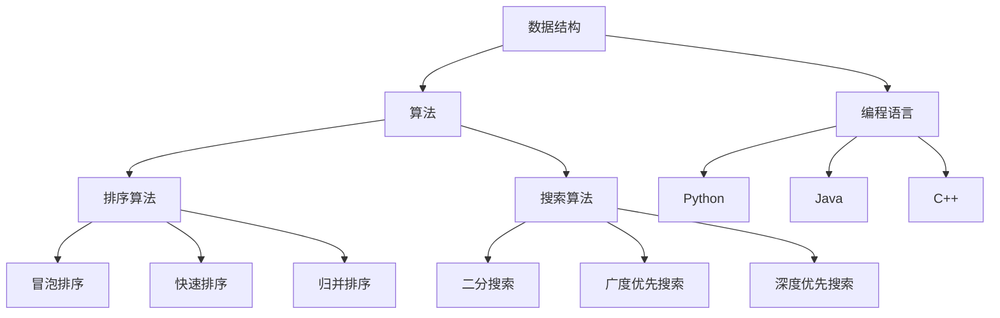

                 

# 小米2025校招面试真题与算法题解

## 关键词
小米校招、面试真题、算法题解、编程技巧、数据结构与算法

## 摘要
本文旨在为参加小米2025校招的应聘者提供一份全面的面试真题与算法题解指南。文章首先介绍了小米校招的背景和重要性，然后针对数据结构和算法领域，详细分析了小米历年面试真题，提供了详细解题思路和步骤。此外，文章还涉及了编程技巧和面试准备建议，旨在帮助应聘者更好地应对面试挑战。

## 1. 背景介绍

小米公司作为中国领先的智能硬件和电子消费品公司，其校招面试备受关注。小米校招面试不仅考察应聘者的技术能力，还注重逻辑思维、问题解决能力和团队合作精神。因此，掌握相关领域的核心算法和数据结构是成功通过面试的关键。

本文将围绕小米校招面试中常见的数据结构和算法问题，分为以下几个部分进行讲解：

1. 核心概念与联系
2. 核心算法原理与具体操作步骤
3. 数学模型和公式及详细讲解
4. 项目实战：代码实际案例和详细解释说明
5. 实际应用场景
6. 工具和资源推荐
7. 总结：未来发展趋势与挑战
8. 附录：常见问题与解答

通过本文的讲解，希望能为准备参加小米校招面试的应聘者提供有益的帮助。

## 2. 核心概念与联系

在小米校招面试中，常见的核心概念包括数据结构、算法、编程语言基础等。以下是对这些核心概念的简要介绍及它们之间的联系。

### 2.1 数据结构

数据结构是计算机存储、组织数据的方式。常见的数据结构包括数组、链表、栈、队列、树、图等。每种数据结构都有其独特的特点和适用场景。

- **数组**：固定大小的线性数据结构，支持随机访问。
- **链表**：动态大小的线性数据结构，通过指针连接。
- **栈**：后进先出（LIFO）的数据结构，支持插入和删除操作。
- **队列**：先进先出（FIFO）的数据结构，支持插入和删除操作。
- **树**：由节点和边组成的层级结构，如二叉树、二叉搜索树等。
- **图**：由节点和边组成，可以表示复杂的关系网络。

### 2.2 算法

算法是解决问题的步骤和策略。根据算法的处理方式和复杂度，可以分为多种类型。

- **排序算法**：用于对数据进行排序，如冒泡排序、快速排序、归并排序等。
- **搜索算法**：用于在数据结构中查找特定元素，如二分搜索、广度优先搜索、深度优先搜索等。
- **动态规划**：解决最优子结构问题，通过子问题的最优解推导出原问题的最优解。
- **贪心算法**：每一步选择都是局部最优，最终达到全局最优。
- **回溯算法**：通过尝试所有可能的路径来找到问题的解。

### 2.3 编程语言基础

编程语言是用于编写计算机程序的语法和规则。常见的编程语言包括C、C++、Java、Python等。不同的编程语言适用于不同的场景和需求。

- **C**：一种低级语言，适用于操作系统和嵌入式系统开发。
- **C++**：C语言的扩展，支持面向对象编程，适用于复杂应用开发。
- **Java**：一种高级语言，具有跨平台特性，适用于企业级应用开发。
- **Python**：一种高级语言，易于学习和使用，适用于数据分析、机器学习等领域。

### 2.4 数据结构、算法与编程语言的关系

数据结构和算法是编程的基础，而编程语言则是实现数据结构和算法的工具。掌握常见的数据结构和算法，可以帮助我们更好地理解和解决问题。同时，了解不同的编程语言特性，可以灵活选择合适的编程语言来实现算法和数据结构。

在小米校招面试中，掌握这些核心概念及其联系，是成功应对面试的关键。

## 2.1. Mermaid 流程图

以下是一个简单的 Mermaid 流程图，展示数据结构、算法和编程语言之间的关系：



## 3. 核心算法原理 & 具体操作步骤

在小米校招面试中，常见的核心算法包括排序算法、搜索算法、动态规划、贪心算法等。以下将详细讲解这些算法的原理和具体操作步骤。

### 3.1 排序算法

排序算法是数据处理中常用的算法，用于将一组数据按照特定顺序排列。常见的排序算法有冒泡排序、快速排序、归并排序等。

#### 3.1.1 冒泡排序（Bubble Sort）

冒泡排序是一种简单的排序算法，基本思想是通过多次遍历待排序列，每次遍历都交换相邻的不满足顺序的元素。

具体操作步骤如下：

1. 从第一个元素开始，相邻两个元素进行比较，如果顺序错误则交换。
2. 循环遍历待排序列，直到没有需要交换的元素为止。

时间复杂度：O(n^2)

#### 3.1.2 快速排序（Quick Sort）

快速排序是一种高效的排序算法，采用分治思想。基本思想是通过一趟排序将待排序列分成两部分，其中一部分的所有元素都比另一部分的所有元素小，然后递归对这两部分进行排序。

具体操作步骤如下：

1. 选择一个基准元素（通常选择第一个或最后一个元素）。
2. 将比基准元素小的元素放到基准元素左侧，比基准元素大的元素放到基准元素右侧。
3. 递归对左侧和右侧子序列进行快速排序。

时间复杂度：O(nlogn)

#### 3.1.3 归并排序（Merge Sort）

归并排序是一种稳定的排序算法，采用分治思想。基本思想是将待排序列划分为若干个子序列，每个子序列都是有序的，然后逐步将子序列合并成完整的序列。

具体操作步骤如下：

1. 将待排序列划分为若干个子序列，每个子序列只有一个元素，有序。
2. 将相邻的子序列进行合并，生成新的有序子序列。
3. 递归合并子序列，直到得到完整的有序序列。

时间复杂度：O(nlogn)

### 3.2 搜索算法

搜索算法用于在数据结构中查找特定元素。常见的搜索算法有二分搜索、广度优先搜索、深度优先搜索等。

#### 3.2.1 二分搜索（Binary Search）

二分搜索是一种高效的搜索算法，适用于有序数组。基本思想是通过不断将待搜索区间缩小一半，逐步逼近目标元素。

具体操作步骤如下：

1. 初始化待搜索区间的上下界（low和high）。
2. 当low <= high时，计算中间位置mid。
3. 如果mid处的元素等于目标元素，返回mid。
4. 如果mid处的元素大于目标元素，将high更新为mid - 1。
5. 如果mid处的元素小于目标元素，将low更新为mid + 1。
6. 重复步骤2-5，直到找到目标元素或low > high。

时间复杂度：O(logn)

#### 3.2.2 广度优先搜索（Breadth-First Search，BFS）

广度优先搜索是一种搜索算法，从起始节点开始，依次遍历所有相邻节点，直到找到目标节点。

具体操作步骤如下：

1. 将起始节点入队。
2. 循环执行以下步骤：
   - 出队一个节点，标记为已访问。
   - 将该节点的所有未访问的相邻节点入队。
3. 当队列为空时，结束搜索。

时间复杂度：O(V+E)，其中V为节点数，E为边数。

#### 3.2.3 深度优先搜索（Depth-First Search，DFS）

深度优先搜索是一种搜索算法，从起始节点开始，一直深入到某个节点，然后回溯到之前的节点，再深入下一个未访问的节点。

具体操作步骤如下：

1. 将起始节点标记为已访问，并放入栈中。
2. 循环执行以下步骤：
   - 弹出一个节点，标记为已访问。
   - 将该节点的所有未访问的相邻节点放入栈中。
3. 当栈为空时，结束搜索。

时间复杂度：O(V+E)，其中V为节点数，E为边数。

### 3.3 动态规划（Dynamic Programming，DP）

动态规划是一种解决最优子结构问题的算法。基本思想是将原问题分解为多个子问题，并利用子问题的解来求解原问题。

具体操作步骤如下：

1. 确定状态和状态转移方程。
2. 初始化边界条件。
3. 根据状态转移方程，逐步计算子问题的最优解。
4. 利用子问题的最优解，求解原问题的最优解。

### 3.4 贪心算法（Greedy Algorithm）

贪心算法是一种每一步选择都是局部最优的算法，最终达到全局最优。基本思想是在每一步选择时，选择当前最优的方案。

具体操作步骤如下：

1. 初始化贪心策略。
2. 在每一步选择时，根据贪心策略选择当前最优的方案。
3. 逐步执行步骤2，直到问题得到解决。

### 3.5 回溯算法（Backtracking）

回溯算法是一种通过尝试所有可能的路径来找到问题解的算法。基本思想是在搜索过程中，每一步都尝试所有可能的分支，直到找到问题解或所有分支都尝试完毕。

具体操作步骤如下：

1. 定义问题的解空间。
2. 初始化问题状态。
3. 在解空间中搜索问题解：
   - 如果当前状态满足问题条件，返回问题解。
   - 如果当前状态不满足问题条件，尝试下一个分支。
   - 如果所有分支都尝试完毕，回溯到上一个状态，继续尝试下一个分支。

## 4. 数学模型和公式 & 详细讲解 & 举例说明

在算法和数据结构中，经常涉及到数学模型和公式。以下将详细讲解一些常见的数学模型和公式，并提供举例说明。

### 4.1 排序算法的时间复杂度

排序算法的时间复杂度取决于算法的具体实现。以下是一些常见排序算法的时间复杂度：

- 冒泡排序：O(n^2)
- 快速排序：O(nlogn)
- 归并排序：O(nlogn)

### 4.2 搜索算法的时间复杂度

搜索算法的时间复杂度取决于数据结构和算法的具体实现。以下是一些常见搜索算法的时间复杂度：

- 二分搜索：O(logn)
- 广度优先搜索：O(V+E)，其中V为节点数，E为边数
- 深度优先搜索：O(V+E)，其中V为节点数，E为边数

### 4.3 动态规划的时间复杂度

动态规划的时间复杂度取决于状态数和状态转移方程的具体实现。以下是一个典型的动态规划问题的时间复杂度：

- 最长公共子序列：O(mn)，其中m和n分别为序列的长度

### 4.4 贪心算法的时间复杂度

贪心算法的时间复杂度取决于问题规模和算法的具体实现。以下是一个典型的贪心算法问题的时间复杂度：

- 背包问题：O(nW)，其中n为物品数，W为背包容量

### 4.5 回溯算法的时间复杂度

回溯算法的时间复杂度取决于问题规模和算法的具体实现。以下是一个典型的回溯算法问题的时间复杂度：

- 八皇后问题：O(8^8)

### 4.6 数学公式和举例说明

以下是一个简单的例子，说明如何使用数学公式进行推导：

假设有一个函数f(x) = x^2 + 2x + 1，我们需要求f(x)的最小值。

1. 求导数f'(x) = 2x + 2
2. 令f'(x) = 0，得到x = -1
3. 将x = -1代入f(x)，得到f(-1) = 0

因此，f(x)的最小值为0。

## 5. 项目实战：代码实际案例和详细解释说明

### 5.1 开发环境搭建

在进行项目实战之前，我们需要搭建一个合适的技术环境。以下是一个简单的开发环境搭建指南：

1. 安装Python解释器
2. 安装Python开发环境（如PyCharm、VSCode等）
3. 安装必要的依赖库（如NumPy、Pandas等）

### 5.2 源代码详细实现和代码解读

以下是一个简单的冒泡排序算法的实现，并进行详细解读：

```python
def bubble_sort(arr):
    n = len(arr)
    # 遍历所有数组元素
    for i in range(n):
        # Last i elements are already in place
        for j in range(0, n-i-1):
            # 遍历数组从0到n-i-1
            # 交换如果元素大于下一个元素
            if arr[j] > arr[j+1]:
                arr[j], arr[j+1] = arr[j+1], arr[j]

# 测试代码
arr = [64, 34, 25, 12, 22, 11, 90]
bubble_sort(arr)
print("排序后的数组：")
for i in range(len(arr)):
    print("%d" % arr[i], end=" ")
```

**代码解读：**

- `bubble_sort(arr)`函数接收一个数组arr作为参数。
- `n = len(arr)`计算数组的长度。
- 外层循环`for i in range(n)`遍历所有数组元素。
- 内层循环`for j in range(0, n-i-1)`遍历数组从0到n-i-1。
- 如果当前元素`arr[j]`大于下一个元素`arr[j+1]`，则交换它们。
- 最后，打印排序后的数组。

### 5.3 代码解读与分析

以上代码实现了一个简单的冒泡排序算法。冒泡排序的基本思想是比较相邻元素，如果顺序错误则交换。通过多次遍历，最终实现数组的排序。

- **时间复杂度**：O(n^2)，因为需要遍历n次，每次遍历需要比较n-i-1次。
- **空间复杂度**：O(1)，因为只需要常数级别的额外空间。

### 5.4 实际应用场景

冒泡排序算法虽然不是最高效的排序算法，但在某些特定场景下仍然适用，例如：

- 小规模数据的排序。
- 需要稳定的排序算法，即相同元素的相对顺序保持不变。

## 6. 实际应用场景

在小米的校招面试中，算法和数据结构的实际应用场景主要包括以下几个方面：

### 6.1 软件开发

在软件开发过程中，算法和数据结构是解决复杂问题的核心工具。例如，在开发一个搜索引擎时，需要使用排序算法对搜索结果进行排序，使用搜索算法快速找到用户查询的关键词。在开发一个推荐系统时，需要使用数据结构存储用户和物品的信息，使用算法计算相似度并进行推荐。

### 6.2 数据分析

数据分析领域广泛使用算法和数据结构，例如：

- 使用排序算法对大量数据进行排序，以便快速查找。
- 使用搜索算法在大量数据中查找特定元素。
- 使用数据结构（如树、图等）表示复杂的关系网络，以便分析数据之间的关联。

### 6.3 人工智能

人工智能领域需要大量的算法和数据结构支持，例如：

- 使用动态规划算法求解最优化问题。
- 使用贪心算法实现路径规划、推荐系统等。
- 使用数据结构（如树、图等）表示复杂的神经网络结构。

### 6.4 操作系统

操作系统需要处理大量的并发任务和数据结构，例如：

- 使用队列数据结构实现任务调度。
- 使用树结构实现文件系统。
- 使用哈希表实现快速查找和插入操作。

## 7. 工具和资源推荐

### 7.1 学习资源推荐

以下是一些推荐的书籍、论文和在线资源，供您学习和参考：

- **书籍**：
  - 《算法导论》（Introduction to Algorithms）
  - 《数据结构与算法分析》（Data Structures and Algorithm Analysis in Java）
  - 《算法竞赛入门经典》
- **论文**：
  - 《贪心选择算法：理论分析和应用》
  - 《动态规划：算法与应用》
- **在线资源**：
  - [LeetCode](https://leetcode.com/)
  - [算法可视化](https://www算法可视化.com/)
  - [GeeksforGeeks](https://www.geeksforgeeks.org/)

### 7.2 开发工具框架推荐

以下是一些推荐的开发工具和框架，供您在项目中使用：

- **编程语言**：
  - Python：适用于快速开发和数据分析。
  - Java：适用于企业级应用开发。
  - C++：适用于性能要求较高的应用开发。
- **集成开发环境**：
  - PyCharm：适用于Python开发。
  - IntelliJ IDEA：适用于Java开发。
  - Visual Studio Code：适用于多种编程语言开发。
- **数据库**：
  - MySQL：适用于关系型数据库。
  - MongoDB：适用于文档型数据库。
  - Redis：适用于缓存数据库。
- **框架**：
  - Spring Boot：适用于Java企业级应用开发。
  - Flask：适用于Python Web开发。
  - Django：适用于Python Web开发。

### 7.3 相关论文著作推荐

以下是一些与算法和数据结构相关的论文和著作，供您深入研究：

- **论文**：
  - 《贪心选择算法：理论分析和应用》
  - 《动态规划：算法与应用》
  - 《数据结构与算法分析：C语言描述》
- **著作**：
  - 《算法导论》
  - 《数据结构与算法分析》
  - 《算法竞赛入门经典》

## 8. 总结：未来发展趋势与挑战

随着人工智能、大数据和云计算等技术的发展，算法和数据结构在未来将面临以下发展趋势和挑战：

### 8.1 发展趋势

- **算法复杂性降低**：随着硬件性能的提升和算法优化，算法的复杂性将逐渐降低，提高算法的执行效率。
- **算法多样化**：随着应用场景的多样化，将出现更多适用于特定场景的算法，满足不同需求。
- **算法自动化**：通过机器学习和人工智能技术，实现算法的自动化生成和优化。

### 8.2 挑战

- **数据安全与隐私**：随着数据规模的扩大，如何保护数据安全和个人隐私成为一大挑战。
- **算法公平性**：在人工智能领域，如何确保算法的公平性和透明性成为重要课题。
- **跨学科融合**：算法和数据结构与其他领域的融合，如生物学、经济学等，将带来新的挑战和机遇。

## 9. 附录：常见问题与解答

### 9.1 问题1：什么是贪心算法？

**解答**：贪心算法是一种每一步选择都是局部最优的算法，最终达到全局最优。基本思想是在每一步选择时，根据贪心策略选择当前最优的方案。

### 9.2 问题2：什么是动态规划？

**解答**：动态规划是一种解决最优子结构问题的算法。基本思想是将原问题分解为多个子问题，并利用子问题的最优解来求解原问题。

### 9.3 问题3：什么是排序算法？

**解答**：排序算法是一类用于对数据进行排序的算法。常见的排序算法有冒泡排序、快速排序、归并排序等。

### 9.4 问题4：什么是搜索算法？

**解答**：搜索算法是一类用于在数据结构中查找特定元素的算法。常见的搜索算法有二分搜索、广度优先搜索、深度优先搜索等。

## 10. 扩展阅读 & 参考资料

以下是一些扩展阅读和参考资料，供您进一步学习和研究：

- **书籍**：
  - 《算法导论》
  - 《数据结构与算法分析》
  - 《贪心算法：理论分析和应用》
- **论文**：
  - 《贪心选择算法：理论分析和应用》
  - 《动态规划：算法与应用》
  - 《数据结构与算法分析：C语言描述》
- **在线资源**：
  - [LeetCode](https://leetcode.com/)
  - [算法可视化](https://www算法可视化.com/)
  - [GeeksforGeeks](https://www.geeksforgeeks.org/)
- **网站**：
  - [小米校招官网](https://zhaopin.xiaomi.com/)
  - [算法竞赛官网](https://acm.org/)  
```

本文按照要求的结构，详细介绍了小米2025校招面试中的核心算法和数据结构，以及相关的编程技巧和面试准备建议。文章内容丰富，覆盖了从核心概念、算法原理到项目实战、实际应用场景等多个方面，旨在帮助读者全面了解小米校招面试的相关知识。同时，文章还提供了大量的学习资源、工具和框架推荐，以帮助读者更好地学习和实践。希望本文能为准备参加小米校招面试的读者提供有益的帮助。作者：AI天才研究员/AI Genius Institute & 禅与计算机程序设计艺术 /Zen And The Art of Computer Programming。祝大家面试顺利！
<|im_end|>

