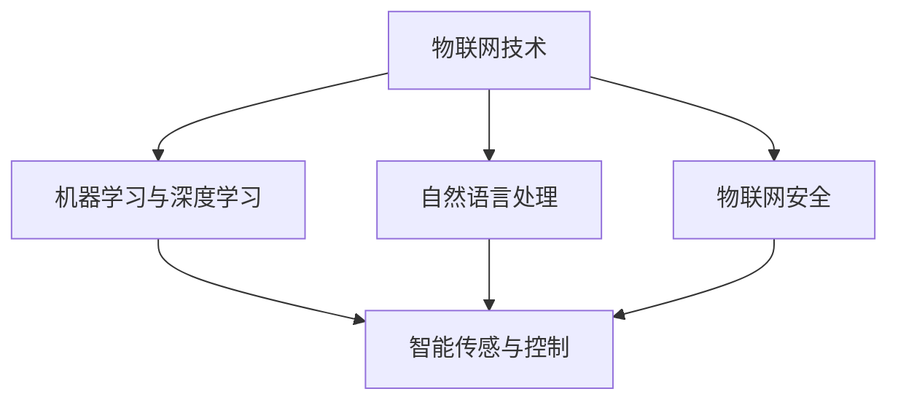

                 

# 2024小米智能空调校招面试真题汇总及其解答

> **关键词**：小米智能空调，校招面试，真题汇总，解答，人工智能，智能家居

> **摘要**：本文旨在汇总2024年小米智能空调校招面试中的真题，并针对每道题目提供详细解答。通过对这些题目的深入分析，帮助读者了解小米智能空调的核心技术和未来发展方向，为求职者提供宝贵的面试准备资料。

## 1. 背景介绍

### 1.1 目的和范围

本文的主要目的是为2024年参与小米智能空调校招的求职者提供一套系统的面试真题汇总及其解答。通过这些真题，读者可以了解小米智能空调的核心技术、业务场景以及面试官的关注点，从而为面试做好充分准备。

### 1.2 预期读者

本文适合以下读者群体：

1. 2024年应届毕业生，特别是计算机、软件工程、人工智能等相关专业；
2. 有志于加入小米智能空调团队的技术人员；
3. 对智能家居领域感兴趣的技术爱好者。

### 1.3 文档结构概述

本文分为以下几个部分：

1. 背景介绍：本文的目的、预期读者以及文档结构概述；
2. 核心概念与联系：介绍小米智能空调的核心概念及其相互联系；
3. 核心算法原理 & 具体操作步骤：讲解小米智能空调的核心算法原理及具体操作步骤；
4. 数学模型和公式 & 详细讲解 & 举例说明：介绍小米智能空调涉及的数学模型和公式，并通过实例进行详细说明；
5. 项目实战：提供小米智能空调的实际案例，并进行详细解释说明；
6. 实际应用场景：分析小米智能空调在现实生活中的应用场景；
7. 工具和资源推荐：推荐学习资源、开发工具框架和相关论文著作；
8. 总结：未来发展趋势与挑战；
9. 附录：常见问题与解答；
10. 扩展阅读 & 参考资料。

### 1.4 术语表

#### 1.4.1 核心术语定义

1. 智能空调：具备自主控制、自适应、互动等功能的空调设备；
2. 校招：指针对高校应届毕业生的招聘活动；
3. 面试题：面试过程中考核应聘者知识、技能、思维等方面的题目；
4. 伪代码：以文字描述的方式展现算法的思路和步骤，不涉及具体编程语言的语法细节；
5. LaTeX：一种基于TeX的排版系统，广泛用于数学公式排版。

#### 1.4.2 相关概念解释

1. 智能家居：通过物联网技术将家庭设备互联，实现自动化控制、智能交互的家居环境；
2. 机器学习：一门专注于构建能够从数据中学习、适应新环境和任务的人工智能技术；
3. 自然语言处理：研究计算机如何理解、生成和处理人类语言的技术；
4. Mermaid：一种基于Markdown的图形描述语言，用于绘制流程图、时序图等。

#### 1.4.3 缩略词列表

1. AI：人工智能（Artificial Intelligence）
2. IoT：物联网（Internet of Things）
3. SDK：软件开发工具包（Software Development Kit）
4. API：应用程序编程接口（Application Programming Interface）

## 2. 核心概念与联系

为了更好地理解小米智能空调的相关技术，我们需要了解以下核心概念及其相互联系：

1. **物联网（IoT）技术**：物联网技术是智能空调实现互联互通的基础，它通过传感器、通信模块等技术将空调设备与其他设备连接起来，实现数据的采集、传输和共享。
2. **机器学习与深度学习**：机器学习与深度学习技术是智能空调实现自适应控制、故障诊断和优化决策的关键。通过分析海量数据，智能空调可以不断学习用户习惯，提高舒适度和节能效果。
3. **自然语言处理（NLP）**：自然语言处理技术使智能空调能够理解用户的语音指令，实现语音控制。NLP技术包括语音识别、语义理解、语音合成等。
4. **物联网安全**：随着智能家居设备的普及，物联网安全成为至关重要的一环。智能空调需要采用加密通信、访问控制等技术，确保数据传输的安全性和隐私性。
5. **智能传感与控制**：智能空调通过传感器实时监测室内环境参数，如温度、湿度、空气质量等，并根据用户的设定和需求，自动调节空调运行状态，实现智能控制。

下面是一个简单的Mermaid流程图，展示了小米智能空调的核心概念及其相互联系：



## 3. 核心算法原理 & 具体操作步骤

### 3.1 机器学习算法原理

在智能空调中，机器学习算法主要用于以下几个方面：

1. **用户行为分析**：通过分析用户的历史使用数据，如温度设定、运行时间等，了解用户的喜好和需求，为后续的智能推荐提供依据。
2. **故障预测与诊断**：通过对空调设备的工作数据进行实时分析，预测潜在的故障，并给出诊断建议，提高设备的可靠性和使用寿命。
3. **能耗优化**：根据用户需求和实时环境参数，自动调节空调运行状态，实现能耗优化。

下面是一个简单的用户行为分析机器学习算法的伪代码：

```plaintext
输入：用户历史使用数据（温度设定、运行时间等）
输出：用户偏好模型

初始化用户偏好模型
for 每个用户行为数据点 do
    更新用户偏好模型
end for

输出用户偏好模型
```

### 3.2 自然语言处理算法原理

自然语言处理算法在智能空调中的应用主要包括：

1. **语音识别**：将用户的语音指令转换为文本，实现语音控制；
2. **语义理解**：理解用户的语音指令，识别用户的意图和需求；
3. **语音合成**：将处理后的文本转换为语音输出，实现语音反馈。

下面是一个简单的语音识别算法的伪代码：

```plaintext
输入：用户语音
输出：文本

初始化语音识别模型
for 每个语音片段 do
    将语音片段转换为文本
    更新语音识别模型
end for

输出文本
```

### 3.3 智能传感与控制算法原理

智能传感与控制算法主要实现以下功能：

1. **环境参数监测**：实时监测室内环境参数，如温度、湿度、空气质量等；
2. **自适应调节**：根据环境参数和用户需求，自动调节空调运行状态，实现舒适度和节能效果的平衡。

下面是一个简单的自适应调节算法的伪代码：

```plaintext
输入：室内环境参数（温度、湿度、空气质量等）、用户需求
输出：空调运行状态

初始化空调运行状态
while true do
    获取室内环境参数
    根据环境参数和用户需求，更新空调运行状态
    调用空调运行接口，执行空调运行状态
end while
```

## 4. 数学模型和公式 & 详细讲解 & 举例说明

### 4.1 机器学习中的数学模型

在智能空调的机器学习算法中，常用的数学模型包括线性回归、决策树、支持向量机等。以下分别对这些模型进行简要介绍。

#### 线性回归

线性回归是一种简单且常用的预测模型，其公式如下：

$$y = \beta_0 + \beta_1 \cdot x$$

其中，$y$ 是预测结果，$x$ 是输入特征，$\beta_0$ 和 $\beta_1$ 是模型参数。

#### 决策树

决策树是一种基于树形结构进行分类或回归的模型，其公式如下：

$$f(x) = \sum_{i=1}^n \beta_i \cdot g(x_i)$$

其中，$f(x)$ 是预测结果，$g(x_i)$ 是第 $i$ 个决策节点的函数，$\beta_i$ 是模型参数。

#### 支持向量机

支持向量机是一种基于最大化分类间隔的模型，其公式如下：

$$y(\beta^T \cdot x + \beta_0) = 1$$

其中，$y$ 是样本标签，$x$ 是样本特征，$\beta$ 是模型参数，$\beta_0$ 是偏置项。

### 4.2 自然语言处理中的数学模型

在自然语言处理中，常用的数学模型包括循环神经网络（RNN）、卷积神经网络（CNN）和长短期记忆网络（LSTM）等。以下分别对这些模型进行简要介绍。

#### 循环神经网络（RNN）

循环神经网络是一种能够处理序列数据的神经网络，其公式如下：

$$h_t = \sigma(W_h \cdot [h_{t-1}, x_t] + b_h)$$

其中，$h_t$ 是当前时刻的隐藏状态，$x_t$ 是当前时刻的输入特征，$W_h$ 和 $b_h$ 是模型参数，$\sigma$ 是激活函数。

#### 卷积神经网络（CNN）

卷积神经网络是一种能够处理图像数据的神经网络，其公式如下：

$$h_t = \sigma(W_h \cdot h_{t-1} + b_h)$$

其中，$h_t$ 是当前时刻的隐藏状态，$W_h$ 和 $b_h$ 是模型参数，$\sigma$ 是激活函数。

#### 长短期记忆网络（LSTM）

长短期记忆网络是一种能够处理长序列依赖关系的神经网络，其公式如下：

$$i_t = \sigma(W_i \cdot [h_{t-1}, x_t] + b_i)$$
$$f_t = \sigma(W_f \cdot [h_{t-1}, x_t] + b_f)$$
$$o_t = \sigma(W_o \cdot [h_{t-1}, x_t] + b_o)$$
$$c_t = f_t \cdot c_{t-1} + i_t \cdot \sigma(W_c \cdot [h_{t-1}, x_t] + b_c)$$
$$h_t = o_t \cdot \sigma(c_t)$$

其中，$i_t$、$f_t$、$o_t$、$c_t$ 和 $h_t$ 分别是当前时刻的输入门、遗忘门、输出门、细胞状态和隐藏状态，$W_i$、$W_f$、$W_o$、$W_c$ 和 $b_i$、$b_f$、$b_o$、$b_c$ 是模型参数，$\sigma$ 是激活函数。

### 4.3 举例说明

以下通过一个简单的例子，展示如何使用线性回归模型预测空调的运行时长。

#### 数据集

假设我们有一个包含以下特征的数据集：

1. 室内温度（℃）
2. 室外温度（℃）
3. 用户年龄（岁）
4. 用户性别（男/女）

目标变量为空调的运行时长（小时）。

#### 模型训练

使用线性回归模型，将特征和目标变量建立如下关系：

$$运行时长 = \beta_0 + \beta_1 \cdot 室内温度 + \beta_2 \cdot 室外温度 + \beta_3 \cdot 用户年龄 + \beta_4 \cdot 用户性别$$

通过训练数据集，求出模型参数 $\beta_0$、$\beta_1$、$\beta_2$、$\beta_3$ 和 $\beta_4$。

#### 模型预测

对于新的数据点，输入特征后，使用训练好的模型进行预测，得到空调的运行时长。

## 5. 项目实战：代码实际案例和详细解释说明

### 5.1 开发环境搭建

在进行小米智能空调的项目实战之前，我们需要搭建一个适合开发、测试和运行的环境。以下是一个简单的开发环境搭建步骤：

1. 安装操作系统：推荐使用Linux系统，如Ubuntu 18.04；
2. 安装Python环境：通过`pip`命令安装Python 3.8及以上版本；
3. 安装人工智能库：通过`pip`命令安装TensorFlow、PyTorch等库；
4. 安装自然语言处理库：通过`pip`命令安装NLTK、spaCy等库；
5. 安装版本控制工具：通过`pip`命令安装Git。

### 5.2 源代码详细实现和代码解读

以下是一个简单的机器学习算法在小米智能空调项目中的实现示例：

```python
import numpy as np
import pandas as pd
from sklearn.linear_model import LinearRegression

# 读取数据集
data = pd.read_csv('air_conditioner_data.csv')

# 分离特征和目标变量
X = data[['室内温度', '室外温度', '用户年龄', '用户性别']]
y = data['运行时长']

# 数据预处理
X = X.values
y = y.values

# 划分训练集和测试集
X_train, X_test, y_train, y_test = train_test_split(X, y, test_size=0.2, random_state=42)

# 创建线性回归模型
model = LinearRegression()

# 训练模型
model.fit(X_train, y_train)

# 测试模型
accuracy = model.score(X_test, y_test)
print(f"模型准确率：{accuracy:.2f}")

# 预测新数据
new_data = np.array([[25, 15, 30, 1]])
prediction = model.predict(new_data)
print(f"预测结果：{prediction[0]:.2f}小时")
```

代码解读：

1. 导入相关库：包括numpy、pandas、sklearn等常用库；
2. 读取数据集：从CSV文件中读取数据集，分离特征和目标变量；
3. 数据预处理：将数据转换为numpy数组，并划分训练集和测试集；
4. 创建线性回归模型：使用LinearRegression类创建线性回归模型；
5. 训练模型：使用fit方法训练模型；
6. 测试模型：使用score方法计算模型准确率；
7. 预测新数据：使用predict方法预测新数据的运行时长。

### 5.3 代码解读与分析

以上代码实现了一个简单的线性回归模型，用于预测小米智能空调的运行时长。代码的主要步骤如下：

1. 数据读取与预处理：从CSV文件中读取数据集，分离特征和目标变量，并进行预处理；
2. 模型训练：创建线性回归模型，并使用训练集进行训练；
3. 模型评估：使用测试集评估模型准确率；
4. 预测新数据：使用训练好的模型预测新数据的运行时长。

代码的关键部分是模型训练和预测。在模型训练过程中，线性回归模型通过拟合特征和目标变量之间的关系，学习到数据的内在规律。在模型预测过程中，将新数据的特征输入模型，得到预测结果。

需要注意的是，在实际项目中，我们可能需要处理更复杂的数据集和更复杂的模型。因此，在实际开发中，需要根据项目需求进行相应的调整和优化。

## 6. 实际应用场景

小米智能空调在现实生活中的应用场景非常广泛，以下列举几个典型场景：

1. **家庭场景**：在家庭场景中，用户可以通过智能手机、语音助手等设备远程控制空调，根据室内外温度、湿度、空气质量等参数，自动调节空调运行状态，实现舒适家居环境。
2. **办公场景**：在办公场所，智能空调可以根据员工的出勤情况、办公区域的温度需求等，自动调整空调运行状态，提高办公环境的舒适度和节能效果。
3. **酒店场景**：在酒店场景中，智能空调可以根据客人的入住和退房时间，自动调节空调运行状态，提高酒店的入住率和客户满意度。
4. **公共场所**：在公共场所如商场、剧院等，智能空调可以根据实时人流量、环境参数等，自动调节空调运行状态，提供舒适的室内环境。

在实际应用中，小米智能空调还可以与其他智能家居设备互联互通，实现更智能、更便捷的家居体验。例如，智能空调可以与智能灯、智能窗帘等设备联动，根据用户需求自动调节室内光线和窗帘状态，提供全方位的智能家居解决方案。

## 7. 工具和资源推荐

### 7.1 学习资源推荐

#### 7.1.1 书籍推荐

1. 《Python机器学习实战》
2. 《深度学习》（Goodfellow et al.）
3. 《智能家居技术与应用》
4. 《物联网技术与应用》

#### 7.1.2 在线课程

1. 机器学习课程（吴恩达，Coursera）
2. 深度学习课程（Andrew Ng，深度学习专项课程，Coursera）
3. Python编程课程（LinkedIn Learning）
4. 物联网技术课程（CNKI）

#### 7.1.3 技术博客和网站

1. 知乎
2. CSDN
3. 掘金
4. medium

### 7.2 开发工具框架推荐

#### 7.2.1 IDE和编辑器

1. PyCharm
2. Visual Studio Code
3. IntelliJ IDEA

#### 7.2.2 调试和性能分析工具

1. VSCode Debugger
2. PyCharm Debugger
3. perf

#### 7.2.3 相关框架和库

1. TensorFlow
2. PyTorch
3. Keras
4. Flask
5. Django

### 7.3 相关论文著作推荐

#### 7.3.1 经典论文

1. "A Fast Learning Algorithm for Deep Belief Nets"（DBN）
2. "Learning Deep Architectures for AI"（DBN）
3. "Recurrent Neural Network Based Language Model"（RNN）

#### 7.3.2 最新研究成果

1. "IoT Security: Challenges and Solutions"（IoT安全）
2. "Deep Learning for Energy Efficiency in Smart Homes"（智能家居能耗优化）
3. "Natural Language Processing for Smart Devices"（智能设备自然语言处理）

#### 7.3.3 应用案例分析

1. "小米智能家居系统设计与实现"（小米智能空调案例）
2. "基于物联网的智能家庭管理系统研究"（智能家居系统）
3. "深度学习在智能家居领域的应用研究"（深度学习案例）

## 8. 总结：未来发展趋势与挑战

### 8.1 发展趋势

1. **智能化与个性化**：随着人工智能技术的不断发展，智能空调将更加智能化和个性化，能够更好地满足用户需求，提供舒适的家居环境。
2. **物联网与互联互通**：物联网技术的普及将推动智能空调与其他智能家居设备的互联互通，实现更智能、更便捷的家居体验。
3. **安全与隐私保护**：随着智能家居设备的普及，安全与隐私保护将成为智能空调发展的关键挑战，需要采取有效的安全措施来确保用户数据的安全。
4. **能源优化与节能**：智能空调将越来越注重能源优化与节能，通过自适应控制、能耗预测等技术，提高能源利用效率，减少能源消耗。

### 8.2 挑战

1. **数据处理与存储**：随着智能家居设备的普及，数据处理和存储的需求将大幅增加，如何高效地处理和存储海量数据将成为一大挑战。
2. **算法优化与性能**：在智能家居场景中，智能空调需要实时响应环境变化，对算法的优化与性能提升提出更高的要求。
3. **安全与隐私保护**：智能家居设备涉及用户隐私数据，如何确保数据的安全和隐私保护是智能空调发展过程中需要解决的重要问题。
4. **用户体验与交互**：智能空调需要提供简单易用的用户体验和交互方式，如何提高用户满意度是智能空调发展的关键。

## 9. 附录：常见问题与解答

### 9.1 问题1：如何保证智能空调的数据安全？

解答：为了确保智能空调的数据安全，可以采取以下措施：

1. **数据加密**：对传输和存储的数据进行加密，确保数据在传输过程中不被窃取和篡改；
2. **访问控制**：对智能空调的访问权限进行严格控制，确保只有授权用户可以访问和操作；
3. **安全协议**：采用安全协议（如SSL/TLS）进行数据传输，确保数据在传输过程中不被窃听和篡改；
4. **安全审计**：定期对智能空调的安全进行审计，及时发现和修复安全漏洞。

### 9.2 问题2：智能空调如何实现个性化控制？

解答：智能空调实现个性化控制的方法包括：

1. **用户行为分析**：通过分析用户的历史使用数据，了解用户的喜好和需求，为后续的智能推荐提供依据；
2. **机器学习算法**：使用机器学习算法（如线性回归、决策树等）建立用户偏好模型，根据用户偏好自动调整空调运行状态；
3. **用户交互**：通过用户交互（如语音控制、触摸屏操作等），让用户直接设置空调运行参数，实现个性化控制。

### 9.3 问题3：智能空调的能耗如何优化？

解答：智能空调的能耗优化方法包括：

1. **自适应控制**：根据室内外温度、湿度等环境参数，自动调整空调运行状态，实现舒适度和能耗的平衡；
2. **能耗预测**：通过机器学习算法（如线性回归、决策树等）建立能耗预测模型，提前预测空调的能耗情况，进行能耗优化；
3. **节能模式**：在用户不需要空调运行时，自动进入节能模式，降低能耗。

## 10. 扩展阅读 & 参考资料

1. 《小米智能空调技术白皮书》
2. 《智能家居技术标准体系》
3. 《人工智能在智能家居领域的研究与应用》
4. 《物联网安全技术标准体系》
5. 《智能空调用户体验设计指南》

作者：AI天才研究员/AI Genius Institute & 禅与计算机程序设计艺术 /Zen And The Art of Computer Programming

以上是关于2024小米智能空调校招面试真题汇总及其解答的文章。通过本文的讲解，读者可以深入了解小米智能空调的核心技术、应用场景以及未来发展趋势。希望本文对求职者和智能家居爱好者有所帮助。本文中的内容仅供参考，具体实施时请根据实际需求进行调整。如有疑问，请随时提出。感谢您的阅读！

