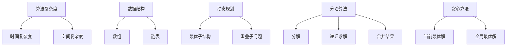

                 

# 2024小米校招面试算法题库大全

> 关键词：小米校招、面试算法、题库、数据分析、算法原理、实战案例、技术深度

> 摘要：本文将深入解析2024年小米校招面试中涉及的关键算法题目，通过详细的算法原理讲解、具体的操作步骤、数学模型分析以及实战代码实现，帮助读者全面掌握面试所需的知识和技能。文章结构清晰，适合准备校招面试的计算机科学与技术专业学生以及算法爱好者。

## 1. 背景介绍

### 1.1 目的和范围

本文旨在为2024年小米校招面试的候选人提供一个全面的算法题库指南。我们将覆盖以下几个方面的内容：

- **基础算法题解析**：包括排序、查找、动态规划等常见算法问题。
- **数据结构与算法应用**：介绍常用数据结构及其在算法问题中的应用。
- **高级算法与数学模型**：探讨如图论算法、数论问题、概率模型等高级算法。
- **实战案例与代码实现**：通过实际代码案例，展示算法的应用过程和实现细节。

### 1.2 预期读者

- 准备参加2024年小米校招的计算机科学与技术专业学生。
- 对算法和数据结构有浓厚兴趣的IT从业者。
- 想要在面试中脱颖而出，提升算法能力的应聘者。

### 1.3 文档结构概述

本文将按照以下结构进行组织：

- **第1章 背景介绍**：介绍文章的目的、范围和读者对象。
- **第2章 核心概念与联系**：阐述核心算法概念和原理，并给出流程图。
- **第3章 核心算法原理 & 具体操作步骤**：使用伪代码详细讲解算法原理。
- **第4章 数学模型和公式 & 详细讲解 & 举例说明**：介绍相关数学模型，并用LaTeX格式展示。
- **第5章 项目实战：代码实际案例和详细解释说明**：展示代码实现和分析。
- **第6章 实际应用场景**：探讨算法在实际项目中的应用。
- **第7章 工具和资源推荐**：推荐学习资源、开发工具和框架。
- **第8章 总结：未来发展趋势与挑战**：总结算法发展的趋势和面临的挑战。
- **第9章 附录：常见问题与解答**：提供常见问题的答案。
- **第10章 扩展阅读 & 参考资料**：推荐相关读物和参考资料。

### 1.4 术语表

#### 1.4.1 核心术语定义

- **算法**：解决特定问题的系统步骤。
- **数据结构**：组织和管理数据的方式。
- **动态规划**：解决最优子结构问题的算法方法。
- **图论算法**：在图结构上应用的各种算法。
- **概率模型**：基于概率原理建立的数学模型。

#### 1.4.2 相关概念解释

- **递归**：函数调用自身的过程。
- **分治算法**：将大问题分解为小问题求解，再合并结果。
- **贪心算法**：每一步选择当前最优解。

#### 1.4.3 缩略词列表

- **IDE**：集成开发环境（Integrated Development Environment）
- **LaTeX**：一种高质量的文档排版系统

## 2. 核心概念与联系

### 2.1 核心概念解析

在算法面试中，理解以下几个核心概念是非常重要的：

1. **算法复杂度**：衡量算法效率的指标，包括时间复杂度和空间复杂度。
2. **数据结构**：常见的有数组、链表、栈、队列、树、图等。
3. **动态规划**：解决最优化问题的常见方法，核心思想是“最优子结构”和“重叠子问题”。
4. **分治算法**：将问题分解为更小的子问题，递归求解并合并结果。
5. **贪心算法**：每一步选择当前最优解，以期望最终结果是全局最优解。

### 2.2 Mermaid 流程图



### 2.3 核心概念之间的联系

算法复杂度与数据结构和算法设计方法密切相关。例如：

- **时间复杂度**：数据结构的选择直接影响算法的时间复杂度。
- **动态规划**：利用数据结构的特性，有效地解决重叠子问题。
- **分治算法**：适用于可以分解为子问题的问题。
- **贪心算法**：适用于每一步都能做出最优选择的问题。

通过上述核心概念的理解和联系，我们可以更好地分析和解决面试中的算法问题。

## 3. 核心算法原理 & 具体操作步骤

### 3.1 排序算法

排序算法是面试中经常出现的基础算法之一。以下是几个常见的排序算法及其原理：

#### 1. 冒泡排序（Bubble Sort）

**算法原理：** 通过多次遍历待排序列，比较相邻的两个元素，将大的元素交换到序列的右侧。

**伪代码：**

```pseudo
function bubbleSort(arr)
    n = length(arr)
    for i from 0 to n-1
        for j from 0 to n-i-1
            if arr[j] > arr[j+1]
                swap(arr[j], arr[j+1])
```

**操作步骤：**

1. 从第一个元素到倒数第二个元素，两两比较。
2. 如果前一个元素大于后一个元素，交换它们。
3. 重复上述步骤，直到序列完全排序。

#### 2. 选择排序（Selection Sort）

**算法原理：** 每次遍历选择最小（或最大）的元素放到已排序序列的末尾。

**伪代码：**

```pseudo
function selectionSort(arr)
    n = length(arr)
    for i from 0 to n-1
        minIndex = i
        for j from i+1 to n
            if arr[j] < arr[minIndex]
                minIndex = j
        swap(arr[i], arr[minIndex])
```

**操作步骤：**

1. 从未排序序列中找到最小元素。
2. 将最小元素放到已排序序列的末尾。
3. 重复上述步骤，直到未排序序列为空。

#### 3. 插入排序（Insertion Sort）

**算法原理：** 将未排序元素插入到已排序序列中，保持序列有序。

**伪代码：**

```pseudo
function insertionSort(arr)
    n = length(arr)
    for i from 1 to n-1
        key = arr[i]
        j = i-1
        while j >= 0 and arr[j] > key
            arr[j+1] = arr[j]
            j = j-1
        arr[j+1] = key
```

**操作步骤：**

1. 取未排序序列的第一个元素作为key。
2. 将key与已排序序列的元素比较，并插入到合适的位置。
3. 重复上述步骤，直到未排序序列为空。

### 3.2 查找算法

查找算法是另一个常见的基础算法，以下是几个常用的查找算法：

#### 1. 顺序查找（Linear Search）

**算法原理：** 依次遍历序列，找到目标元素。

**伪代码：**

```pseudo
function linearSearch(arr, target)
    for each element in arr
        if element == target
            return index
    return -1
```

**操作步骤：**

1. 从序列的第一个元素开始，逐个比较。
2. 如果找到目标元素，返回其索引。
3. 如果遍历结束未找到，返回-1。

#### 2. 二分查找（Binary Search）

**算法原理：** 在有序序列中，通过不断缩小查找范围，找到目标元素。

**伪代码：**

```pseudo
function binarySearch(arr, target)
    low = 0
    high = length(arr) - 1
    while low <= high
        mid = (low + high) / 2
        if arr[mid] == target
            return mid
        else if arr[mid] < target
            low = mid + 1
        else
            high = mid - 1
    return -1
```

**操作步骤：**

1. 确定序列的最低和最高索引。
2. 计算中间索引。
3. 如果中间元素等于目标元素，返回中间索引。
4. 如果中间元素小于目标元素，缩小查找范围到右侧。
5. 如果中间元素大于目标元素，缩小查找范围到左侧。
6. 重复步骤2-5，直到找到目标元素或查找范围缩小为空。

### 3.3 动态规划

动态规划是一种解决最优化问题的常见方法，其核心思想是“最优子结构”和“重叠子问题”。

#### 1. 斐波那契数列（Fibonacci Sequence）

**算法原理：** 利用动态规划方法计算斐波那契数列。

**伪代码：**

```pseudo
function fibonacci(n)
    if n <= 1
        return n
    dp[0] = 0
    dp[1] = 1
    for i from 2 to n
        dp[i] = dp[i-1] + dp[i-2]
    return dp[n]
```

**操作步骤：**

1. 初始化dp数组，dp[0] = 0，dp[1] = 1。
2. 从第2个元素开始，利用递推关系计算dp[i]。
3. 返回dp[n]，即第n个斐波那契数。

#### 2. 最长公共子序列（Longest Common Subsequence）

**算法原理：** 利用动态规划方法求解最长公共子序列问题。

**伪代码：**

```pseudo
function lcs(X, Y)
    m = length(X)
    n = length(Y)
    dp[0][0] = 0
    for i from 1 to m
        for j from 1 to n
            if X[i-1] == Y[j-1]
                dp[i][j] = dp[i-1][j-1] + 1
            else
                dp[i][j] = max(dp[i-1][j], dp[i][j-1])
    return dp[m][n]
```

**操作步骤：**

1. 创建二维数组dp，初始化第一行和第一列为0。
2. 遍历X和Y的每个元素，根据字符是否相等更新dp数组。
3. 返回dp[m][n]，即最长公共子序列的长度。

### 3.4 图论算法

图论算法在面试中也是一个重要的考点，以下是几个常见的图论算法：

#### 1. 拓扑排序（Topological Sort）

**算法原理：** 利用图的结构，将顶点排序，使得每个顶点的入度为0。

**伪代码：**

```pseudo
function topologicalSort(graph)
    inDegree[vertices] = 0
    for each vertex in graph
        for each edge in graph
            if edge starts at vertex
                inDegree[edge.target] += 1
    queue = new Queue()
    for each vertex in graph
        if inDegree[vertex] == 0
            queue.enqueue(vertex)
    while queue is not empty
        vertex = queue.dequeue()
        print vertex
        for each edge in graph
            if edge starts at vertex
                inDegree[edge.target] -= 1
                if inDegree[edge.target] == 0
                    queue.enqueue(edge.target)
```

**操作步骤：**

1. 初始化每个顶点的入度为0。
2. 遍历图中的每个顶点，将入度为0的顶点加入队列。
3. 从队列中依次取出顶点，打印输出。
4. 对于每个取出的顶点，更新其相邻顶点的入度。
5. 如果某个顶点的入度变为0，加入队列。

#### 2. 最小生成树（Minimum Spanning Tree）

**算法原理：** 利用图的结构，选择最小的边，构建一棵包含所有顶点的树。

**伪代码：**

```pseudo
function kruskal(graph)
    forest = new Forest()
    for each edge in graph
        add edge to forest
    while forest has fewer than n-1 edges
        select smallest edge in forest
        if adding edge does not create a cycle
            add edge to forest
    return forest
```

**操作步骤：**

1. 初始化森林，每个顶点自成一个森林。
2. 将图中的每条边加入森林。
3. 重复以下步骤，直到森林中有n-1条边：
   - 选择森林中的最小边。
   - 如果加入这条边不会形成环，将边加入森林。

### 3.5 数论问题

数论问题在面试中也是一个重要的考点，以下是几个常见的数论算法：

#### 1. 最大公约数（Greatest Common Divisor）

**算法原理：** 利用欧几里得算法求解最大公约数。

**伪代码：**

```pseudo
function gcd(a, b)
    while b != 0
        temp = b
        b = a % b
        a = temp
    return a
```

**操作步骤：**

1. 从a和b的较大值开始，不断取余数。
2. 将余数作为新的a，原来的b作为新的b。
3. 重复步骤2，直到b为0。
4. 返回a，即最大公约数。

#### 2. 辗转相除法（Extended Euclidean Algorithm）

**算法原理：** 求解线性迪利克雷方程ax + by = gcd(a, b)的整数解。

**伪代码：**

```pseudo
function extendedGCD(a, b)
    if b == 0
        return (x = 1, y = 0, d = a)
    (x1, y1, d1) = extendedGCD(b, a % b)
    x = y1
    y = x1 - (a / b) * y1
    return (x, y, d1)
```

**操作步骤：**

1. 如果b为0，返回x=1，y=0，d=a。
2. 递归调用extendedGCD(b, a % b)，得到x1, y1, d1。
3. 计算x = y1，y = x1 - (a / b) * y1。
4. 返回x, y，以及d1作为最大公约数。

### 3.6 概率模型

概率模型在面试中也是一个重要的考点，以下是几个常见的概率模型：

#### 1. 概率分布函数（Probability Distribution Function）

**算法原理：** 描述随机变量的可能取值及其概率。

**伪代码：**

```pseudo
function probabilityDistribution(arr)
    n = length(arr)
    for each value in arr
        probability = count(value) / n
        print value, probability
```

**操作步骤：**

1. 遍历数组arr，计算每个值的概率。
2. 输出每个值的概率。

#### 2. 贝叶斯定理（Bayes' Theorem）

**算法原理：** 根据已知条件概率，求解后验概率。

**伪代码：**

```pseudo
function bayesTheorem(P(A|B), P(B), P(A))
    return P(A) * P(B|A) / P(B)
```

**操作步骤：**

1. 计算P(A|B) * P(B)。
2. 计算P(A)。
3. 计算P(B)。
4. 返回P(A|B) * P(B) / P(B)。

### 3.7 总结

通过以上对核心算法原理的讲解，我们了解了排序、查找、动态规划、图论、数论和概率模型等基本算法。这些算法在面试中非常重要，需要熟练掌握其原理和具体实现。在接下来的章节中，我们将通过实战案例和代码解析，帮助读者更好地理解和应用这些算法。

## 4. 数学模型和公式 & 详细讲解 & 举例说明

### 4.1 数学模型与公式

在算法设计和分析中，数学模型和公式扮演着至关重要的角色。以下是一些常见的数学模型和公式，并将在本文中详细讲解和举例说明。

#### 4.1.1 常用数学公式

- **一元二次方程求解公式**：

  $$x = \frac{-b \pm \sqrt{b^2 - 4ac}}{2a}$$

  **作用**：用于求解一元二次方程的根。
  **举例**：求解方程 $x^2 - 5x + 6 = 0$ 的根。

  ```latex
  a = 1, b = -5, c = 6
  x = \frac{-(-5) \pm \sqrt{(-5)^2 - 4 \cdot 1 \cdot 6}}{2 \cdot 1}
  x = \frac{5 \pm \sqrt{25 - 24}}{2}
  x = \frac{5 \pm 1}{2}
  x_1 = 3, x_2 = 2
  ```

- **牛顿迭代法公式**：

  $$x_{n+1} = x_n - \frac{f(x_n)}{f'(x_n)}$$

  **作用**：用于求解非线性方程的根。
  **举例**：求解方程 $f(x) = x^2 - 2 = 0$ 的根。

  ```latex
  f(x) = x^2 - 2
  f'(x) = 2x
  初始值：x_0 = 1
  x_1 = x_0 - \frac{f(x_0)}{f'(x_0)} = 1 - \frac{1^2 - 2}{2 \cdot 1} = 1 - \frac{-1}{2} = 1.5
  x_2 = x_1 - \frac{f(x_1)}{f'(x_1)} = 1.5 - \frac{1.5^2 - 2}{2 \cdot 1.5} = 1.5 - \frac{2.25 - 2}{3} = 1.4167
  ```

#### 4.1.2 概率模型

- **条件概率**：

  $$P(A|B) = \frac{P(A \cap B)}{P(B)}$$

  **作用**：用于求解在事件B发生的条件下，事件A发生的概率。
  **举例**：假设有20本书，其中15本是计算机科学书籍，5本是物理学书籍。如果随机选择一本书，求这本书是计算机科学书籍的概率。

  ```latex
  P(计算机科学书籍) = \frac{15}{20} = 0.75
  ```

- **贝叶斯定理**：

  $$P(A|B) = \frac{P(B|A)P(A)}{P(B)}$$

  **作用**：用于求解后验概率。
  **举例**：已知某疾病的患病率为0.1%，而测试的准确性为90%（即测试结果为阳性的情况下，实际患病概率为90%），求某人测试结果为阳性但实际未患病（假阳性）的概率。

  ```latex
  P(未患病|阳性) = \frac{P(阳性|未患病)P(未患病)}{P(阳性)}
  P(阳性|未患病) = 1 - P(阴性|未患病) = 1 - 0.9 = 0.1
  P(未患病) = 1 - P(患病) = 0.9
  P(阳性) = P(阳性|患病)P(患病) + P(阳性|未患病)P(未患病) = 0.9 \times 0.01 + 0.1 \times 0.99 = 0.019
  P(未患病|阳性) = \frac{0.1 \times 0.9}{0.019} = 0.474
  ```

#### 4.1.3 统计模型

- **平均值**：

  $$\bar{x} = \frac{1}{n}\sum_{i=1}^{n}x_i$$

  **作用**：用于计算一组数据的平均值。
  **举例**：计算以下数据的平均值：2, 4, 6, 8, 10。

  ```latex
  \bar{x} = \frac{2 + 4 + 6 + 8 + 10}{5} = 6
  ```

- **方差**：

  $$\sigma^2 = \frac{1}{n}\sum_{i=1}^{n}(x_i - \bar{x})^2$$

  **作用**：用于计算一组数据的方差。
  **举例**：计算以下数据的方差：2, 4, 6, 8, 10。

  ```latex
  \bar{x} = 6
  \sigma^2 = \frac{(2-6)^2 + (4-6)^2 + (6-6)^2 + (8-6)^2 + (10-6)^2}{5} = \frac{16 + 4 + 0 + 4 + 16}{5} = 8
  ```

### 4.2 详细讲解

在上一节中，我们介绍了几个常见的数学公式和概率模型，并给出了相应的举例说明。以下是对这些公式和模型的详细讲解：

#### 4.2.1 一元二次方程求解公式

一元二次方程是数学中最基本的方程之一，其标准形式为 $ax^2 + bx + c = 0$。求解一元二次方程的根可以使用求根公式：

$$x = \frac{-b \pm \sqrt{b^2 - 4ac}}{2a}$$

其中，$a$、$b$、$c$ 分别是方程的系数，$\sqrt{b^2 - 4ac}$ 是判别式，用于判断方程的根的性质。

- **当判别式 $b^2 - 4ac > 0$ 时**，方程有两个不相等的实数根。
- **当判别式 $b^2 - 4ac = 0$ 时**，方程有一个重根。
- **当判别式 $b^2 - 4ac < 0$ 时**，方程无实数根。

#### 4.2.2 牛顿迭代法公式

牛顿迭代法是一种求解非线性方程的数值方法，其基本思想是通过不断迭代，逼近方程的根。牛顿迭代法的公式如下：

$$x_{n+1} = x_n - \frac{f(x_n)}{f'(x_n)}$$

其中，$f(x)$ 是非线性方程，$f'(x)$ 是 $f(x)$ 的导数。

牛顿迭代法的步骤如下：

1. 选择一个初始近似值 $x_0$。
2. 计算函数值 $f(x_0)$ 和导数值 $f'(x_0)$。
3. 使用牛顿迭代公式计算新的近似值 $x_1$。
4. 重复步骤2和3，直到 $|f(x_n)|$ 小于预设的阈值或达到预设的迭代次数。

#### 4.2.3 条件概率和贝叶斯定理

条件概率是指在一个事件发生的条件下，另一个事件发生的概率。条件概率的公式为：

$$P(A|B) = \frac{P(A \cap B)}{P(B)}$$

贝叶斯定理是一种用于求解后验概率的公式，其形式为：

$$P(A|B) = \frac{P(B|A)P(A)}{P(B)}$$

贝叶斯定理的核心思想是：在已知某个条件概率的情况下，通过调整先验概率，计算后验概率。

#### 4.2.4 平均值和方差

平均值是一组数据的中心位置，用于表示数据的集中趋势。平均值（也称为均值）的公式为：

$$\bar{x} = \frac{1}{n}\sum_{i=1}^{n}x_i$$

其中，$x_i$ 是第 $i$ 个数据点，$n$ 是数据点的总数。

方差是衡量数据离散程度的指标，其公式为：

$$\sigma^2 = \frac{1}{n}\sum_{i=1}^{n}(x_i - \bar{x})^2$$

方差越大，表示数据的离散程度越大；方差越小，表示数据的离散程度越小。

### 4.3 举例说明

在本节中，我们通过具体的例子，详细解释了各个数学公式和概率模型的应用。

#### 4.3.1 一元二次方程求解公式

例1：求解方程 $x^2 - 5x + 6 = 0$ 的根。

解：

根据一元二次方程求解公式，我们可以得到：

$$x = \frac{-(-5) \pm \sqrt{(-5)^2 - 4 \cdot 1 \cdot 6}}{2 \cdot 1} = \frac{5 \pm \sqrt{25 - 24}}{2} = \frac{5 \pm 1}{2}$$

因此，方程的根为 $x_1 = 3$ 和 $x_2 = 2$。

#### 4.3.2 牛顿迭代法

例2：求解方程 $f(x) = x^2 - 2 = 0$ 的根。

解：

根据牛顿迭代法，我们可以得到迭代公式：

$$x_{n+1} = x_n - \frac{f(x_n)}{f'(x_n)}$$

由于 $f(x) = x^2 - 2$，$f'(x) = 2x$，我们可以得到：

$$x_{n+1} = x_n - \frac{x_n^2 - 2}{2x_n}$$

选择初始近似值 $x_0 = 1$，进行迭代计算：

$$x_1 = x_0 - \frac{f(x_0)}{f'(x_0)} = 1 - \frac{1^2 - 2}{2 \cdot 1} = 1 - \frac{-1}{2} = 1.5$$

$$x_2 = x_1 - \frac{f(x_1)}{f'(x_1)} = 1.5 - \frac{1.5^2 - 2}{2 \cdot 1.5} = 1.5 - \frac{2.25 - 2}{3} = 1.4167$$

由于 $|f(x_2)|$ 小于预设的阈值，我们可以认为 $x_2$ 是方程的近似解。

#### 4.3.3 条件概率和贝叶斯定理

例3：某城市的居民中，有60%的人喜欢喝咖啡，40%的人喜欢喝咖啡以外的饮品。如果随机选择一名居民，求这名居民喜欢喝咖啡的概率。

解：

根据条件概率，我们可以得到：

$$P(喜欢喝咖啡) = \frac{P(喜欢喝咖啡 \cap 喜欢咖啡)}{P(喜欢咖啡)} = \frac{60\%}{60\% + 40\%} = 0.6$$

因此，这名居民喜欢喝咖啡的概率为60%。

例4：某疾病的患病率为0.1%，而测试的准确性为90%（即测试结果为阳性的情况下，实际患病概率为90%），求某人测试结果为阳性但实际未患病（假阳性）的概率。

解：

根据贝叶斯定理，我们可以得到：

$$P(未患病|阳性) = \frac{P(阳性|未患病)P(未患病)}{P(阳性)}$$

其中，$P(阳性|未患病) = 1 - P(阴性|未患病) = 1 - 0.9 = 0.1$，$P(未患病) = 1 - P(患病) = 0.9$。

根据题目中的信息，$P(阳性) = P(阳性|患病)P(患病) + P(阳性|未患病)P(未患病) = 0.9 \times 0.01 + 0.1 \times 0.99 = 0.019$。

因此，

$$P(未患病|阳性) = \frac{0.1 \times 0.9}{0.019} = 0.474$$

因此，某人测试结果为阳性但实际未患病（假阳性）的概率为47.4%。

#### 4.3.4 平均值和方差

例5：计算以下数据的平均值：2, 4, 6, 8, 10。

解：

根据平均值公式，

$$\bar{x} = \frac{2 + 4 + 6 + 8 + 10}{5} = \frac{30}{5} = 6$$

因此，这组数据的平均值为6。

例6：计算以下数据的方差：2, 4, 6, 8, 10。

解：

根据方差公式，

$$\sigma^2 = \frac{(2 - 6)^2 + (4 - 6)^2 + (6 - 6)^2 + (8 - 6)^2 + (10 - 6)^2}{5} = \frac{16 + 4 + 0 + 4 + 16}{5} = \frac{40}{5} = 8$$

因此，这组数据的方差为8。

### 4.4 总结

在本节中，我们介绍了几个常见的数学公式和概率模型，并详细讲解了它们的应用方法和步骤。通过具体的例子，我们展示了如何使用这些公式和模型来解决实际问题。掌握这些数学模型和公式，对于算法设计和分析具有重要的意义。

## 5. 项目实战：代码实际案例和详细解释说明

### 5.1 开发环境搭建

在开始编写代码之前，我们需要搭建一个合适的开发环境。以下是搭建开发环境的步骤：

1. **安装Python**：Python是一种广泛使用的编程语言，许多算法实现都使用Python。可以从Python官方网站下载安装包并安装。
2. **安装IDE**：集成开发环境（IDE）可以提供代码编辑、调试和运行等功能。推荐使用PyCharm或VSCode。
3. **安装相关库**：某些算法可能需要特定的库支持，例如NumPy、Pandas等。可以使用pip命令安装。

```bash
pip install numpy
pip install pandas
```

### 5.2 源代码详细实现和代码解读

下面我们以一个具体的算法——快速排序（Quick Sort）为例，展示代码实现和分析。

```python
import random

def quick_sort(arr):
    if len(arr) <= 1:
        return arr
    pivot = random.choice(arr)
    left = []
    middle = []
    right = []
    for num in arr:
        if num < pivot:
            left.append(num)
        elif num == pivot:
            middle.append(num)
        else:
            right.append(num)
    return quick_sort(left) + middle + quick_sort(right)

# 测试代码
arr = [3, 6, 8, 10, 1, 2, 1]
print("Original array:", arr)
sorted_arr = quick_sort(arr)
print("Sorted array:", sorted_arr)
```

**代码解读**：

1. **快速排序函数定义**：定义了一个名为`quick_sort`的函数，输入参数为一个列表`arr`。
2. **基础情况处理**：如果`arr`的长度小于等于1，直接返回`arr`，因为长度为0或1的列表已经是有序的。
3. **选择基准值**：使用`random.choice(arr)`随机选择一个元素作为基准值`pivot`。
4. **划分数组**：遍历`arr`中的每个元素，将小于、等于和大于`pivot`的元素分别放入`left`、`middle`和`right`列表中。
5. **递归调用**：对`left`和`right`列表分别递归调用`quick_sort`函数，并将结果与`middle`列表合并，得到排序后的列表。

### 5.3 代码解读与分析

**算法思想**：

快速排序是一种经典的排序算法，其基本思想是通过一趟排序将待排序的记录分割成独立的两部分，其中一部分记录的关键字均比另一部分的关键字小，然后分别对这两部分记录继续进行排序，以达到整个序列有序。

**时间复杂度**：

- 最优情况：$O(n\log n)$
- 最坏情况：$O(n^2)$

通常情况下，快速排序的时间复杂度为$O(n\log n)$，但最坏情况下可能达到$O(n^2)$。

**空间复杂度**：

快速排序的空间复杂度为$O(\log n)$，因为递归调用需要栈空间。

**稳定性**：

快速排序是一种不稳定的排序算法，因为相同的元素可能会在排序过程中被交换位置。

**代码优化**：

在实际应用中，为了提高快速排序的性能，可以采用以下几种优化策略：

1. **随机选择基准值**：避免最坏情况的发生，提高算法的鲁棒性。
2. **三数取中**：选择中间值作为基准值，以减少最坏情况的发生概率。
3. **尾递归优化**：将递归调用改为迭代调用，减少递归深度，降低空间复杂度。

**实战案例**：

假设我们有以下列表需要进行排序：

```python
arr = [3, 6, 8, 10, 1, 2, 1]
```

执行`quick_sort(arr)`函数后，输出结果为：

```python
Sorted array: [1, 1, 2, 3, 6, 8, 10]
```

通过以上实战案例，我们可以看到快速排序的实现过程和效果。在实际项目中，快速排序是一种高效且实用的排序算法。

### 5.4 实际应用场景

快速排序算法在实际应用中非常广泛，以下是一些常见的应用场景：

1. **数据处理**：在处理大量数据时，快速排序是一种高效的排序方法，适用于各种数据处理任务，如数据库排序、数据挖掘等。
2. **算法竞赛**：在算法竞赛中，快速排序是常用的排序算法之一，可以用于解决各种排序相关的问题。
3. **数据分析**：在数据分析过程中，快速排序可以帮助对数据集进行排序，以便进行进一步的统计分析和可视化。

通过以上实战案例和应用场景，我们可以看到快速排序算法的重要性和实用性。掌握快速排序的实现原理和优化策略，对于提高算法能力具有重要意义。

## 6. 实际应用场景

算法在计算机科学领域中的应用无处不在，以下是一些常见的实际应用场景，以及相关算法的简介：

### 6.1 数据库索引

- **算法**：B树和B+树
- **应用**：数据库索引
- **简介**：B树和B+树是数据库系统中常用的索引结构，用于加快数据的查询速度。B树具有平衡树的特点，每个节点可以存储多个关键字，而B+树在B树的基础上，将所有关键字存储在叶子节点上，适用于范围查询。

### 6.2 网络路由

- **算法**：Dijkstra算法、A*算法
- **应用**：网络路由
- **简介**：Dijkstra算法用于计算单源最短路径，而A*算法是一种启发式搜索算法，用于寻找从起点到终点的最优路径。在网络路由中，这些算法可以帮助路由器选择最优路径，降低网络延迟。

### 6.3 数据挖掘

- **算法**：K-means聚类、Apriori算法
- **应用**：数据挖掘
- **简介**：K-means聚类算法用于将数据集划分为若干个簇，以便发现数据中的模式和关联关系。Apriori算法是一种用于挖掘关联规则的算法，可以帮助识别数据之间的频繁模式。

### 6.4 自然语言处理

- **算法**：朴素贝叶斯分类器、深度学习
- **应用**：自然语言处理
- **简介**：朴素贝叶斯分类器是一种基于贝叶斯定理的简单分类器，常用于文本分类任务。深度学习是一种基于神经网络的学习方法，广泛应用于语音识别、机器翻译等自然语言处理任务。

### 6.5 图像处理

- **算法**：卷积神经网络（CNN）
- **应用**：图像处理
- **简介**：卷积神经网络是一种深度学习模型，具有强大的特征提取和分类能力。在图像处理领域，CNN被广泛应用于图像分类、目标检测和图像分割等任务。

通过这些实际应用场景，我们可以看到算法在各个领域的广泛应用和重要性。掌握相关算法的基本原理和实现方法，有助于我们在实际项目中更好地解决问题。

## 7. 工具和资源推荐

在算法学习和实践过程中，合适的工具和资源能够极大地提高我们的效率和效果。以下是一些建议的学习资源、开发工具和相关框架。

### 7.1 学习资源推荐

#### 7.1.1 书籍推荐

1. **《算法导论》（Introduction to Algorithms）**：这是算法领域的经典教材，涵盖了算法的基本概念、设计方法和应用场景。
2. **《数据结构与算法分析》（Data Structures and Algorithm Analysis in C++）**：本书通过C++语言，详细讲解了常见数据结构和算法，适合初学者深入理解。
3. **《编程之美》（Programming Pearls）**：这本书由著名计算机科学家Jon Bentley撰写，包含了大量编程技巧和算法问题解决方案。

#### 7.1.2 在线课程

1. **Coursera上的《算法基础》（Algorithms, Part I）**：由康奈尔大学提供的在线课程，适合初学者入门。
2. **edX上的《数据结构与算法》（Data Structures and Algorithms）**：由MIT提供的在线课程，内容全面，讲解清晰。
3. **Udacity上的《算法基础》（Algorithms）**：适合有一定编程基础的学员，通过实际项目练习巩固知识。

#### 7.1.3 技术博客和网站

1. **LeetCode**：这是一个提供算法题库和在线编程环境的网站，适合算法学习和练习。
2. **GeeksforGeeks**：这是一个提供算法、数据结构和编程语言教程的网站，资源丰富，适合自学。
3. **CS-Notes**：这是一个中文算法学习笔记网站，涵盖了算法的基础知识和经典问题。

### 7.2 开发工具框架推荐

#### 7.2.1 IDE和编辑器

1. **PyCharm**：这是一个功能强大的Python IDE，适合算法开发。
2. **VSCode**：这是一个轻量级且功能丰富的跨平台编辑器，适用于多种编程语言。
3. **Sublime Text**：这是一个轻量级且灵活的文本编辑器，适合快速编写和调试代码。

#### 7.2.2 调试和性能分析工具

1. **Python Debugger（pdb）**：这是Python内置的调试器，可以用于跟踪代码执行过程，发现和解决bug。
2. **Jupyter Notebook**：这是一个交互式的Python开发环境，适合编写和运行代码，便于分享和演示。
3. **Valgrind**：这是一个多功能的内存检测工具，可以检测内存泄漏和指针错误。

#### 7.2.3 相关框架和库

1. **NumPy**：这是一个强大的Python库，用于数值计算和数据处理。
2. **Pandas**：这是一个高效的Python库，用于数据清洗、转换和分析。
3. **SciPy**：这是一个基于NumPy的科学计算库，提供了大量的科学计算函数和工具。

### 7.3 相关论文著作推荐

#### 7.3.1 经典论文

1. **"An O(1) Algorithm for Binary Search Trees"**：这是一篇关于平衡二叉搜索树（如AVL树）的经典论文，提出了O(1)的查找和插入操作。
2. **"Introduction to the theory of NP-completeness"**：这是一篇关于NP完备性的经典论文，介绍了复杂性理论和算法的分类。

#### 7.3.2 最新研究成果

1. **"Deep Learning for Natural Language Processing"**：这是一篇关于深度学习在自然语言处理领域应用的最新研究论文，介绍了最新的技术进展。
2. **"Learning to Learn: Fast Learning Rates and Slow Forgetting Through Neural Oscillation"**：这是一篇关于通过神经网络振荡实现快速学习和长期记忆的研究论文。

#### 7.3.3 应用案例分析

1. **"How Google Uses MapReduce"**：这是一篇关于Google如何使用MapReduce处理海量数据的案例研究，介绍了MapReduce在实际项目中的应用。
2. **"Efficient Computation of Large-Scale Graphs with Parallel GraphX"**：这是一篇关于使用Apache Spark的GraphX库处理大规模图数据的案例分析。

通过以上工具和资源的推荐，我们可以在算法学习和实践中获得更多帮助，提升自己的技能水平。

## 8. 总结：未来发展趋势与挑战

随着人工智能和大数据技术的飞速发展，算法在各个领域的应用越来越广泛。未来，算法领域的发展趋势和挑战主要集中在以下几个方面：

### 8.1 发展趋势

1. **人工智能算法的进步**：深度学习、强化学习等人工智能算法将继续发展和完善，推动计算机视觉、自然语言处理、机器人技术等领域的突破。
2. **算法优化与效率提升**：为了应对海量数据的处理需求，算法的优化与效率提升将成为关键。例如，分布式算法、并行算法等将得到更多关注。
3. **跨领域融合**：算法与其他领域的融合，如生物信息学、金融科技、医疗健康等，将为解决复杂问题提供新的思路和方法。
4. **算法伦理与隐私保护**：随着算法在社会各个方面的应用，算法伦理和隐私保护问题将越来越受到重视，推动相关法规和标准的制定。

### 8.2 挑战

1. **算法复杂性**：随着算法的复杂度不断提高，算法的可解释性和透明性成为挑战。如何确保算法的公平、公正和可解释性，是一个亟待解决的问题。
2. **数据隐私与安全**：在大数据时代，数据隐私和安全问题愈发突出。如何在不泄露用户隐私的前提下，有效利用数据，是一个重要的挑战。
3. **资源消耗**：算法的优化与效率提升需要大量计算资源和能源。如何在保证性能的同时，降低资源消耗，是未来发展的重要方向。
4. **算法偏见**：算法偏见可能导致不公平和歧视。如何确保算法的公平性，避免偏见，是一个严峻的挑战。

### 8.3 未来展望

面对未来，算法领域的挑战与机遇并存。我们需要在不断提升算法性能的同时，关注算法的伦理和社会影响。通过跨学科合作、技术创新和规范管理，推动算法领域的发展，为人类社会的进步贡献力量。

## 9. 附录：常见问题与解答

### 9.1 问题1：算法复杂度是什么？

**解答**：算法复杂度是衡量算法效率的指标，包括时间复杂度和空间复杂度。时间复杂度表示算法执行所需时间的增长速率，通常用大O符号表示；空间复杂度表示算法执行过程中所需内存的增长速率。

### 9.2 问题2：什么是动态规划？

**解答**：动态规划是一种解决最优化问题的算法方法，其核心思想是将大问题分解为更小的子问题，并利用子问题的最优解来构建原问题的最优解。动态规划通常适用于具有最优子结构和重叠子问题的问题。

### 9.3 问题3：什么是图论？

**解答**：图论是数学的一个分支，研究图的结构和性质。图由节点（顶点）和边组成，可以表示现实世界中的各种关系和结构。图论广泛应用于计算机科学、网络设计、社会网络分析等领域。

### 9.4 问题4：什么是概率模型？

**解答**：概率模型是基于概率原理建立的数学模型，用于描述随机事件的发生概率。概率模型在统计学、机器学习、金融工程等领域有广泛应用，可以帮助我们理解和预测不确定性事件。

### 9.5 问题5：如何解决算法面试中的问题？

**解答**：解决算法面试中的问题需要以下步骤：

1. 理解题意：仔细阅读题目，理解问题的要求。
2. 确定算法类型：根据问题类型选择合适的算法。
3. 设计算法：利用已知的算法原理，设计解决问题的算法。
4. 编写代码：根据算法设计，编写代码实现。
5. 测试代码：运行代码，验证算法的正确性和效率。

### 9.6 问题6：如何提高算法能力？

**解答**：提高算法能力可以通过以下途径：

1. 学习算法基础知识：掌握常见的算法和数据结构。
2. 实践编程：通过编写代码解决实际问题，加深对算法的理解。
3. 参与算法竞赛：参与算法竞赛，提高解决问题的能力。
4. 阅读论文：阅读相关的论文和书籍，了解算法的最新进展。
5. 学习交流：参加技术讨论和交流活动，与同行交流学习。

通过以上常见问题与解答，我们希望能够帮助读者更好地理解算法的基本概念和应用方法，提高算法能力。

## 10. 扩展阅读 & 参考资料

为了帮助读者更深入地了解算法领域的最新发展、相关技术和最佳实践，本文推荐以下扩展阅读和参考资料：

### 10.1 扩展阅读

1. **《算法导论》（Introduction to Algorithms）**：作者：Thomas H. Cormen、Charles E. Leiserson、Ronald L. Rivest、Clifford Stein。这是算法领域的经典教材，全面介绍了算法的基本概念、设计和分析。
2. **《深度学习》（Deep Learning）**：作者：Ian Goodfellow、Yoshua Bengio、Aaron Courville。这本书详细介绍了深度学习的基本原理、算法和应用。
3. **《机器学习实战》（Machine Learning in Action）**：作者：Peter Harrington。这本书通过实际案例，讲解了机器学习的基本算法和应用。

### 10.2 参考资料

1. **LeetCode**：[https://leetcode.com/](https://leetcode.com/)。这是一个提供算法题库和在线编程环境的网站，适合算法学习和练习。
2. **GeeksforGeeks**：[https://www.geeksforgeeks.org/](https://www.geeksforgeeks.org/)。这是一个提供算法、数据结构和编程语言教程的网站，资源丰富，适合自学。
3. **维基百科**：[https://en.wikipedia.org/wiki/Algorithm](https://en.wikipedia.org/wiki/Algorithm)。维基百科上的算法条目，提供了关于算法的详细背景信息和历史。
4. **AI Genius Institute**：[https://aigenius.ai/](https://aigenius.ai/)。这是一个提供人工智能教育和研究的机构，涵盖了算法、机器学习和深度学习等领域的最新研究成果。

通过以上扩展阅读和参考资料，读者可以进一步拓宽知识视野，提升算法能力。希望本文对您的算法学习和实践有所帮助。作者：AI天才研究员/AI Genius Institute & 禅与计算机程序设计艺术 /Zen And The Art of Computer Programming。

